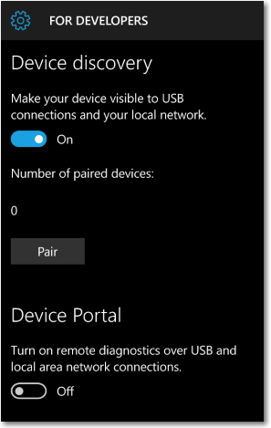
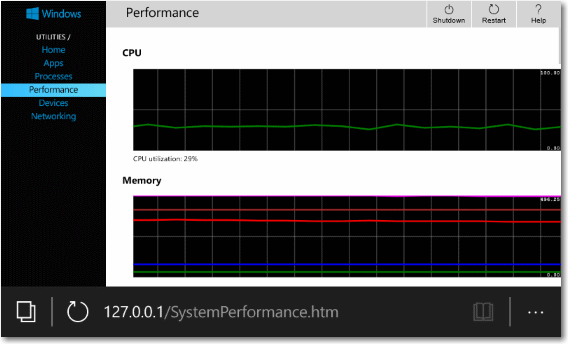

# Activer votre appareil pour le développement

Il existe une approche différente pour le développement des appareils Windows 10. Il n’est plus nécessaire de disposer d’une licence de développeur pour chacun des appareils que vous souhaitez utiliser pour développer, installer ou tester votre application. Il vous suffit de configurer votre appareil une seule fois pour ces tâches, à partir des paramètres. Et le tour est joué. Plus de renouvellement de vos licences de développeur tous les 30 ou 90 jours !

Si vous utilisez toujours un appareil Windows 8.1 pour développer ou tester vos applications avec Microsoft Visual Studio 2013 ou Microsoft Visual Studio 2015, il vous faut [obtenir une licence de développeur](https://msdn.microsoft.com/library/windows/apps/Hh974578) ou [enregistrer votre Windows Phone](https://msdn.microsoft.com/library/windows/apps/Dn614128).

## Utiliser les fonctionnalités de développement

### Développer votre application avec Microsoft Visual Studio

Si vous utilisez Microsoft Visual Studio sur un appareil Windows 10 et que vous ouvrez une solution dédiée à une application Windows 8.1 ou Windows 10, vous êtes invité à activer votre appareil avec cette boîte de dialogue. Vous devez activer votre appareil pour l’utilisation des concepteurs et le débogage de votre application.

Lorsque cette boîte de dialogue s’affiche, cliquez sur **Paramètres pour les développeurs** pour accéder directement à la page **Mise à jour et sécurité**, comme illustré ci-dessous. Ou bien cliquez sur **OK**, puis suivez les étapes ci-dessous pour activer votre appareil Windows 10 pour le développement.

### Activer vos appareils Windows 10

Pour Windows 10, vous sélectionnez les fonctionnalités de développement que vous souhaitez activer sur l’appareil. Cela vaut pour tous les appareils Windows 10 : ordinateurs de bureau, tablettes et téléphones. Vous pouvez activer un appareil pour le développement, ou simplement pour procéder à un chargement indépendant.

-   Le *chargement indépendant* consiste en l’installation puis à l’exécution ou au test d’une application qui n’a pas été certifiée par le Windows Store. Il peut par exemple s’agir d’une application utilisée en interne au sein de votre entreprise.
-   Le *mode développeur* vous permet de procéder au chargement indépendant des applications et d’exécuter des applications à partir de Visual Studio en mode débogage.

**Remarque** Si vous effectuez un chargement indépendant des applications, veillez à recourir à des sources fiables. Lorsque vous procédez au chargement indépendant d’une application qui n’a pas été certifiée par le Windows Store, vous indiquez que vous avez obtenu l’ensemble des droits nécessaires au chargement indépendant de cette application et que vous êtes l’unique responsable des dommages résultant de l’installation et de l’exécution de cette application. Voir la section Windows &gt; Windows Store de cette [déclaration de confidentialité](http://go.microsoft.com/fwlink/?LinkId=521839).

**Pour utiliser les fonctionnalités de développement**

1.  Sur l’appareil que vous souhaitez activer, accédez aux **Paramètres**. Choisissez **Mise à jour et sécurité**, puis **Pour les développeurs**.
2.  Choisissez le niveau d’accès dont vous avez besoin. Pour plus d’informations sur les options, voir [Quels paramètres choisir : Charger la version test des applications ou Mode développeur ?](#WhichSettings)
3.  Lisez la clause d’exclusion de responsabilité pour le paramètre choisi, puis cliquez sur **Oui** pour accepter la modification.

Voici la page des paramètres relative à la famille d’appareils de bureau.

Voici la page des paramètres relative à la famille d’appareils mobiles.

### Quels paramètres choisir : Charger la version test des applications ou Mode développeur ?

Par défaut, vous pouvez installer des applications de plateforme Windows universelle (UWP) uniquement à partir du Windows Store. La modification de ces paramètres en vue d’utiliser les fonctionnalités de développement peut entraîner la modification du niveau de sécurité de votre appareil. N’installez pas d’applications à partir de sources non vérifiées.

**Charger la version test des applications**

Le paramètre Charger la version test des applications est généralement utilisé par des sociétés ou écoles qui ont besoin d’installer des applications personnalisées sur des appareils gérés sans passer par le Windows Store. Dans ce cas, l’organisation applique généralement une stratégie visant à désactiver le paramètre *Applications du Windows Store*, comme illustré précédemment dans l’image de la page des paramètres du téléphone. L’organisation fournit également le certificat nécessaire et l’emplacement d’installation pour le chargement indépendant des applications. Pour plus d’informations, voir les articles TechNet [Charger la version test d’applications dans Windows 10](https://technet.microsoft.com/library/mt269549.aspx) et [Prendre en main le déploiement d’applications dans Microsoft Intune](https://technet.microsoft.com/library/dn646955.aspx).

Informations spécifiques à la famille d’appareils

-   Sur la famille d’appareils de bureau : vous pouvez installer un package d’application (.appx) et tout certificat nécessaire à l’exécution de l’application en exécutant le script Windows PowerShell créé avec le package (« Add-appdevpackage.ps1 »).

-   Sur la famille d’appareils mobiles : si le certificat requis est déjà installé, vous pouvez appuyer sur le fichier pour installer tout fichier .appx reçu par courrier électronique ou sur une carte SD.

Le paramètre **Charger la version test des applications** constitue une option plus sécurisée que le mode développeur, car vous ne pouvez pas installer d’applications sans certificat approuvé sur l’appareil.

**Mode développeur**

Le paramètre Mode développeur est proposé en plus du chargement indépendant. Il offre une fonction de débogage et d’autres options de déploiement. Il remplace l’exigence de Windows 8.1 relative à la détention d’une licence de développeur.

Informations spécifiques à la famille d’appareils

-   Sur la famille d’appareils de bureau :

    Activez le mode développeur pour développer et déboguer des applications dans Visual Studio. Comme mentionné précédemment, une invite s’affichera dans Visual Studio si le mode développeur n’est pas activé.

-   Sur la famille d’appareils mobiles :

    Activez le mode développeur pour déployer des applications à partir de Visual Studio et les déboguer sur l’appareil.

    Vous pouvez appuyer sur le fichier pour installer tout fichier .appx reçu par courrier électronique ou sur une carte SD. N’installez pas d’applications à partir de sources non vérifiées.

**Conseil**  
Vous pouvez utiliser plusieurs outils pour déployer une application à partir d’un PC Windows 10 sur un appareil mobile Windows 10. Les deux appareils doivent être connectés au même sous-réseau du réseau par une connexion filaire ou sans fil, ou ils doivent être connectés par USB. Dans tous les cas, seul le package d’application (.appx) est installé et non les certificats.

-   Utilisez l’outil de déploiement d’applications Windows 10 (WinAppDeployCmd). En savoir plus sur [l’outil WinAppDeployCmd](http://msdn.microsoft.com/library/windows/apps/mt203806.aspx).
-   À partir de Windows 10 version 1511, vous pouvez utiliser [Device Portal](#device_portal) pour effectuer un déploiement à partir de votre navigateur sur un appareil mobile exécutant Windows 10 version 1511 ou ultérieure. Utilisez la page **Applications** dans Device Portal (&lt;IP&gt;/appmanager.md) pour charger un package d’application (.appx) et l’installer sur l’appareil.

 

### Définir des stratégies de groupe ou des clés de registre

Vous pouvez également utiliser des stratégies de groupe ou des clés de Registre pour activer votre appareil de bureau Windows 10 pour le développement.

**Sur la famille d’appareils de bureau**

Utilisez gpedit.msc pour définir les stratégies de groupe afin d’activer votre appareil, sauf si vous disposez de Windows 10 Famille. Si vous disposez de Windows 10 Famille, vous devez exécuter des commandes regedit ou PowerShell pour définir les clés de Registre directement afin d’activer votre appareil.

**Utiliser gpedit afin d’activer votre appareil**

1.  Exécutez **Gpedit.msc**.
2.  Accédez à Local Computer Policy &gt; Computer Configuration &gt; Administrative Templates &gt; Windows Components &gt; App Package Deployment.
3.  Pour activer le chargement indépendant, modifiez les stratégies afin d’activer :

    -   **Autoriser l’installation des applications approuvées**

    - - ou -

    Pour activer le mode développeur, modifiez les stratégies pour activer les deux options suivantes :

    -   **Autoriser l’installation des applications approuvées**
    -   **Autorise le développement d’applications du Windows Store et leur installation depuis un environnement de développement intégré**

4.  Redémarrez votre machine.

**Utiliser regedit pour activer votre appareil**

1.  Exécutez **regedit**.
2.  Pour activer le chargement indépendant, définissez cette valeur DWORD sur 1 :

    -   **HKLM\\SOFTWARE\\Microsoft\\Windows\\CurrentVersion\\AppModelUnlock\\AllowAllTrustedApps**

    - - ou -

    Pour activer le mode développeur, définissez ces valeurs DWORD sur 1 :

    -   **HKLM\\SOFTWARE\\Microsoft\\Windows\\CurrentVersion\\AppModelUnlock\\AllowDevelopmentWithoutDevLicense**

**Utiliser PowerShell pour activer votre appareil**

1.  Exécutez PowerShell avec des privilèges administrateur.
2.  Pour activer le chargement indépendant, exécutez cette commande :

    -   **PS C:\\WINDOWS\\system32&gt; reg add "HKEY\_LOCAL\_MACHINE\\SOFTWARE\\Microsoft\\Windows\\CurrentVersion\\AppModelUnlock" /t REG\_DWORD /f /v "AllowAllTrustedApps" /d "1"**

    - - ou -

    Pour activer le mode développeur, exécutez cette commande :

    -   **PS C:\\WINDOWS\\system32&gt; reg add "HKEY\_LOCAL\_MACHINE\\SOFTWARE\\Microsoft\\Windows\\CurrentVersion\\AppModelUnlock" /t REG\_DWORD /f /v "AllowDevelopmentWithoutDevLicense" /d "1"**

## Fonctionnalités de développement pour les appareils mobiles

À partir de Windows 10 version 1511, des fonctionnalités de développement supplémentaires sont disponibles pour la famille d’appareils mobiles. Ces fonctionnalités sont disponibles uniquement lorsque le **mode développeur** est activé sur l’appareil.

### Détection et couplage d’appareils

(Windows 10 version 1511 ou ultérieure, famille d’appareils mobiles uniquement)

Pour vous connecter à Device Portal, vous devez activer la détection d’appareils. Cela vous permet de coupler votre téléphone avec un PC ou un autre appareil Windows 10. Les deux appareils doivent être connectés au même sous-réseau du réseau par une connexion filaire ou sans fil, ou ils doivent être connectés par USB.

La première fois que vous vous connectez à Device Portal, vous êtes invité à entrer un code de sécurité à 6 caractères (avec respect de la casse). Cela garanti votre accès au téléphone et vous préserve des attaques. Appuyez sur le bouton **Coupler** de votre téléphone pour générer et afficher le code, puis entrez les 6 caractères dans la zone de texte du navigateur.

### Device Portal

(Windows 10 version 1511 ou ultérieure, famille d’appareils mobiles uniquement)

Device Portal vous permet d’afficher les informations de diagnostic et d’interagir avec votre téléphone sur HTTP à l’aide de votre navigateur. Vous pouvez utiliser Device Portal pour :

-   afficher la liste des processus en cours d’exécution sur le téléphone ;
-   installer, supprimer, démarrer et arrêter des applications sur votre téléphone ;
-   modifier les profils de connexion Wi-Fi et afficher la force du signal (ipconfig) ;
-   afficher les graphiques d’utilisation du processeur, de la mémoire, des E/S, du réseau et du GPU en temps réel ;
-   arrêter votre téléphone.

L’image suivante illustre la page **Performance** lorsque Device Portal est exécuté localement sur le navigateur du téléphone.

Vous pouvez vous connecter à Device Portal de 3 façons : USB, hôte local et sur le réseau local (y compris avec VPN et fonction modem).

**Pour se connecter à Device Portal**

1.  Dans votre navigateur, entrez l’adresse indiquée ici selon le type de connexion que vous utilisez.

    -   USB : http://127.0.0.1:10080

        Utilisez cette adresse lorsque le téléphone est connecté à un PC par le biais d’une connexion USB. Les deux appareils doivent disposer de Windows 10 version 1511 ou ultérieure.

    -   Hôte local : http://127.0.0.1

        Utilisez cette adresse pour afficher Device Portal localement sur le téléphone dans Microsoft Edge pour Windows 10 Mobile.

    -   Réseau local : https://*&lt;Adresse IP du téléphone&gt;*

        Utilisez cette adresse pour établir la connexion par le biais d’un réseau local.

        L’adresse IP du téléphone est affichée dans les paramètres Device Portal sur le téléphone. Une connexion HTTPS est requise pour l’authentification et la communication sécurisée.

2.  Appuyez sur le bouton **Coupler** de votre téléphone pour générer et afficher le code de sécurité requis.
3.  Entrez le code de sécurité à 6 caractères dans la zone de mot de passe de Device Portal, dans votre navigateur.
4.  (Facultatif) Activez la case à cocher **Mémoriser mon ordinateur** dans votre navigateur afin de mémoriser ce couplage.

Voici la section Device Portal de la page des paramètres du développeur sur Windows Phone.

Si vous utilisez Device Portal dans un environnement protégé, comme un laboratoire de test, où vous faites confiance à tous les utilisateurs du réseau local, si aucune information personnelle n’est présente sur votre appareil et si vous présentez des exigences uniques, vous pouvez désactiver l’authentification. Cela permet une communication non chiffrée. Toute personne connaissant l’adresse IP de votre téléphone pourra le contrôler.

### Rapport d’erreurs

(Windows 10 version 1511 ou ultérieure, famille d’appareils mobiles uniquement)

Définissez cette valeur pour spécifier le nombre de vidages sur incident enregistrés sur votre téléphone.

La collecte des vidages sur incident sur votre téléphone vous permet d’accéder aux informations d’incident importantes immédiatement après l’incident. Les vidages sont collectés uniquement pour les applications signées par les développeurs. Vous pouvez trouver les vidages dans le système de stockage de votre téléphone, dans le dossier Documents\Debug. Pour plus d’informations sur les fichiers de vidage, voir [Utiliser les fichiers de dump pour déboguer les pannes et les blocages d’application dans Visual Studio](https://msdn.microsoft.com/library/d5zhxt22.aspx).

## Mise à niveau de votre appareil de Windows 8.1 vers Windows 10

Après avoir créé des applications ou effectué un chargement indépendant d’applications sur votre appareil Windows 8.1, vous devez installer une licence de développeur. Si vous mettez à niveau votre appareil de Windows 8.1 vers Windows 10, ces informations sont conservées. Exécutez la commande suivante pour les supprimer de votre appareil Windows 10 mis à niveau. Cette étape n’est pas obligatoire si vous effectuez une mise à niveau directement de Windows 8.1 vers Windows 10 version 1511 ou ultérieure.

**Pour annuler l’inscription d’une licence de développeur**

1.  Exécutez PowerShell avec des privilèges administrateur.
2.  Exécutez la commande suivante : **unregister-windowsdeveloperlicense**.

Après cela, vous devez activer votre appareil pour le développement, comme décrit dans cette rubrique, afin de pouvoir continuer à développer dessus. Si vous ne le faites, vous risquez d’obtenir une erreur quand vous déboguez votre application ou tentez de créer un package pour celle-ci. Voici un exemple de cette erreur :

Erreur : DEP0700 : Échec de l’inscription de l’application.

<!--HONumber=Mar16_HO1-->
