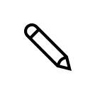
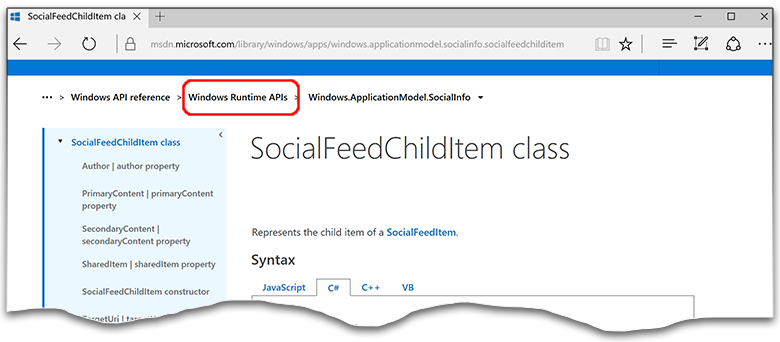

<link rel="stylesheet" href="https://az835927.vo.msecnd.net/sites/uwp/Resources/css/custom.css">

# Et après ?

Donc, vous voulez écrire une application et la publier dans le Windows Store : par où commencer ? Si vous découvrez la plateforme UWP, certaines vidéos de <a href="https://channel9.msdn.com/">Channel 9</a> et formations de la <a href="https://mva.microsoft.com">Microsoft Virtual Academy</a> pourront vous être utiles. Si les langages XAML et C# vous sont déjà familiers, commencez par lire les rubriques ci-dessous ou accédez directement au [téléchargement de certains exemples](https://msdn.microsoft.com/windows/uwp/get-started/get-uwp-app-samples).

De nombreux outils et infrastructures sont disponibles pour vous aider à écrire des applications et prennent en charge le développement sur plusieurs plateformes. Par exemple, si vous souhaitez écrire des jeux 2D, vous avez intérêt à consulter <a href="http://www.monogame.net">Monogame</a> ou certaines [infrastructures JavaScript/HTML](https://html5gameengine.com/). Pour les jeux en 3D, il y a <a href="http://www.unity3d.com">Unity</a>, et n’oubliez pas <a href="http://www.xamarin.com">Xamarin</a> si les appareils mobiles constituent votre objectif.

Si vous êtes débutant, nous vous recommandons de parcourir les rubriques sur la plateforme UWP de façon à obtenir une idée générale, puis d’essayer de créer votre interface utilisateur à l’aide de contrôles XAML que vous pourrez ensuite personnaliser. Vous allez utiliser XAML pour organiser votre application ([ce didacticiel](../layout/grid-tutorial.md) vous décrit la marche à suivre), mais le principal atout de ce langage est l’utilisation de la *liaison de données*, qui associe les contrôles aux informations que votre application souhaite afficher : si vous n’êtes pas familier de la plateforme Windows, il s’agit d’un concept important que vous devez assimiler. 
<table class="wdg-noborder">
<tr>
 <td width=60></td>
    <td><h2>Plateforme UWP et cycle de vie des applications UWP</h2>
Comment une application démarre-t-elle et que se passe-t-il quand vous en démarrez une autre ? Voici la réponse.
 <ul>
    <li><a href="https://msdn.microsoft.com/windows/uwp/get-started/universal-application-platform-guide">Guide des applications pour la plateforme Windows universelle (UWP)</a></li>
    <li><a href="https://msdn.microsoft.com/windows/uwp/launch-resume/app-lifecycle">Cycle de vie des applications UWP</a></li>
    <li><a href="https://developer.microsoft.com/windows/windows-10-for-developers">Nouveautés intéressantes de Windows 10</a></ul></td>  
</tr>
<tr>
 <td width=60></td>
    <td><h2>Expérience utilisateur et interface utilisateur</h2>
De quels contrôles disposez-vous et comment les utiliser ? Ces rubriques vous expliquent comment les contrôles et le code fonctionnent ensemble et comment vous pouvez les personnaliser en fonction de l’apparence que vous voulez donner à votre application.
 <ul>
    <li><a href="https://developer.microsoft.com/windows/design">Conception et interface utilisateur</a></li>
    <li><a href="https://msdn.microsoft.com/windows/uwp/layout/layouts-with-xaml">Définir des dispositions de pages avec XAML</a></li>
    <li><a href="https://msdn.microsoft.com/windows/uwp/controls-and-patterns/controls-by-function">Contrôles par fonction</a></li>
      <li><a href="https://msdn.microsoft.com/windows/uwp/controls-and-patterns/controls-and-events-intro">Présentation des contrôles et des modèles</a></li>
     <li><a href="https://msdn.microsoft.com/windows/uwp/controls-and-patterns/styling-controls">Application de styles aux contrôles</a></li>
      <li><a href="https://msdn.microsoft.com/windows/uwp/layout/screen-sizes-and-breakpoints-for-responsive-design">Tailles d’écran et points d’arrêt pour la conception réactive</a></li>
      <li><a href="https://developer.microsoft.com/windows/projects/campaigns/welcome-toolbox">Utilisez le kit de ressources de la communauté UWP pour obtenir une sélection de modèles et de contrôles préintégrés</a></li>
    </ul></td>  
</tr>
<tr>
 <td width=60></td>
    <td><h2>Données et services</h2>
Découvrez les principes de la liaison de données, qui permet de faire remplir automatiquement les listes et les grilles par votre code. Découvrez comment vous lier à des ressources externes pour permettre à vos applications d’obtenir des données.
 <ul>
    <li><a href="https://msdn.microsoft.com/windows/uwp/data-binding/index">Liaison de données</a></li>
    <li><a href="https://msdn.microsoft.com/windows/uwp/controls-and-patterns/listview-and-gridview">Contrôles ListView, GridView et liaison de données</a></li>
     <li><a href="https://msdn.microsoft.com/windows/uwp/data-access/index">Accès aux données</a></li>
    </ul></td>  
</tr>
<tr>
 <td width=60></td>
    <td><h2>Publication</h2>
Partagez votre travail avec le monde entier et tirez-en profit. Nous vous montrerons comment publier votre application sur le Windows Store.
 <ul>
    <li><a href="https://msdn.microsoft.com/windows/uwp/publish/index">Publier des applications Windows</a></li>
    <li><a href="https://msdn.microsoft.com/windows/uwp/packaging/index">Création de packages d’application</a></li>
    </ul></td>  
</tr>
<tr>
 <td width=60></td>
    <td><h2>Autres ressources</h2>
Exemples, didacticiels, vidéos et autres outils et Kits de développement logiciel (SDK). Passez à la vitesse supérieure.

    <ul>
    <li><a href="https://developer.microsoft.com/windows/develop">Articles sur les procédures</a></li>
    <li><a href="https://developer.microsoft.com/windows/samples">Exemples de code</a></li>
    <li><a href="https://msdn.microsoft.com/library/618ayhy6(VS.110).aspx">Informations de référence sur C#</a></li>
    <li><a href="https://msdn.microsoft.com/library/windows/apps/bg124285.aspx">Informations de référence sur les API</a></li>
     <li><a href="https://msdn.microsoft.com/windows/uwp/xbox-apps/index">Écriture d’applications pour Xbox One</a></li>
     <li><a href="https://www.microsoft.com/microsoft-hololens/developers">Développer pour HoloLens</a></li>
     <li><a href="https://msdn.microsoft.com/windows/uwp/porting/index">Portage d’applications vers Windows 10</a></li>
      <li><a href="https://msdn.microsoft.com/windows/uwp/enterprise/index">Écriture d’applications pour l’entreprise</a></li>
      <li><a href="https://blogs.windows.com/buildingapps/2016/08/17/introducing-the-uwp-community-toolkit/#D1IfVxCZMQGZqlc7.97">Kit de ressources de la communauté UWP</a></li>
    </ul>
    </td>  
</tr>
</table>

## Blog des développeurs Windows

Le [Blog des développeurs Windows](https://blogs.windows.com/buildingapps) publie régulièrement des articles sur les dernières techniques de codage, les idées de projet et les outils. En voici quelques-uns qui peuvent vous intéresser lorsque vous explorez le développement sous Windows.

* [Animations avec la couche visuelle](https://blogs.windows.com/buildingapps/2016/09/16/animations-with-the-visual-layer/#JM2XkQcL7MRSXe3X.97)
* [Interopérabilité entre XAML et la couche visuelle](https://blogs.windows.com/buildingapps/2016/08/26/interop-between-xaml-and-the-visual-layer/#ue6O7MWpqrVFE81K.97)
* [Création d’effets magnifiques pour UWP](https://blogs.windows.com/buildingapps/2016/09/12/creating-beautiful-effects-for-uwp/#85jsfw6PFXX825rR.97)
* [Conception simplifiée d’applications soignées Windows.UI](https://blogs.windows.com/buildingapps/2016/08/23/beautiful-apps-made-possible-and-easy-with-windows-ui/#GBREkRSBwsRvi2uL.97)
* [Amélioration de votre application avec l’animation et les signaux audio](https://blogs.windows.com/buildingapps/2016/08/09/polishing-your-app-with-animations-and-audio-cues/#hziKxt2xPwUE1oqU.97) 
* [Ajout de couleurs à votre conception](https://blogs.windows.com/buildingapps/2016/07/28/adding-color-to-your-design/#HcPqMlfPsuKETOIo.97)

## Accès à l’aide dans le Centre de développement

Le [Centre de développement Microsoft](http://developer.microsoft.com) propose une documentation riche et variée pour divers outils, infrastructures et plateformes. Quand vous recherchez des rubriques et des exemple, vérifiez qu’elles portent bien sur UWP. Comment s’assurer que vous lisez le bon contenu ?
Le contenu conceptuel, autrement dit, le contenu de référence hors API, est reconnaissable à la présence du terme « UWP » dans l’URL des rubriques. Le chemin d’accès au contenu sur les API contient« API Windows Runtime ». 

Si vous utilisez un moteur de recherche, le fait d’ajouter « Développement d’applications Windows » à votre chaîne de recherche vous conduira la plupart du temps à du contenu UWP.

## Rubriques importantes du Centre de développement

Voici la liste des principales sections de contenu dans le Centre de développement. 

<table style="width:100%">
<colgroup>
<col width="20%" />
<col width="80%" />
</colgroup>

<tbody>

<tr class="even" style="background-color: #f2f2f2">
<td align="left"><strong>Conception</strong></td>
<td align="left"><a href="http://go.microsoft.com/fwlink/p/?LinkId=533896">Recommandations en matière de conception pour les applications UWP.</a></td>
</tr>

<tr class="odd" style="background-color: #ffffff">
<td align="left"><strong>Développement</strong></td>
<td align="left"><a href="http://go.microsoft.com/fwlink/p/?LinkId=529575">Informations détaillées et exemples de codage pour la plupart des fonctionnalités accessibles à votre application.</a></td>
</tr>
<tr class="even" style="background-color: #f2f2f2">
<td align="left"><strong>Informations de référence sur les langages</strong></td>
<td align="left"><a href="https://msdn.microsoft.com/library/windows/apps/bg124285.aspx">Langages de programmation disponibles pour le développement UWP.</a></td>
</tr>
<tr class="odd" style="background-color: #ffffff">
<td align="left"><strong>Jeux</strong></td>
<td align="left"><a href="http://go.microsoft.com/fwlink/p/?LinkId=534184">Développement de jeux avec DirectX.</a></td>
</tr>
<tr class="even" style="background-color: #f2f2f2">
<td align="left"><strong>IoT (Internet des objets)</strong></td>
<td align="left"><a href="http://go.microsoft.com/fwlink/p/?LinkId=534186">Création de vos propres appareils connectés.</a></td>
</tr>
<tr class="odd" style="background-color: #ffffff">
<td align="left"><strong>Portage</strong></td>
<td align="left"><a href="https://msdn.microsoft.com/library/windows/apps/Mt238321">Exploitez vos compétences iOS et Android pour créer rapidement des applications UWP.</a></td>
</tr>
<tr class="even" style="background-color: #f2f2f2">
<td align="left"><strong>Ponts Windows</strong></td>
<td align="left"><a href="https://developer.microsoft.com/windows/bridges">Outils destinés à mettre à jour les anciennes applications et les applications iOS vers UWP.</a></td>
</tr>
<tr class="odd" style="background-color: #ffffff">
<td align="left"><strong>Xamarin</strong></td>
<td align="left"><a href="https://www.xamarin.com">Utilisez C# pour écrire des applications pour iOS, Android et Windows 10.</a></td>
</tr>
<tr class="even" style="background-color: #f2f2f2">
<td align="left"><strong>Extraits de tâches</strong></td>
<td align="left"><a href="https://github.com/Microsoft/Windows-task-snippets">Code prêt à l’emploi qui accomplit des tâches simples mais utiles.</a></td>
</tr>
<tr class="odd" style="background-color: #ffffff">
<td align="left"><strong>Rubriques de procédures</strong></td>
<td align="left"><a href="https://developer.microsoft.com/windows/develop">Exemple de code portant sur des fonctionnalités UWP spécifiques.</a></td>
</tr>
<tr class="even" style="background-color: #f2f2f2">
<td align="left"><strong>Matériel</strong></td>
<td align="left"><a href="https://www.microsoftstore.com/store/msusa/en_US/cat/Developer/categoryID.69418300?icid=en_US_Store_UH_BusEd_Dev">Matériel pour les développeurs du Microsoft Store</a></td>
</tr>
</table>

