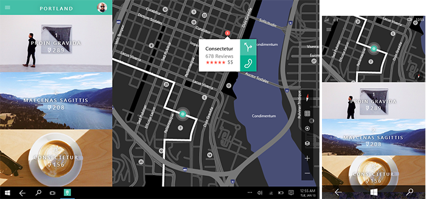

#  Planifier votre application de plateforme Windows universelle (UWP)

Les équipes de conception Microsoft suivent un processus de création d’applications en cinq étapes distinctes : concept, structure, dynamique, visuels et prototype. Nous vous encourageons à adopter un processus similaire en prenant plaisir à créer des expériences novatrices dont tout le monde pourra profiter.

## Concept

**Se concentrer sur l’application**

Durant la planification de votre application de plateforme Windows universelle (UWP), vous devez déterminer sa finalité et sa cible, mais aussi ses points forts. Au cœur de chaque application réussie se trouve un concept puissant, qui offre une base solide.

Supposons que vous souhaitiez créer une application de photographie. En cherchant les raisons qui pousseraient quelqu’un à utiliser votre application, à l’enregistrer et à partager ses photos, vous arrivez à la conclusion que ses objectifs seraient de faire revivre des souvenirs, de rester en contact avec des proches grâce aux photos et de conserver celles-ci en lieu sûr. Voilà en quoi votre application doit exceller. Ces objectifs doivent vous guider tout au long du processus de conception.

**Quel est l’objet de votre application?** Commencez avec un concept élargi et faites l’inventaire des tâches que votre application peut aider à effectuer.

Par exemple, imaginons que vous souhaitiez créer une application qui aide les utilisateurs à planifier leurs voyages. Voici quelques idées que vous pourriez commencer par noter :

-   Trouver des cartes de tous les lieux d’un itinéraire et les emporter pour le voyage.
-   Rechercher tous les événements qui se produisent dans une ville donnée.
-   Pouvoir créer des listes individuelles, et partageables avec ses compagnons de voyage, des activités et des attractions incontournables.
-   Permettre à des compagnons de voyage de rassembler toutes leurs photos pour les partager avec leurs amis et leur famille.
-   Trouver des destinations conseillées en fonction du prix des vols.
-   Trouver une liste d’offres de restaurants, de boutiques et d’activités regroupées sur le lieu de voyage.

**Quels sont les points forts de votre application?** Prenez du recul et analysez votre liste d’idées pour voir s’il en ressort un scénario particulier. Obligez-vous à réduire cette liste pour arriver à un seul scénario sur lequel vous concentrer. En cours de processus, vous serez peut-être amené à supprimer de nombreuses bonnes idées, mais, pour aboutir à un excellent scénario unique, vous devez être rigoureux.

Lorsque vous avez choisi un scénario unique, décidez comment vous expliqueriez les capacités de votre application à une personne lambda, par écrit, en une phrase. Par exemple :

-   Mon application de voyage est excellente pour aider des amis à créer ensemble des itinéraires pour des voyages en groupe.
-   Mon application d’entraînement est excellente pour permettre à des amis de suivre leurs progrès et de partager leurs résultats.
-   Mon application de courses est excellente pour aider les familles à organiser leurs courses hebdomadaires et pour leur éviter d’oublier certains achats ou d’en faire en double.

Cette liste de points forts peut orienter un grand nombre de décisions et d’arbitrage de conception à prendre durant la création de votre application. Concentrez-vous sur une liste de scénarios d’utilisation de votre application, et veillez à ne pas transformer cette liste en une énumération de fonctionnalités. Il s’agit de répertorier ce que vos utilisateurs pourront faire, pas votre application.

**L’entonnoir de conception**

Il est très tentant (après avoir eu une idée intéressante) de se lancer et de la développer, et peut-être même de l’amener à un stade avancé en matière de production. Mais admettons que les choses se passent ainsi, quand soudain une autre idée intéressante se présente. Il est naturel que vous soyez tenté de vous en tenir à l’idée dans laquelle vous vous êtes investi, indépendamment des mérites que peuvent avoir ces deux idées. Si seulement vous aviez pensé plus tôt à cette autre idée au cours du processus ! Justement, l’entonnoir de conception est une technique qui vous aide à découvrir vos meilleures idées le plus tôt possible.

Le terme « entonnoir » provient de la forme de cette technique. À l’extrémité large de l’entonnoir, de nombreuses idées sont injectées, chacune étant représentée par un artefact de conception peu précis (via un croquis, peut-être, ou un paragraphe de texte). Au fur et à mesure que cet ensemble d’idées circule jusqu’à l’extrémité étroite de l’entonnoir, le nombre d’idées baisse alors que la précision des artefacts qui représentent ces idées augmente. Chaque artefact doit cibler uniquement les informations nécessaires pour comparer les idées ou pour répondre à une question particulière telle que «est-ce utilisable?» ou «est-ce intuitif?». *N’y consacrez pas plus de temps et d’efforts que nécessaire*. Vous abandonnerez certaines idées en les testant, ce qui est une bonne chose, car vous n’aurez pas à vous investir davantage dans ces dernières. Les idées qui continuent leur chemin dans l’entonnoir seront prises en considération de manière plus fine. Au final, il restera un seul artefact de conception qui représentera l’idée gagnante. Il s’agit de l’idée qui gagne en raison de ses mérites, et pas simplement parce qu’elle vous est venue en premier. Ainsi, vous concevrez la meilleure application possible.

## Structure

**L’organisation rend tout plus facile**

Quand vous êtes satisfait de votre concept, vous êtes prêt pour la prochaine étape: la création du plan de votre application. L’architecture de l’information donne à votre contenu l’intégrité structurelle dont il a besoin. Il permet de définir le modèle de navigation de votre application et, en fin de compte, son identité. En planifiant l’organisation de votre contenu et la façon dont vos utilisateurs vont le découvrir, vous pouvez vous faire une meilleure idée du ressenti des utilisateurs face à votre application.

Une bonne architecture de l’information facilite les scénarios d’utilisation et vous aide à envisager les écrans principaux. L’application [Audible](http://go.microsoft.com/fwlink/p/?LinkID=268089), par exemple, se lance directement dans une page Hub, qui permet d’accéder à la bibliothèque, au magasin, aux informations et aux statistiques de l’utilisateur. L’expérience est ciblée, pour permettre aux utilisateurs d’obtenir rapidement des livres audio et d’en profiter. À des niveaux plus profonds, l’application se concentre sur des tâches plus spécifiques.

Pour obtenir des recommandations à ce sujet, voir [Informations de base relatives à la conception de la navigation](../layout/navigation-basics.md).

## Dynamique

**Exécuter votre concept**

Si l’étape de concept permet de définir la finalité de votre application, l’étape dynamique consiste à atteindre cette finalité. Il existe de nombreuses façons d’y parvenir, par exemple en utilisant des maquettes de fil de fer pour esquisser vos flux de page (comment aller d’un point à un autre dans l’application pour atteindre les objectifs), ainsi qu’en réfléchissant au ton et aux mots utilisés dans l’ensemble de l’interface utilisateur. La maquette de fil de fer est un outil de représentation rapide et globale, qui vous aide à prendre des décisions essentielles sur le flux d’utilisation de votre application.

Le flux de votre application doit être étroitement lié à votre liste de points forts et doit aider les utilisateurs à réaliser le scénario unique que vous souhaitez valoriser. Les applications réussies ont des flux faciles à assimiler qui nécessitent un effort minimal. Commencez à penser à un niveau écran à écran, et imaginez votre application comme si vous l’utilisiez pour la première fois. Quand vous définissez les situations d’utilisation des pages que vous créez, donnez aux utilisateurs exactement ce qu’ils veulent sans touches d’écran inutiles. La dynamique est également liée au mouvement. Les capacités de mouvement appropriées vont déterminer la fluidité et la facilité d’utilisation d’une page à l’autre.

Techniques courantes :

-   Présentez le flux : qu’est-ce qui arrive en premier, et ensuite ?
-   Détaillez le flux : comment les utilisateurs doivent-ils progresser au niveau de l’interface pour réaliser le flux ?
-   Prototype: testez le flux avec un prototype rapide.

**Que doivent pouvoir faire les utilisateurs?** Par exemple, l’application de voyage est «excellente pour aider des amis à créer ensemble des itinéraires pour des voyages en groupe». Établissons la liste des flux à activer:

-   Créer un voyage en utilisant des informations générales.
-   Inviter des amis à se joindre à un voyage.
-   Participer à un voyage avec des amis.
-   Voir les itinéraires recommandés par d’autres voyageurs.
-   Ajouter des destinations et des activités au voyage.
-   Modifier et commenter les destinations et les activités ajoutées par les amis.
-   Permettre à des amis et à la famille de suivre les itinéraires partagés.

## Éléments visuels

**Parler sans mots**

Une fois que vous avez créé la dynamique de votre application, vous pouvez mettre celle-ci en valeur en soignant son aspect visuel de façon appropriée. Des éléments visuels réussis définissent non seulement l’apparence de votre application, mais également la façon dont elle est perçue et la manière dont elle fonctionne via l’animation et le mouvement. Vos choix de palette de couleurs, d’icônes et d’illustrations ne sont que quelques exemples de ce langage visuel.

Chaque application possède sa propre identité, explorez donc les directions visuelles que vous pouvez prendre avec votre application. Laissez le contenu guider l’apparence de votre application, et non l’inverse.

## Prototype

**Peaufiner votre chef-d’œuvre**

Le prototypage est une étape de l’*entonnoir de conception* (technique dont nous avons parlé un peu plus tôt), où l’artefact qui représente votre idée se développe au-delà de l’esquisse, mais à un niveau moins complexe que celui d’une application complète. Un prototype peut être un flux d’écrans dessinés à la main et présentés à un utilisateur. La personne qui effectue le test peut répondre aux indications de l’utilisateur en plaçant différents écrans vers le bas, ou en collant/décollant de petites parties de l’interface utilisateur sur les pages, pour simuler une application en cours d’exécution. Un prototype peut également être une application très simple qui simule certains flux de travail, à condition que l’opérateur respecte un script établi et appuie sur les boutons appropriés. À ce stade, votre application prend vie et tout votre dur travail est mis à l’épreuve. Durant le prototypage des domaines de votre application, prenez le temps de façonner et d’affiner les éléments qui en ont le plus besoin.

À l’attention des nouveaux développeurs : n’oubliez pas que la conception d’applications réussies est un processus itératif. Nous vous recommandons de prototyper le plus tôt possible et souvent. Comme toute activité créatrice, les meilleures applications sont le fruit d’un processus intensif d’essais et d’erreurs.

## Identifier les fonctionnalités à inclure

Une fois que vous savez ce que veulent vos utilisateurs et comment les aider à y parvenir, vous pouvez étudier les outils spécifiques de votre boîte à outils. Passez la plateforme Windows universelle (UWP) en revue et associez des fonctionnalités pour répondre aux besoins de votre application. Veillez à suivre les [recommandations relatives à l’expérience utilisateur](https://msdn.microsoft.com/library/windows/apps/hh465424.aspx) pour chaque fonctionnalité.
<!--need URL for landing page -->

Techniques courantes:

-   Recherche au niveau de la plateforme: recherchez les fonctionnalités de la plateforme et comment vous pouvez les utiliser.
-   Diagrammes d’association: mettez en relation vos flux et les fonctionnalités.
-   Prototype: testez les fonctionnalités pour vérifier qu’elles répondent à vos besoins.

**Contrats d’application** Votre application peut participer à des contrats d’application qui autorisent les flux d’utilisateurs importants entre applications et fonctionnalités.

-   **Partage** Permet aux utilisateurs de partager du contenu de votre application par le biais d’autres applications, mais également de recevoir du contenu pouvant être partagé par d’autres contacts et d’autres applications.
-   **Lire sur** Permet aux utilisateurs de lire du contenu audio et vidéo ou des images, diffusés en continu depuis votre application sur d’autres appareils de leur réseau domestique.
-   **Sélecteur de fichiers et extensions du sélecteur de fichiers** Permet aux utilisateurs de charger et d’enregistrer leurs fichiers à partir du système de fichiers local, leurs dispositifs de stockage connectés, leur groupe résidentiel et d’autres applications. Vous pouvez également fournir une extension du sélecteur de fichiers pour permettre à d’autres applications de charger le contenu de votre application.

Pour plus d’informations, voir [Contrats et extensions d’application](https://msdn.microsoft.com/library/windows/apps/hh464906).
<!-- Win 8 page. Should have replacement. -->

**Différents affichages, facteurs de forme et configurations matérielles** Windows met les utilisateurs aux commandes et place votre application en première ligne. Vous voulez que l’interface utilisateur de votre application ressorte sur tous les appareils, à l’aide de n’importe quel mode d’entrée, avec toutes les orientations et configurations matérielles et dans toutes les circonstances d’utilisation.

**Tactile avant tout** Windows propose une expérience tactile unique qui dépasse la simple émulation des fonctionnalités de la souris.

Par exemple, le zoom sémantique permet de naviguer dans un grand volume de contenu en mode tactile. Les utilisateurs peuvent survoler ou faire défiler les catégories de contenu, puis zoomer pour afficher des informations de façon de plus en plus détaillée. Vous pouvez ainsi présenter votre contenu de façon plus tactile, visuelle et instructive qu’avec la navigation traditionnelle et les modèles de disposition tels que les onglets.

Vous pouvez évidemment tirer parti d’un certain nombre d’interactions tactiles permettant de faire pivoter, d’effectuer un mouvement panoramique, un balayage, etc. En savoir plus sur les [interactions tactiles et les autres interactions avec l’utilisateur](../input-and-devices/input-primer.md).

**Attrayante et d’actualité** Votre application sera moderne et attrayante avec ces expériences utilisateur proposées en standard:

-   **Animations** Utilisez notre bibliothèque d’animations pour rendre votre application rapide et fluide pour vos utilisateurs. Permet aux utilisateurs de comprendre les changements de contexte et assure l’homogénéité des expériences par des transitions visuelles. Découvrez tout ce qu’il faut savoir sur l’[animation de votre interface utilisateur](../graphics/animations-overview.md).
-   **Notifications toast** Permet aux utilisateurs d’identifier le contenu limité dans le temps ou qui peut les intéresser grâce à des notifications. Permet également d’inviter les utilisateurs à revenir dans votre application quand elle est fermée. En savoir plus sur les [vignettes, badges et notifications toast](../controls-and-patterns/tiles-badges-notifications.md).
-   **Vignettes d’application** Fournit des mises à jour actuelles et appropriées encourageant les utilisateurs à revenir sur votre application. Pour plus d’informations à ce sujet, voir la section suivante. En savoir plus sur les [vignettes d’application](../controls-and-patterns/tiles-and-notifications-creating-tiles.md).

**Personnalisation**

-   **Paramètres** Permet aux utilisateurs de créer une expérience dédiée en enregistrant des paramètres de l’application qui leur sont propres. Regroupe tous vos paramètres sur un seul écran, ce qui permet aux utilisateurs de configurer votre application via un mécanisme courant qu’ils maîtrisent déjà. En savoir plus sur l’[ajout de paramètres d’application](../app-settings/app-settings-and-data.md).
-   **Itinérance** Créez une expérience continue sur plusieurs appareils en rendant les données itinérantes. De cette façon, les utilisateurs peuvent reprendre une tâche à l’endroit précis où ils se sont arrêtés, et leur expérience utilisateur privilégiée est préservée quel que soit l’appareil utilisé. Votre application doit être facile à utiliser partout (du PC familial dans la cuisine au PC professionnel, en passant par la tablette personnelle et d’autres facteurs de forme), et conserver les paramètres et les états en itinérance. Pour en savoir plus, voir [Gestion des données d’application](../app-settings/store-and-retrieve-app-data.md) et [Recommandations en matière de données d’application itinérantes](https://msdn.microsoft.com/library/windows/apps/hh465094).
-   **Vignettes utilisateur** Permet aux utilisateurs de personnaliser votre application en chargeant leur propre image en vignette ou en définissant du contenu de votre application comme vignette personnelle dans Windows.

**Fonctionnalités des appareils** Veillez à ce que votre application tire pleinement parti des fonctionnalités des appareils actuels.

-   **Mouvements de proximité** Permettez aux utilisateurs de connecter leurs appareils avec ceux des autres utilisateurs à proximité en appuyant ces appareils l’un contre l’autre (jeux multijoueur). En savoir plus sur [les mouvements de proximité et le contact](https://msdn.microsoft.com/library/windows/apps/hh465229).
-   **Caméras et dispositifs de stockage externes** Connectez vos utilisateurs grâce aux caméras intégrées ou reliées à leur ordinateur pour qu’ils puissent discuter, participer à des conférences, enregistrer des vidéoblogues, prendre des photos pour leur profil, parler du monde qui les entoure ou participer à toute autre activité entrant dans le domaine de l’application. Découvrez tout ce qu’il faut savoir sur l’[accès à du contenu de stockage amovible](https://msdn.microsoft.com/library/windows/apps/hh465189).
-   **Accéléromètres et autres capteurs** De nos jours, les appareils intègrent un certain nombre de capteurs. Votre application peut assombrir ou éclaircir l’affichage en fonction de la lumière ambiante, réorganiser l’interface utilisateur si l’utilisateur fait pivoter l’affichage ou réagir à un mouvement. En savoir plus sur les [capteurs](../devices-sensors/sensors.md).
-   **Géolocalisation** Utilisez les informations de géolocalisation des données du web ou des capteurs de géolocalisation standard pour aider les utilisateurs à circuler, à repérer leur emplacement sur une carte ou à recevoir des renseignements sur les personnes, les activités et les destinations à proximité. En savoir plus sur la [géolocalisation](https://msdn.microsoft.com/library/windows/apps/hh465139).

Reprenons l’exemple de l’application de voyage. Pour réellement aider des amis à créer ensemble des itinéraires pour les voyages en groupe, vous pouvez utiliser quelques fonctionnalités, comme les suivantes pour n’en citer que certaines :

-   Partager : les utilisateurs partagent leurs prochains voyages et leurs itinéraires sur plusieurs réseaux sociaux et font découvrir les joies des préparatifs à leurs amis et leur famille.
-   Rechercher : les utilisateurs recherchent et trouvent des activités ou des destinations sur les itinéraires partagés ou publics d’autres utilisateurs et peuvent les ajouter à leurs propres voyages.
-   Notifications : les utilisateurs sont avertis lorsque des compagnons de voyage mettent à jour leurs itinéraires.
-   Paramètres : les utilisateurs configurent l’application selon leurs préférences, en définissant par exemple le voyage pour lequel ils reçoivent des notifications ou les groupes sociaux qui sont autorisés à faire des recherches dans leurs itinéraires.
-   Zoom sémantique : les utilisateurs naviguent dans toutes les étapes de leur itinéraire et peuvent zoomer pour afficher plus de détails dans la longue liste d’activités qu’ils ont planifiées.
-   Vignettes des utilisateurs : les utilisateurs choisissent l’avatar qu’ils souhaitent afficher lorsqu’ils partagent leur voyage avec leurs amis.

## Choisir le mode de monétisation de votre application

Il existe un grand nombre d’options vous permettant de gagner de l’argent avec votre application. Si vous décidez d’utiliser des publicités ou des ventes intégrées à l’application, vous devez concevoir une interface utilisateur adaptée. Pour plus d’informations, voir [Planifier la monétisation](../monetize/index.md).

## Concevoir l’expérience utilisateur de votre application

Il s’agit de partir sur la bonne base. Maintenant que vous connaissez les points forts de votre application et les flux à prendre en charge, vous pouvez réfléchir aux principes de base de la conception de l’expérience utilisateur.

**Comment organiser le contenu de l’interface utilisateur?**   La plupart du contenu de l’application peut être organisé sous forme de regroupements ou de hiérarchies. Ce que vous choisissez comme groupe de premier niveau pour votre contenu doit correspondre à votre liste de points forts.

Pour reprendre l’exemple de l’application de voyage, il existe de nombreuses façons de regrouper des itinéraires. Si l’objet principal de l’application est de découvrir des destinations intéressantes, vous pouvez les regrouper par centre d’intérêt : aventure, plaisirs ensoleillés ou destinations romantiques. Si votre application sert cependant à planifier des voyages avec des amis, il est plus sensé d’organiser des itinéraires en fonction des cercles sociaux, comme la famille, les amis ou les collègues.

Choisir le mode de regroupement de votre contenu vous permet de décider des pages ou des vues nécessaires dans votre application. Reportez-vous aux notions de base sur l’interface utilisateur pour plus d’informations.

**Comment présenter le contenu de l’interface utilisateur?** Une fois que vous avez décidé de l’organisation de votre interface utilisateur, vous pouvez définir les objectifs de l’expérience utilisateur qui spécifient la création et la présentation de cette interface à vos utilisateurs. Quel que soit le scénario, assurez-vous que vos utilisateurs peuvent continuer à profiter de votre application aussi rapidement que possible. Pour ce faire, déterminez les parties de votre interface utilisateur qui doivent être présentées en premier, puis vérifiez qu’elles sont complètes avant de passer du temps à générer les parties non essentielles.

Dans l’application de voyage, l’utilisateur souhaitera probablement trouver en premier un itinéraire de voyage. Pour présenter ces informations le plus rapidement possible, affichez la liste des voyages en premier à l’aide d’un contrôle **ListView**.

Une fois la liste des voyages affichée, vous pouvez charger d’autres fonctionnalités, par exemple un flux d’actualités relatif aux voyages des amis.

**De quelle interface utilisateur et de quelles commandes avez-vous besoin?**   Passez en revue les flux identifiés précédemment. Pour chaque flux, créez une ébauche des étapes entreprises par les utilisateurs.

Analysons le flux « Permettre à des amis et à la famille de suivre les itinéraires ». Supposons que l’utilisateur a déjà créé un voyage. Pour partager l’itinéraire d’un voyage, les étapes suivantes sont nécessaires :

1.  L’utilisateur ouvre l’application et voit la liste des voyages qu’il a créés.
2.  L’utilisateur appuie sur le voyage à partager.
3.  Les détails du voyage s’affichent à l’écran.
4.  L’utilisateur accède à certaines zones de l’interface utilisateur pour lancer le partage.
5.  L’utilisateur sélectionne ou entre l’adresse e-mail ou le nom de l’ami avec lequel il veut partager le voyage.
6.  L’utilisateur accède à certaines zones de l’interface utilisateur pour finaliser le partage.
7.  Votre application met à jour les informations du voyage avec la liste des personnes avec qui il a partagé son voyage.

Au cours de ce processus, vous entrevoyez le type d’interface utilisateur que vous devez créer et les informations supplémentaires à trouver (comme rédiger un modèle d’e-mail standard pour les amis qui n’utilisent pas encore votre application). Vous pouvez également commencer à supprimer certaines étapes inutiles. L’utilisateur n’a peut-être pas besoin de voir tous les détails du voyage avant de le partager, par exemple. Plus le flux est simple, plus il est facile à utiliser.

Pour en savoir plus sur l’utilisation des différentes surfaces, voir <!--[Command design basics](../layout/commanding-basics.md)-->.

**À quoi doit ressembler le flux?** Une fois les étapes de l’utilisateur définies, vous pouvez transformer ce flux en objectifs de performances. Pour plus d’informations, voir [Planifier les performances](../debug-test-perf/planning-and-measuring-performance.md).

**Comment organiser les commandes?**  Utilisez votre esquisse des étapes du flux pour identifier les commandes pour lesquelles vous devez effectuer la conception. Cherchez ensuite où ces commandes doivent être utilisées dans votre application.

-   **Essayez toujours d’utiliser le contenu.**  Laissez les utilisateurs manipuler directement, autant que possible, le contenu sur la zone de dessin, au lieu d’ajouter des commandes qui agissent sur le contenu. Par exemple, dans l’application de voyage, permettez aux utilisateurs de réorganiser leur itinéraire en faisant glisser et en déplaçant des activités d’une liste de la zone de dessin, plutôt qu’en sélectionnant l’activité et en utilisant les boutons haut et bas de la barre de commandes.
-   **Si vous ne pouvez pas utiliser le contenu.** Placez les commandes sur l’une des surfaces suivantes de l’interface utilisateur:

    -   Dans la [barre de commandes](https://msdn.microsoft.com/library/windows/apps/hh465302): placez la majorité des commandes sur la barre de commandes, généralement masquée jusqu’à ce que l’utilisateur appuie sur celle-ci pour la rendre visible.
    -   Sur la zone de dessin de l’application : si l’utilisateur consulte une page ou une vue avec un objectif unique, vous pouvez placer les commandes adéquates directement sur cette zone. Il doit y avoir très peu de commandes de ce type.
    -   Dans un [menu contextuel](https://msdn.microsoft.com/library/windows/apps/hh465308): vous pouvez utiliser des menus contextuels pour les actions du Presse-papiers (comme couper, copier et coller) ou pour les commandes qui concernent le contenu qui ne peut pas être sélectionné (ajouter une punaise pour localiser un lieu sur une carte, par exemple).

**Déterminez la disposition de votre application dans chaque affichage.**  Windows prend en charge les orientations paysage et portrait et le redimensionnement des applications à n’importe quelle largeur, du plein écran jusqu’à la largeur minimale. Vous devez faire en sorte que votre application fonctionne correctement et soit visuellement plaisante dans n’importe quelle taille, sur n’importe quel écran et dans n’importe quelle orientation. Cela signifie que vous devez planifier la disposition des éléments de votre interface utilisateur pour différentes tailles et affichages. Ainsi, l’interface utilisateur de l’application s’adapte de façon fluide pour répondre aux besoins et aux préférences de l’utilisateur.

Pour plus d’informations sur la conception d’applications dédiées à des tailles d’écran différentes, voir <!--[Responsive design 101](designing-in-effective-pixels.md)-->.

## Faire une bonne première impression

Gardez à l’esprit ce que vous voulez que vos utilisateurs pensent, ressentent ou fassent au moment où ils lancent votre application pour la première fois. Reportez-vous à votre liste de points forts. Même si vous n’aurez pas l’occasion de dire personnellement à vos utilisateurs quels sont les points forts de votre application, vous pouvez leur faire passer le message en donnant une bonne première impression. Utilisez les possibilités suivantes:

**Vignette et notifications** La vignette représente le visage de votre application. Pour quelles raisons les utilisateurs choisiront-ils de lancer votre application, présentée parmi d’autres sur leur écran de démarrage? Votre vignette doit mettre en valeur la marque et les capacités de votre application. Utilisez les notifications par vignette pour garder votre application à jour et d’actualité, et pour ramener constamment l’utilisateur à votre application.

**Écran de démarrage** L’écran de démarrage doit se charger aussi vite que possible et ne rester affiché que pendant la phase d’initialisation de votre application. Ce que vous affichez sur cet écran de démarrage doit exprimer la personnalité de votre application.

**Premier démarrage** Que voient les utilisateurs avant de s’abonner à votre service, de se connecter à leur compte ou d’ajouter leur contenu? Essayez de montrer la valeur de votre application avant de demander des informations aux utilisateurs. Pensez à donner des exemples de contenu pour permettre aux utilisateurs de les manipuler et de comprendre l’objet de votre application avant de leur demander de s’engager.

**Page d’accueil** La page d’accueil est celle vers laquelle vous dirigez les utilisateurs chaque fois qu’ils lancent votre application. Son contenu doit être évident et doit indiquer immédiatement ce pour votre application est conçue. Faites une excellente page et comptez sur les gens pour explorer le reste de votre application. Éliminez à tout prix les distractions sur la page d’accueil au lieu de miser sur la découverte.

## Valider votre conception

Pour éviter d’avoir à effectuer trop de changements plus tard, validez votre conception ou votre prototype par rapport aux recommandations, impressions des utilisateurs et exigences avant de pousser le développement trop loin. À chaque fonctionnalité correspondent des recommandations d’expérience utilisateur pour vous aider à perfectionner votre application, et des conditions à remplir pour la publication de votre application dans le Windows Store. Vous pouvez utiliser le [Kit de certification des applications Windows](https://dev.windows.com/develop/app-certification-kit) pour tester la conformité technique aux exigences du WindowsStore. Vous pouvez également utiliser les outils d’analyse des performances de Microsoft Visual Studio pour proposer à vos utilisateurs la meilleure expérience possible, quel que soit le scénario.

Utilisez la liste de [recommandations détaillées relatives à l’expérience utilisateur pour les applications UWP](https://msdn.microsoft.com/library/windows/apps/hh465424) afin de ne pas oublier de fonctionnalités importantes. Utilisez les [outils de performances VisualStudio](https://msdn.microsoft.com/library/windows/apps/hh696636.aspx) pour analyser les performances de chacun des scénarios de votre application.

<!--HONumber=Aug16_HO3-->

