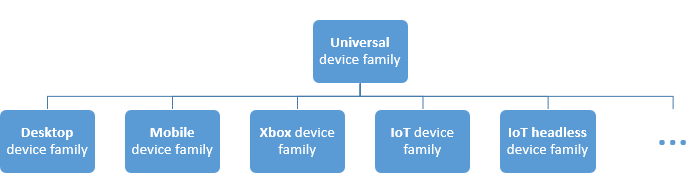
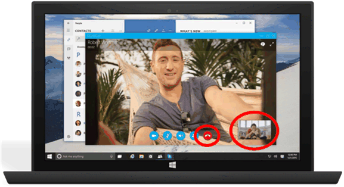
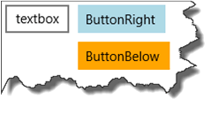

# Guide des applications de plateforme Windows universelle (UWP)


\[ Mise à jour pour les applications UWP sur Windows 10. Pour les articles sur Windows 8.x, voir la [documentation archivée](http://go.microsoft.com/fwlink/p/?linkid=619132). \]

Dans ce guide, vous allez découvrir ce qui suit :

-   Ce qu’est une *famille d’appareils* et comment choisir celle à cibler.
-   Nouveaux contrôles et panneaux d’interface utilisateur qui vous permettent d’adapter votre interface utilisateur aux différents facteurs de forme d’appareil.
-   Comment comprendre et contrôler la surface d’API disponible pour votre application.

Windows 8 a introduit Windows Runtime (WinRT), qui était une évolution du modèle d’application Windows. Elle devait constituer une architecture d’application commune.

Lorsque Windows Phone 8.1 est devenue disponible, Windows Runtime a été aligné entre Windows Phone 8.1 et Windows. Cela a permis aux développeurs de créer des *applications Windows 8 universelles* ciblant Windows et Windows Phone à l’aide d’une base de code partagée.

Windows 10 introduit la plateforme Windows universelle (UWP), qui développe le modèle Windows Runtime et l’intègre dans le noyau unifié Windows 10. Intégrée au noyau, l’UWP offre désormais une plateforme d’application commune disponible sur chaque appareil exécutant Windows 10. Avec cette évolution, les applications qui ciblent l’UWP peuvent appeler non seulement les API WinRT communes à tous les appareils, mais aussi des API (notamment des API Win32 et .NET) spécifiques de la famille d’appareils sur lesquels l’application s’exécute. L’UWP fournit une couche API de noyau garantie sur divers appareils. Cela signifie que vous pouvez créer un package d’application unique installable sur un vaste éventail d’appareils. Avec ce package d’application unique, le Windows Store fournit un canal de distribution unifié pour atteindre tous les types d’appareils sur lesquels votre application peut s’exécuter.


Étant donné que votre application UWP s’exécute sur un large éventail d’appareils avec différents facteurs de forme et modalités d’entrée, vous souhaitez qu’elle soit adaptée à chaque appareil et en mesure d’en déverrouiller les fonctionnalités uniques. Les appareils ajoutent leurs propres API uniques à la couche API garantie. Vous pouvez écrire du code pour accéder à ces API uniques de façon conditionnelle afin que votre application mette en lumière des fonctionnalités spécifiques d’un type d’appareil tout en offrant une expérience différente sur d’autres appareils. Les contrôles de l’interface utilisateur adaptative et de nouveaux panneaux de disposition vous aident à adapter votre interface utilisateur à un vaste éventail de résolutions d’écran.

## Familles d’appareils


Les applications Windows 8.1 et Windows Phone 8.1 ciblent un système d’exploitation (SE) : Windows ou Windows Phone. Avec Windows 10, votre application ne cible plus un système d’exploitation, mais une ou plusieurs familles d’appareils. Une famille d’appareils identifie les API, les caractéristiques système et les comportements que vous pouvez attendre sur les différents appareils de cette famille. Elle détermine également l’ensemble des appareils sur lesquels votre application peut être installée à partir du Store. Voici la hiérarchie des familles d’appareils.



Une famille d’appareils est un ensemble d’API regroupées, doté d’un nom et d’un numéro de version. Une famille d’appareils constitue le fondement d’un SE. Les PC exécutent la version bureau du système d’exploitation, qui est basée sur la famille d’appareils de bureau. Les téléphones, tablettes, etc., exécutent la version mobile du système d’exploitation, qui est basée sur la famille d’appareils mobiles. Et ainsi de suite.

La famille d’appareils universelle est spéciale. Elle ne constitue pas directement le fondement d’un système d’exploitation quelconque. Au lieu de cela, les API de la famille d’appareils universelle sont héritées par des familles d’appareils enfants. Il est ainsi garanti que les API de la famille d’appareils universelle sont présentes dans chaque système d’exploitation et, par conséquent, sur chaque appareil.

Chaque famille d’appareils enfant ajoute ses propres API à celles dont elle hérite. Il est garanti que l’union d’API ainsi obtenue dans une famille d’appareils enfant est présente dans le système d’exploitation basé sur celle-ci et, par conséquent, sur chaque appareil exécutant ce système d’exploitation.

Un avantage des familles d’appareils est que votre application peut s’exécuter sur toute une série d’appareils, des téléphones, tablettes et ordinateurs de bureau jusqu’aux Surface Hubs et autres consoles Xbox. Votre application peut également utiliser un code adaptatif pour détecter et utiliser de façon dynamique des fonctionnalités d’un appareil qui ne font pas partie de la famille d’appareils universelle.

La décision relative aux familles d’appareils que votre application cible vous appartient. Cette décision a une incidence sur votre application de plusieurs façon. Elle détermine ce qui suit :

-   Les API que votre application peut considérer comme présentes quand elle s’exécute (et qu’elle peut donc appeler librement).
-   Les appels d’API qui sont sécurisés uniquement à l’intérieur d’instructions conditionnelles.
-   Les appareils sur lesquels votre application peut être installée à partir du Store (et par conséquent les facteurs de forme que vous devez prendre en considération).

Le choix d’une famille d’appareils a deux conséquences principales : la surface d’API qui peut être appelée de façon inconditionnelle par l’application et le nombre d’appareils que l’application peut atteindre. Ces deux facteurs impliquent des compromis et inversement proportionnels. Par exemple, une application UWP est une application qui cible spécifiquement la famille d’appareils universelle et qui est donc disponible pour tous les appareils. Une application qui cible la famille d’appareils universelle peut supposer la présence uniquement des API de la famille d’appareils universelle (parce que c’est ce qu’elle cible). Les autres API doit être appelées de manière conditionnelle. En outre, une telle application doit avoir une interface utilisateur hautement adaptative et des capacités d’entrée complètes, car elle peut s’exécuter sur un vaste éventail d’appareils. Une application mobile Windows est une application qui cible spécifiquement la famille d’appareils mobiles, et est disponible pour les appareils dont le système d’exploitation est basé sur la famille d’appareils mobiles (incluant les téléphones, tablettes et autres appareils similaires). Une application de la famille d’appareils mobiles peut supposer la présence de toutes les API de la famille d’appareils mobiles, et son interface utilisateur doit être moyennement adaptative. Une application qui cible la famille d’appareils IoT ne peut être installée que sur des appareils IoT, et peut supposer la présence de toutes les API de la famille d’appareils IoT. Cette application peut être très spécialisée au niveau de son interface utilisateur et de ses fonctionnalités d’entrée, car vous savez qu’elle doit s’exécuter uniquement sur un type spécifique d’appareil.

Voici quelques aspects à prendre en considération pour choisir la famille d’appareils à cibler :

**Optimisation de la portée de votre application**

Pour atteindre le plus grand éventail possible d’appareils avec votre application, et pour que celle-ci s’exécute sur autant de types d’appareils que possible, votre application doit cibler la famille d’appareils universelle. Ainsi, l’application cible automatiquement chaque famille d’appareils basée sur la famille universel (dans le diagramme, tous les enfants de la famille universelle). Cela signifie que l’application s’exécute sur tout système d’exploitation basé sur ces familles d’appareils, et sur tous les appareils exécutant ces systèmes d’exploitation. Les seules API dont la disponibilité est garantie sur tous ces appareils sont celles définies par la version particulière de la famille d’appareils universelle que vous ciblez. (Avec cette édition, la version est toujours 10.0.x.0.) Pour plus d’informations sur la façon dont une application peut appeler des API en dehors de sa version de famille d’appareils cible, voir la section « Écriture de code » plus loin dans cet article.

**Limitation de votre application à un type d’appareil**

Il se peut que vous ne vouliez pas que votre application s’exécute sur un vaste éventail d’appareils. Elle peut être spécialisée, par exemple, pour les PC de bureau ou les consoles Xbox. Dans ce cas, vous pouvez choisir de cibler votre application sur l’une des familles d’appareils enfants. Par exemple, si vous ciblez la famille d’appareils de bureau, les API dont la disponibilité est garantie pour votre application incluent celles héritées de la famille d’appareils universelle ainsi que celles qui sont propres à la famille d’appareils de bureau.

**Limitation de votre application à un sous-ensemble de tous les appareils possibles**

Au lieu de cibler la famille d’appareils universelle ou l’une des familles d’appareils enfants, vous pouvez cibler plusieurs familles d’appareils enfants. Le ciblage des appareils de bureau et mobiles peut s’avérer pertinent pour votre application. Ou bien, des appareils de bureau et de Xbox. Ou encore des appareils de bureau, de Xbox et de Surface Hub.

**Exclusion de la prise en charge d’une version particulière d’une famille d’appareils**

Dans de rares cas, vous pouvez souhaiter que votre application s’exécute partout, sauf sur des appareils d’une version particulière d’une famille d’appareils spécifique. Par exemple, imaginons que votre appareil cible la version 10.0.x.0 de la famille d’appareils universelle. En cas de changement ultérieur de la version du système d’exploitation à l’avenir, par exemple en version 10.0.x.2, vous pouvez spécifier que votre application s’exécute partout sauf sur la version 10.0.x.1 de Xbox en ciblant votre application sur la version universelle 10.0.x.0 et la version 10.0.x.1 de Xbox. Votre application sera alors inaccessible pour l’ensemble des versions de la famille d’appareils Xbox 10.0.x.1 (inclus) et pour les versions antérieures.

Par défaut, Microsoft Visual Studio spécifie **Windows.Universal** comme la famille d’appareils cibles dans le fichier manifeste du package d’applications cible. Pour spécifier la ou les familles d’appareils pour lesquelles votre application sera proposée dans le Windows Store, configurez manuellement l’élément [**TargetDeviceFamily**](https://msdn.microsoft.com/library/windows/apps/dn986903) dans votre fichier Package.appxmanifest.

## Interface utilisateur et entrée universelle


Une application UWP peut s’exécuter sur de nombreux types d’appareils qui ont différentes formes d’entrée, de résolutions d’écran, de densité PPP et d’autres caractéristiques uniques. Windows 10 comprend de nouveaux contrôles, panneaux de disposition et outils universels pour vous aider à adapter votre interface utilisateur aux appareils sur lesquels votre application peut s’exécuter. Par exemple, vous pouvez adapter l’interface utilisateur pour tirer de la différence de résolution d’écran lorsque votre application s’exécute sur un ordinateur de bureau ou sur un appareil mobile.

Certains aspects de l’interface utilisateur de votre application s’adaptent automatiquement aux divers appareils. Les contrôles tels que les boutons et les curseurs s’adaptent automatiquement aux différents modes d’entrée et familles d’appareils. La conception de l’expérience utilisateur de votre application peut cependant nécessiter une adaptation en fonction de l’appareil sur lequel l’application s’exécute. Par exemple, une application de photos doit adapter son interface utilisateur quand elle s’exécute sur un appareil portatif de petite taille, afin d’être utilisable d’une seule main. Quand une application de photos s’exécute sur un ordinateur de bureau, l’interface utilisateur doit s’adapter pour tirer parti de l’espace d’écran supplémentaire.

Windows vous aide à cibler votre interface utilisateur sur plusieurs appareils avec les fonctionnalités suivantes :

-   Les contrôles universels et panneaux de disposition vous aident à optimiser votre interface utilisateur pour la résolution d’écran de l’appareil
-   La gestion commune des entrées vous permet de recevoir des entrées par le biais d’impulsions tactiles, d’un stylet, d’une souris, d’un clavier ou d’un contrôleur tel qu’une manette Microsoft Xbox
-   Les outils vous permettent de concevoir une interface utilisateur pouvant s’adapter à différentes résolutions d’écran
-   La mise à l’échelle adaptative s’ajuste en fonction des différentes résolutions des appareils

### Contrôles et panneaux de disposition universels

Windows 10 inclut de nouveaux contrôles tels que l’affichage du calendrier et l’affichage fractionné. Le contrôle Pivot, qui était auparavant disponible uniquement pour Windows Phone, est désormais également disponible pour la famille d’appareils universelle.

Des contrôles ont été mis à jour pour fonctionner correctement sur des écrans plus grands, s’adapter en fonction du nombre de pixels disponibles sur l’écran de l’appareil, et fonctionner correctement avec plusieurs types d’entrées tels que clavier, souris, impulsions tactiles, stylet ou contrôleur de type manette Xbox.

Il se peut que vous constatiez que vous avez besoin d’adapter la disposition globale de votre interface utilisateur en fonction de la résolution d’écran de l’appareil sur lequel votre application s’exécute. Par exemple, une application de communication s’exécutant sur le bureau peut inclure une image en incrustation de l’appelant et des contrôles particulièrement adaptés à l’entrée à la souris :



Toutefois, lorsque l’application s’exécute sur un téléphone, en raison de la limitation de l’espace disponible sur l’écran, votre application peut éliminer l’image en incrustation et agrandir le bouton d’appel afin de faciliter la manipulation d’une seule main :


Pour vous aider à adapter la disposition globale de votre interface utilisateur en fonction de l’espace disponible sur l’écran, Windows 10 introduit des panneaux et des états de conception adaptatifs.

### Concevoir une interface utilisateur adaptative avec des panneaux adaptatifs

Les panneaux de disposition attribuent des tailles et des positions à leurs enfants, en fonction de l’espace disponible. Par exemple, [**StackPanel**](https://msdn.microsoft.com/library/windows/apps/br209635) organise ses enfants de façon séquentielle (horizontalement ou verticalement). [
            **Grid**](https://msdn.microsoft.com/library/windows/apps/br242704) est similaire à une grille CSS qui place ses enfants dans des cellules.

Le nouveau [**RelativePanel**](https://msdn.microsoft.com/library/windows/apps/dn879546) implémente un style de disposition défini par les relations entre ses éléments enfants. Il est conçu pour créer des dispositions d’application pouvant s’adapter aux changements de résolution de l’écran. Le **RelativePanel** facilite le processus de réorganisation des éléments en définissant les relations entre ces derniers, ce qui vous permet de générer une interface utilisateur plus dynamique sans utiliser de dispositions imbriquées.

Dans l’exemple suivant, **blueButton** s’affiche à droite de **textBox1**, indépendamment des changements d’orientation ou de disposition, et **orangeButton** s’affiche immédiatement sous **blueButton** et aligné sur celui-ci, même quand la largeur de **textBox1** change en fonction du texte saisi. Auparavant, pour obtenir cet effet, il aurait fallu utiliser des lignes et des colonnes dans un élément **Grid**. Cette opération implique désormais beaucoup moins de balisage.



```XAML
<RelativePanel>
    <TextBox x:Name="textBox1" Text="textbox" Margin="5"/>
    <Button x:Name="blueButton" Margin="5" Background="LightBlue" Content="ButtonRight" RelativePanel.RightOf="textBox1"/>
    <Button x:Name="orangeButton" Margin="5" Background="Orange" Content="ButtonBelow" RelativePanel.RightOf="textBox1" RelativePanel.Below="blueButton"/>
</RelativePanel>
```

### Utiliser des déclencheurs d’état visuel pour créer une interface utilisateur pouvant s’adapter à l’espace d’écran disponible

Il se peut que votre interface utilisateur doive s’adapter aux changements de taille de fenêtre. Les états visuels adaptatifs vous permettent de modifier l’état visuel en réponse aux changements de taille de la fenêtre.

Les déclencheurs StateTriggers définissent un seuil à partir duquel un état visuel est activé, qui définit à son tour les propriétés de disposition en fonction de la taille de fenêtre qui a déclenché le changement d’état.

Dans l’exemple suivant, quand la largeur de la fenêtre est supérieure ou égale à 720 pixels, l’état visuel nommé **wideView** est déclenché, lequel entraîne l’affichage du panneau **Jeux les mieux notés** à droite du panneau **Top jeux gratuits** et aligné sur celui-ci.


Lorsque la largeur de la fenêtre est inférieure à 720 pixels, l’état visuel **narrowView** est déclenché, car le déclencheur **wideView** n’est plus satisfait et est donc sans effet. L’état visuel **narrowView** positionne alors le panneau **Jeux les mieux notés** sous le panneau **Top jeux payants** et aligné sur ce dernier :


Voici le code XAML pour les déclencheurs d’état visuel décrits ci-dessus. La définition des panneaux, à laquelle « `...` » fait référence ci-dessous, a été supprimée par souci de brièveté.

```XAML
<Grid Background="{ThemeResource ApplicationPageBackgroundThemeBrush}">
    <VisualStateManager.VisualStateGroups>
        <VisualStateGroup>
            <VisualState x:Name="wideView">
                <VisualState.StateTriggers>
                    <AdaptiveTrigger MinWindowWidth="720" />
                </VisualState.StateTriggers>
                <VisualState.Setters>
                    <Setter Target="best.(RelativePanel.RightOf)" Value="free"/>
                    <Setter Target="best.(RelativePanel.AlignTopWidth)" Value="free"/>
                </VisualState.Setters>
            </VisualState>
            <VisualState x:Name="narrowView">
                <VisualState.Setters>
                    <Setter Target="best.(RelativePanel.Below)" Value="paid"/>
                    <Setter Target="best.(RelativePanel.AlignLeftWithPanel)" Value="true"/>
                </VisualState.Setters>
                <VisualState.StateTriggers>
                    <AdaptiveTrigger MinWindowWidth="0" />
                </VisualState.StateTriggers>
            </VisualState>
        </VisualStateGroup>
    </VisualStateManager.VisualStateGroups>
    ...
</Grid>
```

### Outils

Par défaut, vous souhaitez probablement cibler la famille d’appareils la plus vaste possible. Lorsque vous êtes prêt à voir comment votre application se présente sur un appareil particulier, utilisez la barre d’outils de prévisualisation d’appareil dans Visual Studio pour afficher un aperçu de votre interface utilisateur sur un appareil mobile de taille petite ou moyenne, sur un PC ou sur un grand écran de téléviseur. Vous pouvez ainsi adapter et tester vos états visuels adaptatifs :


Vous n’êtes pas obligé de décider à l’avance des différents types d’appareils à prendre en charge. Vous pouvez toujours ajouter ultérieurement une taille d’appareil à votre projet.

### Mise à l’échelle adaptative

Windows 10 introduit une évolution du modèle de mise à l’échelle existant. En plus de la mise à l’échelle du contenu vectoriel, il existe un ensemble unifié de facteurs d’échelle qui assurent la cohérence de taille des éléments d’interface utilisateur en fonction de diverses tailles d’écran et résolutions d’affichage. Ces facteurs d’échelle sont également compatibles avec les facteurs d’échelle d’autres systèmes d’exploitation tels qu’iOS et Android. Cela facilite le partage de ressources entre ces plateformes.

Le Store sélectionne les ressources à télécharger notamment en fonction de la résolution de l’appareil. Seules les ressources correspondant au mieux à l’appareil sont téléchargées.

### Gestion commune des entrées

Vous pouvez créer une application Windows universelle utilisant des contrôles universels qui gèrent diverses sources d’entrée, telle qu’une souris, un clavier, des impulsions tactiles, un stylet et des contrôleurs (par exemple, une manette Xbox). En règle générale, l’entrée manuscrite est associée uniquement à un stylet. En revanche, avec Windows 10, ce type d’entrée est possible via l’interface tactile de certains appareils et n’importe quel pointeur. L’entrée manuscrite est prise en charge sur de nombreux appareils (y compris mobiles), et peut être facilement incorporée avec quelques lignes de code.

Les API suivantes donnent accès à l’entrée :

-   [
            **CoreIndependentInputSource**](https://msdn.microsoft.com/library/windows/apps/dn298460) est une nouvelle API permettant d’utiliser une entrée brute sur le thread principal ou sur un thread d’arrière-plan.
-   [
            **PointerPoint**](https://msdn.microsoft.com/library/windows/apps/br242038) réunit les données brutes du stylet, de la souris et des impulsions tactiles dans un ensemble unique et cohérent d’interfaces et d’événements qui peuvent être utilisés sur le thread principal ou sur un thread d’arrière-plan à l’aide de **CoreInput**.
-   [
            **PointerDevice**](https://msdn.microsoft.com/library/windows/apps/br225633) est une API d’appareil qui prend en charge l’interrogation des capacités d’un appareil afin de déterminer les modalités d’entrée disponibles sur celui-ci.
-   Le nouveau contrôle XAML [**InkCanvas**](https://msdn.microsoft.com/library/windows/apps/dn858535) et les API Windows Runtime [**InkPresenter**](https://msdn.microsoft.com/library/windows/apps/dn922011) permettent d’accéder aux données de traits d’encre.

## Écriture de code


Les options de langage de programmation pour votre [projet Windows 10 dans Visual Studio](https://msdn.microsoft.com/en-us/library/windows/apps/dn609832.aspx#target_win10) incluent Visual C++, C#, Visual Basic et JavaScript. Pour Visual C++, C# et Visual Basic, vous pouvez utiliser XAML pour une expérience haute fidélité de l’interface utilisateur native. Pour Visual C++, vous pouvez choisir de dessiner avec DirectX, soit à la place de XAML, soit en même temps que XAML. Pour JavaScript, votre couche présentation sera au format HTML, qui est évidemment une norme web interplateforme. Votre code et l’interface utilisateur seront en grande partie universels et s’exécuteront partout de la même façon. En revanche, pour un code adapté à des familles d’appareils particulières, et pour une interface utilisateur adaptée à des facteurs de forme particuliers, vous avez la possibilité d’utiliser un code et une interface utilisateur adaptatifs. Examinons ces différents cas.

**Appel d’une API implémentée par votre famille d’appareils cible**

Chaque fois que vous voulez appeler une API, vous devez savoir si l’API est implémentée par la famille d’appareils que votre application cible. En cas de doute, vous pouvez consulter la documentation de référence de l’API. En ouvrant la rubrique appropriée et en consultant la section Configuration requise, vous pouvez déterminer la famille d’appareils d’implémentation. Supposons que votre application cible la version 10.0.x.0 de la famille d’appareils universelle et que vous vouliez appeler des membres de la classe [**Windows.UI.Core.SystemNavigationManager**](https://msdn.microsoft.com/library/windows/apps/dn893595). Dans cet exemple, la famille d’appareils est « universelle ». Il est conseillé de bien vérifier que les membres de la classe que vous voulez appeler se trouvent également dans votre cible. Dans ce cas, ils le sont. Par conséquent, dans cet exemple, vous savez désormais que la présence des API est garantie sur chaque appareil sur lequel votre application peut être installée, et que vous pouvez les appeler dans votre code comme vous le feriez normalement.

```csharp
    Windows.UI.Core.SystemNavigationManager.GetForCurrentView().BackRequested += TestView_BackRequested;
```

Autre exemple, imaginons que votre application cible la version 10.0.x.0 de la famille d’appareils Xbox, et que la rubrique de référence pour une API que vous voulez appeler indique que celle-ci a été introduite dans la version 10.0.x.0 de la famille d’appareils Xbox. Dans ce cas, une fois encore, la présence de l’API est garantie sur chaque appareil sur lequel votre application peut être installée. Par conséquent, vous seriez en mesure d’appeler cette API dans votre code de la manière habituelle.

Notez qu’IntelliSense de Visual Studio ne reconnaît pas les API, sauf si elles sont implémentées par la famille d’appareils cible de votre application ou par un Kit de développement logiciel (SDK) d’extension que vous avez référencé. Par conséquent, si vous n’avez référencé aucun Kit de développement logiciel (SDK) d’extension, vous pouvez être certain que toutes les API apparaissant dans IntelliSense figurent dans votre famille d’appareils cible et que vous pouvez les appeler librement.

**Appel d’une API NON implémentée par votre famille d’appareils cible**

Il est possible que, lorsque vous voulez appeler une API, votre famille d’appareils cible ne soit pas répertoriée dans la documentation. Dans ce cas, vous pouvez écrire un code adaptatif pour appeler cette API.

**Écriture de code adaptatif avec la classe ApiInformation**

Deux étapes sont nécessaires pour écrire du code adaptatif. La première consiste à rendre les API auxquelles vous voulez accéder disponibles pour votre projet. Pour ce faire, ajoutez une référence au Kit de développement logiciel (SDK) d’extension qui représente la famille d’appareils possédant les API que vous voulez appeler de manière conditionnelle. Consultez [Kits de développement logiciel (SDK) d’extension](../porting/w8x-to-uwp-porting-to-a-uwp-project.md#extension-sdks).

La deuxième étape consiste à utiliser la classe [**Windows.Foundation.Metadata.ApiInformation**](https://msdn.microsoft.com/library/windows/apps/dn949001) dans une condition à l’intérieur de votre code pour tester la présence de l’API que vous voulez appeler. Cette condition est évaluée à chaque exécution de votre application, mais sa valeur est true uniquement sur les appareils sur lesquels l’API est présente et donc disponible pour un appel.

Si vous voulez uniquement appeler un petit nombre d’API, vous pouvez utiliser la méthode [**ApiInformation.IsTypePresent**](https://msdn.microsoft.com/library/windows/apps/dn949016) comme suit.

```csharp
    // Note: Cache the value instead of querying it more than once.
    bool isHardwareButtonsAPIPresent =
        Windows.Foundation.Metadata.ApiInformation.IsTypePresent("Windows.Phone.UI.Input.HardwareButtons");

    if (isHardwareButtonsAPIPresent)
    {
        Windows.Phone.UI.Input.HardwareButtons.CameraPressed +=
            HardwareButtons_CameraPressed;
    }
```

Dans ce cas, nous pouvons être certains que la présence de la classe [**HardwareButtons**](https://msdn.microsoft.com/library/windows/apps/jj207557) implique la présence de l’événement [**CameraPressed**](https://msdn.microsoft.com/library/windows/apps/dn653805), car les informations de configuration requise sont identiques pour la classe et le membre. Toutefois, au fil du temps, de nouveaux membres seront ajoutés aux classes déjà introduites, et ces membres auront ultérieurement des numéros de version « introduite dans ». Dans ce cas, au lieu d’utiliser **IsTypePresent**, vous pouvez tester la présence de membres individuels à l’aide des méthodes **IsEventPresent**, **IsMethodPresent**, **IsPropertyPresent** et d’autres méthodes similaires. En voici un exemple :

```csharp
    bool isHardwareButtons_CameraPressedAPIPresent =
        Windows.Foundation.Metadata.ApiInformation.IsEventPresent
            ("Windows.Phone.UI.Input.HardwareButtons", "CameraPressed");
```

L’ensemble des API au sein d’une famille d’appareils comprend des subdivisions appelées contrats API. La méthode **ApiInformation.IsApiContractPresent** permet de tester la présence d’un contrat API. Cela est utile si vous voulez tester la présence d’un grand nombre d’API qui existent toutes dans la même version d’un contrat API.

```csharp
    bool isWindows_Devices_Scanners_ScannerDeviceContract_1_0Present =
        Windows.Foundation.Metadata.ApiInformation.IsApiContractPresent
            ("Windows.Devices.Scanners.ScannerDeviceContract", 1, 0);
```

**API Win32 dans l’UWP**

Une application UWP ou un composant Windows Runtime écrits en C++/CX ont accès aux API Win32 faisant partie de l’UWP. Ces API Win32 sont implémentées par toutes les familles d’appareils Windows 10. Lier votre application avec Windowsapp.lib. Windowsapp.lib est une bibliothèque « PARAPLUIE » qui assure les exportations pour les API UWP. La liaison à Windowsapp.lib ajoute à votre application des dépendances de DLL qui sont présentes sur tous les familles d’appareils Windows 10.

Pour obtenir la liste complète des API Win32 disponibles pour les applications UWP, voir [Ensembles d’API pour les applications UWP](https://msdn.microsoft.com/library/windows/desktop/mt186421) et [DLL pour les applications UWP](https://msdn.microsoft.com/library/windows/desktop/mt186422).

## Expérience utilisateur


Une application Windows universelle permet de tirer parti des fonctionnalités uniques de l’appareil sur lequel elle s’exécute. Votre application peut exploiter toute la puissance d’un appareil de bureau, l’interaction naturelle de la manipulation directe sur une tablette (y compris les entrées via impulsions tactiles et stylet), la portabilité et la commodité des appareils mobiles, et la puissance collaborative de [Surface Hub](http://go.microsoft.com/fwlink/?LinkId=526365).

Une bonne [conception](http://go.microsoft.com/fwlink/?LinkId=258848) est le processus consistant à décider comment les utilisateurs doivent interagir avec votre application, ainsi que la manière dont celle-ci se présentera et fonctionnera. L’expérience utilisateur jouant un rôle considérable dans la satisfaction que procurera votre application, ne lésinez pas sur cette étape. La rubrique [Notions de base de conception](https://dev.windows.com/en-us/design) présente la conception d’une application Windows universelle. Pour plus d’informations sur la conception d’applications UWP susceptibles d’enchanter les utilisateurs, voir [Présentation des applications de la plateforme Windows universelle (UWP) pour les concepteurs](https://msdn.microsoft.com/library/windows/apps/dn958439). Avant de commencer à coder, voir [Notions fondamentales sur les appareils](../input-and-devices/device-primer.md) pour réfléchir à l’expérience d’interaction de l’utilisation de votre application sur les différents facteurs de forme que vous voulez cibler.


En plus de l’interaction sur différents appareils, [planifiez votre application](https://msdn.microsoft.com/library/windows/apps/hh465427) pour bénéficier des avantages liés à l’utilisation de plusieurs appareils. Par exemple :

-   Utilisez les [services cloud](http://go.microsoft.com/fwlink/?LinkId=526377) pour synchroniser les données sur tous les appareils. Découvrez comment vous [connecter aux services web](https://msdn.microsoft.com/library/windows/apps/xaml/hh761504) pour renforcer l’expérience de votre application.

-   Réfléchissez à la manière d’aider les utilisateurs passant d’un appareil à l’autre à reprendre là où ils en étaient. Incluez des [notifications](https://msdn.microsoft.com/library/windows/apps/mt187203) et des [achats in-app](https://msdn.microsoft.com/library/windows/apps/mt219684) dans votre planification. Ces fonctionnalités doivent opérer sur tous les appareils.

-   Concevez votre flux de travail en vous basant sur les [Informations de base relatives à la conception de la navigation pour les applications UWP](https://msdn.microsoft.com/library/windows/apps/dn958438) afin d’adapter votre application aux appareils mobiles, petit et grand écran. [Disposez votre interface utilisateur](https://msdn.microsoft.com/library/windows/apps/dn958435) pour l’adapter à différentes tailles et résolutions d’écran.

-   Déterminez si certaines fonctionnalités de votre application n’ont aucun sens sur un petit écran mobile. Il se peut également que certaines zones soient dépourvues de sens sur un ordinateur de bureau fixe, et nécessitent un appareil mobile pour être mises en lumière. Par exemple, la plupart des scénarios en relation avec la [localisation](https://msdn.microsoft.com/library/windows/apps/mt219698) impliquent l’utilisation d’un appareil mobile.

-   Songez à la manière de prendre en charge plusieurs modalités d’entrée. Pour savoir comment les utilisateurs peuvent interagir avec votre application via [Cortana](https://msdn.microsoft.com/library/windows/apps/dn974233), la fonction [Voix](https://msdn.microsoft.com/library/windows/apps/dn596121), des [interactions tactiles](https://msdn.microsoft.com/library/windows/apps/hh465370), du [clavier tactile](https://msdn.microsoft.com/library/windows/apps/hh972345) et bien plus encore, voir les [Recommandations en matière d’interactions](https://msdn.microsoft.com/library/windows/apps/dn611861).

    Pour des expériences d’interaction plus classiques, voir les [Recommandations en matière de texte et de saisie de texte](https://msdn.microsoft.com/library/windows/apps/dn611864).

## Soumettre une application Windows universelle via votre tableau de bord


Le nouveau tableau de bord unifié du Centre de développement Windows vous permet de gérer et soumettre toutes vos applications pour appareils Windows à partir d’un seul et même emplacement. De nouvelles fonctionnalités simplifient les processus tout en vous offrant un contrôle accru. Le nouveau tableau de bord vous propose également des [rapports d’analyse détaillés](https://msdn.microsoft.com/library/windows/apps/mt148522), des [informations sur les revenus](https://msdn.microsoft.com/library/windows/apps/dn986925), des méthodes pour [promouvoir votre application et susciter l’intérêt de vos clients](https://msdn.microsoft.com/library/windows/apps/mt148526), et bien davantage.

Pour savoir comment soumettre vos applications en vue de leur publication dans le Windows Store, voir [Utilisation du nouveau tableau de bord unifié du Centre de développement Windows](../publish/using-the-windows-dev-center-dashboard.md).

 

 


<!--HONumber=Mar16_HO1-->


