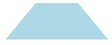
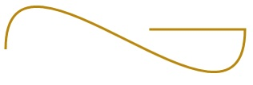

# Dessiner des formes

\[ Mise à jour pour les applications UWP sur Windows 10. Pour les articles sur Windows 8.x, voir l’[archive](http://go.microsoft.com/fwlink/p/?linkid=619132). \]


** API importantes **

-   [**Chemin d’accès**](https://msdn.microsoft.com/library/windows/apps/BR243355)
-   [**Espace de noms Windows.UI.Xaml.Shapes**](https://msdn.microsoft.com/library/windows/apps/BR243401)
-   [**Espace de noms Windows.UI.Xaml.Media**](https://msdn.microsoft.com/library/windows/apps/BR243045)

Découvrez comment dessiner des formes, telles que des ellipses, des rectangles, des polygones et des tracés. La classe [**Path**](https://msdn.microsoft.com/library/windows/apps/BR243355) permet de visualiser un langage de dessin vectoriel complexe dans une interface utilisateur XAML. Vous pouvez, par exemple, dessiner des courbes de Bézier.

## Introduction

Deux jeux de classes définissent une région d’espace dans l’interface utilisateur XAML : les classes [**Shape**](https://msdn.microsoft.com/library/windows/apps/BR243377) et les classes [**Geometry**](https://msdn.microsoft.com/library/windows/apps/BR210041). Leur principale différence réside dans le fait qu’un pinceau est associé à la classe **Shape** et que son rendu peut s’effectuer à l’écran. La classe **Geometry**, quant à elle, définit simplement une région d’espace sans rendu, sauf si elle concourt à donner des informations sur une autre propriété de l’interface utilisateur. Imaginez le jeu **Shape** comme un élément [**UIElement**](https://msdn.microsoft.com/library/windows/apps/BR208911) dont la limite est définie par un jeu **Geometry**. Cette rubrique traite principalement des classes **Shape**.

Les classes [**Shape**](https://msdn.microsoft.com/library/windows/apps/BR243377) sont les suivantes : [**Line**](https://msdn.microsoft.com/library/windows/apps/BR243345), [**Ellipse**](https://msdn.microsoft.com/library/windows/apps/BR243343), [**Rectangle**](https://msdn.microsoft.com/library/windows/apps/BR243371), [**Polygon**](https://msdn.microsoft.com/library/windows/apps/BR243359), [**Polyline**](https://msdn.microsoft.com/library/windows/apps/BR243365) et [**Path**](https://msdn.microsoft.com/library/windows/apps/BR243355). La classe **Path** est intéressante car elle peut définir une géométrie arbitraire, et la classe [**Geometry**](https://msdn.microsoft.com/library/windows/apps/BR210041) est impliquée ici car elle constitue un moyen de définir les parties d’une classe **Path**.

## Remplissage et trait pour les formes

Pour qu’un objet [**Shape**](https://msdn.microsoft.com/library/windows/apps/BR243377) soit restitué sur la zone de dessin de l’application, vous devez lui associer un objet [**Brush**](https://msdn.microsoft.com/library/windows/apps/BR228076). Définissez la propriété [**Fill**](https://msdn.microsoft.com/library/windows/apps/windows.ui.xaml.shapes.shape.fill) de la classe **Shape** sur l’élément **Brush** souhaité. Pour plus d’informations sur les pinceaux, voir [Utilisation des pinceaux](using-brushes.md).

Un objet [**Shape**](https://msdn.microsoft.com/library/windows/apps/BR243377) peut également posséder une propriété [**Stroke**](https://msdn.microsoft.com/library/windows/apps/windows.ui.xaml.shapes.shape.stroke), qui représente une ligne dessinée autour du périmètre de la forme. En outre, une propriété **Stroke** requiert un objet [**Brush**](https://msdn.microsoft.com/library/windows/apps/BR228076) qui définit son apparence, et doit posséder une valeur différente de zéro pour [**StrokeThickness**](https://msdn.microsoft.com/library/windows/apps/windows.ui.xaml.shapes.shape.strokethickness). **StrokeThickness** est une propriété qui définit l’épaisseur du périmètre autour du bord de la forme. Si vous n’indiquez aucune valeur **Brush** pour la propriété **Stroke** ou que vous définissez **StrokeThickness** sur 0, la bordure autour de la forme n’est pas dessinée.

## Ellipse

La classe [**Ellipse**](https://msdn.microsoft.com/library/windows/apps/BR243343) désigne une forme au périmètre courbe. Pour créer une forme **Ellipse** basique, spécifiez un élément [**Width**](https://msdn.microsoft.com/library/windows/apps/BR208751) et [**Height**](https://msdn.microsoft.com/library/windows/apps/BR208718), ainsi qu’un élément [**Brush**](https://msdn.microsoft.com/library/windows/apps/BR228076) pour la propriété [**Fill**](https://msdn.microsoft.com/library/windows/apps/windows.ui.xaml.shapes.shape.fill).

L’exemple suivant permet de créer une forme [**Ellipse**](https://msdn.microsoft.com/library/windows/apps/BR243343) de largeur [**Width**](https://msdn.microsoft.com/library/windows/apps/BR208751) égale à 200 et de hauteur [**Height**](https://msdn.microsoft.com/library/windows/apps/BR208718) égale à 200, avec une couleur [**SteelBlue**](https://msdn.microsoft.com/library/windows/apps/Hh748056) de pinceau [**SolidColorBrush**](https://msdn.microsoft.com/library/windows/apps/BR242962) comme propriété [**Fill**](https://msdn.microsoft.com/library/windows/apps/windows.ui.xaml.shapes.shape.fill).

```xml
<Ellipse Fill="SteelBlue" Height="200" Width="200" />
```

Rendu de la forme [**Ellipse**](https://msdn.microsoft.com/library/windows/apps/BR243343) :


Dans ce cas, la forme [**Ellipse**](https://msdn.microsoft.com/library/windows/apps/BR243343) s’apparente à ce que la plupart d’entre nous appellerions un cercle. Il s’agit là, en effet, de la façon dont vous déclarez une forme circulaire en langage XAML : en utilisant une classe **Ellipse** avec des valeurs [**Width**](https://msdn.microsoft.com/library/windows/apps/BR208751) et [**Height**](https://msdn.microsoft.com/library/windows/apps/BR208718) égales.

Lorsqu’un objet [**Ellipse**](https://msdn.microsoft.com/library/windows/apps/BR243343) est positionné dans une disposition de l’interface utilisateur, sa taille est supposée similaire à celle d’un rectangle avec ces valeurs [**Width**](https://msdn.microsoft.com/library/windows/apps/BR208751) et [**Height**](https://msdn.microsoft.com/library/windows/apps/BR208718) ; la zone à l’extérieur du périmètre n’est pas restituée, mais participe néanmoins à la taille de son emplacement dans la disposition.

Un ensemble de 6 éléments [**Ellipse**](https://msdn.microsoft.com/library/windows/apps/BR243343) font partie du modèle du contrôle [**ProgressRing**](https://msdn.microsoft.com/library/windows/apps/BR227538) et 2 éléments **Ellipse** concentriques font partie d’une classe [**RadioButton**](https://msdn.microsoft.com/library/windows/apps/BR227544).

## <span id="Rectangle"> </span> <span id="rectangle"> </span> <span id="RECTANGLE"> </span>Rectangle

Une forme [**Rectangle**](https://msdn.microsoft.com/library/windows/apps/BR243371) a quatre côtés dont les côtés opposés sont de mesure égale. Pour créer une forme **Rectangle** basique, spécifiez une largeur [**Width**](https://msdn.microsoft.com/library/windows/apps/BR208751), une hauteur [**Height**](https://msdn.microsoft.com/library/windows/apps/BR208718) et un remplissage [**Fill**](https://msdn.microsoft.com/library/windows/apps/windows.ui.xaml.shapes.shape.fill).

Vous pouvez arrondir les angles d’une forme [**Rectangle**](https://msdn.microsoft.com/library/windows/apps/BR243371). Pour ce faire, indiquez une valeur pour les propriétés [**RadiusX**](https://msdn.microsoft.com/en-us/library/windows/apps/windows.ui.xaml.shapes.rectangle.radiusx.aspx) et [**RadiusY**](https://msdn.microsoft.com/library/windows/apps/windows.ui.xaml.shapes.rectangle.radiusy). Ces propriétés spécifient les axes x et y d’une ellipse définissant la courbe des angles. La valeur maximale de **RadiusX** correspond à la valeur [**Width**](https://msdn.microsoft.com/library/windows/apps/BR208751) divisée par deux, et la valeur maximale de **RadiusY** à celle de [**Height**](https://msdn.microsoft.com/library/windows/apps/BR208718) divisée par deux.

L’exemple suivant permet de créer une forme [**Rectangle**](https://msdn.microsoft.com/library/windows/apps/BR243371) de largeur [**Width**](https://msdn.microsoft.com/library/windows/apps/BR208751) égale à 200 et de hauteur [**Height**](https://msdn.microsoft.com/library/windows/apps/BR208718) égale à 100. La valeur [**Blue**](https://msdn.microsoft.com/library/windows/apps/Hh747837) est utilisée pour le pinceau [**SolidColorBrush**](https://msdn.microsoft.com/library/windows/apps/BR242962) comme propriété [**Fill**](https://msdn.microsoft.com/library/windows/apps/windows.ui.xaml.shapes.shape.fill), et la valeur [**Black**](https://msdn.microsoft.com/library/windows/apps/Hh747833) est utilisée pour le pinceau **SolidColorBrush** comme propriété [**Stroke**](https://msdn.microsoft.com/library/windows/apps/windows.ui.xaml.shapes.shape.stroke). Nous avons défini la propriété [**StrokeThickness**](https://msdn.microsoft.com/library/windows/apps/windows.ui.xaml.shapes.shape.strokethickness) sur 3. Sinon, nous avons défini la propriété [**RadiusX**](https://msdn.microsoft.com/en-us/library/windows/apps/windows.ui.xaml.shapes.rectangle.radiusx.aspx) sur 50 et la propriété [**RadiusY**](https://msdn.microsoft.com/library/windows/apps/windows.ui.xaml.shapes.rectangle.radiusy) sur 10 afin d’obtenir une forme **Rectangle** aux angles arrondis.

```xml
<Rectangle Fill="Blue"
           Width="200"
           Height="100"
           Stroke="Black"
           StrokeThickness="3"
           RadiusX="50"
           RadiusY="10" />
           ```

Here's the rendered [**Rectangle**](https://msdn.microsoft.com/library/windows/apps/BR243371).


**Tip**  There are some scenarios for UI definitions where instead of using a [**Rectangle**](https://msdn.microsoft.com/library/windows/apps/BR243371), a [**Border**](https://msdn.microsoft.com/library/windows/apps/BR209250) might be more appropriate. If your intention is to create a rectangle shape around other content, it might be better to use **Border** because it can have child content and will automatically size around that content, rather than using the fixed dimensions for height and width like **Rectangle** does. A **Border** also has the option of having rounded corners if you set the [**CornerRadius**](https://msdn.microsoft.com/library/windows/apps/windows.ui.xaml.controls.border.cornerradius) property.

 

On the other hand, a [**Rectangle**](https://msdn.microsoft.com/library/windows/apps/BR243371) is probably a better choice for control composition. A **Rectangle** shape is seen in many control templates because it's used as a "FocusVisual" part for focusable controls. Whenever the control is in a "Focused" visual state, this rectangle is made visible, in other states it's hidden.

## Polygon

A [**Polygon**](https://msdn.microsoft.com/library/windows/apps/BR243359) is a shape with a boundary defined by an arbitrary number of points. The boundary is created by connecting a line from one point to the next, with the last point connected to the first point. The [**Points**](https://msdn.microsoft.com/en-us/library/windows/apps/windows.ui.xaml.shapes.polygon.points.aspx) property defines the collection of points that make up the boundary. In XAML, you define the points with a comma-separated list. In code-behind you use a [**PointCollection**](https://msdn.microsoft.com/library/windows/apps/BR210220) to define the points and you add each individual point as a [**Point**](https://msdn.microsoft.com/library/windows/apps/BR225870) value to the collection.

You don't need to explicitly declare the points such that the start point and end point are both specified as the same [**Point**](https://msdn.microsoft.com/library/windows/apps/BR225870) value. The rendering logic for a [**Polygon**](https://msdn.microsoft.com/library/windows/apps/BR243359) assumes that you are defining a closed shape and will connect the end point to the start point implicitly.

The next example creates a [**Polygon**](https://msdn.microsoft.com/library/windows/apps/BR243359) with 4 points set to `(10,200)`, `(60,140)`, `(130,140)`, and `(180,200)`. It uses a [**LightBlue**](https://msdn.microsoft.com/library/windows/apps/Hh747960) value of [**SolidColorBrush**](https://msdn.microsoft.com/library/windows/apps/BR242962) for its [**Fill**](https://msdn.microsoft.com/library/windows/apps/windows.ui.xaml.shapes.shape.fill), and has no value for [**Stroke**](https://msdn.microsoft.com/library/windows/apps/windows.ui.xaml.shapes.shape.stroke) so it has no perimeter outline.

```xml
<Polygon Fill="LightBlue"
         Points="10,200,60,140,130,140,180,200" />
```

Rendu de la forme [**Polygon**](https://msdn.microsoft.com/library/windows/apps/BR243359) :



**Conseil** Une valeur [**Point**](https://msdn.microsoft.com/library/windows/apps/BR225870) est souvent utilisée en tant que type en XAML pour les situations autres que la déclaration des sommets des formes. Par exemple, un objet **Point** fait partie des données d’événement pour les événements tactiles, si bien que vous pouvez déterminer exactement l’endroit auquel s’est produit une action tactile dans un espace de coordonnées. Pour plus d’informations sur **Point** et sur la façon de l’utiliser en XAML ou dans du code, voir la rubrique de référence d’API pour [**Point**](https://msdn.microsoft.com/library/windows/apps/BR225870).

 

## Ligne

Un objet [**Line**](https://msdn.microsoft.com/library/windows/apps/BR243345) représente simplement une ligne dessinée entre deux points dans un espace de coordonnées. Un objet **Line** ignore toute valeur fournie pour [**Fill**](https://msdn.microsoft.com/library/windows/apps/windows.ui.xaml.shapes.shape.fill), car il est dépourvu d’espace intérieur. Dans le cas d’un objet **Line**, veillez à spécifier des valeurs pour les propriétés [**Stroke**](https://msdn.microsoft.com/library/windows/apps/windows.ui.xaml.shapes.shape.stroke) et [**StrokeThickness**](https://msdn.microsoft.com/library/windows/apps/windows.ui.xaml.shapes.shape.strokethickness), sinon l’objet **Line** ne sera pas restitué.

Vous n’utilisez pas de valeurs [**Point**](https://msdn.microsoft.com/library/windows/apps/BR225870) pour spécifier une forme [**Line**](https://msdn.microsoft.com/library/windows/apps/BR243345) ; à la place, vous utilisez des valeurs [**Double**](https://msdn.microsoft.com/library/windows/apps/xaml/system.double.aspx) discrète pour [**X1**](https://msdn.microsoft.com/en-us/library/windows/apps/windows.ui.xaml.shapes.line.x1.aspx), [**Y1**](https://msdn.microsoft.com/en-us/library/windows/apps/windows.ui.xaml.shapes.line.y1.aspx), [**X2**](https://msdn.microsoft.com/en-us/library/windows/apps/windows.ui.xaml.shapes.line.x2.aspx) et [**Y2**](https://msdn.microsoft.com/en-us/library/windows/apps/windows.ui.xaml.shapes.line.y2.aspx). Cela permet un balisage minimal pour les lignes horizontales ou verticales. Par exemple, `<Line Stroke="Red" X2="400"/>` définit une ligne horizontale de 400 pixels de long. Les autres propriétés X,Y étant par défaut définies sur 0, ce code XAML dessine une ligne entre les points `(0,0)` et `(400,0)`. Vous pouvez ensuite utiliser une classe [**TranslateTransform**](https://msdn.microsoft.com/library/windows/apps/BR243027) pour déplacer toute la classe **Line**, si vous voulez qu’elle commence à un point autre que (0,0).

## <span id="_Polyline"> </span> <span id="_polyline"> </span> <span id="_POLYLINE"> </span> Polyligne

Les formes [**Polyline**](https://msdn.microsoft.com/library/windows/apps/BR243365) sont semblables aux formes [**Polygon**](https://msdn.microsoft.com/library/windows/apps/BR243359) en ce que leur limite est définie par un ensemble de points, à la différence que le dernier point d’une forme **Polyline** n’est pas relié au premier.

**Remarque** Vous pourriez paramétrer explicitement des points de départ et de fin identiques dans la propriété [**Points**](https://msdn.microsoft.com/en-us/library/windows/apps/windows.ui.xaml.shapes.polyline.points.aspx) définie pour l’objet [**Polyline**](https://msdn.microsoft.com/library/windows/apps/BR243365), mais dans ce cas l’utilisation d’un objet [**Polygon**](https://msdn.microsoft.com/library/windows/apps/BR243359) serait probablement plus appropriée.

 

Si vous spécifiez une propriété [**Fill**](https://msdn.microsoft.com/library/windows/apps/windows.ui.xaml.shapes.shape.fill) d’un objet [**Polyline**](https://msdn.microsoft.com/library/windows/apps/BR243365), la propriété **Fill** peint l’espace intérieur de la forme, même si les points de départ et final de la propriété [**Points**](https://msdn.microsoft.com/en-us/library/windows/apps/windows.ui.xaml.shapes.polyline.points.aspx) définie pour l’objet **Polyline** ne se recoupent pas. Si vous ne spécifiez pas de propriété **Fill**, l’objet **Polyline** est similaire à celui qui serait restitué si vous indiquiez plusieurs éléments [**Line**](https://msdn.microsoft.com/library/windows/apps/BR243345) avec intersection des points de départ et des points finaux de lignes consécutives.

Comme dans le cas d’une forme [**Polygon**](https://msdn.microsoft.com/library/windows/apps/BR243359), la propriété [**Points**](https://msdn.microsoft.com/en-us/library/windows/apps/windows.ui.xaml.shapes.polyline.points.aspx) définit l’ensemble des points constituant la limite. En langage XAML, vous devez définir les points à l’aide d’une liste séparée par des virgules. En code-behind, vous devez utiliser un élément [**PointCollection**](https://msdn.microsoft.com/library/windows/apps/BR210220) pour définir les points et ajouter chaque point à l’ensemble sous la forme d’une structure [**Point**](https://msdn.microsoft.com/library/windows/apps/BR225870).

Cet exemple crée une forme [**Polyline**](https://msdn.microsoft.com/library/windows/apps/BR243365) à quatre points définis sur `(10,200)`, `(60,140)`, `(130,140)` et `(180,200)`. Une propriété [**Stroke**](https://msdn.microsoft.com/library/windows/apps/windows.ui.xaml.shapes.shape.stroke) est définie, et non pas une propriété [**Fill**](https://msdn.microsoft.com/library/windows/apps/windows.ui.xaml.shapes.shape.fill).

```xml
<Polyline Stroke="Black"
        StrokeThickness="4"
        Points="10,200,60,140,130,140,180,200" />
```

Voici le rendu de la forme [**Polyline**](https://msdn.microsoft.com/library/windows/apps/BR243365). Remarquez que les premier et dernier points ne sont pas reliés par le contour [**Stroke**](https://msdn.microsoft.com/library/windows/apps/windows.ui.xaml.shapes.shape.stroke) comme ils le seraient dans le cas d’une forme [**Polygon**](https://msdn.microsoft.com/library/windows/apps/BR243359).


## Tracé

La forme [**Path**](https://msdn.microsoft.com/library/windows/apps/BR243355) est la classe [**Shape**](https://msdn.microsoft.com/library/windows/apps/BR243377) la plus souple car vous pouvez l’utiliser pour définir une géométrie arbitraire. Cette souplesse est toutefois synonyme de complexité. Observons comment créer une forme **Path** basique en langage XAML.

Pour spécifier la géométrie d’un tracé, utilisez la propriété [**Data**](https://msdn.microsoft.com/library/windows/apps/windows.ui.xaml.shapes.path.data). Deux techniques permettent de définir la propriété **Data** :

-   Vous pouvez définir une valeur de chaîne pour [**Data**](https://msdn.microsoft.com/library/windows/apps/windows.ui.xaml.shapes.path.data) en XAML. Ainsi, la valeur **Path.Data** utilise un format de sérialisation pour les graphismes. En règle générale, vous ne modifiez pas le texte de cette valeur sous la forme d’une chaîne une fois qu’elle a été établie. À la place, vous utilisez des outils de conception qui vous permettent de travailler dans une métaphore de conception ou de dessin sur une surface. Ensuite, vous enregistrez ou exportez la sortie, ce qui vous permet d’obtenir un fichier XAML ou un fragment de chaîne XAML comportant les informations de la propriété **Path.Data**.
-   Vous pouvez définir la propriété [**Data**](https://msdn.microsoft.com/library/windows/apps/windows.ui.xaml.shapes.path.data) sur un objet [**Geometry**](https://msdn.microsoft.com/library/windows/apps/BR210041) unique. Cette opération peut être réalisée dans du code ou en XAML. Cet objet **Geometry** unique est généralement un objet [**GeometryGroup**](https://msdn.microsoft.com/library/windows/apps/BR210041group), qui fait office de conteneur pouvant, à partir de plusieurs définitions de géométrie, composer un objet destiné au modèle objet. Cette approche permet notamment de définir une ou plusieurs des courbes et des formes complexes en tant que valeurs [**Segments**](https://msdn.microsoft.com/library/windows/apps/BR210164) d’un objet [**PathFigure**](https://msdn.microsoft.com/library/windows/apps/BR210143), par exemple [**BezierSegment**](https://msdn.microsoft.com/library/windows/apps/BR228068).

L’exemple ci-dessous montre un objet [**Path**](https://msdn.microsoft.com/library/windows/apps/BR243355) qui aurait pu être obtenu en utilisant Blend pour Visual Studio pour produire une série limitée de formes vectorielles, puis en enregistrant le résultat au format XAML. L’objet **Path** global se compose d’une courbe de Bézier et d’une ligne. L’exemple vise essentiellement à illustrer une partie des éléments du format de sérialisation [**Path.Data**](https://msdn.microsoft.com/library/windows/apps/windows.ui.xaml.shapes.path.data) et de ce que les nombres représentent.

Cette propriété [**Data**](https://msdn.microsoft.com/library/windows/apps/windows.ui.xaml.shapes.path.data) commence avec une commande de mouvement, indiquée par la mention « M », qui établit un point de départ absolu du tracé.

Le premier segment est une courbe de Bézier cubique commençant à `(100,200)` et se terminant à `(400,175)`. Elle est dessinée à l’aide des deux points de contrôle `(100,25)` et `(400,350)`. Ce segment est indiqué par la commande « C » dans la chaîne de l’attribut [**Data**](https://msdn.microsoft.com/library/windows/apps/windows.ui.xaml.shapes.path.data).

Le deuxième segment commence par une commande de ligne horizontale absolue « H », indiquant le dessin d’une ligne à partir du point final du sous-tracé précédent `(400,175)` jusqu’au nouveau point final `(280,175)`. Comme il s’agit d’une commande de ligne horizontale, la valeur spécifiée correspond à une coordonnée x.

```xml
<Path Stroke="DarkGoldenRod" 
      StrokeThickness="3"
      Data="M 100,200 C 100,25 400,350 400,175 H 280" />
      ```

Here's the rendered [**Path**](https://msdn.microsoft.com/library/windows/apps/BR243355).



The next example shows a usage of the other technique we discussed: a [**GeometryGroup**](https://msdn.microsoft.com/library/windows/apps/BR210041group) with a [**PathGeometry**](https://msdn.microsoft.com/library/windows/apps/BR210168). This example exercises some of the contributing geometry types that can be used as part of a **PathGeometry**: [**PathFigure**](https://msdn.microsoft.com/library/windows/apps/BR210143) and the various elements that can be a segment in [**PathFigure.Segments**](https://msdn.microsoft.com/library/windows/apps/BR210164).

```xml
<Path Stroke="Black" StrokeThickness="1" Fill="#CCCCFF">
            <Path.Data>
              <GeometryGroup>
                  <RectangleGeometry Rect="50,5 100,10" />
                  <RectangleGeometry Rect="5,5 95,180" />
                  <EllipseGeometry Center="100, 100" RadiusX="20" RadiusY="30"/>
                  <RectangleGeometry Rect="50,175 100,10" />
                  <PathGeometry>
                    <PathGeometry.Figures>
                      <PathFigureCollection>
                        <PathFigure IsClosed="true" StartPoint="50,50">
                          <PathFigure.Segments>
                            <PathSegmentCollection>
                              <BezierSegment Point1="75,300" Point2="125,100" Point3="150,50"/>
                              <BezierSegment Point1="125,300" Point2="75,100"  Point3="50,50"/>
                            </PathSegmentCollection>
                          </PathFigure.Segments>
                        </PathFigure>
                      </PathFigureCollection>
                    </PathGeometry.Figures>
                  </PathGeometry>               
              </GeometryGroup>
            </Path.Data>
          </Path>
```

Une raison qui peut vous pousser à utiliser la classe [**PathGeometry**](https://msdn.microsoft.com/library/windows/apps/BR210168) avec les diverses parties est que chacune des parties comporte des propriétés **Double** et **Point** que vous pouvez éventuellement cibler pour une animation de l’interface utilisateur. Vous ne pouvez pas le faire avec la forme de sérialisation de la propriété [**Path.Data**](https://msdn.microsoft.com/library/windows/apps/windows.ui.xaml.shapes.path.data). Pour plus d’informations, voir [Animations dans une table de montage](storyboarded-animations.md).

 

 


<!--HONumber=Mar16_HO1-->
