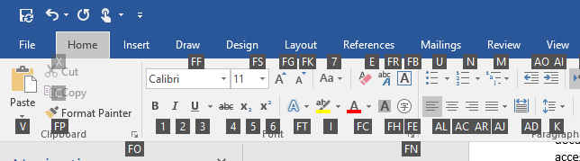

# <a name="access-keys"></a>Touches d’accès rapide

Les utilisateurs n’étant pas à l’aise avec la souris, tels que ceux souffrant d’un handicap moteur, comptent souvent sur le clavier pour naviguer dans une application et interagir avec celle-ci.  L’infrastructure XAML vous permet de proposer un accès via le clavier aux éléments d’interface utilisateur à l’aide des touches d’accès rapide et de la navigation par onglets.

- La navigation par onglets est une affordance d’accessibilité via le clavier de base (activé par défaut) qui permet aux utilisateurs de déplacer le focus entre les éléments d’interface utilisateur à l’aide des touches de tabulation et de flèches sur le clavier.
- Les touches d’accès rapide constituent une affordance d’accessibilité supplémentaire (que vous implémentez dans votre application) pour accéder rapidement aux commandes de l’application à l’aide d’une combinaison de modificateurs du clavier (touche Alt) et d’une ou de plusieurs touches alphanumériques (en général une lettre associée à la commande). Les touches d’accès rapide courantes incluent _Alt+F_ pour ouvrir le menu Fichier et _Alt+AL_ pour aligner à gauche.  

Pour plus d’informations sur l’accessibilité et la navigation via le clavier, consultez [Interaction avec le clavier](https://msdn.microsoft.com/windows/uwp/input-and-devices/keyboard-interactions) et [Accessibilité du clavier](https://msdn.microsoft.com/windows/uwp/accessibility/keyboard-accessibility). Cet article part du principe que vous comprenez les concepts abordés dans ces articles.

## <a name="access-key-overview"></a>Vue d’ensemble des touches d’accès rapide

Les touches d’accès rapide permettent aux utilisateurs d’appeler des boutons ou de définir le focus directement à l’aide du clavier, sans devoir appuyer plusieurs fois sur les touches de flèches et de tabulation. Les touches d’accès rapide sont conçues pour être facilement détectables, vous devez donc les documenter directement dans l’interface utilisateur (à l’aide d’un badge flottant au-dessus du contrôle avec la touche d’accès rapide par exemple).


_Figure 1 : Exemple de touches d’accès rapide et d’indications sur les touches associées dans Microsoft Word._

Une touche d’accès rapide correspond à un ou plusieurs caractères alphanumériques associés à un élément d’interface utilisateur. Par exemple, Microsoft Word utilise _H_ pour l’onglet Accueil, _2_ pour le bouton Annuler ou _JI_ pour l’onglet Création.

**Étendue de la touche d’accès rapide**

Une touche d’accès rapide fait partie d’une étendue spécifique. Par exemple, dans la Figure 1, _F_, _H_, _N_ et _JI_ font partie de l’étendue de la page.  Lorsque l’utilisateur appuie sur _H_, l’étendue change et passe à l’étendue de l’onglet Accueil et ses touches d’accès rapide sont affichées comme illustré dans la Figure 2. Les touches d’accès rapide _V_, _FP_, _FF_ et _FS_ font partie de l’étendue de l’onglet Accueil.



_Figure 2 : Exemple de touches d’accès rapide et d’indications sur les touches associées pour l’étendue de l’onglet Accueil dans Microsoft Word._

Deux éléments peuvent avoir les mêmes touches d’accès rapide si ceux-ci font partie d’étendues différentes. Par exemple, _2_ est la touche d’accès rapide correspondant à l’action Annuler dans l’étendue de la page (Figure 1) et correspond également à la fonction de mise en italique dans l’étendue de l’onglet Accueil (Figure 2). Toutes les touches d’accès rapide font partie de l’étendue par défaut, sauf si une autre étendue est spécifiée.

**Séquence de touches d’accès rapide**

En règle générale pour les combinaisons de touches d’accès rapide, il faut appuyer sur une touche à la fois pour effectuer l’action plutôt que d’appuyer simultanément sur les touches. (Il existe une exception à cela, que nous aborderons dans la section suivante.) La séquence de touches nécessaire pour effectuer l’action est une _séquence de touches d’accès rapide_. L’utilisateur appuie sur la touche Alt pour initier la séquence de touches d’accès rapide. Une touche d’accès rapide est appelée lorsque l’utilisateur appuie sur la dernière touche d’une séquence de touches d’accès rapide. Par exemple, l’utilisateur doit appuyer sur les touches de la séquence de touches d’accès rapide _Alt, W_ pour ouvrir l’onglet Affichage.

Un utilisateur peut appeler plusieurs touches d’accès rapide dans une séquence de touches d’accès rapide. Par exemple, pour ouvrir la fonction Reproduire la mise en forme dans un document Word, l’utilisateur appuie sur Alt pour initialiser la séquence, puis sur _H_ pour accéder à la section Accueil et modifier l’étendue de la touche d’accès, sur _F_ et finalement sur_P_. _H_ et _FP_ sont, respectivement, les touches d’accès rapide pour l’onglet Accueil et le bouton Reproduire la mise en forme.

Certains éléments finalisent une séquence de touches d’accès rapide après avoir été appelés (comme le bouton Reproduire la mise en forme) et d’autres non (comme l’onglet Accueil). Appeler une touche d’accès rapide peut entraîner l’exécution d’une commande, le déplacement du focus, la modification de l’étendue de la touche d’accès rapide ou une autre action qui lui est associée.

## <a name="access-key-user-interaction"></a>Interaction utilisateur avec les touches d’accès rapide

Pour comprendre les API de touche d’accès rapide, il est d’abord nécessaire de comprendre le modèle d’interaction utilisateur. Vous trouverez ci-dessous un résumé du modèle d’interaction utilisateur avec les touches d’accès rapide :

- Lorsque l’utilisateur appuie sur la touche Alt, la séquence de touches d’accès rapide démarre, même lorsque le focus se trouve sur un contrôle d’entrée. Ensuite, l’utilisateur peut appuyer sur la touche d’accès rapide pour appeler l’action associée. Cette interaction utilisateur nécessite que vous documentiez les touches d’accès rapide disponibles au sein de l’interface utilisateur avec des affordances visuelles, tels que des badges flottants, qui s’affichent lorsque l’utilisateur appuie sur la touche Alt.
- Lorsque l’utilisateur appuie simultanément sur la touche Alt et la touche d’accès rapide, la touche d’accès rapide est appelée immédiatement. Cela est similaire à un raccourci clavier défini par Alt +_touche d’accès rapide_. Dans ce cas, les affordances visuelles de touche d’accès rapide ne s’affichent pas. Toutefois, appeler une touche d’accès rapide peut entraîner une modification de l’étendue de la touche d’accès rapide. Dans ce cas, une séquence de touches d’accès rapide est lancée et les affordances visuelles sont affichées pour la nouvelle étendue.
    > [!NOTE]
    > Seules les touches d’accès rapide avec un seul caractère peuvent tirer parti de cette interaction utilisateur. La combinaison Alt +_touche d’accès rapide_ n’est pas prise en charge pour les touches d’accès rapide avec plusieurs caractères.    
- S’il existe plusieurs touches d’accès rapide multicaractères qui partagent certains caractères, alors, quand l’utilisateur appuie sur un caractère partagé, les touches d’accès rapide sont filtrées. Par exemple, supposons que trois touches d’accès rapide sont affichées : _A1_, _A2_ et _C_. Si l’utilisateur appuie sur _A_, alors seules les touches d’accès rapide _A1_ et _A2_ s’affichent et l’affordance visuelle pour C est masquée.
- La touche Échap permet de supprimer un niveau de filtrage. Par exemple, s’il existe des touches d’accès rapide _B_, _ABC_, _ACD_ et _ABD_ et que l’utilisateur appuie sur _A_, alors seules les touches d’accès rapide _ABC_, _ACD_ et _ABD_ sont affichées. Si l’utilisateur appuie ensuite sur _B_, seules les touches d’accès rapide _ABC_ et _ABD_ sont affichées. Si l’utilisateur appuie sur Échap, un niveau de filtrage est supprimé et les touches d’accès rapide _ABC_, _ACD_ et _ABD_ sont affichées. Si l’utilisateur appuie une nouvelle fois sur Échap, un autre niveau de filtrage est supprimé et toutes les touches d’accès rapide (_B_, _ABC_, _ACD_ et _ABD_) sont activées et leurs affordances visuelles sont affichées.
- La touche Échap permet de revenir à l’étendue précédente. Les touches d’accès rapide peuvent faire partie d’étendues différentes pour faciliter la navigation entre les applications comprenant de nombreuses commandes. La séquence de touches d’accès rapide démarre toujours sur l’étendue principale. Toutes les touches d’accès rapide font partie de l’étendue principale, sauf celles qui spécifient un élément d’interface utilisateur particulier comme étant leur propriétaire d’étendue. Lorsque l’utilisateur appelle la touche d’accès rapide d’un élément qui est un propriétaire d’étendue, l’infrastructure XAML y déplace automatiquement l’étendue et l’ajoute à une pile de navigation de touches d’accès rapide interne. La touche Échap permet de revenir à la pile de navigation de touches d’accès rapide.
- Il existe plusieurs façons pour quitter la séquence de touches d’accès rapide :
    - L’utilisateur peut appuyer sur Alt pour quitter une séquence de touches d’accès rapide en cours d’exécution. N’oubliez pas qu’en appuyant sur Alt, vous initiez également la séquence de touches accès rapide.
    - La touche Échap permet de quitter la séquence de touches d’accès rapide si elle se trouve dans l’étendue principale et qu’elle n’est pas filtrée.
        > [!NOTE]
        > La frappe de la touche Échap est transmise à la couche d’interface utilisateur pour y être traitée également.
- La touche de tabulation permet de quitter la séquence de touches d’accès rapide et renvoie à la navigation par onglets.
- La touche Entrée permet de quitter la séquence de touches d’accès rapide et envoie la séquence de touches à l’élément qui a le focus.
- Les touches de flèches permettent de quitter la séquence de touches d’accès rapide et envoient la séquence de touches à l’élément qui a le focus.
- Un événement de pointeur appuyé tel qu’un clic de souris ou une entrée tactile permet de quitter la séquence de touches d’accès rapide.
- Par défaut, appeler une touche d’accès rapide permet de quitter la séquence de touches d’accès rapide.  Toutefois, vous pouvez remplacer ce comportement en définissant la propriété [ExitDisplayModeOnAccessKeyInvoked](https://msdn.microsoft.com/library/windows/apps/windows.ui.xaml.uielement.exitdisplaymodeonaccesskeyinvoked.aspx) sur **false**.
- Des conflits de touches d’accès rapide se produisent lorsque l’utilisation d’un automate fini déterministe n’est pas possible. Les conflits de touches d’accès rapide sont déconseillés, mais peuvent se produire en raison d’un grand nombre de commandes, de problèmes de localisation ou de générations d’exécution de touches d’accès rapides.

 Il existe deux cas pour lesquels des conflits se produisent :
 - Lorsque deux éléments d’interface utilisateur ont la même valeur de touche d’accès rapide et font partie de la même étendue de touche d’accès rapide. Par exemple, une touche d’accès rapide _A1_ pour un `button1` et une touche d’accès rapide _A1_ pour un `button2` qui fait partie de l’étendue par défaut. Dans ce cas, le système résout le conflit en traitant la touche d’accès rapide du premier élément ajouté à l’arborescence visuelle. Le reste est ignoré.
 - Quand il existe plusieurs options de calcul dans la même étendue de touches d’accès rapide. Par exemple, _A_ et _A1_. Lorsque l’utilisateur appuie sur _A_, le système propose deux options : appeler la touche d’accès rapide _A_ ou continuer et utiliser le caractère A à partir de la touche d’accès rapide _A1_. Dans ce cas, le système traite uniquement le premier appel de touche d’accès rapide atteint par l’automate. Dans l’exemple avec _A_ et _A1_, le système appelle uniquement la touche d’accès rapide_A_.
-   Lorsque l’utilisateur appuie sur une touche d’accès rapide non valide dans une séquence de touches d’accès rapide, rien ne se produit. Il existe deux catégories de touches considérées comme des touches d’accès rapide valides dans une séquence de touches d’accès rapide :
 - Les touches spéciales pour quitter la séquence de touches d’accès rapide : il s’agit des touches Échap, Alt, de flèches, Entrée et de tabulation.
 - Les caractères alphanumériques affectés aux touches d’accès rapide.

## <a name="access-key-apis"></a>API de touche d’accès rapide

Pour prendre en charge l’interaction utilisateur avec les touches d’accès rapide, l’infrastructure XAML fournit les API décrites ici.

**AccessKeyManager**

[AccessKeyManager](https://msdn.microsoft.com/library/windows/apps/windows.ui.xaml.input.accesskeymanager.aspx) est une classe d’assistance que vous pouvez utiliser pour gérer votre interface utilisateur lorsque les touches d’accès rapide sont affichées ou masquées. L’événement [IsDisplayModeEnabledChanged](https://msdn.microsoft.com/library/windows/apps/windows.ui.xaml.input.accesskeymanager.isdisplaymodeenabledchanged.aspx) est déclenché chaque fois que l’application entre dans la séquence de touches d’accès rapide et la quitte. Vous pouvez interroger la propriété [IsDisplayModeEnabled](https://msdn.microsoft.com/library/windows/apps/windows.ui.xaml.input.accesskeymanager.isdisplaymodeenabled.aspx) pour déterminer si les affordances visuelles sont affichées ou masquées.  Vous pouvez également appeler [ExitDisplayMode](https://msdn.microsoft.com/library/windows/apps/windows.ui.xaml.input.accesskeymanager.exitdisplaymode.aspx) pour forcer le départ d’une séquence de touches d’accès rapide.

> [!NOTE]
> Il n’existe aucune implémentation intégrée de visuel de touche d’accès rapide, vous devez les fournir vous-même.  

**AccessKey**

La propriété [AccessKey](https://msdn.microsoft.com/library/windows/apps/windows.ui.xaml.uielement.accesskey.aspx) vous permet de spécifier une touche d’accès rapide sur un élément UIElement ou [TextElement](https://msdn.microsoft.com/library/windows/apps/windows.ui.xaml.documents.textelement.accesskey.aspx). Si deux éléments ont la même touche d’accès rapide et la même étendue, seul le premier élément ajouté à l’arborescence visuelle est traité.

Pour vous assurer que l’infrastructure XAML traite les touches d’accès rapide, les éléments d’interface utilisateur doivent être créés dans l’arborescence visuelle. S’il n’existe aucun élément dans l’arborescence visuelle avec une touche d’accès rapide, aucun événement de touche d’accès rapide n’est déclenché.

Les API de touche d’accès rapide ne prennent pas en charge les caractères qui ont besoin de deux frappes de touche pour être générés. Un caractère individuel doit correspondre à une touche sur une disposition du clavier native d’une langue particulière.  

**AccessKeyDisplayRequested/Dismissed**

Les événements [AccessKeyDisplayRequested](https://msdn.microsoft.com/library/windows/apps/windows.ui.xaml.uielement.accesskeydisplayrequested.aspx) et [AccessKeyDisplayDismissed](https://msdn.microsoft.com/library/windows/apps/windows.ui.xaml.uielement.accesskeydisplaydismissed.aspx) sont déclenchés lorsqu’une affordance visuelle de touche d’accès rapide doit être affichée ou fermée. Ces événements ne sont pas déclenchés pour les éléments dont la propriété [Visibility](https://msdn.microsoft.com/library/windows/apps/windows.ui.xaml.uielement.visibility.aspx) est définie sur **Collapsed**. L’événement AccessKeyDisplayRequested est déclenché au cours d’une séquence de touches d’accès rapide chaque fois que l’utilisateur appuie sur un caractère qui est utilisé par la touche d’accès rapide. Par exemple, si une touche d’accès rapide est définie sur _AB_, cet événement est déclenché lorsque l’utilisateur appuie sur Alt, et une nouvelle fois lorsque l’utilisateur appuie sur _A_. Lorsque l’utilisateur appuie sur _B_, l’événement AccessKeyDisplayDismissed est déclenché.

**AccessKeyInvoked**

L’événement [AccessKeyInvoked](https://msdn.microsoft.com/library/windows/apps/windows.ui.xaml.uielement.accesskeyinvoked.aspx) est déclenché lorsqu’un utilisateur atteint le dernier caractère d’une touche d’accès rapide. Une touche d’accès rapide peut comporter un ou plusieurs caractères. Par exemple, pour les touches d’accès rapide _A_ et _BC_, lorsqu’un utilisateur appuie sur _Alt, A_ ou _Alt, B, C_, l’événement est déclenché, mais pas lorsque l’utilisateur appuie juste sur _Alt, B_. Cet événement est déclenché lorsque la touche est enfoncée et non lorsqu’elle est relâchée.

**IsAccessKeyScope**

La propriété [IsAccessKeyScope](https://msdn.microsoft.com/library/windows/apps/windows.ui.xaml.uielement.isaccesskeyscope.aspx) vous permet de spécifier qu’un élément UIElement est la racine d’une étendue de touche d’accès rapide. L’événement AccessKeyDisplayRequested est déclenché pour cet élément, mais pas pour ses enfants. Quand un utilisateur appelle cet élément, l’infrastructure XAML modifie automatiquement l’étendue et déclenche l’événement AccessKeyDisplayRequested sur ses enfants et l’événement AccessKeyDisplayDismissed sur d’autres éléments d’interface utilisateur (y compris le parent).  La séquence de touches d’accès rapide n’est pas quittée lorsque l’étendue est modifiée.

**AccessKeyScopeOwner**

Pour permettre à un élément de faire partie de l’étendue d’un autre élément (la source) qui n’est pas son parent dans l’arborescence visuelle, vous pouvez définir la propriété [AccessKeyScopeOwner](https://msdn.microsoft.com/library/windows/apps/windows.ui.xaml.uielement.accesskeyscopeowner.aspx). L’élément lié à la propriété AccessKeyScopeOwner doit avoir l’élément IsAccessKeyScope défini sur **true**. Sinon, une exception est levée.

**ExitDisplayModeOnAccessKeyInvoked**

Par défaut, lorsqu’une touche d’accès rapide est appelée et que l’élément n’est pas un propriétaire de l’étendue, la séquence de touches d’accès rapide est finalisée et l’événement [AccessKeyManager.IsDisplayModeEnabledChanged](https://msdn.microsoft.com/library/windows/apps/windows.ui.xaml.input.accesskeymanager.isdisplaymodeenabledchanged.aspx) est déclenché. Vous pouvez définir la propriété [ExitDisplayModeOnAccessKeyInvoked](https://msdn.microsoft.com/library/windows/apps/windows.ui.xaml.uielement.exitdisplaymodeonaccesskeyinvoked.aspx) sur **false** pour remplacer ce comportement et empêcher le départ de la séquence de touches d’accès rapide après qu’elle est appelée. (Cette propriété se trouve sur les éléments [UIElement](https://msdn.microsoft.com/library/windows/apps/windows.ui.xaml.uielement.exitdisplaymodeonaccesskeyinvoked.aspx) et [TextElement](https://msdn.microsoft.com/library/windows/apps/windows.ui.xaml.documents.textelement.exitdisplaymodeonaccesskeyinvoked.aspx)).

> [!NOTE]
> Si l’élément est un propriétaire d’étendue (`IsAccessKeyScope="True"`), l’application entre dans une nouvelle étendue de touche d’accès rapide et l’événement IsDisplayModeEnabledChanged n’est pas déclenché.

**Localisation**

Les touches d’accès rapide peuvent être localisées en plusieurs langues et chargées à l’exécution à l’aide des API [ResourceLoader](https://msdn.microsoft.com/library/windows/apps/windows.applicationmodel.resources.resourceloader.aspx).

## <a name="control-patterns-used-when-an-access-key-is-invoked"></a>Modèles de contrôle utilisés lorsqu’une touche d’accès rapide est appelée

Les modèles de contrôle sont les implémentations d’interface qui exposent les fonctionnalités des contrôles courants ; par exemple, les boutons implémentent le modèle de contrôle **Invoke** et cela déclenche l’événement **Click**. Lorsqu’une touche d’accès rapide est appelée, l’infrastructure XAML recherche si l’élément appelé implémente un modèle de contrôle et l’exécute le cas échéant. Si l’élément comporte plusieurs modèles de contrôle, un seul est appelé et les autres sont ignorés. Les modèles de contrôle sont recherchés dans l’ordre suivant :

1.  Invoke. Par exemple, un élément Button.
2.  Toggle. Par exemple, un élément Checkbox.
3.  Selection. Par exemple, un élément RadioButton.
4.  Expand/Collapse. Par exemple, un élément ComboBox.

Si un modèle de contrôle n’est pas trouvé, l’appel de touche d’accès rapide apparaît sous la forme d’un no-op, et un message de débogage est enregistré pour vous aider à résoudre cette situation : « Aucun modèle d’automation pour ce composant n’a été trouvé. Implémentez le comportement souhaité dans le gestionnaire d’événements pour AccessKeyInvoked. Définir la propriété Handled sur true dans votre gestionnaire d’événements supprime ce message. »

> [!NOTE]
> Le type de processus Application du débogueur doit être défini sur _Mixte (managé et natif)_ ou _Natif_ dans les paramètres de débogage de Visual Studio pour voir ce message.

Si vous ne souhaitez pas qu’une touche d’accès exécute son modèle de contrôle par défaut, ou si l’élément n’a pas de modèle de contrôle, vous devez gérer l’événement [AccessKeyInvoked](https://msdn.microsoft.com/library/windows/apps/windows.ui.xaml.uielement.accesskeyinvoked.aspx) et implémenter le comportement souhaité.
```csharp
private void OnAccessKeyInvoked(UIElement sender, AccessKeyInvokedEventArgs args)
{
    args.Handled = true;
    //Do something
}
```

Pour plus d’informations sur les modèles de contrôle, consultez [Vue d’ensemble sur les modèles de contrôle UI Automation](https://msdn.microsoft.com/library/windows/desktop/ee671194.aspx).

## <a name="access-keys-and-narrator"></a>Touches d’accès rapide et Narrateur

Windows Runtime a des fournisseurs UI Automation qui exposent des propriétés sur les éléments de Microsoft UI Automation. Ces propriétés permettent aux applications de client UI Automation de détecter des informations sur les parties de l’interface utilisateur. La propriété [AutomationProperties.AccessKey](https://msdn.microsoft.com/library/windows/apps/hh759763) permet aux clients, tels que Narrateur, de détecter la touche d’accès rapide associée à un élément. Narrateur lit cette propriété chaque fois qu’un élément a le focus. Si la propriété AutomationProperties.AccessKey n’a pas de valeur, l’infrastructure XAML renvoie la valeur de propriété [AccessKey](https://msdn.microsoft.com/library/windows/apps/windows.ui.xaml.uielement.accesskey.aspx) de l’élément UIElement ou TextElement. Vous n’avez pas besoin de configurer AutomationProperties.AccessKey si la propriété AccessKey possède déjà une valeur.

## <a name="example-access-key-for-button"></a>Exemple : Touche d’accès rapide pour un bouton

Cet exemple montre comment créer une touche d’accès rapide pour un bouton. Des info-bulles sont utilisées comme affordances visuelles pour implémenter un badge flottant qui contient la touche d’accès rapide.

> [!NOTE]
> Les info-bulles sont utilisées par souci de simplicité, mais nous vous recommandons de créer votre propre contrôle pour l’afficher à l’aide, par exemple, d’un élément [Popup](https://msdn.microsoft.com/library/windows/apps/windows.ui.xaml.controls.primitives.popup.aspx).

L’infrastructure XAML appelle automatiquement le gestionnaire pour l’événement Click, vous n’avez donc pas besoin de gérer l’événement AccessKeyInvoked. L’exemple fournit des affordances visuelles seulement pour les caractères restant pour appeler la touche d’accès rapide à l’aide de la propriété [AccessKeyDisplayRequestedEventArgs.PressedKeys](https://msdn.microsoft.com/library/windows/apps/windows.ui.xaml.input.accesskeydisplayrequestedeventargs.pressedkeys.aspx). Par exemple, s’il existe trois touches d’accès rapide affichées : _A1_, _A2_ et _C_, et que l’utilisateur appuie sur _A_, alors seules les touches d’accès rapide_A1_ et _A2_ ne sont pas filtrées et s’affichent sous la forme _1_ et _2_ au lieu de _A1_ et _A2_.

```xaml
<StackPanel
        VerticalAlignment="Center"
        HorizontalAlignment="Center"
        Background="{ThemeResource ApplicationPageBackgroundThemeBrush}">
        <Button Content="Press"
                AccessKey="PB"
                AccessKeyDisplayDismissed="OnAccessKeyDisplayDismissed"
                AccessKeyDisplayRequested="OnAccessKeyDisplayRequested"
                Click="DoSomething" />
        <TextBlock Text="" x:Name="textBlock" />
    </StackPanel>
```

```csharp
 public sealed partial class ButtonSample : Page
    {
        public ButtonSample()
        {
            this.InitializeComponent();
        }

        private void DoSomething(object sender, RoutedEventArgs args)
        {
            textBlock.Text = "Access Key is working!";
        }

        private void OnAccessKeyDisplayRequested(UIElement sender, AccessKeyDisplayRequestedEventArgs args)
        {
            var tooltip = ToolTipService.GetToolTip(sender) as ToolTip;

            if (tooltip == null)
            {
                tooltip = new ToolTip();
                tooltip.Background = new SolidColorBrush(Windows.UI.Colors.Black);
                tooltip.Foreground = new SolidColorBrush(Windows.UI.Colors.White);
                tooltip.Padding = new Thickness(4, 4, 4, 4);
                tooltip.VerticalOffset = -20;
                tooltip.Placement = PlacementMode.Bottom;
                ToolTipService.SetToolTip(sender, tooltip);
            }

            if (string.IsNullOrEmpty(args.PressedKeys))
            {
                tooltip.Content = sender.AccessKey;
            }
            else
            {
                tooltip.Content = sender.AccessKey.Remove(0, args.PressedKeys.Length);
            }

            tooltip.IsOpen = true;
        }
        private void OnAccessKeyDisplayDismissed(UIElement sender, AccessKeyDisplayDismissedEventArgs args)
        {
            var tooltip = ToolTipService.GetToolTip(sender) as ToolTip;
            if (tooltip != null)
            {
                tooltip.IsOpen = false;
                //Fix to avoid show tooltip with mouse
                ToolTipService.SetToolTip(sender, null);
            }
        }
    }
```

## <a name="example-scoped-access-keys"></a>Exemple : Touches d’accès rapide dans l’étendue

Cet exemple montre comment créer des touches d’accès rapide dans une étendue. La propriété IsAccessKeyScope de PivotItem empêche les touches d’accès rapide des éléments enfants de PivotItem de s’afficher quand l’utilisateur appuie sur Alt. Ces touches d’accès rapide sont affichées uniquement quand l’utilisateur appelle PivotItem, car l’infrastructure XAML bascule automatiquement l’étendue. L’infrastructure masque également les touches d’accès rapide des autres étendues.

Cet exemple montre également comment gérer l’événement AccessKeyInvoked. PivotItem n’implémente pas n’importe quel modèle de contrôle, afin que l’infrastructure XAML n’appelle pas n’importe quelle action par défaut. Cette implémentation montre comment sélectionner le PivotItem qui a été appelé à l’aide de la touche d’accès rapide.

Enfin, l’exemple illustre l’événement IsDisplayModeChanged dans lequel vous pouvez effectuer une action quand le mode d’affichage change. Dans cet exemple, le contrôle Pivot est réduit jusqu’à ce que l’utilisateur appuie sur Alt. Lorsque l’utilisateur arrête d’interagir avec le Pivot, il est réduit à nouveau. Vous pouvez utiliser IsDisplayModeEnabled pour vérifier si le mode d’affichage de touche d’accès rapide est activé ou désactivé.

```xaml   
<Grid Background="{ThemeResource ApplicationPageBackgroundThemeBrush}">
        <Pivot x:Name="MyPivot" VerticalAlignment="Center" HorizontalAlignment="Center" >
            <Pivot.Items>
                <PivotItem
                    x:Name="PivotItem1"
                    AccessKey="A"
                    AccessKeyInvoked="OnAccessKeyInvoked"
                    AccessKeyDisplayDismissed="OnAccessKeyDisplayDismissed"
                    AccessKeyDisplayRequested="OnAccessKeyDisplayRequested"
                    IsAccessKeyScope="True">
                    <PivotItem.Header>
                        <TextBlock Text="A Options"/>
                    </PivotItem.Header>
                    <StackPanel Orientation="Horizontal" >
                        <Button Content="ButtonAA" AccessKey="A"
                                AccessKeyDisplayDismissed="OnAccessKeyDisplayDismissed"
                                AccessKeyDisplayRequested="OnAccessKeyDisplayRequested" />
                        <Button Content="ButtonAD1" AccessKey="D1"
                                AccessKeyDisplayDismissed="OnAccessKeyDisplayDismissed"
                                AccessKeyDisplayRequested="OnAccessKeyDisplayRequested"  />
                        <Button Content="ButtonAD2" AccessKey="D2"
                                AccessKeyDisplayDismissed="OnAccessKeyDisplayDismissed"
                                AccessKeyDisplayRequested="OnAccessKeyDisplayRequested"/>
                    </StackPanel>
                </PivotItem>
                <PivotItem
                    x:Name="PivotItem2"
                    AccessKeyInvoked="OnAccessKeyInvoked"
                    AccessKeyDisplayDismissed="OnAccessKeyDisplayDismissed"
                    AccessKeyDisplayRequested="OnAccessKeyDisplayRequested"
                    AccessKey="B"
                    IsAccessKeyScope="true">
                    <PivotItem.Header>
                        <TextBlock Text="B Options"/>
                    </PivotItem.Header>
                    <StackPanel Orientation="Horizontal">
                        <Button AccessKey="B" Content="ButtonBB"
                                AccessKeyDisplayDismissed="OnAccessKeyDisplayDismissed"
                                AccessKeyDisplayRequested="OnAccessKeyDisplayRequested"  />
                        <Button AccessKey="F1" Content="ButtonBF1"
                                AccessKeyDisplayDismissed="OnAccessKeyDisplayDismissed"
                                AccessKeyDisplayRequested="OnAccessKeyDisplayRequested"  />
                        <Button AccessKey="F2" Content="ButtonBF2"  
                                AccessKeyDisplayDismissed="OnAccessKeyDisplayDismissed"
                                AccessKeyDisplayRequested="OnAccessKeyDisplayRequested"/>
                    </StackPanel>
                </PivotItem>
            </Pivot.Items>
        </Pivot>
    </Grid>
```

```csharp
public sealed partial class ScopedAccessKeys : Page
    {
        public ScopedAccessKeys()
        {
            this.InitializeComponent();
            AccessKeyManager.IsDisplayModeEnabledChanged += OnDisplayModeEnabledChanged;
            this.Loaded += OnLoaded;
        }

        void OnLoaded(object sender, object e)
        {
            //To let the framework discover the access keys, the elements should be realized
            //on the visual tree. If there are no elements in the visual
            //tree with access key, the framework won't raise the events.
            //In this sample, if you define the Pivot as collapsed on the constructor, the Pivot
            //will have a lazy loading and the access keys won't be enabled.
            //For this reason, we make it visible when creating the object
            //and we collapse it when we load the page.
            MyPivot.Visibility = Visibility.Collapsed;
        }

        void OnAccessKeyInvoked(UIElement sender, AccessKeyInvokedEventArgs args)
        {
            args.Handled = true;
            MyPivot.SelectedItem = sender as PivotItem;
        }
        void OnDisplayModeEnabledChanged(object sender, object e)
        {
            if (AccessKeyManager.IsDisplayModeEnabled)
            {
                MyPivot.Visibility = Visibility.Visible;
            }
            else
            {
                MyPivot.Visibility = Visibility.Collapsed;

            }
        }

        DependencyObject AdjustTarget(UIElement sender)
        {
            DependencyObject target = sender;
            if (sender is PivotItem)
            {
                PivotItem pivotItem = target as PivotItem;
                target = (sender as PivotItem).Header as TextBlock;
            }
            return target;
        }

        void OnAccessKeyDisplayRequested(UIElement sender, AccessKeyDisplayRequestedEventArgs args)
        {
            DependencyObject target = AdjustTarget(sender);
            var tooltip = ToolTipService.GetToolTip(target) as ToolTip;

            if (tooltip == null)
            {
                tooltip = new ToolTip();
                tooltip.Background = new SolidColorBrush(Windows.UI.Colors.Black);
                tooltip.Foreground = new SolidColorBrush(Windows.UI.Colors.White);
                tooltip.Padding = new Thickness(4, 4, 4, 4);
                tooltip.VerticalOffset = -20;
                tooltip.Placement = PlacementMode.Bottom;
                ToolTipService.SetToolTip(target, tooltip);
            }

            if (string.IsNullOrEmpty(args.PressedKeys))
            {
                tooltip.Content = sender.AccessKey;
            }
            else
            {
                tooltip.Content = sender.AccessKey.Remove(0, args.PressedKeys.Length);
            }

            tooltip.IsOpen = true;
        }
        void OnAccessKeyDisplayDismissed(UIElement sender, AccessKeyDisplayDismissedEventArgs args)
        {
            DependencyObject target = AdjustTarget(sender);

            var tooltip = ToolTipService.GetToolTip(target) as ToolTip;
            if (tooltip != null)
            {
                tooltip.IsOpen = false;
                //Fix to avoid show tooltip with mouse
                ToolTipService.SetToolTip(target, null);
            }
        }
    }
```


<!--HONumber=Dec16_HO2-->


