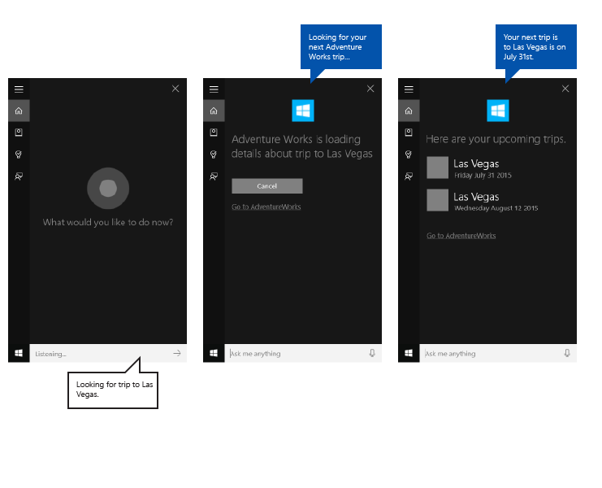
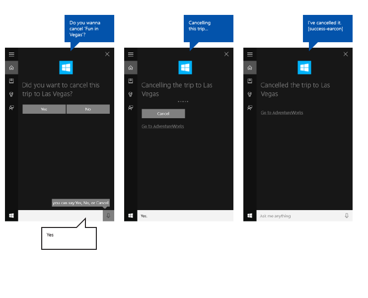
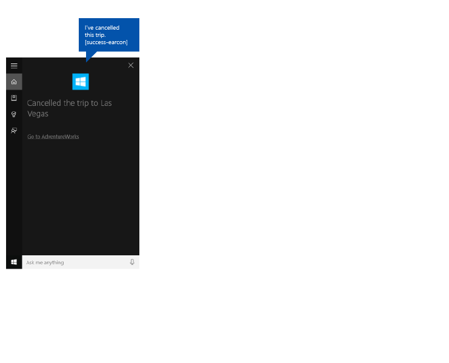
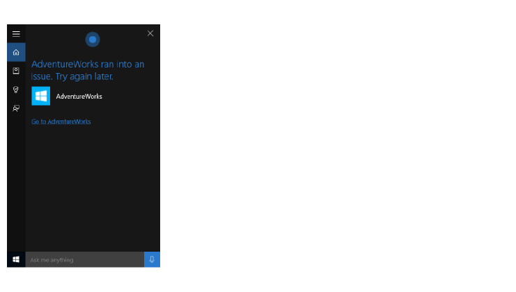

# Recommandations relatives à la conception de Cortana

\[ Mise à jour pour les applications UWP sur Windows 10. Pour les articles sur Windows 8.x, voir l’[archive](http://go.microsoft.com/fwlink/p/?linkid=619132). \]

Ces recommandations et ces instructions décrivent comment votre application peut utiliser **Cortana** au mieux pour interagir avec l’utilisateur, l’aider à accomplir une tâche et indiquer clairement comment tout cela se passe.

**Cortana** permet aux applications s’exécutant à l’arrière-plan d’inviter l’utilisateur à confirmer ou à lever toute ambiguïté, et de fournir en retour à l’utilisateur des commentaires sur l’état de la commande vocale. Ce processus, léger et rapide, ne force pas l’utilisateur à quitter l’expérience **Cortana** ou à changer de contexte pour le définir dans l’application.

Si l’utilisateur doit avoir l’impression que **Cortana** contribue à rendre le processus aussi léger et facile que possible, vous souhaiterez probablement que **Cortana** explicite également que c’est votre application qui effectue la tâche.

Nous utilisons une application de planification et de gestion de voyages nommée **Adventure Works** intégrée à l’interface utilisateur **Cortana**, affichée ici, pour illustrer un grand nombre de concepts et de fonctionnalités traités.

##      Écriture interactive

Pour garantir la réussite des interactions de **Cortana**, vous êtes tenu de suivre certains principes fondamentaux lors de l’élaboration des chaînes de synthèse vocale (TTS) et d’interface graphique utilisateur.

<table>
<colgroup>
<col width="33%" />
<col width="33%" />
<col width="33%" />
</colgroup>
<thead>
<tr class="header">
<th align="left">Principe</th>
<th align="left">Exemple incorrect</th>
<th align="left">Exemple correct</th>
</tr>
</thead>
<tbody>
<tr class="odd">
<td align="left">

<dl>
<dt>Efficacité</dt>
<dd>
Utilisez le moins de mots possible et indiquez les informations les plus importantes au début.

</dd>
</dl></td>
<td align="left">
Bien sûr, je peux faire cela. Quel film souhaitez-vous rechercher aujourd’hui ? Nous disposons d’une grande collection.
</td>
<td align="left">
Quel film recherchez-vous ?
</td>
</tr>
<tr class="even">
<td align="left">

<dl>
<dt>Pertinence</dt>
<dd>
Indiquez des informations appropriées uniquement pour la tâche, le contenu et le contexte.

</dd>
</dl></td>
<td align="left">
Je viens de l’ajouter à votre playlist. Juste pour que vous le sachiez, le niveau de votre batterie est faible.
</td>
<td align="left">
Je viens de l’ajouter à votre playlist.
</td>
</tr>
<tr class="odd">
<td align="left">

<dl>
<dt>Clarté</dt>
<dd>
Évitez toute ambiguïté. Utilisez le langage courant et non un jargon technique.

</dd>
</dl></td>
<td align="left">
Aucun résultat pour la requête portant sur les &quot;voyages à Las Vegas&quot;.
</td>
<td align="left">
Je n’ai pas trouvé de voyages pour Las Vegas.
</td>
</tr>
<tr class="even">
<td align="left">

<dl>
<dt>Fiabilité </dt>
<dd>
Soyez aussi exact que possible. Soyez sincère quant à ce qui se passe à l’arrière-plan ; si une tâche n’est pas encore terminée, ne dites pas qu’elle l’est. Respectez la confidentialité ; ne lisez pas les informations privées à voix haute.

</dd>
</dl></td>
<td align="left">
Je n’ai pas trouvé ce film. Il n’a pas encore dû être commercialisé.
</td>
<td align="left">
Je n’ai pas trouvé ce film dans notre catalogue.
</td>
</tr>
</tbody>
</table>

 

Écrivez comme vous parlez. Utilisez une formulation naturelle plutôt qu’une construction précise d’un point de vue grammatical. Par exemple, les contractions utilisées à l’oral, telles que « t’arrives » pour « tu arrives » sont adaptées à la lecture à haute voix TTS.

Utilisez la première personne implicite lorsque cela est possible et naturel. Par exemple, dans la phrase « Recherche de votre prochain voyage Adventure Works », il est implicite qu’une personne effectue la recherche même si le pronom « Je » n’est pas précisé.

Utilisez des variantes pour donner un ton plus naturel à votre application. Proposez différentes versions de vos chaînes TTS et de celles de l’interface graphique utilisateur pour dire la même chose. Par exemple, « Quel film voulez-vous voir ? » pourrait également se dire sous la forme « Quel film voulez-vous regarder ? ». Les personnes ne disent pas exactement la même chose à chaque fois. Veillez seulement à synchroniser votre version TTS avec celle de l’interface graphique utilisateur.

Utilisez judicieusement les expressions telles que « OK » et « D’accord » dans vos réponses. Si elles peuvent indiquer une reconnaissance et un sentiment de progression, elles peuvent également devenir répétitives si elles sont utilisées trop souvent et sans variante.

**Remarque** Utilisez des expressions de reconnaissance dans TTS uniquement. En raison de l’espace limité sur le canevas **Cortana**, ne les répétez pas dans les chaînes correspondantes de l’interface graphique utilisateur.

 

Utilisez des phrases courtes dans vos réponses pour des interactions plus naturelles et un gain d’espace supplémentaire dans le canevas **Cortana**. Par exemple, préférez « Je n’ai pas pu trouver ce film » à « Je n’ai pas été en mesure de trouver ce film ». Écrivez pour l’oral et non l’écrit.

Utilisez une langue comprise par le système. Les utilisateurs ont tendance à répéter les termes qui leur sont présentés. Sachez ce que vous affichez.

Variez vos réponses en les faisant tourner ou en sélectionnant de façon aléatoire dans une collection d’alternatives. Par exemple, « Quel film voulez-vous voir ? » et « Quel film voulez-vous regarder ? ». De cette façon, le ton de votre application est plus naturel et unique.

##      Localisation

Pour lancer une action à l’aide d’une commande vocale, votre application doit enregistrer les commandes vocales dans la langue sélectionnée par l’utilisateur sur son appareil (Paramètres &gt; Système &gt; Voix &gt; Langue vocale).

Vous devez localiser les commandes vocales correspondant aux réponses de l’application, et l’ensemble des chaînes TTS et de l’interface graphique utilisateur.

Vous devez éviter les longues chaînes d’interface graphique utilisateur. Le canevas **Cortana** fournit trois lignes pour les réponses et tronque les chaînes plus longues.

Pour plus d’informations, voir la [Section Globlisation et localisation](../globalizing/globalizing-portal.md).

##      Ressources d’images et mise à l’échelle

Les applications de plateforme Windows universelle (UWP) peuvent sélectionner automatiquement le logo d’application le plus approprié en fonction de paramètres spécifiques et des fonctionnalités de l’appareil (contraste élevé, pixels effectifs, paramètres régionaux, etc.). Il vous suffit de fournir les images et de vérifier que vous utilisez la convention d’affectation de noms et l’organisation de dossiers appropriées dans le projet d’application pour les différentes versions de ressources. Si vous ne fournissez les versions de ressources recommandées, l’accessibilité, la localisation et la qualité des images peuvent être affectées, en fonction des préférences de l’utilisateur, de ses aptitudes, du type d’appareil utilisé et de l’emplacement.

Pour plus d’informations sur les ressources d’image pour les facteurs de contraste élevé et d’échelle, voir [Recommandations en matière de ressources de vignette et d’icône](../controls-and-patterns/tiles-and-notifications-app-assets.md).

Les ressources sont nommées à l’aide de qualificateurs. Les qualificateurs de ressources sont des modificateurs de noms de fichiers et de dossiers qui identifient le contexte dans lequel une version particulière d’une ressource doit être utilisée.

La convention d’affectation de noms standard est « foldername/qualifiername-value\[\_qualifiername-value\]/filename.qualifiername-value\[\_qualifiername-value\].ext ». Par exemple : dans le code, images/en-US/logo.scale-100\_contrast-white.png est simplement identifié par le dossier racine et le nom de fichier : images/logo.png. Voir [Globalisation et localisation](../globalizing/globalizing-portal.md) et [Comment nommer des ressources à l’aide de qualificateurs](https://msdn.microsoft.com/library/windows/apps/xaml/hh965324).

Nous vous conseillons de marquer la langue par défaut dans les fichiers de ressources de type chaîne (par exemple, « en-US\\resources.resw ») et le facteur d’échelle par défaut dans les images (par exemple, « logo.scale-100.png »), même si dans l’immédiat, vous ne pensez localiser ces ressources, ni les proposer avec plusieurs résolutions. Toutefois, nous vous recommandons au minimum de fournir des ressources pour les facteurs d’échelle 100, 200 et 400.

**Important**  
L’icône de l’application utilisée dans la zone de titre du canevas Cortana est l’icône Square44x44Logo spécifiée dans le fichier « Package.appxmanifest ». 

Vous pouvez également spécifier une icône pour chaque résultat d’une requête affiché dans la zone de contenu du canevas Cortana. Les formats d’image valides pour les icônes de résultats sont :

-   68 x 68
-   68 x 92
-   280 x 140

##      Exemple

Cet exemple illustre un flux de tâches de bout en bout pour une application en arrière-plan dans **Cortana**. Nous utilisons l’application **Adventure Works** pour annuler un voyage à Las Vegas.

Voici les étapes décrites dans cette image :

1.  L’utilisateur appuie sur le microphone pour lancer **Cortana**.
2.  L’utilisateur dit « Annuler mon voyage Adventure Works à Vegas » pour lancer l’application **Adventure Works en arrière-plan**. L’application utilise à la fois la reconnaissance vocale et le canevas **Cortana** pour interagir avec l’utilisateur.
3.  **Cortana** se transforme en un écran de transfert qui indique le commentaire de reconnaissance de l’utilisateur (« Je vais contacter Adventure Works pour ce projet »), une barre d’état et un bouton d’annulation.
4.  Dans ce cas, l’utilisateur dispose de plusieurs voyages correspondant à la requête et l’application affiche un écran permettant de lever l’ambiguïté, dans lequel tous les résultats sont répertoriés et où le message « Lequel voulez-vous annuler ? » s’affiche.
5.  L’utilisateur indique l’élément « Conférence technique à Las Vegas ».
6.  L’annulation est irréversible, c’est la raison pour laquelle un écran s’affiche dans l’application pour demander à l’utilisateur de confirmer son intention.
7.  L’utilisateur dit « Oui ».
8.  Un écran d’achèvement s’affiche.

Ces étapes sont expliquées ici plus en détail.

###      Transfert

|                                                                                                          |
|----------------------------------------------------------------------------------------------------------|
|               |
| Recherche du voyage sans écran de transfert                                                                              |
|  |
| Annulation du voyage avec écran de transfert                                                                          |

 

Les tâches auxquelles l’application peut répondre en moins de 500 ms et qui ne nécessitent pas d’informations supplémentaires de la part de l’utilisateur peuvent être effectuées sans aucune autre action de **Cortana**, excepté celle d’afficher l’écran d’achèvement.

Si votre application met plus de 500 ms à répondre, **Cortana** propose un écran de transfert. L’icône et le nom de l’application s’affichent. Vous devez fournir à l’interface graphique utilisateur et à TTS des chaînes de transfert indiquant que la commande vocale a été correctement comprise. L’écran de transfert s’affiche pendant 5 secondes maximum ; si votre application ne répond pas dans cet intervalle, **Cortana** affiche un écran d’erreur générique.

###      Recommandations relatives à l’interface graphique utilisateur et à TTS pour les écrans de transfert

Indiquez clairement que la tâche est en cours.

Utilisez le présent.

Utilisez un verbe d’action qui confirme le lancement de la tâche et faites référence à l’entité spécifique.

Utilisez un terme générique qui n’implique pas un engagement par rapport à l’action incomplète demandée. Par exemple, « Recherche de votre voyage » au lieu de « Annulation de votre voyage ». Dans ce cas, si aucun résultat n’est renvoyé à l’utilisateur, ce dernier n’entendra pas une phrase de type : « Annulation de votre voyage à Las Vegas... Je n’ai pas trouvé de voyage à Las Vegas. »

Soyez clair sur le fait que la tâche ne s’est pas encore déroulée si l’application doit encore résoudre l’entité demandée. Par exemple, notez que nous disons « Recherche de votre voyage » au lieu de « Annulation de votre voyage », ne connaissant pas encore le nombre de résultats.

Les chaînes de l’interface graphique utilisateur et de TTS peuvent être identiques sans que cela soit une nécessité. Faites en sorte que la chaîne de l’interface graphique utilisateur soit courte pour éviter la troncation ou la duplication d’autres éléments visuels.

| TTS                                                    | INTERFACE GRAPHIQUE UTILISATEUR                                 |
|--------------------------------------------------------|-------------------------------------|
| Recherche de votre prochain voyage Adventure Works.            | Recherche de votre prochain voyage...         |
| Recherche de votre voyage Adventure Works à Falls City. | Recherche de voyage à Falls City… |

 

###      Progression

|                                                                                             |
|---------------------------------------------------------------------------------------------|
|  |
| Annulation du voyage avec écran de progression                                                            |

 

Lorsque les étapes d’une tâche prennent du temps, votre application doit intervenir pour tenir l’utilisateur au courant du déroulement de la progression par le biais d’un écran. L’icône de l’application s’affiche. Vous devez fournir les chaînes de progression de l’interface graphique utilisateur et de TTS permettant d’indiquer que la tâche est en cours.

Vous devez fournir un lien vers votre application accompagné des paramètres de lancement pour démarrer l’application dans l’état approprié. Cela permet à l’utilisateur d’afficher ou d’effectuer la tâche lui-même. **Cortana** fournit le texte du lien (tel que, « Accéder à Adventure Works »).

Les écrans de progression s’affichent pendant 5 secondes chacun. Ils doivent ensuite être remplacés par un autre écran, sans quoi la tâche expire.

Ces écrans peuvent suivre un écran de progression :

-   Progression
-   Confirmation (explicite, comme décrite ultérieurement)
-   Levée d’ambiguïté
-   Achèvement

###      Recommandations relatives à l’interface graphique utilisateur et à TTS pour les écrans de progression

Utilisez le présent.

Utilisez un verbe d’action qui confirme que la tâche est en cours.

**Interface graphique utilisateur** : si l’entité s’affiche, faites-y référence (« Annulation de ce voyage… ») ; si aucune entité ne s’affiche, indiquez explicitement l’entité (« Annulation de « Conférence technique à Las Vegas »).

**TTS** : vous devez inclure uniquement une chaîne TTS sur le premier écran de progression. Si d’autres écrans de progression sont nécessaires, envoyez une chaîne vide, {}, comme chaîne de texte TTS et fournissez uniquement une chaîne d’interface graphique utilisateur.

| Conditions                                              | TTS                            | INTERFACE GRAPHIQUE UTILISATEUR                            |
|---------------------------------------------------------|--------------------------------|--------------------------------|
| ENTITÉ LUE LORS DE LA TENTATIVE PRÉCÉDENTE/ ENTITÉ AFFICHÉE À L’ÉCRAN     | Annulation de ce voyage...          | Annulation de ce voyage...          |
| ENTITÉ NON LUE LORS DE LA TENTATIVE PRÉCÉDENTE/ENTITÉ AFFICHÉE À L’ÉCRAN | Annulation de votre voyage à Vegas... | Annulation de ce voyage...          |
| ENTITÉ NON LUE LORS DE LA TENTATIVE PRÉCÉDENTE/ ENTITÉ NON AFFICHÉE        | Annulation de votre voyage à Vegas... | Annulation de votre voyage à Vegas… |

 

###      Confirmation

|                                                                                                     |
|-----------------------------------------------------------------------------------------------------|
|  |
| Annulation du voyage avec écran de confirmation                                                                |

 

Certaines tâches peuvent être confirmées implicitement par la nature de la commande utilisateur ; d’autres sont potentiellement plus sensibles et requièrent une confirmation explicite. Voici quelques recommandations indiquant dans quels cas utiliser la confirmation implicite ou explicite.

Les chaînes de l’interface graphique utilisateur et TTS figurant sur l’écran de confirmation sont définies par votre application. L’icône de l’application, si elle est fournie, s’affiche à la place de l’avatar **Cortana**.

Une fois que le client a répondu à la confirmation, votre application doit afficher l’écran suivant dans les 500 ms pour éviter le recours à un écran de progression.

Utilisez la confirmation explicite dans les cas suivants :

-   Le contenu n’est plus sous le contrôle de l’utilisateur (comme un message texte, un e-mail ou une publication sur les réseaux sociaux)
-   Une action ne peut pas être annulée (comme un achat ou la suppression d’un élément)
-   Le résultat pourrait être gênant (comme l’appel d’une mauvaise personne)
-   Une reconnaissance plus complexe est requise (comme une transcription ouverte)

Utilisez la confirmation implicite dans les cas suivants :

-   Le contenu est enregistré pour l’utilisateur uniquement (comme une note pour lui-même)
-   Il existe un moyen facile de revenir sur son action (comme l’activation ou la désactivation d’une alarme)
-   La tâche doit être rapide (comme saisir une idée avant de l’oublier)
-   La précision est élevée (comme un menu simple)

###      Recommandations relatives à l’interface graphique utilisateur et à TTS pour les écrans de confirmation

Utilisez le présent.

Posez à l’utilisateur une question permettant de lever l’ambiguïté à laquelle il est possible de répondre par « Oui » ou « Non ». La question doit explicitement confirmer ce que l’utilisateur tente de faire sans autre possibilité évidente.

Fournissez une variante de la question pour une nouvelle invite, au cas où la commande vocale n’ait pas été comprise la première fois.

**Interface graphique utilisateur** : si l’entité est affichée, faites-y référence. Si aucune entité n’est affichée, mentionnez-la explicitement.

**TTS** : par souci de clarté, faites toujours référence à l’élément ou à l’entité spécifique à moins qu’elle n’ait été lue à haute voix par le système dès la première tentative.

| Conditions                                              | TTS                                        | INTERFACE GRAPHIQUE UTILISATEUR                                           |
|---------------------------------------------------------|--------------------------------------------|-----------------------------------------------|
| ENTITÉ NON LUE AU TOUR PRÉCÉDENT/ENTITÉ AFFICHÉE À L’ÉCRAN | Voulez-vous annuler Conférence technique à Las Vegas ? | Annuler ce voyage ?                             |
| ENTITÉ NON LUE LORS DE LA TENTATIVE PRÉCÉDENTE/ ENTITÉ NON AFFICHÉE        | Voulez-vous annuler Conférence technique à Las Vegas ? | Annuler Conférence technique à Las Vegas ?                 |
| ENTITÉ LUE LORS DE LA TENTATIVE PRÉCÉDENTE/ ENTITÉ NON AFFICHÉE            | Voulez-vous annuler ce voyage ?             | Annuler ce voyage ?                             |
| NOUVELLE INVITE AVEC L’ENTITÉ AFFICHÉE                              | Vouliez-vous annuler ce voyage ?            | Souhaitiez-vous annuler ce voyage ?             |
| NOUVELLE INVITE SANS L’ENTITÉ AFFICHÉE                          | Vouliez-vous annuler ce voyage ?            | Vouliez-vous annuler Conférence technique à Las Vegas ? |

 

###      Levée d’ambiguïté

|                                                                                                        |
|--------------------------------------------------------------------------------------------------------|
|  |
| Annulation du voyage avec écran de levée d’ambiguïté                                                                 |

 

L’exécution de certaines tâches peut nécessiter que l’utilisateur effectue une sélection dans une liste d’entités.

Les chaînes de l’interface graphique utilisateur et TTS figurant sur l’écran de levée d’ambiguïté sont définies par votre application. L’icône de l’application, si elle est fournie, s’affiche à la place de l’avatar **Cortana**.

Une fois que le client a répondu à la question permettant de lever l’ambiguïté, votre application doit afficher l’écran suivant dans les 500 ms pour éviter le recours à un écran de progression.

###      Recommandations relatives à l’interface graphique utilisateur et à TTS pour les écrans de levée d’ambiguïté

Utilisez le présent.

Posez à l’utilisateur une question non ambiguë à laquelle il est possible de répondre par le titre ou la ligne de texte d’une entité affichée.

Il est possible d’afficher jusqu’à 10 entités.

Chaque entité doit avoir un titre unique.

Fournissez une variante de la question pour une nouvelle invite, au cas où la commande vocale n’ait pas été comprise la première fois.

**TTS**: par souci de clarté, faites toujours référence à l’élément ou à l’entité spécifique à moins qu’elle n’ait été prononcée lors de la tentative précédente.

**TTS** : ne lisez pas à haute voix la liste des entités à moins qu’elles ne soient qu’au nombre de trois ou moins et qu’elles soient courtes.

| Conditions                 | TTS                                                                            | INTERFACE GRAPHIQUE UTILISATEUR                              |
|----------------------------|--------------------------------------------------------------------------------|----------------------------------|
| INVITE : 3 ÉLÉMENTS OU MOINS  | Quel voyage à Vegas voulez-vous annuler ? Conférence technique à Las Vegas ou Fête à Las Vegas ? | Lequel voulez-vous annuler ? |
| INVITE : PLUS DE 3 ÉLÉMENTS | Quel voyage à Vegas voulez-vous annuler ?                                          | Lequel voulez-vous annuler ? |
| NOUVELLE INVITE                   | Quel voyage à Vegas vouliez-vous annuler ?                                         | Lequel voulez-vous annuler ? |

 

###      Achèvement

|                                                                                                 |
|-------------------------------------------------------------------------------------------------|
|  |
| Annulation du voyage avec écran d’achèvement                                                              |

 

Une fois la tâche terminée avec succès, votre application doit informer l’utilisateur que la tâche demandée est réussie.

Les chaînes de l’interface graphique utilisateur et TTS figurant sur l’écran d’achèvement sont définies par votre application. L’icône de l’application, si elle est fournie, s’affiche à la place de l’avatar **Cortana**.

Vous devez fournir un lien vers votre application accompagné des paramètres de lancement pour démarrer l’application dans l’état approprié. Cela permet à l’utilisateur d’afficher ou d’effectuer la tâche lui-même. **Cortana** fournit le texte du lien (tel que, « Accéder à Adventure Works »).

###      Recommandations relatives à l’interface graphique utilisateur et à TTS pour les écrans d’achèvement

Utilisez le passé.

Utilisez un verbe d’action pour indiquer explicitement que la tâche est terminée.

Si l’entité est affichée, ou s’il y a été fait référence lors de la tentative précédente, mentionnez-la uniquement.

| Conditions                                       | TTS                                             | INTERFACE GRAPHIQUE UTILISATEUR                                |
|--------------------------------------------------|-------------------------------------------------|------------------------------------|
| ENTITÉ AFFICHÉE/ENTITÉ LUE LORS DE LA TENTATIVE PRÉCÉDENTE         | J’ai annulé ce voyage.                       | Voyage annulé               |
| ENTITÉ NON AFFICHÉE /ENTITÉ NON LUE LORS DE LA TENTATIVE PRÉCÉDENTE | J’ai annulé votre voyage Conférence technique à Las Vegas. | Voyage « Conférence technique à Las Vegas » annulé. |

 

###      Erreur

|                                                                                      |
|--------------------------------------------------------------------------------------|
|  |
| Annulation du voyage avec écran d’erreur                                                        |

 

Lorsque l’une des erreurs suivantes survient, **Cortana** affiche le même message d’erreur générique.

-   Le service de l’application se termine inopinément.
-   **Cortana** ne parvient pas à communiquer avec le service de l’application.
-   L’application ne parvient pas à afficher d’écran après que **Cortana** a affiché un écran de transfert ou de progression pendant 5 secondes.

##  Articles connexes

* [Interactions vocales](speech-interactions.md)
**Développeurs**
* [Interactions avec Cortana](https://msdn.microsoft.com/library/windows/apps/mt185598)
* [Interactions vocales](https://msdn.microsoft.com/library/windows/apps/mt185614)
 

 

<!--HONumber=Mar16_HO1-->

