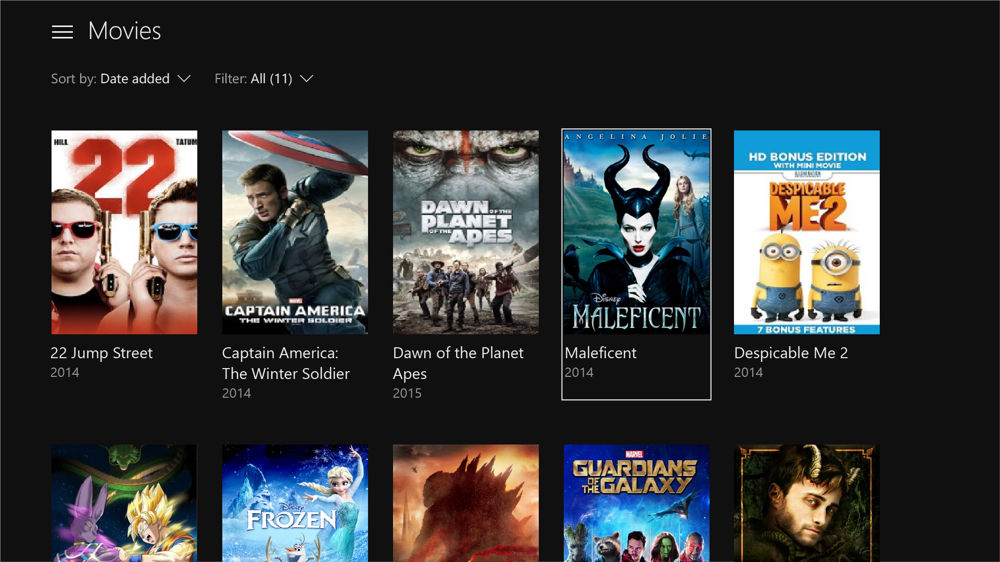
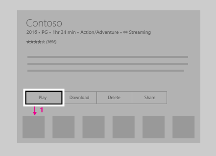
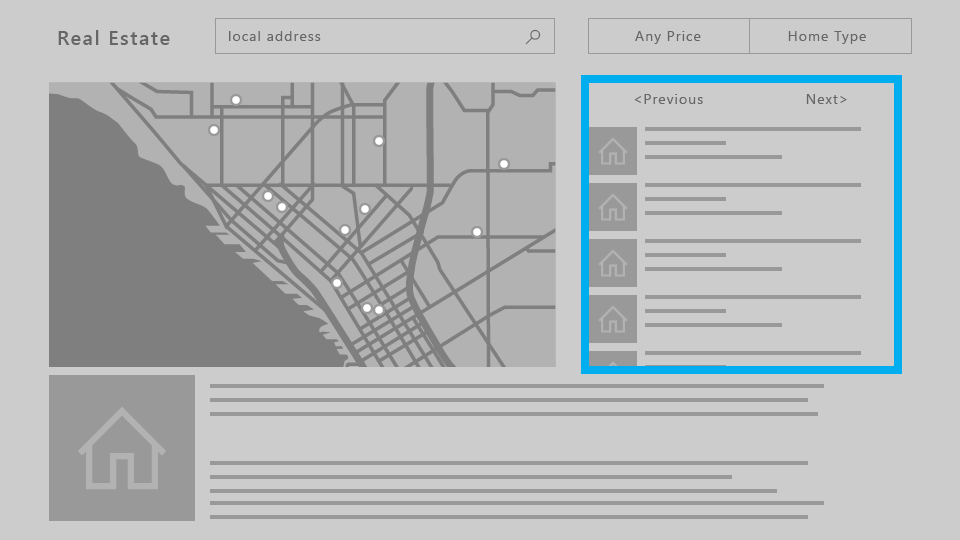
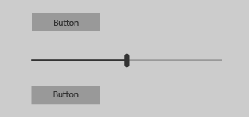
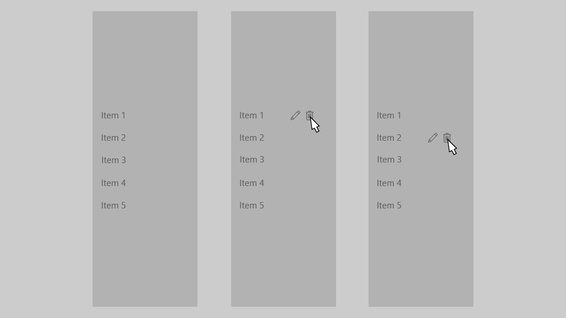

> \[Cet article présente une fonctionnalité qui n’est pas encore disponible publiquement. Cette fonctionnalité est susceptible d’être considérablement modifiée avant d’être commercialisée. Microsoft ne donne aucune garantie, expresse ou implicite, concernant les informations fournies ici.\]

# Conception pour Xbox et télévision

Concevez votre application de plateforme Windows universelle (UWP) pour une esthétique et un fonctionnement optimaux sur les écrans de télévision et Xbox One.

## Vue d’ensemble

La plateforme Windows universelle vous permet de créer des expériences agréables sur plusieurs types d’appareils Windows 10. 
La plupart des fonctionnalités fournies par l’infrastructure UWP permettent aux applications d’utiliser la même interface utilisateur sur ces appareils, sans travail supplémentaire. 
Toutefois, des éléments particuliers sont à prendre en compte afin d’optimiser votre application et l’adapter pour un fonctionnement parfait sur les écrans de télévision et Xbox One.

L’expérience qui consiste à se trouver assis sur son fauteuil en face de la télévision et à interagir avec celle-ci à l’aide d’un boîtier de commande ou d’une télécommande est appelée le « **10-foot experience** » 
Ce nom vient du fait que l’utilisateur se trouve généralement à 3 mètres (10 pieds) de l’écran. 
Cela soulève des défis propres à cette expérience, qui ne sont pas présents dans l’expérience « *2-foot experience* » ou lors d’interactions avec un PC. 
Si vous développez une application pour Xbox One ou tout autre appareil dont la sortie et l’entrée se font respectivement sur télévision et par boîtier de commande, vous devez toujours garder ceci à l’esprit.

Toutes les étapes décrites dans cet article ne sont pas nécessaires pour que votre application fonctionne pour les expériences « 10-foot experience », mais le fait de les comprendre et de prendre les décisions appropriées pour votre application créera une meilleure « 10-foot experience », mieux adaptée aux besoins spécifiques de votre application. 
Lorsque vous concevez une application pour un environnement de 3 mètres, prenez en compte les principes de conception suivants.

### Simplicité

La conception pour un environnement de 3 mètres présente des défis uniques. La résolution et la distance d’affichage peuvent rendre difficile pour les utilisateurs l’assimilation d’une trop grande quantité d’informations. 
Faites en sorte que votre conception soit épurée et réduite aux composants les plus simples. La quantité d’informations affichées sur une télévision doit être comparable à ce que vous pourriez voir sur un téléphone mobile, plutôt que sur un bureau d’ordinateur.


### Cohérence

Les applications UWP dans un environnement de 3 mètres doivent être intuitives et faciles d’utilisation. Le focus doit apparaître clairement. 
Organisez le contenu de manière à ce que la navigation soit prévisible et cohérente. Fournissez à vos utilisateurs le chemin d’accès le plus rapide au contenu souhaité.



_**Tous les films présentés dans la capture d’écran sont disponibles sur Films et TV Microsoft.**_  

### Captivant

Les expériences les plus immersives et cinématographiques se passent sur grand écran. Des paysages de bord à bord et l’utilisation de couleurs et d’une typographie vives font passer vos applications au niveau supérieur. Osez. Imaginez.


### Optimisations en matière d’expérience « 10-foot »

À présent que vous connaissez les principes d’une bonne conception d’application UWP pour une expérience « 10-foot », lisez les descriptions suivantes pour vous approprier les différentes façons d’optimiser votre application et créer une expérience utilisateur améliorée.

| Fonctionnalité        | Description           |
| -------------------------------------------------------------- |--------------------------------|
| [Boîtier de commande et télécommande](#gamepad-and-remote-control)      | Le bon fonctionnement de votre application avec un boîtier de commande et une télécommande représente l’étape la plus importante de l’optimisation des expériences « 10-foot ». Vous pouvez cependant apporter des améliorations relatives aux boîtiers de commande et aux télécommandes pour optimiser l’expérience d’interaction utilisateur sur un appareil où leurs actions sont relativement limitées. |
| [Interaction et navigation en mode focus XY](#xy-focus-navigation-and-interaction) | La plateforme UWP propose une **navigation en mode focus XY** qui permet à l’utilisateur de naviguer dans l’interface utilisateur de votre application. Toutefois, cela limite la navigation à quatre directions : haut, bas, gauche et droite. Cette section apporte des recommandations pour y remédier ainsi que d’autres considérations. |
| [Mode souris](#mouse-mode)|Dans certaines interfaces utilisateur, telles que les cartes et les surfaces de dessin, l’utilisation de la navigation en mode focus XY est impossible ou peu pratique. Pour ces interfaces, la plateforme UWP propose le **mode souris** pour que l’utilisateur puisse naviguer librement avec le boîtier de commande/la télécommande, comme avec une souris sur un ordinateur de bureau.|
| [Visuel du focus](#focus-visual)  | Le visuel du focus est le contour de l’élément de l’interface utilisateur sur lequel se trouve actuellement le focus. Cela permet de guider l’utilisateur pour une navigation facile dans votre interface utilisateur et sans se perdre. Si le focus n’est pas clairement visible, l’utilisateur peut se perdre dans votre interface utilisateur et garder ainsi une mauvaise impression de son expérience.  |
| [Activation du focus](#focus-engagement) | Définir l’activation du focus sur un élément d’interface utilisateur nécessite que l’utilisateur appuie sur le bouton **A/Sélectionner** pour interagir avec lui. Cela peut contribuer à créer une meilleure expérience pour l’utilisateur lors de sa navigation dans l’interface utilisateur de votre application.
| [Redimensionnement des éléments de l’interface utilisateur](#ui-element-sizing)  | La plateforme Windows universelle utilise la [mise à l’échelle et les pixels effectifs](..\layout\design-and-ui-intro.md#effective-pixels-and-scaling) pour mettre à l’échelle l’interface utilisateur en fonction de la distance d’affichage. Le fait de comprendre le redimensionnement et de l’appliquer à votre interface utilisateur vous aide à optimiser votre environnement de 3 mètres.  |
|  [Zones adaptées à l’écran de TV](#tv-safe-area) | La plateforme UWP évite automatiquement et par défaut l’affichage de contenu dans les zones non adaptées à l’écran de TV (près des bords de l’écran). Cela crée cependant un effet « d’encadré » ; l’interface utilisateur semble alors s’afficher dans un cadre. Pour que votre application soit véritablement immersive sur les écrans de télévision, vous devez la modifier afin qu’elle s’étende jusqu’aux bords des écrans compatibles. |
| [Couleurs](#colors)  |  La plateforme UWP prend en charge les thèmes de couleur. Une application qui respecte le thème du système sera **foncée** par défaut sur Xbox One. Si votre application possède un thème de couleur spécifique, gardez à l’esprit que certaines couleurs ne fonctionnent pas correctement sur les écrans de télévision et doivent donc être évitées. |
| [Son](../style/sound.md)    | Les sons jouent un rôle clé dans l’expérience « 10-foot », contribuant ainsi à l’envoi de commentaires à l’utilisateur. La plateforme UWP fournit des fonctionnalités qui activent automatiquement les sons des contrôles courants lorsque l’application s’exécute sur Xbox One. Découvrez la prise en charge des sons intégrée à la plateforme UWP et comment en tirer partie.    |
| [Recommandations en matière de contrôles d’interface utilisateur](#guidelines-for-ui-controls)  |  Il existe plusieurs contrôles d’interface utilisateur qui fonctionnent correctement sur plusieurs appareils, mais pour lesquels certains éléments doivent être pris en compte s’ils sont utilisés sur un téléviseur. Découvrez certaines meilleures pratiques portant sur l’utilisation de ces contrôles lors de la conception pour l’expérience « 10-foot ». |

<!--[elcowle] We may uncomment this now that the Sound article is live-->
<!--| [Sound](../style/sound.md)  |  Sounds play a key role in the 10-foot experience, helping to immerse and give feedback to the user. The UWP provides functionality that automatically turns on sounds for common controls when the app is running on Xbox One. Find out more about the sound support built into the UWP and learn how to take advantage of it. |-->

## Boîtier de commande et télécommande

Comme le clavier et la souris pour PC et la fonction tactile pour les téléphones et tablettes, le boîtier de commande et la télécommande sont les principaux périphériques d’entrée pour l’expérience « 10-foot ». 
Cette section présente les boutons matériels et leur fonction. 
Dans les sections [Interaction et navigation en mode focus XY](#xy-focus-navigation-and-interaction) et [Mode souris](#mouse-mode), vous découvrirez comment optimiser votre application en cas d’utilisation de ces périphériques d’entrée.

La qualité du comportement du boîtier de commande et de la télécommande lors de la première utilisation dépend de la prise en charge correcte du clavier dans votre application. Un moyen efficace de vous assurer que votre application fonctionne correctement avec le boîtier de commande/télécommande est de voir si celle-ci fonctionne correctement avec le clavier sur PC, puis testez-la avec un boîtier de commande/télécommande pour déterminer les points faibles dans votre interface utilisateur.

### Boutons matériels

Tout au long de ce document, les boutons seront appelés par leurs noms fournis dans le schéma suivant.


Comme vous pouvez le constater sur le schéma, certains des boutons pris en charge sur le boîtier de commande ne le sont pas sur la télécommande, et vice versa. Bien que vous puissiez utiliser des boutons qui sont uniquement pris en charge sur un périphérique d’entrée (pour rendre plus rapide la navigation dans l’interface utilisateur), n’oubliez pas que leur utilisation pour des interactions critiques peut créer une situation dans laquelle l’utilisateur se trouve dans l’impossibilité d’interagir avec certaines parties de l’interface utilisateur.

Le tableau suivant répertorie tous les boutons matériels pris en charge par les applications UWP et les périphériques d’entrée qui les prennent en charge.

| Button                    | Boîtier de commande   | Télécommande    |
|---------------------------|-----------|-------------------|
| Bouton A/Sélectionner           | Oui       | Oui               |
| Bouton B/Précédent             | Oui       | Oui               |
| Bouton multidirectionnel   | Oui       | Oui               |
| Touche Menu               | Oui       | Oui               |
| Touche Affichage               | Oui       | Oui               |
| Boutons X et Y           | Oui       | Non                |
| Stick analogique gauche                | Oui       | Non                |
| Stick analogique droit               | Oui       | Non                |
| Gâchette gauche et droite   | Oui       | Non                |
| Gâchettes hautes gauche et droite    | Oui       | Non                |
| Bouton OneGuide           | Non        | Oui               |
| Bouton de volume             | Non        | Oui               |
| Bouton de changement de chaîne            | Non        | Oui               |
| Boutons de contrôle multimédia     | Non        | Oui               |
| Bouton Muet               | Non        | Oui               |

### Prise en charge des boutons intégrés

La plateforme UWP mappe automatiquement le comportement d’entrée du clavier existant sur les entrées du boîtier de commande et de la télécommande. Le tableau suivant répertorie ces mappages intégrés.

| Clavier              | Boîtier de commande/Télécommande                        |
|-----------------------|---------------------------------------|
| Touches de direction            | Bouton multidirectionnel (également stick analogique gauche sur le boîtier de commande)    |
| Espace              | Bouton A/Sélectionner                       |
| Entrée                 | Bouton A/Sélectionner                       |
| Échap                | Bouton B/Précédent*                        |

\*Lorsque les événements [KeyDown](https://msdn.microsoft.com/library/windows/apps/br208941) et [KeyUp](https://msdn.microsoft.com/en-us/library/windows/apps/windows.ui.xaml.uielement.keyup.aspx) pour le bouton B ne sont pas gérés par l’application, l’événement [SystemNavigationManager.BackRequested](https://msdn.microsoft.com/en-us/library/windows/apps/windows.ui.core.systemnavigationmanager.backrequested.aspx) est déclenché, ce qui se traduit par une navigation vers l’arrière au sein de l’application.

### Prise en charge des boutons accélérateurs

Les boutons accélérateurs permettant d’accélérer la navigation dans une interface utilisateur. Cependant, ces boutons peuvent être propres à certains périphériques d’entrée ; certains utilisateurs ne seront donc pas en mesure d’utiliser ces fonctions. En réalité, le boîtier de commande est le seul périphérique d’entrée qui prend en charge les fonctions d’accélération pour les applications UWP sur Xbox One.

Le tableau suivant répertorie la prise en charge intégrée des accélérateurs dans l’UWP, en plus de ce que vous pouvez implémenter vous-même. Intégrez ces comportements à votre interface utilisateur personnalisée afin de proposer une expérience utilisateur cohérente et conviviale.

| Interaction   | Clavier   | Boîtier de commande      | Intégrée pour :  | Recommandée pour : |
|---------------|------------|--------------|----------------|------------------|
| Mouvement panoramique       | Aucun       | Stick analogique droit  | Aucun           |      [ScrollViewer](https://msdn.microsoft.com/en-us/library/windows/apps/windows.ui.xaml.controls.scrollviewer.aspx) |
| Page vers le haut/bas  | Page vers le haut/bas | Gâchette gauche/droite | Aucun élément | `ScrollViewer` et la liste/grille
| Page vers la gauche/droite | Aucun | Gâchettes hautes gauche/droite | [Pivot](https://msdn.microsoft.com/en-us/library/windows/apps/windows.ui.xaml.controls.pivot.aspx) | `ScrollViewer`
| Zoom avant/arrière        | Ctrl +/- | Gâchette gauche/droite | `ScrollViewer` | Affichages qui prennent en charge le zoom avant et arrière

## Interaction et navigation en mode focus XY

Si votre application prend en charge une navigation en mode focus appropriée pour le clavier, cela conviendra également pour le boîtier de commande et la télécommande. 
La navigation avec les touches de direction est mappée au **bouton multidirectionnel** (ainsi qu’au **stick analogique gauche** sur le boîtier de commande), et l’interaction avec les éléments d’interface utilisateur est mappée à la touche **Entrée/Sélectionner** (voir [Boîtier de commande et télécommande](#gamepad-and-remote-control)). Pour des recommandations en matière de conception de clavier, voir [Interactions avec le clavier](keyboard-interactions.md).

Si la prise en charge du clavier est correctement implémentée, votre application fonctionnera assez bien ; toutefois, du travail supplémentaire peut être nécessaire pour la prise en charge de chaque scénario. Réfléchissez aux besoins spécifiques de votre application pour proposer une expérience utilisateur optimale.

### Interface utilisateur inaccessible

Étant donné que la navigation en mode focus XY limite le déplacement vers le haut, le bas, à gauche et à droite, il existe des scénarios où certaines parties de l’interface utilisateur ne sont pas accessibles. 
Le schéma suivant illustre un exemple du type de disposition d’interface utilisateur que la navigation en mode focus XY ne prend pas en charge. 
Notez que l’élément au milieu n’est pas accessible à l’aide du boîtier de commande/télécommande dans la mesure où la navigation horizontale et la navigation verticale sont prioritaires ; l’élément du milieu ne sera jamais d’une priorité suffisamment élevée pour avoir le focus.


Si, pour une raison quelconque, il n’est pas possible de réorganiser l’interface utilisateur, utilisez l’une des techniques décrites dans la section suivante pour remplacer le comportement de focus par défaut.

### Remplacement de la navigation par défaut <a name="overriding-the-default-navigation"></a>

Pendant que la plateforme UWP tente de garantir la convivialité de la navigation par bouton multidirectionnel/stick analogique gauche, elle ne peut cependant pas garantir un comportement optimisé pour les intentions de votre application. 
Pour vous assurer que la navigation est optimisée pour votre application, la meilleure solution consiste à la tester avec un boîtier de commande et de vérifier que tous les éléments d’interface utilisateur sont accessibles par l’utilisateur, d’une manière qui soit pertinente pour les scénarios de votre application. Si les scénarios de votre application nécessitent un comportement ne pouvant être obtenu par le biais de la navigation en mode focus XY, envisagez de suivre les conseils indiqués dans les sections suivantes et/ou de remplacer le comportement afin de placer le focus sur un élément logique.

L’extrait de code suivant montre comment remplacer le comportement de navigation en mode focus XY :

```xml
<StackPanel>
    <Button x:Name="MyBtnLeft" 
            Content="Search" />
    <Button x:Name="MyBtnRight" 
            Content="Delete"/>
    <Button x:Name="MyBtnTop" 
            Content="Update" />
    <Button x:Name="MyBtnDown" 
            Content="Undo" />
    <Button Content="Home"  
            XYFocusLeft="{x:Bind MyBtnLeft}" 
            XYFocusRight="{x:Bind MyBtnRight}"
            XYFocusDown="{x:Bind MyBtnDown}"
            XYFocusUp="{x:Bind MyBtnTop}" />
</StackPanel>
```

Dans ce cas, lorsque le focus est sur le bouton `Home` et que l’utilisateur navigue vers la gauche, le focus se déplace sur le bouton `MyBtnLeft` ; si l’utilisateur navigue vers la droite, le focus se déplace sur le bouton `MyBtnRight` et ainsi de suite.

Pour empêcher le focus de se déplacer dans une certaine direction à partir d’un contrôle, utilisez la propriété `XYFocus*` pour pointer sur ce même contrôle :

```xml
<Button Name="HomeButton"  
        Content="Home"  
        XYFocusLeft ="{x:Bind HomeButton}" />
```

### Chemin nécessitant le moins de clics <a name="path-of-least-clicks"></a>

Permettez à l’utilisateur d’effectuer les tâches les plus courantes avec le moins de clics possible. Dans l’exemple suivant, la classe [TextBlock](https://msdn.microsoft.com/en-us/library/windows/apps/windows.ui.xaml.controls.textblock.aspx) est placée entre le bouton **Lecture** (qui a initialement le focus) et un élément couramment utilisé ; un élément inutile est ainsi placé entre les tâches prioritaires.


Dans l’exemple suivant, la classe [TextBlock](https://msdn.microsoft.com/en-us/library/windows/apps/windows.ui.xaml.controls.textblock.aspx) est placée au-dessus du bouton **Lecture** à la place. 
Le simple fait de réorganiser l’interface utilisateur afin que les éléments inutiles ne soient pas placés entre les tâches prioritaires améliore considérablement la facilité d’utilisation de votre application.



### CommandBar et ContextFlyout

Lorsque vous utilisez une [CommandBar](https://msdn.microsoft.com/en-us/library/windows/apps/windows.ui.xaml.controls.commandbar.aspx), n’oubliez pas le problème de défilement dans une liste, comme mentionné dans [Problème : Éléments d’interface utilisateur localisés suite à un long défilement dans une liste/grille](#problem-ui-elements-located-after-long-scrolling-list-grid). L’image suivante illustre une disposition d’interface utilisateur avec la `CommandBar` en bas d’une liste/grille. L’utilisateur devrait faire défiler toute la liste/grille pour atteindre la `CommandBar`.


Que se passe-t-il si vous placez la `CommandBar`*au-dessus* de la liste/grille ? Bien qu’un utilisateur ayant effectué un défilement vers le bas de la liste/grille doive en refaire un vers le haut pour atteindre la `CommandBar`, cette navigation est un peu plus courte que la configuration précédente. On suppose ici que le focus initial de votre application est placé à côté ou au-dessus de la `CommandBar` ; cette approche ne fonctionne pas aussi bien si le focus initial se trouve sous la liste/grille. Si ces éléments `CommandBar` sont des éléments d’action globale auxquels l’utilisateur n’accède que rarement (tels qu’un bouton **Synchronisation**), le fait de les disposer au-dessus de la liste/grille reste acceptable.

Si votre application dispose d’une `CommandBar` dont les éléments doivent être facilement accessibles aux utilisateurs, vous devrez peut-être les placer à l’intérieur d’une `ContextFlyout` et les supprimer de la `CommandBar`. 

Bien qu’il soit impossible d’empiler les éléments d’une `CommandBar` verticalement, le fait de les placer en face du défilement (par exemple, à gauche ou à droite d’une liste avec défilement vertical, ou en haut ou en bas d’une liste avec défilement horizontal) constitue une autre option que vous devrez peut-être prendre en compte si elle fonctionne bien pour la disposition de votre interface utilisateur.

### Défis en matière de disposition de l’interface utilisateur

Certaines dispositions d’interface utilisateur posent plus de défis en raison de la navigation en mode focus XY et doivent être évaluées au cas par cas. Bien qu’il n’existe pas de méthode « absolue » et que la solution que vous choisissez dépend des besoins spécifiques de votre application, certaines techniques permettent de créer une excellente expérience TV.

Pour mieux comprendre ce point, examinons un exemple d’application qui illustre certains de ces problèmes et les techniques permettant de les résoudre.

> **Remarque** &nbsp;&nbsp;Cet exemple d’application sert à illustrer des problèmes d’interface utilisateur et leurs solutions potentielles, et ne présente pas la meilleure expérience utilisateur possible de votre application.

Ce qui suit est un exemple d’application pour le secteur immobilier qui affiche une liste des maisons disponibles à la vente, une carte, la description des propriétés ainsi que d’autres informations. Cette application pose trois défis que vous pouvez surmonter à l’aide des techniques suivantes :

- [Réorganisation de l’interface utilisateur](#ui-rearrange)
- [Activation du focus](#engagement)
- [Mode souris](#mouse-mode)


#### Problème : Éléments d’interface utilisateur localisés suite à un long défilement dans une liste/grille <a name="problem-ui-elements-located-after-long-scrolling-list-grid"></a>

La [ListView](https://msdn.microsoft.com/en-us/library/windows/apps/windows.ui.xaml.controls.listview.aspx) des propriétés montrées dans l’image suivante est une très longue liste à défilement. Si l’[activation](#focus-engagement) n’est *pas* requise pour la `ListView`, le focus se place sur le premier élément de la liste lorsque l’utilisateur navigue vers cette dernière. L’utilisateur doit parcourir tous les éléments de la liste pour atteindre le bouton **Précédent** ou **Suivant**. Dans ces cas peu pratiques où l’utilisateur doit parcourir toute la liste &mdash;c’est-à-dire, lorsque la liste est trop longue pour que cette expérience soit acceptable&mdash;, vous devez envisager d’autres options.


#### Solutions

##### Réorganisation de l’interface utilisateur <a name="ui-rearrange"></a>

À moins que le focus initial ne soit placé au bas de la page, les éléments d’interface utilisateur placés au-dessus d’une liste à long défilement sont en général plus facilement accessibles que s’ils étaient placés au-dessous. 
Si cette nouvelle disposition fonctionne pour d’autres appareils, il serait moins coûteux en ressources de modifier la disposition pour toutes les familles d’appareils au lieu d’apporter des modifications d’interface utilisateur spécifiques pour Xbox One. 
En outre, le fait de placer des éléments d’interface utilisateur à l’opposé du sens de défilement (autrement dit, horizontalement pour une liste à défilement vertical ou verticalement pour une liste à défilement horizontal) améliorera davantage l’accessibilité.



##### Activation du focus <a name="engagement"></a>

Lorsqu’une activation est *requise*, la totalité de la `ListView` devient une cible du focus unique. L’utilisateur sera en mesure d’ignorer le contenu de la liste afin d’accéder au prochain élément pouvant être actif. Pour en savoir plus sur les contrôles prenant en charge l’activation et sur leur utilisation, consultez la section [Activation du focus](#focus-engagement).


#### Problème : ScrollViewer sans élément pouvant être actif

Étant donné que la navigation en mode focus XY dépend de la navigation vers un seul élément d’interface utilisateur pouvant être actif à la fois, un [ScrollViewer](https://msdn.microsoft.com/en-us/library/windows/apps/windows.ui.xaml.controls.scrollviewer.aspx) ne contenant aucun élément pouvant être actif (par exemple, contenant seulement du texte), peut provoquer un scénario dans lequel l’utilisateur n’est pas en mesure d’afficher l’ensemble du contenu dans le `ScrollViewer`. 
Pour connaître les solutions de ce scénario et des scénarios connexes, voir [Activation du focus](#focus-engagement).


#### Problème : interface utilisateur à défilement libre

Si votre application nécessite une interface utilisateur à défilement libre, telle qu’une surface de dessin ou, dans l’exemple présent, une carte, la navigation en mode focus XY ne fonctionne simplement pas. 
Dans ce cas, vous pouvez activer le [mode souris](#mouse-mode) pour permettre à l’utilisateur de naviguer librement à l’intérieur d’un élément d’interface utilisateur.


## Mode souris

Comme décrit dans [Interaction et navigation en mode focus XY](#xy-focus-navigation-and-interaction), le focus est déplacé à l’aide du système de navigation XY sur Xbox One, ce qui permet à l’utilisateur de déplacer le focus entre les contrôles en effectuant des déplacements vers le haut, le bas, la gauche et la droite. 
Toutefois, certains contrôles comme [WebView](https://msdn.microsoft.com/en-us/library/windows/apps/windows.ui.xaml.controls.webview.aspx) et [MapControl](https://msdn.microsoft.com/en-us/library/windows/apps/windows.ui.xaml.controls.maps.mapcontrol.aspx) nécessitent une interaction semblable à celle faite avec la souris, avec laquelle les utilisateurs peuvent déplacer le pointeur librement à l’intérieur des limites du contrôle. 
Certaines applications permettent également de déplacer le pointeur sur la page entière ; l’expérience boîtier de commande/télécommande est alors semblable à l’expérience souris sur PC.

Pour ces scénarios, demandez un pointeur (mode souris) pour la page entière, ou sur un contrôle à l’intérieur d’une page. 
Par exemple, votre application peut contenir une page comportant un contrôle `WebView` qui utilise le mode souris uniquement à l’intérieur du contrôle tandis que la navigation en mode focus XY est utilisée partout ailleurs. 
Pour demander un pointeur, vous pouvez spécifier si vous le voulez **lorsqu’un contrôle ou une page sont actifs** ou **lorsqu’une page a le focus**.

> **Remarque** &nbsp;&nbsp;La demande de pointeur lorsqu’un contrôle a le focus n’est pas prise en charge.

Le schéma suivant montre les mappages de bouton pour le boîtier de commande/la télécommande en mode souris.


> **Remarque** &nbsp;&nbsp;Le mode souris est uniquement pris en charge sur Xbox One avec boîtier de commande/télécommande. Il est ignoré sans avertissement dans d’autres familles d’appareils et types d’entrée.

Utilisez la propriété `RequiresPointer` dans un contrôle ou une page pour activer le mode souris sur ceux-ci. `RequiresPointer` a trois valeurs possibles : `Never` (valeur par défaut), `WhenEngaged` et `WhenFocused`.

> **Remarque** &nbsp;&nbsp;`RequiresPointer` est une nouvelle API qui n’a pas encore été documentée. 

<!--TODO: Link to doc-->

### Activation du mode souris sur un contrôle

Lorsque l’utilisateur active un contrôle avec `RequiresPointer="WhenEngaged"`, le mode souris est activé sur le contrôle en question jusqu’à ce que l’utilisateur le désactive. L’extrait de code suivant montre un `MapControl` simple qui, lorsqu’il est activé, active le mode souris :

```xml
<Page>
    <Grid>
        <MapControl IsEngagementRequired="true" 
                    RequiresPointer="WhenEngaged"/>
    </Grid>
</Page> 
```

> **Remarque** &nbsp;&nbsp;Si un contrôle active le mode souris lorsqu’il est employé, il doit également être employé avec `IsEngagementRequired="true"` ; sinon, le mode souris n’est pas activé.

Lorsqu’un contrôle est en mode souris, ses contrôles imbriqués le sont également. Le mode demandé de ses enfants est ignoré &mdash; un parent ne peut pas être en mode souris si ses enfants ne le sont pas également.

En outre, le mode demandé d’un contrôle est examiné uniquement lorsqu’il a le focus ; le mode n’est pas changé dynamiquement tant qu’il a le focus.

### Activation du mode souris dans une page

Lorsqu’une page dispose de la propriété `RequiresPointer="WhenFocused"`, le mode souris est activé pour la page entière lorsqu’elle a le focus. L’extrait de code suivant illustre l’obtention de cette propriété par une page :

```xml
<Page RequiresPointer="WhenFocused">
    ...
</Page> 
```

> **Remarque** &nbsp;&nbsp;La valeur `WhenFocused` est uniquement prise en charge dans les objets [Page](https://msdn.microsoft.com/en-us/library/windows/apps/windows.ui.xaml.controls.page.aspx). Une exception est levée si vous tentez de définir cette valeur sur un contrôle.

## Visuel du focus

Le visuel du focus est le contour de l’élément de l’interface utilisateur sur lequel se trouve actuellement le focus. Cela permet de guider l’utilisateur pour une navigation facile dans votre interface utilisateur et sans se perdre.

Avec l’ajout d’une mise à jour visuelle et de nombreuses options de personnalisation au visuel du focus, les développeurs peuvent être certains qu’un seul visuel du focus fonctionne correctement sur les PC et Xbox One, ainsi que sur tous les appareils Windows 10 prenant en charge le clavier et/ou le boîtier de commande/télécommande.

Bien que le même visuel du focus puisse être utilisé sur différentes plateformes, le contexte diffère légèrement pour l’expérience « 10-foot ». Vous devez supposer que l’utilisateur ne se concentre pas sur l’ensemble de l’écran de TV. C’est pourquoi il est important que l’élément ayant actuellement le focus s’affiche toujours clairement à l’utilisateur ; cela évite la frustration de devoir rechercher les éléments visuels.

Il est également important de garder à l’esprit que le visuel du focus s’affiche par défaut lorsqu’un boîtier de commande ou une télécommande sont utilisés, mais *pas* un clavier. Il s’affiche donc lorsque vous exécutez votre application sur Xbox One, même si vous ne l’avez pas implémenté.

### Placement initial du visuel du focus

Lors du lancement d’une application ou de la navigation vers une page, placez le focus sur un élément d’interface utilisateur approprié (le premier élément auquel l’utilisateur applique une action). Par exemple, une application de photos peut placer le focus sur le premier élément dans la galerie de photos, et une application de musique, dans laquelle l’utilisateur a ouvert une vue détaillée d’un morceau, peut placer le focus sur le bouton Lecture pour faciliter la lecture de la musique.

Essayez de placer le focus initial dans la zone supérieure gauche de votre application (ou en haut à droite pour un flux de droite à gauche). La plupart des utilisateurs ont tendance à se concentrer sur cet angle en premier car c’est à cet endroit que commence généralement le flux de contenu d’une application.

### Rendre le focus clairement visible

Un visuel du focus doit toujours être visible à l’écran pour que l’utilisateur puisse reprendre à l’endroit où il s’est arrêté sans avoir à chercher le focus. De même, des éléments pouvant être actifs doivent toujours se trouver à l’écran. Par exemple, n’utilisez pas de fenêtres contextuelles contenant uniquement du texte sans éléments pouvant être actifs.&mdash;

### Superposition de l’abandon interactif

Pour attirer l’attention de l’utilisateur sur les éléments d’interface utilisateur que ce dernier manipule avec le contrôleur de jeu ou la télécommande, l’UWP ajoute automatiquement une couche « de fumée » qui couvre les zones en dehors de l’interface utilisateur contextuelle lorsque l’application s’exécute sur Xbox One. Cela ne nécessite aucun travail supplémentaire, mais est un élément à prendre en compte lors de la conception de votre interface utilisateur.

## Activation du focus

L’activation du focus est conçue pour faciliter l’utilisation d’un boîtier de commande ou d’une télécommande pour interagir avec une application. 

> **Remarque** &nbsp;&nbsp;La définition de l’activation du focus n’affecte pas le clavier ni d’autres périphériques d’entrée.

Lorsque la propriété `IsFocusEngagementEnabled` sur un objet [FrameworkElement](https://msdn.microsoft.com/en-us/library/windows/apps/windows.ui.xaml.frameworkelement.aspx) est définie sur `True`, elle signale le contrôle comme nécessitant l’activation du focus. Cela signifie que l’utilisateur doit appuyer sur le bouton **A/Sélectionner** pour activer le contrôle et interagir avec ce dernier. Lorsqu’il a terminé, l’utilisateur peut appuyer sur le bouton **B/Précédent** pour désactiver le contrôle et naviguer hors de ce dernier.

> **Remarque** &nbsp;&nbsp;`IsFocusEngagementEnabled` est une nouvelle API qui n’a pas encore été documentée.

### Interruption du focus

L’interruption du focus survient lorsqu’un utilisateur tente d’accéder à l’interface utilisateur d’une application, mais la navigation est « interrompue » au sein d’un contrôle, rendant difficile, voire impossible, le déplacement en dehors de ce contrôle.

L’exemple suivant montre une interface utilisateur provoquant l’interruption du focus.


Si l’utilisateur veut accéder au bouton droit à partir du bouton gauche, il serait logique de supposer que la seule action requise serait d’appuyer deux fois sur le bouton multidirectionnel/stick analogique gauche. 
Toutefois, si le [Slider](https://msdn.microsoft.com/en-us/library/windows/apps/windows.ui.xaml.controls.slider.aspx) ne nécessite pas d’activation, le comportement suivant se produit : lorsque l’utilisateur appuie à droite pour la première fois, le focus est décalé vers le `Slider` ; lorsqu’il réappuie à droite, la poignée du `Slider` se déplace à droite. L’utilisateur continuerait de déplacer la poignée vers la droite sans toutefois réussir à atteindre le bouton.

Plusieurs approches existent pour contourner ce problème. L’une consiste à concevoir une disposition différente, comme dans l’exemple d’application pour le secteur immobilier dans [Interaction et navigation en mode focus XY](#xy-focus-navigation-and-interaction), où nous avons déplacé les boutons **Précédent** et **Suivant** au-dessus de `ListView`. L’empilement vertical (et non horizontal) des contrôles, comme le montre l’image suivante, peut résoudre le problème.



À présent, l’utilisateur peut accéder à chaque contrôle en appuyant sur les boutons haut et bas sur le bouton multidirectionnel/stick analogique gauche. Lorsque le `Slider` a le focus, l’utilisateur peut appuyer sur le bouton gauche/droite pour déplacer la poignée du `Slider`, comme prévu.

Une autre approche pour résoudre ce problème consiste à demander une activation du `Slider`. Si vous définissez `IsFocusEngagementEnabled="True"`, cela se traduit par le comportement suivant.


Lorsque le `Slider` nécessite une activation du focus, l’utilisateur peut accéder au bouton situé à droite en appuyant simplement deux fois à droite sur le bouton multidirectionnel/stick analogique gauche. Cette solution est excellente, car elle ne nécessite aucun ajustement de l’interface utilisateur et produit le comportement attendu.

### Contrôles d’éléments

Outre le contrôle [Slider](https://msdn.microsoft.com/en-us/library/windows/apps/windows.ui.xaml.controls.slider.aspx), il existe d’autres contrôles que vous souhaiterez peut-être activer :

- [Listbox](https://msdn.microsoft.com/en-us/library/windows/apps/windows.ui.xaml.controls.listbox.aspx)
- [ListView](https://msdn.microsoft.com/en-us/library/windows/apps/windows.ui.xaml.controls.listview.aspx)
- [GridView](https://msdn.microsoft.com/en-us/library/windows/apps/windows.ui.xaml.controls.gridview.aspx)
- [FlipView](https://msdn.microsoft.com/en-us/library/windows/apps/xaml/windows.ui.xaml.controls.flipview)

Contrairement au contrôle `Slider`, ces contrôles n’interrompent pas le focus en leur sein ; cependant, ils peuvent poser des problèmes en matière de facilité d’utilisation s’ils contiennent de grandes quantités de données. Voici un exemple d’un contrôle `ListView` qui contient une grande quantité de données.


Comme pour l’exemple `Slider`, nous allons essayer de naviguer à partir du bouton du haut vers le bouton du bas avec un boîtier de commande/une télécommande. 
En partant du bouton du haut, où se trouve le focus, le fait d’appuyer sur la flèche Bas sur le bouton multidirectionnel/stick analogique gauche déplace le focus sur le premier élément dans le contrôle `ListView` (« Item 1 »). 
Lorsque l’utilisateur appuie à nouveau, le focus est déplacé sur l’élément suivant dans la liste, et non sur le bouton situé en bas. 
Pour accéder au bouton du bas, l’utilisateur doit d’abord parcourir chaque élément du contrôle `ListView`. 
Si le contrôle `ListView` contient une grande quantité de données, cela peut s’avérer peu pratique et dégrader l’expérience utilisateur.

Pour résoudre ce problème, définissez la propriété `IsFocusEngagementEnabled="True"` sur `ListView` pour demander son activation. 
Cela permet à l’utilisateur de traverser rapidement le contrôle `ListView` en appuyant simplement sur le bouton Bas. Néanmoins, l’utilisateur n’est pas en mesure de parcourir la liste ou de sélectionner un élément dans celle-ci, sauf s’il l’active en appuyant sur le bouton **A/Sélectionner** lorsqu’il a le focus, puis en appuyant sur le bouton **B/Précédent** pour le désactiver.


#### ScrollViewer

Le contrôle [ScrollViewer](https://msdn.microsoft.com/en-us/library/windows/apps/windows.ui.xaml.controls.scrollviewer.aspx), qui possède des caractéristiques particulières, diffère légèrement des contrôles précédents. Si vous disposez d’un `ScrollViewer` avec du contenu pouvant être actif, par défaut, la navigation vers `ScrollViewer` vous permet de parcourir ses éléments pouvant être actifs. Comme pour un contrôle `ListView`, vous devez parcourir chaque élément pour naviguer en dehors du contrôle `ScrollViewer`. 

Si le contrôle `ScrollViewer` n’a *pas* de contenu pouvant être actif &mdash; par exemple, s’il contient uniquement du texte&mdash;, vous pouvez définir `IsFocusEngagementEnabled="True"` afin que l’utilisateur puisse activer `ScrollViewer` à l’aide du bouton **A/Sélectionner**. Une fois activé, l’utilisateur peut faire défiler le texte à l’aide du **bouton multidirectionnel/stick analogique gauche**, puis appuyer sur le bouton **B/Précédent** pour le désactiver.

Une autre approche consiste à définir `IsTabStop="True"` sur le contrôle `ScrollViewer` afin que l’utilisateur n’ait pas à activer le contrôle. Il peut simplement y placer le focus, puis le faire défiler à l’aide du **bouton multidirectionnel/stick analogique gauche** lorsqu’il n’existe pas d’éléments pouvant être actifs au sein du contrôle `ScrollViewer`.&mdash;

### Paramètres par défaut de l’activation du focus

Certains contrôles provoquent une interruption du focus assez fréquente pour justifier une activation du focus pour leurs paramètres par défaut. D’autres ont désactivé cette fonction par défaut, mais peuvent tirer profit de son activation. Le tableau suivant répertorie ces contrôles et leurs comportements d’activation du focus par défaut.

| Contrôle               | Paramètre par défaut de l’activation du focus  |
|-----------------------|---------------------------|
| CalendarDatePicker    | Activé                        |
| FlipView              | Désactivé                       |
| GridView              | Désactivé                       |
| Listbox               | Désactivé                       |
| ListView              | Désactivé                       |
| ScrollViewer          | Désactivé                       |
| SemanticZoom          | Désactivé                       |
| Slider                | Activé                        |

Aucun autre contrôle UWP n’a de modification comportementale ou visuelle lorsque `IsFocusEngagementEnabled="True"`.

## Redimensionnement des éléments de l’interface utilisateur

Étant donné que l’utilisateur d’une application dans un environnement de 3 mètres utilise un boîtier de commande ou une télécommande et se trouve à plusieurs mètres de l’écran, vous devez incorporer à votre conception certains éléments liés à l’interface utilisateur. 
Assurez-vous que le contenu sur l’interface utilisateur présente la densité appropriée et que l’interface n’est pas trop encombrée, afin que l’utilisateur puisse la parcourir et sélectionner des éléments en toute simplicité. N’oubliez pas que la simplicité est le maître mot.

### Facteur d’échelle et disposition adaptative

Le **facteur d’échelle** permet de s’assurer que le dimensionnement des éléments de l’interface utilisateur est approprié pour l’appareil sur lequel s’exécute l’application. 
Sur le Bureau, ce paramètre se trouve dans **Paramètres &gt; Système &gt; Affichage** sous forme de curseur. 
Ce paramètre existe également sur les appareils mobiles prenant en charge ce paramètre.

 

Xbox One ne présente pas ce paramètre système ; cependant pour que les éléments d’interface utilisateur de plateforme UWP aient une taille appropriée, ils sont mis à l’échelle à la valeur **200 %** par défaut. 
Du moment que les éléments d’IU sont d’une taille appropriée pour les autres appareils, ils le seront également pour la TV. 
Xbox One effectue le rendu de votre application à 1080p (1920 x 1080 pixels). Par conséquent, lorsque vous intégrez une application à partir d’autres appareils, par exemple un PC, assurez-vous de l’aspect correct de l’interface utilisateur à 960 x 540 pixels à une échelle de 100 % à l’aide des [techniques adaptatives](https://msdn.microsoft.com/en-us/windows/uwp/layout/screen-sizes-and-breakpoints-for-responsive-design).

La conception pour Xbox diffère quelque peu de la conception pour PC, car une seule résolution est concernée : 1920 x 1080. 
Peu importe si l’utilisateur possède une télévision dont la résolution est meilleure &mdash; les applications UWP sont toujours mises à l’échelle à 1080p.

Les tailles de ressources appropriées sont également extraites pour votre application à partir de l’échelle 200 % lorsque l’application est exécutée sur Xbox One, quelle que soit la résolution de la télévision.

### Densité de contenu

Lorsque vous concevez votre application, n’oubliez pas que l’utilisateur se trouve relativement loin de l’interface utilisateur et interagit avec cette dernière à l’aide d’un contrôleur de jeu ou d’une télécommande, qui rend la navigation plus chronophage que s’il utilisait une souris ou une entrée tactile.

#### Tailles des contrôles d’interface utilisateur

La taille des éléments interactifs de l’interface utilisateur doit être d’au moins 32 pixels (pixels effectifs). Ceci est la valeur par défaut pour les contrôles UWP courants. Lorsqu’elle est utilisée à une échelle de 200 %, elle permet d’assurer la visibilité à distance des éléments de l’interface utilisateur et de réduire la densité du contenu. 


#### Nombre de clics.

Lorsque l’utilisateur navigue d’un bord de l’écran de télévision à l’autre, la simplification de votre interface utilisateur doit se faire en **six clics** maximum. Là encore s’applique le principe de la **simplicité**. Pour en savoir plus, voir [Chemin nécessitant le moins de clics](#path-of-least-clicks).


### Tailles de texte

Pour rendre votre interface utilisateur visible à distance, appuyez-vous sur les règles suivantes :

* Texte principal et contenu de lecture : 15 epx au minimum
* Texte non critique et contenu supplémentaire : 12 epx au minimum

Lorsque vous utilisez du texte supérieur à la normale dans votre interface utilisateur, choisissez une taille qui ne limite pas trop l’espace de l’écran (en occupant de l’espace que d’autres contenus pourraient remplir).

### Désactivation du facteur d’échelle

Nous recommandons que votre application tire parti de la prise en charge du facteur d’échelle, ce qui lui permettra de s’exécuter correctement sur tous les appareils, ayant été mise à l’échelle pour chaque type d’appareil. 
Il reste cependant possible de désactiver ce comportement et de concevoir toutes vos interfaces utilisateur à une échelle de 100 %. Notez que vous ne pouvez pas modifier la valeur du facteur d’échelle sur autre chose que 100 %.

Vous pouvez choisir d’annuler le facteur d’échelle à l’aide de l’extrait de code suivant :

```csharp
bool result = Windows.UI.ViewManagement.ApplicationViewScaling.TrySetDisableLayoutScaling(true);
```

`result` vous indique si vous avez réussi l’annulation.

Veillez à calculer la taille appropriée des éléments d’interface utilisateur en doublant les valeurs de pixel *effectives* mentionnées dans cette rubrique pour des valeurs de pixel *réelles*.

## Zones adaptées à l’écran de TV

Le contenu n’occupe pas l’ensemble de l’écran de toutes les télévisions pour des raisons historiques, mais aussi technologiques. La plateforme UWP évite d’afficher du contenu d’interface utilisateur dans des zones inadaptées à l’écran de TV ; elle dessine uniquement l’arrière-plan de la page.

La zone inadaptée à l’écran de TV est représentée par la zone bleue dans l’image suivante.


Vous pouvez définir l’arrière-plan sur une couleur statique ou une couleur de thème, voire sur une image, comme le démontrent les extraits de code suivants.

### Couleur de thème

```xml
<Page x:Class="Sample.MainPage"
      Background="{ThemeResource ApplicationPageBackgroundThemeBrush}"/>
```

### Image

```xml
<Page x:Class="Sample.MainPage"
      Background="\Assets\Background.png"/>
```

Votre application ressemblera à ceci sans travail supplémentaire.


Ce n’est pas une solution optimale car elle crée un effet d’« encadré », donnant l’impression que des parties de l’interface utilisateur, telles que le volet et la grille de navigation, ont été tronquées. Vous pouvez cependant faire des optimisations pour étendre certaines parties de l’interface utilisateur à l’ensemble de l’écran. Cela donne à l’application un aspect plus cinématographique.

### Étendre l’IU à l’ensemble de l’écran

Nous vous recommandons d’étendre certains éléments d’interface utilisateur à l’ensemble de l’écran pour apporter à l’utilisateur une véritable expérience d’immersion. Cela comprend les classes [ScrollViewers](https://msdn.microsoft.com/en-us/library/windows/apps/windows.ui.xaml.controls.scrollviewer.aspx) et [CommandBars](https://msdn.microsoft.com/en-us/library/windows/apps/windows.ui.xaml.controls.commandbar.aspx) ainsi que les [volets de navigation](https://msdn.microsoft.com/en-us/windows/uwp/controls-and-patterns/nav-pane).

En revanche, il est important que le texte et les éléments interactifs ne soient jamais près des bords de l’écran ; cela garantit qu’ils ne seront pas tronqués sur certaines télévisions. Nous recommandons d’étendre seulement les éléments visuels non essentiels à une distance de 5 % des bords de l’écran. Comme mentionné dans [Redimensionnement des éléments de l’interface utilisateur](#ui-element-sizing), une application UWP suivant le facteur d’échelle par défaut de la console Xbox One (200 %) utilise une zone de 960 x 540 epx. Vous devez donc éviter de placer l’interface utilisateur primordiale de votre application dans les zones suivantes :

- 27 epx à partir du haut et du bas
- 48 epx des bords gauche et droit

Il existe deux façons d’étendre l’interface utilisateur vers les bords de l’écran : les *limites de la fenêtre principale* et les *marges négatives*.

### Limites de fenêtre principale

Pour les applications UWP ciblant uniquement l’expérience « 10-foot », les limites de fenêtre principale constituent une option plus simple.

Dans la méthode `OnLaunched` de `App.xaml.cs`, ajoutez le code suivant :

```csharp
Windows.UI.ViewManagement.ApplicationView.GetForCurrentView().SetDesiredBoundsMode
    (Windows.UI.ViewManagement.ApplicationViewBoundsMode.UseCoreWindow);
```

Avec cette ligne de code, la fenêtre d’application remplit l’écran. Vous devez donc déplacer toutes les UI interactives et essentielles dans la zone adaptée à l’écran de TV décrite précédemment. L’interface utilisateur temporaire, telle que les menus contextuels et les classes [ComboBox](https://msdn.microsoft.com/en-us/library/windows/apps/windows.ui.xaml.controls.combobox.aspx) ouvertes restent automatiquement à l’intérieur de la zone adaptée à l’écran de TV.


### Marges négatives

Pour les applications UWP ciblant un éventail d’appareils tels que les mobiles, les bureaux et Xbox One, les marges négatives peuvent constituer une méthode plus intuitive pour adapter les dispositions adaptatives. 
Nous vous recommandons de créer un [déclencheur personnalisé](#custom-visual-state-trigger-for-xbox-one) et de modifier les marges pour les adapter aux dispositions des télévisions.

#### Arrière-plans de volet de navigation 

Les volets de navigation sont généralement placés près du bord de l’écran. L’arrière-plan doit donc s’étendre dans la zone inadaptée à l’écran de TV pour ne pas qu’il y ait d’espaces vides. 
Vous pouvez faire ceci avec les marges négatives à l’aide du contrôle [SplitView](https://msdn.microsoft.com/en-us/library/windows/apps/windows.ui.xaml.controls.splitview.aspx). Ce dernier est couramment utilisé en tant que bloc de construction. Vous pouvez également utiliser des marges positives dans le contenu de `SplitView` afin de le maintenir dans la zone adaptée à l’écran de TV.


L’arrière-plan du volet de navigation a été étendu aux bords de l’écran, tandis que ses éléments de navigation sont conservés dans la zone adaptée à l’écran de TV. 
Le contenu de `SplitView` (dans ce cas, une grille d’éléments) a été étendu vers le bas de l’écran pour ne pas avoir l’air tronqué. La partie supérieure de la grille reste toujours dans la zone adaptée à l’écran de TV. Plus loin dans cette section, vous apprendrez à conserver l’élément sélectionné dans la zone adaptée à l’écran de TV.

L’extrait de code suivant permet de réaliser l’effet en question :

```xml
<SplitView x:Name="RootSplitView"
           Margin="-48, -27">
            <SplitView.Pane>
                 <ListView x:Name="NavMenuList"
                           Margin="0,75,0,27"
                           ContainerContentChanging=
                                "NavMenuItemContainerContentChanging"
                           ItemContainerStyle="{StaticResource 
                                NavMenuItemContainerStyle}"
                           ItemTemplate="{StaticResource NavMenuItemTemplate}"
                           ItemInvoked="NavMenuList_ItemInvoked"/>
            </SplitView.Pane>
            <Frame x:Name="frame"
                   Margin="0,27,48,27"
                   Navigating="OnNavigatingToPage"
                   Navigated="OnNavigatedToPage"/>
    </SplitView>
```

[CommandBar](https://msdn.microsoft.com/en-us/library/windows/apps/windows.ui.xaml.controls.commandbar.aspx) est un autre exemple de volet généralement positionné près d’un ou plusieurs bords de l’application. Son arrière-plan doit donc s’étendre aux bords des écrans de TV. Il contient généralement un bouton **Plus** (...) sur le côté droit qui doit rester dans la zone adaptée à l’écran de TV. Voici quelques stratégies différentes permettant d’obtenir les interactions et effets visuels souhaités.

**Option 1** : modifiez la couleur d’arrière-plan de `CommandBar` pour la définir sur transparent ou sur la même couleur que l’arrière-plan de la page :

```xml
<CommandBar x:Name="topbar" 
            Background="{ThemeResource SystemControlBackgroundAltHighBrush}">
            ...
</CommandBar>
```

`CommandBar` paraît ainsi avoir le même arrière-plan que le reste de la page ; l’arrière-plan s’étend donc vers le bord de l’écran en toute fluidité.

**Option 2** : ajoutez un rectangle en arrière-plan dont le remplissage est de la même couleur que l’arrière-plan de `CommandBar`, puis étendez-le aux bords de l’écran avec des marges négatives :

```xml
<Rectangle VerticalAlignment="Top" 
            HorizontalAlignment="Stretch" 
            Margin="0,-27,-48,0"      
            Fill="{ThemeResource SystemControlBackgroundChromeMediumBrush}"/>
<CommandBar x:Name="topbar" 
            VerticalAlignment="Top" 
            HorizontalContentAlignment="Stretch">
            ...
</CommandBar>
```

> **Remarque** &nbsp;&nbsp;Si vous optez pour cette approche, gardez à l’esprit que le bouton **Plus** modifie la hauteur de la classe `CommandBar` ouverte, si nécessaire, afin de montrer les étiquettes des `AppBarButton` sous leurs icônes. Nous vous recommandons de déplacer les étiquettes à *droite* de leurs icônes afin d’éviter ce redimensionnement.

#### Éléments multimédias et images d’arrière-plan

La plupart des images et des autres éléments multimédias ne contiennent pas d’informations critiques à leurs extrémités. Ils peuvent donc être étendus aux bords de l’écran pour offrir une expérience utilisateur immersive. L’extrait de code suivant est un exemple de comment étendre une image aux bords de l’écran :

```xml
<Image Source="\Assets\HeaderBackground.png" 
       Stretch="Uniform" 
       Height="227" 
       VerticalAlignment="Top" 
       Margin="-48,-27,-48,0"/>
```

Vous pouvez bien sûr faire de même pour des contenus multimédias, tels que des vidéos.

#### Extrémités de listes et de grilles défilantes

Il est courant que les listes et les grilles contiennent davantage d’éléments que l’écran puisse afficher simultanément. Lorsque c’est le cas, nous vous recommandons d’étendre la liste ou la grille au bord de l’écran. Les listes et les grilles à défilement horizontal doivent s’étendre vers le bord droit et celles à défilement vertical doivent s’étendre vers le bas.


Pendant qu’une liste ou une grille est étendue de la sorte, il est important de conserver le visuel du focus et son élément associé à l’intérieur de la zone adaptée à l’écran de TV.


La plateforme UWP comporte des fonctionnalités qui permettent de conserver le visuel du focus à l’intérieur des [VisibleBounds](https://msdn.microsoft.com/en-us/library/windows/apps/windows.ui.viewmanagement.applicationview.visiblebounds.aspx), mais vous devez ajouter du remplissage pour vous assurer que les éléments de liste/grille peuvent défiler à l’écran à l’intérieur de la zone adaptée à l’écran de TV. Plus précisément, vous ajoutez une marge positive à la classe [ItemsPresenter](https://msdn.microsoft.com/en-us/library/windows/apps/windows.ui.xaml.controls.itemspresenter.aspx) des classes [ListView](https://msdn.microsoft.com/en-us/library/windows/apps/windows.ui.xaml.controls.listview.aspx) ou [GridView](https://msdn.microsoft.com/en-us/library/windows/apps/windows.ui.xaml.controls.gridview.aspx), comme l’illustre l’extrait de code suivant :

```xml
<Style x:Key="TitleSafeListViewStyle" 
       TargetType="ListView">
    <Setter Property="Margin" 
            Value="0,0,0,-27"/>
        <Setter Property="Template">
            <Setter.Value>
                <ControlTemplate TargetType="ListView">
                    <Border BorderBrush="{TemplateBinding BorderBrush}" 
                            Background="{TemplateBinding Background}" 
                            BorderThickness="{TemplateBinding BorderThickness}">
                        <ScrollViewer x:Name="ScrollViewer"
                                      TabNavigation="{TemplateBinding TabNavigation}"
                                      HorizontalScrollMode="{TemplateBinding ScrollViewer.HorizontalScrollMode}"
                                      HorizontalScrollBarVisibility="{TemplateBinding ScrollViewer.HorizontalScrollBarVisibility}"
                                      IsHorizontalScrollChainingEnabled="{TemplateBinding ScrollViewer.IsHorizontalScrollChainingEnabled}"
                                      VerticalScrollMode="{TemplateBinding ScrollViewer.VerticalScrollMode}"
                                      VerticalScrollBarVisibility="{TemplateBinding ScrollViewer.VerticalScrollBarVisibility}"
                                      IsVerticalScrollChainingEnabled="{TemplateBinding ScrollViewer.IsVerticalScrollChainingEnabled}"
                                      IsHorizontalRailEnabled="{TemplateBinding ScrollViewer.IsHorizontalRailEnabled}"
                                      IsVerticalRailEnabled="{TemplateBinding ScrollViewer.IsVerticalRailEnabled}"
                                      ZoomMode="{TemplateBinding ScrollViewer.ZoomMode}"
                                      IsDeferredScrollingEnabled="{TemplateBinding ScrollViewer.IsDeferredScrollingEnabled}"
                                      BringIntoViewOnFocusChange="{TemplateBinding ScrollViewer.BringIntoViewOnFocusChange}"
                                      AutomationProperties.AccessibilityView="Raw">
                            <ItemsPresenter Header="{TemplateBinding Header}"
                                            HeaderTemplate="{TemplateBinding HeaderTemplate}"
                                            HeaderTransitions="{TemplateBinding HeaderTransitions}"
                                            Footer="{TemplateBinding Footer}"
                                            FooterTemplate="{TemplateBinding FooterTemplate}"
                                            FooterTransitions="{TemplateBinding FooterTransitions}"
                                            Padding="{TemplateBinding Padding}" 
                                            Margin="0,27,0,27"/>
                    </ScrollViewer>
                </Border>
            </ControlTemplate>
        </Setter.Value>
    </Setter>
</Style>
```

Vous placez l’extrait de code précédent dans les ressources de la page ou de l’application, puis vous y accédez de la manière suivante :

```xml
<Page>
    <Grid>
        <ListView Style="{StaticResource TitleSafeListViewStyle}"
                  ... />
```

> **Remarque** &nbsp;&nbsp;Cet extrait de code est spécifiquement conçu pour `ListView`. Pour un style `GridView`, définissez l’attribut [TargetType](https://msdn.microsoft.com/en-us/library/windows/apps/windows.ui.xaml.controls.controltemplate.targettype.aspx) du [ControlTemplate](https://msdn.microsoft.com/en-us/library/windows/apps/windows.ui.xaml.controls.controltemplate.aspx) et du [Style](https://msdn.microsoft.com/en-us/library/windows/apps/windows.ui.xaml.style.aspx) sur `GridView`.


### Déclencheur d’état visuel personnalisé pour Xbox One <a name="custom-visual-state-trigger-for-xbox-one"></a>

Pour personnaliser votre application UWP pour l’expérience « 10-foot », nous vous recommandons d’effectuer des modifications de disposition lorsque l’application détecte son lancement sur une console Xbox. Cela peut être fait en utilisant un déclencheur d’état visuel personnalisé, comme dans l’extrait de code suivant :

```xml
<VisualStateManager.VisualStateGroups>
    <VisualStateGroup>
        <VisualState>
            <VisualState.StateTriggers>
                <triggers:DeviceFamilyTrigger DeviceFamily="Windows.Xbox"/>
            </VisualState.StateTriggers>
            <VisualState.Setters>
                <Setter Target="RootSplitView.Margin" 
                        Value="-48,-27"/>
                <Setter Target="RootSplitView.OpenPaneLength" 
                        Value="368"/>
                <Setter Target="RootSplitView.CompactPaneLength" 
                        Value="96"/>
                <Setter Target="NavMenuList.Margin" 
                        Value="0,75,0,27"/>
                <Setter Target="Frame.Margin" 
                        Value="0,27,48,27"/>
                <Setter Target="NavMenuList.ItemContainerStyle" 
                        Value="{StaticResource NavMenuItemContainerXboxStyle}"/>
            </VisualState.Setters>
        </VisualState>
    </VisualStateGroup>
</VisualStateManager.VisualStateGroups>
```

Pour créer le déclencheur, ajoutez la classe suivante à votre application. Il s’agit de la classe référencée par le code XAML précédemment :

```csharp
class DeviceFamilyTrigger : StateTriggerBase
{
    private string _currentDeviceFamily, _queriedDeviceFamily;

    public string DeviceFamily
    {
        get
        {
            return _queriedDeviceFamily;
        }
        
        set
        {
            _queriedDeviceFamily = value;
            _currentDeviceFamily = AnalyticsInfo.VersionInfo.DeviceFamily;
            SetActive(_queriedDeviceFamily == _currentDeviceFamily);
        }
    }
}
```

Une fois que vous ajoutez votre déclencheur personnalisé, votre application effectuera automatiquement les modifications de disposition spécifiées dans votre code XAML à chaque fois qu’elle détecte son exécution sur une console Xbox One.

## Couleurs

Par défaut, la plateforme Windows universelle ne modifie pas les couleurs de votre application. Vous pouvez cependant faire des améliorations à la palette de couleurs de votre application pour optimiser l’expérience visuelle sur télévision.

### Thème d’application

Vous pouvez choisir un **thème d’application** (clair ou foncé) en fonction de ce qui est approprié pour votre application, ou vous pouvez ignorer le thème. Pour en savoir plus sur les recommandations générales pour les thèmes, voir [Thèmes de couleur](../style/color.md#color-themes).

L’UWP permet également aux applications de définir le thème de manière dynamique selon les paramètres système fournis par les appareils sur lesquels elles s’exécutent. 
Bien que l’UWP respecte toujours les paramètres de thème spécifiés par l’utilisateur, chaque appareil fournit également un thème par défaut approprié. 
En raison de la nature de Xbox One, qui génère plus d’expériences *multimédias* que d’expériences de *productivité*, son thème de système est foncé par défaut. 
Si le thème de votre application est basé sur les paramètres système, celui-ci devrait être foncé sur Xbox One par défaut.

### Couleur d’accentuation

La plateforme UWP fournit un moyen pratique pour afficher la **couleur d’accentuation** que l’utilisateur a sélectionnée dans ses paramètres système.

Sur Xbox One, l’utilisateur est en mesure de sélectionner une couleur utilisateur, comme il peut sélectionner une couleur d’accentuation sur un PC. 
Dans la mesure où votre application appelle ces couleurs d’accentuation par le biais de pinceaux ou de ressources de couleur, la couleur sélectionnée par l’utilisateur dans les paramètres système sera utilisée. Notez que les couleurs d’accentuation sur Xbox One sont définies par l’utilisateur et non par le système.

Notez également que l’ensemble des couleurs utilisateur sur Xbox One n’est pas le même que sur les PC, téléphones et autres appareils. 
C’est en partie dû au fait que ces couleurs sont triées sur le volet pour optimiser l’expérience « 10-foot » sur Xbox One, suivant les mêmes méthodologies et stratégies décrites dans cet article.

Tant que votre application utilise une ressource de pinceau, telle que **SystemControlForegroundAccentBrush**, ou une ressource de couleur (**SystemAccentColor**), ou appelle les couleurs d’accentuation directement via l’API [UIColorType.Accent*](https://msdn.microsoft.com/en-us/library/windows/apps/windows.ui.viewmanagement.uicolortype.aspx), les couleurs sont remplacées par des couleurs d’accentuation qui conviennent pour la télévision. Les couleurs de pinceau à contraste élevé sont également extraites à partir du système de la même manière que sur un PC et téléphone, mais avec des couleurs qui conviennent pour la télévision.

Pour en savoir plus sur la couleur d’accentuation en général, voir [Couleur d’accentuation](../style/color.md#accent-color).

### Variantes de couleur entre les écrans de télévision

Lors de la conception d’applications pour la télévision, notez que les couleurs s’affichent de manière légèrement différente en fonction des types de télévision. Ne supposez pas que les couleurs ressembleront exactement à celles de votre écran. Si votre application repose sur des nuances de couleur subtiles pour différencier les diverses parties de l’interface utilisateur, les couleurs pourraient facilement se mélanger et ainsi dérouter les utilisateurs. Essayez d’utiliser des couleurs assez distinctes pour que les utilisateurs puissent bien les différentier, quelle que soit la télévision qu’ils utilisent.

### Couleurs adaptées aux écrans de TV

Les valeurs RVB d’une couleur représentent l’intensité du rouge, du vert et du bleu. Les écrans de télévision prennent mal en charge des intensités extrêmes ; par conséquent, évitez d’utiliser ces couleurs lors de la conception pour l’expérience « 10-foot ». Ces couleurs peuvent produire un effet de « bandes » ou apparaître délavées sur certains écrans de télévision. En outre, les couleurs à haute intensité peuvent provoquer un effet Bloom (les pixels avoisinants émettent les mêmes couleurs). 

Bien que les avis divergent sur quelles couleurs sont adaptées aux écrans de TV, les couleurs dont les valeurs RVB sont comprises entre 16 et 235 (ou 10-EB en notation hexadécimale) sont généralement adaptées aux écrans de TV.


### Correction des couleurs inadaptées aux écrans de TV

La correction des couleurs inadaptées aux écrans de TV en ajustant leurs valeurs RVB afin qu’elles soient incluses dans la plage des couleurs adaptées est généralement appelée **déplacement de couleur**. Cette méthode peut être appropriée pour une application qui n’utilise pas une palette élargie de couleurs. Toutefois, la correction des couleurs par cette seule méthode peut provoquer la collision des couleurs, ce qui n’assure pas une expérience « 10-foot » optimale.

Pour optimiser votre palette de couleurs pour la télévision, nous vous recommandons de vous assurer que vos couleurs sont adaptées aux écrans de TV, à l’aide du déplacement de couleur par exemple, puis d’utiliser une méthode appelée **mise à l’échelle**.

Cela implique la mise à l’échelle d’un certain facteur de toutes les valeurs RVB de vos couleurs pour qu’elles soient adaptées aux écrans de TV. La mise à l’échelle de toutes les couleurs de votre application permet d’éviter les collisions de couleur et améliore l’expérience « 10-foot ».


### Ressources

Lorsque vous modifiez des couleurs, veillez à mettre à jour les ressources en conséquence. Si votre application utilise une couleur dans le code XAML censée être identique à une couleur de ressource, la couleur de la ressource ne semblera pas identique si vous mettez seulement à jour le code XAML.

### Exemple de couleur UWP

Les [thèmes de couleurs UWP](../style/color.md#color-themes) sont conçus selon l’arrière-plan de l’application ; **noir** pour le thème foncé ou **blanc** pour le thème clair. Ni le noir, ni le blanc n’étant adaptés aux écrans de TV, ces couleurs doivent être modifiées en utilisant le *déplacement de couleur*. Une fois modifiées, toutes les autres couleurs doivent être ajustées par le biais de la *mise à l’échelle* afin de conserver le contraste nécessaire.

<!--[v-lcap to eliot]why is the above paragraph in the past tense?-->
<!--[elcowle] Because this is something that Microsoft had to do to the UWP color themes to accommodate TV-safe colors for Xbox. These themes are then provided in the below code sample.-->

L’exemple de code suivant fournit un thème de couleur optimisé pour l’utilisation de TV :

```xml
<Application.Resources>
    <ResourceDictionary>
        <ResourceDictionary.ThemeDictionaries>
            <ResourceDictionary x:Key="Default">
                <SolidColorBrush x:Key="ApplicationPageBackgroundThemeBrush" 
                                 Color="#FF101010"/>
                <Color x:Key="SystemAltHighColor">#FF101010</Color>
                <Color x:Key="SystemAltLowColor">#33101010</Color>
                <Color x:Key="SystemAltMediumColor">#99101010</Color>
                <Color x:Key="SystemAltMediumHighColor">#CC101010</Color>
                <Color x:Key="SystemAltMediumLowColor">#66101010</Color>
                <Color x:Key="SystemBaseHighColor">#FFEBEBEB</Color>
                <Color x:Key="SystemBaseLowColor">#33EBEBEB</Color>
                <Color x:Key="SystemBaseMediumColor">#99EBEBEB</Color>
                <Color x:Key="SystemBaseMediumHighColor">#CCEBEBEB</Color>
                <Color x:Key="SystemBaseMediumLowColor">#66EBEBEB</Color>
                <Color x:Key="SystemChromeAltLowColor">#FFDDDDDD</Color>
                <Color x:Key="SystemChromeBlackHighColor">#FF101010</Color>
                <Color x:Key="SystemChromeBlackLowColor">#33101010</Color>
                <Color x:Key="SystemChromeBlackMediumLowColor">#66101010</Color>
                <Color x:Key="SystemChromeBlackMediumColor">#CC101010</Color>
                <Color x:Key="SystemChromeDisabledHighColor">#FF333333</Color>
                <Color x:Key="SystemChromeDisabledLowColor">#FF858585</Color>
                <Color x:Key="SystemChromeHighColor">#FF767676</Color>
                <Color x:Key="SystemChromeLowColor">#FF1F1F1F</Color>
                <Color x:Key="SystemChromeMediumColor">#FF262626</Color>
                <Color x:Key="SystemChromeMediumLowColor">#FF2B2B2B</Color>
                <Color x:Key="SystemChromeWhiteColor">#FFEBEBEB</Color>
                <Color x:Key="SystemListLowColor">#19EBEBEB</Color>
                <Color x:Key="SystemListMediumColor">#33EBEBEB</Color>
            </ResourceDictionary>
            <ResourceDictionary x:Key="Light">
                <SolidColorBrush x:Key="ApplicationPageBackgroundThemeBrush" 
                                 Color="#FFEBEBEB" /> 
                <Color x:Key="SystemAltHighColor">#FFEBEBEB</Color>
                <Color x:Key="SystemAltLowColor">#33EBEBEB</Color>
                <Color x:Key="SystemAltMediumColor">#99EBEBEB</Color>
                <Color x:Key="SystemAltMediumHighColor">#CCEBEBEB</Color>
                <Color x:Key="SystemAltMediumLowColor">#66EBEBEB</Color>
                <Color x:Key="SystemBaseHighColor">#FF101010</Color>
                <Color x:Key="SystemBaseLowColor">#33101010</Color>
                <Color x:Key="SystemBaseMediumColor">#99101010</Color>
                <Color x:Key="SystemBaseMediumHighColor">#CC101010</Color>
                <Color x:Key="SystemBaseMediumLowColor">#66101010</Color>
                <Color x:Key="SystemChromeAltLowColor">#FF1F1F1F</Color>
                <Color x:Key="SystemChromeBlackHighColor">#FF101010</Color>
                <Color x:Key="SystemChromeBlackLowColor">#33101010</Color>
                <Color x:Key="SystemChromeBlackMediumLowColor">#66101010</Color>
                <Color x:Key="SystemChromeBlackMediumColor">#CC101010</Color>
                <Color x:Key="SystemChromeDisabledHighColor">#FFCCCCCC</Color>
                <Color x:Key="SystemChromeDisabledLowColor">#FF7A7A7A</Color>
                <Color x:Key="SystemChromeHighColor">#FFB2B2B2</Color>
                <Color x:Key="SystemChromeLowColor">#FFDDDDDD</Color>
                <Color x:Key="SystemChromeMediumColor">#FFCCCCCC</Color>
                <Color x:Key="SystemChromeMediumLowColor">#FFDDDDDD</Color>
                <Color x:Key="SystemChromeWhiteColor">#FFEBEBEB</Color>
                <Color x:Key="SystemListLowColor">#19101010</Color>
                <Color x:Key="SystemListMediumColor">#33101010</Color>
            </ResourceDictionary> 
        </ResourceDictionary.ThemeDictionaries>
    </ResourceDictionary>
</Application.Resources>
```

> **Remarque** &nbsp;&nbsp;Le thème clair **SystemChromeMediumLowColor** et **SystemChromeMediumLowColor** sont délibérément de la même couleur et non suite à une opération de déplacement de couleur. 

> **Remarque** &nbsp;&nbsp;Les couleurs hexadécimales s’écrivent sous la forme **ARVB** (Alpha, Rouge, Vert, Bleu).

Nous déconseillons l’utilisation de couleurs adaptées aux écrans de TV sur un écran pouvant afficher la palette complète des couleurs (sans opération de déplacement), car les couleurs sembleraient délavées. Il est préférable de charger le dictionnaire de ressources (exemple précédent) lorsque votre application s’exécute sur Xbox, mais *pas* sur les autres plateformes. Dans la méthode `OnLaunched` de `App.xaml.cs`, ajoutez la vérification suivante :

```csharp
if (Windows.System.Profile.AnalyticsInfo.VersionInfo.DeviceFamily == "Windows.Xbox")
{ 
    this.Resources.MergedDictionaries.Add(new ResourceDictionary 
    { 
        Source = new Uri("ms-appx:///TenFootStylesheet.xaml") 
    }); 
}
```

Cela permet de garantir que les couleurs appropriées s’affichent pour l’appareil sur lequel l’application est exécutée, fournissant ainsi à l’utilisateur une expérience plus agréable et plus esthétique.

## Recommandations en matière de contrôles d’interface utilisateur

Il existe plusieurs contrôles d’interface utilisateur qui fonctionnent correctement sur plusieurs appareils, mais pour lesquels certains éléments doivent être pris en compte s’ils sont utilisés sur un téléviseur. Découvrez certaines meilleures pratiques portant sur l’utilisation de ces contrôles lors de la conception pour l’expérience « 10-foot ».

### Contrôle Pivot

Le contrôle [Pivot](https://msdn.microsoft.com/en-us/library/windows/apps/windows.ui.xaml.controls.pivot.aspx) possède des propriétés que vous pouvez définir pour éviter le renvoi automatique à la ligne des en-têtes, comme sur téléphone et tablette. Cette expérience est plus intéressante pour les grands écrans tels que les écrans de télévision, car le renvoi à la ligne des en-têtes peut être gênant vis-à-vis des utilisateurs. Pour en savoir plus, voir [Onglets et pivots](https://msdn.microsoft.com/windows/uwp/controls-and-patterns/tabs-pivot).

### Volet de navigation

L’UWP permet d’avoir une apparence cohérente sur tous les appareils. Pour en savoir plus sur la façon dont les volets de navigation se comportent sur des écrans de tailles différentes et pour connaître les meilleures pratiques en matière de navigation pour le boîtier de commande/la télécommande, voir [Volets de navigation](https://msdn.microsoft.com/windows/uwp/controls-and-patterns/nav-pane).

### Libellés CommandBar

Le contrôle [CommandBar](https://msdn.microsoft.com/en-us/library/windows/apps/windows.ui.xaml.controls.commandbar.aspx) possède une propriété qui affiche en permanence les étiquettes en regard des icônes. Cela convient pour l’expérience « 10-foot » car elle réduit le nombre de clics nécessaires pour découvrir la fonctionnalité des boutons. C’est également un excellent modèle que les autres types d’appareil peuvent suivre.

### Tooltip

Le contrôle [Tooltip](https://msdn.microsoft.com/en-us/library/windows/apps/windows.ui.xaml.controls.tooltip.aspx) a été introduit pour fournir à l’utilisateur des informations supplémentaires dans l’interface utilisateur lorsqu’il pointe avec la souris ou maintient son doigt sur un élément. Pour le boîtier de commande et la télécommande, `Tooltip` s’affiche après un court instant lorsque l’élément obtient le focus, reste à l’écran pendant un court moment, puis disparaît. Ce comportement peut devenir gênant si trop de contrôles `Tooltip` sont utilisés. Essayez d’éviter le contrôle d’info-bulle Tooltip lors de la conception d’applications pour la télévision.

### Styles de bouton

Bien que les boutons UWP standard fonctionnent correctement sur les télévisions, certains styles visuels attirent mieux l’attention sur l’interface utilisateur. Vous devez prendre cela en compte pour l’ensemble des plateformes, en particulier pour l’expérience « 10-foot » ; elles bénéficient d’une communication claire sur l’emplacement du focus. Pour en savoir plus sur ces styles, voir [Boutons](https://msdn.microsoft.com/windows/uwp/controls-and-patterns/buttons).

### Éléments d’interface utilisateur imbriqués

Lorsque des éléments d’interface utilisateur sont imbriqués dans d’autres éléments d’interface utilisateur, le comportement par défaut est que l’utilisateur ne sera pas en mesure d’accéder aux éléments d’interface utilisateur imbriqués.

L’un des principaux scénarios consiste en l’affichage de l’interface utilisateur lorsque l’utilisateur pointe avec la souris sur un élément d’IU imbriqué, mais qui ne s’affiche pas autrement.



La méthode recommandée pour gérer ce scénario pour les entrées de boîtier de commande/télécommande consiste à placer ces éléments d’interface utilisateur dans un `ContextFlyout`.

## Résumé

La conception pour l’expérience « 10-foot » implique de prendre en compte des points spéciaux qui la distinguent de la conception pour toute autre plateforme. Si vous pouvez certainement transférer directement votre application UWP vers Xbox One avec succès, cette application n’est pas nécessairement optimisée pour l’expérience « 10-foot », ce qui peut générer de la frustration chez l’utilisateur. Suivez les recommandations contenues dans cet article pour vous assurer que votre application fonctionne aussi bien que possible sur TV.

## Articles connexes

- [Notions fondamentales sur les appareils pour les applications de plateforme Windows universelle (UWP)](device-primer.md)
- [Interactions entre le boîtier de commande et la télécommande](gamepad-and-remote-interactions.md)
- [Son dans les applications UWP](../style/sound.md)


<!--HONumber=May16_HO2-->


