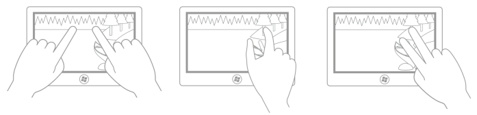
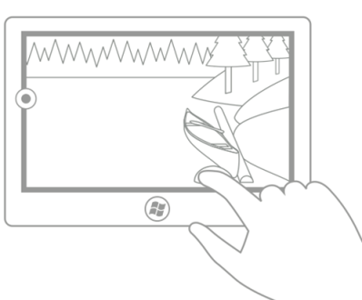

# Rotation

Cet article décrit la nouvelle interface utilisateur Windows pour la rotation et fournit des recommandations en matière d’expérience utilisateur à prendre en compte lors de l’utilisation de ce nouveau mécanisme d’interaction dans votre application UWP.

**API importantes**

-   [**Windows.UI.Input**](https://msdn.microsoft.com/library/windows/apps/br242084)
-   [**Windows.UI.Xaml.Input**](https://msdn.microsoft.com/library/windows/apps/br227994)

## Pratiques conseillées et déconseillées

-   Utilisez la rotation pour permettre aux utilisateurs de faire pivoter directement des éléments d’interface utilisateur.

## Indications d’utilisation supplémentaires

**Vue d’ensemble de la rotation**

La rotation est une technique optimisée pour l’interaction tactile utilisée par les applications UWP pour permettre aux utilisateurs de faire tourner un objet dans une direction circulaire (dans le sens des aiguilles d’une montre ou contraire).

Selon le périphérique d’entrée utilisé, l’interaction de rotation s’effectue via :

-   une souris ou un stylo/stylet actif pour déplacer la barre de redimensionnement de rotation d’un objet sélectionné ;
-   un stylo/stylet tactile ou passif pour tourner l’objet dans la direction souhaitée à l’aide du mouvement de rotation.

**Quand utiliser la rotation**

Utilisez la rotation pour permettre aux utilisateurs de faire pivoter directement des éléments d’interface utilisateur. Les schémas suivants montrent un certain nombre de positions de doigts prises en charge pour l’interaction de rotation.

**Remarque**  
Instinctivement, et dans la plupart des cas, le point de rotation est l’un des deux points tactiles, à moins que l’utilisateur ne spécifie un point de rotation qui n’est pas lié aux points de contact (par exemple, dans une application de dessin ou de mise en page). Les images suivantes montrent comment l’expérience utilisateur peut être altérée si le point de rotation n’est pas contraint dans ce sens.

Cette première image montre le premier (le pouce) et le deuxième (l’index) points tactiles : l’index touche un arbre et le pouce touche un rondin de bois.

Dans ce deuxième dessin, la rotation s’effectue autour du premier point tactile (le pouce). Après la rotation, l’index touche encore le tronc de l’arbre et le pouce touche encore le rondin de bois (le point de rotation).

Dans ce troisième dessin, le centre de la rotation a été défini par l’application (ou par l’utilisateur) comme devant être le point central du dessin. Après la rotation, étant donné que le dessin n’a pas pivoté autour de l’un des doigts, l’illusion de manipulation directe est rompue (à moins que cela ne soit la décision de l’utilisateur).

Dans ce dernier dessin, le centre de la rotation a été défini par l’application (ou par l’utilisateur) comme devant être un point situé au milieu du bord gauche du dessin. Là encore, à moins que cela ne soit la décision de l’utilisateur, l’illusion de manipulation directe a été rompue.

 

Windows 8 prend en charge trois types de rotations : libre, contrainte et combinée.

<table>
<colgroup>
<col width="50%" />
<col width="50%" />
</colgroup>
<thead>
<tr class="header">
<th align="left">Police</th>
<th align="left">Description</th>
</tr>
</thead>
<tbody>
<tr class="odd">
<td align="left">Rotation libre</td>
<td align="left">
La rotation libre permet à l’utilisateur de faire pivoter librement du contenu n’importe où dans un arc de 360 degré. Lorsque l’utilisateur relâche l’objet, celui-ci reste dans la position choisie. La rotation libre est utile pour les applications de dessin et de mise en page telles que Microsoft PowerPoint, Word, Visio et Paint ; ainsi que Adobe Photoshop, Illustrator et Flash.
</td>
</tr>
<tr class="even">
<td align="left">Rotation contrainte</td>
<td align="left">
La rotation contrainte prend en charge la rotation libre au cours de la manipulation, mais applique des points d’ancrage par incréments de 90 degrés (0, 90, 180 et 270) après le relâchement de l’objet. Lorsque l’utilisateur relâche l’objet, celui-ci pivote automatiquement vers le point d’ancrage le plus proche.

La rotation contrainte est la méthode de rotation la plus courante et elle fonctionne de la même manière que le défilement de contenu. Les points d’ancrage permettent à l’utilisateur d’atteindre son objectif tout en restant imprécis dans ses mouvements. La rotation contrainte est utile pour des applications telles que les navigateurs Web et les albums photo.
</td>
</tr>
<tr class="odd">
<td align="left">Rotation combinée</td>
<td align="left">
La rotation combinée prend en charge la rotation libre avec des zones (semblables aux rails dans les [Recommandations en matière de mouvement panoramique](guidelines-for-panning.md)) à chacun des points d’ancrage à 90 degrés appliqués par la rotation contrainte. Si l’utilisateur relâche l’objet en dehors de l’une des zones à 90 degrés, l’objet reste dans cette position ; sinon, il pivote automatiquement vers un point d’ancrage.

<strong>Remarque</strong> Le rail d’interface utilisateur est une fonctionnalité dans laquelle une zone autour d’une cible contraint le mouvement vers une certaine valeur ou un certain emplacement pour influencer sa sélection.

 

</td>
</tr>
</tbody>
</table>

 

## Rubriques connexes

**Exemples**
* [Exemple d’entrée de base](http://go.microsoft.com/fwlink/p/?LinkID=620302)
* [Exemple d’entrée à faible latence](http://go.microsoft.com/fwlink/p/?LinkID=620304)
* [Exemple de mode d’interaction utilisateur](http://go.microsoft.com/fwlink/p/?LinkID=619894)
* [Exemple de visuels de focus](http://go.microsoft.com/fwlink/p/?LinkID=619895)

**Exemples d’archive**
* [Entrée : exemple d’événements d’entrée utilisateur XAML](http://go.microsoft.com/fwlink/p/?linkid=226855)
* [Entrée : exemple de fonctionnalités d’appareils](http://go.microsoft.com/fwlink/p/?linkid=231530)
* [Entrée : exemple de test de positionnement tactile](http://go.microsoft.com/fwlink/p/?linkid=231590)
* [Exemple de zoom, de panoramique et de défilement XAML](http://go.microsoft.com/fwlink/p/?linkid=251717)
* [Entrée : exemple d’entrée manuscrite simplifiée](http://go.microsoft.com/fwlink/p/?linkid=246570)
* [Entrée : mouvements et manipulations avec GestureRecognizer](http://go.microsoft.com/fwlink/p/?LinkId=264995)
* [Entrée : exemple de manipulations et de mouvements (C++)](http://go.microsoft.com/fwlink/p/?linkid=231605)
* [Exemple d’entrée tactile DirectX](http://go.microsoft.com/fwlink/p/?LinkID=231627)
 

 

<!--HONumber=May16_HO2-->

