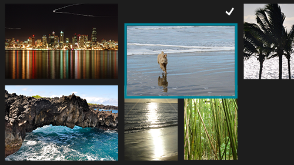
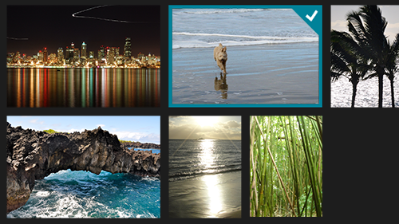

# Recommandations en matière de retour visuel

\[ Mise à jour pour les applications UWP sur Windows 10. Pour les articles sur Windows 8.x articles, voir l’[archive](http://go.microsoft.com/fwlink/p/?linkid=619132). \]

Utilisez le retour visuel pour indiquer aux utilisateurs quand leurs interactions sont détectées, interprétées et gérées. Le retour visuel peut aider les utilisateurs en encourageant l’interaction. Il indique le succès d’une interaction et améliore ainsi le sentiment de contrôle de l’utilisateur. Il transmet également l’état du système et réduit les erreurs.

**API importantes**

-   [**Windows.Devices.Input**](https://msdn.microsoft.com/library/windows/apps/br225648)
-   [**Windows.UI.Input**](https://msdn.microsoft.com/library/windows/apps/br242084)
-   [**Windows.UI.Core**](https://msdn.microsoft.com/library/windows/apps/br208383)

##      Pratiques conseillées et déconseillées

-   Fournissez un retour visuel, quelle que soit la durée du contact. Cela aide l’utilisateur à :
    -   confirmer que l’écran tactile fonctionne ;
    -   identifier si la cible est compatible avec l’interaction tactile ou réactive ;
    -   identifier si l’utilisateur a manqué la cible visée.
-   Affichez le retour immédiatement pour tous les événements d’interaction.
-   Fournissez un retour composé de signaux subtils et intuitifs qui ne doivent pas distraire l’utilisateur.
-   Veillez à ce que les cibles tactiles collent au bout du doigt durant toutes les manipulations.
-   Activez la sélection des éléments à l’aide du mouvement de balayage lorsque le mouvement panoramique est limité à une seule direction.
-   N’utilisez pas les visualisations tactiles dans des situations où elles risquent d’interférer avec l’utilisation de l’application. Pour plus d’informations, voir [**ShowGestureFeedback**](https://msdn.microsoft.com/library/windows/apps/br241969).
-   N’affichez pas de retour à moins que ce soit absolument nécessaire. Veillez à ce que l’interface utilisateur soit propre et aérée en n’affichant pas de retour visuel, à moins que cela ajoute une valeur non disponible ailleurs. N’affichez jamais d’info-bulles qui répètent du texte déjà visible. Les info-bulles doivent être réservées pour des occasions spécifiques, telles que du texte tronqué (texte avec ellipse) qui n’est pas affiché lorsque l’élément est sélectionné, ou lorsque des informations supplémentaires sont requises pour comprendre ou utiliser votre application.
-   N’utilisez pas l’appui prolongé pour autre chose que l’interface utilisateur informative.
    **Important** L’appui prolongé peut être utilisé pour la sélection dans les cas où le défilement panoramique horizontal et le défilement panoramique vertical sont tous les deux activés.

     

-   Ne personnalisez pas les comportements de retour visuel des mouvements intégrés de Windows 8, car cela peut créer une expérience utilisateur incohérente et confuse.
-   N’affichez pas de retour visuel pendant un mouvement panoramique ou un glissement ; le mouvement réel de l’objet sur l’écran est suffisant. En revanche, si la zone de contenu ne défile pas, utilisez des visualisations pour indiquer les limites. Pour plus d’informations, voir [Recommandations en matière de mouvement panoramique](guidelines-for-panning.md).
-   N’affichez pas de retour visuel pour un contrôle qui n’est pas identifié comme la cible. Le retour visuel est essentiel lorsqu’il s’agit de dépendre de l’entrée tactile pour des activités qui nécessitent de l’exactitude et de la précision en fonction de l’emplacement. L’affichage d’un retour chaque fois que vous détectez une entrée tactile aide l’utilisateur à comprendre toutes les méthodes de ciblage personnalisé définies par votre application et ses contrôles.
-   N’utilisez pas le comportement de retour destiné à un type d’entrée avec un autre type d’entrée. Par exemple, un rectangle de sélection du clavier ne doit être utilisé que pour une entrée au clavier, pas pour une entrée tactile.

##      Indications d’utilisation supplémentaires

Les visualisations de contact sont essentielles pour les interactions tactiles qui exigent précision et exactitude. Par exemple, votre application doit clairement indiquer l’emplacement d’un appui pour permettre à l’utilisateur de savoir s’il a manqué sa cible, de combien il l’a manquée et quels réglages il doit effectuer.

Utilisez les contrôles de plateforme exposés par le biais des infrastructures de langage des applications du Windows Store (applications du Windows Store en JavaScript, C++, C# ou Visual Basic) pour obtenir gratuitement les visualisations Windows 8. Si votre application propose des interactions personnalisées qui nécessitent un retour personnalisé, vous devez veiller à ce que le retour soit approprié, qu’il s’étende sur les périphériques d’entrée et qu’il ne risque pas de distraire l’utilisateur de sa tâche. Cela peut s’avérer particulièrement gênant dans les applications de jeu ou de dessin où le retour visuel peut entrer en conflit avec des éléments essentiels de l’interface utilisateur ou les masquer.

**Important**  
Nous ne conseillons pas de modifier le comportement d’interaction des mouvements intégrés.

 

**Interface utilisateur de retour**

L’interface utilisateur de retour d’information dépend généralement du périphérique d’entrée (entrée tactile, pavé tactile, souris, stylo/stylet, clavier, etc.). Par exemple, le retour intégré pour une souris implique habituellement le déplacement et le changement du curseur, l’entrée tactile et le stylo nécessitent des visualisations de contact, et l’entrée et la navigation au clavier utilisent la mise en surbrillance et des rectangles de sélection.

La propriété [**ShowGestureFeedback**](https://msdn.microsoft.com/library/windows/apps/br241969) vous sert à définir le comportement de retour pour les mouvements de la plateforme.

Si vous personnalisez l’interface utilisateur de retour, veillez à fournir un retour d’interaction prenant en charge tous les modes d’entrée et approprié à tous ces modes.

Voici quelques exemples de visualisations intégrées à Windows 8 :

<table>
<colgroup>
<col width="25%" />
<col width="25%" />
<col width="25%" />
<col width="25%" />
</colgroup>
<tbody>
<tr class="odd">
<td align="left">

Visualisation tactile
</td>
<td align="left">

Visualisation de souris/pavé tactile
</td>
<td align="left">

Visualisation de stylo
</td>
<td align="left">

Visualisation de clavier
</td>
</tr>
</tbody>
</table>

 

### 

**Interface utilisateur informative (contextuelle)**

L’une des principales formes de retour visuel est l’interface utilisateur informative (ou interface utilisateur de résolution des ambiguïtés). L’interface utilisateur informative identifie et affiche des informations sur un objet, décrit les fonctionnalités et comment y accéder, et fournit des indications là où elles s’avèrent nécessaires.

Voici les différents types d’interface utilisateur informative pris en charge par les applications du Windows Store.

-   Info-bulles
-   Info-bulles évoluées
-   Menus
-   Boîtes de message
-   Menus volants

L’interface utilisateur informative est particulièrement utile pour résoudre les problèmes d’occlusion (masquage) et améliorer les interactions tactiles avec votre application. Elle possède même un mouvement intégré qui lui est dédié : l’appui prolongé.

L’appui prolongé est une interaction chronométrée qui est généralement déconseillée dans Windows 8. Il est possible d’utiliser une interaction chronométrée dans ce cas, car elle fait office d’outil destiné à l’apprentissage et à l’exploration. La durée recommandée dépend du type d’interface utilisateur informative. Les seuils de temps recommandés sont indiqués ci-dessous.

Type d’interface utilisateur informative
Chronométrage
Activation
Utilisation
Info-bulle d’occlusion (pour le frottement et les petites cibles)
0 ms
Oui
Pour expliquer rapidement une action. Généralement utilisée pour les commandes.
Info-bulle d’occlusion (pour les actions)
200 ms
Oui
Info-bulle évoluée
~ 2000 ms
Non
Pour une exploration et un apprentissage plus lents et plus délibérés. Généralement utilisée avec des éléments de collection.
Interaction auto-révélatrice
~ 2000 ms
Non
Menu contextuel
~ 2000 ms
Non
Expose un ensemble limité de commandes lié à l’objet sélectionné.
Menus volants
~ 2000 ms
Non
Expose un ensemble limité de commandes lié à l’objet sélectionné.
 

Pour plus d’informations sur l’interface utilisateur informative, voir [Disposition de votre interface utilisateur](https://msdn.microsoft.com/library/windows/apps/hh465304) et [Affichage de fenêtres contextuelles](https://msdn.microsoft.com/library/windows/apps/hh738362).

**Info-bulles**

Utilisez une info-bulle pour fournir plus d’informations sur un contrôle avant d’inviter l’utilisateur à effectuer une action.

Les info-bulles ([**Tooltip**](https://msdn.microsoft.com/library/windows/apps/br229763)) apparaissent automatiquement quand un utilisateur effectue un mouvement comme l’appui prolongé (ou quand un événement de pointage est détecté) sur un contrôle ou un objet. L’info-bulle disparaît quand le contact ou le curseur quitte le contrôle ou l’objet. Une info-bulle peut inclure du texte et des images, mais elle n’est pas interactive.

**Info-bulles d’occlusion pour les petites cibles**

Les info-bulles d’occlusion décrivent la cible qui est masquée. Ces info-bulles sont utiles pour cibler et activer des éléments dont la taille est inférieure à celle d’une cible tactile standard, tels que des liens hypertexte sur une page Web.

Au bout d’un certain délai, vous pouvez remplacer ces info-bulles par une fenêtre contextuelle d’information. Par exemple, utilisez une info-bulle d’occlusion pour afficher le texte masqué du lien hypertexte, puis remplacez l’info-bulle par une fenêtre contextuelle contenant l’URL.

**Info-bulles d’occlusion pour les actions et les commandes**

Ces info-bulles décrivent l’action ou la commande qui intervient lorsqu’un utilisateur retire son doigt d’un élément. Elles sont utiles lors du ciblage et de l’activation d’un bouton ou d’un contrôle semblable.

Au bout d’un certain délai, il est possible de faire suivre une info-bulle de petite cible par une info-bulle d’action. Dans ce cas, l’info-bulle de petit cible doit se développer pour inclure les informations supplémentaires dans l’info-bulle d’action.

**Info-bulle évoluée**

Ce type d’info-bulle révèle des informations secondaires concernant un élément. Par exemple, elle peut contenir la description textuelle d’une image, le texte entier d’un titre tronqué ou toute autre information pertinente pour la cible.

En règle générale, les info-bulles évoluées contiennent des informations qui n’ont pas besoin d’être immédiatement mises à la disposition des utilisateurs et qui, dans certains cas, risquent de déconcentrer l’utilisateur si elles s’affichent trop rapidement. Un délai plus long permet à l’utilisateur de réfléchir à l’obtention de ces informations.

Après l’affichage d’une info-bulle évoluée, l’objet n’est plus activé lorsque l’utilisateur retire son doigt. Cela s’explique par le fait que les informations obtenues de l’info-bulle risquent d’encourager l’utilisateur à ne pas activer l’élément.

Il est recommandé que la conception et les informations visuelles d’une info-bulle évoluée soient distinctes et plus substantielles que celles d’une info-bulle standard.

**Menu contextuel**

Le menu contextuel ([**PopupMenu**](https://msdn.microsoft.com/library/windows/apps/br208693)) est un menu léger qui donne aux utilisateurs un accès immédiat à des actions (comme les commandes du Presse-papiers) sur du texte ou des objets de l’interface utilisateur dans des applications du Windows Store.

Le menu contextuel optimisé pour l’interaction tactile comporte deux parties. Un signal visuel, l’indice, s’affiche en tant que résultat d’une interaction de maintien. Ensuite, le menu contextuel lui-même s’affiche une fois que l’indice disparaît et que l’utilisateur lève le doigt.

Les images suivantes montrent comment appeler le menu contextuel par défaut pour le texte en appuyant dans la sélection ou sur un symbole de sélection/redimensionnement (l’appui prolongé peut aussi être utilisé).

Consultez [Ajout de menus contextuels](https://msdn.microsoft.com/library/windows/apps/hh465300).

**Boîte de message**

Utilisez des boîtes de message ([**MessageDialog**](https://msdn.microsoft.com/library/windows/apps/br208674)) pour inviter l’utilisateur à répondre, en fonction de l’action de l’utilisateur ou de l’état de l’application, avant de poursuivre. Cela implique une interaction utilisateur explicite et l’entrée dans l’application est bloquée jusqu’à ce que l’utilisateur réponde.

Voici plusieurs raisons qui justifient l’affichage d’une boîte de message :

-   présenter des informations urgentes ;
-   poser une question avant de continuer l’exécution ;
-   afficher un message d’erreur.

Voir [Ajout de boîtes de message](https://msdn.microsoft.com/library/windows/apps/hh738361).

**Menu volant**

Un menu volant ([**Flyout**](https://msdn.microsoft.com/library/windows/apps/br211726)) est un panneau d’interface utilisateur léger affiché sur un appui, un clic ou une autre activation. Il est utilisé pour présenter à l’utilisateur des informations, des questions ou un menu d’options relatives à l’activité en cours. Il peut être facile à fermer (il disparaît quand l’utilisateur appuie ou clique en dehors du panneau volant ou appuie sur Échap). En d’autres termes, l’utilisateur peut ignorer un menu volant.

Contrairement à l’info-bulle, le menu volant accepte les entrées. À l’inverse des boîtes de message, l’application reste active et accepte les entrées.

Voir [Ajout de menus volants et menus](https://msdn.microsoft.com/library/windows/apps/hh465325).

### 

**Interface utilisateur auto-révélatrice**

Une interaction auto-révélatrice est une animation ou un signal visuel d’information qui montre comment effectuer une action avec un objet cible et qui fournit un aperçu du résultat de cette action.

Les quelques images suivantes illustrent l’interaction auto-révélatrice d’une sélection par glisser transversal sur l’écran de démarrage. Lorsque l’utilisateur touche une vignette d’application (sans la faire glisser), elle glisse vers le bas (comme si l’utilisateur la faisait glisser) afin de révéler la coche de sélection qui s’afficherait si l’application était effectivement sélectionnée.

*Appuyez avec le doigt sur un élément pour démarrer l’interaction auto-révélatrice de la sélection. L’interaction auto-révélatrice indique l’action qui sera effectuée sur l’élément.*

*Sans lever le doigt, balayez pour sélectionner l’élément.*

*Si l’utilisateur continue à faire glisser le doigt, la visualisation auto-révélatrice change pour montrer que l’objet peut à présent être déplacé.*

Après l’affichage de l’interaction auto-révélatrice, l’objet n’est plus activé lorsque l’utilisateur lève le doigt.

##  Articles connexes

**Pour les concepteurs**
* [Recommandations en matière de mouvement panoramique](guidelines-for-panning.md)
**Pour les développeurs**
* [Interactions utilisateur personnalisées](https://msdn.microsoft.com/library/windows/apps/mt185599)
**Exemples**
* [Exemple d’entrée de base](http://go.microsoft.com/fwlink/p/?LinkID=620302)
* [Exemple d’entrée à faible latence](http://go.microsoft.com/fwlink/p/?LinkID=620304)
* [Exemple de mode d’interaction utilisateur](http://go.microsoft.com/fwlink/p/?LinkID=619894)
* [Exemple de visuels de focus](http://go.microsoft.com/fwlink/p/?LinkID=619895)
**Exemples d’archive**
* [Entrée : exemple d’événements d’entrée utilisateur XAML](http://go.microsoft.com/fwlink/p/?linkid=226855)
* [Entrée : exemple de fonctionnalités d’appareils](http://go.microsoft.com/fwlink/p/?linkid=231530)
* [Entrée : exemple de test de positionnement tactile](http://go.microsoft.com/fwlink/p/?linkid=231590)
* [Exemple de zoom, de panoramique et de défilement XAML](http://go.microsoft.com/fwlink/p/?linkid=251717)
* [Entrée : exemple d’entrée manuscrite simplifiée](http://go.microsoft.com/fwlink/p/?linkid=246570)
* [Entrée : exemple de mouvements Windows 8](http://go.microsoft.com/fwlink/p/?LinkId=264995)
* [Entrée : exemple de manipulations et de mouvements (C++)](http://go.microsoft.com/fwlink/p/?linkid=231605)
* [Exemple d’entrée tactile DirectX](http://go.microsoft.com/fwlink/p/?LinkID=231627)
 

 

<!--HONumber=Mar16_HO4-->

