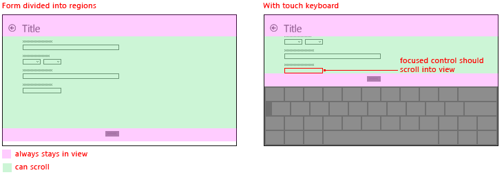
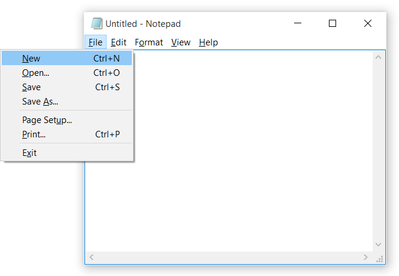

# <a name="keyboard-interactions"></a>Interactions avec le clavier
<link rel="stylesheet" href="https://az835927.vo.msecnd.net/sites/uwp/Resources/css/custom.css">

Les saisies au clavier représentent une part importante de l’expérience d’interaction utilisateur globale pour les applications. Le clavier est indispensable pour certaines personnes souffrant d’un handicap et les utilisateurs qui le considèrent simplement comme un moyen plus efficace d’interaction avec une application. Par exemple, les utilisateurs doivent pouvoir naviguer dans votre application à l’aide des touches de direction et de tabulation, activer les éléments d’interface utilisateur à l’aide de la barre d’espace et des touches Entrée, et accéder aux commandes à l’aide de raccourcis clavier.  


<div class="important-apis" >
<b>API importantes</b><br/>
<ul>
<li>[**KeyDown**](https://msdn.microsoft.com/library/windows/apps/br208941)</li>
<li>[**KeyUp**](https://msdn.microsoft.com/library/windows/apps/br208942)</li>
<li>[**KeyRoutedEventArgs**](https://msdn.microsoft.com/library/windows/apps/hh943072)</li>
</ul>
</div>
 


Une interface utilisateur de clavier bien conçue représente un aspect important de l’accessibilité logicielle. Elle permet aux utilisateurs malvoyants ou souffrant d’un handicap moteur de naviguer dans une application et d’interagir avec ses fonctionnalités. Les utilisateurs qui ne sont pas en mesure d’utiliser une souris peuvent avoir recours à diverses technologies d’assistance, telles que les outils de clavier amélioré, les claviers visuels, les écrans élargis, les lecteurs d’écran et les utilitaires d’entrée vocale.

Les utilisateurs peuvent interagir avec les applications universelles via un clavier matériel et deux claviers logiciels : le clavier visuel et le clavier tactile.

Clavier visuel  
Le clavier visuel est un clavier logiciel visuel que vous pouvez utiliser à la place du clavier physique pour entrer des données à l’aide de la fonction tactile, de la souris, du stylo/stylet ou d’un autre périphérique de pointage (un écran tactile n’est pas nécessaire). Le Clavier visuel est fourni pour les systèmes qui ne possèdent pas de clavier physique ou pour les utilisateurs qui connaissent des problèmes de mobilité les empêchant d’utiliser les périphériques d’entrée physiques classiques. Le clavier visuel émule la plupart, sinon la totalité, des fonctionnalités d’un clavier matériel.

Il peut être activé depuis la page Clavier dans Paramètres &gt; Options d’ergonomie.

**Remarque**  Le clavier visuel est prioritaire sur le clavier tactile, lequel n’est pas visible si le clavier visuel est présent.

 


<sup>Clavier visuel</sup>

Clavier tactile  
Le clavier tactile est un clavier logiciel visuel permettant d’entrer du texte à l’aide de la fonction tactile. Il ne se substitue pas au Clavier visuel, puisqu’il est utilisé uniquement pour la saisie de texte (il n’émule pas le clavier matériel).

Selon l’appareil, le clavier tactile s’affiche quand un champ de texte ou un autre contrôle de texte modifiable reçoit le focus ou lorsque l’utilisateur l’active manuellement via le **Centre de notification** :


**Remarque**  Il se peut que l’utilisateur doive accéder à l’écran **Mode tablette** dans Paramètres &gt; Système et activer l’option « Optimiser les fonctions tactiles de Windows lors de l’utilisation de votre appareil en mode tablette » pour permettre l’affichage automatique du clavier tactile.

 

Si votre application définit le focus par programme sur un contrôle d’entrée de texte, le clavier tactile n’est pas appelé. Cela permet d’éliminer les comportements inattendus non provoqués directement par l’utilisateur. Toutefois, le clavier est automatiquement masqué lorsque le focus est déplacé par programme vers un contrôle autre que d’entrée de texte.

En général, le clavier tactile ne disparaît pas automatiquement tant que l’utilisateur parcourt les contrôles dans un formulaire. Ce comportement peut varier en fonction des autres types de contrôle du formulaire.

Voici la liste des contrôles autres que d’édition qui peuvent recevoir le focus pendant une session d’entrée de texte à l’aide du clavier tactile sans que cela ait pour effet de masquer celui-ci. Au lieu de perturber inutilement l’interface utilisateur au risque de désorienter l’utilisateur, le clavier tactile reste bien en vue, car l’utilisateur va vraisemblablement passer des contrôles à l’entrée de texte à l’aide du clavier tactile.

-   Check box
-   Combo box
-   Radio button
-   Scroll bar
-   Tree
-   Tree item
-   Menu
-   Menu bar
-   Menu item
-   ToolBar
-   List
-   List item

Voici quelques exemples des différents modes disponibles pour le clavier tactile. La première image représente la disposition classique, la seconde représente la disposition ergonomique (qui n’est pas forcément disponible dans toutes les langues).

Voici quelques exemples des différents modes disponibles pour le clavier tactile. La première image représente la disposition classique, la seconde représente la disposition ergonomique (qui n’est pas forcément disponible dans toutes les langues).
<table>
<tr>
    <td>**Clavier tactile en mode de disposition classique :  **</td>
    <td></td>
</tr>
<tr>
    <td>**Clavier tactile en mode de disposition étendue :  **</td>
    <td></td>
</tr>
<tr>
    <td>**Clavier tactile en mode de disposition ergonomique classique :  **</td>
    <td></td>
</tr>
<tr>
    <td>**Clavier tactile en mode de disposition ergonomique numérique :  **</td>
    <td></td>
</tr>
</table>


Des interactions réussies avec le clavier permettent aux utilisateurs d’accomplir des scénarios d’application de base uniquement à l’aide du clavier. Autrement dit, les utilisateurs peuvent atteindre tous les éléments interactifs et activer leur fonctionnalité par défaut. Plusieurs facteurs peuvent affecter le degré de réussite, tels que la navigation à l’aide du clavier, les touches d’accès pour l’accessibilité et les touches d’accès rapide (ou de raccourci) pour les utilisateurs expérimentés.

**Remarque**  Le clavier tactile ne prend pas en charge le basculement et la plupart des commandes système (voir [Modèles](#keyboard_command_patterns)).

## <a name="navigation"></a>Navigation


Pour utiliser un contrôle (y compris des éléments de navigation) avec le clavier, il faut que le focus de celui-ci soit positionné sur le contrôle. Une façon pour un contrôle de recevoir le focus du clavier est de rendre celui-ci accessible via la navigation par onglets à l’aide de la touche de tabulation. Un modèle bien conçu de navigation à l’aide du clavier fournit un ordre de tabulation logique et prévisible, qui permet à l’utilisateur d’explorer et d’utiliser votre application rapidement et efficacement.

Tous les contrôles interactifs doivent comprendre des taquets de tabulation (sauf s’ils figurent dans un groupe), au contraire des contrôles non interactifs, tels que des étiquettes.

Un ensemble de contrôles associés peuvent être rassemblés dans un groupe de contrôles auquel un taquet de tabulation unique est affecté. Les groupes de contrôles sont utilisés pour des ensembles de contrôles qui se comportent comme un contrôle unique, telles des cases d’option. Ils peuvent également servir quand l’abondance des contrôles rend malaisée une navigation efficace à l’aide de la seule touche de tabulation. Les touches de direction, Début, Fin, Page précédente et Page suivante, permettent de déplacer le focus d’entrée entre les contrôles à l’intérieur d’un groupe. Elles ne permettent pas de naviguer hors d’un groupe de contrôles.

Il est recommandé de définir le focus clavier initial sur l’élément avec lequel vous pensez que les utilisateurs interagiront intuitivement (ou le plus probablement) en premier au démarrage de l’application. Souvent, il s’agit de l’affichage du contenu principal de l’application, qui permet à l’utilisateur de commencer immédiatement à utiliser les touches de direction pour parcourir le contenu.

Ne définissez pas le focus clavier initial sur un élément dont l’utilisation pourrait avoir un effet négatif, voire désastreux. Cela peut éviter une perte de données ou d’accès système.

Essayez de classer et de présenter les commandes, contrôles et éléments de contenu les plus importants en premier, tant dans l’ordre de tabulation que dans l’ordre d’affichage (ou hiérarchie visuelle). Toutefois, la position d’affichage réelle peut dépendre du conteneur de disposition parent et de certaines propriétés des éléments enfants qui influencent la disposition. En particulier, des dispositions qui utilisent une métaphore visuelle de grille ou de tableau peuvent avoir un sens de lecture très différent de l’ordre de tabulation. Ce n’est pas toujours un problème, mais vous devez tester la fonctionnalité de votre application, tant comme interface utilisateur tactile que comme interface utilisateur accessible via le clavier.

Autant que possible, l’ordre de tabulation doit suivre le sens de lecture. Cela peut réduire la confusion et dépend des paramètres régionaux et linguistiques.

Associez des touches du clavier aux éléments d’interface utilisateur appropriés (boutons Précédent et Suivant) dans votre application.

Essayez de rendre le retour à l’écran d’accueil et la navigation entre les éléments clés du contenu de votre application aussi faciles et simples que possible.

Utilisez les touches de direction comme raccourcis clavier pour la navigation interne correcte parmi les éléments enfants d’éléments composites. Si les nœuds de l’arborescence ont des éléments enfants distincts pour la gestion de la fonctionnalité développer-réduire et l’activation des nœuds, utilisez les touches de direction Gauche et Droite pour fournir au clavier la fonctionnalité développer-réduire. Cela est cohérent avec les contrôles de plateforme.

Étant donné que le clavier tactile masque une grande partie de l’écran, la plateforme Windows universelle (UWP) fait en sorte que le champ d’entrée ayant le focus devienne visible quand l’utilisateur navigue parmi les contrôles du formulaire, y compris ceux qui ne sont pas affichés actuellement. Les contrôles personnalisés doivent émuler ce comportement.


Dans certains cas, il existe des éléments d’interface utilisateur qui doivent rester tout le temps à l’écran. Concevez l’interface utilisateur de sorte que les contrôles de formulaire se trouvent dans une région panoramique et que les éléments d’interface utilisateur importants soient statiques. Par exemple :


## <a name="activation"></a>Activation


Un contrôle peut être activé de plusieurs façons, quelle que soit la position du focus.

Barre d’espace, Entrée et Échap  
La barre d’espace doit activer le contrôle sur lequel le focus d’entrée est positionné. La touche Entrée doit activer un contrôle par défaut ou le contrôle sur lequel le focus d’entrée est positionné. Un contrôle par défaut est le contrôle sur lequel est positionné le focus initial, ou répondant exclusivement à l’action de la touche Entrée (en règle générale, il change avec le focus d’entrée). En outre, la touche Échap doit fermer ou quitter une interface utilisateur temporaire, telle qu’un menu ou une boîte de dialogue.

L’application Calculatrice illustrée ici utilise la barre d’espace pour activer le bouton avec le focus, verrouille les touches Entrée sur le bouton « = », et verrouille la touche Échap sur le bouton « C ».


Modificateurs de clavier  
Les modificateurs de clavier s’inscrivent dans les catégories suivantes.


| Catégorie | Description |
|----------|-------------|
| Touche de raccourci | Permet d’effectuer une action courante sans l’interface utilisateur tel que « Ctrl-S » pour **Enregistrer**. Permet d’implémenter des raccourcis clavier pour les fonctionnalités clés de l’application. Toutes les commandes n’ont pas, ou ne nécessitent pas, de raccourcis. |   
| Touche d’accès rapide | Attribuée à chaque contrôle visible, de niveau supérieur tel que « Alt + F » pour le menu **Fichier**. Une touche d’accès rapide ne permet pas d’appeler ou d’activer une commande. |
| Touche accélérateur | Permet d’exécuter des commandes définies par l’application ou des commandes système par défaut, telles que « Alt-Imp écr. » pour effectuer une capture d’écran, « Alt-Tab » pour basculer entre les applications ou « F1 » pour accéder à l’aide. Une commande associée à une touche accélérateur ne doit pas nécessairement être un élément de menu. |
| Touche d’application/touche de menu | Permet d’afficher le menu contextuel. |
| Touche Windows/touche de commande | Permet d’activer les commandes système telles que **System Menu**, **Lock Screen** ou **Show Desktop**. |

Les touches d’accès rapide et les touches accélérateur prennent directement en charge l’interaction avec les contrôles. Vous n’avez donc pas besoin d’utiliser la navigation par tabulation pour accéder à ces derniers.
> Si certains contrôles, tels que les boutons de commande, les cases à cocher et les cases d’option, ont des étiquettes intrinsèques, d’autres, tels les affichages de liste ont des étiquettes externes. Pour les contrôles ayant des étiquettes externes, la touche d’accès rapide est attribuée à l’étiquette qui, quand elle est appelée, positionne le focus sur un élément ou une valeur à l’intérieur du contrôle associé.


Ici, l’exemple montre les touches d’accès rapide pour l’onglet **Mise en Page** dans **Word**.


Ici, la valeur du champ de texte Retrait à gauche est mise en surbrillance après l’action de la touche d’accès rapide identifiée dans l’étiquette associée.


## <a name="usability-and-accessibility"></a>Facilité d’utilisation et accessibilité


Une expérience bien conçue d’interaction avec le clavier constitue un aspect important de la facilité d’utilisation des logiciels. Elle permet aux utilisateurs malvoyants ou souffrant d’un handicap moteur de naviguer dans une application et d’interagir avec ses fonctionnalités. De tels utilisateurs peuvent ne pas être en mesure d’utiliser une souris et devoir recourir à diverses technologies d’assistance, telles que des outils de clavier amélioré, des claviers visuels, des écrans élargis, des lecteurs d’écran et autres utilitaires d’entrée vocale. Pour ces utilisateurs, l’exhaustivité est plus importante que la cohérence.

Les utilisateurs expérimentés ont souvent une préférence marquée pour l’utilisation du clavier, car les commandes clavier peuvent être entrées plus rapidement et ne nécessitent pas de retirer les mains du clavier. Pour ces utilisateurs, l’efficacité et la cohérence sont essentielles. L’exhaustivité n’est importante que pour les commandes les plus fréquemment utilisées.

Il existe des différences subtiles selon que la conception vise à faciliter l’utilisation ou l’accessibilité. C’est pourquoi deux mécanismes distincts d’accès au clavier sont pris en charge.

Les touches d’accès rapide présentent les caractéristiques suivantes :

-   Une touche d’accès rapide est un raccourci vers un élément de l’interface utilisateur de votre application.
-   Elles utilisent la touche Alt associée à une touche alphanumérique.
-   Elles visent principalement l’accessibilité.
-   Elles sont affectées à l’ensemble des options de menu et à la plupart des contrôles de boîte de dialogue.
-   N’étant pas destinées à être mémorisées, elles sont indiquées directement dans l’interface utilisateur par un trait soulignant le caractère de l’étiquette de contrôle correspondant.
-   Leur incidence se limite à la fenêtre active et elles permettent d’accéder à l’option de menu ou au contrôle correspondant.
-   Elles ne sont pas attribuées de façon cohérente, car ce n’est pas toujours possible. Toutefois, il convient de les attribuer de façon cohérente pour les commandes fréquemment utilisées, en particulier les boutons de validation.
-   Elles sont localisées.

Les touches d’accès rapide n’étant pas destinées à être mémorisées, elles sont attribuées à un caractère aussi proche que possible du début de l’étiquette afin de faciliter son repérage, même si un mot-clé figure plus loin dans l’étiquette.

En revanche, les touches accélérateur, ou de raccourci, présentent les caractéristiques suivantes :

-   Elles constituent des raccourcis de commande d’application.
-   Elles utilisent principalement des combinaisons basées sur la touche Ctrl et une touche de fonction (les touches de raccourci système de Windows utilisent également des combinaisons basées sur la touche Alt et une touche non alphanumérique, ainsi que la touche de logo Windows).
-   Elles visent principalement à renforcer l’efficacité pour les utilisateurs expérimentés.
-   Elles sont attribuées uniquement aux commandes les plus couramment utilisées.
-   Elles sont destinées à être mémorisées et sont indiquées uniquement dans les menus, les info-bulles et l’aide.
-   Elles sont disponibles dans l’ensemble du programme, mais n’ont aucun effet là où elles ne s’appliquent pas.
-   Elles doivent être attribuées de façon cohérente, car elles sont mémorisées et non directement indiquées.
-   Elles ne sont pas localisées.

Les touches accélérateur étant destinées à être mémorisées, les plus fréquemment utilisées utilisent idéalement la première lettre ou le caractère le plus facile à mémoriser du mot-clé correspondant à leur fonction, par exemple, Ctrl+C (Copy) pour copier et Ctrl+Q (reQuest) pour effectuer une demande.

Les utilisateurs doivent être en mesure d’accomplir toutes les tâches prises en charge par votre application en utilisant exclusivement le clavier matériel ou visuel.

Vous devez permettre aux utilisateurs qui s’appuient sur des lecteurs d’écran et d’autres technologies d’assistance de repérer aisément les touches accélérateur de votre application. Signalez les touches accélérateur à l’aide d’info-bulles, de noms accessibles, de descriptions accessibles ou d’autres formes de communication à l’écran. Les touches d’accès rapide et accélérateur (de raccourci) doivent au minimum être bien documentées dans le contenu d’aide de votre application.

N’affectez pas les touches accélérateur bien connues ou standard à d’autres fonctionnalités. Par exemple, Ctrl+F (Find) est généralement utilisé pour trouver ou rechercher un élément.

Ne cherchez pas à affecter des touches d’accès rapide à tous les contrôles interactifs d’une interface utilisateur dense. Veillez simplement à attribuer des touches d’accès rapide aux fonctions principales et les plus utilisées , ou utilisez des groupes de contrôles et affectez une touche d’accès rapide à leur étiquette.

Ne modifiez pas les commandes à l’aide de modificateurs de clavier. De telles modifications sont indétectables et peuvent être source de confusion.

Ne désactivez pas un contrôle quand le focus est positionné dessus. Cela peut interférer avec la saisie au clavier.

Pour garantir une expérience réussie d’interaction avec le clavier, il est essentiel de tester votre application minutieusement et exclusivement avec le clavier.

## <a name="text-input"></a>Saisie de texte


Si vous dépendez de la saisie au clavier, enquérez-vous toujours des fonctionnalités de l’appareil. Sur certains appareils (par exemple, des téléphones), le clavier tactile est réservé exclusivement à la saisie de texte, car il n’offre pas bon nombre des touches accélérateur ou de commande présentes sur un clavier matériel (par exemple, la touche Alt, les touches de fonction ou la touche de logo Windows).

N’obligez pas les utilisateurs à naviguer dans l’application à l’aide du clavier tactile. Selon le contrôle sur lequel le focus est positionné, le clavier tactile peut être masqué.

Tentez d’afficher le clavier durant toute la durée d’interaction avec votre formulaire. Cela permet d’éliminer toute perturbation de l’interface susceptible de désorienter l’utilisateur au milieu d’un flux de saisie de formulaire ou de texte.

Veillez à ce que les utilisateurs puissent toujours voir le champ dans lequel ils effectuent la saisie. Le clavier tactile masquant la moitié de l’écran, le champ d’entrée avec le focus doit défiler à l’écran à mesure que l’utilisateur parcourt le formulaire.

Un clavier matériel ou clavier visuel standard se compose de sept types de touches prenant respectivement en charge des fonctionnalités uniques :

-   Touche de caractères : envoie un caractère littéral à la fenêtre sur laquelle le focus d’entrée est positionné.
-   Touche de modification : modifie la fonction d’une touche primaire quand l’utilisateur appuie simultanément dessus ; par exemple, Ctrl, Alt, Maj et touche de logo Windows.
-   Touche de navigation : déplace le focus d’entrée ou l’emplacement de saisie de texte ; par exemple, Tab, Début, Fin, Page précédente, Page suivante et touches de direction (flèches).
-   Touche d’édition : manipule du texte ; par exemple, Maj, Tab, Entrée, Inser, Retour arrière et Suppr.
-   Touche de fonction : exécute une fonction spéciale ; par exemple, les touches F1 à F12.
-   Touche bascule : modifie le mode du système ; par exemple, Verr. maj, Arrêt défil et Verr. num.
-   Touche de commande : exécute une tâche système ou active une commande ; par exemple, Espace, Entrée, Échap, Pause/Attn et Impr. écran.

En plus de ces catégories, il existe une classe secondaire de touches et combinaisons de touches pouvant être utilisées comme raccourcis vers des fonctionnalités d’application :

-   Touche d’accès rapide : expose des contrôles ou éléments de menu en cas d’appui sur la touche Alt et une touche de caractère indiquée par un soulignement dans un menu ou une superposition.
-   Touche accélérateur ou de raccourci : expose des commandes d’application en cas d’appui sur une touche de fonction ou sur la touche Ctrl en même temps qu’une touche de caractère. Votre application peut avoir ou non une interface utilisateur correspondant à la commande.

Une autre classe de combinaisons de touches, appelée séquence de touches sécurisée (SAS) ne peut pas être interceptée par une application. Il s’agit d’une fonctionnalité de sécurité destinée à protéger le système de l’utilisateur au cours de l’ouverture de session et à inclure Ctrl + Alt + Suppr et Win-L.

L’application Bloc-notes est présentée ici avec le menu Fichier développé, comprenant des touches d’accès rapide et des touches accélérateur.



## <a name="keyboard-commands"></a>Commandes du clavier


Voici la liste complète des interactions avec le clavier sur les divers appareils qui prennent en charge la saisie au clavier. Certains appareils et plateformes nécessitent des interactions et combinaisons de touches natives qui sont indiquées.

Lorsque vous concevez des interactions et contrôles personnalisés, utilisez la langue du clavier de façon cohérente pour rendre votre application familière, fiable et conviviale.

Ne redéfinissez pas les raccourcis clavier par défaut.

Les trois tableaux suivants répertorient les commandes au clavier le plus souvent utilisées. Pour obtenir la liste complète des commandes au clavier, voir [Touches de raccourci clavier Windows](http://go.microsoft.com/fwlink/p/?linkid=325424).

**Commande de navigation**

| Action                               | Touche                                      |
|--------------------------------------|--------------------------------------------------|
| Retour                                 | Alt+Gauche ou le bouton précédent sur certains claviers |
| Suivant                              | Alt+Droite                                        |
| Monter                                   | Alt+Haut                                           |
| Annuler ou sortir du mode actuel   | Échap                                              |
| Parcourir les éléments d’une liste         | Touche de direction (Gauche, Droite, Haut, Bas)                |
| Passer à la liste suivante d’éléments           | Ctrl+Gauche                                        |
| Zoom sémantique                        | Ctrl++ ou Ctrl+-                                 |
| Passer à un élément nommé dans une collection | Commencer à taper le nom de l’élément                           |
| Page suivante                            | Pg préc, Pg suiv ou Espace                   |
| Onglet suivant                             | Ctrl+Tab                                         |
| Onglet précédent                         | Ctrl+Maj+Tab                                   |
| Ouvrir la barre de l’application                         | Windows+Z                                        |
| Activer ou naviguer dans un élément    | Entrée                                            |
| Sélectionner                               | Espace                                         |
| Sélection continue                  | Maj+touche de direction                                  |
| Tout sélectionner                           | Ctrl+A                                           |

 

**Commandes courantes**

| Action                                                 | Touche     |
|--------------------------------------------------------|-----------------|
| Épingler un élément                                            | Ctrl+Maj+1    |
| Enregistrer                                                   | Ctrl+S          |
| Rechercher                                                   | Ctrl+F          |
| Imprimer                                                  | Ctrl+P          |
| Copier                                                   | Ctrl+C          |
| Couper                                                    | Ctrl+X          |
| Nouvel élément                                               | Ctrl+N          |
| Coller                                                  | Ctrl+V          |
| Ouvrir                                                   | Ctrl+O          |
| Ouvrir une adresse (par exemple, une URL dans Internet Explorer) | Ctrl+L ou Alt+D |

 

**Commandes de navigation multimédia**

| Action       | Touche |
|--------------|-------------|
| Lecture/Pause   | Ctrl+P      |
| Élément suivant    | Ctrl+F      |
| Aperçu d’un élément | Ctrl+B      |

 

Remarque : les commandes de navigation multimédia pour Lire/Pause et Élément suivant sont identiques respectivement aux commandes pour Imprimer et Rechercher. Les commandes courantes sont prioritaires sur les commandes de navigation multimédia. Par exemple, si une application lit du contenu multimédia et imprime, la commande clé Ctrl+P doit lancer une impression.
## <a name="visual-feedback"></a>Retour visuel


Utilisez les rectangles de sélection uniquement pour les interactions avec le clavier. Si l’utilisateur commence une interaction tactile, estompez progressivement l’interface utilisateur du clavier. Cela maintient l’interface utilisateur propre et aérée.

N’affichez pas de retour visuel si un élément ne prend pas en charge l’interaction (par exemple, du texte statique). Une fois encore, cela maintient l’interface utilisateur propre et aérée.

Essayez d’afficher un retour visuel simultanément pour tous les éléments qui représentent la même cible d’entrée.

Essayez de fournir des boutons à l’écran (par exemple + et -) en guise d’indications pour émuler des manipulations tactiles comme le mouvement panoramique, la rotation, le zoom, etc.

Pour obtenir des recommandations plus générales sur le retour visuel, voir [Recommandations en matière de retour visuel](guidelines-for-visualfeedback.md).


## <a name="keyboard-events-and-focus"></a>Événements de clavier et focus


Les événements de clavier suivants peuvent se produire pour les claviers physiques et tactiles.

| Événement                                      | Description                    |
|--------------------------------------------|--------------------------------|
| [**KeyDown**](https://msdn.microsoft.com/library/windows/apps/br208941) | Se produit lorsqu’une touche est enfoncée.  |
| [**KeyUp**](https://msdn.microsoft.com/library/windows/apps/br208942)     | Se produit lorsqu’une touche est relâchée. |


**Important**  
Certains contrôles Windows Runtime gèrent les événements d’entrée en interne. Dans ces cas-là, il peut sembler qu’un événement d’entrée n’a pas lieu car votre écouteur d’événements n’appelle pas le gestionnaire associé. En général, ces touches sont gérées par le gestionnaire de classe pour fournir une prise en charge intégrée de l’accessibilité de base du clavier. Par exemple, la classe [**Button**](https://msdn.microsoft.com/library/windows/apps/br209265) substitue les événements [**OnKeyDown**](https://msdn.microsoft.com/library/windows/apps/hh967982) pour la touche Espace et la touche Entrée (de même que [**OnPointerPressed**](https://msdn.microsoft.com/library/windows/apps/hh967989)) et les achemine vers l’événement [**Click**](https://msdn.microsoft.com/library/windows/apps/br227737) du contrôle. Quand un appui sur une touche est géré par la classe de contrôle, les événements [**KeyDown**](https://msdn.microsoft.com/library/windows/apps/br208941) et [**KeyUp**](https://msdn.microsoft.com/library/windows/apps/br208942) ne sont pas déclenchés.

Cela fournit un équivalent de clavier intégré pour l’appel du bouton, comme en cas d’appui avec un doigt ou de clic avec une souris. Les touches autres que Espace ou Entrée déclenchent quand même les événements [**KeyDown**](https://msdn.microsoft.com/library/windows/apps/br208941) et [**KeyUp**](https://msdn.microsoft.com/library/windows/apps/br208942). Pour plus d’informations sur le fonctionnement de cette gestion des événements basée sur la classe (en particulier la section Gestionnaires d’événements d’entrée dans les contrôles), voir [Vue d’ensemble des événements et des événements routés](https://msdn.microsoft.com/library/windows/apps/mt185584).


Les contrôles de votre interface utilisateur génèrent des événements de clavier uniquement lorsqu’ils ont le focus d’entrée. Un élément individuel reçoit le focus lorsque l’utilisateur clique ou appuie directement sur cet élément dans l’interface ou qu’il utilise la touche Tab dans la zone de contenu.

Vous pouvez également appeler la méthode [**Focus**](https://msdn.microsoft.com/library/windows/apps/hh702161) d’un contrôle pour forcer le focus. Cette action est nécessaire lorsque vous implémentez des touches de raccourci, car le focus du clavier n’est pas défini par défaut lors du chargement de votre interface utilisateur. Pour plus d’informations, voir [Exemple de touches de raccourci](#shortcut_keys_example), plus loin dans cette rubrique.

Pour qu’un contrôle puisse recevoir le focus d’entrée, il doit être activé, visible et avoir les propriétés [**IsTabStop**](https://msdn.microsoft.com/library/windows/apps/br209422) et [**HitTestVisible**](https://msdn.microsoft.com/library/windows/apps/br208933) associées à la valeur **true**. Il s’agit de l’état par défaut de la plupart des contrôles. Lorsqu’un contrôle a le focus d’entrée, il peut être déclenché et répondre aux événements d’entrée de clavier, tel que décrit plus loin dans cette rubrique. Vous pouvez également répondre à un contrôle qui reçoit ou perd le focus en gérant les événements [**GotFocus**](https://msdn.microsoft.com/library/windows/apps/br208927) et [**LostFocus**](https://msdn.microsoft.com/library/windows/apps/br208943).

Par défaut, l’ordre de tabulation des contrôles est celui dans lequel les contrôles apparaissent dans le code XAML (Extensible Application Markup Language). Vous pouvez cependant changer cet ordre à l’aide de la propriété [**TabIndex**](https://msdn.microsoft.com/library/windows/apps/br209461). Pour plus d’informations, voir [Implémentation de l’accessibilité du clavier](https://msdn.microsoft.com/library/windows/apps/hh868161).

## <a name="keyboard-event-handlers"></a>Gestionnaires d’événements de clavier


Un gestionnaire d’événements d’entrée implémente un délégué qui fournit les informations suivantes :

-   L’expéditeur de l’événement. L’expéditeur signale l’objet auquel le gestionnaire d’événements est attaché.
-   Les données d’événement. Dans le cas des événements de clavier, ces données seront une instance de [**KeyRoutedEventArgs**](https://msdn.microsoft.com/library/windows/apps/hh943072). Le délégué des gestionnaires est [**KeyEventHandler**](https://msdn.microsoft.com/library/windows/apps/br227904). Les propriétés les plus significatives de **KeyRoutedEventArgs** pour la plupart des scénarios de gestionnaires sont [**Key**](https://msdn.microsoft.com/library/windows/apps/hh943074) et éventuellement [**KeyStatus**](https://msdn.microsoft.com/library/windows/apps/hh943075).
-   [**OriginalSource**](https://msdn.microsoft.com/library/windows/apps/br208810). Les événements de clavier étant des événements routés, les données d’événements fournissent **OriginalSource**. Si vous autorisez délibérément des événements à être proposés par le biais d’un arbre d’objets, **OriginalSource** est parfois l’objet de la question plutôt que l’expéditeur, bien que cela dépende de la conception de votre application. Pour plus d’informations concernant l’utilisation de **OriginalSource** à la place de l’expéditeur, voir la section Événements routés de clavier de cette rubrique ou [Vue d’ensemble des événements et des événements routés](https://msdn.microsoft.com/library/windows/apps/mt185584).

### <a name="attaching-a-keyboard-event-handler"></a>Attachement d’un gestionnaire d’événements de clavier

Vous pouvez attacher les fonctions des gestionnaires d’événements de clavier pour n’importe quel objet qui inclut l’événement en tant que membre. Cela inclut toute classe dérivée [**UIElement**](https://msdn.microsoft.com/library/windows/apps/br208911). L’exemple de code XAML suivant montre comment attacher des gestionnaires pour l’événement [**KeyUp**](https://msdn.microsoft.com/library/windows/apps/br208942) d’un [**Grid**](https://msdn.microsoft.com/library/windows/apps/br242704).

```xaml
<Grid KeyUp="Grid_KeyUp">
  ...
</Grid>
```

Vous pouvez également associer un gestionnaire d’événements à du code. Pour plus d’informations, voir [Vue d’ensemble des événements et des événements routés](https://msdn.microsoft.com/library/windows/apps/mt185584).

### <a name="defining-a-keyboard-event-handler"></a>Définition d’un gestionnaire d’événements de clavier

L’exemple suivant montre la définition incomplète du gestionnaire d’événements [**KeyUp**](https://msdn.microsoft.com/library/windows/apps/br208942) attaché dans l’exemple précédent.

```csharp
void Grid_KeyUp(object sender, KeyRoutedEventArgs e)
{
    //handling code here
}
```

```vb
Private Sub Grid_KeyUp(ByVal sender As Object, ByVal e As KeyRoutedEventArgs)
    ' handling code here
End Sub
```

```c++
void MyProject::MainPage::Grid_KeyUp(
  Platform::Object^ sender,
  Windows::UI::Xaml::Input::KeyRoutedEventArgs^ e)
  {
      //handling code here
  }
```

### <a name="using-keyroutedeventargs"></a>Utilisation de KeyRoutedEventArgs

Tous les événements de clavier utilisent [**KeyRoutedEventArgs**](https://msdn.microsoft.com/library/windows/apps/hh943072) pour les données d’événements, et **KeyRoutedEventArgs** contient les propriétés suivantes :

-   [**Key**](https://msdn.microsoft.com/library/windows/apps/hh943074)
-   [**KeyStatus**](https://msdn.microsoft.com/library/windows/apps/hh943075)
-   [**Handled**](https://msdn.microsoft.com/library/windows/apps/hh943073)
-   [**OriginalSource**](https://msdn.microsoft.com/library/windows/apps/br208810) (hérité de [**RoutedEventArgs**](https://msdn.microsoft.com/library/windows/apps/br208809))

### <a name="key"></a>Clé

L’événement [**KeyDown**](https://msdn.microsoft.com/library/windows/apps/br208941) est déclenché si une touche est enfoncée. De même, l’événement [**KeyUp**](https://msdn.microsoft.com/library/windows/apps/br208942) est déclenché si une touche est relâchée. Vous êtes généralement à l’écoute des événements en vue de traiter une valeur de touche spécifique. Afin de déterminer quelle touche est enfoncée ou relâchée, vérifiez la valeur [**Key**](https://msdn.microsoft.com/library/windows/apps/hh943074) dans les données d’événements. **Key** renvoie une valeur [**VirtualKey**](https://msdn.microsoft.com/library/windows/apps/br241812). L’énumération **VirtualKey** inclut toutes les touches prises en charge.

### <a name="modifier-keys"></a>Touches de modification

Les touches de modification sont des touches, telles que Ctrl ou Maj, sur lesquelles les utilisateurs appuient généralement en même temps que d’autres touches. Votre application peut utiliser ces combinaisons de touches en tant que raccourcis clavier pour appeler des commandes d’application.

Vous pouvez détecter des combinaisons de touches de raccourci à l’aide de code dans vos gestionnaires d’événements [**KeyDown**](https://msdn.microsoft.com/library/windows/apps/br208941) et [**KeyUp**](https://msdn.microsoft.com/library/windows/apps/br208942). Vous pouvez ensuite effectuer le suivi de l’état d’appui des touches de modification qui vous intéressent. Lorsqu’un événement de clavier se produit pour une touche qui n’est pas une touche de modification, vous pouvez vérifier en même temps si une touche de modification est à l’état appuyé.

> [!NOTE]
> La touche Alt est représentée par la valeur **VirtualKey.Menu**.

 

### <a name="shortcut-keys-example"></a>Exemple de touches de raccourci


L’exemple suivant explique comment implémenter des touches de raccourci. Dans cet exemple, les utilisateurs peuvent contrôler la lecture du contenu multimédia à l’aide des boutons Lecture, Pause et Arrêt ou des raccourcis clavier Ctrl+P, Ctrl+A et Ctrl+S. Le bouton XAML affiche les touches de raccourci à l’aide des info-bulles et des propriétés [**AutomationProperties**](https://msdn.microsoft.com/library/windows/apps/br209081) des étiquettes de boutons. Cette documentation d’auto-apprentissage est importante afin d’augmenter la facilité d’utilisation et l’accessibilité de votre application. Pour plus d’informations, voir [Accessibilité du clavier](https://msdn.microsoft.com/library/windows/apps/mt244347).

Notez également que la page définit le focus d’entrée sur elle-même lors de son chargement. Sans cette étape, aucun contrôle n’a le focus d’entrée initial et l’application ne déclenche pas les événements d’entrée tant qu’un utilisateur n’a pas défini le focus d’entrée manuellement (par exemple en utilisant la touche de tabulation ou en cliquant sur un contrôle).

```xaml
<Grid KeyDown="Grid_KeyDown">

  <Grid.RowDefinitions>
    <RowDefinition Height="Auto" />
    <RowDefinition Height="Auto" />
  </Grid.RowDefinitions>

  <MediaElement x:Name="DemoMovie" Source="xbox.wmv"
    Width="500" Height="500" Margin="20" HorizontalAlignment="Center" />

  <StackPanel Grid.Row="1" Margin="10"
    Orientation="Horizontal" HorizontalAlignment="Center">

    <Button x:Name="PlayButton" Click="MediaButton_Click"
      ToolTipService.ToolTip="Shortcut key: Ctrl+P"
      AutomationProperties.AcceleratorKey="Control P">
      <TextBlock>Play</TextBlock>
    </Button>

    <Button x:Name="PauseButton" Click="MediaButton_Click"
      ToolTipService.ToolTip="Shortcut key: Ctrl+A"
      AutomationProperties.AcceleratorKey="Control A">
      <TextBlock>Pause</TextBlock>
    </Button>

    <Button x:Name="StopButton" Click="MediaButton_Click"
      ToolTipService.ToolTip="Shortcut key: Ctrl+S"
      AutomationProperties.AcceleratorKey="Control S">
      <TextBlock>Stop</TextBlock>
    </Button>

  </StackPanel>

</Grid>
```

```c++
//showing implementations but not header definitions
void MainPage::OnNavigatedTo(NavigationEventArgs^ e)
{
    (void) e;    // Unused parameter
    this->Loaded+=ref new RoutedEventHandler(this,&amp;MainPage::ProgrammaticFocus);
}
void MainPage::ProgrammaticFocus(Object^ sender, RoutedEventArgs^ e) {
    this->Focus(Windows::UI::Xaml::FocusState::Programmatic);
}

void KeyboardSupport::MainPage::MediaButton_Click(Platform::Object^ sender, Windows::UI::Xaml::RoutedEventArgs^ e)
{
    FrameworkElement^ fe = safe_cast<FrameworkElement^>(sender);
    if (fe->Name == "PlayButton") {DemoMovie->Play();}
    if (fe->Name == "PauseButton") {DemoMovie->Pause();}
    if (fe->Name == "StopButton") {DemoMovie->Stop();}
}


void KeyboardSupport::MainPage::Grid_KeyDown(Platform::Object^ sender, Windows::UI::Xaml::Input::KeyRoutedEventArgs^ e)
{
    if (e->Key == VirtualKey::Control) isCtrlKeyPressed = true;
}


void KeyboardSupport::MainPage::Grid_KeyUp(Platform::Object^ sender, Windows::UI::Xaml::Input::KeyRoutedEventArgs^ e)
{
    if (e->Key == VirtualKey::Control) isCtrlKeyPressed = false;
    else if (isCtrlKeyPressed) {
        if (e->Key==VirtualKey::P) {
            DemoMovie->Play();
        }
        if (e->Key==VirtualKey::A) {DemoMovie->Pause();}
        if (e->Key==VirtualKey::S) {DemoMovie->Stop();}
    }
}
```

```csharp
protected override void OnNavigatedTo(NavigationEventArgs e)
{
    // Set the input focus to ensure that keyboard events are raised.
    this.Loaded += delegate { this.Focus(FocusState.Programmatic); };
}

private void MediaButton_Click(object sender, RoutedEventArgs e)
{
    switch ((sender as Button).Name)
    {
        case "PlayButton": DemoMovie.Play(); break;
        case "PauseButton": DemoMovie.Pause(); break;
        case "StopButton": DemoMovie.Stop(); break;
    }
}

private void Grid_KeyUp(object sender, KeyRoutedEventArgs e)
{
    if (e.Key == VirtualKey.Control) isCtrlKeyPressed = false;
}

private void Grid_KeyDown(object sender, KeyRoutedEventArgs e)
{
    if (e.Key == VirtualKey.Control) isCtrlKeyPressed = true;
    else if (isCtrlKeyPressed)
    {
        switch (e.Key)
        {
            case VirtualKey.P: DemoMovie.Play(); break;
            case VirtualKey.A: DemoMovie.Pause(); break;
            case VirtualKey.S: DemoMovie.Stop(); break;
        }
    }
}
```

```VisualBasic
Private isCtrlKeyPressed As Boolean
Protected Overrides Sub OnNavigatedTo(e As Navigation.NavigationEventArgs)

End Sub

Private Sub Grid_KeyUp(sender As Object, e As KeyRoutedEventArgs)
    If e.Key = Windows.System.VirtualKey.Control Then
        isCtrlKeyPressed = False
    End If
End Sub

Private Sub Grid_KeyDown(sender As Object, e As KeyRoutedEventArgs)
    If e.Key = Windows.System.VirtualKey.Control Then isCtrlKeyPressed = True
    If isCtrlKeyPressed Then
        Select Case e.Key
            Case Windows.System.VirtualKey.P
                DemoMovie.Play()
            Case Windows.System.VirtualKey.A
                DemoMovie.Pause()
            Case Windows.System.VirtualKey.S
                DemoMovie.Stop()
        End Select
    End If
End Sub

Private Sub MediaButton_Click(sender As Object, e As RoutedEventArgs)
    Dim fe As FrameworkElement = CType(sender, FrameworkElement)
    Select Case fe.Name
        Case "PlayButton"
            DemoMovie.Play()
        Case "PauseButton"
            DemoMovie.Pause()
        Case "StopButton"
            DemoMovie.Stop()
    End Select
End Sub
```

> [!NOTE]
> La définition [**d’AutomationProperties.AcceleratorKey**](https://msdn.microsoft.com/library/windows/apps/hh759762) ou [**d’AutomationProperties.AccessKey**](https://msdn.microsoft.com/library/windows/apps/hh759763) en XAML fournit des informations de chaîne qui documentent la touche de raccourci d’appel de cette action particulière. Les informations sont capturées par des clients Microsoft UI Automation, tels que le Narrateur, et généralement fournis directement à l’utilisateur.
>
> La définition d’**AutomationProperties.AcceleratorKey** ou d’**AutomationProperties.AccessKey** ne constitue pas une action proprement dite. Vous devrez quand même associer des gestionnaires pour les événements [**KeyDown**](https://msdn.microsoft.com/library/windows/apps/br208941) ou [**KeyUp**](https://msdn.microsoft.com/library/windows/apps/br208942) afin de mettre réellement en œuvre le comportement de la touche de raccourci dans l’application. De même, l’ornement de soulignement du texte n’est pas fourni automatiquement pour une touche d’accès. Si vous voulez afficher du texte souligné dans l’interface utilisateur, vous devez souligner le texte de manière explicite pour la touche en question dans votre mnémonique en insérant une mise en forme [**Underline**](https://msdn.microsoft.com/library/windows/apps/br209982).

 

## <a name="keyboard-routed-events"></a>Événements routés de clavier


Certains événements sont des événements routés, comme [**KeyDown**](https://msdn.microsoft.com/library/windows/apps/br208941) et [**KeyUp**](https://msdn.microsoft.com/library/windows/apps/br208942). Les événements routés utilisent la stratégie de routage de propagation. La stratégie de routage de propagation signifie qu’un événement provenant d’un objet enfant est ensuite routé jusqu’aux objets parents successifs dans l’arbre d’objets, ce qui offre ainsi une autre opportunité de gérer le même événement et d’interagir avec les mêmes données d’événements.

Considérez l’exemple de code XAML suivant, dans lequel des événements [**KeyUp**](https://msdn.microsoft.com/library/windows/apps/br208942) sont définis pour un objet [**Canvas**](https://msdn.microsoft.com/library/windows/apps/br209267) et deux objets [**Button**](https://msdn.microsoft.com/library/windows/apps/br209265). Dans ce cas, si vous relâchez une touche tandis que le focus est détenu par l’un des objets **Button**, l’événement **KeyUp** est déclenché. L’événement est ensuite propagé à l’objet **Canvas** parent.

```xaml
<StackPanel KeyUp="StackPanel_KeyUp">
  <Button Name="ButtonA" Content="Button A"/>
  <Button Name="ButtonB" Content="Button B"/>
  <TextBlock Name="statusTextBlock"/>
</StackPanel>
```

L’exemple suivant montre comment implémenter le gestionnaire d’événements [**KeyUp**](https://msdn.microsoft.com/library/windows/apps/br208942) pour le contenu XAML correspondant dans l’exemple précédent.

```csharp
void StackPanel_KeyUp(object sender, KeyRoutedEventArgs e)
{
    statusTextBlock.Text = String.Format(
        "The key {0} was pressed while focus was on {1}",
        e.Key.ToString(), (e.OriginalSource as FrameworkElement).Name);
}
```

Notez l’utilisation de la propriété [**OriginalSource**](https://msdn.microsoft.com/library/windows/apps/br208810) dans le gestionnaire précédent. Dans ce cas, **OriginalSource** signale l’objet qui a déclenché l’événement. L’objet ne pouvait pas être l’objet [**StackPanel**](https://msdn.microsoft.com/library/windows/apps/br209635), car **StackPanel** n’est pas un contrôle et il ne peut pas avoir le focus. Seul un des deux boutons au sein de l’objet **StackPanel** a pu déclencher l’événement, mais lequel ? Vous utilisez **OriginalSource** pour identifier l’objet source de l’événement réel si vous gérez l’événement sur un objet parent.

### <a name="the-handled-property-in-event-data"></a>Propriété Handled dans des données d’événements

En fonction de votre stratégie de gestion des événements, il se peut que vous vouliez qu’un seul gestionnaire d’événements réagisse à un événement de propagation. Ainsi, tout gestionnaire [**KeyUp**](https://msdn.microsoft.com/library/windows/apps/br208942) spécifique attaché à l’un des contrôles [**Button**](https://msdn.microsoft.com/library/windows/apps/br209265) a en premier lieu la possibilité de gérer cet événement. Dans ce cas, il se peut que vous ne vouliez pas que le panneau parent gère également l’événement. Pour ce scénario, utilisez la propriété [**Handled**](https://msdn.microsoft.com/library/windows/apps/hh943073) dans les données d’événements.

Le rôle de la propriété [**Handled**](https://msdn.microsoft.com/library/windows/apps/hh943073) dans une classe de données d’événements routés est de signaler qu’un autre gestionnaire que vous aviez enregistré précédemment sur l’itinéraire des événements a déjà agi. Cela influence le comportement du système d’événements routés. Lorsque vous définissez la valeur de la propriété **Handled** sur **true** dans un gestionnaire d’événements, cet événement arrête le routage et n’est pas envoyé aux éléments parents successifs.

### <a name="addhandler-and-already-handled-keyboard-events"></a>AddHandler et événements de clavier déjà gérés

Vous pouvez utiliser une technique spéciale pour associer des gestionnaires pouvant agir sur des événements déjà marqués comme étant gérés. Cette technique utilise la méthode [**AddHandler**](https://msdn.microsoft.com/library/windows/apps/hh702399) pour inscrire un gestionnaire, plutôt que d’utiliser des attributs XAML ou une syntaxe spécifique au langage pour l’ajout de gestionnaires, telle que += en C\#. 

L’une des limitations générales de cette technique est le fait que l’API **AddHandler** utilise un paramètre de type [**RoutedEvent**](https://msdn.microsoft.com/library/windows/apps/br208808) qui identifie l’événement routé en question. Tous les événements routés ne fournissent pas un identificateur **RoutedEvent** et cette considération affecte par conséquent les événements routés qui peuvent encore être gérés dans le cas [**Handled**](https://msdn.microsoft.com/library/windows/apps/hh943073). Les événements [**KeyDown**](https://msdn.microsoft.com/library/windows/apps/br208941) et [**KeyUp**](https://msdn.microsoft.com/library/windows/apps/br208942) possèdent des identificateurs d’événements routés ([**KeyDownEvent**](https://msdn.microsoft.com/library/windows/apps/hh702416) et [**KeyUpEvent**](https://msdn.microsoft.com/library/windows/apps/hh702418)) sur [**UIElement**](https://msdn.microsoft.com/library/windows/apps/br208911). Toutefois, les autres événements tels que [**TextBox.TextChanged**](https://msdn.microsoft.com/library/windows/apps/br209706) ne possèdent pas d’identificateurs d’événements routés. Par conséquent, ils ne peuvent pas être utilisés pour la technique **AddHandler**.

### <a name="overriding-keyboard-events-and-behavior"></a>Remplacement des événements et du comportement du clavier

Vous pouvez remplacer les événements de touche pour certains contrôles spécifiques (tels que [**GridView**](https://msdn.microsoft.com/library/windows/apps/Windows.UI.Xaml.Controls.GridView)) pour garantir une navigation cohérente pour différents périphériques de saisie, notamment le clavier et le boîtier de commande.

Dans l’exemple suivant, nous sous-classons le contrôle et remplaçons le comportement KeyDown pour cibler le contenu GridView lorsque l’utilisateur appuie sur une touche fléchée.

```csharp
public class CustomGridView : GridView
  {
    protected override void OnKeyDown(KeyRoutedEventArgs e)
    {
      // Override arrow key behaviors.
      if (e.Key != Windows.System.VirtualKey.Left && e.Key !=
        Windows.System.VirtualKey.Right && e.Key != 
          Windows.System.VirtualKey.Down && e.Key != 
            Windows.System.VirtualKey.Up)
              base.OnKeyDown(e);
      else
        FocusManager.TryMoveFocus(FocusNavigationDirection.Down);
    }
  }
```

> [!NOTE]
> Si vous utilisez un contrôle GridView uniquement pour la mise en page, pensez à utiliser d’autres contrôles tels que [**ItemsControl**](https://msdn.microsoft.com/library/windows/apps/Windows.UI.Xaml.Controls.ItemsControl) avec [**ItemsWrapGrid**](https://msdn.microsoft.com/library/windows/apps/Windows.UI.Xaml.Controls.ItemsWrapGrid).

## <a name="commanding"></a>Commandes

Un petit nombre d’éléments d’interface utilisateur fournit la prise en charge intégrée pour les commandes. Les commandes utilisent les événements routés associés à une entrée dans leur implémentation sous-jacente et permettent de traiter l’entrée d’interface utilisateur associée (une certaine action du pointeur, une touche d’accès rapide spécifique), en invoquant un seul gestionnaire de commandes.

Si les commandes sont disponibles pour un élément d’interface utilisateur, envisagez d’utiliser ses API de commandes plutôt que les événements d’entrée discrets. Pour plus d’informations, voir [**ButtonBase.Command**](https://msdn.microsoft.com/library/windows/apps/br227740).

Vous pouvez également implémenter [**ICommand**](https://msdn.microsoft.com/library/windows/apps/br227885) afin d’encapsuler les fonctionnalités de commande que vous appelez à partir de gestionnaires d’événements ordinaires, ce qui vous permet d’utiliser les commandes même lorsqu’aucune propriété **Command** n’est disponible.

## <a name="text-input-and-controls"></a>Entrée de texte et contrôles

Certains contrôles réagissent aux événements de clavier avec leur propre gestion. Par exemple, [**TextBox**](https://msdn.microsoft.com/library/windows/apps/br209683) est un contrôle conçu pour capturer puis représenter visuellement du texte entré à l’aide du clavier. Il utilise [**KeyUp**](https://msdn.microsoft.com/library/windows/apps/br208942) et [**KeyDown**](https://msdn.microsoft.com/library/windows/apps/br208941) dans sa propre logique en vue de capturer les frappes de touches, puis il déclenche également son propre événement [**TextChanged**](https://msdn.microsoft.com/library/windows/apps/br209706) si le texte a changé.

D’une manière générale, vous pouvez toujours ajouter des gestionnaires pour [**KeyUp**](https://msdn.microsoft.com/library/windows/apps/br208942) et [**KeyDown**](https://msdn.microsoft.com/library/windows/apps/br208941) à un élément [**TextBox**](https://msdn.microsoft.com/library/windows/apps/br209683), ou tout contrôle associé destiné à traiter l’entrée de texte. Toutefois, comme prévu de par sa conception, il se peut qu’un contrôle ne réponde pas à l’ensemble des valeurs de touches qui lui sont envoyées par le biais des événements de touches. Le comportement est spécifique à chaque contrôle.

En guise d’exemple, [**ButtonBase**](https://msdn.microsoft.com/library/windows/apps/br227736) (la classe de base pour [**Button**](https://msdn.microsoft.com/library/windows/apps/br209265)) traite l’élément [**KeyUp**](https://msdn.microsoft.com/library/windows/apps/br208942) de sorte qu’il puisse surveiller la barre d’espace ou la touche Entrée. **ButtonBase** considère que **KeyUp** équivaut à un clic de bouton gauche de souris pour les besoins du déclenchement d’événement [**Click**](https://msdn.microsoft.com/library/windows/apps/br227737). Ce traitement de l’événement s’effectue lorsque **ButtonBase** remplace la méthode virtuelle [**OnKeyUp**](https://msdn.microsoft.com/library/windows/apps/hh967983). Dans son implémentation, la valeur **true** est affectée à [**Handled**](https://msdn.microsoft.com/library/windows/apps/hh943073). Le résultat est que tout parent d’un bouton à l’écoute d’un événement de touche, dans le cas de la barre d’espace, ne recevra pas l’événement déjà géré pour ses propres gestionnaires.

Un autre exemple est [**TextBox**](https://msdn.microsoft.com/library/windows/apps/br209683). Certaines touches, telles que les touches de direction, ne sont pas considérées comme étant du texte par **TextBox** mais sont au contraire considérées comme étant spécifiques au comportement d’interface utilisateur du contrôle. L’élément **TextBox** marque ces cas d’événements comme gérés.

Les contrôles personnalisés peuvent implémenter leur propre comportement similaire de remplacement pour les événements de touches en remplaçant [**OnKeyDown**](https://msdn.microsoft.com/library/windows/apps/hh967982) / [**OnKeyUp**](https://msdn.microsoft.com/library/windows/apps/hh967983). Si votre contrôle personnalisé traite des touches accélérateur spécifiques ou présente un comportement de contrôle ou de focus qui est similaire au scénario décrit pour [**TextBox**](https://msdn.microsoft.com/library/windows/apps/br209683), vous devez placer cette logique dans vos propres remplacements **OnKeyDown** / **OnKeyUp**.

## <a name="the-touch-keyboard"></a>Le clavier tactile

Les contrôles de saisie de texte fournissent le support automatique du clavier tactile. Lorsque l’utilisateur définit le focus d’entrée sur un contrôle de texte à l’aide de l’entrée tactile, le clavier tactile apparaît automatiquement. Lorsque le focus d’entrée n’est pas placé sur un contrôle de texte, le clavier tactile est masqué.

Lorsque le clavier tactile apparaît, votre interface utilisateur est automatiquement repositionnée afin que l’élément ciblé reste visible. Des zones importantes de l’interface utilisateur peuvent alors sortir de l’écran. Vous pouvez désactiver ce comportement par défaut et effectuer vos propres ajustements de l’interface utilisateur lorsque le clavier tactile apparaît. Pour plus d’informations, voir [Exemple de réponse à l’apparition du Clavier visuel](http://go.microsoft.com/fwlink/p/?linkid=231633).

Si vous créez un contrôle personnalisé qui nécessite une saisie de texte mais ne découle pas d’un contrôle de saisie de texte standard, vous pouvez ajouter la prise en charge du clavier tactile en implémentant les modèles de contrôle UI Automation appropriés. Pour plus d’informations, voir [Répondre à la présence du clavier tactile](respond-to-the-presence-of-the-touch-keyboard.md) et [Exemple de clavier tactile](http://go.microsoft.com/fwlink/p/?linkid=246019).

Les touches enfoncées sur le clavier tactile déclenchent les événements [**KeyDown**](https://msdn.microsoft.com/library/windows/apps/br208941) et [**KeyUp**](https://msdn.microsoft.com/library/windows/apps/br208942), exactement comme si vous aviez appuyé sur les touches d’un clavier physique. Cependant, le clavier tactile ne déclenche pas d’événements de saisie pour les touches Ctrl+A, Ctrl+Z, Ctrl+X, Ctrl+C et Ctrl+V, qui sont réservées à la manipulation de texte dans le contrôle de saisie.

Vous pouvez nettement faciliter et accélérer la saisie de données par les utilisateurs dans votre application, en définissant l’étendue des entrées du contrôle de texte afin qu’elle corresponde au type de données attendu de la part de l’utilisateur. L’étendue des entrées fournit une indication sur le type d’entrée de texte attendu par le contrôle, afin que le système puisse fournir une disposition de clavier tactile spécialisée pour le type d’entrée. Par exemple, si une zone de texte est utilisée uniquement pour saisir un code confidentiel à 4 chiffres, définissez la propriété [**InputScope**](https://msdn.microsoft.com/library/windows/apps/hh702632) sur [**Number**](https://msdn.microsoft.com/library/windows/apps/hh702028). Cela indique au système qu’il doit afficher la disposition du pavé numérique, ce qui facilite l’entrée d’un PIN par l’utilisateur. Pour plus d’informations, voir [Comment utiliser l’étendue des entrées pour modifier le clavier tactile](https://msdn.microsoft.com/library/windows/apps/mt280229).


## <a name="additional-articles-in-this-section"></a>Articles supplémentaires dans cette section

<table>
<colgroup>
<col width="50%" />
<col width="50%" />
</colgroup>
<thead>
<tr class="header">
<th align="left">Rubrique</th>
<th align="left">Description</th>
</tr>
</thead>
<tbody>
<tr class="odd">
<td align="left"><p>[Répondre à la présence du clavier tactile](respond-to-the-presence-of-the-touch-keyboard.md)</p></td>
<td align="left"><p>Découvrez comment personnaliser l’interface utilisateur de votre application lorsque le clavier tactile est affiché ou masqué.</p></td>
</tr>
</tbody>
</table>

## <a name="related-articles"></a>Articles connexes

**Développeurs**
* [Identifier des appareils d’entrée](identify-input-devices.md)
* [Répondre à la présence du clavier tactile](respond-to-the-presence-of-the-touch-keyboard.md)

**Concepteurs**
* [Recommandations en matière de conception de clavier](https://msdn.microsoft.com/library/windows/apps/hh972345)

**Exemples**
* [Exemple d’entrée de base](http://go.microsoft.com/fwlink/p/?LinkID=620302)
* [Exemple d’entrée à faible latence](http://go.microsoft.com/fwlink/p/?LinkID=620304)
* [Exemple de visuels de focus](http://go.microsoft.com/fwlink/p/?LinkID=619895)

**Exemples d’archive**
* [Exemple d’entrée](http://go.microsoft.com/fwlink/p/?linkid=226855)
* [Entrée : exemple de fonctionnalités de périphériques](http://go.microsoft.com/fwlink/p/?linkid=231530)
* [Entrée : exemple de clavier tactile](http://go.microsoft.com/fwlink/p/?linkid=246019)
* [Exemple de réponse à l’apparition du Clavier visuel](http://go.microsoft.com/fwlink/p/?linkid=231633)
* [Exemple de modification de texte XAML](http://go.microsoft.com/fwlink/p/?LinkID=251417)
 

 

