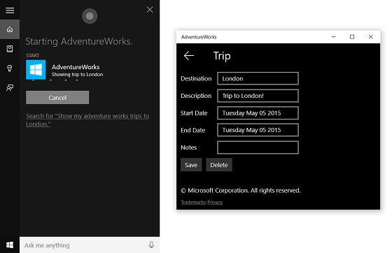

---
In addition to using voice commands within Cortana to access system features, you can also use voice commands through Cortana to launch a foreground app and specify an action or command to execute within the app.
Launch a foreground app with voice commands in Cortana
ms.assetid: 8D3D1F66-7D17-4DD1-B426-DCCBD534EF00
Cortana-Launch a foreground app
template: detail.hbs
---

# Launch a foreground app with voice commands in Cortana


\[ Updated for UWP apps on Windows 10. For Windows 8.x articles, see the [archive](http://go.microsoft.com/fwlink/p/?linkid=619132) \]


**Important APIs**

-   [**Windows.ApplicationModel.VoiceCommands**](https://msdn.microsoft.com/library/windows/apps/dn706594)
-   [**VCD elements and attributes v1.2**](https://msdn.microsoft.com/library/windows/apps/dn706593)

In addition to using voice commands within **Cortana** to access system features, you can also use voice commands through **Cortana** to launch a foreground app and specify an action or command to execute within the app.

**Note**  
A voice command is a single utterance with a specific intent, defined in a Voice Command Definition (VCD) file, directed at an installed app through **Cortana**.

A voice command definition can vary in complexity. It can support anything from a single, constrained utterance to a collection of more flexible, natural language utterances, all denoting the same intent.

A VCD file defines one or more voice commands, each with a unique intent.

The target app can be launched in the foreground (the app takes focus) or activated in the background (**Cortana** retains focus but provides results from the app), depending on the complexity of the interaction. For example, voice commands that require additional context or user input (such as sending a message to a specific contact) are best handled in a foreground app, while basic commands can be handled in **Cortana** through a background app.

 

We demonstrate these features here with a trip planning and management app named **Adventure Works**.

To create a new **Adventure Works** trip without **Cortana**, a user would launch the app and navigate to the **New trip** page. To view an existing trip, a user would launch the app, navigate to the **Upcoming trips** page, and select the trip.

Using voice commands through **Cortana**, the user can instead just say, "Adventure Works add a trip" or "Add a trip on Adventure Works" to launch the app and navigate to the **New trip** page. In turn, saying "Adventure Works, show my trip to London" will launch the app and navigate to the **Trip** detail page, shown here.



These are the basic steps to add voice-command functionality and integrate Cortana with your app using speech or keyboard input:

1.  Create a VCD file. This is an XML document that defines all the spoken commands that the user can say to initiate actions or invoke commands when activating your app. See [**VCD elements and attributes v1.2**](https://msdn.microsoft.com/library/windows/apps/dn706593).
2.  Register the command sets in the VCD file when the app is launched.
3.  Handle the activation-by-voice-command, navigation within the app, and execution of the command.

**Prerequisites:  **

If you're new to developing Universal Windows Platform (UWP) apps, have a look through these topics to get familiar with the technologies discussed here.

-   [Create your first app](https://msdn.microsoft.com/library/windows/apps/bg124288)
-   Learn about events with [Events and routed events overview](https://msdn.microsoft.com/library/windows/apps/mt185584)

**User experience guidelines:  **

See [Cortana design guidelines](https://msdn.microsoft.com/library/windows/apps/dn974233) for info about how to integrate your app with **Cortana** and [Speech design guidelines](https://msdn.microsoft.com/library/windows/apps/dn596121) for helpful tips on designing a useful and engaging speech-enabled app.

## <span id="Create_a_VCD_file"></span><span id="create_a_vcd_file"></span><span id="CREATE_A_VCD_FILE"></span>Create a VCD file


1.  In Microsoft Visual Studio, right-click the project name, select Add-&gt;New Item, and then select **XML File**.
2.  Type a name for the VCD file. For example, "AdventureWorksCommands.xml". Select **Add**.
3.  In **Solution Explorer**, select the VCD file.
4.  In the **Properties** window, set **Build action** to **Content**, and then set **Copy to output directory** to **Copy if newer**.

## <span id="Edit_the_VCD_file"></span><span id="edit_the_vcd_file"></span><span id="EDIT_THE_VCD_FILE"></span>Edit the VCD file


For each language supported by your app, create a **CommandSet** of voice commands that your app can handle.

Each **Command** declared in a VCD file must include this information:

-   A command Name used by the application to identify the voice command at runtime.
-   An **Example** element that contains a phrase describing how a user can invoke the command. **Cortana** shows this example when the user says "What can I say?", "Help", or they tap **See more**.

-   A **ListenFor** element that contains the words or phrases that your app recognizes to initiate a command. Each command needs to have at least one **ListenFor** element.
-   A **Feedback** element that contains the text for **Cortana** to display and speak as the application is launched.
-   A **Navigate** element to indicate that the voice command is to launch the app in the foreground. Specify a **VoiceCommandService** element if the voice command launches the app in the background instead. For more details, see [Launch a background app with voice commands in Cortana](launch-a-background-app-with-voice-commands-in-cortana.md).

For more detail, see the [**VCD elements and attributes v1.2**](https://msdn.microsoft.com/library/windows/apps/dn706593) reference.

You can specify multiple language versions for the commands used to activate your app and execute a command. You can create multiple **CommandSet** elements, each with a different **xml:lang** attribute to allow your app to be used in different markets. For example, an app for the United States might have a **CommandSet** for English and a **CommandSet** for Spanish.

**Caution**  
To activate an app and initiate an action using a voice command, the app must register a VCD file that contains a **CommandSet** with a language that matches the speech language that the user selected on their device. This language is set by the user on the device Settings &gt; System &gt; Speech &gt; Speech Language screen.

 

Here's a VCD file that defines a voice command for the **Adventure Works** app.

For this example, **CommandPrefix** is set to "Adventure Works", **Command**, identified by Name (" showTripToDestination"), specifies both what the user can say and what feedback is provided by Cortana, **ListenFor** specifies the text that can be recognized (with a reference to a **PhraseList** element that constrains the recognized destinations), **Navigate** indicates that the voice command is handled by launching the app in the foreground, and **Feedback** specifies what the user will hear when **Cortana** launches the app.

**ListenFor** elements cannot be programmatically modified. However, **PhraseList** elements associated with **ListenFor** elements can be programmatically modified. Applications should modify the content of the **PhraseList** at runtime based on the data set generated as the user uses the app. See [How to dynamically modify VCD phrase lists](https://msdn.microsoft.com/library/windows/apps/dn747872).

```xml
<?xml version="1.0" encoding="utf-8"?>
<VoiceCommands xmlns="http://schemas.microsoft.com/voicecommands/1.1">
  <CommandSet xml:lang="en-us" Name="AdventureWorksCommandSet_en-us">
    <AppName> Adventure Works </AppName>
    <Example> Show trip to London </Example>

    <Command Name="showTripToDestination">
      <Example> Show trip to London </Example>
      <ListenFor RequireAppName="BeforeOrAfterPhrase"> show [my] trip to {destination} </ListenFor>
      <ListenFor RequireAppName="ExplicitlySpecified"> show [my] {builtin:AppName} trip to {destination} </ListenFor>
      <Feedback> Showing trip to {destination} </Feedback>
      <Navigate />
    </Command>

    <PhraseList Label="destination">
      <Item> London </Item>
      <Item> Dallas </Item>
      <Item> New York </Item>
    </PhraseList>

    <PhraseTopic Label="newDestination" Scenario="Search">
      <Subject>City/State</Subject>
    </PhraseTopic>
  </CommandSet>

<!-- Other CommandSets for other languages -->

</VoiceCommands>
```

## <span id="Install_the_VCD_commands"></span><span id="install_the_vcd_commands"></span><span id="INSTALL_THE_VCD_COMMANDS"></span>Install the VCD commands


Your app must run once to install the command sets in the VCD.

When your app is activated, call [**InstallCommandDefinitionsFromStorageFileAsync**](https://msdn.microsoft.com/library/windows/apps/dn708205) in the [**OnLaunched**](https://msdn.microsoft.com/library/windows/apps/br242335) handler to register the commands that the system should listen for.

**Note**  If a device backup occurs and your app reinstalls automatically, voice command data is not preserved. To ensure the voice command data for your app stays intact, consider initializing your VCD file each time your app launches or activates, or store a setting that indicates if the VCD is currently installed and check the setting each time your app launches or activates.

 

Here's an example that shows how to install the commands specified by a VCD file (vcd.xml).

```CSharp
var storageFile = 
  await Windows.Storage.StorageFile.GetFileFromApplicationUriAsync(
    new Uri("ms-appx:///AdventureWorksCommands.xml"));
await 
  Windows.ApplicationModel.VoiceCommands.VoiceCommandDefinitionManager.
    InstallCommandDefinitionsFromStorageFileAsync(storageFile);
```

## <span id="Handle_activation_and_execute_voice_commands"></span><span id="handle_activation_and_execute_voice_commands"></span><span id="HANDLE_ACTIVATION_AND_EXECUTE_VOICE_COMMANDS"></span>Handle activation and execute voice commands


Once your app has been launched and the voice command sets installed, specify how your app responds to subsequent voice command activations. For example, your app might navigate to a specific page of content, display a map or other navigation utility, or speak a confirmation or status.

You need to:

1.  Confirm that your app was activated by a voice command.

    Override the [**Application.OnActivated**](https://msdn.microsoft.com/library/windows/apps/br242330) event and check whether [**IActivatedEventArgs**](https://msdn.microsoft.com/library/windows/apps/br224727).[**Kind**](https://msdn.microsoft.com/library/windows/apps/br224728) is [**VoiceCommand**](https://msdn.microsoft.com/library/windows/apps/br224693).

2.  Determine the name of the command and what was spoken.

    Get a reference to a [**VoiceCommandActivatedEventArgs**](https://msdn.microsoft.com/library/windows/apps/dn609755) object from the [**IActivatedEventArgs**](https://msdn.microsoft.com/library/windows/apps/br224727) and query the [**Result**](https://msdn.microsoft.com/library/windows/apps/dn609758) property for a [**SpeechRecognitionResult**](https://msdn.microsoft.com/library/windows/apps/dn631432) object.

    To determine what the user said, check the value of [**Text**](https://msdn.microsoft.com/library/windows/apps/dn631441) or the semantic properties of the recognized phrase in the [**SpeechRecognitionSemanticInterpretation**](https://msdn.microsoft.com/library/windows/apps/dn631443) dictionary.

3.  Take the appropriate action in your app, typically navigating to the relevant page.

For this example, we refer back to the VCD in Step 3: Edit the VCD file.

Once we get the speech-recognition result for the voice command, we get the command name from the first value in the [**RulePath**](https://msdn.microsoft.com/library/windows/apps/dn631438) array. As the VCD file defined more than one possible voice command, we need to compare the value against the command names in the VCD and take the appropriate action.

The most common action an application can take is to navigate to a page with content relevant to the context of the voice command. For this example, we navigate to a **TripPage** page and pass in the value of the voice command, how the command was input, and the recognized "destination" phrase (if applicable). Alternatively, the app could send a navigation parameter to the [**SpeechRecognitionResult**](https://msdn.microsoft.com/library/windows/apps/dn631432) when navigating to the page.

You can find out whether the voice command that launched your app was actually spoken, or whether it was typed in as text, from the [**SpeechRecognitionSemanticInterpretation.Properties**](https://msdn.microsoft.com/library/windows/apps/dn631445) dictionary using the **commandMode** key. The value of that key will be either "voice" or "text". If the value of the key is "voice", consider using speech synthesis ([**Windows.Media.SpeechSynthesis**](https://msdn.microsoft.com/library/windows/apps/dn278951)) to provide the user with spoken feedback.

Use the [**SpeechRecognitionSemanticInterpretation.Properties**](https://msdn.microsoft.com/library/windows/apps/dn631445) to find out the content spoken in the **PhraseList** or **PhraseTopic** constraints of a **ListenFor** element. The dictionary key is the value of the **Label** attribute of the **PhraseList** or **PhraseTopic** element. Here, we show how to access the value of **{destination}** phrase.

```CSS
protected override void OnActivated(IActivatedEventArgs e)
{
  // Was the app activated by a voice command?
  if (e.Kind != Windows.ApplicationModel.Activation.ActivationKind.VoiceCommand)
  {
    return;
  }

  var commandArgs = e as Windows.ApplicationModel.Activation.VoiceCommandActivatedEventArgs;

  Windows.ApplicationModel.VoiceCommands.VoiceCommand.SpeechRecognitionResult speechRecognitionResult = 
    commandArgs.Result;

  // Get the name of the voice command and the text spoken.
  string voiceCommandName = speechRecognitionResult.RulePath[0];
  string textSpoken = speechRecognitionResult.Text;
  // The commandMode is either "voice" or "text", and it indicates how the voice command was entered by the user.
  // Apps should respect "text" mode by providing feedback in a silent form.
  string commandMode = this.SemanticInterpretation("commandMode", speechRecognitionResult);

  switch (voiceCommandName)
  {
    case "showTripToDestination":
    // Access the value of the {destination} phrase in the voice command.
    string destination = speechRecognitionResult.SemanticInterpretation.Properties["destination"][0];
    // Create a navigation parameter string to pass to the page.
    navigationParameterString = string.Format("{0}|{1}|{2}|{3}", 
                    voiceCommandName, commandMode, textSpoken, destination);
    // Set the page where to navigate for this voice command.
    navigateToPageType = typeof(TripPage);
    break;

    default:
      // There is no match for the voice command name. Navigate to MainPage.
      navigateToPageType = typeof(MainPage);
      break;
  }
  if (this.rootFrame == null)
  {
    // App needs to create a new Frame, not shown
  }

  if (!this.rootFrame.Navigate(navigateToPageType, navigationParameterString))
    {
    throw new Exception("Failed to create voice command page");
    }
}
```

## <span id="related_topics"></span>Related articles


**Developers**
* [Cortana interactions](cortana-interactions.md)
* [Define custom recognition constraints](define-custom-recognition-constraints.md)
* [**VCD elements and attributes v1.2**](https://msdn.microsoft.com/library/windows/apps/dn706593)
**Designers**
* [Cortana design guidelines](https://msdn.microsoft.com/library/windows/apps/dn974233)
* [Speech design guidelines](https://msdn.microsoft.com/library/windows/apps/dn596121)
**Samples**
* [Cortana voice command sample](http://go.microsoft.com/fwlink/p/?LinkID=619899)
 

 


<!--HONumber=Mar16_HO1-->
