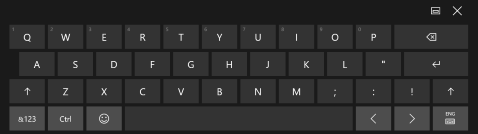
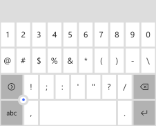
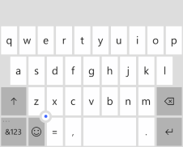

# <a name="use-input-scope-to-change-the-touch-keyboard"></a>Utiliser l’étendue des entrées pour modifier le clavier tactile
<link rel="stylesheet" href="https://az835927.vo.msecnd.net/sites/uwp/Resources/css/custom.css">

Pour faciliter la saisie de données par les utilisateurs au moyen du clavier tactile, ou panneau de saisie, définissez l’étendue des entrées du contrôle de texte pour qu’elle corresponde au type de données attendu de la part de l’utilisateur.

<div class="important-apis" >
<b>API importantes</b><br/>
<ul>
<li>[**InputScope**](https://msdn.microsoft.com/library/windows/apps/hh702632)</li>
<li>[**InputScopeNameValue**](https://msdn.microsoft.com/library/windows/apps/hh702028)</li>
</ul>
</div>


Le clavier tactile permet d’entrer du texte lorsque l’application est exécutée sur un appareil disposant d’un écran tactile. Le clavier tactile est appelé lorsque l’utilisateur appuie sur un champ d’entrée modifiable, tel qu’un élément [**TextBox**](https://msdn.microsoft.com/library/windows/apps/br209683) ou [**RichEditBox**](https://msdn.microsoft.com/library/windows/apps/br227548). Vous pouvez considérablement faciliter et accélérer la saisie de données par les utilisateurs dans votre application en définissant l’*étendue des entrées* du contrôle de texte afin qu’elle corresponde au type de données attendu de la part de l’utilisateur. L’étendue des entrées fournit au système une indication sur le type d’entrée de texte attendu par le contrôle, afin que le système puisse fournir une disposition de clavier tactile spécialisée pour le type d’entrée.

Par exemple, si une zone de texte est utilisée uniquement pour saisir un code confidentiel à 4 chiffres, définissez la propriété [**InputScope**](https://msdn.microsoft.com/library/windows/apps/hh702632) sur **Number**. Cela indique au système qu’il doit afficher la disposition du pavé numérique, ce qui facilite la saisie d’un code confidentiel par l’utilisateur.

> **Important**&nbsp;&nbsp;
- Ces informations s’appliquent uniquement au clavier virtuel. Elles ne concernent pas les claviers matériels ou visuels figurant dans les Options d’ergonomie de Windows.
- L’étendue des entrées n’entraîne l’exécution d’aucune validation des entrées et n’empêche pas l’utilisateur de saisir des données par le biais d’un clavier matériel ou d’un autre dispositif du même ordre. Vous restez responsable de la validation d’une entrée dans votre code, si nécessaire.

## <a name="changing-the-input-scope-of-a-text-control"></a>Modification de l’étendue des entrées d’un contrôle de texte

Les étendues d’entrées disponibles pour votre application appartiennent à l’énumération [**InputScopeNameValue**](https://msdn.microsoft.com/library/windows/apps/hh702028). Vous pouvez attribuer l’une de ces valeurs à la propriété **InputScope** d’un élément [**TextBox**](https://msdn.microsoft.com/library/windows/apps/br209683) ou [**RichEditBox**](https://msdn.microsoft.com/library/windows/apps/br227548).

> **Important**&nbsp;&nbsp;La propriété [**InputScope**](https://msdn.microsoft.com/library/windows/apps/dn996570) de l’élément [**PasswordBox**](https://msdn.microsoft.com/library/windows/apps/br227519) ne prend en charge que les valeurs **Password** et **NumericPin**. Toute autre valeur est ignorée.

Ici, vous modifiez l’étendue des entrées de plusieurs zones de texte afin qu’elle corresponde aux données attendues pour chaque zone de texte.

**Pour modifier l’étendue des entrées en XAML**

1.  Dans le fichier XAML de votre page, recherchez la balise correspondant au contrôle de texte que vous voulez modifier.
2.  Ajoutez l’attribut [**InputScope**](https://msdn.microsoft.com/library/windows/apps/hh702632) à la balise et spécifiez la valeur [**InputScopeNameValue**](https://msdn.microsoft.com/library/windows/apps/hh702028) qui correspond à l’entrée attendue.

    Voici certaines zones de texte pouvant apparaître dans un formulaire de contact client courant. Lorsque [**InputScope**](https://msdn.microsoft.com/library/windows/apps/hh702632) est défini, un clavier tactile dont la disposition est appropriée aux données s’affiche pour chaque zone de texte.

    ```xaml
    <StackPanel Width="300">
        <TextBox Header="Name" InputScope="Default"/>
        <TextBox Header="Email Address" InputScope="EmailSmtpAddress"/>
        <TextBox Header="Telephone Number" InputScope="TelephoneNumber"/>
        <TextBox Header="Web site" InputScope="Url"/>
    </StackPanel>
    ```

**Pour modifier l’étendue des entrées dans le code**

1.  Dans le fichier XAML de votre page, recherchez la balise correspondant au contrôle de texte que vous voulez modifier. Le cas échéant, définissez l’[attribut x:Name](https://msdn.microsoft.com/library/windows/apps/mt204788) de façon à pouvoir référencer le contrôle dans votre code.

    ```csharp
    <TextBox Header="Telephone Number" x:Name="phoneNumberTextBox"/>
    ```

2.  Instanciez un nouvel objet [**InputScope**](https://msdn.microsoft.com/library/windows/apps/hh702025).

    ```csharp
    InputScope scope = new InputScope();
    ```

3.  Instanciez un nouvel objet [**InputScopeName**](https://msdn.microsoft.com/library/windows/apps/hh702027).
    
    ```csharp
    InputScopeName scopeName = new InputScopeName();
    ```

4.  Définissez la propriété [**NameValue**](https://msdn.microsoft.com/library/windows/apps/hh702032) de l’objet [**InputScopeName**](https://msdn.microsoft.com/library/windows/apps/hh702027) sur une valeur de l’énumération [**InputScopeNameValue**](https://msdn.microsoft.com/library/windows/apps/hh702028).

    ```csharp
    scopeName.NameValue = InputScopeNameValue.TelephoneNumber;
    ```

5.  Ajoutez l’objet [**InputScopeName**](https://msdn.microsoft.com/library/windows/apps/hh702027) à la collection [**Names**](https://msdn.microsoft.com/library/windows/apps/hh702034) de l’objet [**InputScope**](https://msdn.microsoft.com/library/windows/apps/hh702025).

    ```csharp
    scope.Names.Add(scopeName);
    ```

6.  Définissez l’objet [**InputScope**](https://msdn.microsoft.com/library/windows/apps/hh702025) en tant que valeur de la propriété [**InputScope**](https://msdn.microsoft.com/library/windows/apps/hh702632) du contrôle de texte.

    ```csharp
    phoneNumberTextBox.InputScope = scope;
    ```

Voici le code dans son ensemble.

```CSharp
InputScope scope = new InputScope();
InputScopeName scopeName = new InputScopeName();
scopeName.NameValue = InputScopeNameValue.TelephoneNumber;
scope.Names.Add(scopeName);
phoneNumberTextBox.InputScope = scope;
```

Toutes ces étapes peuvent être regroupées dans ce code raccourci.

```CSharp
phoneNumberTextBox.InputScope = new InputScope() 
{
    Names = {new InputScopeName(InputScopeNameValue.TelephoneNumber)}
};
```

## <a name="text-prediction-spell-checking-and-auto-correction"></a>Prédiction de texte, vérification orthographique et correction automatique

Les contrôles [**TextBox**](https://msdn.microsoft.com/library/windows/apps/br209683) et [**RichEditBox**](https://msdn.microsoft.com/library/windows/apps/br227548) disposent de plusieurs propriétés influant sur le comportement du panneau de saisie. Pour fournir la meilleure expérience possible à vos utilisateurs, il est important de comprendre de quelle manière ces propriétés affectent la saisie tactile de texte.

-   [**IsSpellCheckEnabled**](https://msdn.microsoft.com/library/windows/apps/br209688) : lorsque la vérification orthographique est activée pour un contrôle de texte, le contrôle interagit avec le moteur de vérification orthographique du système pour signaler les mots qui ne sont pas reconnus. Vous pouvez appuyer sur un mot pour afficher une liste de suggestions de corrections. La vérification orthographique est activée par défaut.

    Pour l’étendue d’entrée **Default**, cette propriété permet également la mise en majuscules automatique du premier mot dans une phrase, ainsi que la correction automatique des mots au fur et à mesure de la saisie. Ces fonctionnalités de correction automatique peuvent être désactivées dans les autres zones d’entrées. Pour en savoir plus, consultez les tableaux présentés plus loin dans cette rubrique.

-   [**IsTextPredictionEnabled**](https://msdn.microsoft.com/library/windows/apps/br209690) : lorsque la prédiction de texte est activée pour un contrôle de texte, le système affiche une liste de mots susceptibles de correspondre à votre saisie. Vous pouvez sélectionner un élément dans la liste. Ainsi, vous n’avez pas besoin de saisir le mot entier. La prédiction de texte est activée par défaut.

    La prédiction de texte peut être désactivée si l’étendue des entrées est différente de **Default**, même si la propriété [**IsTextPredictionEnabled**](https://msdn.microsoft.com/library/windows/apps/br209690) présente la valeur **true**. Pour en savoir plus, consultez les tableaux présentés plus loin dans cette rubrique.

    **Remarque**&nbsp;&nbsp;Sur la famille d’appareils mobiles, les prédictions de texte et les corrections orthographiques s’affichent dans le panneau de saisie situé dans la zone au-dessus du clavier. Si l’élément [**IsTextPredictionEnabled**](https://msdn.microsoft.com/library/windows/apps/br209690) a pour valeur **false**, cette partie du panneau de saisie est masquée et la correction automatique est désactivée, même si l’élément [**IsSpellCheckEnabled**](https://msdn.microsoft.com/library/windows/apps/br209688) a pour valeur **true**.

-   [**PreventKeyboardDisplayOnProgrammaticFocus**](https://msdn.microsoft.com/library/windows/apps/dn299273) : définissez cette propriété sur **true** pour empêcher l’affichage du panneau de saisie quand le focus est défini par programme sur un contrôle de texte. Au lieu de cela, le clavier s’affiche uniquement lorsque l’utilisateur interagit avec le contrôle.

## <a name="touch-keyboard-index-for-windows-and-windows-phone"></a>Index de clavier tactile pour Windows et Windows Phone

Les tableaux suivants illustrent les différentes dispositions du panneau de saisie sur des appareils mobiles et de bureau pour les valeurs d’étendue d’entrées communes. L’effet de l’étendue des entrées sur les fonctionnalités activées par les propriétés **IsSpellCheckEnabled** et **IsTextPredictionEnabled** est répertorié pour chaque étendue des entrées. Cette liste des étendues des entrées disponibles n’est pas complète.

> **Remarque**&nbsp;&nbsp;Comme le panneau de saisie est plus petit sur les appareils mobiles, il est très important de définir une étendue des entrées appropriée aux applications mobiles. Comme vous le voyez ici, Windows Phone fournit une plus grande variété de dispositions de clavier spécialisées. Pour un champ de texte dont l’étendue des entrées n’a pas besoin d’être définie dans une application du Windows Store, il peut être avantageux de définir cette étendue dans une application du Windows Phone Store.

> **Conseil**&nbsp;&nbsp;Vous pouvez basculer la plupart des claviers tactiles entre une disposition alphabétique et une disposition numérique et symbolique. Sur Windows, activez la touche **&amp;123**. Sur Windows Phone, appuyez sur la touche **&amp; 123** pour adopter la disposition numérique et symbolique, et sur la touche **abcd** pour sélectionner la disposition alphabétique.

### <a name="default"></a>Par défaut

`<TextBox InputScope="Default"/>`

Clavier par défaut.

| Windows                                                    | Windows Phone                                                    |
|------------------------------------------------------------|------------------------------------------------------------------|
|  |  |

Disponibilité des fonctionnalités :

-   Vérification orthographique : activée si **IsSpellCheckEnabled** = **true** ; désactivée si **IsSpellCheckEnabled** = **false**.
-   Correction automatique : activée si **IsSpellCheckEnabled** = **true** ; désactivée si **IsSpellCheckEnabled** = **false**.
-   Mise en majuscule automatique : activée si **IsSpellCheckEnabled** = **true** ; désactivée si **IsSpellCheckEnabled** = **false**.
-   Prédiction de texte : activée si **IsTextPredictionEnabled** = **true** ; désactivée si **IsTextPredictionEnabled** = **false**.

### <a name="currencyamountandsymbol"></a>CurrencyAmountAndSymbol

`<TextBox InputScope="CurrencyAmountAndSymbol"/>`

Disposition de clavier numérique et symbolique par défaut

| Windows                                                    | Windows Phone                                                    |
|------------------------------------------------------------|------------------------------------------------------------------|
| <br>Inclut également les touches de page vers la gauche/droite pour afficher d’autres symboles.|  |
|Disponibilité des fonctionnalités :<ul><li>Vérification orthographique : activée par défaut ; peut être désactivée</li><li>Correction automatique : toujours désactivée</li><li>Mise en majuscules automatique : toujours désactivée</li><li>Prédiction de texte : toujours désactivée</li></ul>Identique à **Number** et **TelephoneNumber**. | Disponibilité des fonctionnalités :<ul><li>Vérification orthographique : sur par défaut, peut être désactivée</li><li>Vérification orthographique : activée par défaut ; peut être désactivée</li><li>Mise en majuscules automatique : toujours désactivée</li><li>Prédiction de texte : activée par défaut ; peut être désactivée</li>| 

### <a name="url"></a>URL

`<TextBox InputScope="Url"/>`

Inclut les touches **.com** et  (OK). Appuyez longuement sur la touche **.com** pour afficher des options supplémentaires (**.org**, **.net**, ainsi que les suffixes propres à une région).

| Windows                                                    | Windows Phone                                                    |
|------------------------------------------------------------|------------------------------------------------------------------|
| <br>Inclut également les touches **:**, **-** et **/**.| <br>Appuyez longuement sur la touche du point pour afficher des options supplémentaires ( - + &quot; / &amp; : , ). |
|Disponibilité des fonctionnalités :<ul><li>Vérification orthographique : sur par défaut, peut être désactivée</li><li>Vérification orthographique : activée par défaut ; peut être désactivée</li><li>Mise en majuscules automatique : toujours désactivée</li><li>Prédiction de texte : toujours désactivée</li></ul> | Disponibilité des fonctionnalités :<ul><li>Vérification orthographique : désactivée par défaut ; peut être activée</li><li>Correction automatique : désactivée par défaut ; peut être activée</li><li>Mise en majuscules automatique : désactivée par défaut ; peut être activée</li><li>Prédiction de texte : désactivée par défaut ; peut être activée</li></ul> |

### <a name="emailsmtpaddress"></a>EmailSmtpAddress

`<TextBox InputScope="EmailSmtpAddress"/>`

Inclut les touches **@** et **.com**. Appuyez longuement sur la touche **.com** pour afficher des options supplémentaires (**.org**, **.net**, ainsi que les suffixes propres à une région).

| Windows                                                    | Windows Phone                                                    |
|------------------------------------------------------------|------------------------------------------------------------------|
| <br>Inclut également les touches **_** et **-**.| <br>Appuyez longuement sur la touche du point pour afficher des options supplémentaires ( - _ , ; ). |
|Disponibilité des fonctionnalités :<ul><li>Vérification orthographique : sur par défaut, peut être désactivée</li><li>Vérification orthographique : activée par défaut ; peut être désactivée</li><li>Mise en majuscules automatique : toujours désactivée</li><li>Prédiction de texte : toujours désactivée</li></ul> | Disponibilité des fonctionnalités :<ul><li>Vérification orthographique : désactivée par défaut ; peut être activée</li><li>Correction automatique : désactivée par défaut ; peut être activée</li><li>Mise en majuscules automatique : désactivée par défaut ; peut être activée</li><li>Prédiction de texte : désactivée par défaut ; peut être activée</li></ul> |

### <a name="number"></a>Number

`<TextBox InputScope="Number"/>`

| Windows                                                    | Windows Phone                                                    |
|------------------------------------------------------------|------------------------------------------------------------------|
| | <br>Le clavier contient des chiffres et un symbole décimal. Appuyez longuement sur la touche du point pour afficher des options supplémentaires ( , - ). |
|Identique à **CurrencyAmountAndSymbol** et **TelephoneNumber**. | Disponibilité des fonctionnalités :<ul><li>Vérification orthographique : toujours désactivée</li><li>Correction automatique : toujours désactivée</li><li>Mise en majuscules automatique : toujours désactivée</li><li>Prédiction de texte : toujours désactivée</li></ul> |

### <a name="telephonenumber"></a>TelephoneNumber

`<TextBox InputScope="TelephoneNumber"/>`

| Windows                                                    | Windows Phone                                                    |
|------------------------------------------------------------|------------------------------------------------------------------|
| | <br>Le clavier simule le clavier d’un téléphone. Appuyez longuement sur la touche de période pour afficher des options supplémentaires ( , ( ) X . ). Appuyez longuement sur la touche 0 pour saisir +. |
|Identique à **CurrencyAmountAndSymbol** et **TelephoneNumber**. | Disponibilité des fonctionnalités :<ul><li>Vérification orthographique : toujours désactivée</li><li>Correction automatique : toujours désactivée</li><li>Mise en majuscules automatique : toujours désactivée</li><li>Prédiction de texte : toujours désactivée</li></ul> |

### <a name="search"></a>Recherche

`<TextBox InputScope="Search"/>`

Inclut la touche **Rechercher** plutôt que la touche **Entrée**.

| Windows                                                    | Windows Phone                                                    |
|------------------------------------------------------------|------------------------------------------------------------------|
| | |
|Disponibilité des fonctionnalités :<ul><li>Vérification orthographique : activée par défaut ; peut être désactivée</li><li>Correction automatique : toujours désactivée</li><li>Mise en majuscules automatique : toujours désactivée</li><li>Prédiction de texte : activée par défaut ; peut être désactivée</li></ul> | Disponibilité des fonctionnalités :<ul><li>Vérification orthographique : sur par défaut, peut être désactivée</li><li>Vérification orthographique : activée par défaut ; peut être désactivée</li><li>Mise en majuscules automatique : toujours désactivée</li><li>Prédiction de texte : activée par défaut ; peut être désactivée</li></ul> |

### <a name="searchincremental"></a>SearchIncremental

`<TextBox InputScope="SearchIncremental"/>`

| Windows                                                    | Windows Phone                                                    |
|------------------------------------------------------------|------------------------------------------------------------------|
| <br>Même disposition que **Default**.| |
|Disponibilité des fonctionnalités :<ul><li>Vérification orthographique : désactivée par défaut ; peut être activée</li><li>Correction automatique : toujours désactivée</li><li>Mise en majuscules automatique : toujours désactivée</li><li>Prédiction de texte : toujours désactivée</li></ul> | Identique à **Default**. |

### <a name="formula"></a>Formule

`<TextBox InputScope="Formula"/>`

Inclut la touche **=**.

| Windows                                                    | Windows Phone                                                    |
|------------------------------------------------------------|------------------------------------------------------------------|
| <br>Inclut également les touches **%**, **$** et **+**.| <br>Appuyez longuement sur la touche du point pour afficher des options supplémentaires (- ! ? , ). Appuyez longuement sur la touche **=** pour afficher des options supplémentaires ( ( ) : &lt;&gt; ). |
|Disponibilité des fonctionnalités :<ul><li>Vérification orthographique : désactivée par défaut ; peut être activée</li><li>Correction automatique : toujours désactivée</li><li>Mise en majuscules automatique : toujours désactivée</li><li>Prédiction de texte : toujours désactivée</li></ul> | Disponibilité des fonctionnalités :<ul><li>Vérification orthographique : sur par défaut, peut être désactivée</li><li>Vérification orthographique : activée par défaut ; peut être désactivée</li><li>Mise en majuscules automatique : toujours désactivée</li><li>Prédiction de texte : activée par défaut ; peut être désactivée</li></ul> |

### <a name="chat"></a>Conversation

`<TextBox InputScope="Chat"/>`

| Windows                                                    | Windows Phone                                                    |
|------------------------------------------------------------|------------------------------------------------------------------|
| <br>Même disposition que **Default**.| <br>Même disposition que **Default**.|
|Disponibilité des fonctionnalités :<ul><li>Vérification orthographique : désactivée par défaut ; peut être activée</li><li>Correction automatique : toujours désactivée</li><li>Mise en majuscules automatique : toujours désactivée</li><li>Prédiction de texte : toujours désactivée</li></ul> | Disponibilité des fonctionnalités :<ul><li>Vérification orthographique : sur par défaut, peut être désactivée</li><li>Vérification orthographique : activée par défaut ; peut être désactivée</li><li>Mise en majuscules automatique : activée par défaut ; peut être désactivée</li><li>Prédiction de texte : activée par défaut ; peut être désactivée</li></ul> |

### <a name="nameorphonenumber"></a>NameOrPhoneNumber

`<TextBox InputScope="NameOrPhoneNumber"/>`

| Windows                                                    | Windows Phone                                                    |
|------------------------------------------------------------|------------------------------------------------------------------|
| <br>Même disposition que **Default**.| <br>Inclut les touches **;** et **@**. La touche **&amp;123** est remplacée par la touche **123**, qui permet d’ouvrir le clavier du téléphone (voir **TelephoneNumber**).|
|Disponibilité des fonctionnalités :<ul><li>Vérification orthographique : activée par défaut ; peut être désactivée</li><li>Correction automatique : toujours désactivée</li><li>Mise en majuscules automatique : toujours activée</li><li>Prédiction de texte : toujours désactivée</li></ul> | Disponibilité des fonctionnalités :<ul><li>Vérification orthographique : désactivée par défaut ; peut être activée</li><li>Correction automatique : désactivée par défaut ; peut être activée</li><li>Mise en majuscules automatique : désactivée par défaut ; peut être activée La première lettre de chaque mot est en majuscule.</li><li>Prédiction de texte : désactivée par défaut ; peut être activée</li></ul> |


<!--HONumber=Dec16_HO3-->


