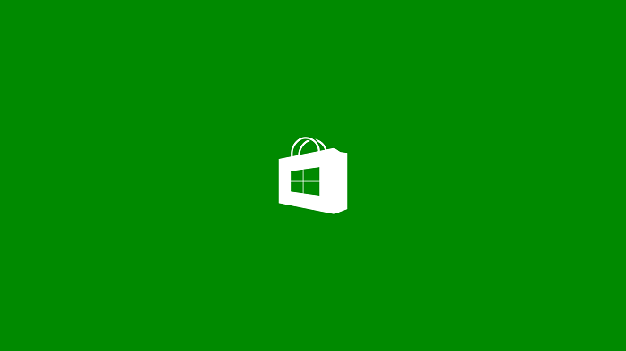

# Écrans de démarrage

Toutes les applications UWP doivent disposer d’un écran de démarrage comprenant une image et une couleur d’arrière-plan, que vous pouvez personnaliser.

Votre écran de démarrage s’affiche dès que l’utilisateur lance votre application. Il fournit des informations pendant que les ressources d’applications sont initialisées. Dès que votre application autorise l’interaction, l’écran de démarrage disparaît.

Un écran de démarrage bien conçu peut contribuer à rendre votre application plus attrayante. Voici un écran de démarrage simple et discret:

Cet écran de démarrage est créé en combinant une couleur d’arrière-plan verte à une imagePNG à arrière-plan transparent.

Une image simple avec une couleur d’arrière-plan s’affiche correctement, quel que soit l’appareil sur lequel votre application s’exécute. Seules les dimensions de l’arrière-plan sont modifiées pour prendre en charge différentes tailles d’écran. Votre image reste toujours intacte.

De plus, vous pouvez utiliser la classe [**SplashScreen**](https://msdn.microsoft.com/library/windows/apps/br224763) pour personnaliser l’expérience de démarrage de votre application. Vous pouvez placer un écran de démarrage étendu créé par vos propres soins, afin d’accorder à votre application davantage de temps pour effectuer des tâches supplémentaires telles que la préparation de l’interface utilisateur ou l’achèvement des opérations de mise en réseau. Vous pouvez également utiliser la classe **SplashScreen** pour vous avertir lorsque l’écran de démarrage est supprimé, ce qui vous permet de lancer les animations d’entrée.

| Rubrique | Description |
|-------|-------------|
| [Ajouter un écran de démarrage](add-a-splash-screen.md) | Définissez l’image et la couleur d’arrière-plan de l’écran de démarrage de votre application. |
| [Afficher un écran de démarrage plus longtemps](create-a-customized-splash-screen.md) | Affichez un écran de démarrage plus longtemps en créant et en affichant un écran de démarrage étendu pour votre application. Cet écran étendu imite l’écran de démarrage affiché quand votre application est lancée. Il peut être personnalisé. |