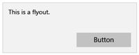

#  Command design basics for UWP apps

In a Universal Windows Platform (UWP) app, *command elements* are the interactive UI elements that enable the user to perform actions, such as sending an email, deleting an item, or submitting a form. This article describes the command elements, such as buttons and check boxes, the interactions they support, and the command surfaces (such as command bars and context menus) for hosting them.

## Provide the right type of interactions

When designing a command interface, the most important decision is choosing what users should be able to do. For example, if you're creating a photo app, the user will need tools to edit their photos. However, if you're creating a social media app that happens to display photos, image editing might not be a priority and so editing tools can be omitted to save space. Decide what you want users to accomplish and provide the tools to help them do it.

For recommendations about how to plan the right interactions for your app, see [Plan your app](https://msdn.microsoft.com/library/windows/apps/hh465427.aspx).

## Use the right command element for the interaction

Using the right elements for the right interactions can mean the difference between an app that feels intuitive to use and one that seems difficult or confusing. The Universal Windows Platform (UWP) provides a large set of command elements, in the form of controls, that you can use in your app. Here's a list of some of the most common controls and a summary of the interactions they enable.

| Category              | Elements                                                                                                                                                                                                            | Interaction                                                                                                                                        |
|-----------------------|---------------------------------------------------------------------------------------------------------------------------------------------------------------------------------------------------------------------|----------------------------------------------------------------------------------------------------------------------------------------------------|
| Buttons               | [Button](https://msdn.microsoft.com/library/windows/apps/hh465470)                                                                                                                                                     | Triggers an immediate action, such as sending an email, confirming an action in a dialog, submitting form data.                                    |
| Date and time pickers | [calendar date picker, calendar view, date picker, time picker](https://msdn.microsoft.com/library/windows/apps/hh465466)                                                                                                                 | Enables the user to view and modify date and time info, such as when entering a credit card expiration date or setting an alarm.                   |
| Lists                 | [drop-down list, list box, list view and grid view](https://msdn.microsoft.com/library/windows/apps/mt186889)                                                                                                                                              | Presents items in a interactive list or a grid. Use these elements to let users select a movie from a list of new releases or manage an inventory. |
| Predictive text entry | [Auto-suggest box](https://msdn.microsoft.com/library/windows/apps/dn997762)                                                                                                                                                                    | Saves users time when entering data or performing queries by providing suggestions as they type.                                                   |
| Selection controls    | [check box](https://msdn.microsoft.com/library/windows/apps/hh700393), [radio button](https://msdn.microsoft.com/library/windows/apps/hh700395), [toggle switch](https://msdn.microsoft.com/library/windows/apps/hh465475) | Lets the user choose between different options, such as when completing a survey or configuring app settings.                                      |

 

For a complete list, see [Controls and UI elements](https://dev.windows.com/design/controls-patterns)

##  Place commands on the right surface

You can place command elements on a number of surfaces in your app, including the app canvas (the content area of your app) or special command elements that can act as command containers, such as command bars, menus, dialogs, and flyouts. Here are some general recommendations for placing commands:

-   Whenever possible, let users directly manipulate the content on the app's canvas, rather than adding commands that act on the content. For example, in the travel app, let users rearrange their itinerary by dragging and dropping activities in a list on the canvas, rather than by selecting the activity and using Up or Down command buttons.
-   Otherwise, place commands on one of these UI surfaces if users can't manipulate content directly:

    -   In the [command bar](https://msdn.microsoft.com/library/windows/apps/hh465302): You should put most commands on the command bar, which helps to organize commands and makes them easy to access.
    -   On the app's canvas: If the user is on a page or view that has a single purpose, you can provide commands for that purpose directly on the canvas. There should be very few of these commands.
    -   In a [context menu](https://msdn.microsoft.com/library/windows/apps/hh465308): You can use context menus for clipboard actions (such as cut, copy, and paste), or for commands that apply to content that cannot be selected (like adding a push pin to a location on a map).

Here's a list of the command surfaces that Windows provides and recommendations for when to use them.

<table>
<colgroup>
<col width="50%" />
<col width="50%" />
</colgroup>
<thead>
<tr class="header">
<th align="left">Surface</th>
<th align="left">Description</th>
</tr>
</thead>
<tbody>
<tr class="odd">
<td align="left">App canvas (content area)

</td>
<td align="left">
If a command is critical and is constantly needed for the user to complete the core scenarios, put it on the canvas (the content area of your app). Because you can put commands near (or on) the objects they affect, putting commands on the canvas makes them easy and obvious to use.

However, choose the commands you put on the canvas carefully. Too many commands on the app canvas takes up valuable screen space and can overwhelm the user. If the command won't be frequently used, consider putting it in another command surface, such as menu or the command bar's &quot;More&quot; area.
</td>
</tr>
<tr class="even">
<td align="left">[Command bar](https://msdn.microsoft.com/library/windows/apps/hh465302)

</td>
<td align="left">
Command bars provide users with easy access to actions. You can use a command bar to show commands or options that are specific to the user's context, such as a photo selection or drawing mode.

Command bars can be placed at the top of the screen, at the bottom of the screen, or at both the top and bottom of the screen. This design of a photo editing app shows the content area and the command bar:

For more information about command bars, see the [Guidelines for command bar](https://msdn.microsoft.com/library/windows/apps/hh465302) article.
</td>
</tr>
<tr class="odd">
<td align="left">[Menus and context menus](../controls-and-patterns/dialogs-popups-menus.md)

</td>
<td align="left">
Sometimes it is more efficient to group multiple commands into a command menu. Menus let you present more options with less space. Menus can include interactive controls.

Context menus can provide shortcuts to commonly-used actions and provide access to secondary commands that are only relevant in certain contexts.

Context menus are for the following types of commands and command scenarios:

<ul>
<li>Contextual actions on text selections, such as Copy, Cut, Paste, Check Spelling, and so on.</li>
<li>Commands for an object that needs to be acted upon but that can't be selected or otherwise indicated.</li>
<li>Showing clipboard commands.</li>
<li>Custom commands.</li>
</ul>

This example shows the design for a subway app that uses a context menu to modify the route, bookmark a route, or select another train.

For more info about context menus, see the [Guidelines for context menu](https://msdn.microsoft.com/library/windows/apps/hh465308) article.
</td>
</tr>
<tr class="even">
<td align="left">[Dialog controls](../controls-and-patterns/dialogs-popups-menus.md)

</td>
<td align="left">
Dialogs are modal UI overlays that provide contextual app information. In most cases, dialogs block interactions with the app window until being explicitly dismissed, and often request some kind of action from the user.

Dialogs can be disruptive and should only be used in certain situations. For more info, see the [When to confirm or undo actions](#whentoconfirm) section.
</td>
</tr>
<tr class="odd">
<td align="left">[Flyout](../controls-and-patterns/dialogs-popups-menus.md)

</td>
<td align="left">
A lightweight contextual popup that displays UI related to what the user is doing. Use a flyout to:

<ul>
<li>Show a menu.</li>
<li>Show more detail about an item.</li>
<li>Ask the user to confirm an action without blocking interaction with the app.</li>
</ul>

Flyouts can be dismissed by tapping or clicking somewhere outside the flyout. For more info about flyout controls, see the [Dialogs, menus, and popups](../controls-and-patterns/dialogs-popups-menus.md) article.
</td>
</tr>
</tbody>
</table>

 

## When to confirm or undo actions

No matter how well-designed the user interface is and no matter how careful the user is, at some point, all users will perform an action they wish they hadn't. Your app can help in these situations by requiring the user to confirm an action, or by providing a way of undoing recent actions.

-   For actions that can't be undone and have major consequences, we recommend using a confirmation dialog. Examples of such actions include:
    -   Overwriting a file
    -   Not saving a file before closing
    -   Confirming permanent deletion of a file or data
    -   Making a purchase (unless the user opts out of requiring a confirmation)
    -   Submitting a form, such as signing up for something
-   For actions that can be undone, offering a simple undo command is usually enough. Examples of such actions include:
    -   Deleting a file
    -   Deleting an email (not permanently)
    -   Modifying content or editing text
    -   Renaming a file

**Tip**  Be careful of how much your app uses confirmation dialogs; they can be very helpful when the user makes a mistake, but they are a hindrance whenever the user is trying to perform an action intentionally.

 

##  Optimize for specific input types

See the [Interaction primer](../input-and-devices/input-primer.md) for more detail on optimizing user experiences around a specific input type or device.

 

 

<!--HONumber=Aug16_HO3-->

