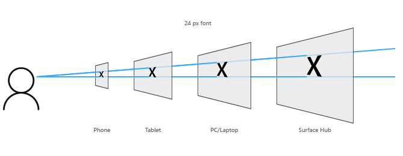

#  Présentation de la conception des applicationsUWP 

<link rel="stylesheet" href="https://az835927.vo.msecnd.net/sites/uwp/Resources/css/custom.css">

Une application de plateforme Windows universelle (UWP) peut s’exécuter sur tout appareil Windows, qu’il s’agisse de votre téléphone, de votre tablette ou de votre PC.

La conception d’une application qui s’affiche correctement sur autant d’appareils peut être un véritable défi. Comment concevoir une application offrant une expérience utilisateur hors du commun sur des appareils dont les tailles d’écrans et les méthodes d’entrée sont radicalement différentes? Fort heureusement, la plateforme universelle Windows fournit un ensemble de fonctionnalités et de blocs de construction universels intégrés qui vous aident à atteindre cet objectif. 

Cet article décrit les fonctionnalités de l’interface utilisateur et les avantages des applicationsUWP, et fournit des recommandations pour la création de votre première applicationUWP. Commençons par jeter un coup d’œil à certaines des fonctionnalités que vous obtenez lorsque vous créez une application UWP. 

## Fonctionnalités des applicationsUWP

### Pixels effectifs et mise à l’échelle

Les applicationsUWP ajustent automatiquement la taille des contrôles, des polices et des autres éléments d’interface utilisateur afin de se rendre accessibles sur l’ensemble des appareils.

Lorsque votre application est exécutée sur un appareil, le système utilise un algorithme afin de normaliser l’affichage à l’écran des éléments d’interface utilisateur. Cet algorithme de mise à l’échelle prend en compte la distance d’affichage et la densité de l’écran (en pixels par pouce) pour optimiser la taille perçue (plutôt que la taille physique). L’algorithme de mise à l’échelle garantit qu’une police de 24pixels sur un appareil Surface Hub placé à une distance de 3 mètres est aussi lisible pour l’utilisateur qu’une police de 24pixels sur un téléphone doté d’un écran 5pouces distant de quelques centimètres.

En raison du mode de fonctionnement du système de mise à l’échelle, lorsque vous concevez une application UWP, la conception est effectuée en *pixels effectifs* et non en pixels physiques réels. Quels en sont les effets sur la façon dont vous concevez vos applications?

-   Vous pouvez ignorer la densité de pixels et la résolution d’écran réelle lors de la conception. Effectuez plutôt une conception pour la résolution réelle (résolution en pixels effectifs) d’une classe de taille (pour plus d’informations, consultez l’[article Tailles d’écran et points d’arrêt](screen-sizes-and-breakpoints-for-responsive-design.md)).

-   Lorsque le système met à l’échelle l’interface utilisateur, il le fait par multiples de 4. Pour garantir une apparence nette, alignez vos conceptions sur la grille de pixels 4x4: faites des marges, des tailles et des positions des éléments d’interface utilisateur et de l’emplacement du texte (mais pas la taille, car le texte peut être de toute taille) un multiple de 4 pixels effectifs.

Cette illustration présente des éléments de conception alignés sur la grille de pixels 4x4. L’élément de conception a toujours des bords nets et vifs.

Cette illustration présente des éléments de conception non alignés sur la grille de pixels 4x4. Ces éléments de conception présenteront des bords flous et arrondis sur certains appareils.

> [!TIP]
> Lors de la création de maquettes d’écran dans des programmes d’édition d’image, définissez les PPP sur72 et les dimensions d’image sur la résolution réelle pour la classe de taille que vous ciblez. (Pour obtenir la liste des classes de taille et des résolutions réelles, voir la section [Recommandations pour des classes de taille spécifiques](#sizeclasses) de cet article.)

### Entrée universelle et interactions intelligentes

Parmi les autres fonctionnalités des applicationsUWP, citons l’entrée universelle prise en charge par les interactions intelligentes. Vous pouvez concevoir vos applications en fonction de modes d’entrée et d’appareils spécifiques, mais vous n’y êtes pas obligés. Pourquoi? Par défaut, les applicationsUWP reposent sur les interactions intelligentes. Cela signifie que vous pouvez concevoir une fonction sur la base d’une interaction de clic sans savoir nécessairement si le clic provient d’un clic de la souris ou d’une pression du doigt.

### Contrôles et styles universels

La plateforme UWP fournit également des blocs de construction utiles qui simplifient la conception d’applications pour plusieurs familles d’appareils.

-   **Contrôles universels**

    La plateforme UWP fournit un ensemble de contrôles universels dont le fonctionnement est garanti sur tous les appareils fonctionnant sous Windows. Cet ensemble de contrôles universels inclut tous les éléments, des contrôles de formulaire courants (comme la case d’option et la zone de texte) aux contrôles complexes, comme l’affichage Grille et l’affichage Liste, qui permettent de générer des listes d’éléments à partir d’un flux de données et d’un modèle. Ces contrôles sont liés à l’entrée et déployés avec l’ensemble de moyens d’entrée, d’états des événements et de fonctionnalités globales approprié à chaque famille d’appareils.

    Pour obtenir la liste complète de ces contrôles et des modèles que vous pouvez créer à partir de ceux-ci, consultez la section [Contrôles et modèles](https://dev.windows.com/design/controls-patterns).

-   **Styles universels**

    Votre application UWP obtient automatiquement un ensemble de styles par défaut, qui vous offre les fonctionnalités suivantes :

    -   Un ensemble de styles qui donne automatiquement à votre application un thème clair ou sombre (selon votre choix) et qui peut inclure la préférence de couleur d’accentuation de l’utilisateur.

        

    -   Une gamme de types Segoe qui garantit la netteté du texte de l’application sur tous les appareils.
    -   Des animations par défaut pour les interactions.
    -   La prise en charge automatique des modes de contraste élevé. Nos styles ont été conçus de manière à répondre aux contraintes de contraste élevé, ce qui permet à votre application de s’afficher correctement lorsqu’elle s’exécute sur un appareil en mode de contraste élevé.
    -   La prise en charge automatique d’autres langues. Nos styles par défaut sélectionnent automatiquement la police adéquate pour chaque langue prise en charge par Windows. Vous pouvez même utiliser plusieurs langues dans la même application, qui s’afficheront correctement.
    -   La prise en charge intégrée de l’ordre de lecture de droite à gauche.

    Vous pouvez personnaliser ces styles par défaut pour apporter une touche personnelle à votre application, ou vous pouvez les remplacer intégralement par les vôtres pour offrir une expérience visuelle unique. Voici un exemple de conception d’une application météo avec un style visuel unique:

    

Maintenant que nous avons décrit les blocs de construction des applicationsUWP, voyons comment les assembler pour créer une interface utilisateur. 
    
## Anatomie d’une applicationUWP typique

Une interface utilisateur moderne est un mécanisme complexe, qui inclut du texte, des formes, des couleurs et des animations, lesquelles sont constituées des pixels de l’écran de l’appareil que vous utilisez. Lorsque vous démarrez la conception d’une interface utilisateur, le nombre d’options disponibles peut être accablant.

Pour simplifier les choses, nous allons définir l’anatomie d’une application d’un point de vue conceptuel. Disons qu’une application se compose d’écrans et de pages. Chaque page possède une interface utilisateur composée de troistypes d’élément d’interface utilisateur: éléments de navigation, de commande et de contenu.

<table class="uwpd-noborder" >
<colgroup>
<col width="50%" />
<col width="50%" />
</colgroup>
<tbody>
<tr class="odd">
<td align="left">

</td>
<td align="left"><strong>Éléments de navigation</strong>

Les éléments de navigation permettent aux utilisateurs de choisir le contenu à afficher. Les éléments de navigation incluent les [onglets et pivots](../controls-and-patterns/tabs-pivot.md), les [liens hypertexte](../controls-and-patterns/hyperlinks.md) et les [volets de navigation](../controls-and-patterns/nav-pane.md).

Les éléments de navigation sont traités en détail dans l’article [Informations de base relatives à la conception de la navigation](navigation-basics.md).

<strong>Éléments de commande</strong>

Les éléments de commande permettent d’initier des actions (de manipulation, d’enregistrement ou de partage de contenu, par exemple). Les éléments de commande incluent les [boutons](../controls-and-patterns/buttons.md) et la [barre de commandes](../controls-and-patterns/app-bars.md). Les éléments de commande peuvent également inclure des raccourcis clavier qui ne sont pas visibles à l’écran.

Les éléments de commande sont traités en détail dans l’article [Informations de base relatives à la conception des commandes](commanding-basics.md).

<strong>Éléments de contenu</strong>

Les éléments de contenu affichent le contenu de l’application. Pour une application de peinture, ce contenu peut correspondre à un dessin; pour une application d’actualités, il peut s’agir d’un article de presse.

Les éléments de contenu sont traités en détail dans l’article [Informations de base relatives à la conception du contenu](content-basics.md).
</td>
</tr>
</tbody>
</table>

 

Au minimum, une application inclut un écran de démarrage et une page d’accueil, qui définit l’interface utilisateur. Une application classique possède plusieurs pages et écrans; les éléments de contenu, de navigation et de commande peuvent changer d’une page à l’autre.

Lorsque vous choisissez les éléments d’interface utilisateur appropriés pour votre application, vous devez également tenir compte des appareils et de la taille des écrans sur lesquels vous l’exécuterez.

## Personnalisation de votre application pour des appareils et des tailles d’écrans spécifiques.

Les applications UWP utilisent les pixels effectifs pour garantir la lisibilité et la convivialité de vos éléments de conception sur tous les appareils Windows. Dès lors, pourquoi souhaiteriez-vous personnaliser l’interface utilisateur de votre application pour une famille d’appareils spécifique?

**Remarque**  
Avant d’aller plus loin, Windows ne permet pas à votre application de détecter l’appareil spécifique sur lequel elle s’exécute. Le système peut vous indiquer la famille d’appareils (mobile, ordinateur, etc.) sur laquelle l’application s’exécute, la résolution réelle et la quantité d’espace à l’écran disponible pour l’application (la taille de la fenêtre de l’application).

 

-   **Pour tirer le meilleur parti de l’espace et limiter la navigation**

    Si vous concevez une application pour qu’elle ait une apparence appropriée sur un appareil doté d’un petit écran, par exemple un téléphone, l’application pourra être utilisée sur un PC équipé d’un écran beaucoup plus grand, mais de l’espace sera probablement inutilisé. Vous pouvez personnaliser l’application pour afficher davantage de contenu lorsque la taille de l’écran est supérieure à une certaine valeur. Par exemple, une application d’achat peut afficher une catégorie de marchandise à la fois sur un téléphone, mais afficher simultanément plusieurs catégories et produits sur un PC ou un ordinateur portable.

    En plaçant plus de contenu à l’écran, vous réduisez les étapes de navigation que l’utilisateur doit effectuer.

-   **Pour tirer parti des fonctionnalités des appareils**

    Certains appareils sont plus susceptibles d’être dotés de fonctionnalités particulières. Par exemple, les téléphones sont susceptibles d’être équipés d’un capteur d’emplacement et d’un appareil photo, contrairement à un PC. Votre application peut détecter les fonctionnalités qui sont disponibles et les activer.

-   **Pour optimiser les entrées**

    La bibliothèque de contrôles universels fonctionne avec tous les types d’entrée (tactile, stylet, clavier, souris), mais vous pouvez toujours optimiser certains types d’entrée en réorganisant vos éléments d’interface utilisateur. Par exemple, si vous placez des éléments de navigation en bas de l’écran, ils seront plus facilement accessibles aux utilisateurs de téléphone, mais la plupart des utilisateurs de PC s’attendent à voir des éléments de navigation en haut de l’écran.

## Techniques de conception réactive

Lorsque vous optimisez l’interface utilisateur de votre application pour des largeurs d’écran spécifiques, nous disons que vous créez une conception réactive. Voici sixtechniques de conception réactive que vous pouvez utiliser pour personnaliser l’interface utilisateur de votre application.

### Repositionner

Vous pouvez modifier l’emplacement et la position des éléments de l’interface utilisateur de l’application pour tirer le meilleur parti de chaque appareil. Dans cet exemple, le mode portrait sur un téléphone ou une phablette nécessite une interface utilisateur de défilement, car une seule trame complète est visible à la fois. Lorsque l’application translate vers un appareil qui autorise deux trames complètes à l’écran, la trame B peut occuper un espace dédié que ce soit en orientation portrait ou paysage. Si vous utilisez une grille de positionnement, vous pouvez utiliser cette même grille lorsque des éléments d’interface utilisateur sont repositionnés.

Dans cet exemple de conception pour une application de photos, l’application repositionne son contenu sur des écrans plus grands.

### Redimensionner

Vous pouvez optimiser la taille de la trame en ajustant les marges et la taille des éléments de l’interface utilisateur. Cela peut vous permettre, comme dans l’exemple indiqué ici, d’enrichir l’expérience de lecture sur un écran plus grand en augmentant simplement le cadre de contenu.

### Ajuster dynamiquement

En modifiant le flux des éléments de l’interface utilisateur en fonction de l’appareil et de l’orientation, votre application peut offrir un affichage de contenu optimal. Par exemple, lors du passage à un écran plus grand, il peut être judicieux d’activer des conteneurs plus grands, d’ajouter des colonnes et de générer des éléments de liste d’une manière différente.

Cet exemple indique comment une colonne unique de contenu à défilement vertical sur un téléphone ou une phablette peut être réorganisée sur un écran plus grand pour afficher deux colonnes de texte.

###  Révéler

Vous pouvez révéler l’interface utilisateur en fonction de l’espace disponible à l’écran, ou lorsque l’appareil prend en charge des fonctionnalités supplémentaires, des situations spécifiques ou des orientations d’écran favorites.

Dans cet exemple présentant des onglets, l’onglet du milieu contenant l’icône d’appareil photo peut être propre à l’application d’un téléphone ou d’une phablette et ne pas s’appliquer à des appareils plus grands, raison pour laquelle il est révélé dans l’appareil à droite. Un autre exemple courant de révélation ou de masquage de l’interface utilisateur s’applique aux contrôles de lecteur multimédia, où le bouton défini est réduit sur de petits appareils et développé sur des appareils plus grands. Le lecteur multimédia sur PC, par exemple, peut gérer beaucoup plus de fonctionnalités à l’écran que sur un téléphone.

Une partie de la technique de révélation ou de masquage comprend le choix de l’affichage des métadonnées. Lorsque l’espace est limité, comme sur un téléphone ou une phablette, il est préférable d’afficher une quantité minimale de métadonnées. Sur un PC ou un ordinateur portable, une quantité importante de métadonnées peut être exposée. Voici quelques exemples de traitement du masquage ou de l’affichage des métadonnées :

-   Dans une application de messagerie, vous pouvez afficher l’avatar de l’utilisateur.
-   Dans une application de musique, vous pouvez afficher davantage d’informations sur un album ou un artiste.
-   Dans une application vidéo, vous pouvez afficher plus d’informations sur un film ou une émission, en présentant par exemple des détails sur la distribution et l’équipe technique.
-   Dans n’importe quelle application, vous pouvez décomposer les colonnes et révéler plus de détails.
-   Dans n’importe quelle application, vous pouvez disposer un élément à l’horizontal alors qu’il était empilé verticalement. Lorsque vous passez d’un téléphone ou d’une phablette à un appareil plus grand, les éléments de liste empilés peuvent changer pour faire apparaître des lignes d’éléments de liste et des colonnes de métadonnées.

### Remplacer

Cette technique vous permet de changer d’interface utilisateur en fonction de la classe de taille ou de l’orientation de l’appareil. Dans cet exemple, le volet de navigation et son interface utilisateur compacte et temporaire fonctionnent bien pour un petit appareil, mais des onglets peuvent être mieux appropriés pour un appareil plus grand.

###  Remodéliser

Vous pouvez réduire ou répliquer l’architecture de votre application pour mieux cibler des appareils spécifiques. Dans cet exemple, la jonction des pages est montrée de l’appareil de gauche à l’appareil de droite.

Voici un exemple de cette technique appliquée à la conception d’une application domestique intelligente.

## Articles connexes

- [Qu’est-ce qu’une application UWP?](https://msdn.microsoft.com/library/windows/apps/dn726767.aspx)

 

