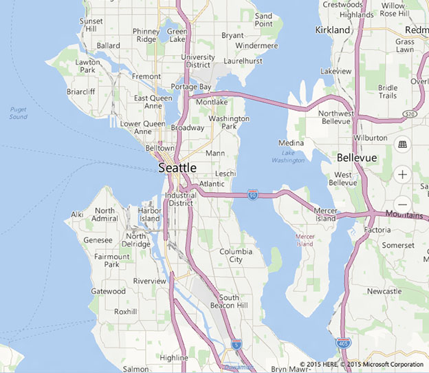
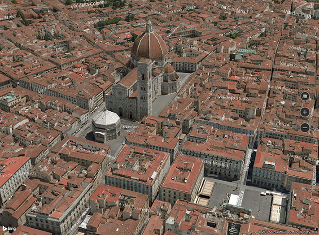

# Contrôle de carte

\[ Article mis à jour pour les applications UWP sur Windows 10. Pour les articles sur Windows 8.x, voir l’[archive](http://go.microsoft.com/fwlink/p/?linkid=619132) \]

Le contrôle de carte peut afficher des cartes routières, des vues aériennes, des affichages 3D, des itinéraires, des résultats de recherche et des informations sur la circulation. Sur une carte, vous pouvez afficher l’emplacement, les itinéraires et les centres d’intérêt de l’utilisateur. Une carte peut également afficher des vues 3D aériennes, des vues Streetside, le trafic, les transports publics et les entreprises locales.

## Est-ce le contrôle approprié ?

Utilisez un contrôle de carte si vous souhaitez insérer une carte dans votre application, qui permette aux utilisateurs d’afficher des informations géographiques propres à l’application ou générales. Si votre application contient un contrôle de carte, les utilisateurs ne devront pas sortir de votre application pour accéder à ces informations.

**Remarque** Si vous ne voyez pas d’inconvénient à ce que les utilisateurs sortent de votre application, envisagez d’utiliser l’application Cartes Windows pour fournir ces informations. Votre application peut lancer l’application Cartes Windows pour afficher des cartes, des itinéraires et des résultats de recherche spécifiques. Pour plus d’informations, voir [Lancer l’application Cartes Windows](https://msdn.microsoft.com/library/windows/apps/mt228341).

## Exemples

Cet exemple montre une carte avec une vue Streetside :

 

Cet exemple montre une carte avec une vue 3D aérienne :

 

Cet exemple montre une application avec une vue 3D aérienne et une vue Streetside :

## Recommandations

-   Utilisez un espace écran ample (ou l’écran entier) pour afficher la carte de façon à ce que les utilisateurs n’aient pas à faire défiler ou à zoomer excessivement pour afficher des informations géographiques.

-   Si la carte est utilisée uniquement pour présenter une vue statique et informative, l’utilisation d’une carte plus petite peut être plus appropriée. Si vous optez pour une carte statique plus petite, basez ses dimensions sur la facilité d’utilisation : elle doit être suffisamment petite pour préserver l’espace disponible à l’écran, mais suffisamment grande pour rester lisible.

-   Incorporez les centres d’intérêt dans la carte à l’aide de la propriété [**map elements**](https://msdn.microsoft.com/library/windows/apps/dn637034). Des informations supplémentaires éventuelles peuvent être présentées dans une interface utilisateur temporairement superposée à la carte.

## Rubriques connexes

* [Afficher des cartes avec des vues 2D, 3D et Streetside](https://msdn.microsoft.com/library/windows/apps/mt219695)
* [Afficher des centres d’intérêt sur une carte](https://msdn.microsoft.com/library/windows/apps/mt219696)
* [Centre de développement Bing Cartes](https://www.bingmapsportal.com/)
* [Exemple de carte UWP](http://go.microsoft.com/fwlink/p/?LinkId=619977)
* [//vidéos de la build 2015 : utilisation de cartes et de localisation sur un téléphone, une tablette et un PC dans vos applications Windows](https://channel9.msdn.com/Events/Build/2015/2-757)
* [Lancer l’application Cartes Windows](https://msdn.microsoft.com/library/windows/apps/mt228341)
 

 

<!--HONumber=Jun16_HO4-->

