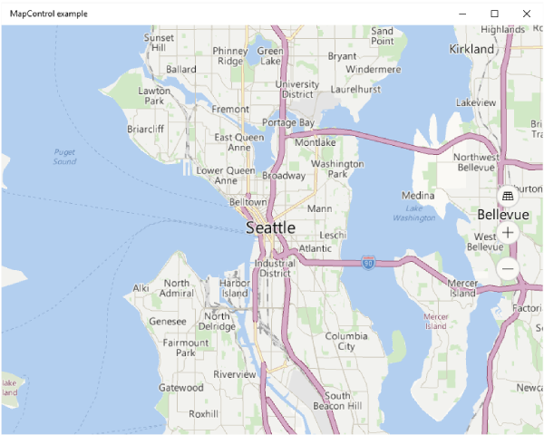

# <a name="display-maps-with-2d-3d-and-streetside-views"></a>Afficher des cartes avec des vues 2D, 3D et Streetside

Vous pouvez afficher une carte dans une fenêtre pouvant faire l'objet d'un abandon interactif, appelée carte *placecard* ou dans un contrôle de carte complet.

Télécharger l'[exemple de carte](http://go.microsoft.com/fwlink/p/?LinkId=619977) afin de tester certaines des fonctionnalités décrites dans ce guide.

<a id="placecard" />

## <a name="display-map-in-a-placecard"></a>Afficher le plan dans une carte d’emplacement
Vous pouvez fournir une carte s'affichant dans une fenêtre contextuelle légère au-dessus, en dessous ou en regard de l'élément d'interface utilisateur ou d'une zone d'une app que l'utilisateur aura touchée. La carte peut indiquer une ville ou une adresse ayant trait aux informations contenues dans votre app.  

Cette carte d’emplacement affiche la ville de Seattle.


Voici le code qui permet d'afficher la ville de Seattle dans une carte d’emplacement située en dessous d'un bouton.

```csharp
private void Seattle_Click(object sender, RoutedEventArgs e)
{
    Geopoint seattlePoint = new Geopoint
        (new BasicGeoposition { Latitude = 47.6062, Longitude = -122.3321 });

    PlaceInfo spaceNeedlePlace = PlaceInfo.Create(seattlePoint);

    FrameworkElement targetElement = (FrameworkElement)sender;

    GeneralTransform generalTransform =
        targetElement.TransformToVisual((FrameworkElement)targetElement.Parent);

    Rect rectangle = generalTransform.TransformBounds(new Rect(new Point
        (targetElement.Margin.Left, targetElement.Margin.Top), targetElement.RenderSize));

    spaceNeedlePlace.Show(rectangle, Windows.UI.Popups.Placement.Below);
}
```

Cette carte d’emplacement indique l’emplacement de la Space Needle de Seattle.


Voici le code qui permet d'afficher la Space Needle dans une carte d’emplacement située en dessous d'un bouton.

```csharp
private void SpaceNeedle_Click(object sender, RoutedEventArgs e)
{
    Geopoint spaceNeedlePoint = new Geopoint
        (new BasicGeoposition { Latitude = 47.6205, Longitude = -122.3493 });

    PlaceInfoCreateOptions options = new PlaceInfoCreateOptions();

    options.DisplayAddress = "400 Broad St, Seattle, WA 98109";
    options.DisplayName = "Seattle Space Needle";

    PlaceInfo spaceNeedlePlace =  PlaceInfo.Create(spaceNeedlePoint, options);

    FrameworkElement targetElement = (FrameworkElement)sender;

    GeneralTransform generalTransform =
        targetElement.TransformToVisual((FrameworkElement)targetElement.Parent);

    Rect rectangle = generalTransform.TransformBounds(new Rect(new Point
        (targetElement.Margin.Left, targetElement.Margin.Top), targetElement.RenderSize));

    spaceNeedlePlace.Show(rectangle, Windows.UI.Popups.Placement.Below);
}
```

<a id="map-control" />

## <a name="display-map-in-a-control"></a>Afficher le plan dans un contrôle

Utilisez un contrôle de carte pour afficher les données de carte enrichies et personnalisables dans votre app. Un contrôle de carte peut afficher des cartes routières, des vues aériennes, des affichages 3D, des itinéraires, des résultats de recherche et des informations sur la circulation. Sur une carte, vous pouvez afficher l’emplacement, les itinéraires et les centres d’intérêt de l’utilisateur. Une carte peut également afficher des vues 3D aériennes, des vues Streetside, le trafic, les transports publics et les entreprises locales.

Utilisez un contrôle de carte si vous souhaitez insérer dans votre application une carte permettant aux utilisateurs de visualiser des informations géographiques propres à l’application ou générales. Si votre application contient un contrôle de carte, les utilisateurs n’auront pas à sortir de votre application pour accéder à ces informations.

> [!NOTE]
>Si vous ne voyez pas d’inconvénient à ce que les utilisateurs sortent de votre application, envisagez d’utiliser l’application Cartes Windows pour fournir ces informations. Votre application peut lancer l’application Cartes Windows pour afficher des cartes, des itinéraires et des résultats de recherche spécifiques. Pour plus d’informations, voir [Lancer l’app CartesWindows](https://msdn.microsoft.com/library/windows/apps/mt228341).

### <a name="add-a-map-control-to-your-app"></a>Ajoutez un contrôle de carte à votre app

Affichez une carte sur une page XAML en ajoutant un élément [**MapControl**](https://msdn.microsoft.com/library/windows/apps/dn637004). Pour utiliser le **MapControl**, vous devez déclarer les espace de noms [**Windows.UI.Xaml.Controls.Maps**](https://msdn.microsoft.com/library/windows/apps/dn610751) dans la page XAML ou dans votre code. Si vous faites glisser le contrôle à partir de la boîte à outils, cette déclaration d’espace de noms est ajoutée automatiquement. Si vous ajoutez manuellement le **MapControl** à la page XAML, vous devez également ajouter manuellement la déclaration d’espace de noms en haut de la page.

L’exemple suivant affiche un contrôle de carte de base et configure la carte pour afficher les contrôles de zoom et d’inclinaison en plus de l’acceptation des entrées tactiles.

```xml
<Page
    x:Class="MapsAndLocation1.DisplayMaps"
    xmlns="http://schemas.microsoft.com/winfx/2006/xaml/presentation"
    xmlns:x="http://schemas.microsoft.com/winfx/2006/xaml"
    xmlns:local="using:MapsAndLocation1"
    xmlns:d="http://schemas.microsoft.com/expression/blend/2008"
    xmlns:mc="http://schemas.openxmlformats.org/markup-compatibility/2006"
    xmlns:Maps="using:Windows.UI.Xaml.Controls.Maps"
    mc:Ignorable="d">

 <Grid x:Name="pageGrid" Background="{ThemeResource ApplicationPageBackgroundThemeBrush}">

    <Maps:MapControl
       x:Name="MapControl1"            
       ZoomInteractionMode="GestureAndControl"
       TiltInteractionMode="GestureAndControl"   
       MapServiceToken="EnterYourAuthenticationKeyHere"/>

 </Grid>
</Page>
```

Si vous ajoutez le contrôle de carte dans votre code, vous devez déclarer manuellement l’espace de noms en haut du fichier de code.

```csharp
using Windows.UI.Xaml.Controls.Maps;
...

// Add the MapControl and the specify maps authentication key.
MapControl MapControl2 = new MapControl();
MapControl2.ZoomInteractionMode = MapInteractionMode.GestureAndControl;
MapControl2.TiltInteractionMode = MapInteractionMode.GestureAndControl;
MapControl2.MapServiceToken = "EnterYourAuthenticationKeyHere";
pageGrid.Children.Add(MapControl2);
```

### <a name="get-and-set-a-maps-authentication-key"></a>Demander et définir une clé d’authentification de cartes

Avant d’utiliser les services de carte et [**MapControl**](https://msdn.microsoft.com/library/windows/apps/dn637004), vous devez spécifier la clé d’authentification de cartes en tant que valeur de la propriété [**MapServiceToken**](https://msdn.microsoft.com/library/windows/apps/dn637036). Dans les exemples précédents, remplacez `EnterYourAuthenticationKeyHere` par la clé que vous recevez du [Centre de développement Bing Cartes](https://www.bingmapsportal.com/). Le texte **Avertissement : MapServiceToken non spécifié** continue d’apparaître sous le contrôle jusqu’à ce que vous spécifiiez la clé d’authentification de cartes. Pour plus d’informations sur l’obtention et la définition d’une clé d’authentification de cartes, voir [Demander une clé d’authentification de cartes](authentication-key.md).

## <a name="set-the-location-of-a-map"></a>Définir l’emplacement d'une carte
Pointer la carte vers l'emplacement de votre choix ou utilisez l'emplacement actuel de l'utilisateur.  

### <a name="set-a-starting-location-for-the-map"></a>Définir un emplacement de départ pour la carte

Définissez l’emplacement à afficher sur la carte en spécifiant la propriété [**Center**](https://msdn.microsoft.com/library/windows/apps/dn637005) du [**MapControl**](https://msdn.microsoft.com/library/windows/apps/dn637004) dans votre code, ou en liant la propriété dans votre balisage XAML. L’exemple ci-après représente une carte centrée sur la ville de Seattle, aux États-Unis.

> [!NOTE]
> Dans la mesure où une chaîne ne peut pas être convertie en valeur [**Geopoint**](https://msdn.microsoft.com/library/windows/apps/dn263675), vous ne pouvez pas spécifier de valeur pour la propriété [**Center**](https://msdn.microsoft.com/library/windows/apps/dn637005) dans le balisage XAML, sauf si vous utilisez la fonction de liaison de données. (Cette limitation s’applique également à la propriété [**MapControl.Location**](https://msdn.microsoft.com/library/windows/apps/dn653264) jointe.)

 
```csharp
protected override void OnNavigatedTo(NavigationEventArgs e)
{
   // Specify a known location.
   BasicGeoposition cityPosition = new BasicGeoposition() { Latitude = 47.604, Longitude = -122.329 };
   Geopoint cityCenter = new Geopoint(cityPosition);

   // Set the map location.
   MapControl1.Center = cityCenter;
   MapControl1.ZoomLevel = 12;
   MapControl1.LandmarksVisible = true;
}
```



### <a name="set-the-current-location-of-the-map"></a>Définir l’emplacement actuel de la carte

Avant d’accéder à l’emplacement de l’utilisateur, votre application doit appeler la méthode [**RequestAccessAsync**](https://msdn.microsoft.com/library/windows/apps/dn859152). À ce stade, votre application doit être au premier plan et l’élément **RequestAccessAsync** doit être appelé à partir du thread d’interface utilisateur. Jusqu’à ce que l’utilisateur l’y autorise, votre application ne peut pas accéder aux données d’emplacement.

Utilisez la méthode [**GetGeopositionAsync**](https://msdn.microsoft.com/library/windows/apps/hh973536) de la classe [**Geolocator**](https://msdn.microsoft.com/library/windows/apps/br225534) pour obtenir l’emplacement actuel de l’appareil (si la localisation est disponible). Pour obtenir le [**Geopoint**](https://msdn.microsoft.com/library/windows/apps/dn263675) correspondant, utilisez la propriété [**Point**](https://msdn.microsoft.com/library/windows/apps/dn263665) des coordonnées longitudinale et latitudinale de la position géographique. Pour plus d’informations, voir [Obtenir l’emplacement actuel](get-location.md).

```csharp
// Set your current location.
var accessStatus = await Geolocator.RequestAccessAsync();
switch (accessStatus)
{
   case GeolocationAccessStatus.Allowed:

      // Get the current location.
      Geolocator geolocator = new Geolocator();
      Geoposition pos = await geolocator.GetGeopositionAsync();
      Geopoint myLocation = pos.Coordinate.Point;

      // Set the map location.
      MapControl1.Center = myLocation;
      MapControl1.ZoomLevel = 12;
      MapControl1.LandmarksVisible = true;
      break;

   case GeolocationAccessStatus.Denied:
      // Handle the case  if access to location is denied.
      break;

   case GeolocationAccessStatus.Unspecified:
      // Handle the case if  an unspecified error occurs.
      break;
}
```

Lorsque vous affichez l’emplacement de votre appareil sur une carte, songez à afficher les graphiques et à définir le niveau de zoom en fonction de la précision des données d’emplacement. Pour plus d’informations, voir [Recommandations sur les applications de géolocalisation](https://msdn.microsoft.com/library/windows/apps/hh465148).

### <a name="change-the-location-of-the-map"></a>Modifier l’emplacement de la carte

Pour modifier l’emplacement qui s’affiche sur une carte 2D, appelez l’une des surcharges de la méthode [**TrySetViewAsync**](https://msdn.microsoft.com/library/windows/apps/dn637060). Cette méthode permet de spécifier de nouvelles valeurs pour [**Center**](https://msdn.microsoft.com/library/windows/apps/dn637005), [**ZoomLevel**](https://msdn.microsoft.com/library/windows/apps/dn637068), [**Heading**](https://msdn.microsoft.com/library/windows/apps/dn637019) et [**Pitch**](https://msdn.microsoft.com/library/windows/apps/dn637044). Vous pouvez également spécifier une animation facultative à utiliser quand l’affichage est modifié en fournissant une constante de l’énumération [**MapAnimationKind**](https://msdn.microsoft.com/library/windows/apps/dn637002).

Pour modifier l’emplacement sur une carte 3D, utilisez plutôt la méthode [**TrySetSceneAsync**](https://msdn.microsoft.com/library/windows/apps/dn974296). Pour plus d’informations, voir [Afficher des vues aériennes 3D](#3Dviews).

Appelez la méthode [**TrySetViewBoundsAsync**](https://msdn.microsoft.com/library/windows/apps/dn637065) pour afficher le contenu d’une classe [**GeoboundingBox**](https://msdn.microsoft.com/library/windows/apps/dn607949) sur la carte. Utilisez cette méthode (par exemple) pour afficher un itinéraire ou une partie d’un itinéraire sur la carte. Pour plus d’informations, voir [Afficher des itinéraires et indications sur une carte](routes-and-directions.md).

## <a name="change-the-appearance-of-a-map"></a>Modifier la présentation d'une carte

Pour personnaliser l’apparence de la carte, définissez la propriété [**StyleSheet**](https://docs.microsoft.com/uwp/api/windows.ui.xaml.controls.maps.mapcontrol.StyleSheet) du contrôle de carte sur l'un des objets [**MapStyleSheet**](https://docs.microsoft.com/uwp/api/windows.ui.xaml.controls.maps.mapstylesheet) existants.

```csharp
myMap.StyleSheet = MapStyleSheet.RoadDark();
```


Vous pouvez également utiliser JSON pour définir des styles personnalisés, puis utiliser ce JSON pour créer un objet [**MapStyleSheet**](https://docs.microsoft.com/uwp/api/windows.ui.xaml.controls.maps.mapstylesheet).

Feuille de style JSON peut être créé de manière interactive à l’aide de l’application de [l’Éditeur de feuilles de Style de carte](https://www.microsoft.com/p/map-style-sheet-editor/9nbhtcjt72ft) .

```csharp
myMap.StyleSheet = MapStyleSheet.ParseFromJson(@"
    {
        ""version"": ""1.0"",
        ""settings"": {
            ""landColor"": ""#FFFFFF"",
            ""spaceColor"": ""#000000""
        },
        ""elements"": {
            ""mapElement"": {
                ""labelColor"": ""#000000"",
                ""labelOutlineColor"": ""#FFFFFF""
            },
            ""water"": {
                ""fillColor"": ""#DDDDDD""
            },
            ""area"": {
                ""fillColor"": ""#EEEEEE""
            },
            ""political"": {
                ""borderStrokeColor"": ""#CCCCCC"",
                ""borderOutlineColor"": ""#00000000""
            }
        }
    }
");
```


Pour la référence d’entrée JSON complète, consultez [Référence de feuille de style de carte](elements-of-map-style-sheet.md).

Vous pouvez démarrer avec une feuille existante, puis utiliser JSON pour remplacer tous les éléments que vous voulez. Cet exemple commence avec un style existant et utilise JSON pour modifier uniquement la couleur des plans d’eau.

```csharp
 MapStyleSheet \customSheet = MapStyleSheet.ParseFromJson(@"
    {
        ""version"": ""1.0"",
        ""elements"": {
            ""water"": {
                ""fillColor"": ""#DDDDDD""
            }
        }
    }
");

MapStyleSheet builtInSheet = MapStyleSheet.RoadDark();

myMap.StyleSheet = MapStyleSheet.Combine(new List<MapStyleSheet> { builtInSheet, customSheet });
```


>[!NOTE]
>Les styles que vous définissez dans la seconde feuille de style remplaceront les styles de la première.

## <a name="set-orientation-and-perspective"></a>Définir l’orientation et la perspective

Effectuez un zoom avant, un zoom arrière, et faites pivoter et inclinez la caméra de la carte pour définir l'angle qui vous permettra d'obtenir l'effet souhaité. Essayez ces propriétés.

-   Affectez au **centre** de la carte un point géographique en définissant la propriété [**Center**](https://msdn.microsoft.com/library/windows/apps/dn637005).
-   Définissez le **niveau de zooml** de la carte en affectant à la propriété [**ZoomLevel**](https://msdn.microsoft.com/library/windows/apps/dn637068) une valeur comprise entre 1 et 20.
-   Définissez la **rotation** de la carte en affectant une valeur à la propriété [**Heading**](https://msdn.microsoft.com/library/windows/apps/dn637019) (dans laquelle une valeur de 0 ou 360 degrés indique le nord ; une valeur de 90 signale l’est ; une valeur de 180 représente le sud et une valeur de 270, l’ouest).
-   Définissez une **inclinaison** pour la carte en affectant à la propriété [**DesiredPitch**](https://msdn.microsoft.com/library/windows/apps/dn637012) une valeur comprise entre 0 et 65 degrés.

## <a name="show-and-hide-map-features"></a>Afficher et masquer les fonctionnalités de la carte

Affichez et masquez des fonctionnalités de la carte telles que les routes et les repères en définissant les valeurs des propriétés suivantes de la classe [**MapControl**](https://msdn.microsoft.com/library/windows/apps/dn637004).

* Affichez des **bâtiments et repères** sur la carte en activant ou en désactivant la propriété [**LandmarksVisible**](https://msdn.microsoft.com/library/windows/apps/dn637023).

  > [!NOTE]
  > Vous pouvez afficher ou masquer des bâtiments, mais vous ne pouvez pas empêcher l'affichage 3 D.  

* Affichez des **structures piétonnes**, par exemple des escaliers publics, sur la carte en activant ou en désactivant la propriété [**PedestrianFeaturesVisible**](https://msdn.microsoft.com/library/windows/apps/dn637042).
* Affichez le **trafic** sur la carte en activant ou en désactivant la propriété [**TrafficFlowVisible**](https://msdn.microsoft.com/library/windows/apps/dn637055).
* Indiquez si le **filigrane** est affiché sur la carte en définissant la propriété [**WatermarkMode**](https://msdn.microsoft.com/library/windows/apps/dn637066) sur l’une des constantes [**MapWatermarkMode**](https://msdn.microsoft.com/library/windows/apps/dn610749).
* Pour afficher une **route ou une voie piétonne** sur la carte, ajoutez un élément [**MapRouteView**](https://msdn.microsoft.com/library/windows/apps/dn637122) à la collection [**Routes**](https://msdn.microsoft.com/library/windows/apps/dn637047) du contrôle de carte. Pour plus d’informations et un exemple, voir [Afficher des itinéraires et indications sur une carte](routes-and-directions.md).

Pour plus d’informations sur l’affichage de punaises, de formes et de contrôles XAML dans le [**MapControl**](https://msdn.microsoft.com/library/windows/apps/dn637004), voir [Afficher des centres d’intérêt sur une carte](display-poi.md).

## <a name="display-streetside-views"></a>Afficher des vues Streetside


Une vue Streetside est une perspective au niveau rue d’un emplacement qui s’affiche au-dessus du contrôle de carte.


Considérez l’expérience «à l’intérieur» de la vue Streetside comme distincte de la carte affichée à l’origine dans le contrôle de carte. Par exemple, la modification de l’emplacement dans la vue Streetside ne change pas l’emplacement ou l’apparence de la carte « sous » la vue Streetside. Après avoir fermé la vue Streetside (en cliquant sur le **X** dans l’angle supérieur droit du contrôle), la carte d’origine reste inchangée.

Pour afficher une vue Streetside

1.  Déterminez si les vues Streetside sont prises en charge sur l’appareil en vérifiant [**IsStreetsideSupported**](https://msdn.microsoft.com/library/windows/apps/dn974271).
2.  Si la vue Streetside est prise en charge, créez un [**StreetsidePanorama**](https://msdn.microsoft.com/library/windows/apps/dn974360) près de l’emplacement spécifié en appelant [**FindNearbyAsync**](https://msdn.microsoft.com/library/windows/apps/dn974361).
3.  Déterminez si un panorama à proximité a été trouvé en vérifiant que la valeur [**StreetsidePanorama**](https://msdn.microsoft.com/library/windows/apps/dn974360) n’est pas null.
4.  Si un panorama à proximité a été trouvé, créez une [**StreetsideExperience**](https://msdn.microsoft.com/library/windows/apps/dn974356) pour la propriété [**CustomExperience**](https://msdn.microsoft.com/library/windows/apps/dn974263) du contrôle de carte.

Cet exemple montre comment afficher une vue Streetside similaire à l’image précédente.

**Remarque**la carte de la vue d’ensemble n’apparaître pas si le contrôle de carte est trop petit.

 

```csharp
private async void showStreetsideView()
{
   // Check if Streetside is supported.
   if (MapControl1.IsStreetsideSupported)
   {
      // Find a panorama near Avenue Gustave Eiffel.
      BasicGeoposition cityPosition = new BasicGeoposition() { Latitude = 48.858, Longitude = 2.295};
      Geopoint cityCenter = new Geopoint(cityPosition);
      StreetsidePanorama panoramaNearCity = await StreetsidePanorama.FindNearbyAsync(cityCenter);

      // Set the Streetside view if a panorama exists.
      if (panoramaNearCity != null)
      {
         // Create the Streetside view.
         StreetsideExperience ssView = new StreetsideExperience(panoramaNearCity);
         ssView.OverviewMapVisible = true;
         MapControl1.CustomExperience = ssView;
      }
   }
   else
   {
      // If Streetside is not supported
      ContentDialog viewNotSupportedDialog = new ContentDialog()
      {
         Title = "Streetside is not supported",
         Content ="\nStreetside views are not supported on this device.",
         PrimaryButtonText = "OK"
      };
      await viewNotSupportedDialog.ShowAsync();            
   }
}
```

<a id="3Dviews" />
## <a name="display-aerial-3d-views"></a>Afficher des vues 3D aériennes


La classe [**MapScene**](https://msdn.microsoft.com/library/windows/apps/dn974329) vous permet de spécifier une perspective 3D de la carte. La scène représente la vue 3D qui s’affiche dans la carte. La classe [**MapCamera**](https://msdn.microsoft.com/library/windows/apps/dn974244) représente la position d’un appareil photo qui afficherait une telle vue.


Pour faire en sorte que des bâtiments et d’autres éléments à la surface de la carte s’affichent en 3D, définissez la propriété [**Style**](https://msdn.microsoft.com/library/windows/apps/dn637051) du contrôle de carte sur [**MapStyle.Aerial3DWithRoads**](https://msdn.microsoft.com/library/windows/apps/dn637127). Voici un exemple de vue 3D avec le style **Aerial3DWithRoads**.


Pour afficher une vue 3D

1.  Déterminez si les vues 3D sont prises en charge sur l’appareil en vérifiant [**Is3DSupported**](https://msdn.microsoft.com/library/windows/apps/dn974265).
2.  Si les vues 3D sont prises en charge, définissez la propriété [**Style**](https://msdn.microsoft.com/library/windows/apps/dn637051) du contrôle de carte sur [**MapStyle.Aerial3DWithRoads**](https://msdn.microsoft.com/library/windows/apps/dn637127).
3.  Créez un objet [**MapScene**](https://msdn.microsoft.com/library/windows/apps/dn974329) en utilisant l’une des nombreuses méthodes **CreateFrom**, telles que [**CreateFromLocationAndRadius**](https://msdn.microsoft.com/library/windows/apps/dn974336) et [**CreateFromCamera**](https://msdn.microsoft.com/library/windows/apps/dn974334).
4.  Appelez [**TrySetSceneAsync**](https://msdn.microsoft.com/library/windows/apps/dn974296) pour afficher la vue 3D. Vous pouvez également spécifier une animation facultative à utiliser quand l’affichage est modifié en fournissant une constante de l’énumération [**MapAnimationKind**](https://msdn.microsoft.com/library/windows/apps/dn637002).

Cet exemple montre comment afficher une vue 3D.

```csharp
private async void display3DLocation()
{
   if (MapControl1.Is3DSupported)
   {
      // Set the aerial 3D view.
      MapControl1.Style = MapStyle.Aerial3DWithRoads;

      // Specify the location.
      BasicGeoposition hwGeoposition = new BasicGeoposition() { Latitude = 43.773251, Longitude = 11.255474};
      Geopoint hwPoint = new Geopoint(hwGeoposition);

      // Create the map scene.
      MapScene hwScene = MapScene.CreateFromLocationAndRadius(hwPoint,
                                                                           80, /* show this many meters around */
                                                                           0, /* looking at it to the North*/
                                                                           60 /* degrees pitch */);
      // Set the 3D view with animation.
      await MapControl1.TrySetSceneAsync(hwScene,MapAnimationKind.Bow);
   }
   else
   {
      // If 3D views are not supported, display dialog.
      ContentDialog viewNotSupportedDialog = new ContentDialog()
      {
         Title = "3D is not supported",
         Content = "\n3D views are not supported on this device.",
         PrimaryButtonText = "OK"
      };
      await viewNotSupportedDialog.ShowAsync();
   }
}
```

## <a name="get-info-about-locations"></a>Obtenir des informations sur les emplacements


Obtenez des informations sur les emplacements sur la carte en appelant les méthodes suivantes du [**MapControl**](https://msdn.microsoft.com/library/windows/apps/dn637004).

-   Méthode [**GetLocationFromOffset**](https://msdn.microsoft.com/library/windows/apps/dn637016) : permet d’obtenir l’emplacement géographique qui correspond au point spécifié dans la fenêtre d’affichage du contrôle de carte.
-   Méthode [**GetOffsetFromLocation**](https://msdn.microsoft.com/library/windows/apps/dn637018) : permet d’obtenir le point dans la fenêtre d’affichage du contrôle de carte qui correspond à l’emplacement géographique indiqué.
-   Méthode [**IsLocationInView**](https://msdn.microsoft.com/library/windows/apps/dn637022) : permet de déterminer si l’emplacement géographique indiqué est actuellement visible dans la fenêtre d’affichage du contrôle de carte.
-   Méthode [**FindMapElementsAtOffset**](https://msdn.microsoft.com/library/windows/apps/dn637014): permet d’obtenir les éléments de la carte situés au niveau du point spécifié dans la fenêtre d’affichage du contrôle de carte.

## <a name="handle-interaction-and-changes"></a>Gérer les interactions et les modifications


Gérez les mouvements d’entrée utilisateur sur la carte en traitant les événements suivants de l’élément [**MapControl**](https://msdn.microsoft.com/library/windows/apps/dn637004). Vérifiez les valeurs des propriétés [**Location**](https://msdn.microsoft.com/library/windows/apps/dn637091) et [**Position**](https://msdn.microsoft.com/library/windows/apps/dn637093) de l’élément [**MapInputEventArgs**](https://msdn.microsoft.com/library/windows/apps/dn637090) pour obtenir des informations sur l’emplacement géographique sur la carte et l’emplacement physique dans la fenêtre d’affichage où le mouvement s’est produit.

-   [**MapTapped**](https://msdn.microsoft.com/library/windows/apps/dn637038)
-   [**MapDoubleTapped**](https://msdn.microsoft.com/library/windows/apps/dn637032)
-   [**MapHolding**](https://msdn.microsoft.com/library/windows/apps/dn637035)

Déterminez si la carte est en cours de chargement ou entièrement chargée en gérant l’événement [**LoadingStatusChanged**](https://msdn.microsoft.com/library/windows/apps/dn637028) du contrôle.

Gérez les modifications qui se produisent lorsque l’utilisateur ou l’application modifie les paramètres de la carte en gérant les événements suivants de l’élément [**MapControl**](https://msdn.microsoft.com/library/windows/apps/dn637004). [Recommandations sur les cartes](https://msdn.microsoft.com/library/windows/apps/dn596102)

-   [**CenterChanged**](https://msdn.microsoft.com/library/windows/apps/dn637006)
-   [**HeadingChanged**](https://msdn.microsoft.com/library/windows/apps/dn637020)
-   [**PitchChanged**](https://msdn.microsoft.com/library/windows/apps/dn637045)
-   [**ZoomLevelChanged**](https://msdn.microsoft.com/library/windows/apps/dn637069)

## <a name="best-practice-recommendations"></a>Meilleures pratiques recommandées

-   Utilisez un espace écran ample (ou l’écran entier) pour afficher la carte de façon à ce que les utilisateurs n’aient pas à faire défiler ou à zoomer excessivement pour afficher des informations géographiques.

-   Si la carte est utilisée uniquement pour présenter une vue statique et informative, l’utilisation d’une carte plus petite peut être plus appropriée. Si vous optez pour une carte statique plus petite, basez ses dimensions sur la facilité d’utilisation: elle doit être suffisamment petite pour préserver l’espace disponible à l’écran, mais suffisamment grande pour rester lisible.

-   Incorporez les centres d’intérêt dans la carte à l’aide de la propriété [**map elements**](https://msdn.microsoft.com/library/windows/apps/dn637034). Des informations supplémentaires éventuelles peuvent être présentées dans une interface utilisateur temporairement superposée à la carte.

## <a name="related-topics"></a>Rubriques connexes

* [Centre de développement Bing Cartes](https://www.bingmapsportal.com/)
* [Exemple de carte UWP](http://go.microsoft.com/fwlink/p/?LinkId=619977)
* [Obtenir l’emplacement actuel](get-location.md)
* [Recommandations en matière de conception pour les applications prenant en charge la géolocalisation](https://msdn.microsoft.com/library/windows/apps/hh465148)
* [Recommandations en matière de conception pour les cartes](https://msdn.microsoft.com/library/windows/apps/dn596102)
* [Vidéos de la build 2015: utilisation des cartes et de la localisation sur un téléphone, une tablette et un PC dans vos applications Windows](https://channel9.msdn.com/Events/Build/2015/2-757)
* [Exemple d’application de trafic UWP](http://go.microsoft.com/fwlink/p/?LinkId=619982)
* [**MapControl**](https://msdn.microsoft.com/library/windows/apps/dn637004)
