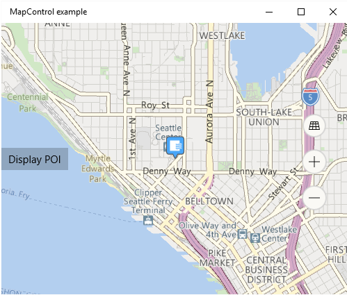

# <a name="display-points-of-interest-on-a-map"></a>Afficher les points d’intérêt sur une carte

Ajoutez des points d’intérêt à une carte à l’aide des punaises, des images, des formes et des éléments d’interface utilisateur XAML. Un point d’intérêt est un point spécifique sur la carte, qui représente un élément intéressant. Il peut s’agir, par exemple, de l’emplacement d’une entreprise, d’une localité ou d’un ami.

Pour en savoir plus sur l’affichage des points d’intérêt dans votre app, téléchargez l’exemple suivant à partir du [référentiel Windows-universal-samples](http://go.microsoft.com/fwlink/p/?LinkId=619979) sur GitHub: [exemple de carte UWP (plateforme Windows universelle)](http://go.microsoft.com/fwlink/p/?LinkId=619977).

Affichez des punaises, des images et des formes sur la carte en ajoutant des objets [**MapIcon**](https://msdn.microsoft.com/library/windows/apps/dn637077), [**MapBillboard**](https://docs.microsoft.com/uwp/api/windows.ui.xaml.controls.maps.mapbillboard),  [**MapPolygon**](https://msdn.microsoft.com/library/windows/apps/dn637103) et [**MapPolyline**](https://msdn.microsoft.com/library/windows/apps/dn637114) à une collection **MapElements** d'un objet [**MapElementsLayer**](https://docs.microsoft.com/uwp/api/windows.ui.xaml.controls.maps.mapelementslayer). Ensuite, ajoutez cet objet de couche à la collection **Couches** d’un contrôle de carte.

>[!NOTE]
> Dans les versions précédentes, ce guide vous a montré comment ajouter des éléments de carte à la collection [**MapElements**](https://docs.microsoft.com/uwp/api/windows.ui.xaml.controls.maps.mapcontrol.MapElements). Vous pouvez continuer d'utiliser cette approche, mais vous ne profiterez pas des avantage du nouveau modèle de couche de carte. Pour plus d’informations, consultez la section [Utilisation des couches](#layers) de ce guide.

Vous pouvez également afficher les éléments de l'interface utilisateur XAML, tels que [**Button**](https://msdn.microsoft.com/library/windows/apps/br209265), [**HyperlinkButton**](https://msdn.microsoft.com/library/windows/apps/br242739), ou [**TextBlock**](https://msdn.microsoft.com/library/windows/apps/br209652) sur la carte, en les ajoutant à [**MapItemsControl**](https://msdn.microsoft.com/library/windows/apps/dn637094) ou en tant qu'éléments [**enfants**](https://msdn.microsoft.com/library/windows/apps/dn637008) de [**MapControl**](https://msdn.microsoft.com/library/windows/apps/dn637004).

Si vous avez un grand nombre d’éléments à placer sur la carte, songez à [superposer des images sous forme de vignettes à la carte](overlay-tiled-images.md). Pour afficher des routes sur la carte, voir [Afficher des itinéraires et indications](routes-and-directions.md)

## <a name="add-a-pushpin"></a>Ajoutez une punaise

Affichez une image comme une punaise, avec un texte facultatif, sur la carte à l’aide de la classe [**MapIcon**](https://msdn.microsoft.com/library/windows/apps/dn637077). Vous pouvez accepter l’image par défaut ou fournir une image personnalisée à l’aide de la propriété [**Image**](https://msdn.microsoft.com/library/windows/apps/dn637078). L’image suivante affiche l’image par défaut pour un élément **MapIcon**, sans qu’aucune valeur ne soit spécifiée pour la propriété [**Title**](https://msdn.microsoft.com/library/windows/apps/dn637088), avec un titre court, un autre long et un autre très long.


L’exemple suivant représente une carte de la ville de Seattle et ajoute une classe [**MapIcon**](https://msdn.microsoft.com/library/windows/apps/dn637077) avec l’image par défaut et un titre facultatif pour indiquer l’emplacement de l’Aiguille de l’espace de Seattle. Il centre également la carte sur l’icône et effectue un zoom avant. Pour plus d’informations générales sur l’utilisation du contrôle de carte, voir [Afficher des cartes avec des vues 2D, 3D et Streetside](display-maps.md).

```csharp
public void AddSpaceNeedleIcon()
{
    var MyLandmarks = new List<MapElement>();

    BasicGeoposition snPosition = new BasicGeoposition { Latitude = 47.620, Longitude = -122.349 };
    Geopoint snPoint = new Geopoint(snPosition);

    var spaceNeedleIcon = new MapIcon
    {
        Location = snPoint,
        NormalizedAnchorPoint = new Point(0.5, 1.0),
        ZIndex = 0,
        Title = "Space Needle"
    };

    MyLandmarks.Add(spaceNeedleIcon);

    var LandmarksLayer = new MapElementsLayer
    {
        ZIndex = 1,
        MapElements = MyLandmarks
    };

    myMap.Layers.Add(LandmarksLayer);

    myMap.Center = snPoint;
    myMap.ZoomLevel = 14;

}
```

Cet exemple affiche le point d’intérêt suivant sur la carte (l’image par défaut au centre).



La ligne de code suivante affiche la classe [**MapIcon**](https://msdn.microsoft.com/library/windows/apps/dn637077) avec une image personnalisée enregistrée dans le dossier Assets du projet. La propriété [**Image**](https://msdn.microsoft.com/library/windows/apps/dn637078) de la classe **MapIcon** attend une valeur de type [**RandomAccessStreamReference**](https://msdn.microsoft.com/library/windows/apps/hh701813). Ce type nécessite une instruction **using** pour l’espace de noms [**Windows.Storage.Streams**](https://msdn.microsoft.com/library/windows/apps/br241791).

>[!NOTE]
>Si vous utilisez la même image pour plusieurs icônes de carte, déclarez l’élément  [**RandomAccessStreamReference**](https://msdn.microsoft.com/library/windows/apps/hh701813) au niveau de la page ou de l’app pour optimiser les performances.

```csharp
    MapIcon1.Image =
        RandomAccessStreamReference.CreateFromUri(new Uri("ms-appx:///Assets/customicon.png"));
```

Gardez à l’esprit les considérations suivantes lorsque vous travaillez avec la classe [**MapIcon**](https://msdn.microsoft.com/library/windows/apps/dn637077) :

-   Le propriété [**Image**](https://msdn.microsoft.com/library/windows/apps/dn637078) prend en charge une taille d’image maximale de 2 048 x 2 048 pixels.
-   Par défaut, il n’est pas garanti que l’image de l’icône de carte s’affiche. Cette classe peut être masquée quand elle cache d’autres éléments ou étiquettes sur la carte. Pour la garder visible, définissez la propriété [**CollisionBehaviorDesired**](https://msdn.microsoft.com/library/windows/apps/dn974327) de l’icône de carte sur [**MapElementCollisionBehavior.RemainVisible**](https://msdn.microsoft.com/library/windows/apps/dn974314).
-   Il n’est pas garanti non plus que le [**Title**](https://msdn.microsoft.com/library/windows/apps/dn637088) facultatif de [**MapIcon**](https://msdn.microsoft.com/library/windows/apps/dn637077) s’affiche. Si le texte n’est pas visible, effectuez un zoom arrière en réduisant la valeur de la propriété [**ZoomLevel**](https://msdn.microsoft.com/library/windows/apps/dn637068) de la classe [**MapControl**](https://msdn.microsoft.com/library/windows/apps/dn637004).
-   Quand vous affichez une image [**MapIcon**](https://msdn.microsoft.com/library/windows/apps/dn637077) qui pointe vers un emplacement spécifique sur la carte, par exemple une punaise ou une flèche, envisagez d’affecter à la valeur de la propriété [**NormalizedAnchorPoint**](https://msdn.microsoft.com/library/windows/apps/dn637082) l’emplacement approximatif du pointeur sur l’image. Si vous conservez la valeur par défaut (0, 0) de **NormalizedAnchorPoint**, qui représente le coin supérieur gauche de l’image, des modifications de la propriété [**ZoomLevel**](https://msdn.microsoft.com/library/windows/apps/dn637068) de la carte peuvent laisser l’image pointer vers un autre emplacement.
-   Si vous ne définissez pas explicitement les éléments [Altitude](https://docs.microsoft.com/uwp/api/windows.devices.geolocation.basicgeoposition) et [AltitudeReferenceSystem](https://docs.microsoft.com/uwp/api/windows.devices.geolocation.geopoint.AltitudeReferenceSystem), le [**MapIcon**](https://msdn.microsoft.com/library/windows/apps/dn637077) sera placé sur la surface.

## <a name="add-a-3d-pushpin"></a>Ajoutez une punaise 3D

Vous pouvez ajouter des objets 3D à une carte. Utilisez la catégorie [MapModel3D](https://docs.microsoft.com/uwp/api/windows.ui.xaml.controls.maps.mapmodel3d) pour importer un objet 3D à partir d'un fichier [3D Manufacturing Format (3MF)](http://3mf.io/specification/).

Cette image utilise des tasses de café en 3D pour indiquer les emplacements des cafés dans un quartier.


Le code suivant ajoute une tasse de café à la carte en important un fichier 3MF. Pour simplifier les choses, ce code ajoute l’image au centre de la carte, mais votre code ajoutera probablement l’image à un emplacement spécifique.

```csharp
public async void Add3DMapModel()
{
    var mugStreamReference = RandomAccessStreamReference.CreateFromUri
        (new Uri("ms-appx:///Assets/mug.3mf"));

    var myModel = await MapModel3D.CreateFrom3MFAsync(mugStreamReference,
        MapModel3DShadingOption.Smooth);

    myMap.Layers.Add(new MapElementsLayer
    {
       ZIndex = 1,
       MapElements = new List<MapElement>
       {
          new MapElement3D
          {
              Location = myMap.Center,
              Model = myModel,
          },
       },
    });
}
```

## <a name="add-an-image"></a>Ajouter une image

Afficher les images grand format associées à des emplacements sur la carte, comme l'image d’un restaurant ou d’un point de repère. Quand les utilisateurs effectuent un zoom arrière, la taille de l'image diminue proportionnellement afin que l’utilisateur puisse voir davantage de zones de la carte. C’est un peu différent d'un [**MapIcon**](https://msdn.microsoft.com/library/windows/apps/dn637077) qui marque un emplacement spécifique, est généralement petit et reste à la même taille quand les utilisateurs agrandissent une carte.


Le code suivant montre le [**MapBillboard**](https://docs.microsoft.com/uwp/api/windows.ui.xaml.controls.maps.mapbillboard) présenté dans l’image ci-dessus.

```csharp
public void AddLandmarkPhoto()
{
    // Create MapBillboard.

    RandomAccessStreamReference mapBillboardStreamReference =
        RandomAccessStreamReference.CreateFromUri(new Uri("ms-appx:///Assets/billboard.jpg"));

    var mapBillboard = new MapBillboard(myMap.ActualCamera)
    {
        Location = myMap.Center,
        NormalizedAnchorPoint = new Point(0.5, 1.0),
        Image = mapBillboardStreamReference
    };

    // Add MapBillboard to a layer on the map control.

    var MyLandmarkPhotos = new List<MapElement>();

    MyLandmarkPhotos.Add(mapBillboard);

    var LandmarksPhotoLayer = new MapElementsLayer
    {
        ZIndex = 1,
        MapElements = MyLandmarkPhotos
    };

    myMap.Layers.Add(LandmarksPhotoLayer);
}
```

Trois parties de ce code sont intéressantes à examiner d'un peu plus près: l’image, la caméra de référence et la propriété [**NormalizedAnchorPoint**](https://docs.microsoft.com/uwp/api/windows.ui.xaml.controls.maps.mapbillboard.NormalizedAnchorPoint).

### <a name="image"></a>Image

Cet exemple montre une image personnalisée enregistrée dans le dossier **Ressources** du projet. La propriété [**Image**](https://docs.microsoft.com/uwp/api/windows.ui.xaml.controls.maps.mapbillboard.Image) de la classe [**MapBillboard**](https://docs.microsoft.com/uwp/api/windows.ui.xaml.controls.maps.mapbillboard) attend une valeur de type [**RandomAccessStreamReference**](https://msdn.microsoft.com/library/windows/apps/hh701813). Ce type nécessite une instruction **using** pour l’espace de noms [**Windows.Storage.Streams**](https://msdn.microsoft.com/library/windows/apps/br241791).

>[!NOTE]
>Si vous utilisez la même image pour plusieurs icônes de carte, déclarez l’élément [**RandomAccessStreamReference**](https://msdn.microsoft.com/library/windows/apps/hh701813) au niveau de la page ou de l’application pour optimiser les performances.

### <a name="reference-camera"></a>Caméra de référence

 Comme une image [**MapBillboard**](https://docs.microsoft.com/uwp/api/windows.ui.xaml.controls.maps.mapbillboard) se met à l’échelle en fonction des changements de [**ZoomLevel**](https://docs.microsoft.com/uwp/api/windows.ui.xaml.controls.maps.mapcontrol.ZoomLevel) de la carte, il est important de définir à quel niveau du [**ZoomLevel**](https://docs.microsoft.com/uwp/api/windows.ui.xaml.controls.maps.mapcontrol.ZoomLevel) l’image s’affiche à l'échelle 1 x normale. Cette position est définie dans la caméra de référence de l'élément [**MapBillboard**](https://docs.microsoft.com/uwp/api/windows.ui.xaml.controls.maps.mapbillboard) et, pour la définir, vous devez passer un objet [**MapCamera**](https://docs.microsoft.com/uwp/api/windows.ui.xaml.controls.maps.mapcamera) dans le constructeur du [**MapBillboard**](https://docs.microsoft.com/uwp/api/windows.ui.xaml.controls.maps.mapbillboard).

 Vous pouvez définir la position que vous voulez dans un [**Geopoint**](https://docs.microsoft.com/uwp/api/windows.devices.geolocation.geopoint), puis utiliser ce [**Geopoint**](https://docs.microsoft.com/uwp/api/windows.devices.geolocation.geopoint) pour créer un objet [**MapCamera**](https://docs.microsoft.com/uwp/api/windows.ui.xaml.controls.maps.mapcamera).  Toutefois, dans cet exemple, nous utilisons simplement l'objet [**MapCamera**](https://docs.microsoft.com/uwp/api/windows.ui.xaml.controls.maps.mapcamera) retourné par la propriété [**ActualCamera**](https://docs.microsoft.com/uwp/api/windows.ui.xaml.controls.maps.mapcontrol.ActualCamera) du contrôle de carte. Il s’agit de la caméra interne de la carte. La position actuelle de cette caméra devient la position de caméra de référence: l’emplacement où l'image [**MapBillboard**](https://docs.microsoft.com/uwp/api/windows.ui.xaml.controls.maps.mapbillboard) s’affiche à l’échelle 1 x.

 Si votre application permet aux utilisateurs d’effectuer un zoom arrière sur la carte, la taille de l’image diminue, car la caméra interne de la carte monte en altitude tandis que l’image à échelle 1 x reste fixée sur la position de la caméra de référence.

### <a name="normalizedanchorpoint"></a>NormalizedAnchorPoint

L'élément [**NormalizedAnchorPoint**](https://docs.microsoft.com/uwp/api/windows.ui.xaml.controls.maps.mapbillboard.NormalizedAnchorPoint) est le point de l’image qui est ancré à la propriété [**Emplacement**](https://docs.microsoft.com/uwp/api/windows.ui.xaml.controls.maps.mapbillboard.Location) de l'objet [**MapBillboard**](https://docs.microsoft.com/uwp/api/windows.ui.xaml.controls.maps.mapbillboard). Le point 0.5,1 est le centre du bas de l’image. Étant donné que nous avons défini la propriété [**Emplacement**](https://docs.microsoft.com/uwp/api/windows.ui.xaml.controls.maps.mapbillboard.Location) du [**MapBillboard**](https://docs.microsoft.com/uwp/api/windows.ui.xaml.controls.maps.mapbillboard) sur le centre du contrôle de la carte, le centre du bas de l’image sera ancré au centre du contrôle de la carte. Si vous souhaitez que votre image soit directement centrée sur un point, définissez la [**NormalizedAnchorPoint**](https://docs.microsoft.com/uwp/api/windows.ui.xaml.controls.maps.mapbillboard.NormalizedAnchorPoint) sur 0,5, 0,5.  

## <a name="add-a-shape"></a>Ajoutez une forme.

Utilisez la classe [**MapPolygon**](https://msdn.microsoft.com/library/windows/apps/dn637103) pour afficher une forme multipoint sur la carte. L’exemple suivant, tiré de l’[exemple de carte UWP](http://go.microsoft.com/fwlink/p/?LinkId=619977), affiche une zone rouge bordée de bleu sur la carte.

```csharp
public void HighlightArea()
{
    // Create MapPolygon.

    double centerLatitude = myMap.Center.Position.Latitude;
    double centerLongitude = myMap.Center.Position.Longitude;

    var mapPolygon = new MapPolygon
    {
        Path = new Geopath(new List<BasicGeoposition> {
                    new BasicGeoposition() {Latitude=centerLatitude+0.0005, Longitude=centerLongitude-0.001 },
                    new BasicGeoposition() {Latitude=centerLatitude-0.0005, Longitude=centerLongitude-0.001 },
                    new BasicGeoposition() {Latitude=centerLatitude-0.0005, Longitude=centerLongitude+0.001 },
                    new BasicGeoposition() {Latitude=centerLatitude+0.0005, Longitude=centerLongitude+0.001 },
                }),
        ZIndex = 1,
        FillColor = Colors.Red,
        StrokeColor = Colors.Blue,
        StrokeThickness = 3,
        StrokeDashed = false,
    };

    // Add MapPolygon to a layer on the map control.
    var MyHighlights = new List<MapElement>();

    MyHighlights.Add(mapPolygon);

    var HighlightsLayer = new MapElementsLayer
    {
        ZIndex = 1,
        MapElements = MyHighlights
    };

    myMap.Layers.Add(HighlightsLayer);
}
```

## <a name="add-a-line"></a>Ajouter un ligne


Utilisez la classe [**MapPolyline**](https://msdn.microsoft.com/library/windows/apps/dn637114) pour afficher une ligne sur la carte. L’exemple suivant, tiré de l’[exemple de carte UWP](http://go.microsoft.com/fwlink/p/?LinkId=619977), affiche une ligne en pointillé sur la carte.

```csharp
public void DrawLineOnMap()
{
    // Create Polyline.

    double centerLatitude = myMap.Center.Position.Latitude;
    double centerLongitude = myMap.Center.Position.Longitude;
    var mapPolyline = new MapPolyline
    {
        Path = new Geopath(new List<BasicGeoposition> {
                    new BasicGeoposition() {Latitude=centerLatitude-0.0005, Longitude=centerLongitude-0.001 },
                    new BasicGeoposition() {Latitude=centerLatitude+0.0005, Longitude=centerLongitude+0.001 },
                }),
        StrokeColor = Colors.Black,
        StrokeThickness = 3,
        StrokeDashed = true,
    };

   // Add Polyline to a layer on the map control.

   var MyLines = new List<MapElement>();

   MyLines.Add(mapPolyline);

   var LinesLayer = new MapElementsLayer
   {
       ZIndex = 1,
       MapElements = MyLines
   };

   myMap.Layers.Add(LinesLayer);

}
```

## <a name="add-xaml"></a>Ajouter du code XAML

Utilisez du code XAML pour afficher des éléments d’interface utilisateur personnalisés sur la carte. Positionnez le code XAML sur la carte en spécifiant son emplacement et son point d’ancrage normalisé.

-   Appelez [**SetLocation**](https://msdn.microsoft.com/library/windows/desktop/ms704369) pour définir l’emplacement du code XAML sur la carte.
-   Appelez [**SetNormalizedAnchorPoint**](https://msdn.microsoft.com/library/windows/apps/dn637050) pour définir l’emplacement relatif du code XAML correspondant à l’emplacement spécifié.

L’exemple suivant affiche une carte de la ville de Seattle et ajoute un contrôle [**Border**](https://msdn.microsoft.com/library/windows/apps/br209250) en code XAML pour indiquer l’emplacement de la Space Needle. Il centre également la carte sur la zone et effectue un zoom avant. Pour plus d’informations générales sur l’utilisation du contrôle de carte, voir [Afficher des cartes avec des vues 2D, 3D et Streetside](display-maps.md).

```csharp
private void displayXAMLButton_Click(object sender, RoutedEventArgs e)
{
   // Specify a known location.
   BasicGeoposition snPosition = new BasicGeoposition { Latitude = 47.620, Longitude = -122.349 };
   Geopoint snPoint = new Geopoint(snPosition);

   // Create a XAML border.
   Border border = new Border
   {
      Height = 100,
      Width = 100,
      BorderBrush = new SolidColorBrush(Windows.UI.Colors.Blue),
      BorderThickness = new Thickness(5),
   };

   // Center the map over the POI.
   MapControl1.Center = snPoint;
   MapControl1.ZoomLevel = 14;

   // Add XAML to the map.
   MapControl1.Children.Add(border);
   MapControl.SetLocation(border, snPoint);
   MapControl.SetNormalizedAnchorPoint(border, new Point(0.5, 0.5));
}
```

Cet exemple affiche une bordure bleue sur la carte.


Les exemples suivants montrent comment ajouter des éléments d’interface utilisateur en code XAML directement dans le balisage XAML de la page à l’aide de la liaison de données. Comme pour d’autres éléments XAML qui affichent du contenu, la propriété [**Children**](https://msdn.microsoft.com/library/windows/apps/dn637008) est la propriété de contenu par défaut de la classe [**MapControl**](https://msdn.microsoft.com/library/windows/apps/dn637004) et n’a pas besoin d’être spécifiée explicitement dans le balisage XAML.

Cet exemple montre comment afficher deux contrôles XAML en tant qu’enfants implicites du [**MapControl**](https://msdn.microsoft.com/library/windows/apps/dn637004). Ces contrôles apparaissent sur la carte aux emplacements associés aux données.

```xml
<maps:MapControl>
    <TextBox Text="Seattle" maps:MapControl.Location="{x:Bind SeattleLocation}"/>
    <TextBox Text="Bellevue" maps:MapControl.Location="{x:Bind BellevueLocation}"/>
</maps:MapControl>
```

Définissez ces emplacements en utilisant les propriétés de votre fichier code-behind.

```csharp
public Geopoint SeattleLocation { get; set; }
public Geopoint BellevueLocation { get; set; }
```

Cet exemple montre comment afficher deux contrôles XAML contenus dans un [**MapItemsControl**](https://msdn.microsoft.com/library/windows/apps/dn637094). Ces contrôles apparaissent sur la carte aux emplacements associés aux données.

```xml
<maps:MapControl>
  <maps:MapItemsControl>
    <TextBox Text="Seattle" maps:MapControl.Location="{x:Bind SeattleLocation}"/>
    <TextBox Text="Bellevue" maps:MapControl.Location="{x:Bind BellevueLocation}"/>
  </maps:MapItemsControl>
</maps:MapControl>
```

Cet exemple affiche une collection d’éléments XAML liés à un [**MapItemsControl**](https://msdn.microsoft.com/library/windows/apps/dn637094).

```xml
<maps:MapControl x:Name="MapControl" MapTapped="MapTapped" MapDoubleTapped="MapTapped" MapHolding="MapTapped">
  <maps:MapItemsControl ItemsSource="{x:Bind LandmarkOverlays}">
      <maps:MapItemsControl.ItemTemplate>
          <DataTemplate>
              <StackPanel Background="Black" Tapped ="Overlay_Tapped">
                  <TextBlock maps:MapControl.Location="{Binding Location}" Text="{Binding Title}"
                    maps:MapControl.NormalizedAnchorPoint="0.5,0.5" FontSize="20" Margin="5"/>
              </StackPanel>
          </DataTemplate>
      </maps:MapItemsControl.ItemTemplate>
  </maps:MapItemsControl>
</maps:MapControl>
```

La propriété ``ItemsSource``propriété dans l’exemple ci-dessus est liée à une propriété de type [IList](https://docs.microsoft.com/dotnet/api/system.collections.ilist?view=netframework-4.70) dans le fichier code-behind.

```csharp
public sealed partial class Scenario1 : Page
{
    public IList LandmarkOverlays { get; set; }

    public MyClassConstructor()
    {
         SetLandMarkLocations();
         this.InitializeComponent();   
    }

    private void SetLandMarkLocations()
    {
        LandmarkOverlays = new List<MapElement>();

        var pikePlaceIcon = new MapIcon
        {
            Location = new Geopoint(new BasicGeoposition
            { Latitude = 47.610, Longitude = -122.342 }),
            Title = "Pike Place Market"
        };

        LandmarkOverlays.Add(pikePlaceIcon);

        var SeattleSpaceNeedleIcon = new MapIcon
        {
            Location = new Geopoint(new BasicGeoposition
            { Latitude = 47.6205, Longitude = -122.3493 }),
            Title = "Seattle Space Needle"
        };

        LandmarkOverlays.Add(SeattleSpaceNeedleIcon);
    }
}
```

<a id="layers" />

## <a name="working-with-layers"></a>Utilisation des couches

Les exemples de ce guide ajoutent des éléments à une collection [MapElementLayers](https://docs.microsoft.com/uwp/api/windows.ui.xaml.controls.maps.mapelementslayer). Ils indiquent ensuite comment ajouter cette collection à la propriété **Couches** du contrôle de carte. Dans les versions précédentes, ce guide vous a montré comment ajouter des éléments de carte à la collection [**MapElements**](https://docs.microsoft.com/uwp/api/windows.ui.xaml.controls.maps.mapcontrol.MapElements), comme suit:

```csharp
var pikePlaceIcon = new MapIcon
{
    Location = new Geopoint(new BasicGeoposition
    { Latitude = 47.610, Longitude = -122.342 }),
    NormalizedAnchorPoint = new Point(0.5, 1.0),
    ZIndex = 0,
    Title = "Pike Place Market"
};

myMap.MapElements.Add(pikePlaceIcon);
```

Vous pouvez continuer d'utiliser cette approche, mais vous ne profiterez pas des avantage du nouveau modèle de couche de carte. En regroupant vos éléments en couches, vous pouvez manipuler chaque couche indépendamment l'une de l'autre. Par exemple, chaque couche possède son propre ensemble d’événements, de sorte que vous pouvez répondre à un événement sur une couche particulière et effectuer une action spécifique à cet événement.

En outre, vous pouvez lier XAML directement à un élément [MapLayer ](https://docs.microsoft.com/uwp/api/windows.ui.xaml.controls.maps.maplayer). Vous ne pouvez pas effectuer une telle opération en utilisant la collection [MapElements](https://docs.microsoft.com/uwp/api/windows.ui.xaml.controls.maps.mapcontrol.MapElements).

Vous pouvez en revanche utiliser une classe de modèle d’affichage, une page XAML code-behind et une page XAML.

### <a name="view-model-class"></a>Afficher la classe de modèle

```csharp
public class LandmarksViewModel
{
    public ObservableCollection<MapLayer> LandmarkLayer
        { get; } = new ObservableCollection<MapLayer>();

    public LandmarksViewModel()
    {
        var MyElements = new List<MapElement>();

        var pikePlaceIcon = new MapIcon
        {
            Location = new Geopoint(new BasicGeoposition
            { Latitude = 47.610, Longitude = -122.342 }),
            Title = "Pike Place Market"
        };

        MyElements.Add(pikePlaceIcon);

        var LandmarksLayer = new MapElementsLayer
        {
            ZIndex = 1,
            MapElements = MyElements
        };

        LandmarkLayer.Add(LandmarksLayer);         
    }

```

### <a name="code-behind-a-xaml-page"></a>Code-behind d'une page XAML

Connecter la classe de modèle d’affichage à votre page code-behind.

```csharp
public LandmarksViewModel ViewModel { get; set; }

public myMapPage()
{
    this.InitializeComponent();
    this.ViewModel = new LandmarksViewModel();
}
```

### <a name="xaml-page"></a>Page XAML

Dans votre page XAML, associez la propriété dans votre classe de modèle d’affichage qui renvoie la couche.

```XML
<maps:MapControl
    x:Name="myMap" TransitFeaturesVisible="False" Loaded="MyMap_Loaded" Grid.Row="2"
    MapServiceToken="Your token" Layers="{x:Bind ViewModel.LandmarkLayer}"/>
```

## <a name="related-topics"></a>Rubriques associées

* [Centre de développement Bing Cartes](https://www.bingmapsportal.com/)
* [Exemple de carte UWP](http://go.microsoft.com/fwlink/p/?LinkId=619977)
* [Recommandations en matière de conception pour les cartes](https://msdn.microsoft.com/library/windows/apps/dn596102)
* [Vidéos de la build 2015: utilisation des cartes et de la localisation sur un téléphone, une tablette et un PC dans vos applications Windows](https://channel9.msdn.com/Events/Build/2015/2-757)
* [Exemple d’application de trafic UWP](http://go.microsoft.com/fwlink/p/?LinkId=619982)
* [**MapIcon**](https://msdn.microsoft.com/library/windows/apps/dn637077)
* [**MapPolygon**](https://msdn.microsoft.com/library/windows/apps/dn637103)
* [**MapPolyline**](https://msdn.microsoft.com/library/windows/apps/dn637114)
