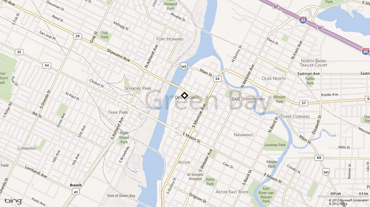
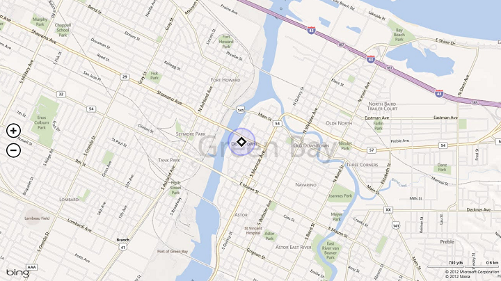
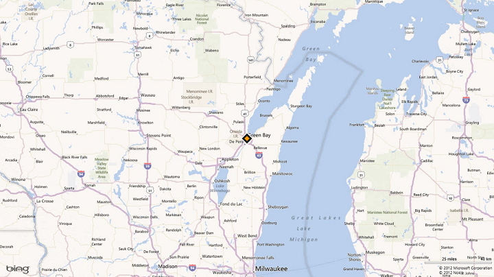

# Recommandations pour les applications avec la géolocalisation

\[ Mise à jour pour les applications UWP sur Windows10. Pour les articles sur Windows 8.x, voir l’[archive](http://go.microsoft.com/fwlink/p/?linkid=619132). \]

**API importantes**

-   [**Géolocalisation**](https://msdn.microsoft.com/library/windows/apps/br225603)
-   [**Geolocator**](https://msdn.microsoft.com/library/windows/apps/br225534)

Cette rubrique décrit les recommandations en matière de performance des applications qui nécessitent de géolocaliser un utilisateur.

## Recommandations

-   Commencez à utiliser l’objet localisation seulement lorsque l’application requiert des données de localisation.

    Appelez l’élément [**RequestAccessAsync**](https://msdn.microsoft.com/library/windows/apps/dn859152) avant d’accéder à l’emplacement de l’utilisateur. À ce stade, votre application doit être au premier plan et l’élément **RequestAccessAsync** doit être appelé à partir du thread d’interface utilisateur. Jusqu’à ce que l’utilisateur l’y autorise, votre application ne peut pas accéder aux données d’emplacement.

-   Si la géolocalisation n’est pas cruciale pour votre application, n’y accédez que si l’utilisateur essaie d’effectuer une tâche qui la nécessite. Par exemple, si une application de réseau social comporte un bouton « Indiquer ma localisation », l’application ne doit pas accéder à la localisation avant que l’utilisateur ne clique sur le bouton. Il convient d’accéder immédiatement à la localisation si la fonction principale de votre application le nécessite.

-   La première utilisation de l’objet [**Geolocator**](https://msdn.microsoft.com/library/windows/apps/br225534) doit être effectuée sur le thread principal d’interface utilisateur de l’application au premier plan, afin de déclencher l’affichage de l’invite de consentement à l’utilisateur. La première utilisation de l’objet **Geolocator** peut correspondre soit au premier appel à [**getGeopositionAsync**](https://msdn.microsoft.com/library/windows/apps/hh973536), soit à la première inscription d’un gestionnaire pour l’événement [**positionChanged**](https://msdn.microsoft.com/library/windows/apps/br225540).

-   Précisez à l’utilisateur la manière dont les données de géolocalisation seront utilisées.
-   Fournissez une interface utilisateur pour permettre aux utilisateurs d’actualiser manuellement leur emplacement.
-   Affichez une barre ou un anneau de progression tout en attendant d’obtenir les données de géolocalisation. <!--For info on the available progress controls and how to use them, see [**Guidelines for progress controls**](guidelines-and-checklist-for-progress-controls.md).-->
-   Affichez des messages d’erreur ou des boîtes de dialogue appropriés lorsque les services de localisation sont désactivés ou non disponibles.

    Si les paramètres d’emplacement n’autorisent pas votre application à accéder à l’emplacement de l’utilisateur, nous vous recommandons de fournir un lien pratique vers les **paramètres de confidentialité d’emplacement** dans l’application **Paramètres**. Par exemple, vous pouvez utiliser un contrôle de lien hypertexte ou appeler la méthode [**LaunchUriAsync**](https://msdn.microsoft.com/library/windows/apps/hh701476) pour lancer l’application **Paramètres** à partir du code à l’aide de l’URI `ms-settings:privacy-location`. Pour plus d’informations, voir [Lancer l’application Paramètres Windows](https://msdn.microsoft.com/library/windows/apps/mt228342).

-   Supprimez les données de géolocalisation mises en cache et libérez l’objet [**Geolocator**](https://msdn.microsoft.com/library/windows/apps/br225534) lorsque l’utilisateur désactive l’accès aux informations de géolocalisation.

    Libérez l’objet [**Geolocator**](https://msdn.microsoft.com/library/windows/apps/br225534) si l’utilisateur désactive l’accès aux informations de géolocalisation via les Paramètres. L’application recevra des résultats **ACCESS\_DENIED** lors de tous les appels d’API de géolocalisation. Si votre application enregistre ou met en cache les données de géolocalisation, effacez toutes les données mises à en cache lorsque l’utilisateur révoque l’accès aux informations de géolocalisation. Proposez un autre moyen de saisir manuellement un emplacement lorsque les informations de géolocalisation ne sont pas disponibles via les services de localisation.

-   Prévoyez une interface utilisateur permettant de réactiver les services de localisation. Par exemple, fournissez un bouton d’actualisation qui réinstancie l’objet [**Geolocator**](https://msdn.microsoft.com/library/windows/apps/br225534) et essaie de réobtenir les informations de géolocalisation.

    Votre application doit proposer une interface utilisateur pour la réactivation des services de géolocalisation.

    -   Si l’utilisateur réactive l’accès à la géolocalisation après l’avoir désactivé, aucune notification n’est communiquée à l’application. La propriété [**status**](https://msdn.microsoft.com/library/windows/apps/br225601) ne change pas et aucun événement [**statusChanged**](https://msdn.microsoft.com/library/windows/apps/br225542) ne se produit. Votre application doit créer un objet [**Geolocator**](https://msdn.microsoft.com/library/windows/apps/br225534) et appeler [**getGeopositionAsync**](https://msdn.microsoft.com/library/windows/apps/hh973536) pour essayer d’obtenir des données de géolocalisation à jour, ou se réabonner aux événements [**positionChanged**](https://msdn.microsoft.com/library/windows/apps/br225540). Si l’état indique ensuite que la géolocalisation a été réactivée, effacez tout élément d’interface utilisateur précédemment affiché par votre application pour avertir l’utilisateur que les services de localisation étaient désactivés et répondez de manière appropriée au nouvel état.
    -   Votre application doit également tenter à nouveau de se procurer des données de géolocalisation au moment de l’activation, lorsque l’utilisateur tente explicitement d’utiliser la fonctionnalité qui fait appel à des informations de géolocalisation ou à tout autre moment adapté au scénario.

**Performances**

-   Utilisez des demandes de localisation ponctuelles si votre application n’a pas besoin de recevoir des mises à jour de localisation. Par exemple, une application qui ajoute une balise de géolocalisation à une photo n’a pas besoin de recevoir d’événements de mise à jour géographique. Elle doit plutôt demander la géolocalisation via la méthode [**getGeopositionAsync**](https://msdn.microsoft.com/library/windows/apps/hh973536), comme décrit dans [Obtenir l’emplacement actuel](https://msdn.microsoft.com/library/windows/apps/mt219698).

    Quand vous effectuez une demande de géolocalisation ponctuelle, vous devez définir les valeurs suivantes.

    -   Spécifiez la précision demandée par votre application en définissant la propriété [**DesiredAccuracy**](https://msdn.microsoft.com/library/windows/apps/br225535) ou [**DesiredAccuracyInMeters**](https://msdn.microsoft.com/library/windows/apps/jj635271). Pour obtenir des recommandations concernant l’utilisation de ces paramètres, voir plus bas.
    -   Définissez le paramètre d’âge maximal de [**GetGeopositionAsync**](https://msdn.microsoft.com/library/windows/apps/hh973536) pour spécifier depuis combien de temps un emplacement peut avoir été obtenu pour être utile à votre application. Si votre application peut utiliser une position qui a été obtenue quelques secondes ou minutes auparavant, elle peut recevoir une position presque immédiatement et contribuer à prolonger l’autonomie de l’appareil.
    -   Définissez le paramètre de délai d’attente de [**GetGeopositionAsync**](https://msdn.microsoft.com/library/windows/apps/hh973536). Il s’agit du délai pendant lequel votre application peut attendre la réception d’une position ou d’une erreur. Vous devez établir un bon compromis entre réactivité et précision, en fonction des besoins de votre application.
-   Utilisez une session de géolocalisation continue quand des mises à jour fréquentes de la position sont nécessaires. Utilisez les événements [**positionChanged**](https://msdn.microsoft.com/library/windows/apps/br225540) et [**statusChanged**](https://msdn.microsoft.com/library/windows/apps/br225542) pour détecter un déplacement au-delà d’un seuil spécifique ou pour des mises à jour géographiques continues au fur et à mesure qu’elles se produisent.

    Lors d’une demande de mise à jour de géolocalisation, vous pouvez spécifier la précision demandée par votre application en définissant la propriété [**DesiredAccuracy**](https://msdn.microsoft.com/library/windows/apps/br225535) ou [**DesiredAccuracyInMeters**](https://msdn.microsoft.com/library/windows/apps/jj635271). Vous devez également définir la fréquence à laquelle les mises à jour géographiques sont nécessaires, à l’aide de la propriété [**MovementThreshold**](https://msdn.microsoft.com/library/windows/apps/br225539) ou [**ReportInterval**](https://msdn.microsoft.com/library/windows/apps/br225541).

    -   Spécifiez le seuil de déplacement. Certaines applications n’ont besoin de mises à jour géographiques que lorsque l’utilisateur effectue un long déplacement. Ainsi, une application qui fournit des actualités locales ou des mises à jour météorologiques peut ne pas avoir besoin de mises à jour géographiques, à moins que l’utilisateur ne change de lieu en se rendant dans une autre ville. Dans ce cas, vous réglez la distance minimale requise avant déclenchement d’un événement de mise à jour géographique en définissant la propriété [**MovementThreshold**](https://msdn.microsoft.com/library/windows/apps/br225539). Cette propriété a pour effet de filtrer les événements [**PositionChanged**](https://msdn.microsoft.com/library/windows/apps/br225540). Des événements de ce type ne se déclenchent que lorsque le changement de position dépasse le seuil de déplacement.

    -   Utilisez une valeur [**reportInterval**](https://msdn.microsoft.com/library/windows/apps/br225541) qui est conforme à votre expérience de l’application et diminue le recours aux ressources système. Par exemple, une application météo peut nécessiter une mise à jour des données toutes les 15 minutes seulement. En dehors des applications de navigation en temps réel, la plupart des applications n’exigent pas un flux constant de mises à jour géographiques extrêmement précises. Si votre application n’a pas besoin d’un flux de données ultra précis ou si elle nécessite des mises à jour de temps à autre, définissez la propriété **ReportInterval** pour indiquer la fréquence minimale des mises à jour géographiques dont a besoin votre application. La source de localisation peut ensuite économiser de l’énergie en calculant l’emplacement seulement en cas de besoin.

        S’agissant d’applications qui nécessitent des données en temps réel, il est nécessaire de définir la propriété [**ReportInterval**](https://msdn.microsoft.com/library/windows/apps/br225541) avec la valeur 0 pour indiquer qu’aucun intervalle minimal n’est spécifié. L’intervalle de rapport par défaut est le plus court entre 1 seconde ou la fréquence que le matériel permet.

        Les appareils qui fournissent des données de géolocalisation peuvent suivre l’intervalle de rapport demandé par différentes applications et fournir des rapports de données au plus petit intervalle demandé. L’application qui a le plus besoin de précision reçoit ainsi les données dont elle a besoin. Par conséquent, il est possible que le service de géolocalisation génère des mises à jour à une fréquence plus élevée que celle demandée par votre application, si une autre application a demandé des mises à jour plus fréquentes.

        **Remarque** Il n’est pas garanti que la source de géolocalisation honore la demande correspondant à l’intervalle de rapport en question. Bien que certains services de géolocalisation ne tiennent pas compte de l’intervalle de rapport, vous avez quand même intérêt à le définir pour ceux qui le prennent en compte.

    -   Dans un souci d’économie d’énergie, définissez la propriété [**desiredAccuracy**](https://msdn.microsoft.com/library/windows/apps/br225535) pour indiquer à la plateforme de géolocalisation si votre application a besoin ou non de données de grande précision. Si aucune application n’a besoin de données de grande précision, le système peut économiser de l’énergie en n’activant pas les services GPS.

        -   Définissez [**desiredAccuracy**](https://msdn.microsoft.com/library/windows/apps/br225535) sur **HIGH** pour activer l’acquisition de données par GPS.
        -   Affectez à [**desiredAccuracy**](https://msdn.microsoft.com/library/windows/apps/br225535) la valeur **Default** et utilisez uniquement un modèle d’appel à application unique pour réduire la consommation d’énergie si votre application utilise l’emplacement uniquement à des fins de ciblage publicitaire.

        Si votre application a des besoins spécifiques en matière de précision, vous pouvez utiliser la propriété [**DesiredAccuracyInMeters**](https://msdn.microsoft.com/library/windows/apps/jj635271) au lieu de [**DesiredAccuracy**](https://msdn.microsoft.com/library/windows/apps/br225535). Ceci est particulièrement utile sur Windows Phone, où la position peut généralement être obtenue grâce aux satellites ou aux points d’accès cellulaires ou Wi-Fi. La sélection d’une valeur de précision plus spécifique aide le système à identifier les technologies adéquates à utiliser avec le moindre coût énergétique lors de la fourniture de la position.

        Par exemple :

        -   Si votre application obtient l’emplacement pour l’optimisation publicitaire, la météo, les actualités, et ainsi de suite, une précision de 5000 mètres suffit généralement.
        -   Si votre application affiche les « meilleures affaires du coin », une précision de 300 mètres procure en général de bons résultats.
        -   Si l’utilisateur souhaite obtenir des recommandations pour choisir un restaurant dans les environs, une précision de 100 mètres suffit.
        -   Si l’utilisateur essaie de partager sa position, l’application doit demander une précision d’environ 10 mètres.
    -   Utilisez la propriété [**Geocoordinate.accuracy**](https://msdn.microsoft.com/library/windows/apps/br225526) si votre application a des exigences de précision spécifiques. Par exemple, les applications de navigation doivent utiliser la propriété **Geocoordinate.accuracy** pour déterminer si les données de géolocalisation disponibles répondent à leurs exigences.

-   Prenez en compte le retard lié à la prise en main. Lorsqu’une application demande des données de géolocalisation pour la première fois, le service de localisation peut accuser un léger retard (une à deux secondes) au moment de sa prise en main. Vous devez en tenir compte dans la conception de l’interface utilisateur de votre application. Il est par exemple préférable d’éviter que d’autres tâches soient bloquées dans l’attente de l’exécution de l’appel à [**GetGeopositionAsync**](https://msdn.microsoft.com/library/windows/apps/hh973536).

-   Prenez en compte le comportement en arrière-plan. Si votre application n’a pas le focus, elle ne reçoit pas les événements de mise à jour de localisation tant qu’elle est interrompue en arrière-plan. Si votre application assure le suivi des mises à jour de localisation en les enregistrant dans un journal, tenez-en compte. Une fois que l’application récupère le focus, elle reçoit uniquement les nouveaux événements. Elle ne récupère aucune des mises à jour survenues pendant qu’elle était inactive.

-   Utilisez efficacement les capteurs bruts et de fusion. Il y a deux types de capteurs : *bruts* et *fusion*.

    -   Les capteurs bruts comprennent l’accéléromètre, le gyromètre et le magnétomètre.
    -   Les capteurs de fusion comprennent l’orientation, l’inclinomètre et la boussole. Les capteurs de fusion obtiennent les données d’un ensemble de capteurs bruts.

    Les API Windows Runtime peuvent accéder à tous ces capteurs à l’exception du magnétomètre. Les capteurs de fusion sont plus précis et stables que les capteurs bruts, mais ils consomment plus. Utilisez le capteur adapté à vos besoins. Pour plus d’informations, voir [Capteurs](https://msdn.microsoft.com/library/windows/apps/mt187358).

**Veille connectée:**Lorsque le PC est à l’état de veille connectée, les objets [**Geolocator**](https://msdn.microsoft.com/library/windows/apps/br225534) peuvent toujours être instanciés. Toutefois, l’objet **Geolocator** ne trouvera aucun capteur à agréger et, par conséquent, les appels à [**GetGeopositionAsync**](https://msdn.microsoft.com/library/windows/apps/hh973536) expireront au bout de 7 secondes, les détecteurs d’événements [**PositionChanged**](https://msdn.microsoft.com/library/windows/apps/br225540) ne seront jamais appelés et les détecteurs d’événements [**StatusChanged**](https://msdn.microsoft.com/library/windows/apps/br225542) seront appelés une fois avec l’état **NoData**.

## Indications d’utilisation supplémentaires

### Détection des modifications dans les paramètres de géolocalisation

L’utilisateur peut désactiver la fonctionnalité de géolocalisation en définissant les **paramètres de confidentialité de l’emplacement** dans l’application **Paramètres**.

-   Pour détecter à quel moment l’utilisateur désactive ou réactive les services de localisation :
    -   Gérez l’événement [**StatusChanged**](https://msdn.microsoft.com/library/windows/apps/br225542). La propriété [**Status**](https://msdn.microsoft.com/library/windows/apps/br225601) de l’argument de l’événement **StatusChanged** a la valeur **Disabled** si l’utilisateur désactive les services de localisation.
    -   Vérifiez les codes d’erreur retournés par [**GetGeopositionAsync**](https://msdn.microsoft.com/library/windows/apps/hh973536). Si l’utilisateur a désactivé les services de localisation, les appels à **GetGeopositionAsync** se soldent par un échec avec une erreur **ACCESS\_DENIED** et la propriété [**LocationStatus**](https://msdn.microsoft.com/library/windows/apps/br225538) a la valeur **Disabled**.
-   Si vous disposez d’une application pour laquelle des données de géolocalisation sont primordiales, par exemple une application de cartographie, veillez à effectuer les tâches suivantes:
    -   Gérez l’événement [**PositionChanged**](https://msdn.microsoft.com/library/windows/apps/br225540) pour obtenir des mises à jour si l’emplacement de l’utilisateur change.
    -   Gérez l’événement [**StatusChanged**](https://msdn.microsoft.com/library/windows/apps/br225542) tel que décrit ci-avant afin de détecter les modifications apportées aux paramètres de géolocalisation.

Notez que le service de localisation renvoie les données à mesure de leur disponibilité. Elle peut d’abord renvoyer une localisation avec un rayon d’erreur important, puis la mettre à jour à mesure que des informations plus précises se feront disponibles. Les applications qui affichent la localisation de l’utilisateur doivent normalement souhaiter la mettre à jour à mesure que des informations plus précises sont disponibles.

### Représentations graphiques de localisation

Faites en sorte que votre application utilise [**Geocoordinate.accuracy**](https://msdn.microsoft.com/library/windows/apps/br225526) pour indiquer précisément l’emplacement actuel de l’utilisateur sur la carte. Il existe trois principales bandes de précision: un rayon d’erreur d’environ 10 mètres, un rayon d’erreur d’environ 100 mètres et un rayon d’erreur de plus d’un kilomètre. En utilisant les informations de précision, vous pouvez vous assurer que votre application affiche l’emplacement de façon exacte dans le contexte des données disponibles. Pour plus d’informations générales sur l’utilisation du contrôle de carte, voir [Afficher des cartes avec des vues 2D, 3D et Streetside](https://msdn.microsoft.com/library/windows/apps/mt219695).

-   Pour une précision égale à peu près à 10 mètres (résolution GPS), l’emplacement peut être indiqué par un point ou une épingle sur la carte. Avec cette précision, les coordonnées de latitude et de longitude ainsi que l’adresse peuvent également être affichées.

    

-   Pour une précision entre 10 et 500mètres (environ 100mètres), la localisation est généralement reçue via une résolution Wi-Fi. La localisation obtenue à partir du signal cellulaire offre une précision d’environ 300 mètres. Dans ce cas, il est conseillé que votre application affiche un rayon d’erreur. Pour les applications qui affichent des directions où un point de centrage est requis, un tel point peut être affiché avec un rayon d’erreur qui l’entoure.

    

-   Si la précision retournée est supérieure à 1kilomètre, vous recevez probablement les informations de géolocalisation avec une résolution de niveau IP. Ce niveau de précision est souvent trop faible pour localiser avec exactitude un endroit spécifique sur une carte. Votre application doit zoomer au niveau ville sur la carte, ou sur la zone appropriée en fonction du rayon d’erreur (par exemple, le niveau région).

    

Lorsque la précision de localisation passe d’une bande de précision à une autre, offrez une transition appropriée entre les différentes représentations graphiques. Pour ce faire :

-   Rendez l’animation de transition fluide et maintenez la transition rapide et aisée.
-   Attendez quelques rapports consécutifs pour confirmer le changement de précision, pour mieux empêcher les zooms indésirables et trop fréquents.

### Représentations textuelles de localisation

Certains types d’applications, par exemple une application météo ou d’informations locales, ont besoin de moyens de représenter la localisation de façon textuelle sur les différentes bandes de précision. Assurez-vous d’afficher l’emplacement clairement et uniquement jusqu’au niveau de précision fourni dans les données.

-   Pour une précision égale à peu près à 10 mètres (résolution GPS), les données de géolocalisation reçues sont assez précises et peuvent donc être communiquées au niveau du nom du voisinage. Le nom de la ville, le nom du département ou de la province et le nom du pays/de la région peuvent également être utilisés.
-   Pour une précision égale à peu près à 100 mètres (résolution Wi-Fi), les données de géolocalisation reçues sont moyennement précises et nous vous conseillons donc d’afficher les informations jusqu’au nom de la ville. Évitez d’utiliser le nom du voisinage.
-   Pour une précision supérieure à 1 kilomètre (résolution IP), affichez uniquement le département ou la province, ou le nom du pays/de la région.

### Considérations de confidentialité

La géolocalisation d’un utilisateur correspond à des informations d’identification personnelle. Le site Web suivant fournit des recommandations concernant la protection de la vie privé des utilisateurs.

-   [Confidentialité Microsoft]( http://go.microsoft.com/fwlink/p/?LinkId=259692)

<!--For more info, see [Guidelines for privacy-aware apps](guidelines-for-enabling-sensitive-devices.md).-->

## Rubriques connexes

* [Configurer une clôture virtuelle](https://msdn.microsoft.com/library/windows/apps/mt219702)
* [Obtenir l’emplacement actuel](https://msdn.microsoft.com/library/windows/apps/mt219698)
* [Afficher des cartes avec des vues 2D, 3D et Streetside](https://msdn.microsoft.com/library/windows/apps/mt219695)
<!--* [Design guidelines for privacy-aware apps](guidelines-for-enabling-sensitive-devices.md)-->
* [Exemple de géolocalisation UWP (géolocalisation)](http://go.microsoft.com/fwlink/p/?linkid=533278)
 

 

<!--HONumber=Aug16_HO3-->

