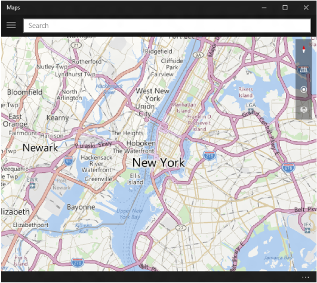

# Vue d’ensemble des cartes et de l’emplacement

Cette section explique comment afficher des cartes, utiliser les services de carte, rechercher l’emplacement et configurer une limite géographique dans votre application. Cette section vous montre également comment lancer l’application Cartes Windows pour obtenir une carte, un itinéraire ou un ensemble d’itinéraires détaillés spécifique.

> [!TIP]
> Pour en savoir plus sur l’utilisation des cartes et de l’emplacement dans votre application, téléchargez les exemples suivants à partir du [dépôt Windows-universal-samples](https://go.microsoft.com/fwlink/p/?LinkId=619979) sur GitHub :
-   [Exemple de carte pour UWP (plateforme Windows universelle)](https://go.microsoft.com/fwlink/p/?LinkId=619977)
-   [Exemple de géolocalisation UWP](https://go.microsoft.com/fwlink/p/?linkid=533278)

 

## Afficher des cartes

Affichez des cartes avec des vues 2D, 3D ou Streetview dans votre application à l’aide des API de l’espace de noms [**Windows.UI.Xaml.Controls.Maps**](https://docs.microsoft.com/uwp/api/Windows.UI.Xaml.Controls.Maps). Vous pouvez marquer des points d’intérêt sur la carte grâce à des punaises, des images, des formes ou des éléments d’interface utilisateur XAML. Vous pouvez également superposer des images sous forme de vignettes ou remplacer entièrement les images de la carte.

| Rubrique | Description |
|-------|-------------|
| [Demander une clé d’authentification de cartes](authentication-key.md) | Pour pouvoir utiliser le [**MapControl**](https://docs.microsoft.com/uwp/api/Windows.UI.Xaml.Controls.Maps.MapControl) et les services de carte dans l’espace de noms [**Windows.Services.Maps**](https://docs.microsoft.com/uwp/api/Windows.Services.Maps), votre application doit être authentifiée. Pour authentifier votre application, vous devez spécifier une clé d’authentification de cartes. Cet article décrit comment demander une clé d’authentification de cartes au [Centre de développement Bing Cartes](https://www.bingmapsportal.com/) et comment l’ajouter à votre application. |
| [Afficher des cartes avec des vues 2D, 3D et Streetside](display-maps.md) | Affichez des cartes personnalisables dans votre application en utilisant la classe [**MapControl**](https://docs.microsoft.com/uwp/api/Windows.UI.Xaml.Controls.Maps.MapControl). Cette rubrique présente également des vues 3D aériennes et Streetside. |
| [Afficher des POI (centres d’intérêt) sur une carte](display-poi.md) | Ajoutez des points d’intérêt à une carte à l’aide de punaises, d’images, de formes et d’éléments d’interface utilisateur XAML. |
| [Superposer des images sous forme de vignettes sur une carte](overlay-tiled-images.md) | Superposez des images sous forme de vignettes tierces ou personnalisées sur une carte à l’aide de sources de vignettes. Utilisez des sources de vignette pour superposer des informations spécifiques (informations météorologiques, démographiques, sismiques...) ou pour remplacer entièrement la carte par défaut. |

## Accéder aux services de carte

Ajoutez des itinéraires, des indications et des fonctionnalités de géocodage à votre application grâce aux API de l’espace de noms [**Windows.Services.Maps**](https://docs.microsoft.com/uwp/api/Windows.Services.Maps).

| Rubrique | Description |
|-----------------------------------------------------------|-----------------------------------------------------------------------------------------------------------------------------------------------------------------------------------------------------------------------------------------------------------------------------------------------------------------------------------------------|
| [Demander une clé d’authentification de cartes](authentication-key.md) | Pour pouvoir utiliser le [**MapControl**](https://docs.microsoft.com/uwp/api/Windows.UI.Xaml.Controls.Maps.MapControl) et les services de carte dans l’espace de noms [**Windows.Services.Maps**](https://docs.microsoft.com/uwp/api/Windows.Services.Maps), votre application doit être authentifiée. Pour authentifier votre application, vous devez spécifier une clé d’authentification de cartes. Cet article décrit comment demander une clé d’authentification de cartes au [Centre de développement Bing Cartes](https://www.bingmapsportal.com/) et comment l’ajouter à votre application. |
| [Afficher des POI (centres d’intérêt) sur une carte](display-poi.md) | Ajoutez des points d’intérêt à une carte à l’aide de punaises, d’images, de formes et d’éléments d’interface utilisateur XAML. |
| [Afficher des itinéraires et des indications](routes-and-directions.md) | Demandez des itinéraires et indications, et affichez-les dans votre application. |
| [Effectuer un géocodage et un géocodage inverse](geocoding.md) | Convertissez des adresses en emplacements géographiques (géocodage) et des emplacements géographiques en adresses (géocodage inverse) en appelant les méthodes de la classe [**MapLocationFinder**](https://docs.microsoft.com/uwp/api/Windows.Services.Maps.MapLocationFinder) dans l’espace de noms [**Windows.Services.Maps**](https://docs.microsoft.com/uwp/api/Windows.Services.Maps). |
| [Rechercher et télécharger des packages de cartes pour une utilisation hors connexion](https://docs.microsoft.com/uwp/api/windows.services.maps.offlinemaps)| Avant, votre application devait diriger les utilisateurs vers Paramètres pour télécharger des cartes hors connexion. Vous pouvez désormais utiliser les classes de l’espace de noms [Windows.Services.Maps.OfflineMaps](https://docs.microsoft.com/en-us/uwp/api/windows.services.maps.offlinemaps) pour rechercher les packages téléchargés dans une zone donnée (en fonction de [Geopoint](https://docs.microsoft.com/uwp/api/Windows.Devices.Geolocation.Geopoint), [GeoboundingBox](https://docs.microsoft.com/en-us/uwp/api/windows.devices.geolocation.geoboundingbox), etc.).   Vous pouvez également vérifier et écouter l’état de téléchargement des packages de cartes, et démarrer un téléchargement sans demander à l’utilisateur de quitter votre application.   Vous trouverez des exemples montrant comment procéder dans le contenu de référence et dans l’[exemple de carte UWP (plateforme Windows universelle)](https://go.microsoft.com/fwlink/p/?LinkId=619977).

## Obtenir l’emplacement de l’utilisateur

Utilisez les API de l’espace de noms [**Windows.Devices.Geolocation**](https://docs.microsoft.com/uwp/api/Windows.Devices.Geolocation) pour obtenir l’emplacement actuel de l’utilisateur et être notifié lors de changements d’emplacement dans votre application. Des éléments de ces API sont aussi fréquemment utilisés dans des paramètres des API de cartes. Les API de l’espace de noms [**Windows.Devices.Geolocation.Geofencing**](https://docs.microsoft.com/uwp/api/Windows.Devices.Geolocation.Geofencing) notifient votre application quand l’utilisateur franchit une limite géographique (entre dans une zone géographique prédéfinie ou en sort).

| Rubrique | Description |
|-------------------------------------------------------------------|---------------------------------------------------------------------------------------------------------------------------------------------------------------------------------------------------------------------------------------------------------------------------------------------------------------------------------------------------------------------------------------------------------------------------------------------------------------------------------------|
| [Demander une clé d’authentification de cartes](authentication-key.md) | Pour pouvoir utiliser le [**MapControl**](https://docs.microsoft.com/uwp/api/Windows.UI.Xaml.Controls.Maps.MapControl) et les services de carte dans l’espace de noms [**Windows.Services.Maps**](https://docs.microsoft.com/uwp/api/Windows.Services.Maps), votre application doit être authentifiée. Pour authentifier votre application, vous devez spécifier une clé d’authentification de cartes. Cet article décrit comment demander une clé d’authentification de cartes au [Centre de développement Bing Cartes](https://www.bingmapsportal.com/) et comment l’ajouter à votre application. |
| [Recommandations de conception pour les applications prenant en charge la géolocalisation](guidelines-and-checklist-for-detecting-location.md) | Recommandations en matière de performance des applications qui nécessitent de géolocaliser un utilisateur. |
| [Obtenir l’emplacement de l’utilisateur](get-location.md) | Demandez l’accès à l’emplacement de l’utilisateur, puis récupérez-le. | 
| [Recommandations pour l’utilisation du suivi des visites](guidelines-for-visits.md) | Découvrez comment utiliser la puissante fonctionnalité de suivi des visites pour rendre plus pratique le suivi de l’emplacement. |
| [Aide à la conception du geofencing](guidelines-for-geofencing.md) | Recommandations de performances pour les applications qui utilisent la fonctionnalité de geofencing. |
| [Configurer une limite géographique](set-up-a-geofence.md) | Configurez une limite géographique dans votre application et découvrez comment gérer les notifications au premier plan et en arrière-plan. |

## Lancer l’application Cartes Windows

Votre application peut lancer l’application Cartes Windows, comme illustré ici, pour afficher des cartes et des itinéraires détaillés spécifiques. Au lieu de fournir des fonctionnalités de carte directement dans votre application, envisagez d’utiliser l’application Cartes Windows. Pour plus d’informations, voir [Lancer l’application Cartes Windows](https://docs.microsoft.com/windows/uwp/launch-resume/launch-maps-app).

## Rubriques connexes

* [Exemple de carte UWP](https://go.microsoft.com/fwlink/p/?LinkId=619977)
* [Exemple de géolocalisation UWP](https://go.microsoft.com/fwlink/p/?linkid=533278)
* [Espace partenaires Bing Cartes](https://www.bingmapsportal.com/)
* [Obtenir l’emplacement actuel](get-location.md)
* [Recommandations de conception pour les applications prenant en charge la géolocalisation](guidelines-and-checklist-for-detecting-location.md)
* [Recommandations de conception pour les cartes](controls-map.md)
* [Recommandations de conception pour les applications prenant en charge la confidentialité](https://docs.microsoft.com/windows/uwp/security/index)
* [Vidéo de la build 2015 : Utilisation de cartes et de la localisation sur un téléphone, une tablette et un PC dans vos applications Windows](https://channel9.msdn.com/Events/Build/2015/2-757)
* [Exemple d’application de trafic UWP](https://go.microsoft.com/fwlink/p/?LinkId=619982)
