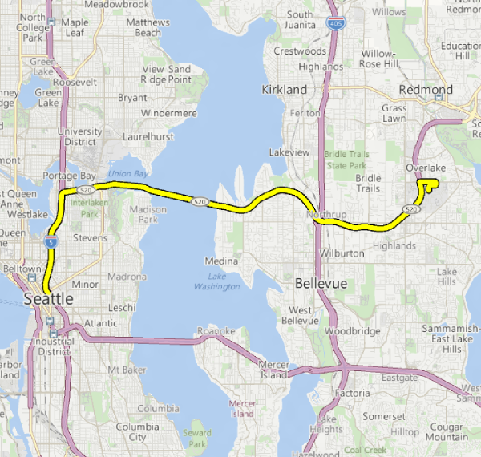

# <a name="display-routes-and-directions-on-a-map"></a>Afficher des itinéraires et indications sur une carte


Demandez des itinéraires et indications, et affichez-les dans votre app.

>[!Note]
>Pour plus d’informations sur l’utilisation de cartes dans votre app, téléchargez l’[exemple de carte pour plateforme Windows universelle (UWP)](http://go.microsoft.com/fwlink/p/?LinkId=619977).
>Si la cartographie n’est pas une fonction essentielle de votre app, envisagez de lancer l’app Cartes Windows à la place. Vous pouvez utiliser les schémas d’URI `bingmaps:`, `ms-drive-to:` et `ms-walk-to:` afin de lancer l’application Cartes Windows en accédant à des cartes, itinéraires et indications étape par étape spécifiques. Pour plus d’informations, voir [Lancer l’application Cartes Windows](https://msdn.microsoft.com/library/windows/apps/mt228341).

 
## <a name="an-intro-to-maproutefinder-results"></a>Introduction aux résultats de MapRouteFinder


Les classes pour les itinéraires et les indications sont associées comme suit :

* La classe [**MapRouteFinder**](https://msdn.microsoft.com/library/windows/apps/dn636938) dispose de méthodes qui permettent d’obtenir des itinéraires et des indications. Ces méthodes retournent un [**MapRouteFinderResult**](https://msdn.microsoft.com/library/windows/apps/dn636939).

* La classe [**MapRouteFinderResult**](https://msdn.microsoft.com/library/windows/apps/dn636939) contient un objet [**MapRoute**](https://msdn.microsoft.com/library/windows/apps/dn636937). Accédez à cet objet via la propriété [**Route**](https://msdn.microsoft.com/library/windows/apps/dn636940) de la classe **MapRouteFinderResult**.

* La classe [**MapRoute**](https://msdn.microsoft.com/library/windows/apps/dn636937) contient une collection d’objets [**MapRouteLeg**](https://msdn.microsoft.com/library/windows/apps/dn636955). Accédez à cette collection via la propriété [**Legs**](https://msdn.microsoft.com/library/windows/apps/dn636973) de la classe **MapRoute**.

* Chaque classe [**MapRouteLeg**](https://msdn.microsoft.com/library/windows/apps/dn636955) contient une collection d’objets [**MapRouteManeuver**](https://msdn.microsoft.com/library/windows/apps/dn636961). Accédez à cette collection via la propriété [**Maneuvers**](https://msdn.microsoft.com/library/windows/apps/dn636959) de la classe **MapRouteLeg**.

Obtenez des itinéraires et des indications pour des déplacements en voiture ou à pied en appelant les méthodes de la classe [**MapRouteFinder**](https://msdn.microsoft.com/library/windows/apps/dn636938). Par exemple, [**GetDrivingRouteAsync**](https://msdn.microsoft.com/library/windows/apps/dn636943) ou [**GetWalkingRouteAsync**](https://msdn.microsoft.com/library/windows/apps/dn636953).

Lorsque vous demandez un itinéraire:

* Vous pouvez indiquer uniquement un point de départ et un point d’arrivée, ou une série de positions pour calculer l’itinéraire.

    Les points de position *Arrêt* permettent d'ajouter des trajets supplémentaires, dotés de leur propre itinéraire. Pour spécifier des points de position *arrêt*, utilisez l'une des surcharges [**GetDrivingRouteFromWaypointsAsync**](https://docs.microsoft.com/uwp/api/windows.services.maps.maproutefinder.getwalkingroutefromwaypointsasync).

    Les points de position *Via* définissent des emplacements intermédiaires entre les points de position *Arrêt*. Ils n’ajoutent pas de trajets.  Il s'agit simplement de points de position traversés par un itinéraire. Pour spécifier des points de position *via*, utilisez l'une des surcharges [**GetDrivingRouteFromEnhancedWaypointsAsync**](https://docs.microsoft.com/uwp/api/windows.services.maps.maproutefinder.getdrivingroutefromenhancedwaypointsasync).

* Vous pouvez indiquer des paramètres d’optimisation (par exemple, réduction de la distance).

* Vous pouvez spécifier des restrictions (par exemple, aucun trajet par autoroute).

## <a name="display-directions"></a>Afficher des itinéraires

L’objet [**MapRouteFinderResult**](https://msdn.microsoft.com/library/windows/apps/dn636939) contient un objet [**MapRoute**](https://msdn.microsoft.com/library/windows/apps/dn636937) accessible via sa propriété [**Route**](https://msdn.microsoft.com/library/windows/apps/dn636940).

L’objet [**MapRoute**](https://msdn.microsoft.com/library/windows/apps/dn636937) calculé a des propriétés qui indiquent le temps pour parcourir l’itinéraire, la longueur de celui-ci et la collection d’objets [**MapRouteLeg**](https://msdn.microsoft.com/library/windows/apps/dn636955) qui contiennent les étapes de l’itinéraire. Chaque objet **MapRouteLeg** contient une collection d’objets [**MapRouteManeuver**](https://msdn.microsoft.com/library/windows/apps/dn636961). L’objet **MapRouteManeuver** contient des indications accessibles via sa propriété [**InstructionText**](https://msdn.microsoft.com/library/windows/apps/dn636964).

>[!IMPORTANT]
>Vous devez spécifier une clé d’authentification pour Cartes avant de pouvoir utiliser les services de carte. Pour plus d’informations, voir [Demander une clé d’authentification de cartes](authentication-key.md).

 

```csharp
using System;
using Windows.UI.Xaml;
using Windows.UI.Xaml.Controls;
using Windows.Services.Maps;
using Windows.Devices.Geolocation;
...
private async void button_Click(object sender, RoutedEventArgs e)
{
   // Start at Microsoft in Redmond, Washington.
   BasicGeoposition startLocation = new BasicGeoposition() {Latitude=47.643,Longitude=-122.131};

   // End at the city of Seattle, Washington.
   BasicGeoposition endLocation = new BasicGeoposition() {Latitude = 47.604,Longitude= -122.329};

   // Get the route between the points.
   MapRouteFinderResult routeResult =
         await MapRouteFinder.GetDrivingRouteAsync(
         new Geopoint(startLocation),
         new Geopoint(endLocation),
         MapRouteOptimization.Time,
         MapRouteRestrictions.None);

   if (routeResult.Status == MapRouteFinderStatus.Success)
   {
      System.Text.StringBuilder routeInfo = new System.Text.StringBuilder();

      // Display summary info about the route.
      routeInfo.Append("Total estimated time (minutes) = ");
      routeInfo.Append(routeResult.Route.EstimatedDuration.TotalMinutes.ToString());
      routeInfo.Append("\nTotal length (kilometers) = ");
      routeInfo.Append((routeResult.Route.LengthInMeters / 1000).ToString());

      // Display the directions.
      routeInfo.Append("\n\nDIRECTIONS\n");

      foreach (MapRouteLeg leg in routeResult.Route.Legs)
      {
         foreach (MapRouteManeuver maneuver in leg.Maneuvers)
         {
            routeInfo.AppendLine(maneuver.InstructionText);
         }
      }

      // Load the text box.
      tbOutputText.Text = routeInfo.ToString();
   }
   else
   {
      tbOutputText.Text =
            "A problem occurred: " + routeResult.Status.ToString();
   }
}
```

Cet exemple montre les résultats suivants dans la zone de texte `tbOutputText`.

``` syntax
Total estimated time (minutes) = 18.4833333333333
Total length (kilometers) = 21.847

DIRECTIONS
Head north on 157th Ave NE.
Turn left onto 159th Ave NE.
Turn left onto NE 40th St.
Turn left onto WA-520 W.
Enter the freeway WA-520 from the right.
Keep left onto I-5 S/Portland.
Keep right and leave the freeway at exit 165A towards James St..
Turn right onto James St.
You have reached your destination.
```

## <a name="display-routes"></a>Afficher des itinéraires


Pour afficher un [**MapRoute**](https://msdn.microsoft.com/library/windows/apps/dn636937) sur un [**MapControl**](https://msdn.microsoft.com/library/windows/apps/dn637004), créez un [**MapRouteView**](https://msdn.microsoft.com/library/windows/apps/dn637122) avec **MapRoute**. Ajoutez ensuite **MapRouteView** à la collection [**Routes**](https://msdn.microsoft.com/library/windows/apps/dn637047) de **MapControl**.

>[!IMPORTANT]
>Pour pouvoir utiliser les services de carte ou le contrôle de carte, vous devez spécifier une clé d’authentification de cartes. Pour plus d’informations, voir [Demander une clé d’authentification de cartes](authentication-key.md).

 

```csharp
using System;
using Windows.Devices.Geolocation;
using Windows.Services.Maps;
using Windows.UI;
using Windows.UI.Xaml.Controls;
using Windows.UI.Xaml.Controls.Maps;
...
private async void ShowRouteOnMap()
{
   // Start at Microsoft in Redmond, Washington.
   BasicGeoposition startLocation = new BasicGeoposition() { Latitude = 47.643, Longitude = -122.131 };

   // End at the city of Seattle, Washington.
   BasicGeoposition endLocation = new BasicGeoposition() { Latitude = 47.604, Longitude = -122.329 };


   // Get the route between the points.
   MapRouteFinderResult routeResult =
         await MapRouteFinder.GetDrivingRouteAsync(
         new Geopoint(startLocation),
         new Geopoint(endLocation),
         MapRouteOptimization.Time,
         MapRouteRestrictions.None);

   if (routeResult.Status == MapRouteFinderStatus.Success)
   {
      // Use the route to initialize a MapRouteView.
      MapRouteView viewOfRoute = new MapRouteView(routeResult.Route);
      viewOfRoute.RouteColor = Colors.Yellow;
      viewOfRoute.OutlineColor = Colors.Black;

      // Add the new MapRouteView to the Routes collection
      // of the MapControl.
      MapWithRoute.Routes.Add(viewOfRoute);

      // Fit the MapControl to the route.
      await MapWithRoute.TrySetViewBoundsAsync(
            routeResult.Route.BoundingBox,
            null,
            Windows.UI.Xaml.Controls.Maps.MapAnimationKind.None);
   }
}
```

Cet exemple affiche ce qui suit sur un [**MapControl**](https://msdn.microsoft.com/library/windows/apps/dn637004) nommé **MapWithRoute**.



Voici une version de cet exemple utilisant un point de position *via* entre deux points de position *arrêt*:

```csharp
using System;
using Windows.Devices.Geolocation;
using Windows.Services.Maps;
using Windows.UI;
using Windows.UI.Xaml.Controls;
using Windows.UI.Xaml.Controls.Maps;
...
private async void ShowRouteOnMap()
{
  Geolocator locator = new Geolocator();
  locator.DesiredAccuracyInMeters = 1;
  locator.PositionChanged += Locator_PositionChanged;

  BasicGeoposition point1 = new BasicGeoposition() { Latitude = 47.649693, Longitude = -122.144908 };
  BasicGeoposition point2 = new BasicGeoposition() { Latitude = 47.6205, Longitude = -122.3493 };
  BasicGeoposition point3 = new BasicGeoposition() { Latitude = 48.649693, Longitude = -122.144908 };

  // Get Driving Route from point A  to point B thru point C
  var path = new List<EnhancedWaypoint>();

  path.Add(new EnhancedWaypoint(new Geopoint(point1), WaypointKind.Stop));
  path.Add(new EnhancedWaypoint(new Geopoint(point2), WaypointKind.Via));
  path.Add(new EnhancedWaypoint(new Geopoint(point3), WaypointKind.Stop));

  MapRouteFinderResult routeResult =  await MapRouteFinder.GetDrivingRouteFromEnhancedWaypointsAsync(path);

  if (routeResult.Status == MapRouteFinderStatus.Success)
  {
      MapRouteView viewOfRoute = new MapRouteView(routeResult.Route);
      viewOfRoute.RouteColor = Colors.Yellow;
      viewOfRoute.OutlineColor = Colors.Black;

      myMap.Routes.Add(viewOfRoute);

      await myMap.TrySetViewBoundsAsync(
            routeResult.Route.BoundingBox,
            null,
            Windows.UI.Xaml.Controls.Maps.MapAnimationKind.None);
  }
}
```

## <a name="related-topics"></a>Rubriquesassociées

* [Centre de développement Bing Cartes](https://www.bingmapsportal.com/)
* [Exemple de carte UWP](http://go.microsoft.com/fwlink/p/?LinkId=619977)
* [Recommandations en matière de conception pour les cartes](https://msdn.microsoft.com/library/windows/apps/dn596102)
* [Vidéos de la build 2015: utilisation des cartes et de la localisation sur un téléphone, une tablette et un PC dans vos applications Windows](https://channel9.msdn.com/Events/Build/2015/2-757)
* [Exemple d’application de trafic UWP](http://go.microsoft.com/fwlink/p/?LinkId=619982)
