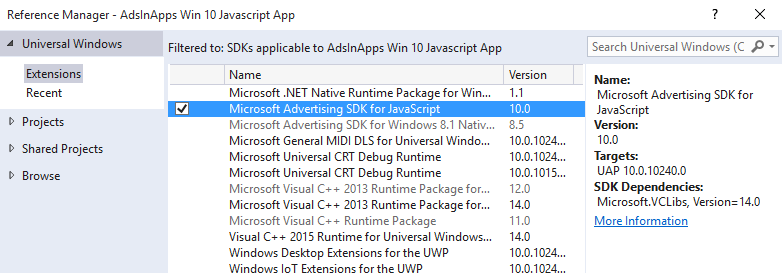

# AdControl in HTML 5 and JavaScript


This walkthrough shows how to use the [AdControl](https://msdn.microsoft.com/library/windows/apps/microsoft.advertising.winrt.ui.adcontrol.aspx) class to display banner ads in a JavaScript/HTML app for Windows 10 (UWP), Windows 8.1, or Windows Phone 8.1. This walkthrough does not use the **AdMediatorControl** or ad mediation.

For a complete sample project that demonstrates how to add banner ads to a JavaScript/HTML app, see the [advertising samples on GitHub](http://aka.ms/githubads).

## Prerequisites


* For UWP apps: install the [Microsoft Store Services SDK](http://aka.ms/store-em-sdk) with Visual Studio 2015.
* For Windows 8.1 or Windows Phone 8.1 apps: install the [Microsoft Advertising SDK for Windows and Windows Phone 8.x](http://aka.ms/store-8-sdk) with Visual Studio 2015 or Visual Studio 2013.

> **Note** If you have installed Windows 10 Anniversary SDK Preview Build 14295 or later with Visual Studio 2015, you must also install the WinJS library. This library used to be included in previous versions of the Windows SDK for Windows 10, but starting with the Windows 10 Anniversary SDK Preview Build 14295 this library must be installed separately. To install WinJS, see [Get WinJS](http://try.buildwinjs.com/download/GetWinJS/).

## Code development

1. In Visual Studio, open your project or create a new project.

2. If your project targets **Any CPU**, update your project to use an architecture-specific build output (for example, **x86**). If your project targets **Any CPU**, you will not be able to successfully add a reference to the Microsoft advertising library in the following steps. For more information, see [Reference errors caused by targeting Any CPU in your project](known-issues-for-the-advertising-libraries.md#reference_errors).

3.  From the **Solution Explorer** window, right click **References**, and select **Add Reference…**

4.  In **Reference Manager**, select one of the following references depending on your project type:

    -   For a Universal Windows Platform (UWP) project: Expand **Universal Windows**, click **Extensions**, and then select the check box next to **Microsoft Advertising SDK for JavaScript** (Version 10.0).

    -   For a Windows 8.1 project: Expand **Windows 8.1**, click **Extensions**, and then select the check box next to **Microsoft Advertising SDK for Windows 8.1 Native (JS)**.

    -   For a Windows 8.1 project: Expand **Windows Phone 8.1**, click **Extensions**, and then select the check box next to **Microsoft Advertising SDK for Windows Phone 8.1 Native (JS)**.

    

    > **Note**  This image is for Visual Studio 2015 building a UWP project for Windows 10. If you are building a Windows 8.1 or Windows Phone 8.1 app or using Visual Studio 2013, your screen will look different.

5.  In **Reference Manager**, click OK.

6.  Open the default.html file (or other html file as appropriate for your project).

7.  In the **&lt;head&gt;** section, after the project’s JavaScript references of default.css and default.js, add the reference to ad.js.

    In a UWP project, add the following code.

    ``` syntax
    <!-- Microsoft advertising required references -->
    <script src="//Microsoft.Advertising.JavaScript/ad.js"></script>
    ```

    In a Windows 8.1 or Windows Phone 8.1 project, add the following code.

    ``` syntax
    <!-- Microsoft advertising required references -->
    <script src="/MSAdvertisingJS/ads/ad.js"></script>
    ```

    > **Note**&nbsp;&nbsp;This line must be placed in the **&lt;head&gt;** section after the include of default.js; otherwise, you will encounter an error when you build your project.

8.  Modify the **&lt;body&gt;** section in the default.html file (or other html file as appropriate for your project) to include the div for the **AdControl**. Assign the **applicationId** and **adUnitId** properties in the **AdControl** to the test values provided in [Test mode values](test-mode-values.md), and adjust the height and width of the control so it is one of the [supported ad sizes for banner ads](supported-ad-sizes-for-banner-ads.md).

    > **Note**&nbsp;&nbsp;You will replace the test **applicationId** and **adUnitId** values with live values before submitting your app for submission.

    ``` syntax
    <div id="myAd" style="position: absolute; top: 50px; left: 0px; width: 300px; height: 250px; z-index: 1"
          data-win-control="MicrosoftNSJS.Advertising.AdControl"
          data-win-options="{applicationId: '3f83fe91-d6be-434d-a0ae-7351c5a997f1', adUnitId: '10865270'}">
    </div>
    ```

9.  Compile and run the app to see it with an ad.

## Release your app with live ads using Windows Dev Center


1.  In the Dev Center dashboard, go to the **Monetization** &gt; **Monetize with ads** page for your app, and [create a standalone Microsoft Advertising unit](../publish/monetize-with-ads.md). For the ad unit type, specify **Banner**. Make note of both the ad unit ID and the application ID.

2.  In your code, replace the test ad unit values (**applicationId** and **adUnitId**) with the live values you generated in Dev Center.

3.  [Submit your app](../publish/app-submissions.md) to the Store using the Dev Center dashboard.

4.  Review your [advertising performance reports](../publish/advertising-performance-report.md) in the Dev Center dashboard.

## Complete default.html for a sample UWP project


``` syntax
<!DOCTYPE html>
<html>
<head>
    <meta charset="utf-8" />
    <title>My_Windows_10_Ad_Funded_JavaScript_App</title>

    <!-- WinJS references -->
    <link href="//Microsoft.WinJS.2.0.Preview/css/ui-dark.css" rel="stylesheet" />
    <script src="//Microsoft.WinJS.2.0.Preview/js/base.js"></script>
    <script src="//Microsoft.WinJS.2.0.Preview/js/ui.js"></script>

    <!-- My_Windows_10_Ad_Funded_JavaScript_App references -->
    <link href="/css/default.css" rel="stylesheet" />
    <script src="/js/default.js"></script>

    <!-- Microsoft advertising required references -->
    <script src="//Microsoft.Advertising.JavaScript/ad.js"></script>
</head>
<body>
    <div id="myAd" style="position: absolute; top: 50px; left: 0px; width: 300px; height: 250px; z-index: 1"
      data-win-control="MicrosoftNSJS.Advertising.AdControl"
      data-win-options="{applicationId: '3f83fe91-d6be-434d-a0ae-7351c5a997f1', adUnitId: '10865270'}">
    </div>
    <p>Content goes here</p>
</body>
</html>
```

## Related topics

* [Advertising samples on GitHub](http://aka.ms/githubads)
 

 


<!--HONumber=Sep16_HO2-->


