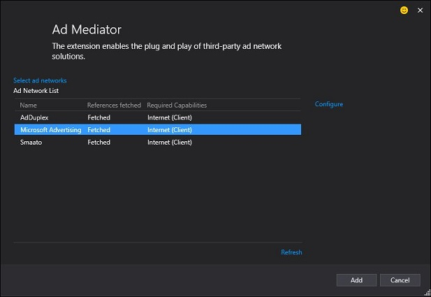
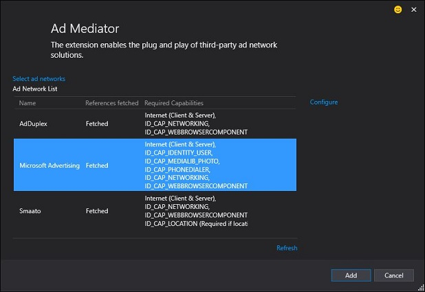
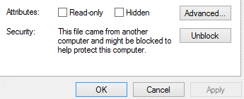

# Ajouter et utiliser le contrôle Ad Mediator


\[ Mise à jour pour les applications UWP sur Windows 10. Pour les articles sur Windows 8.x, voir l’[archive](http://go.microsoft.com/fwlink/p/?linkid=619132) \]


Après [avoir installé le Kit de développement logiciel (SDK) d’engagement et de monétisation de la Boutique Microsoft](http://aka.ms/store-em-sdk), suivez les instructions de cette rubrique pour utiliser le contrôle Ad Mediator dans votre application. Pour obtenir la liste des réseaux publicitaires et des types de projet actuellement pris en charge par la médiation publicitaire, voir [Sélectionner et gérer vos réseaux publicitaires](select-and-manage-your-ad-networks.md).

## Ajouter le contrôle Ad Mediator à votre projet


Ajouter une instance du contrôle Ad Mediator à votre projet :

1.  Ouvrez votre projet dans Visual Studio.
2.  Si vous ajoutez la fonction de médiation publicitaire à une application qui gère déjà la monétisation avec l’un des [réseaux publicitaires](select-and-manage-your-ad-networks.md) pris en charge par cette médiation, supprimez au préalable l’implémentation publicitaire existante et toutes ses références.
3.  Dans l’**Explorateur de solutions**, recherchez la page de votre application dans laquelle vous souhaitez afficher des publicités, puis double-cliquez sur la page pour l’ouvrir dans le concepteur.
4.  À partir de la **boîte à outils**, faites glisser un nouveau **AdMediatorControl** dans le concepteur (veillez à faire glisser le contrôle dans le concepteur et non dans votre code XAML). Placez le contrôle à l’emplacement auquel vous souhaitez faire apparaître vos publicités. Vous pouvez ajouter plusieurs contrôles si vous voulez afficher des publicités dans plusieurs zones de votre application.

    L’élément **AdMediatorControl** est situé dans les emplacements suivants de la **boîte à outils** :

    -   Dans un projet de plateforme Windows universelle, utilisez l’élément **AdMediatorControl** de la section **AdMediator Universal**.
    -   Dans un projet Windows 8.1 ou Windows Phone 8.1 utilisant C# ou Visual Basic avec XAML, utilisez l’élément **AdMediatorControl** de la section **AdMediator**.
    -   Dans un projet Silverlight Windows Phone, utilisez l’élément **AdMediatorControl** de la section **Tous les contrôles Windows Phone**.

    > **Remarque** Lorsque vous faites glisser le contrôle **AdMediatorControl** vers le concepteur pour la première fois dans un projet UWP, Windows 8.1 ou Windows Phone 8.1 à l’aide de C# ou de Visual Basic avec XAML, Visual Studio ajoute la référence appropriée d’assembly Ad Mediator à votre projet, mais le contrôle n’est, à ce stade, pas encore ajouté au concepteur. Pour ajouter le contrôle, cliquez sur OK dans le message apparaissant dans Visual Studio, attendez quelques secondes que le concepteur s’actualise, puis faites glisser de nouveau le contrôle vers le concepteur. Si vous ne réussissez toujours pas à ajouter le contrôle au concepteur, vérifiez que votre projet cible l’architecture de processeur requise par votre application (par exemple, **x86**), et pas **Toute UC**. Le contrôle ne peut pas être ajouté au concepteur si le projet cible **Toute UC** pour la plateforme de génération.

5.  Visual Studio ajoute une référence d’assembly Ad Mediator à votre projet et insère XAML pour le contrôle Ad Mediator dans la page actuelle, en lui associant un identifiant unique et un nom. La référence d’assembly et le code XAML varient en fonction de votre plateforme cible. Par exemple, pour une application UWP, le nom de l’assembly est **Microsoft.AdMediator.Universal**, et le code XAML généré ressemble à l’exemple suivant.

    ```xml
    // Code that gets added to the XAML page header
    xmlns:Universal="using:Microsoft.AdMediator.Universal"

    // Code that gets added for the ad mediator control
    <Universal:AdMediatorControl x:Name="AdMediator_3D4884"
      Grid.ColumnSpan="2" HorizontalAlignment="Left" Height="250"
      Id="AdMediator-Id-D1FDFDA7-EABB-474C-940C-ECA7FBCFF143" Margin="121,175,0,0"
      VerticalAlignment="Top" Width="300"/>
    ```

    L’élément **Name** vous aide à identifier le contrôle spécifique dans votre application lorsque vous configurez la médiation publicitaire. Vous pouvez le remplacer par la valeur de votre choix. Cependant, vous ne devez ni modifier ni dupliquer l’élément **Id**. Cet **Id** doit être unique pour chaque contrôle de votre application.

6.  Ajustez la taille et la position du contrôle si besoin. Pour en savoir plus, voir [Ajuster la taille et la position](#adjust-size-and-position).

## Configurer des réseaux publicitaires

Après avoir ajouté tous les contrôles souhaités, vous êtes prêt à configurer les réseaux publicitaires via les Services connectés.

> **Important** Si, plus tard, vous ajoutez un élément AdMediatorControl supplémentaire, vous devez également le configurer via les Services connectés. Dans le cas contraire, le nouveau contrôle ne sera pas en mesure d’utiliser la fonction de médiation publicitaire.

Pour configurer les réseaux publicitaires :

1.  Dans l’Explorateur de solutions, cliquez avec le bouton droit sur le nom du projet, cliquez sur **Ajouter**, puis sur **Service connecté...** pour lancer la fenêtre **Ajouter un service connecté** (Visual Studio 2015) ou la fenêtre **Gestionnaire de services** (Visual Studio 2013).
2.  Si vous utilisez Visual Studio 2015, cliquez sur **Ad Mediator**, puis sur **Configurer** pour ouvrir la fenêtre **Ad Mediator**. Si vous utilisez Visual Studio 2013, cliquez simplement sur **Ad Mediator** dans le volet gauche du **Gestionnaire de services**.

    Le fichier AdMediator.config est ajouté à votre projet. C’est dans ce fichier que les paramètres initiaux de configuration des réseaux publicitaires sont enregistrés localement dans votre projet.

3.  Dans la fenêtre **Ad Mediator** (Visual Studio 2015) ou **Gestionnaire de services** (Visual Studio 2013), cliquez sur **Sélectionner les réseaux publicitaires**, sélectionnez les réseaux publicitaires à utiliser, puis cliquez sur **OK** dans la fenêtre **Sélectionner les réseaux publicitaires**.

    > **Conseil** Il est conseillé d’ajouter tous les réseaux pour lesquels vous disposez de compte, même si vous ne prévoyez pas d’utiliser dès le départ l’ensemble de ces réseaux dans votre application. Une fois l’application publiée, vous serez en mesure de configurer la fréquence d’utilisation de chaque réseau dans le Centre de développement (ou d’utiliser un réseau auquel vous n’aviez pas accès auparavant) sans en avoir à modifier le code ou soumettre l’application une nouvelle fois.

    Visual Studio récupère les assemblys requis pour les réseaux publicitaires sélectionnés et ajoute leurs références à votre projet. Une fois ce processus terminé, cliquez sur **OK** dans la boîte de dialogue **État de l’extraction**.

4.  Dans la fenêtre **Ad Mediator** (Visual Studio 2015) ou **Gestionnaire de services** (Visual Studio 2013), sélectionnez éventuellement chaque réseau et cliquez sur **Configurer** pour entrer les informations de configuration de chaque réseau à utiliser pendant le test de l’application. Ces informations sont enregistrées dans le fichier AdMediator.config de votre projet. Vous pourrez les modifier lors de la configuration du comportement des réseaux publicitaires dans le tableau de bord du Centre de développement Windows. Pour plus d’informations, voir [Soumission de votre application et configuration d’une médiation publicitaire](submit-your-app-and-configure-ad-mediation.md).
    > **Remarque** Si vous n’entrez pas d’informations de configuration au cours de cette étape, la médiation publicitaire utilise automatiquement les valeurs de configuration de test lors de l’exécution de l’application sur votre ordinateur de développement (pour les applications UWP et Windows 8.1 XAML) ou sur l’émulateur ou l’appareil (pour les applications Windows Phone).

5.  Dans la fenêtre **Ad Mediator** (Visual Studio 2015) ou **Gestionnaire de services** (Visual Studio 2013), vérifiez que chaque réseau publicitaire sélectionné affiche la mention **Élément extrait**. Cliquez sur **OK** pour envoyer les modifications à votre projet.

> **Remarque** Si vous procédez ensuite à une mise à niveau vers une version plus récente du Kit de développement logiciel (SDK) d’engagement et de monétisation de la Boutique Microsoft, vous devrez de nouveau ouvrir **Services connectés** pour vérifier que chaque fichier DLL de réseau publicitaire extrait automatiquement est bien mis à jour.

### Déclarer les fonctionnalités requises

Chaque réseau publicitaire peut requérir certaines fonctionnalités de l’application. Celles-ci sont indiquées par chaque fournisseur dans la fenêtre **Ad Mediator** (pour Visual Studio 2015) ou **Gestionnaire de services** (pour Visual Studio 2013). Veillez à déclarer toutes les fonctionnalités requises dans le manifeste de votre application, afin que les publicités s’affichent correctement.

La capture d’écran suivante indique les fonctionnalités requises pour plusieurs réseaux publicitaires dans une application XAML Windows 8.1 ou Windows Phone 8.1.



La capture d’écran suivante indique les fonctionnalités requises pour plusieurs réseaux publicitaires dans une application Silverlight Windows Phone 8.1.


### Extraire manuellement des fichiers DLL de réseaux publicitaires

Dans certains cas, vous pourrez constater que certains fichiers n’ont pas été récupérés : il vous faudra les ajouter manuellement. Pour obtenir des liens permettant de télécharger des assemblys individuels, voir [Sélection et gestion de vos réseaux publicitaires](select-and-manage-your-ad-networks.md).

> **Remarque** Lorsque vous ajoutez des fichiers DLL manuellement, il se peut que le message d’erreur suivant s’affiche : « Une référence à une version supérieure ou à un assembly incompatible ne peut être ajoutée au projet. ». Pour corriger cette erreur, cliquez avec le bouton droit sur le fichier DLL dans l’Explorateur, puis sélectionnez **Propriétés**. Dans la section Sécurité, cliquez sur **Débloquer**.


## Ajuster la taille et la position

Vous pouvez configurer la taille et la position du contrôle Ad Mediator dans le concepteur ou dans votre code XAML. Assurez-vous que cette taille sera suffisante pour inclure toutes les publicités que vous allez afficher à partir de vos réseaux publicitaires. Certains réseaux publicitaires risquent de ne pas pouvoir proposer une publicité s’ils détectent une taille de zone de dessin insuffisante pour l’affichage de cette publicité dans son ensemble. Si l’un des blocs de publicité est plus volumineux que ce qu’autorise la taille par défaut, vous pouvez ajuster la zone de dessin afin qu’elle puisse l’inclure.

Lorsque vous faites glisser le contrôle dans le concepteur, les tailles du contrôle par défaut sont :

-   UWP et Windows 8.1 XAML : 300 x 250 (largeur x hauteur).
-   Windows Phone 8.1 XAML : 400 x 67 (largeur x hauteur).
-   Windows Phone 8 et Windows Phone 8.1 Silverlight : 480 x 80 (largeur x hauteur).

Vous pouvez remplacer les tailles par défaut des publicités à l’aide des paramètres facultatifs **Width** et **Height**, comme indiqué ci-dessous.

```CSharp
myAdMediatorControl.AdSdkOptionalParameters[AdSdkNames.Smaato]["Width"] = 400;
myAdMediatorControl.AdSdkOptionalParameters[AdSdkNames.Smaato]["Height"] = 80;
```

Vous pouvez également spécifier la position de chaque contrôle de façon à prendre en charge différents emplacements et tailles, en fonction des besoins de votre application. Dans le cas de certains réseaux publicitaires, vous pouvez utiliser des paramètres facultatifs pour effectuer des ajustements. Par exemple, pour aligner des publicités provenant de Microsoft Advertising sur la partie inférieure gauche de la fenêtre :

```CSharp
myAdMediatorControl.AdSdkOptionalParameters[AdSdkNames.MicrosoftAdvertising]["HorizontalAlignment"] = HorizontalAlignment.Left;
myAdMediatorControl.AdSdkOptionalParameters[AdSdkNames.MicrosoftAdvertising]["VerticalAlignment"] = VerticalAlignment.Bottom;
```

### Tailles de publicités prises en charge pour Microsoft Advertising

Microsoft Advertising prend uniquement en charge les publicités dans les tailles standard suivantes recommandées par l’Interactive Advertising Bureau (IAB) pour les applications exécutées sur les plateformes suivantes.

-   Windows 10 et Windows 8.1 :
    -   160 x 600
    -   300 x 250
    -   300 x 600
    -   728 x 90
-   Windows 10 Mobile, Windows Phone 8.1 et Windows Phone 8 :
    -   300 x 50
    -   320 x 50
    -   480 x 80 (cette taille est prise en charge uniquement pour Silverlight Windows Phone)
    -   640 x 100

Vous souhaiterez peut-être spécifier une taille de contrôle Ad Mediator qui ne correspond pas à l’une des tailles de publicités prises en charge par Microsoft Advertising (par exemple, vous pouvez souhaiter procéder ainsi si une taille différente est davantage adaptée à l’interface utilisateur de votre application, ou si vous ciblez également d’autres réseaux publicitaires qui prennent en charge d’autres tailles de publicités). Pour ce faire, spécifiez la taille de contrôle exacte souhaitée dans le concepteur ou dans votre code XAML, puis définissez les paramètres facultatifs **Width** et **Height** pour Microsoft Advertising sur la taille prise en charge la plus proche qui s’adaptera aux limites du contrôle. Le contrôle s’affiche à la taille exacte que vous spécifiez dans le concepteur, mais Microsoft Advertising affiche des publicités correspondant à la taille spécifiée à l’aide des paramètres facultatifs **Width** et **Height**.

Par exemple, si vous avez une application UWP et que vous souhaitez que votre contrôle Ad Mediator s’affiche au format 300 x 300, définissez le contrôle sur 300 x 300 dans le concepteur ou dans votre code XAML. Ensuite, définissez le paramètre facultatif **Width** sur 300 et le paramètre facultatif **Height** sur 250 pour Microsoft Advertising, comme indiqué dans le code suivant.

```CSharp
myAdMediatorControl.AdSdkOptionalParameters[AdSdkNames.MicrosoftAdvertising]["Width"] = 300;
myAdMediatorControl.AdSdkOptionalParameters[AdSdkNames.MicrosoftAdvertising]["Height"] = 250;
```

Pour vérifier que vos paramètres de taille sont compatibles avec Microsoft Advertising, [testez l’implémentation de votre médiation publicitaire](test-your-ad-mediation-implementation.md) et assurez-vous que les publicités de test envoyées par Microsoft Advertising s’affichent.

## Suspendre, reprendre et désactiver la médiation publicitaire

Pour suspendre la médiation publicitaire pendant une période donnée lors de l’exécution de l’application, utilisez la méthode AdMediatorControl.Pause(). Notez que lorsque vous effectuez cette opération, la publicité la plus récente continue d’apparaître jusqu’à ce que vous relanciez la médiation en appelant la méthode AdMediatorControl.Resume().

Pour désactiver complètement Ad Mediator, utilisez la méthode AdMediatorControl.Disable(). Cette dernière supprime les publicités qui sont affichées et réduit l’encombrement mémoire de la fonction de médiation publicitaire. Vous pouvez appeler la méthode AdMediatorControl.Resume() pour reprendre la médiation. Notez cependant que le démarrage sera plus lent que d’habitude après la désactivation de la médiation publicitaire.

## Définir des délais d’attente

Vous pouvez spécifier le nombre de secondes (de 2 à 60) définissant le temps d’attente de la médiation publicitaire après qu’elle a demandé une publicité au réseau publicitaire, avant qu’elle n’abandonne cette demande et n’en adresse une autre à un autre réseau. Par défaut, le délai d’attente pour tous les réseaux publicitaires est de 15 secondes.

Le code ci-dessous indique comment spécifier un délai d’attente pour Microsoft Advertising. Vous pouvez modifier les différents réseaux et durées selon vos besoins.

```CSharp
myAdMediatorControl.AdSdkTimeouts[AdSdkNames.MicrosoftAdvertising] = TimeSpan.FromSeconds(10);
```

> **Remarque** Vous pouvez également définir le délai d’attente dans la page **Monétiser avec des publicités** du tableau de bord du Centre de développement. Si vous définissez le délai d’attente dans le code et dans le tableau de bord, la valeur que vous définissez dans le code remplacera la valeur du tableau de bord.

## Gestion des événements

L’ajout de code pour enregistrer les événements et capturer les erreurs de médiation publicitaire peut vous aider à résoudre les différents problèmes. L’exemple de code ci-dessous ajoute des gestionnaires d’événements pour des événements spécifiques à partir d’un contrôle.

```CSharp
// add this during initialization of your app

    AdMediator_Bottom.AdSdkError += AdMediator_Bottom_AdError;
    AdMediator_Bottom.AdMediatorFilled += AdMediator_Bottom_AdFilled;
    AdMediator_Bottom.AdMediatorError += AdMediator_Bottom_AdMediatorError;
    AdMediator_Bottom.AdSdkEvent += AdMediator_Bottom_AdSdkEvent;

// and then add these functions

void AdMediator_Bottom_AdSdkEvent(object sender, Microsoft.AdMediator.Core.Events.AdSdkEventArgs e)
{
    Debug.WriteLine("AdSdk event {0} by {1}", e.EventName, e.Name);}

void AdMediator_Bottom_AdMediatorError(object sender, Microsoft.AdMediator.Core.Events.AdMediatorFailedEventArgs e)
{
    Debug.WriteLine("AdMediatorError:" + e.Error + " " + e.ErrorCode );
    // if (e.ErrorCode == AdMediatorErrorCode.NoAdAvailable)
    // AdMediator will not show an ad for this mediation cycle
}

void AdMediator_Bottom_AdFilled(object sender, Microsoft.AdMediator.Core.Events.AdSdkEventArgs e)
{
    Debug.WriteLine("AdFilled:" + e.Name);
}

void AdMediator_Bottom_AdError(object sender, Microsoft.AdMediator.Core.Events.AdFailedEventArgs e)
{
    Debug.WriteLine("AdSdkError by {0} ErrorCode: {1} ErrorDescription: {2} Error: {3}", e.Name, e.ErrorCode, e.ErrorDescription, e.Error);
}
```

## Administrer des exceptions non gérées à partir des réseaux publicitaires

> **Remarque** Dans le cadre de notre test, nous avons identifié un certain nombre d’exceptions non prises en charge à partir de réseaux publicitaires spécifiques, qui doivent être administrées dans l’application afin d’éviter les blocages d’application liés à celles-ci. Nous vous recommandons vivement de copier-coller l’exemple de code ci-dessous dans votre fichier App.xaml.cs.

Code à utiliser pour UWP, Windows 8.1 ou une application Windows Phone utilisant C# et XAML

```CSharp
// In App.xaml.cs file, register with the UnhandledException event handler.
UnhandledException += App_UnhandledException;

void App_UnhandledException(object sender, UnhandledExceptionEventArgs e)
   {
      if (e != null)
      {
         Exception exception = e.Exception;
         if (exception is NullReferenceException && exception.ToString().ToUpper().Contains("SOMA"))
         {
            Debug.WriteLine("Handled Smaato null reference exception {0}", exception);
            e.Handled = true;
            return;
         }
      }
// APP SPECIFIC HANDLING HERE

   if (Debugger.IsAttached)
      {
         // An unhandled exception has occurred; break into the debugger
         Debugger.Break();
      }
   }
```

Code à utiliser pour une application Silverlight pour Windows Phone

```CSharp
// In App.xaml.cs file, register with the UnhandledException event handler.
UnhandledException += Application_UnhandledException;

// Code to execute on unhandled exceptions
private void Application_UnhandledException(object sender, ApplicationUnhandledExceptionEventArgs e)
{
    if (e != null)
   {
       Exception exception = e.ExceptionObject;
       if ((exception is XmlException || exception is NullReferenceException) && exception.ToString().ToUpper().Contains("INNERACTIVE"))
       {
           Debug.WriteLine("Handled Inneractive exception {0}", exception);
           e.Handled = true;
           return;
       }
       else if (exception is NullReferenceException && exception.ToString().ToUpper().Contains("SOMA"))
       {
           Debug.WriteLine("Handled Smaato null reference exception {0}", exception);
           e.Handled = true;
           return;
       }
       else if ((exception is System.IO.IOException || exception is NullReferenceException) && exception.ToString().ToUpper().Contains("GOOGLE"))
      {
          Debug.WriteLine("Handled Google exception {0}", exception);
          e.Handled = true;
          return;
       }
       else if ((exception is NullReferenceException || exception is XamlParseException) && exception.ToString().ToUpper().Contains("MICROSOFT.ADVERTISING"))
       {
           Debug.WriteLine("Handled Microsoft.Advertising exception {0}", exception);
           e.Handled = true;
           return;
       }

   }
// APP SPECIFIC HANDLING HERE

if (Debugger.IsAttached)
   {
       // An unhandled exception has occurred; break into the debugger
       Debugger.Break();
   }
   //e.Handled = true;
}
```

## Rubriques connexes

* [Sélectionner et gérer vos réseaux publicitaires](select-and-manage-your-ad-networks.md)
* [Tester l’implémentation de votre médiation publicitaire](test-your-ad-mediation-implementation.md)
* [Soumettre votre application et configurer une médiation publicitaire](submit-your-app-and-configure-ad-mediation.md)
* [Résoudre les problèmes liés à la médiation publicitaire](troubleshoot-ad-mediation.md)
 

 


<!--HONumber=May16_HO2-->


