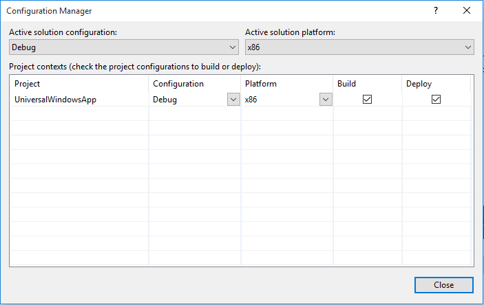

# Problèmes connus et résolution des problèmes des publicités dans les applications

Cette rubrique répertorie les problèmes connus de la version actuelle du SDK Microsoft Advertising. Pour plus d'aide à la résolution des problèmes, consultez les rubriques suivantes.

* [Guide de résolution des problèmes pour HTML et JavaScript](html-and-javascript-troubleshooting-guide.md)
* [Guide de résolution des problèmes pour XAML et C#](xaml-and-c-troubleshooting-guide.md)

## Interface AdControl inconnue en XAML

Le balisageXAML d’un contrôle [AdControl](https://msdn.microsoft.com/library/windows/apps/microsoft.advertising.winrt.ui.adcontrol.aspx) peut afficher incorrectement une ligne courbe bleue impliquant que l’interface est inconnue. Ce problème se produit uniquement lors d’un ciblagex86, et peut être ignoré.

## Élément lastError de la demande de publicité précédente

S’il reste un élément **lastError** de la demande de publicité précédente, l’événement peut être déclenché deuxfois durant le prochain appel de publicité. Si la nouvelle demande de publicité est toujours effectuée et peut générer une publicité valide, ce comportement peut cependant prêter à confusion.

## Spots publicitaires et boutons de navigation sur les téléphones

Sur les téléphones (ou émulateurs) pourvus des boutons logiciels **Précédent**, **Démarrer** et **Rechercher** au lieu des boutons matériels, le compte à rebours minuterie et les boutons de clic publicitaire des spots publicitaires risquent d’être masqués.

## Les publicités récemment créées ne sont pas fournies à votre application

Si vous avez créé une publicité récemment (moins d’un jour), elle peut ne pas être disponible immédiatement. Si le contenu éditorial de la publicité a été approuvé, cette publicité est fournie à l’application une fois que le serveur de publicités l’a traitée. Elle est alors disponible en stock.

## Aucune publicité n’est affichée dans votre application

Plusieurs raisons peuvent provoquer le non-affichage des publicités, notamment des erreurs réseau. Autres raisons possibles:

* Vous avez sélectionné une unité publicitaire dans le Centre de développement Windows dont la taille est supérieure ou inférieure à la taille du **AdControl** dans le code de votre application.

* Les publicités ne s’affichent pas si vous utilisez une [valeur du mode test](set-up-ad-units-in-your-app.md#test-ad-units) pour votreID d’unité publicitaire lors de l’exécution d’une application dynamique.

* Si vous avez créé un ID d’unité publicitaire dans la dernière demi-heure, la publicité risque de ne pas s’afficher tant que les serveurs n’ont pas propagé les nouvelles données dans le système. Les ID existants qui affichaient des publicités précédemment doivent en afficher immédiatement.

Si vous pouvez voir des publicités de test dans l’application, c’est que votre code fonctionne et qu’il peut afficher des publicités. Si vous rencontrez des problèmes, contactez le [support produit](https://developer.microsoft.com/en-us/windows/support). Dans cette page, choisissez **Publicités intégrées à l’app**.

Vous pouvez également publier une question sur le [forum](http://go.microsoft.com/fwlink/p/?LinkId=401266).

## Les publicités de test s’affichent dans votre application à la place des publicités dynamiques

Les publicités de test peuvent s’afficher même lorsque vous attendez des publicités dynamiques. Cela peut se produire dans les cas suivants:

* Notre plateforme publicitaire ne peut pas vérifier ni trouver l’ID d’application dynamique utilisé dans la boutique. Dans ce cas, lorsqu’une unité publicitaire est créée par un utilisateur, son état peut démarrer à dynamique (non-test), mais passer à l’état de test dans les 6heures qui suivent la première demande de publicité. Il revient à l’état dynamique en cas d’absence de demandes d’applications de test pendant 10jours.

* Les applications chargées indépendamment ou les applications qui sont exécutées dans l’émulateur n’affichent pas de publicités dynamiques.

Si une unité publicitaire dynamique fournit des publicités de test, l’état de l’unité publicitaire indique **Publicités de test actives et fournies** dans le Centre de développement Windows. Pour le moment, cela ne s’applique pas aux applications téléphoniques.

## Erreurs de référence provoquées par le ciblage de TouteUC dans votre projet

Lorsque vous utilisez le SDK Microsoft Advertising, vous ne pouvez pas cibler **TouteUC** dans votre projet. Si votre projet cible la plateforme **TouteUC**, un message d’avertissement peut s’afficher après que vous avez ajouté une référence semblable à ce qui suit.

Pour supprimer cet avertissement, mettez à jour votre projet pour utiliser une sortie de génération propre à l’architecture (par exemple, **x86**). Utilisez le **Gestionnaire de configurations** pour définir les cibles de plateforme pour déboguer et publier les configurations.

Lorsque vous créez vos packages d’application pour les soumettre au WindowsStore (comme illustré dans les images suivantes), veillez à inclure les architectures que vous souhaitez cibler. Vous pouvez choisir d’ignorerx64 si vous prévoyez d’exécuter des buildsx86 sur le système d’exploitationx64.

## Ordre de plan dans les applications JavaScript/HTML

Les applications HTML/JavaScript ne doivent pas placer d’éléments dans la plage MAX-10 réservée de l’ordre de plan. La seule exception est une superposition d’interruptions, par exemple une notification d’appel entrant pour une application Skype.

## Ne pas utiliser de bordures

La définition des propriétés associées aux bordures, héritées par la classe **AdControl** de sa classe parente entraîne le placement erroné de la publicité.

## Plus d’informations

Pour plus d’informations sur les derniers problèmes connus et pour publier des questions liées au SDK Microsoft Advertising, visitez le [forum](http://go.microsoft.com/fwlink/p/?LinkId=401266).

 

 
