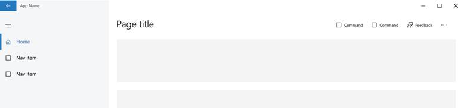

# <a name="launch-feedback-hub-from-your-app"></a>Lancer le Hub de commentaires à partir de votre application

Vous pouvez encourager vos clients à laisser des commentaires en ajoutant à votre application de plateforme Windows universelle (UWP) un contrôle (tel qu’un bouton) lançant le Hub de commentaires. Le Hub de commentaires est une application préinstallée qui centralise le recueil de commentaires concernant Windows et les applications installées. Tous les commentaires des clients envoyés pour votre application par le biais du Hub de commentaires sont collectés et vous sont présentés dans le [rapport sur les commentaires](../publish/feedback-report.md) affiché dans le tableau de bord du Centre de développement Windows. Vous pouvez ainsi voir les problèmes, les suggestions et les votes que vos clients ont soumis dans un même rapport.

Pour lancer le Hub de commentaires à partir de votre application, utilisez une API fournie par [Microsoft Store Services SDK](http://aka.ms/store-em-sdk). Nous vous recommandons d’utiliser cette API pour lancer le Hub de commentaires à partir d’un élément d’interface utilisateur de votre application qui respecte nos recommandations en matière de conception.

> [!NOTE]
> Le Hub de commentaires est disponible uniquement sur les appareils exécutant la version10.0.14271 ou une version ultérieure d’un système d’exploitation Windows10 basé sur les [familles d’appareils](https://msdn.microsoft.com/windows/uwp/get-started/universal-application-platform-guide#device-families) mobiles et de bureau. Nous vous recommandons de n’afficher un contrôle de commentaires dans votre application que si le Hub de commentaires est disponible sur l’appareil de l’utilisateur. Le code de cette rubrique illustre comment procéder.

## <a name="how-to-launch-feedback-hub-from-your-app"></a>Lancement du Hub de commentaires à partir de votre application

Pour lancer le Hub de commentaires à partir de votre application:

1. Installez le [MicrosoftStore Services SDK](microsoft-store-services-sdk.md#install-the-sdk).
2. Ouvrez votre projet dans VisualStudio.
3. Dans l’Explorateur de solutions, cliquez avec le bouton droit sur le nœud **Références**, puis sélectionnez **Ajouter une référence**.
4. Dans le **Gestionnaire de références**, développez **Windows universel**, puis cliquez sur **Extensions**.
5. Dans la liste des kits de développement logiciel (SDK), cochez la case en regard de **Microsoft Engagement Framework** et cliquez sur **OK**.
6. Dans votre projet, ajoutez le contrôle, tel qu’un bouton, que vous souhaitez présenter aux utilisateurs pour leur permettre de lancer le Hub de commentaires. Nous vous recommandons de configurer le contrôle comme suit:
  * Définissez la police du contenu présenté dans le contrôle sur **SegoeMDL2Assets**.
  * Définissez le texte du contrôle sur le code de caractère Unicode hexadécimal E939. Il s’agit du code de caractère de l’icône de commentaires recommandée dans la police **SegoeMDL2Assets**.
  * Définissez la visibilité du contrôle sur la valeur «hidden».
    > [!NOTE]
    > Nous vous recommandons de masquer votre contrôle de commentaires par défaut et de ne l’afficher dans votre code d’initialisation que si le Hub de commentaires est disponible sur l’appareil de l’utilisateur. L’étape suivante illustre comment procéder.

    Le code ci-après présente la définition XAML d’un élément [Button](https://docs.microsoft.com/uwp/api/Windows.UI.Xaml.Controls.Button) configuré comme décrit ci-dessus.

    ```XML
    <Button x:Name="feedbackButton" FontFamily="Segoe MDL2 Assets" Content="&#xE939;" HorizontalAlignment="Left" Margin="138,352,0,0" VerticalAlignment="Top" Visibility="Collapsed"  Click="feedbackButton_Click"/>
    ```

7. Dans votre code de lancement de la page d’application qui héberge votre contrôle de commentaires, utilisez la méthode [IsSupported](https://docs.microsoft.com/uwp/api/microsoft.services.store.engagement.storeservicesfeedbacklauncher.issupported) de la classe [StoreServicesFeedbackLauncher](https://docs.microsoft.com/uwp/api/microsoft.services.store.engagement.storeservicesfeedbacklauncher) pour déterminer si le Hub de commentaires est disponible sur l’appareil de l’utilisateur. Le Hub de commentaires est disponible uniquement sur les appareils exécutant la version10.0.14271 ou une version ultérieure d’un système d’exploitation Windows10 basé sur les [familles d’appareils](https://msdn.microsoft.com/windows/uwp/get-started/universal-application-platform-guide#device-families) mobiles et de bureau.

    Si cette propriété renvoie la valeur **true**, définissez le contrôle comme étant visible. Le code suivant montre comment procéder pour un élément [Button](https://msdn.microsoft.com/library/windows/apps/windows.ui.xaml.controls.button.aspx).

    [!code-cs[LaunchFeedback](./code/StoreSDKSamples/cs/FeedbackPage.xaml.cs#ToggleFeedbackVisibility)]
      > [!NOTE]
      > Bien que les appareilsXbox ne prennent pas en charge le Hub de commentaires pour l’instant, la propriété **IsSupported** renvoie la valeur **true** sur les appareilsXbox exécutant la version10.0.14271 ou une version ultérieure de Windows10. Il s’agit d’un problème connu qui sera résolu dans une prochaine version de Microsoft Store Services SDK.  

8. Dans le gestionnaire d’événements qui s’exécute quand l’utilisateur clique sur le contrôle, obtenez un objet [StoreServicesFeedbackLauncher](https://docs.microsoft.com/uwp/api/microsoft.services.store.engagement.storeservicesfeedbacklauncher) et appelez la méthode [LaunchAsync](https://docs.microsoft.com/uwp/api/microsoft.services.store.engagement.storeservicesfeedbacklauncher.launchasync) pour lancer l’application Hub de commentaires. Il existe deux surcharges pour cette méthode: une sans paramètre et une autre qui accepte un dictionnaire de paires clé/valeur contenant les métadonnées que vous voulez associer au commentaire. L’exemple suivant montre comment lancer le Hub de commentaires dans le gestionnaire d’événements [Click](https://docs.microsoft.com/uwp/api/windows.ui.xaml.controls.primitives.buttonbase.click) d’un élément [Button](https://docs.microsoft.com/uwp/api/Windows.UI.Xaml.Controls.Button).

    [!code-cs[LaunchFeedback](./code/StoreSDKSamples/cs/FeedbackPage.xaml.cs#FeedbackButtonClick)]

## <a name="design-recommendations-for-your-feedback-ui"></a>Recommandations en matière de conception pour votre interface utilisateur de commentaires

Pour lancer le Hub de commentaires, nous vous recommandons d’ajouter à votre application un élément d’interface utilisateur (tel qu’un bouton) affichant l’icône de commentaires standard suivante avec la police SegoeMDL2 Assets et le code de caractèreE939.


Nous vous recommandons également d’utiliser une ou plusieurs des options de placement suivantes pour créer un lien vers le Hub de commentaires dans votre application.
* **Directement dans la barre de l’application**. Selon votre implémentation, vous voudrez utiliser l’icône seule ou y ajouter du texte (comme illustré ci-dessous).

  

* **Dans les paramètres de votre application**. Cette méthode constitue un moyen plus subtil de fournir un accès au Hub de commentaires. Dans l’exemple ci-dessous, le lien Commentaires apparaît comme l’un des liens disponibles sous Application.

  

* **Dans un menu volant basé sur l’événement**. Cette méthode est utile lorsque vous souhaitez interroger vos clients sur un sujet spécifique avant de lancer le Hub de commentaires Windows. Par exemple, après avoir intégré une nouvelle fonctionnalité à votre application, vous pouvez poser une question spécifique aux clients concernant leur niveau de satisfaction vis-à-vis de cette fonctionnalité. Si les clients choisissent d’y répondre, votre application lance le Hub de commentaires.


## <a name="related-topics"></a>Rubriques connexes

* [Rapport sur les commentaires](../publish/feedback-report.md)
