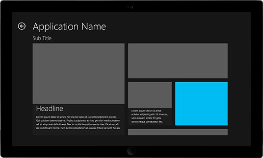
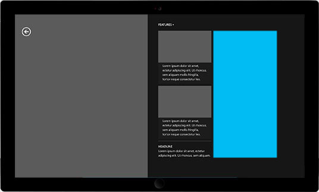
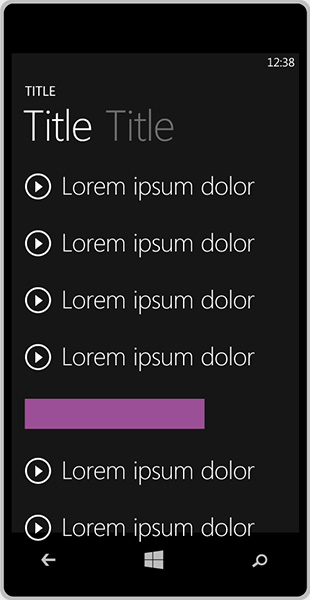

# Tailles des bannières prises en charge

Les tailles des bannières publicitaires suivantes sont prises en charge pour les applications de plateforme Windows universelle (UWP). Lorsque vous instanciez l’objet **AdControl** dans votre application, assurez-vous que vous définissez les propriétés de hauteur et la largeur à correspondre à l’une de ces tailles prises en charge.

* 160x600
* 300x50
* 300x250
* 300x600
* 320x50
* 640x100
* 728x90

> [!NOTE]
> Pour une expérience optimale, nous vous recommandons d’utiliser les tailles suivantes sur les appareils Windows 10 Mobile: 300 x 50, 320 x 50 et 640 x 100.

Le tableau suivant fournit des exemples qui illustrent chaque taille de publicité de bannière.

<table>
<colgroup>
<col width="20%" />
<col width="80%" />
</colgroup>
<thead>
<tr class="header">
<th align="left">Taille de publicité</th>
<th align="left">Exemple</th>
</tr>
</thead>
<tbody>
<tr class="even">
<td align="left">
160x600
</td>
<td align="left"></td>
</tr>
<tr class="even">
<td align="left">
300x250
</td>
<td align="left"></td>
</tr>
<tr class="odd">
<td align="left">
300x600
</td>
<td align="left"></td>
</tr>
<tr class="odd">
<td align="left">
728x90
</td>
<td align="left"></td>
</tr>
<tr class="odd">
<td align="left">
300x50
</td>
<td align="left"></td>
</tr>
<tr class="even">
<td align="left">
320x50
</td>
<td align="left"></td>
</tr>
<tr class="even">
<td align="left">
640x100
</td>
<td align="left"></td>
</tr>
</tbody>
</table>

 

 

 
