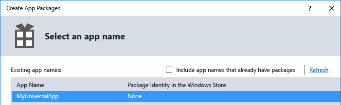
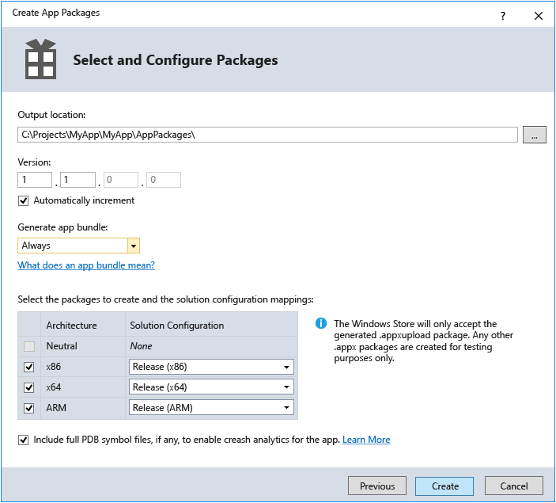
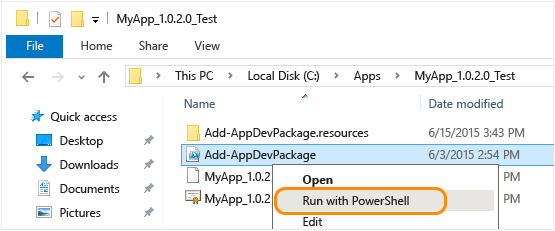

# Package d’une application UWP avec Visual Studio

Pour vendre ou distribuer votre application de plateforme Windows universelle (UWP) à d’autres utilisateurs, vous devez la mettre en package. Si vous ne souhaitez pas distribuer votre application via le Microsoft Store, vous pouvez charger le package d’application directement sur un appareil ou le distribuer via une [Installation web](installing-UWP-apps-web.md). Cet article décrit le processus de configuration, de création et de test d’un package d’application UWP à l'aide de Visual Studio. Pour plus d’informations sur la gestion et déploiement d'applications cœur de métier (LOB), consultez [Gestion d'applications d'entreprise](https://docs.microsoft.com/windows/client-management/mdm/enterprise-app-management).

Dans Windows 10, vous pouvez envoyer un package d’application, d’offre groupée d’applications ou d’un fichier de chargement du package application complète pour [partenaires](https://partner.microsoft.com/dashboard). De ces options, vous soumettre un téléchargement de fichier de package d’application pour fournir la meilleure expérience.

## Types de packages d’application

- **Package d’application (.appx ou .msix)**  
    Un fichier contenant votre application dans un format pouvant être chargé de manière indépendante sur un appareil. N’importe quel fichier de package d’application unique créé par Visual Studio est **pas** destiné à être soumis à des partenaires et doit être utilisé pour le chargement indépendant et uniquement à des fins de test. Si vous souhaitez soumettre votre application au Partner Center, utilisez le chargement de fichier de package d’application.  

- **Offre groupée d’applications (.appxbundle ou .msixbundle)**  
    Un ensemble d'applications désigne un type de package pouvant contenir plusieurs packages d'application, chacun étant généré pour prendre en charge une architecture d'appareil spécifique. Par exemple, un ensemble d'applications peut contenir trois packages d'application distincts pour les configurations x86, x64 et ARM. Les ensembles d'applications doivent être générés autant que possible. En effet, ils permettent aux applications d'être disponibles à un éventail d'appareils des plus larges.  

- **Fichier de chargement de Package d’application (.appxupload ou .msixupload)**  
    Un fichier unique pouvant contenir plusieurs packages d'applications ou un ensemble d'applications pour prendre en charge diverses architectures de processeur. Le téléchargement de fichier de package d’application contient également un fichier de symboles à [analyser les performances de l’application](https://docs.microsoft.com/windows/uwp/publish/analytics) une fois que votre application a été publiée dans le Microsoft Store. Ce fichier sera automatiquement créé pour vous si vous empaquetez votre application avec Visual Studio avec l’intention de soumettre à des partenaires pour la publication.

Voici un aperçu des étapes nécessaires pour préparer et créer un package d’application :

1.  [Avant de créer un package pour votre application](#before-packaging-your-app). Suivez ces étapes pour vérifier que votre application est prête à être packagée pour la soumission des partenaires.
2.  [Configurer un package d’application](#configure-an-app-package). Utilisez le concepteur de manifeste Visual Studio pour configurer le package. Par exemple, ajoutez des images de vignette et choisissez les orientations prises en charge par votre application.
3.  [Créer un fichier de chargement de package d’application](#create-an-app-package-upload-file). Utilisez l’assistant de package d'application dans Microsoft Visual Studio pour créer un package d’application, puis certifiez votre package à l’aide du kit de certification des applications Windows.
4.  [Chargez de manière indépendante votre package d’application](#sideload-your-app-package). Après le chargement indépendant de votre application sur un appareil, vous pouvez tester qu’elle fonctionne comme vous le souhaitez.

Après avoir effectué les étapes ci-dessus, vous êtes prêt à distribuer votre application. Si vous avez une application (LOB large) line of business que vous ne prévoyez pas de vendre, car il est pour les utilisateurs internes uniquement, vous pouvez charger une version test cette application pour l’installer sur n’importe quel appareil Windows 10.

## Avant de créer un package pour votre application

1.  **Testez votre application.** Avant de packager votre application pour la soumission des partenaires, assurez-vous qu’il fonctionne comme prévu sur toutes les familles d’appareils que vous envisagez de prendre en charge. Ces familles d’appareils peuvent inclure des ordinateurs de bureau, des appareils portables, Surface Hub, Xbox, IoT, ou autres. Pour plus d’informations sur le déploiement et test de votre application à l’aide de Visual Studio, consultez [déploiement et débogage des applications UWP](../debug-test-perf/deploying-and-debugging-uwp-apps.md).
2.  **Optimiser votre application.** Vous pouvez utiliser les outils de profilage et de débogage de Visual Studio pour optimiser les performances de votre application UWP. Par exemple, l’outil Chronologie pour la réactivité de l’interface utilisateur, l’outil Utilisation de la mémoire, l’outil Utilisation du processeur, etc. Pour plus d'informations sur l'utilisation de ces outils, consultez la rubrique [Vue d'ensemble de la fonctionnalité de profilage](https://docs.microsoft.com/visualstudio/profiling/profiling-feature-tour).
3.  **Vérifier la compatibilité .NET Native (pour Visual Basic et C# applications).** Dans la plateforme Windows universelle, un nouveau compilateur natif améliore les performances d’exécution de votre application. Avec cette modification, vous devriez tester votre application dans cet environnement de compilation. Par défaut, la configuration de build **Release** active la chaîne d’outils .NET Native. Il est donc important de tester votre application avec cette configuration **Release** et de vérifier que votre application se comporte comme prévu. Certains problèmes courants de débogage qui peuvent se produire avec .NET Native sont expliqués plus en détail dans [Débogage des applications universelles Windows .NET Native](https://devblogs.microsoft.com/devops/debugging-net-native-windows-universal-apps/).

## Configurer un package d’application

Le fichier manifeste de l’application (Package.appxmanifest.xml) est un fichier XML qui contient les propriétés et les paramètres nécessaires pour créer votre package d’application. Par exemple, les propriétés dans le fichier manifeste d'application décrivent l’image à utiliser en tant que vignette de votre application et les orientations prises en charge par votre application quand un utilisateur fait pivoter l’appareil.

Le Concepteur de manifeste de Visual Studio vous permet de mettre à jour le fichier manifeste sans modifier le code XML brut du fichier.

### Configurer un package avec le concepteur du manifeste

1.  Dans l’**Explorateur de solutions**, développez le nœud de projet de votre application UWP.
2.  Double-cliquez sur le fichier **Package.appxmanifest**. Si le fichier manifeste est déjà ouvert dans le mode code XML, Visual Studio vous invite à fermer le fichier.
3.  Vous pouvez maintenant décider comment configurer votre application. Chaque onglet contient des informations que vous pouvez configurer pour votre application ainsi que des liens vers des informations supplémentaires si nécessaire.  
    

    Vérifiez que vous avez toutes les images requises pour une application UWP dans l’onglet **Actifs visuels**.

    À partir de l’onglet **Packaging**, vous pouvez entrer des données de publication. C’est ici que vous pouvez choisir le certificat à utiliser pour signer votre application. Toutes les applications UWP doivent être signées avec un certificat.

    >[!IMPORTANT]
    >Si vous publiez votre application dans le Microsoft Store, elle sera signée pour vous avec un certificat approuvé. Cela permet à l'utilisateur d'installer et d'exécuter votre application sans installer le certificat de signature d'application associé.

    Si vous ne publiez pas votre application et souhaitez simplement charger un package d'application de manière indépendante, vous devez d'abord approuver le package. Pour approuver le package, le certificat doit être installé sur l'appareil de l'utilisateur. Pour plus d’informations sur le chargement indépendant, consultez [Activer votre appareil pour le développement](https://docs.microsoft.com/windows/uwp/get-started/enable-your-device-for-development).

4.  Enregistrez votre fichier **Package.appxmanifest** une fois que vous avez apporté les modifications nécessaires pour votre application.

Si vous distribuez votre application via le Microsoft Store, Visual Studio peut associer votre package le Store. Pour ce faire, cliquez sur le nom de votre projet dans l’Explorateur de solutions et choisissez **Store**->**associer l’application avec le Store**. Vous pouvez également le faire le **créer des Packages d’application** Assistant, ce qui est décrit dans la section suivante. Lorsque vous associez votre application, certains champs dans l’onglet Packages du concepteur de manifeste sont automatiquement mis à jour.

## Créer un fichier de chargement de package d’application

Pour distribuer une application via Microsoft Store, vous devez créer un package d’application (.appx ou .msix), offre groupée d’applications (.appxbundle ou .msixbundle) ou un fichier de chargement de package app (.appxupload ou .msixupload) et [soumettre l’application empaquetée pour partenaires](https://docs.microsoft.com/windows/uwp/publish/app-submissions). Bien qu’il soit possible d’envoyer un package ou application offre groupée d’applications pour les partenaires uniquement, nous recommandons que vous envoyez un téléchargement de fichier de package d’application. Vous pouvez créer un téléchargement de fichier de package d’application à l’aide de la **créer des Packages d’application** Assistant dans Visual Studio, ou vous pouvez en créer un manuellement à partir de packages d’application existant ou offres groupées d’applications.

>[!NOTE]
> Si vous souhaitez créer un package d’application (.appx ou .msix) ou d’une offre groupée d’applications (.appxbundle ou .msixbundle) manuellement, consultez [créer un package d’application avec l’outil MakeAppx.exe](https://docs.microsoft.com/windows/uwp/packaging/create-app-package-with-makeappx-tool).

### Créer votre fichier de chargement de package app à l’aide de Visual Studio

1.  Dans l’**Explorateur de solutions**, ouvrez la solution pour votre projet d’application UWP.
2.  Cliquez avec le bouton droit sur le projet et choisissez **Store**->**Créer des packages d'application**. Si cette option est désactivée ou n’apparaît pas, vérifiez que le projet est bien un projet Windows universel.  
    

    L’assistant **Créer des packages d’application** s’affiche.

3.  Sélectionnez **je souhaite créer des packages à télécharger dans le Microsoft Store à l’aide d’un nouveau nom d’application** dans la première boîte de dialogue puis **suivant**.  
    

    Si vous avez déjà associé à votre projet avec une application dans le Store, vous avez également une option pour créer des packages pour l’application de Store associée. Si vous choisissez **je souhaite créer des packages pour le chargement indépendant**, Visual Studio ne génère pas le fichier package d’application téléchargement (.msixupload ou .appxupload) pour les envois de partenaires. Si vous souhaitez uniquement charger de manière indépendante votre application pour l’exécuter sur des appareils internes ou à des fins de test, vous pouvez sélectionner cette option. Pour plus d’informations sur le chargement indépendant, consultez [Activer votre appareil pour le développement](https://docs.microsoft.com/windows/uwp/get-started/enable-your-device-for-development).
4.  Sur la page suivante, connectez-vous avec votre compte de développeur pour les partenaires. Si vous ne disposez pas encore d’un compte de développeur, l’Assistant vous aidera à en créer un.
    
5.  Sélectionnez le nom de l’application pour votre package à partir de la liste des applications actuellement inscrits à votre compte, ou réservez un nouveau si vous n’avez pas déjà réservé un centre de partenaires.  
6.  Veillez à sélectionner les trois configurations d'architecture (x86, x64 et ARM) dans la boîte de dialogue **Sélectionner et configurer des packages** afin de garantir que le bon déploiement de votre application sur un large éventail d'appareils. Dans la zone de liste **Générer le lot d'applications**, sélectionnez **Toujours**. Un lot d’applications (.appxbundle ou .msixbundle) est préféré sur un fichier de package d’application unique, car elle contient une collection de packages d’applications configuré pour chaque type d’architecture de processeur. Lorsque vous choisissez de générer le bundle d’applications, le bundle d’applications sera inclus dans l’application finale téléchargement (.appxupload ou .msixupload) fichier de package, ainsi que les informations de débogage et d’analyse de cas d’incident. Si vous ne savez pas quelle(s) architecture(s) choisir ou si vous souhaitez en savoir plus sur les architectures utilisées par divers appareils, consultez [Architectures de package d’application](https://docs.microsoft.com/windows/uwp/packaging/device-architecture).  
    
7.  Inclure les fichiers de symboles PDB complets à [analyser les performances de l’application](https://docs.microsoft.com/windows/uwp/publish/analytics) à partir du centre de partenaires une fois que votre application a été publiée. Configurez tous les détails supplémentaires, notamment la numérotation de version ou l'emplacement de sortie de l'application.
8.  Cliquez sur **Créer** pour générer le package d'application. Si vous avez sélectionné une de la **je souhaite créer des packages à télécharger dans le Microsoft Store** options dans l’étape 3 et créent un package pour la soumission des partenaires, l’Assistant va créer un fichier de chargement de package (.appxupload ou .msixupload). Si vous avez sélectionné **je souhaite créer des packages pour le chargement indépendant** à l’étape 3, l’Assistant va créer un package d’application unique ou un lot d’applications en fonction de vos sélections à l’étape 6.
9. Lorsque votre application est empaquetée, cette boîte de dialogue s’affiche et vous pouvez récupérer votre téléchargement de fichier de package d’application à partir de l’emplacement de sortie spécifié. À ce stade, vous pouvez [valider votre package d’application sur l’ordinateur local ou un ordinateur distant](#validate-your-app-package) et [automatiser les soumissions aux magasins](#automate-store-submissions).
    

### Créer votre téléchargement de fichier de package d’application manuellement

1. Placez les fichiers suivants dans un dossier :
    - Un ou plusieurs packages d’application (.msix ou .appx) ou un lot d’applications (.msixbundle ou .appxbundle).
    - Un fichier .appxsym. Il s’agit d’un fichier .pdb compressé contenant des symboles publics de votre application utilisée pour [crash analytique](../publish/health-report.md) dans Partner Center. Vous pouvez omettre ce fichier, mais si vous le faites, aucune information d’analyse ou de débogage de blocage ne sera disponible pour votre application.
2. Compressez le dossier.
3. Modifiez le nom d’extension dossier compressé de .zip en .msixupload ou .appxupload.

## Valider votre package d’application

Validez votre application avant de le soumettre à des partenaires pour la certification sur un ordinateur local ou distant. Vous pouvez uniquement valider les versions Release pour votre package d’application et non les versions Debug. Pour plus d’informations sur la soumission de votre application pour les partenaires, consultez [envois d’application](https://docs.microsoft.com/windows/uwp/publish/app-submissions).

### Valider votre package d’application localement

1. Dans la dernière **création de Package terminée** page de la **créer des Packages d’application** Assistant, laissez le **ordinateur Local** option est sélectionnée et cliquez sur **lancer Kit de Certification des applications Windows**. Pour plus d’informations sur le test de votre application avec le Kit de certification des applications Windows, voir [Kit de certification des applications Windows](https://docs.microsoft.com/windows/uwp/debug-test-perf/windows-app-certification-kit).

    Le Kit de Certification des applications de Windows (Kit) effectue différents tests et retourne les résultats. Voir [Tests du kit de certification des applications Windows](https://docs.microsoft.com/windows/uwp/debug-test-perf/windows-app-certification-kit-tests) pour plus d'informations spécifiques.

    Si vous avez un appareil Windows 10 distant que vous souhaitez utiliser pour le test, vous devrez installer le Kit de Certification des applications Windows manuellement sur cet appareil. La section suivante vous guidera lors de ces étapes. Une fois cette opération terminée, vous pouvez sélectionner **Remote machine**, puis cliquer sur **Launch Windows App Certification Kit** pour vous connecter à l’appareil distant et exécuter les tests de validation.

2. Une fois que le kit a terminé et que votre application a passé la certification, vous êtes prêt à soumettre votre application au centre de partenaires. Assurez-vous de charger le fichier approprié. Vous trouverez l’emplacement par défaut du fichier dans le dossier racine de votre solution `\[AppName]\AppPackages` et se termine avec l’extension de fichier .appxupload ou .msixupload. Le nom doit être au format `[AppName]_[AppVersion]_x86_x64_arm_bundle.appxupload` ou `[AppName]_[AppVersion]_x86_x64_arm_bundle.msixupload` si vous avez opté pour un lot d’applications avec l’ensemble de l’architecture de package sélectionné.

### Valider votre package d’application sur un appareil Windows 10 distant

1. Activer votre appareil Windows 10 pour le développement en suivant le [activer votre appareil pour le développement](https://docs.microsoft.com/windows/uwp/get-started/enable-your-device-for-development) obtenir des instructions.
    >[!IMPORTANT]
    > Impossible de valider votre package d’application sur un appareil ARM distant pour Windows 10.
2. Téléchargez et installez les outils de contrôle à distance de Visual Studio. Ils sont utilisés pour exécuter le kit de certification des applications Windows à distance. Vous pouvez obtenir plus d’informations sur ces outils, y compris sur l’endroit où les télécharger, en consultant [Exécuter les applications UWP sur un ordinateur distant](https://docs.microsoft.com/visualstudio/debugger/run-windows-store-apps-on-a-remote-machine?view=vs-2015).
3. Télécharger requis [Kit de Certification des applications Windows](https://go.microsoft.com/fwlink/p/?LinkID=309666) , puis installez-le sur votre appareil Windows 10 distant.
4. Sur la page **Package Creation Completed** de l’Assistant, choisissez la case d’option **Remote Machine**, puis choisissez le bouton de sélection en regard du bouton **Test Connection**.
    >[!NOTE]
    > Le **Machine distante** case d’option est disponible uniquement si vous avez sélectionné au moins une configuration de solution qui prend en charge la validation. Pour plus d’informations sur le test de votre application avec le Kit de certification des applications Windows, voir [Kit de certification des applications Windows](https://docs.microsoft.com/windows/uwp/debug-test-perf/windows-app-certification-kit).
5. Spécifiez une forme d’appareil dans votre sous-réseau, ou fournissez le nom de serveur de nom de domaine (DNS, Domain Name System) ou l’adresse IP d’un appareil en dehors de votre sous-réseau.
6. Dans la liste **Authentication Mode**, choisissez **None** si votre appareil ne requiert pas d’authentification avec vos informations d’identification Windows.
7. Choisissez le bouton **Select**, puis le bouton **Launch Windows App Certification Kit**. Si les outils à distance sont en cours d’exécution sur cet appareil, Visual Studio s’y connecte, puis effectue les tests de validation. Consultez [Tests du kit de certification des applications Windows](https://docs.microsoft.com/windows/uwp/debug-test-perf/windows-app-certification-kit-tests).

## Automatiser les soumissions de Store

À partir de Visual Studio 2019, vous pouvez envoyer le fichier .appxupload généré pour le Microsoft Store directement à partir de l’IDE d’en sélectionnant le **envoyer automatiquement pour le Microsoft Store, après la validation du Kit de Certification des applications Windows** option à la fin de la [Assistant de créer des Packages d’application](#create-your-app-package-upload-file-using-visual-studio). Cette fonctionnalité s’appuie sur Azure Active Directory pour accéder aux informations de compte de partenaires nécessaires pour publier votre application. Pour utiliser cette fonctionnalité, vous devez associer Azure Active Directory à votre compte espace partenaires et les récupérer plusieurs informations d’identification requises pour les envois.

### Associer Azure Active Directory à votre compte espace partenaires

Avant de pouvoir récupérer les informations d’identification sont requises pour les soumissions Store automatique, vous devez suivre ces étapes dans le [tableau de bord de partenaires](https://partner.microsoft.com/dashboard) si vous n'avez pas déjà fait.

1. [Associer votre compte espace partenaires à Azure Active Directory votre organisation](https://docs.microsoft.com/windows/uwp/publish/associate-azure-ad-with-partner-center). Si votre organisation utilise déjà Office 365 ou d’autres services professionnels de Microsoft, vous disposez déjà d’Azure AD. Sinon, vous pouvez créer un nouveau client à partir d’Azure AD au sein des partenaires sans frais supplémentaires.

2. [Ajouter une application Azure AD à votre compte Centre de partenaire](https://docs.microsoft.com/windows/uwp/publish/add-users-groups-and-azure-ad-applications#add-azure-ad-applications-to-your-partner-center-account). Cette application Azure AD représente l’application ou le service que vous utiliserez pour accéder aux soumissions pour votre compte Centre de développement. Vous devez affecter cette application à la **Manager** rôle. Si cette application existe déjà dans votre annuaire Azure AD, vous pouvez la sélectionner dans la page **Ajouter des applications Azure AD** pour l’ajouter à votre compte du Centre de développement. Sinon, vous pouvez créer une application Azure AD dans la page **Ajouter des applications Azure AD**.

### Récupérer les informations d’identification requises pour les envois

Ensuite, vous pouvez récupérer les informations d’identification de partenaires requises pour les envois : le **ID de locataire Azure**, le **ID Client** et **clé Client**.

1. Accédez à la [tableau de bord de partenaires](https://partner.microsoft.com/dashboard) et connectez-vous avec vos informations d’identification Azure AD.

2. Sur le tableau de bord de partenaires, sélectionnez l’icône d’engrenage (dans le coin supérieur droit du tableau de bord), puis **les paramètres du développeur**.

3. Dans le **paramètres** menu dans le volet gauche, cliquez sur **utilisateurs**.

4. Cliquez sur le nom de votre application Azure AD pour accéder aux paramètres de l’application. Dans cette page, copiez le **ID de locataire** et **ID Client** valeurs.

5. Dans le **clés** , cliquez sur **ajouter une nouvelle clé**. Sur l’écran suivant, copiez le **clé** valeur, qui correspond à la clé secrète client. Vous ne serez pas en mesure d’accéder à ces informations à nouveau une fois que vous quittez cette page, veillez à ne pas le perdre. Pour plus d’informations, voir [Gérer les clés pour une application Azure AD](https://docs.microsoft.com/windows/uwp/publish/add-users-groups-and-azure-ad-applications#manage-keys-for-an-azure-ad-application).

### Configurer automatiques soumissions de Store dans Visual Studio

Après avoir terminé les étapes précédentes, vous pouvez configurer automatiques soumissions de Store dans Visual Studio 2019.

1. À la fin de la [Assistant de créer des Packages d’application](#create-your-app-package-upload-file-using-visual-studio), sélectionnez **envoyer automatiquement pour le Microsoft Store, après la validation du Kit de Certification des applications Windows** et cliquez sur **reconfigurer**.

2. Dans le **les paramètres d’envoi de Microsoft Store configurer** boîte de dialogue, entrez la clé de locataire Azure ID, ID de Client et Client.

    

    > [!Important]
    > Vos informations d’identification peuvent être enregistrées dans votre profil à utiliser dans les soumissions futures

3. Cliquez sur **OK**.

L’envoi démarre une fois le test kit ont terminé. Vous pouvez suivre la progression de la soumission dans le **vérifier et publier** fenêtre.

## Charger de manière indépendante votre package d’application

Des packages d’application UWP, les applications ne sont pas installées sur un appareil comme ils le sont dans les applications de bureau. En règle générale, vous téléchargez les applications UWP à partir du Microsoft Store, ce qui installe également l’application sur votre appareil automatiquement. Les applications peuvent être installées sans être publiées dans le Store (chargement indépendant). Cela vous permet d’installer et tester des applications à l’aide du package d’application de fichiers que vous avez créée. Si vous disposez d’une application que vous ne voulez pas vendre dans le Store (une application métier par exemple), vous pouvez charger cette application de manière indépendante pour que les autres utilisateurs de votre société puissent l’utiliser.

Vous pouvez charger une version test de votre application sur un appareil cible, vous devez [activer votre appareil pour le développement](../get-started/enable-your-device-for-development.md).

Chargement de version test votre application sur un appareil Windows 10 Mobile, utilisez le [WinAppDeployCmd.exe](install-universal-windows-apps-with-the-winappdeploycmd-tool.md) outil. Pour les ordinateurs de bureau, ordinateurs portables et tablettes, suivez les instructions ci-dessous.

### Chargement de version test de votre application package sur la mise à jour anniversaire de Windows 10 ou version ultérieure

Introduite dans Windows 10 mise à jour anniversaire (Windows 10, version 1607), des packages d’application peuvent être installés simplement en double-cliquant sur le fichier de package d’application. Pour utiliser cela, accédez à votre package d’application ou d’un fichier de groupement d’application et double-cliquez dessus. [Programme d’installation de l’application](https://docs.microsoft.com/windows/msix/app-installer/app-installer-root) lance et fournit les informations de l’application de base mais aussi un bouton Installer, barre de progression d’installation et les messages d’erreur pertinentes.

> [!NOTE]
> Programme d’installation de l’application part du principe que l’application est approuvée par l’appareil. Si vous chargez de manière indépendante une application de développeur ou d’entreprise, vous devez installer le certificat de signature dans le magasin de personnes autorisées ou d'éditeurs autorisés sur l'appareil. Si vous ne savez pas comment procéder, voir [Installation de certificats de test](https://docs.microsoft.com/windows-hardware/drivers/install/installing-test-certificates).

### Chargement indépendant de votre application du package sur les versions précédentes de Windows

1.  Copiez les dossiers pour la version de l'application à installer sur l’appareil cible.

    Si vous avez créé un ensemble d’applications, vous aurez un dossier en fonction du numéro de version et un dossier `*_Test`. Par exemple, ces deux dossiers (dans lesquels la version à installer est 1.0.2.0) :

    -   `C:\Projects\MyApp\MyApp\AppPackages\MyApp_1.0.2.0`
    -   `C:\Projects\MyApp\MyApp\AppPackages\MyApp_1.0.2.0_Test`

    Si vous n’avez pas d’ensemble d’applications, copiez le dossier pour l’architecture appropriée et son dossier `*_Test` correspondant. Ces deux dossiers sont un exemple de package d’application avec l'architecture x64 et son dossier `*_Test` :

    -   `C:\Projects\MyApp\MyApp\AppPackages\MyApp_1.0.2.0_x64`
    -   `C:\Projects\MyApp\MyApp\AppPackages\MyApp_1.0.2.0_x64_Test`

2.  Sur l’appareil cible, ouvrez le dossier `*_Test`.
3.  Cliquez avec le bouton droit sur le fichier **Add-AppDevPackage.ps1**. Choisissez **Exécuter avec PowerShell** et suivez les invites.  
    

    Lorsque le package d’application a été installé, la fenêtre PowerShell affiche ce message : **Votre application a été installée correctement.**
    >[!TIP]
    > Pour ouvrir le menu contextuel sur une tablette, touchez l’écran où vous souhaitez avec le bouton droit, maintenez jusqu'à ce qu’apparaisse un cercle complet, puis relevez votre doigt. Le menu contextuel s’ouvre quand vous levez le doigt.

4.  Cliquez sur le bouton Démarrer pour rechercher l'application par son nom, puis lancez-la.
