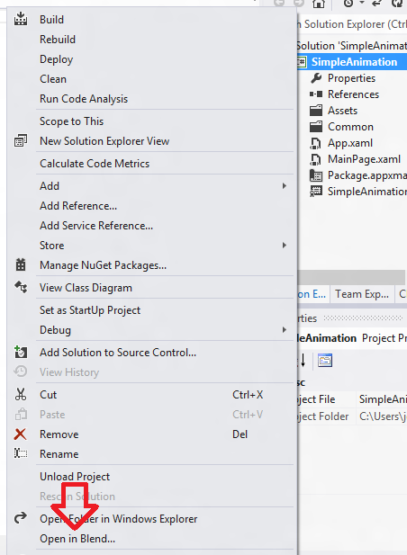
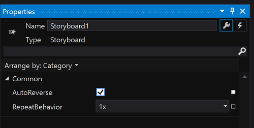

# <a name="getting-started-animation"></a>Prise en main: Animation


## <a name="adding-animations"></a>Ajout d’animations

Dans iOS, vous créez le plus souvent des effets d’animation par programme. Par exemple, vous pouvez utiliser des animations fournies par les méthodes **animateWithDuration** de classe **UIView**, basées sur des blocs, ou les méthodes plus anciennes non basées sur des blocs. Vous pouvez également utiliser explicitement la classe **CALayer** pour animer des couches. Les animations dans les applications Windows peuvent être créées par programme, mais aussi être définies de manière déclarative avec XAML (Extensible Application Markup Language). Vous pouvez utiliser Microsoft Visual Studio pour modifier directement du code XAML, mais Visual Studio inclut également un outil appelé **Blend**, qui génère du code XAML à votre place lorsque vous travaillez sur des animations dans un concepteur. En fait, Blend vous permet d’ouvrir, de concevoir, de générer et d’exécuter des projets Visual Studio complets sous forme graphique. La procédure qui suit vous offre l’occasion de tester et mettre en pratique cette opération.

Créez une application de plateforme Windows universelle (UWP) et appelez-la, par exemple, «SimpleAnimation». Dans ce projet, nous allons déplacer un rectangle, luis appliquer un effet de fondu, puis de nouveau l’afficher. Les animations en XAML sont basées sur le concept des *tables de montage* (à ne pas confondre avec les tables de montage iOS). Les tables de montage séquentiel utilisent des *images clés* pour animer les changements de propriétés.

Après avoir ouvert votre projet, dans l’**Explorateur de solutions**, cliquez avec le bouton droit sur le nom du projet, puis sélectionnez **Ouvrir dans Blend** ou **Configurer dans Blend**, comme illustré dans la figure ci-dessous. Visual Studio poursuit son exécution en arrière-plan.



Au démarrage de Blend, vous devez voir apparaître un écran semblable à celui-ci.


Dans l’**Explorateur de solutions**, à gauche, double-cliquez sur **MainPage.xaml**. Ensuite, dans la bande verticale des outils au bord de **Mode Création**, sélectionnez l’outil **Rectangle** , puis tracez un rectangle dans **Mode Création**, comme illustré dans la figure suivante.


Pour obtenir un rectangle vert, accédez à la fenêtre **Propriétés**. Dans la zone **Pinceau**, cliquez sur le bouton **Pinceau de couleur unie**, puis sur l’icône **Pipette de couleur**. Cliquez n’importe où dans la palette des teintes de vert.

Pour commencer à animer le rectangle, dans la fenêtre **Objets et chronologie**, appuyez sur le bouton doté d’un symbole plus (**Nouveau**) comme dans la figure ci-dessous, puis appuyez sur **OK**.


Une table de montage séquentiel s’affiche dans la fenêtre **Objets et chronologie** (vous devrez peut-être redimensionner la vue pour l’afficher correctement). Le **mode Création** change pour indiquer que l’**enregistrement chronologique de Storyboard1 est activé**. Pour capturer l’état actuel du rectangle, dans la fenêtre **Objets et chronologie**, appuyez sur le bouton **Enregistrer l’image clé** juste au-dessus de la flèche jaune (voir figure ci-dessous).


Déplaçons à présent le rectangle et atténuons-le. Pour cela, faites glisser la flèche jaune/orange vers la deuxième position, puis déplacez le rectangle vert légèrement vers la droite. Dans la zone **Apparence** de la fenêtre **Propriétés**, redéfinissez ensuite la propriété **Opacité** sur **0** (voir figure ci-dessous). Pour afficher un aperçu de l’animation, appuyez sur le bouton **Lecture** dans le panneau de la table de montage séquentiel.


Faisons maintenant réapparaître le rectangle. Dans la fenêtre **Objets et chronologie**, double-cliquez sur **Storyboard1**. Ensuite, dans la zone **Commun** de la fenêtre **Propriétés**, sélectionnez **AutoReverse** comme illustré dans la figure ci-dessous.



Pour finir, cliquez sur le bouton **Lecture** pour voir ce qu’il se passe.

Vous pouvez générer et exécuter le projet en cliquant sur le bouton d’exécution vert en haut de la fenêtre (ou en appuyant simplement sur F5). Si vous procédez de la sorte, votre projet sera en effet généré et exécuté, mais le rectangle vert restera obstinément immobile, comme un bambin auquel on refuse un bonbon dans une allée de supermarché. Pour démarrer l’animation, vous devez ajouter une ligne de code au projet. Voici comment procéder.

Enregistrez le projet en ouvrant le menu **Fichier**, puis en sélectionnant **Enregistrer MainPage.xaml**. Retournez à Visual Studio. Si Visual Studio affiche une boîte de dialogue qui vous demande si vous souhaitez recharger le fichier modifié, sélectionnez **Oui**. Double-cliquez sur le fichier **MainPage.xaml.cs**, masqué sous **MainPage.xaml**, pour l’ouvrir, puis ajoutez le code suivant juste au-dessus de la méthode public MainPage() :

```csharp
protected override void OnNavigatedTo(NavigationEventArgs e)
{
    // Add the following line of code.
    Storyboard1.Begin();
}
```

Exécutez de nouveau le projet et regardez le rectangle s’animer. Hourra!

Si vous ouvrez le fichier MainPage.xaml, dans la vue **XAML**, vous verrez le code XAML ajouté par Blend tandis que vous travaillez dans le concepteur. Examinez surtout le code dans les éléments `<Storyboard>` et `<Rectangle>`. Le code qui suit montre un exemple. Les points de suspension représentent du code sans rapport omis par souci de concision et des sauts de line ont été ajoutés pour rendre le code plus lisible.

```xml
...
<Storyboard 
        x:Name="Storyboard1" 
        AutoReverse="True">
    <DoubleAnimationUsingKeyFrames 
            Storyboard.TargetProperty="(UIElement.RenderTransform).(CompositeTransform.TranslateX)"
            Storyboard.TargetName="rectangle">
        <EasingDoubleKeyFrame 
                KeyTime="0" 
                Value="0"/>
        <EasingDoubleKeyFrame 
                KeyTime="0:0:2" 
                Value="185.075"/>
    </DoubleAnimationUsingKeyFrames>
    <DoubleAnimationUsingKeyFrames 
            Storyboard.TargetProperty="(UIElement.RenderTransform).(CompositeTransform.TranslateY)" 
            Storyboard.TargetName="rectangle">
        <EasingDoubleKeyFrame 
                KeyTime="0" 
                Value="0"/>
        <EasingDoubleKeyFrame 
                KeyTime="0:0:2" 
                Value="2.985"/>
    </DoubleAnimationUsingKeyFrames>
    <DoubleAnimationUsingKeyFrames 
            Storyboard.TargetProperty="(UIElement.Opacity)" 
            Storyboard.TargetName="rectangle">
        <EasingDoubleKeyFrame 
                KeyTime="0" 
                Value="1"/>
        <EasingDoubleKeyFrame 
                KeyTime="0:0:2"
                Value="0"/>
    </DoubleAnimationUsingKeyFrames>
</Storyboard>
...
<Rectangle 
        x:Name="rectangle" 
        Fill="#FF00FF63" 
        HorizontalAlignment="Left" 
        Height="122" 
        Margin="151,312,0,0" 
        Stroke="Black" 
        VerticalAlignment="Top" 
        Width="239" 
        RenderTransformOrigin="0.5,0.5">
    <Rectangle.RenderTransform>
        <CompositeTransform/>
    </Rectangle.RenderTransform>
</Rectangle>
...
```

Vous pouvez modifier ce code XAML manuellement, ou retourner à Blend pour continuer à travailler dessus. Blend permet de créer aisément des interfaces utilisateur intéressantes, et la possibilité de les animer à l’aide d’un outil graphique peut accélérer considérablement le temps de développement. Pour plus d’informations sur les animations, voir [Vue d’ensemble des animations](https://msdn.microsoft.com/library/windows/apps/mt187350).

**Remarque**pour plus d’informations sur les animations pour <span class="legacy-term">les applications UWP en JavaScript et HTML</span>, consultez [animation de votre interface utilisateur (HTML)](https://msdn.microsoft.com/library/windows/apps/hh465165).

### <a name="next-step"></a>Étape suivante

[Prise en main : Et ensuite ?](getting-started-what-next.md)
