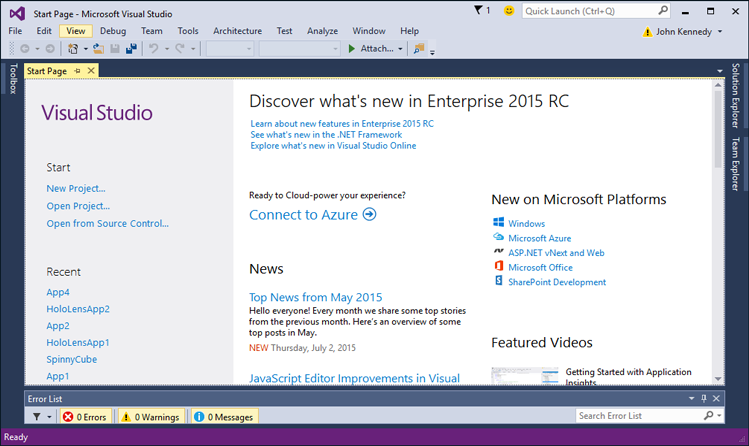

# Prise en main : Création d’un projet

\[ Mise à jour pour les applications UWP sur Windows 10. Pour les articles sur Windows 8.x, voir l’[archive](http://go.microsoft.com/fwlink/p/?linkid=619132). \]

## Création d’un projet

Microsoft Visual Studio représente pour Windows ce que Xcode représente pour iOS et Mac OS. Cette procédure pas à pas vous permet de vous familiariser avec Visual Studio. Elle vous présente les notions de base essentielles que vous devez connaître pour débuter. Chaque fois que vous créez une application, vous exécutez des étapes semblables à ce qui suit.

La vidéo suivante compare Xcode à Visual Studio.

<iframe src="https://hubs-video.ssl.catalog.video.msn.com/embed/5b7bd91f-6a2f-40b6-9b19-eb2994931d0a/IA?csid=ux-en-us&MsnPlayerLeadsWith=html&PlaybackMode=Inline&MsnPlayerDisplayShareBar=false&MsnPlayerDisplayInfoButton=false&iframe=true&QualityOverride=HD" width="720" height="405" allowFullScreen="true" frameBorder="0" scrolling="no">La minute du développeur - Comparaison de Xcode à Visual Studio</iframe>

La création d’une application pour Windows 10, ou application de plateforme Windows universelle (UWP), est similaire à la création d’une application iOS à l’aide d’une table de montage séquentiel. L’application Windows 10 est souvent construite sur plusieurs pages, dont chacune contient une partie de l’interface utilisateur, comme un site web. Chaque page possède deux fichiers sources associés : l’un pour stocker l’interface utilisateur définie par programme ou visuellement et stockée au format [XAML](https://msdn.microsoft.com/library/windows/apps/mt185595), et l’autre contenant le code source. En interagissant avec votre application, l’utilisateur navigue entre ces pages. Dans ce guide pas à pas, vous allez créer une application sur deux pages.

**Remarque** Une caractéristique importante des applications Windows 10 est que le même code source et le même ensemble d’API sont disponibles, quelle que soit la plateforme. Comme vous le savez, lorsque vous écrivez une application iOS universelle pour iPhone et iPad, vous pouvez déterminer au moment de l’exécution la plateforme sur laquelle votre application s’exécute, et prendre les mesures nécessaires. De même, les applications Windows 10 peuvent déterminer au moment de l’exécution l’appareil sur lequel elles s’exécutent. Avec une application UWP, il est inutile d’utiliser des #ifdef dans le code source pour créer des builds spécifiquement adaptées aux ordinateurs de bureau ou aux téléphones. Heureusement, les applications Windows 10 utilisent intelligemment leurs contrôles d’interface utilisateur en fonction de l’appareil. Par exemple, votre application peut faire référence à un contrôle de sélecteur de dates. L’apparence et le fonctionnement du contrôle diffèrent selon que celui-ci s’exécute sur un ordinateur de bureau ou un écran de téléphone. Toutefois, le code source reste la même.

Voyons comment créer une application Windows 10. Commencez par exécuter Visual Studio. Lors de sa première exécution, Visual Studio vous demande de vous procurer une licence de développeur. Ce type de licence vous permet d’installer et de tester des applications du Windows Store sur votre ordinateur local avant de les soumettre au Windows Store. Pour obtenir une licence, suivez les instructions à l’écran pour vous connecter à l’aide d’un compte Microsoft. Si vous n’en possédez pas, cliquez sur le lien **S’inscrire** dans la boîte de dialogue **Licence de développeur** et suivez les instructions à l’écran.

Par comparaison, lorsque vous démarrez Xcode, la première chose que vos voyez est l’écran de **bienvenue dans Xcode** présenté dans la figure qui suit.

Visual Studio est très semblable. Vous allez voir la **page de démarrage**, présentée dans la figure suivante.

Pour créer une application, commencez par créer un projet en effectuant l’une des opérations suivantes :

-   Dans la zone **Démarrer**, appuyez sur **Nouveau projet**.
-   Appuyez sur le menu **Fichier**, puis sur **Nouveau projet**.

Par comparaison, lorsque vous créez un projet dans Xcode, vous voyez une liste de modèles de projet apparaître comme dans la figure ci-dessous.

Dans Visual Studio, plusieurs modèles de projet peuvent être choisis comme le montre la figure qui suit.

Pour cette procédure pas à pas, appuyez sur **Visual C#**, **Windows**, **Windows universel**, puis **Application vide (Windows universel)**. Dans la zone **Nom**, tapez « MyApp », puis appuyez sur **OK**. Visual Studio crée, puis affiche votre premier projet. Vous êtes maintenant prêt à concevoir votre application et à y ajouter du code.

## Étape suivante

[Prise en main : Choix d’un langage de programmation](getting-started-choosing-a-programming-language.md)
<!--HONumber=Mar16_HO1-->
