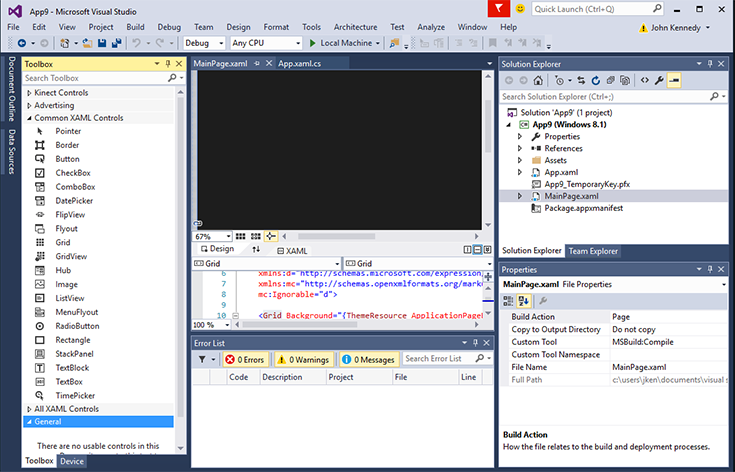
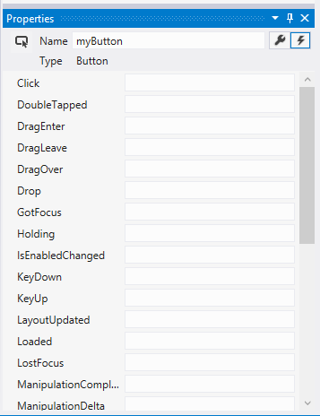

# <a name="getting-started-getting-around-in-visual-studio"></a>Prise en main: Apprentissage de VisualStudio


## <a name="getting-around-in-microsoft-visual-studio"></a>Savoir maîtriser Microsoft Visual Studio

Revenons au projet que nous avons créé précédemment et voyons comment s’y retrouver dans l’environnement de développement intégré (IDE) de Microsoft Visual Studio.

Si vous êtes développeur Xcode, l’affichage par défaut ci-dessous vous semblera probablement familier, notamment avec les fichiers sources dans le volet gauche, l’éditeur (soit l’interface utilisateur, soit le code) dans le volet central, et les contrôles et leurs propriétés dans le volet droit.


L’apparence de Microsoft Visual Studio est similaire mais, dans l’affichage par défaut, les contrôles apparaissent sur le côté gauche à l’intérieur de la **boîte à outils**. Les fichiers sources figurent dans l’**Explorateur de solutions** sur le côté droit, et les propriétés sous **Propriétés** dans le volet **Explorateur de solutions**, comme ceci :



Même si cela peut sembler un peu surprenant, vous serez peut-être heureux d’apprendre que, dans Visual Studio, vous pouvez réorganiser les volets de façon à placer les fichiers sources à gauche, et la boîte à outils à droite. En fait, vous pouvez cliquer sur la barre de titre d’un volet, puis la faire glisser pour repositionner celui-ci. Visual Studio affiche une zone ombrée, indiquant où le volet sera ancré quand vous aurez relâché le bouton. De nombreux volets affichent également une icône de punaise dans la barre de titre. Celle-ci vous permet d’épingler le volet là où il se trouve. En le désépinglant, vous pouvez le réduire pour économiser de l’espace, ce qui est utile si votre moniteur est de taille relativement petite. Si vous faites une fausse manœuvre (ne vous inquiétez pas, nous sommes tous passés par là), sélectionnez **Rétablir la disposition de fenêtre** dans le menu **Fenêtre** pour remettre de l’ordre.

## <a name="adding-controls-setting-their-properties-and-responding-to-events"></a>Ajout de contrôles, définition de leurs propriétés et réponse aux événements

À présent, ajoutons quelques contrôles à votre projet. Nous allons ensuite changer certaines de leurs propriétés et écrire un code pour répondre à l’un des événements du contrôle.

Pour ajouter des contrôles dans Xcode, vous ouvrez le fichier .xib ou la table de montage séquentiel souhaités, puis glissez-déplacez des contrôles tels qu’un **bouton rectangulaire arrondi** ou une **étiquette**, comme illustré ci-dessous :


Tentons une opération similaire dans Visual Studio. Dans la **boîte à outils**, faites glisser le contrôle **Bouton**, puis déposez-le dans l’aire de conception du fichier MainPage.xaml.

Faites de même avec le contrôle **TextBlock**, afin qu’il se présente comme suit :


Contrairement à Xcode, qui masque les informations de disposition et de liaison à l’intérieur d’un fichier .xib ou d’une table de montage séquentiel, Visual Studio vous incite à modifier les fichiers XAML utilisés pour stocker ces détails. Il s’agit d’un langage riche, modifiable et déclaratif de type XML. Pour plus d’informations sur le langage XAML (Extensible Application Markup Language), voir [Vue d’ensemble du langage XAML](https://msdn.microsoft.com/library/windows/apps/mt185595). Pour l’instant, sachez que tous les éléments affichés dans le volet **Conception** sont définis dans le volet **XAML**. Le volet **XAML** permet un contrôle précis si nécessaire et, quand vous en saurez davantage à ce sujet, vous pourrez rapidement développer manuellement un code d’interface utilisateur. Quoi qu’il en soit, pour le moment, concentrons-nous simplement sur les volets **Conception** et **Propriétés**.

Modifions les détails du bouton. Comme vous le savez, pour modifier le nom du bouton dans Xcode, vous devez modifier la valeur du champ **Titre** dans son panneau de propriétés.

Lorsque vous utilisez Visual Studio vous procédez de manière très similaire. Dans le volet **Conception**, appuyez sur le bouton afin de positionner le focus sur celui-ci. Ensuite, dans le volet **Propriétés**, modifiez la valeur de **Contenu** de « Bouton » en « Appuyez ici ». Enfin, mettez à jour le nom du contrôle de bouton, en remplaçant la valeur de **Name** « &lt;Sans nom&gt; » par « myButton », comme illustré ici :


Écrivons maintenant un code pour changer le contenu du contrôle **TextBlock** en « Hello, World! » après que l’utilisateur a appuyé sur le bouton.

Dans Xcode, vous pouvez associer un événement à un contrôle en écrivant un code, puis en associant celui-ci au contrôle, souvent en faisant glisser le bouton dans le code source en maintenant la touche Contrôle appuyée, comme suit:


```swift
// Swift implementation.

@IBAction func buttonPressed(sender: UIButton) {
    
}
```

Visual Studio est très semblable. En haut de la fenêtre **Propriétés** se trouve un bouton reconnaissable par un éclair. C’est ici que sont répertoriés les événements possibles associés au contrôle sélectionné, comme suit:



Pour ajouter du code à l’événement Click du bouton, commencez par sélectionner le bouton dans le volet **Conception**. Ensuite, cliquez sur le bouton identifié par un éclair, puis double-cliquez sur la zone vide à côté du mot **Click**. Visual Studio ajoute l’événement « myButton_Click » à la zone **Click**, puis ajoute et affiche le gestionnaire d’événements correspondant dans le fichier MainPage.xaml.cs, comme ceci.

```csharp
private void myButton_Click(object sender, RoutedEventArgs e)
{

}
```

Accrochons à présent le contrôle **TextBlock**. Dans Xcode, vous feriez glisser le bouton dans le fichier de code source en maintenant la touche Contrôle appuyée pour associer le contrôle à sa définition, comme suit.


```swift
// Swift implentation.

@IBOutlet weak var myLabel : UILabel
```

Dans Visual Studio, vous n’avez pas besoin d’associer le contrôle, car cela est toujours fait pour vous. Modifions certaines des propriétés:

1.  Appuyez sur l’onglet du fichier MainPage.xaml.
2.  Dans le volet **Conception**, appuyez sur le contrôle **TextBlock**.
3.  Dans le volet **Propriétés**, appuyez sur le bouton doté d’une clé à molette pour afficher ses propriétés.
4.  Dans la zone **Nom**, changez et remplacez « &lt;Sans nom&gt; » par « myLabel ».


Ajoutons maintenant un peu de code à l’événement Click du bouton. Pour cela, appuyez sur le fichier MainPage.xaml.cs et ajoutez le code suivant au gestionnaire d’événements myButton_Click.

```csharp
private void myButton_Click(object sender, RoutedEventArgs e)
{
    // Add the following line of code.    
    myLabel.Text = "Hello, World!";
}
```

Cela est similaire à ce que vous écririez dans Swift:

```swift
@IBAction func buttonPressed(sender: UIButton) {
    myLabel.text = "Hello, World!"
}
```

Enfin, pour exécuter l’application, sélectionnez le menu **Déboguer**, puis sélectionnez **Démarrer le débogage** (ou appuyez sur F5). Une fois l’application démarrée, cliquez sur le bouton «Appuyez ici». Le contenu de l’étiquette «TextBlock» est remplacé par «Hello, World!» comme le montre la figure suivante.


Pour quitter l’application, revenez à Visual Studio, appuyez sur le menu **Déboguer**, puis sur **Arrêter le débogage** (ou appuyez simplement sur Maj+F5). Notez que Visual Studio vous permet d’essayer l’application sur différents appareils pour vérifier la manière dont elle s’exécute.

## <a name="next-step"></a>Étape suivante

[Prise en main : Contrôles courants](getting-started-common-controls.md)

