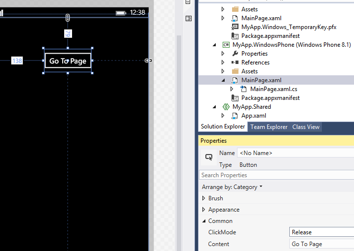

# <a name="getting-started-navigation"></a>Bien démarrer : Navigation


## <a name="adding-navigation"></a>Ajout de la navigation

iOS fournit la classe **UINavigationController** pour faciliter la navigation : vous pouvez pousser et faire apparaître des affichages pour créer une hiérarchie de **UIViewControllers** qui définissent votre application.

En revanche, une application Windows 10 contenant plusieurs vues prend plus d’une approche de site web à la navigation. Vous pouvez imaginer vos utilisateurs passant de page en page en cliquant sur des contrôles tandis qu’ils explorent l’application. Pour plus d’informations, voir [Informations de base relatives à la conception de la navigation](https://msdn.microsoft.com/library/windows/apps/dn958438).

Une des façons de gérer cette navigation dans une application Windows 10 consiste à utiliser le [ **Frame** ](https://msdn.microsoft.com/library/windows/apps/br242682) classe. La procédure pas à pas suivante vous montre comment tester et mettre en pratique cette opération.

Sans quitter la solution commencée précédemment, ouvrez le fichier **MainPage.xaml**, puis ajoutez un bouton dans l’affichage **Conception**. Remplacez la valeur « Button » de la propriété **Content** du bouton par « Go To Page ». Créez ensuite un gestionnaire pour l’événement **Click** du bouton, comme illustré dans la figure ci-dessous. Si vous ne vous rappelez pas comment procéder, consultez la procédure pas à pas décrite dans la section précédente (conseil : double-cliquez sur le bouton dans le mode **Création**).



Ajoutons une nouvelle page. Dans l’affichage **Solution**, appuyez sur le menu **Projet**, puis sur **Ajouter un nouvel élément**. Appuyez sur **Page vierge** comme le montre la figure ci-dessous, puis appuyez sur **Ajouter**.


Ajoutons ensuite un bouton au fichier BlankPage.xaml. Utilisons le contrôle AppBarButton et attribuons-lui une image de flèche Précédent : dans la vue **XAML**, ajoutez ` <AppBarButton Icon="Back"/>` entre les éléments `<Grid> </Grid>`.

Maintenant, nous allons ajouter un gestionnaire d’événements pour le bouton : double-cliquez sur le contrôle dans le **conception** vue et Microsoft Visual Studio ajoute le texte « AppBarButton\_cliquez sur » pour le **cliquez sur** zone, comme indiqué dans le suivant figure, puis ajoute et affiche le Gestionnaire d’événements correspondants dans le fichier BlankPage.xaml.cs.


De retour dans la vue **XAML** du fichier BlankPage.xaml, le code XAML (Extensible Application Markup Language) de l’élément `<AppBarButton>` doit maintenant ressembler à ceci :

` <AppBarButton Icon="Back" Click="AppBarButton_Click"/>`

Revenez au fichier BlankPage.xaml.cs et ajoutez ce code pour accéder à la page précédente dès que l’utilisateur appuie sur le bouton.

```csharp
private void AppBarButton_Click(object sender, RoutedEventArgs e)
{
    // Add the following line of code.    
    Frame.GoBack();
}
```

Pour finir, ouvrez le fichier MainPage.xaml.cs et ajoutez ce code. Le fichier BlankPage s’ouvre après que l’utilisateur a appuyé sur le bouton.

```csharp
private void Button_Click(object sender, RoutedEventArgs e)
{
    // Add the following line of code.
    Frame.Navigate(typeof(BlankPage1));
}
```

Exécutez le programme à présent. Appuyez sur le bouton « Go To Page » (Atteindre la page) pour accéder à l’autre page, puis appuyez sur le bouton doté de la flèche Précédent pour revenir à la page précédente.

La navigation entre les pages est gérée par la classe [**Frame**](https://msdn.microsoft.com/library/windows/apps/br242682). Comme le **UINavigationController** classe dans iOS utilise **pushViewController** et **popViewController** méthodes, le **Frame** classe pour Fournit des applications UWP [ **Navigate** ](https://msdn.microsoft.com/library/windows/apps/br242694) et [ **GoBack** ](https://msdn.microsoft.com/library/windows/apps/dn996568) méthodes. La classe **Frame** possède également une méthode appelée [**GoForward**](https://msdn.microsoft.com/library/windows/apps/br242693), qui comblera vos attentes.

Cette procédure pas à pas crée une nouvelle instance de BlankPage chaque fois que vous y accédez (l’instance précédente sera automatiquement libérée, ou *publiée*). Si vous ne souhaitez pas qu’une nouvelle instance soit créée à chaque fois, ajoutez le code suivant au constructeur de la classe BlankPage dans le fichier BlankPage.xaml.cs. Le comportement [**NavigationCacheMode**](https://msdn.microsoft.com/library/windows/apps/br227506) est ainsi activé.

```csharp
public BlankPage()
{
    this.InitializeComponent();
    // Add the following line of code.
    this.NavigationCacheMode = Windows.UI.Xaml.Navigation.NavigationCacheMode.Enabled;
}
```

Vous pouvez également vous procurer ou définir la propriété [**CacheSize**](https://msdn.microsoft.com/library/windows/apps/br242683) de la classe **Frame** pour gérer le nombre de pages de l’historique de navigation qu’il est possible de mettre en cache.

Pour plus d’informations sur la navigation, voir [Navigation](https://msdn.microsoft.com/library/windows/apps/mt187344) et [Exemple d’animations de personnages XAML](https://go.microsoft.com/fwlink/p/?LinkID=242401).

**Remarque**  pour plus d’informations sur la navigation pour les applications UWP en JavaScript et HTML, consultez [Guide de démarrage rapide : À l’aide de la navigation de page unique](https://msdn.microsoft.com/library/windows/apps/hh452768).
 
### <a name="next-step"></a>Étape suivante

[Mise en route : Animation](getting-started-animation.md)

