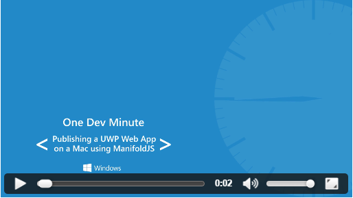

# <a name="create-your-hosted-web-app-using-a-mac"></a>Créer votre application web hébergée avec un Mac

Créez rapidement une application de plateforme Windows universelle pour Windows 10 à partir d’une simple URL de site web. 

> [!NOTE]
> Les instructions suivantes sont à utiliser avec une plateforme de développement Mac. Les utilisateurs de Windows peuvent consulter la page relative aux [instructions sur l’utilisation d’une plateforme de développement Windows](./hwa-create-windows.md).

## <a name="what-you-need-to-develop-on-mac"></a>Éléments nécessaires au développement sur Mac

- Un navigateur web.
- Une invite de commandes.

## <a name="option-1-manifoldjs"></a>Option 1 : ManifoldJS

[ManifoldJS](http://manifoldjs.com/) est une application Node.js qui s’installe facilement à partir de NPM. Elle extrait les métadonnées relatives à votre site web et génère des applications hébergées natives sur Android, iOS et Windows. Si votre site n’en a pas, un [manifeste de l’application web](https://www.w3.org/TR/appmanifest/) sera automatiquement généré pour vous.

1. Installez [NodeJS](https://nodejs.org/) qui inclut NPM (Node Package Manager). <br>

2. Ouvrez une invite de commandes ; NPM installe ManifoldJS :
```
npm install -g manifoldjs
```

3. Exécutez la commande `manifoldjs` sur l’URL de votre site web :
```
manifoldjs http://codepen.io/seksenov/pen/wBbVyb/?editors=101
```

4. Suivez les étapes de la vidéo ci-dessous pour terminer la création de packages et publier votre application web hébergée dans le Windows Store.

[ ](https://sec.ch9.ms/ch9/0a67/9b06e5c7-d7aa-478d-b30d-f99e145a0a67/ManifoldJS_high.mp4 "Publication d’une application web UWP sur un Mac avec ManifoldJS")

## <a name="option-2-app-studio"></a>Option 2 : App Studio

[App Studio](http://appstudio.windows.com/) est un outil de création d’application gratuit et en ligne qui vous permet de développer rapidement des applications Windows 10.

1. Ouvrez [App Studio](http://appstudio.windows.com/) dans votre navigateur web.

2. Cliquez sur **Démarrer maintenant !**.

3. Sous **Modèles d’applications web**, cliquez sur **Application web hébergée**.

4. Suivez les instructions à l’écran pour générer un package prêt pour la publication dans le Windows Store.

## <a name="related-topics"></a>Rubriques connexes

- [Améliorer votre application web en accédant aux fonctionnalités de plateforme Windows universelle (UWP)](./hwa-access-features.md)
- [Guide des applications de plateforme Windows universelle (UWP)](http://go.microsoft.com/fwlink/p/?LinkID=397871)
- [Télécharger des ressources de conception pour les applications du Windows Store](https://msdn.microsoft.com/library/windows/apps/xaml/bg125377.aspx)

