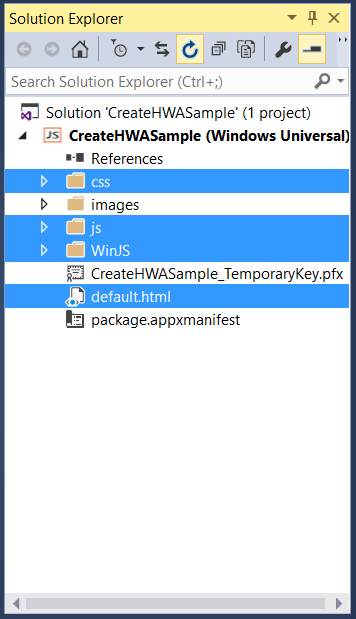
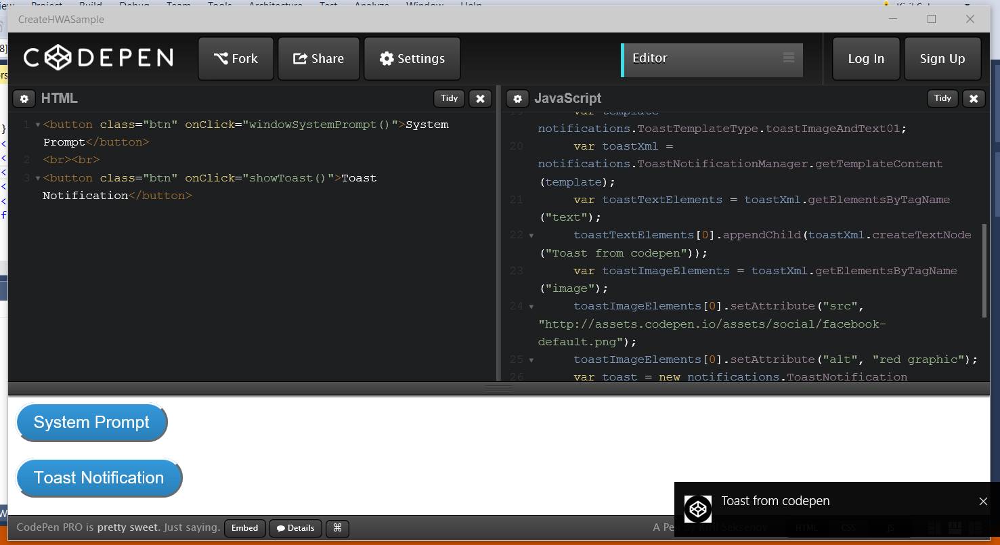

# Convertir votre applicationweb en une application UWP (plateforme Windows universelle)

Découvrez comment créer rapidement une application de plateforme Windows universelle pour Windows10 à partir d’une simple URL de site web. 

> [!NOTE]
> Les instructions suivantes sont à utiliser avec une plateforme de développement Windows. Les utilisateurs de Mac peuvent consulter la page relative aux [instructions sur l’utilisation d’une plateforme de développement Mac](/hwa-create-mac.md).

## Éléments nécessaires au développement sur Windows

- [VisualStudio2015.](https://www.visualstudio.com/) VisualStudioCommunity2015, complet et gratuit, inclut les outils de développement Windows 10, des modèles d’applications universelles, un éditeur de code, un puissant débogueur, des émulateurs WindowsMobile, une prise en charge linguistique enrichie, et bien plus encore. Tous ces éléments sont prêts pour une utilisation en production.
- [Kit de développement logiciel (SDK) Windows autonome pour Windows10](https://dev.windows.com/downloads/windows-10-sdk) (en option). Si vous utilisez un environnement de développement autre que VisualStudio2015, vous pouvez télécharger un SDK Windows autonome pour le programme d’installation de Windows10. Notez que vous n’avez pas besoin d’installer ce SDK si vous utilisez VisualStudio2015, car ce logiciel l’inclut déjà.

## Étape 1: Sélectionner une URL de site web
Choisissez un site web existant qui fonctionnera de manière optimale en tant qu’application d’une seule page. Nous vous recommandons vivement d’être le propriétaire ou le développeur du site. Ainsi, vous serez en mesure d’effectuer toutes les modifications nécessaires. Si aucune URL ne vous vient à l’esprit, essayez d’utiliser cet [exemple Codepen](http://codepen.io/seksenov/pen/wBbVyb/?editors=101) en tant que site web. Copiez votre URL, ou l’URL Codepen, à utiliser tout au long de ce didacticiel. 


## Étape2: Créer une application JavaScript vide

Ouvrez Visual Studio.
1. Cliquez sur **Fichier**.
2. Cliquez sur **Nouveau projet**.
3. Sous **JavaScript**, puis **Windows universel**, cliquez sur **Application vide (Windows universel)**.


## Étape3: Supprimer tout code empaqueté

Étant donné qu’il s’agit d’une application web hébergée, où le contenu est servi à partir d’un serveur distant, vous n’aurez pas besoin de la plupart des fichiers d’application locaux qui accompagnent le modèle JavaScript par défaut. Supprimez les ressources locales HTML, JavaScript ou CSS. Seul doit rester le fichier `package.appxmanifest`, où vous configurez l’application et les ressources de type image.



## Étape4: Définir l’URL de la page de démarrage

1. Ouvrez le fichier `package.appxmanifest`.
2. Sous l’onglet **Application**, recherchez le champ de texte **Page de démarrage**.
3. Remplacez `default.html` par l’URL de votre site web.


## Étape5: Définir les limites de votre application web

Les règles URI de contenu de l’application (ACUR) spécifient les URL distantes autorisées à accéder à votre application et aux API Windows universelles. Vous devrez ajouter au minimum une règle ACUR pour votre page de démarrage et toutes les ressources web utilisées par cette page. Pour plus d’informations sur les règles ACUR, [cliquez ici](./hwa-access-features.md#keep-your-app-secure-setting-application-content-uri-rules-acurs).
1. Ouvrez le fichier `package.appxmanifest`.
2. Cliquez sur l’onglet **URI de contenu**.
3. Ajoutez tout URI nécessaire pour votre page de démarrage.

Par exemple:
```
1. http://codepen.io/seksenov/pen/wBbVyb/?editors=101
2. http://*.codepen.io/
```
4. Définissez **l’accès WinRT** sur **Tous** pour chaque URI que vous avez ajouté.


## Étape6: Exécuter votre application

À ce stade, votre application Windows10 est entièrement opérationnelle et capable d’accéder aux API Windows universelles!

Si vous continuez avec notre exemple Codepen, cliquez sur le bouton **Notification toast** pour appeler une API Windows à partir du script hébergé.



## Bonus: Ajouter la capture vidéo

Copiez et collez le code JavaScript ci-dessous pour activer la capture vidéo. Si vous continuez avec votre propre site web, créez un bouton pour appeler la méthode `cameraCapture()`. Si vous continuez avec notre exemple Codepen, un bouton est déjà présent dans le code HTML. Cliquez sur le bouton et prenez une photo.

```JavaScript
function cameraCapture() {
  if(typeof Windows != 'undefined') {
   var captureUI = new Windows.Media.Capture.CameraCaptureUI();
   //Set the format of the picture that's going to be captured (.png, .jpg, ...)
   captureUI.photoSettings.format = Windows.Media.Capture.CameraCaptureUIPhotoFormat.png;
   //Pop up the camera UI to take a picture
   captureUI.captureFileAsync(Windows.Media.Capture.CameraCaptureUIMode.photo).then(function (capturedItem) {
      // Do something with the picture
   });
  }
}
```

## Rubriques connexes

- [Améliorer votre applicationweb en accédant aux fonctionnalités de plateforme Windows universelle (UWP)](hwa-access-features.md)
- [Guide des applications de plateforme Windows universelle (UWP)](http://go.microsoft.com/fwlink/p/?LinkID=397871)
- [Télécharger des ressources de conception pour les applications du WindowsStore](https://msdn.microsoft.com/library/windows/apps/xaml/bg125377.aspx)


<!--HONumber=Aug16_HO3-->


