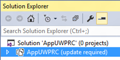

# Mettre à jour votre projet Microsoft Visual Studio 2015 RC UWP vers RTM

\[ Mise à jour pour les applications UWP sur Windows 10. Pour les articles sur Windows 8.x, voir la [documentation archivée](http://go.microsoft.com/fwlink/p/?linkid=619132). \]

Si vous avez un projet Windows 10 que vous avez créé avec Microsoft Visual Studio 2015 RC, vous disposez de deux options en matière de mise à jour des fichiers du projet vers le format approprié pour Visual Studio 2015 RTM. La méthode recommandée consiste à créer un projet Windows 10 dans Visual Studio 2015 RTM et à y copier vos fichiers. Vous pouvez également vous reporter à la documentation avancée pour savoir comment modifier vos fichiers de projet existants et les convertir au nouveau format.

## Apparence d’un projet Visual Studio 2015 RC Windows 10 dans Visual Studio 2015 RTM

Lorsque vous ouvrez un projet Visual Studio 2015 RC Windows 10 dans Visual Studio 2015 RTM, le message « Mise à jour requise » s’affiche dans l’**Explorateur de solutions**.

Si vous accédez au menu contextuel du projet dans l’**Explorateur de solutions** et choisissez **Recharger le projet**, cette boîte de dialogue s’affiche.

## Créer un projet et y copier des fichiers

1.  Lancez Visual Studio 2015 RTM et créez un projet d’application (Windows universelle) vide. N’oubliez pas que, par défaut, votre nouveau projet génère un package d’application (fichier appx) qui cible la famille d’appareils universels. Changez cela si vous ciblez une ou plusieurs familles d’appareils spécifiques.
2.  Dans votre projet Visual Studio 2015 RC, identifiez tous les fichiers de code source et de ressources visuelles que vous voulez copier. Au moyen de l’Explorateur de fichiers, copiez les modèles de données, les modèles d’affichage, les ressources visuelles, les dictionnaires de ressources, la structure de dossiers et tout ce dont vous avez besoin (fichier AssemblyInfo.cs inclus) pour votre nouveau projet. Copiez ou créez des sous-dossiers sur le disque, si nécessaire.
3.  Copiez également les vues (par exemple, les fichiers MainPage.xaml et MainPage.xaml.cs) dans le nouveau projet. Là encore, créez autant de sous-dossiers que nécessaire, puis supprimez les affichages existants du projet. Cependant, avant de remplacer ou de supprimer un affichage généré par Visual Studio, créez-en une copie, car vous pourrez avoir besoin de vous y référer ultérieurement.
4.  Dans l’**Explorateur de solutions**, assurez-vous que l’option **Afficher tous les fichiers** est activée. Sélectionnez les fichiers que vous avez copiés, cliquez dessus avec le bouton droit de la souris et sélectionnez **Inclure dans le projet**. Les dossiers conteneurs sont automatiquement inclus. Vous pouvez ensuite désactiver l’option **Afficher tous les fichiers**, si vous le souhaitez. Vous pouvez également opter pour un flux de travail alternatif, qui repose sur l’utilisation de la commande **Ajouter un élément existant** après la création des sous-dossiers requis dans l’**Explorateur de solutions** de Visual Studio. Pour les ressources visuelles, vérifiez que l’option **Action de génération** est définie sur **Contenu**, et que l’option **Copier dans le répertoire de sortie** est définie sur **Ne pas copier**.
5.  Ajoutez des références aux Kits de développement logiciel (DSK) d’extension que vous avez référencés dans votre projet RC, et copiez les modifications de votre fichier Package.appxmanifest précédent (par exemple, les fonctionnalités que vous avez déclarées) dans le même fichier du nouveau projet RTM.

## Avancé : modifier vos fichiers de projet existants

Une différence notable entre les formats de projet Windows 10 Visual Studio 2015 RC et Visual Studio 2015 RTM est que le format RTM utilise [NuGet](http://docs.nuget.org/) version 3. Gardez cette différence à l’esprit si vous envisagez de mettre à jour manuellement votre projet.

Si vous ne souhaitez pas mettre à jour manuellement votre projet, ou si vous souhaitez connaître les différences entre les formats de projet Visual Studio 2015 RC et Visual Studio 2015 RTM, voir [Migrer des applications vers la plateforme Windows universelle (UWP)](http://msdn.microsoft.com/library/mt148501.aspx).

<!--HONumber=Mar16_HO1-->

