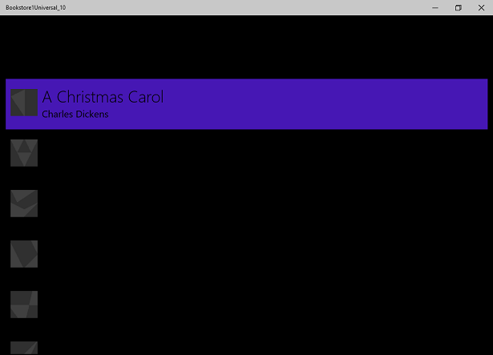

# Étude de cas de portage d’application Windows Runtime8.x vers UWP : Bookstore1

Cette rubrique présente une étude de cas de portage d’une application 8.1 universelle très simple vers une application de plateforme Windows universelle Windows10Universal (UWP). Une application 8.1 universelle est une application qui génère un package d’application pour Windows8.1 et une autre application pour Windows Phone 8.1. Avec Windows 10, vous pouvez créer un package d’application unique que vos clients peuvent installer sur un large éventail d’appareils, et c’est ce que nous allons faire dans cette étude de cas. Voir le [Guide des applications UWP](https://msdn.microsoft.com/library/windows/apps/dn894631).

L’application que nous porterons se compose d’une classe **ListBox** liée à un modèle d’affichage. Ce modèle comporte une liste de livres qui indique leur titre, leur auteur et leur couverture. Les images de couverture de livre possèdent l’attribut **Action de génération** défini sur **Contenu** et l’attribut **Copier dans le répertoire de sortie** défini sur **Ne pas copier**.

Les rubriques précédentes de cette section décrivent les différences entre les plateformes et fournissent des détails et des recommandations sur le processus de portage des différents aspects d’une application dans le balisage XAML, de la liaison à un modèle d’affichage à l’accès aux données. Une étude de cas vise à compléter ces recommandations en les appliquant à un exemple concret. Elle part du principe que vous avez lu les recommandations, qui ne sont donc pas répétées.

**Remarque**  lorsque vous ouvrez Bookstore1Universal\_10 dans Visual Studio, si vous voyez apparaître le message «Visual Studio mise à jour requise», puis suivez les étapes décrites dans [TargetPlatformVersion](w8x-to-uwp-troubleshooting.md).

## Téléchargements

[Téléchargez l’application 8.1 universelle Bookstore1\_81](http://go.microsoft.com/fwlink/?linkid=532946).

[Téléchargez le Bookstore1Universal\_10 Windows 10 application](http://go.microsoft.com/fwlink/?linkid=532950).

## Application8.1 universelle

Voici à quoi ressemble Bookstore1\_81, l’application que nous allons porter. Il s’agit simplement d’une zone de liste à défilement vertical répertoriant des livres au-dessous de l’en-tête constitué du nom de l’application et du titre de la page.

Bookstore1\_81 sur Windows

Bookstore1\_81 sur WindowsPhone

##  Portage d’applications vers un projet Windows 10

La solution Bookstore1\_81 est un projet d’application universelle version 8.1. Elle contient les projets suivants:

-   Bookstore1\_81.Windows. Il s’agit du projet qui génère le package d’application pour Windows8.1.
-   Bookstore1\_81.WindowsPhone. Il s’agit du projet qui crée le package d’application pour WindowsPhone8.1.
-   Bookstore1\_81.Shared. Il s’agit du projet qui contient le code source, les fichiers de balisage et d’autres actifs et ressources qui sont utilisés par les deux autres projets.

Pour cette étude de cas, nous disposons des options habituelles décrites dans la section [Si vous disposez d’une application 8.1 universelle](w8x-to-uwp-root.md), relative aux appareils à prendre en charge. La décision ici est simple: cette application offre les mêmes fonctionnalités et par conséquent, principalement avec le même code, dans ses Windows8.1 et Windows Phone 8.1. Par conséquent, nous allons porter le contenu du projet partagé (et tout ce dont nous avons besoin dans les autres projets) vers un Windows 10 qui cible la famille d’appareils universels (application que vous pouvez installer sur le plus large éventail d’appareils).

La procédure consistant à créer un projet dans VisualStudio, puis à copier des fichiers de Bookstore1\_81 dans ce nouveau projet, est très rapide. Commencez par créer un projet Application vide (universelle Windows). Nommez-le Bookstore1Universal\_10. Il s’agit des fichiers à copier de Bookstore1\_81 dans Bookstore1Universal\_10.

**Dans le projet partagé**

-   Copiez le dossier contenant les fichiers PNG d’image de couverture de livre (dossier \\Assets\\CoverImages). Une fois le dossier copié, dans l’**Explorateur de solutions**, assurez-vous que l’option **Afficher tous les fichiers** est activée. Cliquez avec le bouton droit de la souris sur le dossier que vous avez copié et sélectionnez **Inclure dans le projet**. Cette commande correspond à ce que nous avons voulu dire par «insertion» de fichiers ou de dossiers dans un projet. Chaque fois que vous copiez un fichier ou un dossier, pour chaque copie, sélectionnez **Actualiser** dans **Explorateur de solutions**, puis incluez le fichier ou dossier dans le projet. Cette opération n’est pas nécessaire pour les fichiers dont vous modifiez la destination.
-   Copiez le dossier contenant le fichier source de modèle d’affichage (dossier \\ViewModel).
-   Copiez le fichier MainPage.xaml et remplacez le fichier dans la destination.

**Dans le projet Windows**

-   Copiez le fichier BookstoreStyles.xaml. Nous allons utiliser celle-ci comme un bon point de départ, car toutes les clés de ressources dans ce fichier seront résolu dans une application Windows 10; certaines de ces éléments dans le fichier WindowsPhone équivalent ne seront pas le cas.

Modifiez les fichiers de code source et de balisage que vous venez de copier et remplacez toutes les références à l’espace de noms Bookstore1\_81 par Bookstore1Universal\_10. Une méthode rapide consiste à utiliser la fonctionnalité **Remplacer dans les fichiers**. Aucune modification du code n’est nécessaire dans le modèle d’affichage, ni dans tout autre code impératif. Toutefois, pour simplifier l’identification de la version de l’application en cours d’exécution, modifiez la valeur renvoyée par la propriété **Bookstore1Universal\_10.BookstoreViewModel.AppName** « BOOKSTORE1\_81 » en « BOOKSTORE1UNIVERSAL\_10 ».

Vous pouvez maintenant générer l’application et l’exécuter. Voici comment notre nouvelle application UWP à ressemble aucun travail explicite encore pour le portage vers Windows 10.

L’application Windows 10 avec le code source initial modifié, exécutée sur un appareil de bureau

L’application Windows 10 avec le code source initial modifié, exécutée sur un appareil Mobile

L’association de l’affichage et du modèle d’affichage fonctionne correctement, tout comme la classe **ListBox**. Nous devons simplement corriger le style. Sur un appareil mobile dans le thème à dominante claire, nous pouvons voir la bordure de la zone de liste, mais qui sera facile à masquer. La typographie est également trop grande. Nous modifierons donc les styles utilisés. En outre, l’application doit être de couleur claire lorsqu’elle est exécutée sur un ordinateur de bureau si nous voulons qu’elle ressemble à la valeur par défaut. Par conséquent, nous la modifierons.

## Stylisation universelle

L’application Bookstore1\_81 utilisait deux dictionnaires de ressources différents (BookstoreStyles.xaml) pour personnaliser ses styles pour les systèmes d’exploitation Windows8.1 et Windows Phone 8.1. Aucune de ces deux fichiers BookstoreStyles.xaml ne contient exactement les styles que nous avons besoin pour notre application Windows 10. Or, la bonne nouvelle est que nous voulons un mécanisme beaucoup plus simple que l’un ou l’autre de ces fichiers. Par conséquent, les étapes suivantes impliquent principalement la suppression et la simplification de nos fichiers de projet et du balisage. Les étapes sont les suivantes. Et vous pouvez utiliser les liens en haut de cette rubrique pour télécharger les projets et afficher les résultats de toutes les modifications entre ce stade et la fin de l’étude de cas.

-   Pour bien faire la différence entre les éléments, recherchez le modèle de données `BookTemplate` dans le fichier MainPage.xaml et supprimez la chaîne `Margin="0,0,0,8"` de l’élément **Grid** racine.
-   Également dans `BookTemplate`, il existe des références à `BookTemplateTitleTextBlockStyle` et `BookTemplateAuthorTextBlockStyle`. Bookstore1\_81 utilisait ces clés comme une indirection afin qu’une seule clé ait des implémentations différentes dans les deux applications. Nous n’avons plus besoin de cette indirection; nous pouvons référencer directement les styles du système. Par conséquent, remplacez ces références par `TitleTextBlockStyle` et `SubtitleTextBlockStyle`, respectivement.
-   À présent, nous devons définir l’arrière-plan de `LayoutRoot` sur la valeur par défaut appropriée afin que l’application se présente correctement lorsqu’elle est exécutée sur tous les appareils, quel que soit le thème. Remplacez sa valeur `"Transparent"` par la valeur `"{ThemeResource ApplicationPageBackgroundThemeBrush}"`.
-   Dans l’élément `TitlePanel`, remplacez la référence à `TitleTextBlockStyle` (un peu trop importante, désormais) par une référence à `CaptionTextBlockStyle`. `PageTitleTextBlockStyle` est une autre indirection Bookstore1\_81 dont nous n’avons plus besoin. Modifiez-la pour faire référence à `HeaderTextBlockStyle` à la place.
-   Nous n’avons plus besoin de définir un arrière-plan, un style ni un ItemContainerStyle spécial dans l’élément **ListBox**, mais simplement de supprimer ces trois attributs et leurs valeurs du balisage. Toutefois, nous souhaitons masquer la bordure de l’élément **ListBox**. Donc, ajoutez `BorderBrush="{x:Null}"` à celui-ci.
-   Nous n’allons plus faire référence à des ressources du fichier BookstoreStyles.xaml **ResourceDictionary**. Vous pouvez supprimer toutes ces ressources. Mais ne supprimez pas le fichier BookstoreStyles.xaml : nous devons encore l’utiliser, comme vous le verrez dans la section suivante.

Une fois cette séquence d’opérations de stylisation effectuée, l’application ressemble à ceci.

L’application Windows 10 quasiment portée, exécutée sur un appareil de bureau

L’application Windows 10 quasiment portée, exécutée sur un appareil Mobile

## Ajustement facultatif de la zone de liste pour les appareils mobiles

Lorsque l’application s’exécute sur un périphérique mobile, l’arrière-plan d’une zone de liste est clair par défaut dans les deux thèmes. Vous préférerez peut-être ce style et, dans ce cas, vous n’avez plus rien à faire si ce n’est nettoyer : supprimez le fichier de dictionnaire de ressources BookstoreStyles.xaml de votre projet et supprimez le balisage qui le fusionne dans le fichier MainPage.xaml.

Toutefois, les contrôles sont conçus pour que vous puissiez personnaliser leur apparence tout en préservant leur comportement. Par conséquent, si vous souhaitez que la zone de liste soit sombre dans le thème à dominante foncée (l’apparence de l’application d’origine), cette section décrit la manière de procéder.

Les modifications que nous apportons ne doivent pas affecter l’application lorsqu’elle s’exécute sur des appareils mobiles. Nous utiliserons donc un style de zone de liste très légèrement personnalisé lors d’une exécution sur la famille d’appareils mobiles, et nous continuerons à utiliser le style par défaut sur tous les autres. Pour ce faire, nous allons effectuer une copie de BookstoreStyles.xaml et lui donner un nom complet MRT spécial qui entraînera son chargement sur les appareils mobiles uniquement.

Ajoutez un nouvel élément de projet **ResourceDictionary** et nommez-le BookstoreStyles.DeviceFamily-Mobile.xaml. Vous disposez maintenant de deux fichiers dont le nom logique est BookstoreStyles.xaml (c’est le nom que vous utiliserez dans votre balisage et dans le code). Les fichiers portent des noms physiques différents pour pouvoir contenir un balisage différent. Vous pouvez utiliser ce schéma de nommage qualifié MRT avec n’importe quel fichier xaml, mais n’oubliez pas que tous les fichiers xaml ayant le même nom logique partagent un fichier code-behind xaml.cs unique (le cas échéant).

Modifiez une copie du modèle de contrôle de la zone de liste et stockez-la avec la clé de `BookstoreListBoxStyle` dans le nouveau dictionnaire de ressources, BookstoreStyles.DeviceFamily-Mobile.xaml. Maintenant, nous allons apporter des modifications simples à trois méthodes setter.

-   Dans la méthode setter de premier plan, remplacez la valeur par `"{x:Null}"`. Notez que la définition d’une propriété sur `"{x:Null}"` directement dans un élément revient à définir la valeur `null` dans le code. Mais l’utilisation de la valeur `"{x:Null}"` dans une méthode setter a un seul effet : elle remplace la méthode setter dans le style par défaut (pour la même propriété) et rétablit la valeur par défaut de la propriété sur l’élément cible.
-   Dans la méthode setter d’arrière-plan, remplacez la valeur par `"Transparent"` pour supprimer cet arrière-plan clair.
-   Dans la méthode setter de modèle, recherchez l’état visuel nommé `Focused` et supprimez sa table de montage séquentielle, la rendant ainsi dans une balise vide.
-   Supprimez toutes les autres méthodes setter du balisage.

Pour finir, copiez l’élément `BookstoreListBoxStyle` dans BookstoreStyles.xaml et supprimez ses trois méthodes setter, ce qui le convertit en une balise vide. Nous effectuons cette opération pour que, sur les appareils autres que mobiles, notre référence à BookstoreStyles.xaml et à `BookstoreListBoxStyle` soit résolue, mais qu’elle n’ait aucun effet.

Application Windows 10 portée, exécutée sur un appareil Mobile

## Conclusion

Cette étude de cas vous a décrit le processus de portage d’une application très simple, probablement non réaliste. Par exemple, une zone de liste peut être utilisée pour la sélection ou pour la création d’un contexte de navigation. L’application accède à une page contenant plus de détails sur l’élément sélectionné. Cette application particulière ne fait rien avec la sélection de l’utilisateur et est dépourvue de navigation. Malgré tout, l’étude de cas a servi à briser la glace, afin d’introduire le processus de portage et d’illustrer les techniques importantes que vous pouvez utiliser dans les applications UWP réelles.

Nous avons également pu constater que le processus de portage des modèles d’affichage était généralement fluide. Cependant, la prise en charge du facteur de forme et l’interface utilisateur risquent fort de nécessiter une certaine attention lors du portage.

Dans l’étude de cas suivante, [Bookstore2](w8x-to-uwp-case-study-bookstore2.md), nous examinons l’accès aux données groupées et leur affichage.
