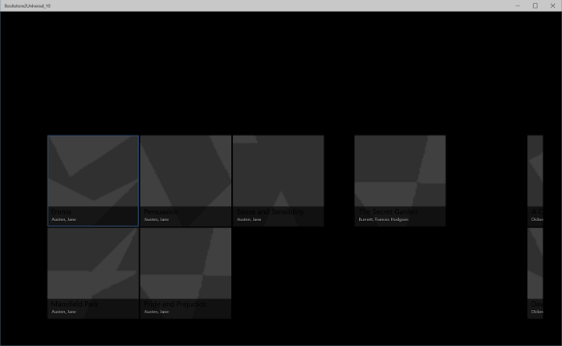
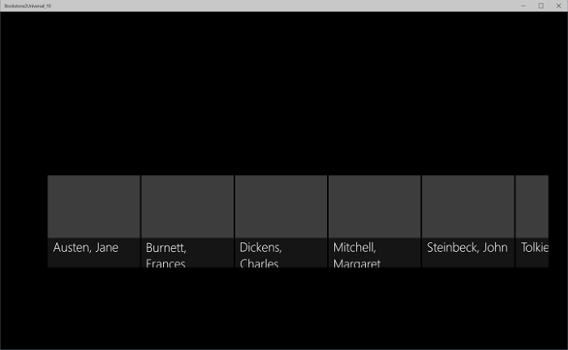
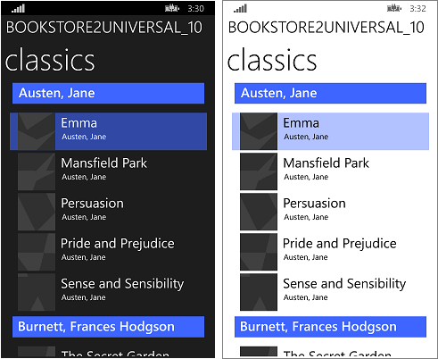
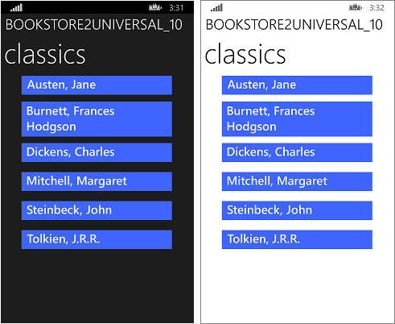

# <a name="windows-runtime-8x-to-uwp-case-study-bookstore2"></a>Windows Runtime 8.x à UWP les étude de cas : Bookstore2


Cette étude de cas, qui repose sur les informations fournies dans [Bookstore1](w8x-to-uwp-case-study-bookstore1.md), commence par une application 8.1 universelle qui affiche des données groupées dans un contrôle [**SemanticZoom**](https://msdn.microsoft.com/library/windows/apps/hh702601). Dans le modèle d’affichage, chaque instance de la classe **Author** représente l’ensemble des livres écrits par l’auteur en question ; dans l’élément **SemanticZoom**, nous pouvons afficher la liste des livres regroupés par auteur ou nous pouvons effectuer un zoom arrière pour afficher une liste de raccourcis relatifs aux auteurs. Grâce à cette liste, vous pouvez vous déplacer beaucoup plus rapidement que si vous faisiez défiler la liste des ouvrages. Détaille les étapes de déplacement de l’application à une application de plateforme Windows universelle (UWP) de Windows 10.

**Remarque**    lors de l’ouverture Bookstore2Universal\_10 dans Visual Studio, si vous voyez le message « Visual Studio mise à jour requise », puis suivez les étapes décrites dans [TargetPlatformVersion](w8x-to-uwp-troubleshooting.md).

## <a name="downloads"></a>Téléchargements

[Téléchargez le Bookstore2\_81 8.1 universelle application](https://go.microsoft.com/fwlink/?linkid=532951).

[Téléchargez le Bookstore2Universal\_application 10 Windows 10](https://go.microsoft.com/fwlink/?linkid=532952).

## <a name="the-universal-81-app"></a>Application 8.1 universelle

Voici les Bookstore2\_81, l’application que nous allons port — ressemble. Il s’agit d’un contrôle [**SemanticZoom**](https://msdn.microsoft.com/library/windows/apps/hh702601) à défilement horizontal (ou vertical sur Windows Phone), qui affiche des livres regroupés par auteur. Vous pouvez effectuer un zoom arrière vers la liste de raccourcis et, à partir de cette dernière, revenir à n’importe quel groupe. Cette application comporte deux parties principales : le modèle d’affichage, qui fournit la source de données groupées, et l’interface utilisateur, qui est liée à ce modèle d’affichage. Comme nous le verrons, ces deux éléments port facilement à partir de la technologie de WinRT 8.1 vers Windows 10.


Bookstore2\_81 sur Windows, vue Zoom avant
 


Bookstore2\_81 sur Windows, vue Zoom arrière


Bookstore2\_81 sur Windows Phone, vue Zoom avant


Bookstore2\_81 sur Windows Phone, vue Zoom arrière

##  <a name="porting-to-a-windows10-project"></a>Portage vers un projet Windows 10

Le Bookstore2\_solution 81 est un projet d’application universelle 8.1. Le Bookstore2\_projet de Windows 81. génère le package d’application pour Windows 8.1 et la Bookstore2\_81. WindowsPhone projet génère le package d’application pour Windows Phone 8.1. Bookstore2\_81. partagé est le projet qui contient le code source, les fichiers de balisage et autres ressources et des ressources, qui sont utilisés par les deux autres projets.

Tout comme avec l’étude de cas précédent, l’option nous allons (de ceux décrits dans [si vous avez une application universelle 8.1](w8x-to-uwp-root.md)) consiste à porter le contenu du projet partagé vers Windows 10 qui cible la famille de périphériques universelle.

Commencez par créer un projet Application vide (universelle Windows). Nommez-le Bookstore2Universal\_10. Ce sont les fichiers à copier à partir de Bookstore2\_81 à Bookstore2Universal\_10.

**À partir du projet partagé**

-   Copiez le dossier contenant les fichiers de carnet cover image PNG (le dossier est \\actifs\\CoverImages). Une fois le dossier copié, dans l’**Explorateur de solutions**, assurez-vous que l’option **Afficher tous les fichiers** est activée. Cliquez avec le bouton droit de la souris sur le dossier que vous avez copié et sélectionnez **Inclure dans le projet**. Cette commande correspond à ce que nous avons voulu dire par « insertion » de fichiers ou de dossiers dans un projet. Chaque fois que vous copiez un fichier ou un dossier, pour chaque copie, sélectionnez **Actualiser** dans **Explorateur de solutions**, puis incluez le fichier ou dossier dans le projet. Cette opération n’est pas nécessaire pour les fichiers dont vous modifiez la destination.
-   Copiez le dossier contenant le fichier de source de modèle de vue (le dossier est \\ViewModel).
-   Copiez le fichier MainPage.xaml et remplacez le fichier dans la destination.

**À partir du projet Windows**

-   Copiez le fichier BookstoreStyles.xaml. Nous allons utiliser celle-ci comme un bon point de départ, car toutes les clés de ressources dans ce fichier seront résolus dans une application Windows 10 ; certains d'entre eux dans le fichier WindowsPhone équivalent ne seront pas le cas.
-   Copiez les fichiers SeZoUC.xaml et SeZoUC.xaml.cs. Nous allons commencer par la version de cet affichage pour Windows, qui est appropriée pour les fenêtres étendues. Ensuite, nous adapterons ce contenu à des fenêtres plus petites et, de ce fait, à des appareils plus petits.

Modifier les fichiers de code et le balisage source que vous venez de copier et modifier toutes les références à la Bookstore2\_81 espace de noms Bookstore2Universal\_10. Une méthode rapide consiste à utiliser la fonctionnalité **Remplacer dans les fichiers**. Aucune modification du code n’est nécessaire dans le modèle d’affichage, ni dans tout autre code impératif. Mais, simplement pour le rendre plus facile de déterminer quelle version de l’application est en cours d’exécution, modifiez la valeur retournée par la **Bookstore2Universal\_10.BookstoreViewModel.AppName** propriété à partir de « Bookstore2\_81 » à » BOOKSTORE2UNIVERSAL\_10 ».

Vous pouvez maintenant générer l’application et l’exécuter. Voici comment notre nouvelle application UWP après n’avoir fait aucun travail encore pour porter vers Windows 10.



L’application Windows 10 avec les modifications de code source initial en cours d’exécution sur un appareil de bureau, vue Zoom avant



L’application Windows 10 avec les modifications de code source initial en cours d’exécution sur un appareil de bureau, vue Zoom arrière

Le modèle d’affichage et les vues avec zoom avant et arrière fonctionnent ensemble correctement. Cependant, il existe certains problèmes, qui les rendent difficiles à voir. Exemple de problème : l’élément [**SemanticZoom**](https://msdn.microsoft.com/library/windows/apps/hh702601) ne défile pas. C’est pourquoi, dans Windows 10, le style par défaut d’un [ **GridView** ](https://msdn.microsoft.com/library/windows/apps/br242705) provoque doivent être disposées verticalement (ainsi que la conception de Windows 10 que nous l’utiliser de cette façon dans nouveau et les applications migrées est recommandé). Mais, paramètres du modèle de panneau d’éléments personnalisés que vous avez copié à partir de la Bookstore2 de défilement horizontal\_projet 81 (qui a été conçu pour la version 8.1 app) sont en conflit avec les paramètres de défilement verticales dans le style par défaut de Windows 10 qui est en cours appliqué à la suite de nous avoir déplacée vers une application Windows 10. Deuxième problème : l’application ne peut pas encore adapter son interface utilisateur à l’appareil de l’utilisateur, afin de lui offrir la meilleure expérience possible, quelle que soit la taille des fenêtres et de l’appareil. Enfin, les styles et pinceaux corrects ne sont pas encore utilisés, ce qui entraîne l’invisibilité d’une partie du texte (cela inclut les en-têtes de groupe sur lesquels vous pouvez cliquer pour effectuer un zoom arrière). Ainsi, dans les trois sections suivantes ([Modifications de conception des éléments SemanticZoom et GridView](#semanticzoom-and-gridview-design-changes), [L’interface utilisateur adaptative](#adaptive-ui), et [Stylisation universelle](#universal-styling)) nous allons remédier à ces problèmes.

## <a name="semanticzoom-and-gridview-design-changes"></a>Modifications de conception des éléments SemanticZoom et GridView

Les modifications de conception dans Windows 10 pour le [ **SemanticZoom** ](https://msdn.microsoft.com/library/windows/apps/hh702601) contrôle sont décrits dans la section [SemanticZoom modifications](w8x-to-uwp-porting-xaml-and-ui.md). Nous n’avons aucune tâche à effectuer dans cette section suite à ces modifications.

Les modifications apportées à l’élément [**GridView**](https://msdn.microsoft.com/library/windows/apps/br242705) sont décrites dans la section [Modifications GridView/ListView](w8x-to-uwp-porting-xaml-and-ui.md). Nous devons effectuer quelques réglages mineurs pour nous adapter à ces modifications, comme décrit ci-dessous.

-   Dans l’élément `ZoomedInItemsPanelTemplate` du fichier SeZoUC.xaml, définissez les paramètres `Orientation="Horizontal"` et `GroupPadding="0,0,0,20"`.
-   Toujours dans ce fichier, supprimez l’élément `ZoomedOutItemsPanelTemplate`, puis supprimez l’attribut `ItemsPanel` de la vue avec zoom arrière.

C’est tout !

## <a name="adaptive-ui"></a>Interface utilisateur adaptative

Une fois cette modification effectuée, la disposition de l’interface utilisateur proposée par le fichier SeZoUC.xaml est très utile lorsque l’application s’exécute dans une fenêtre large (opération uniquement possible sur un appareil doté d’un grand écran). Par contre, lorsque la fenêtre d’application est étroite (comme sur un appareil de petite taille, voire sur certains appareils plus grands), l’interface utilisateur proposée par l’application du Windows Phone Store est sans aucun doute la plus appropriée.

Nous pouvons utiliser la fonction Gestionnaire d’état visuel adaptative pour y parvenir. Nous allons définir des propriétés sur les éléments visuels afin que, par défaut, l’interface utilisateur présente une disposition étroite à l’aide des plus petits modèles que nous utilisions dans l’application du Windows Phone Store. Ensuite, nous détecterons les cas où la fenêtre de l’application est d’une largeur égale ou supérieure à une taille spécifique (mesurée en [pixels effectifs](w8x-to-uwp-porting-xaml-and-ui.md)), et nous modifierons alors les propriétés des éléments visuels comme il convient afin d’obtenir une disposition plus grande et plus large. Nous affecterons à ces changements de propriété un état visuel ; nous utiliserons un déclencheur adaptatif pour effectuer un suivi en continu et déterminer si l’état visuel doit ou non être appliqué, selon la largeur de la fenêtre en pixels effectifs. Dans ce cas précis, nous baserons le déclenchement sur la largeur de la fenêtre, mais il est également possible de choisir la hauteur de la fenêtre comme déclencheur.

Une largeur minimale de 548 epx est appropriée pour ce cas d’utilisation, car cette valeur correspond à la taille de l’appareil le plus petit auquel nous voulons appliquer la disposition d’écran large. En général, les téléphones présentent une largeur inférieure à 548 epx. Ainsi, sur ce type d’appareil de petite taille, nous conserverons la disposition étroite par défaut. Sur un PC, par défaut, la fenêtre s’ouvre sur une largeur suffisante pour déclencher le passage à l’état large. À partir de là, vous serez en mesure de faire glisser la fenêtre afin qu’elle soit suffisamment étroite pour afficher deux colonnes pour les éléments d’une taille de 250 x 250. Si vous utilisez une largeur inférieure, le déclencheur sera désactivé, l’état visuel large sera supprimé, et la disposition étroite par défaut continuera d’être appliquée.

Ainsi, quelles sont les propriétés que nous devons définir—et modifier—pour bénéficier de ces deux dispositions ? Il existe deux solutions, qui font chacune appel à une méthode différente.

1.  Nous pouvons placer deux contrôles [**SemanticZoom**](https://msdn.microsoft.com/library/windows/apps/hh702601) dans notre balisage. Un peut être une copie de la balise que vous avez utilisé dans l’application de 8.x Windows Runtime (à l’aide de [ **GridView** ](https://msdn.microsoft.com/library/windows/apps/br242705) contrôles qu’il contient) et réduit par défaut. Quant à l’autre, il correspond à une copie du balisage que nous avons utilisé dans l’application du Windows Phone Store (en utilisant des contrôles [**ListView**](https://msdn.microsoft.com/library/windows/apps/br242878) à l’intérieur de cette copie), visible par défaut. L’état visuel fait alors basculer les propriétés de visibilité des deux contrôles **SemanticZoom**. L’exécution de cette technique nécessite peu d’efforts, mais ses performances sont généralement moyennes. Ainsi, si vous l’utilisez, vous devez profiler votre application et vous assurer qu’elle répond toujours à vos objectifs en termes de performances.
2.  Nous pouvons utiliser un seul élément [**SemanticZoom**](https://msdn.microsoft.com/library/windows/apps/hh702601) contenant des contrôles [**ListView**](https://msdn.microsoft.com/library/windows/apps/br242878). Pour obtenir nos deux dispositions, dans l’état visuel large, nous modifions les propriétés des contrôles **ListView**, y compris des modèles qui leur sont appliqués, pour entraîner leur disposition de la même manière que celle d’un élément [**GridView**](https://msdn.microsoft.com/library/windows/apps/br242705). Cette solution offre des performances sans doute meilleures, mais se révèle également la plus difficile à appliquer, à cause du nombre de petites différences entre les styles et modèles des éléments **GridView** et **ListView**, et entre leurs divers types d’éléments. Cette solution est étroitement associée au mode de conception des styles et modèles par défaut à ce moment précis ; nous obtenons une solution fragile et sensible aux éventuelles modifications futures des valeurs par défaut.

Dans cette étude de cas, nous allons choisir la première solution. Cependant, vous pouvez choisir la deuxième méthode, si elle vous convient mieux. Voici les étapes à suivre pour implémenter cette première solution.

-   Dans l’élément [**SemanticZoom**](https://msdn.microsoft.com/library/windows/apps/hh702601) du balisage du nouveau projet, définissez `x:Name="wideSeZo"` et `Visibility="Collapsed"`.
-   Revenez à la Bookstore2\_81. WindowsPhone de projet et ouvrez SeZoUC.xaml. Copiez le balisage de l’élément [**SemanticZoom**](https://msdn.microsoft.com/library/windows/apps/hh702601) de ce fichier et collez-le juste après l’élément `wideSeZo` dans votre nouveau projet. Définissez `x:Name="narrowSeZo"` sur l’élément que vous venez de coller.
-   Toutefois, l’élément `narrowSeZo` nécessite quelques styles que nous n’avons pas encore copiés. Nouveau dans Bookstore2\_81.WindowsPhone, copiez les deux styles (`AuthorGroupHeaderContainerStyle` et `ZoomedOutAuthorItemContainerStyle`) hors SeZoUC.xaml et collez-les dans BookstoreStyles.xaml dans votre nouveau projet.
-   Le nouveau fichier SeZoUC.xaml inclut désormais deux nouveaux éléments [**SemanticZoom**](https://msdn.microsoft.com/library/windows/apps/hh702601). Incluez ces deux éléments dans un élément **Grid**.
-   Dans le fichier BookstoreStyles.xaml de votre nouveau projet, ajoutez le mot `Wide` à ces trois clés de ressources (et à leurs références dans le fichier SeZoUC.xaml, mais uniquement aux références à l’intérieur de l’élément `wideSeZo`) : `AuthorGroupHeaderTemplate`, `ZoomedOutAuthorTemplate`, et `BookTemplate`.
-   Dans le Bookstore2\_81. WindowsPhone projet, ouvrez BookstoreStyles.xaml. À partir de ce fichier, copiez ces mêmes trois ressources (mentionnés ci-dessus), et les deux raccourcis convertisseurs d’élément de liste et la déclaration de préfixe d’espace de noms Windows\_l’interface utilisateur\_Xaml\_contrôles\_Primitives, puis collez-les tous les dans BookstoreStyles.xaml dans votre nouveau projet.
-   Enfin, dans le fichier SeZoUC.xaml de votre nouveau projet, ajoutez le balisage de gestionnaire d’état visuel approprié pour l’élément **Grid** que vous avez ajouté ci-dessus.

```xml
    <Grid>
        <VisualStateManager.VisualStateGroups>
            <VisualStateGroup>
                <VisualState x:Name="WideState">
                    <VisualState.StateTriggers>
                        <AdaptiveTrigger MinWindowWidth="548"/>
                    </VisualState.StateTriggers>
                    <VisualState.Setters>
                        <Setter Target="wideSeZo.Visibility" Value="Visible"/>
                        <Setter Target="narrowSeZo.Visibility" Value="Collapsed"/>
                    </VisualState.Setters>
                </VisualState>
            </VisualStateGroup>
        </VisualStateManager.VisualStateGroups>

    ...

    </Grid>
```

## <a name="universal-styling"></a>Stylisation universelle

Nous allons désormais résoudre certains problèmes de style, y compris celui que nous avons introduit ci-dessus lors de l’opération de copie à partir de l’ancien projet.

-   Dans le fichier MainPage.xaml, remplacez l’arrière-plan de l’élément `LayoutRoot` par `"{ThemeResource ApplicationPageBackgroundThemeBrush}"`.
-   Dans le fichier BookstoreStyles.xaml, définissez la valeur de la ressource `TitlePanelMargin` sur `0` (ou sur toute valeur qui vous convienne).
-   Dans le fichier SeZoUC.xaml, définissez la marge de l’élément `wideSeZo` sur `0` (ou sur toute valeur qui vous convienne).
-   Dans le fichier BookstoreStyles.xaml, supprimez l’attribut Margin de l’élément `AuthorGroupHeaderTemplateWide`.
-   Supprimez l’attribut FontFamily des éléments `AuthorGroupHeaderTemplate` et `ZoomedOutAuthorTemplate`.
-   Bookstore2\_81 utilisé le `BookTemplateTitleTextBlockStyle`, `BookTemplateAuthorTextBlockStyle`, et `PageTitleTextBlockStyle` ressources clés en tant qu’une indirection afin qu’une seule clé avait des implémentations différentes dans les deux applications. Nous n’avons plus besoin de cette indirection ; nous pouvons référencer directement les styles du système. Par conséquent, dans toute l’application, remplacez ces références par `TitleTextBlockStyle`, `CaptionTextBlockStyle` et `HeaderTextBlockStyle`, respectivement. Vous pouvez également utiliser la fonction **Remplacer dans les fichiers** de Visual Studio pour effectuer cette opération rapidement et de manière précise. Vous pouvez ensuite supprimer ces trois ressources inutilisées.
-   Dans `AuthorGroupHeaderTemplate`, remplacez l’élément `PhoneAccentBrush` par `SystemControlBackgroundAccentBrush` et définissez `Foreground="White"` sur l’élément **TextBlock** afin qu’il apparaisse correctement lors de l’exécution sur la famille d’appareils mobiles.
-   Dans l’élément `BookTemplateWide`, copiez l’attribut Foreground du deuxième élément **TextBlock** vers le premier.
-   Dans l’élément `ZoomedOutAuthorTemplateWide`, remplacez la référence à `SubheaderTextBlockStyle` (un peu trop importante, désormais) par une référence à `SubtitleTextBlockStyle`.
-   La vue avec zoom arrière (liste de raccourcis) ne se superpose plus à la vue avec zoom avant dans la nouvelle plateforme. De ce fait, nous pouvons supprimer l’attribut `Background` de la vue avec zoom arrière de l’élément `narrowSeZo`.
-   Pour que tous les styles et modèles figurent dans un seul fichier, retirez l’élément `ZoomedInItemsPanelTemplate` du fichier SeZoUC.xaml et placez-le dans le fichier BookstoreStyles.xaml.

Une fois cette séquence d’opérations de stylisation effectuée, l’application ressemble à ceci.


L’application migrée de Windows 10 s’exécutant sur un appareil de bureau, vue Zoom avant, deux tailles de fenêtre


L’application migrée de Windows 10 s’exécutant sur un appareil de bureau, vue Zoom arrière, deux tailles de fenêtre



L’application migrée de Windows 10 s’exécutant sur un appareil Mobile, la vue Zoom avant



L’application migrée de Windows 10 s’exécutant sur un appareil Mobile, la vue Zoom arrière

## <a name="conclusion"></a>Conclusion

Cette étude de cas reposait sur une interface utilisateur plus ambitieuse que celle de l’étude précédente. Comme pour l’étude de cas précédente, ce modèle d’affichage particulier n’a requis aucun effort. Nous avons surtout dû nous concentrer sur la refactorisation de l’interface utilisateur. Certaines modifications inévitables ont été le fruit de la combinaison de deux projets en un seul, qui devait toujours prendre en charge de nombreux facteurs de forme (en fait, nettement plus qu’auparavant). Certaines de ces modifications étaient liées aux changements apportés à la plateforme.

Dans l’étude de cas suivante, [QuizGame](w8x-to-uwp-case-study-quizgame.md), nous examinons l’accès aux données groupées et leur affichage.
