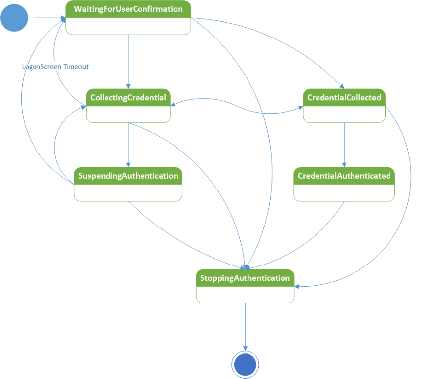

# DéverrouillageWindows avec appareils (IoT) complémentaires

Un dispositif complémentaire est un appareil pouvant agir en conjonction avec votre ordinateur de bureau Windows10 pour améliorer l’expérience d’authentification utilisateur. S’appuyant sur l’infrastructure CompanionDeviceFramework, un dispositif complémentaire peut enrichir considérablement l’expérience MicrosoftPassport, même en l’absence de WindowsHello (par exemple, si l’ordinateur de bureau Windows10 ne dispose pas d’appareil photo pour l’authentification faciale ou d’un lecteur d’empreintes digitales).

> **Remarque** L’infrastructure Companion Device Framework est une fonctionnalité spécialisée qui n’est pas disponible pour tous les développeurs d’applications. Pour utiliser cette infrastructure, votre application doit être spécialement approvisionnée par Microsoft et répertorier la fonctionnalité *secondaryAuthenticationFactor* dans son manifeste. Pour obtenir une approbation, contactez [cdfonboard@microsoft.com](mailto:cdfonboard@microsoft.com).

## Introduction

> Pour obtenir un aperçu vidéo, voir la session [Déverrouillage Windows avec appareils IoT](https://channel9.msdn.com/Events/Build/2016/P491) à partir de la Build2016 sur le canal9.

### Cas d’utilisation

Plusieurs méthodes existent pour créer une excellente expérience de déverrouillage Windows avec un dispositif complémentaire à l’aide de l’infrastructure CompanionDeviceFramework. Les utilisateurs peuvent, par exemple:

- attacher leurs dispositifs complémentaires aux PC via USB, puis effleurer le bouton sur le dispositif complémentaire pour déverrouiller automatiquement leur PC;
- porter sur eux un téléphone déjà couplé à un PC via Bluetooth. Le fait d’appuyer sur la barre d’espace du PC envoie une notification au téléphone. L’approbation de ce message par l’utilisateur déverrouille le PC;
- poser rapidement leur dispositif complémentaire contre un lecteurNFC pour déverrouiller leur ordinateur en toute rapidité;
- porter des bracelets connectés ayant déjà authentifié l’utilisateur. Lorsque l’utilisateur s’approche du PC et effectue un mouvement spécial, comme se frapper dans les mains, le PC se déverrouille.

### Dispositifs complémentaires fonctionnant par biométrie

Si l’appareil complémentaire prend en charge la biométrie, [Windows Biometric Framework](https://msdn.microsoft.com/library/windows/hardware/mt608302(v=vs.85).aspx) peut parfois s’avérer une meilleure solution que Companion Device Framework. Veuillez contacter [cdfonboard@microsoft.com](mailto:cdfonboard@microsoft.com) pour que nous vous aidions à choisir l’approche la plus adaptée.

### Composants de la solution

Le diagramme ci-dessous illustre les composants de la solution et leurs fabricants respectifs.


L’infrastructure CompanionDeviceFramework est implémentée en tant que service exécuté sur Windows (appelé service d’authentification par dispositif complémentaire dans cet article). Ce service génère un jeton de déverrouillage qui doit être protégé par une cléHMAC stockée sur un dispositif complémentaire. Cela garantit un accès au jeton de déverrouillage nécessitant la présence d’un dispositif complémentaire. Chaque tuple (PC, utilisateur Windows) se voit affecter un seul jeton de déverrouillage.

L’intégration avec l’infrastructure CompanionDeviceFramework nécessite:

- une application de [plateforme Windows universelle (UWP)](https://msdn.microsoft.com/windows/uwp/get-started/universal-application-platform-guide) pour le dispositif complémentaire, téléchargée à partir du Windows Store ; 
- la possibilité de créer deux clésHMAC 256bits sur le dispositif complémentaire et générer un HMAC avec ce dernier (à l’aide de SHA-256).
- une bonne configuration des paramètres de sécurité sur le Bureau Windows10. Le service d’authentification par dispositif complémentaire nécessite un PIN avant de pouvoir accueillir un dispositif complémentaire. Les utilisateurs doivent configurer ce PIN dans Paramètres &gt; Comptes &gt; Options de connexion.

Outre les exigences ci-dessus, l’application pour le dispositif complémentaire est responsable de:

- l’expérience utilisateur et la personnalisation lors de l’inscription initiale, puis la désinscription du dispositif complémentaire;
- l’exécution en arrière-plan, la prise en main du dispositif complémentaire, la communication avec ce dernier ainsi que le service d’authentification par dispositif complémentaire.
- Gestion des erreurs

Les dispositifs complémentaires sont généralement fournis avec une application pour leur configuration initiale, comme les bracelets connectés. Les fonctionnalités décrites dans le présent document peuvent faire partie de l’application en question; une application distincte ne devrait pas être requise.  

### Signaux utilisateur

Chaque dispositif complémentaire doit être associé à une application qui prend en charge trois signaux utilisateur. Ces signaux peuvent être exprimés sous forme d’une action ou d’un geste.

- **Signal d’intention** : permet à l’utilisateur d’indiquer sa volonté de déverrouiller l’appareil, en appuyant sur un bouton du dispositif complémentaire, par exemple. Le signal d’intention doit être capturé du côté du **dispositif complémentaire**.
- **Signal de présence de l’utilisateur** : apporte la preuve de la présence de l’utilisateur. Le dispositif complémentaire devrait, par exemple, être activé par PIN ou un bouton avant de pouvoir être utilisé pour déverrouiller le PC (à ne pas confondre avec le PIN du PC).
- **Signal de levée d’ambiguïté** : lève l’ambiguïté sur quel Bureau Windows 10 l’utilisateur souhaite déverrouiller lorsque plusieurs options se présentent au dispositif complémentaire.

Un nombre quelconque de ces signaux utilisateur peut être combiné en un seul signal. La présence de l’utilisateur et les signaux d’intention doivent être obligatoires à chaque utilisation.

### Inscription et communication future entre un PC et dispositifs complémentaires

Un dispositif complémentaire doit être inscrit auprès de l’infrastructure CompanionDeviceFramework avant de pouvoir le relier à cette dernière. L’expérience d’inscription est entièrement dictée par l’application du dispositif complémentaire.

Une interconnexion entre le dispositif complémentaire et l’appareil de bureauWindows10 ayant fait l’objet d’une inscription peut servir plusieurs appareils; un seul dispositif complémentaire peut être utilisé pour plusieurs appareils de bureauWindows10. Toutefois, chaque dispositif complémentaire peut uniquement être utilisé pour un seul utilisateur sur chaque appareil de bureauWindows10.   

Le type de transport entre le PC et le dispositif doit être configuré avant de pouvoir établir une communication entre les deux appareils. Ce choix est fait par l’application du dispositif complémentaire; l’infrastructure CompanionDeviceFramework n’impose aucune restriction sur le type de transport (USB, NFC, Wi-Fi, BT, BLE, etc.) ou le protocole utilisé entre le dispositif complémentaire et l’application du dispositif complémentaire du côté de l’appareil de bureauWindows10. Elle soulève cependant certaines considérations de sécurité liées à la couche transport, indiquées à la section «Exigences de sécurité» du présent document. Il incombe au fournisseur de l’appareil de faire respecter ces exigences. Cela n’est pas du ressort de l’infrastructure.


## Modèle d’interaction utilisateur

### Découverte, installation et première inscription de l’application du dispositif complémentaire

Un flux de travail classique se présente de la manière suivante:

- L’utilisatrice configure le PIN sur chacun des appareils de bureauWindows10 cibles qu’elle souhaite déverrouiller avec le dispositif complémentaire.
- Elle exécute l’application du dispositif complémentaire sur son appareil de bureauWindows10 pour l’inscrire auprès du BureauWindows10.

Remarques:

- Nous vous recommandons la rationalisation, voire l’automatisation si possible, de la découverte, du téléchargement et de l’exécution de l’application du dispositif complémentaire (l’application peut, par exemple, être téléchargée en posant brièvement le dispositif complémentaire sur un lecteurNFC du côté de l’appareil de bureauWindows10). Le dispositif complémentaire et son application doivent cependant les appliquer automatiquement.
- Dans un environnement d’entreprise, l’application de dispositif complémentaire peut être déployée via GPM.
- L’application de dispositif complémentaire doit afficher à l’utilisateur tout message d’erreur lié à l’inscription.

### Protocole d’inscription et de désinscription

Le schéma suivant illustre la façon dont le dispositif complémentaire interagit avec le service d’authentification par dispositif complémentaire.  


Deux clés sont utilisées dans notre protocole:

- La clé de périphérique (**devicekey**) : permet de protéger les jetons de déverrouillage que nécessitent les PC pour déverrouiller Windows.
- La clé d’authentification (**authkey**) : permet d’authentifier mutuellement le dispositif complémentaire et le service d’authentification par dispositif complémentaire.

La clé de périphérique et les clés d’authentification sont échangées entre l’application du dispositif complémentaire et le dispositif complémentaire au moment de l’inscription. Par conséquent, l’application du dispositif complémentaire et le dispositif complémentaire doivent utiliser un transport sécurisé pour protéger les clés.

Notez également que, même si le schéma ci-dessus présente deux clésHMAC générées sur le dispositif complémentaire, l’application peut également les générer pour ensuite les envoyer au dispositif complémentaire à des fins de stockage.

### Lancer le flux d’authentification

L’utilisateur peut lancer le flux d’authentification vers le BureauWindows10 à l’aide de l’infrastructure CompanionDeviceFramework de deux façons (c’est-à-dire, avec un signal d’intention):

- Ouvrez l’ordinateur portable ou appuyez sur la barre d’espace/effectuez un balayage vers le haut surPC.
- Faites un geste ou une action du côté du dispositif complémentaire.

Ce dernier choisit lequel d’entre eux constitue un point de départ. L’infrastructure CompanionDeviceFramework informera l’application du dispositif complémentaire lorsque vous effectuez la première option. Pour la deuxième option, l’application du dispositif complémentaire interroge le dispositif complémentaire pour savoir si cet événement a été capturé. Cela permet au dispositif complémentaire de capturer le signal d’intention pour le déverrouillage.

### Fournisseur d’informations d’identification du dispositif complémentaire

Un nouveau fournisseur d’informations d’identification dans Windows10 gère tous les dispositifs complémentaires.

Le fournisseur d’informations d’identification du dispositif complémentaire est responsable de l’exécution des tâches d’arrière-plan dudit dispositif par l’activation d’un déclencheur. Le déclencheur est activé une première fois lorsque le PC démarre et l’écran de verrouillage s’affiche. Il l’est une deuxième fois lorsque le PC lance l’IU d’ouverture de session et que la vignette du fournisseur d’informations d’identification du dispositif complémentaire est sélectionnée.

La bibliothèque d’aide de l’application du dispositif complémentaire écoutera le changement du statut de l’écran de verrouillage et enverra l’événement correspondant à la tâche en arrière-plan du dispositif complémentaire.

Si plusieurs tâches sont exécutées en arrière-plan du dispositif complémentaire, la première tâche en arrière-plan ayant terminé le processus d’authentification déverrouillera le PC. Le service d’authentification du dispositif complémentaire ignore tous les appels d’authentification restants.

L’expérience du côté du dispositif complémentaire est gérée par l’application du dispositif complémentaire, qui en est également le propriétaire. L’infrastructure CompanionDeviceFramework ne contrôle en aucun cas cette partie de l’expérience utilisateur. Plus précisément, le fournisseur d’authentification du dispositif complémentaire informe l’application du dispositif complémentaire (via son application en arrière-plan) des changements de statut dans l’IU d’ouverture de session (par exemple, l’écran de verrouillage s’est activé, ou l’utilisateur l’a désactivé en appuyant sur la barre d’espace). L’application du dispositif complémentaire doit alors prendre le relais et créer une expérience autour de cette action (elle se met par exemple à chercher un appareil via USB lorsque l’utilisateur appuie sur la barre d’espace pour désactiver l’écran de verrouillage).

L’infrastructure CompanionDeviceFramework fournira un ensemble de textes et de messages d’erreur (localisés) à partir desquels l’application pour le dispositif complémentaire fait son choix. Ceux-ci apparaissent en haut de l’écran de verrouillage (ou sur l’interface utilisateur d’ouverture de session). Pour en savoir plus, voir la section Messages et erreurs.

### Protocole d’authentification

Une fois la tâche en arrière-plan associée à une application de dispositif complémentaire démarrée par déclenchement, celle-ci doit envoyer une requête au dispositif complémentaire pour calculer deux valeurs HMAC:
- La valeur HMAC de la clé de périphérique avec un nonce.
- La valeur HMAC de la clé d’authentification; la première valeur HMAC est concaténée avec un nonce généré par le service d’authentification par dispositif complémentaire.

La seconde valeur est utilisée par le service pour authentifier l’appareil et pour empêcher les attaques par relecture dans le canal de transport.


## Gestion du cycle de vie

### Une seule inscription pour une utilisation en tout lieu

Sans serveur principal, les utilisateurs doivent inscrire leur dispositif complémentaire auprès de chaque appareil de bureauWindows10 de manière individuelle.

Un fournisseur de périphérique ou OEM de dispositifs complémentaires peut faire en sorte qu’un serviceweb utilise un profil itinérant pour rendre itinérant le statut d’enregistrement sur tous les BureauxWindows10 ou les appareils mobiles des utilisateurs. Pour en savoir plus, voir la section Itinérance, révocation et service de filtre.

### Gestion du PIN

L’utilisation d’un dispositif complémentaire nécessite d’abord la configuration d’un PIN sur un appareil de bureauWindows10. Cela garantit à l’utilisateur une sauvegarde au cas où son dispositif complémentaire ne fonctionne pas. Le PIN est géré par Windows; les applications ne le découvrent jamais. Pour le changer, accédez à Paramètres &gt; Comptes &gt; Options de connexion.

### Gestion et stratégie

Les utilisateurs peuvent supprimer un dispositif complémentaire d’un BureauWindows10 en exécutant une application de dispositif complémentaire sur le bureau en question.

Les entreprises disposent de deux options pour contrôler l’infrastructure CompanionDeviceFramework:

- L’activation/désactivation de la fonctionnalité
- L’établissement d’une liste blanche de dispositifs complémentaires autorisés à l’aide de WindowsAppLocker

L’infrastructure CompanionDeviceFramework ne tient pas d’inventaire des dispositifs complémentaires disponibles de manière centralisée, et ne prend en charge aucune méthode pour définir quelles instances d’un type de dispositif complémentaire sont autorisées (seuls les dispositifs complémentaires dont le numéro de série est compris entre X et Y sont autorisés, par exemple). Les développeurs d’applications peuvent, cependant, créer un service pour fournir cette fonctionnalité. Pour en savoir plus, voir la section Itinérance, révocation et service de filtre.

### Révocation

L’infrastructure CompanionDeviceFramework ne prend pas en charge la suppression à distance d’un dispositif complémentaire d’un appareil de bureauWindows10 spécifique. Au lieu de cela, les utilisateurs peuvent supprimer le dispositif complémentaire par le biais de l’application de dispositif complémentaire en cours d’exécution sur ce BureauWindows10.

Les fournisseurs complémentaires peuvent toutefois créer un service de fonctionnalités de révocation à distance. Pour en savoir plus, voir la section Itinérance, révocation et service de filtre.

### Itinérance et services de filtre

Les fournisseurs de dispositifs complémentaires peuvent implémenter un service web pouvant être utilisé dans les scénarios suivants:

- Un service de filtre pour les entreprises: une entreprise peut limiter le nombre de dispositifs complémentaires s’exécutant dans son environnement à quelques dispositifs issus d’un fournisseur spécifique. Par exemple, la société Contoso pourrait commander 10000 modèlesY de dispositifs complémentaires provenant d’un fournisseurX et faire en sorte que seuls ces dispositifs fonctionnent dans le domaine de Contoso (et non d’autres modèles du fournisseurX).
- Inventaire: une entreprise peut déterminer la liste des dispositifs complémentaires existants utilisés dans un environnement d’entreprise.
- Révocation en temps réel: si un employé signale la perte ou le vol de son dispositif complémentaire, le serviceweb peut servir à révoquer le dispositif en question.
- Itinérance: un utilisateur ne doit inscrire son dispositif complémentaire qu’une seule fois; ce dernier fonctionne alors sur tous ses Bureaux et appareils Windows10.

L’implémentation de ces fonctionnalités nécessite que l’application du dispositif complémentaire consulte le serviceweb au moment de l’inscription et de l’utilisation. L’application du dispositif complémentaire permet d’optimiser les scénarios d’ouverture de session mise en cache, comme la consultation du serviceweb une seule fois par jour (au prix d’un rallongement du temps de révocation jusqu’à un jour).  

## Modèle d’API d’infrastructure CompanionDeviceFramework

### Vue d’ensemble

Une application complément doit contenir deux composants: une application au premier plan avec une interface utilisateur responsable de l’inscription et la désinscription de l’appareil et une tâche en arrière-plan qui gère l’authentification.

Le processus global de l’API se déroule comme suit:

1. Inscrire le dispositif complémentaire
    * S’assurer qu’un appareil se trouve à proximité et interroger ses fonctionnalités (si nécessaire)
    * Générer deux clésHMAC (du côté du dispositif complémentaire ou de l’application)
    * Appeler la méthode RequestStartRegisteringDeviceAsync
    * Appeler la méthode FinishRegisteringDeviceAsync
    * S’assurer que l’application du dispositif complémentaire stocke des clésHMAC (si elles sont prises en charge) et qu’elle en supprime les copies
2. Inscrire votre tâche en arrière-plan
3. Attendre l’événement approprié dans la tâche en arrière-plan
    * WaitingForUserConfirmation: attendre cet événement si l’action/le geste de l’utilisateur est nécessaire au lancement du flux d’authentification du côté du dispositif complémentaire
    * CollectingCredential: attendre cet événement si le dispositif complémentaire repose sur une action/geste de l’utilisateur pour lancer le flux d’authentification du côté du PC (par exemple, en appuyant sur la barre d’espace)
    * Autres déclencheurs, tels qu’une carte à puce: envoyer une requête à l’état d’authentification actuel pour qu’il appelle les API appropriées.
4. Tenir l’utilisateur informé des messages d’erreur ou des étapes suivantes nécessaires en appelant la méthode ShowNotificationMessageAsync. Appeler uniquement cette API une fois qu’un signal d’intention est capturé.
5. Déverrouiller
    * S’assurer que les signaux d’intention et de présence de l’utilisateur ont été capturés
    * Appeler la méthode StartAuthenticationAsync
    * Communiquer avec le dispositif complémentaire pour effectuer des opérationsHMAC requises
    * Appeler la méthode FinishAuthenticationAsync
6. Désinscrire un dispositif complémentaire lorsque l’utilisateur le demande (par exemple, s’il a perdu son dispositif complémentaire)
    * Énumérer le dispositif complémentaire pour l’utilisateur connecté par le biais de la méthode FindAllRegisteredDeviceInfoAsync
    * Désinscrire ce dernier par le biais de la méthode UnregisterDeviceAsync

### Inscription et désinscription

L’inscription exige deux appels d’API au service d’authentification par dispositif complémentaire: RequestStartRegisteringDeviceAsync et FinishRegisteringDeviceAsync.

Avant d’effectuer ces appels, l’application du dispositif complémentaire doit s’assurer que le dispositif complémentaire est disponible. Si le dispositif complémentaire est responsable de la génération des clés HMAC (d’authentification et d’appareil), l’application du dispositif complémentaire doit demander à ce dernier de les générer avant d’effectuer les deux appels cités plus haut. Si l’application du dispositif complémentaire est responsable de la génération des clésHMAC, elle doit les générer avant d’effectuer les deux appels cités plus haut.

En outre, dans le cadre du premier appel d’API (RequestStartRegisteringDeviceAsync), l’application du dispositif complémentaire doit évaluer la fonctionnalité du dispositif (par exemple, si le dispositif complémentaire prend en charge le stockage sécurisé des clésHMAC) et être prête à l’intégrer à l’appel d’API.  Si la même application est utilisée pour gérer plusieurs versions du même dispositif complémentaire, et si ces fonctionnalités changent (et nécessitent une requête envoyée à l’appareil), nous recommandons d’envoyer cette requête avant d’effectuer le premier appel d’API.   

La première API (RequestStartRegisteringDeviceAsync) retourne un handle utilisé par la deuxième API (FinishRegisteringDeviceAsync). Le premier appel d’inscription lance l’invite de saisie du PIN pour s’assurer de la présence de l’utilisateur. Si aucun PIN n’est défini, cet appel échouera. L’application du dispositif complémentaire peut envoyer une requête par le biais de KeyCredentialManager.IsSupportedAsync pour savoir si le PIN est configuré ou non. L’appel RequestStartRegisteringDeviceAsync peut également échouer si la stratégie a désactivé l’utilisation d’un dispositif complémentaire.

Le résultat du premier appel est retourné par le biais de l’énumération SecondaryAuthenticationFactorRegistrationStatus:

```C#
{
    Failed = 0,         // Something went wrong in the underlying components
    Started,            // First call succeeded
    CanceledByUser,     // User cancelled PIN prompt
    PinSetupRequired,   // PIN is not set up
    DisabledByPolicy,   // Companion device framework or this app is disabled
}
```

Le deuxième appel (FinishRegisteringDeviceAsync) termine l’inscription. Dans le cadre du processus d’inscription, l’application du dispositif complémentaire peut stocker les données de configuration de ce dernier à l’aide du service d’authentification par dispositif complémentaire. La limite de taille pour ces données est de 4Ko. Ces données seront mises à la disposition de l’application du dispositif complémentaire au moment de l’authentification. Ces données peuvent par exemple être utilisées pour se connecter à un dispositif complémentaire, tel qu’une adresseMAC. Si un dispositif complémentaire n’a pas de stockage et veut utiliser le PC à cette fin, les données de configuration peuvent alors être utilisées. Remarque: toute donnée sensible stockée parmi les données de configuration doit être chiffrée à l’aide d’une clé que seul le dispositif complémentaire connaît. En outre, étant donné que les données de configuration sont stockées par un service Windows, celles-ci sont disponibles pour les applications de dispositif complémentaire sur des profils utilisateur différents.

L’application de dispositif complémentaire peut appeler la méthode AbortRegisteringDeviceAsync pour annuler l’inscription et transférer un code d’erreur. Le service d’authentification par dispositif complémentaire consigne l’erreur dans les données de télémétrie. Un bon exemple de cet appel serait une erreur survenue dans le dispositif complémentaire, qui n’a donc pas pu terminer l’inscription (il ne peut pas stocker des clésHMAC ou la connexionBT a été interrompue, par exemple).

L’application du dispositif complémentaire doit proposer à l’utilisateur l’option de désinscrire son dispositif complémentaire du BureauWindows10 (par exemple, s’il a perdu son dispositif complémentaire ou acheté une version plus récente). Lorsque l’utilisateur sélectionne cette option, l’application du dispositif complémentaire doit appeler la méthode UnregisterDeviceAsync. Cet appel effectué par l’application du dispositif complémentaire déclenchera la suppression (par le service d’authentification par le dispositif complémentaire) de toutes les données (y compris les clésHMAC) correspondant à l’Id de l’appareil ainsi qu’à l’AppId spécifiques de l’application à l’origine de l’appel du côté du PC. Cet appel d’API ne tente pas de supprimer des clésHMAC du côté de l’application du dispositif complémentaire ou du côté du dispositif complémentaire. C’est à l’application du dispositif complémentaire de l’implémenter.

L’application du dispositif complémentaire est responsable de l’affichage des messages d’erreur se produisent au moment de l’inscription et de la désinscription.

```C#
using System;
using Windows.Security.Authentication.Identity.Provider;
using Windows.Storage.Streams;
using Windows.Security.Cryptography;
using Windows.UI.Popups;

namespace SecondaryAuthFactorSample
{
    public class DeviceRegistration
    {

        public void async OnRegisterButtonClick()
        {
            //
            // Pseudo function, the deviceId should be retrieved by the application from the device
            //
            string deviceId = await ReadSerialNumberFromDevice();

            IBuffer deviceKey = CryptographicBuffer.GenerateRandom(256/8);
            IBuffer mutualAuthenticationKey = CryptographicBuffer.GenerateRandom(256/8);

            SecondaryAuthenticationFactorRegistration registrationResult =
                await SecondaryAuthenticationFactorRegistration.RequestStartRegisteringDeviceAsync(
                    deviceId,  // deviceId: max 40 wide characters. For example, serial number of the device
                    SecondaryAuthenticaitonFactorDeviceCapabilities.SupportSecureStorage |
                        SecondaryAuthenticaitonFactorDeviceCapabilities.SupportSha2 |
                        SecondaryAuthenticaitonFactorDeviceCapabilities.StoreKeys,
                    "My test device 1", // deviceFriendlyName: max 64 wide characters. For example: John's card
                    "SAMPLE-001", // deviceModelNumber: max 32 wide characters. The app should read the model number from device.
                    deviceKey,
                    mutualAuthenticationKey);

            switch(registerResult.Status)
            {
            case SecondaryAuthenticationFactorRegistrationStatus.Started:
                //
                // Pseudo function:
                // The app needs to retrieve the value from device and set into opaqueBlob
                //
                IBuffer deviceConfigData = ReadConfigurationDataFromDevice();

                if (deviceConfigData != null)
                {
                    await registrationResult.Registration.FinishRegisteringDeviceAsync(deviceConfigData); //config data limited to 4096 bytes
                    MessageDialog dialog = new MessageDialog("The device is registered correctly.");
                    await dialog.ShowAsync();
                }
                else
                {
                    await registrationResult.Registration.AbortRegisteringDeviceAsync("Failed to connect to the device");
                    MessageDialog dialog = new MessageDialog("Failed to connect to the device.");
                    await dialog.ShowAsync();
                }
                break;

            case SecondaryAuthenticationFactorRegistrationStatus.CanceledByUser:
                MessageDialog dialog = new MessageDialog("You didn't enter your PIN.");
                await dialog.ShowAsync();
                break;

            case SecondaryAuthenticationFactorRegistrationStatus.PinSetupRequired:
                MessageDialog dialog = new MessageDialog("Please setup PIN in settings.");
                await dialog.ShowAsync();
                break;

            case SecondaryAuthenticationFactorRegistrationStatus.DisabledByPolicy:
                MessageDialog dialog = new MessageDialog("Your enterprise prevents using this device to sign in.");
                await dialog.ShowAsync();
                break;
            }
        }

        public void async UpdateDeviceList()
        {
            IReadOnlyList<SecondaryAuthenticationFactorInfo> deviceInfoList =
                await SecondaryAuthenticationFactorRegistration.FindAllRegisteredDeviceInfoAsync(
                    SecondaryAuthenticaitonFactorDeviceFindScope.User);

            if (deviceInfoList.Count > 0)
            {
                foreach (SecondaryAuthenticationFactorInfo deviceInfo in deviceInfoList)
                {
                    //
                    // Add deviceInfo.FriendlyName and deviceInfo.DeviceId into a combo box
                    //
                }
            }
        }

        public void async OnUnregisterButtonClick()
        {
            string deviceId;
            //
            // Read the deviceId from the selected item in the combo box
            //
            await SecondaryAuthenticationFactorRegistration.UnregisterDeviceAsync(deviceId);
        }
    }
}
```

### Authentification

L’authentification nécessite deux appels d’API vers le service d’authentification par dispositif complémentaire: StartAuthenticationAsync et FinishAuthencationAsync.

La première API d’initiation retourne un handle utilisé par la deuxième API.  Le premier appel retourne entre autres un nonce qui, une fois concaténé avec d’autres éléments, doit faire l’objet d’un HMAC avec la clé de périphérique stockée sur le dispositif complémentaire. Le deuxième appel retourne les résultats HMAC avec une clé de périphérique et peut potentiellement réussir l’authentification (c’est-à-dire que l’utilisateur voit son bureau).

La première API d’initiation (StartAuthenticationAsync) peut échouer si la stratégie a désactivé le dispositif complémentaire en question suivant la première inscription. Elle peut également échouer si l’appel d’API a été effectué hors état WaitingForUserConfirmation ou CollectingCredential (voir plus loin pour plus de détails). Elle peut également échouer si une application de dispositif complémentaire non enregistré l’appelle. L’énumération SecondaryAuthenticationFactorAuthenticationStatus résume les résultats possibles:

```C#
{
    Failed = 0,                     // Something went wrong in the underlying components
    Started,
    UnknownDevice,                  // Companion device app is not registered with framework
    DisabledByPolicy,               // Policy disabled this device after registration
    InvalidAuthenticationStage,     // Companion device framework is not currently accepting
                                    // incoming authentication requests
}
```

Le deuxième appel d’API (FinishAuthencationAsync) peut échouer si le nonce fourni dans le premier appel a expiré (20secondes). L’énumération SecondaryAuthenticationFactorAuthenticationStatus résume les résultats possibles.

```C#
{
    Failed = 0,     // Something went wrong in the underlying components
    Completed,      // Success
    NonceExpired,   // Nonce is expired
}
```

Le minutage de deux appels d’API (StartAuthenticationAsync et FinishAuthencationAsync) doit coïncider avec la façon dont le dispositif complémentaire capture les signaux d’intention, la présence de l’utilisateur ainsi que les signaux de levée d’ambiguïté (pour en savoir plus, voir Signaux utilisateur). Par exemple, le deuxième appel ne doit pas être envoyé tant qu’un signal d’intention n’est pas disponible. En d’autres termes, le PC ne doit pas se déverrouiller si l’utilisateur n’en a pas exprimé son intention. Par exemple: supposons que la proximité d’un dispositif Bluetooth soit nécessaire pour déverrouiller le PC. Un signal d’intention explicite doit être capturé; sinon, le PC se déverrouille dès lors que l’utilisateur passe à côté de son PC. Par ailleurs, le nonce retourné par le premier appel est limité dans le temps (20secondes) et expire au bout d’un certain temps. Par conséquent, le premier appel doit seulement être effectué lorsque l’application du dispositif complémentaire dispose d’une bonne indication de la présence d’un dispositif complémentaire. C’est-à-dire qu’un dispositif complémentaire est inséré dans un portUSB ou posé sur un lecteurNFC. Avec Bluetooth, il faut veiller à ne pas affecter l’autonomie de la batterie du côté du PC ou affecter d’autres activitésBluetooth lors de la recherche de la présence d’un dispositif complémentaire. En outre, si le signal de présence de l’utilisateur doit être fourni (par exemple, en tapant le PIN), il est recommandé que le premier appel d’authentification soit émis uniquement lorsque ce signal a été capturé.

L’infrastructure CompanionDeviceFramework aide l’application du dispositif complémentaire à décider quand émettre les deux appels susmentionnés en établissant clairement la position de l’utilisateur au sein du flux d’authentification. L’infrastructure CompanionDeviceFramework propose cette fonctionnalité en envoyant la notification de changement d’état de verrouillage à l’application en arrière-plan.



Voici les détails de chacun de ces états:

| État                         | Description                                                                                                                                                                                                                                                                                                                                                                                                                                                                                                                                                                                                                                                                                                                                                                                                                                                                                                               |
|----------------------------   |-----------------------------------------------------------------------------------------------------------------------------------------------------------------------------------------------------------------------------------------------------------------------------------------------------------------------------------------------------------------------------------------------------------------------------------------------------------------------------------------------------------------------------------------------------------------------------------------------------------------------------------------------------------------------------------------------------------------------------------------------------------------------------------------------------------------------------------------------------------------------------------------------------------------------    |
| WaitingForUserConfirmation    | Cet événement de notification de changement d’état est déclenché lorsqu’un écran de verrouillage apparaît (par exemple, lorsque l’utilisateur appuie sur Windows+L). Nous recommandons de ne pas demander des messages d’erreur concernant des difficultés pour trouver un appareil dans cet état. En règle générale, nous recommandons d’afficher des messages seulement en présence d’un signal d’intention. L’application du dispositif complémentaire doit émettre le premier appel d’API pour l’authentification dans cet état si le dispositif complémentaire capture un signal d’intention (par exemple, en posant le dispositif sur un lecteurNFC, en appuyant sur un bouton du dispositif ou en effectuant un geste spécifique, comme se frapper dans les mains). La tâche d’arrière-plan de l’application du dispositif complémentaire reçoit une indication de la part du dispositif complémentaire l’informant qu’un signal d’intention a été capturé. Dans le cas contraire, si l’application du dispositif complémentaire dépend du PC pour lancer le flux d’authentification (l’utilisateur devant effectuer un balayage vers le haut sur l’écran de verrouillage ou appuyer sur la barre d’espace), cette dernière doit attendre le prochain état (CollectingCredential).    |
| CollectingCredential          | Cet événement de notification de changement d’état est déclenché lorsque l’utilisateur ouvre le portable, appuie sur une touche quelconque du clavier ou effectue un balayage vers le haut sur l’écran de verrouillage. Si le dispositif complémentaire dépend des actions ci-dessus pour pouvoir capturer le signal d’intention, le rôle de l’application du dispositif complémentaire est de lancer la capture du signal (par exemple, via une fenêtre contextuelle sur le dispositif complémentaire demandant si l’utilisateur souhaite déverrouiller le PC). C’est le moment approprié de fournir des cas d’erreur si l’application du dispositif complémentaire nécessite que l’utilisateur fournisse un signal de présence sur le dispositif complémentaire (tel que la saisie d’un PIN sur ce dernier).                                                                                                                                                                                                                                                                                                                                               |
| Suspendingauthentication      | Lorsque l’application du dispositif complémentaire reçoit cet état, cela signifie que le service d’authentification par dispositif complémentaire n’accepte plus les demandes d’authentification.                                                                                                                                                                                                                                                                                                                                                                                                                                                                                                                                                                                                                                                                                                                                                                              |
| CredentialCollected           | Cela signifie qu’une autre application de dispositif complémentaire a appelé la deuxième API et que le service d’authentification par dispositif complémentaire vérifie l’envoi. À ce stade, le service d’authentification par dispositif complémentaire n’accepte plus aucune demande d’authentification, sauf si la demande en cours n’est pas acceptée. L’application du dispositif complémentaire doit rester opérationnelle jusqu’à ce que l’état suivant soit atteint.                                                                                                                                                                                                                                                                                                                                                                                                                                                                                                                                   |
| CredentialAuthenticated       | Cela signifie que les informations d’identification envoyées ont été acceptées. L’état credentialAuthenticated détient l’ID d’appareil du dispositif complémentaire ayant réussi. L’application du dispositif complémentaire doit vérifier cette information pour voir s’il s’agit de l’appareil qui lui est associé. Si ce n’est pas le cas, l’application du dispositif complémentaire ne doit pas afficher de flux de post-authentification (message de réussite sur le dispositif complémentaire ou une vibration de ce dernier). Notez que si les informations d’identification soumises n’ont pas fonctionné, l’état actuel passera à l’état CollectingCredential.                                                                                                                                                                                                                                                                                                                                                                                        |
| StoppoingAuthentication       | L’authentification a réussi et l’utilisateur voit le bureau. Vous devez terminer la tâche en arrière-plan                                                                                                                                                                                                                                                                                                                                                                                                                                                                                                                                                                                                                                                                                                                                                                                                                                          |


Les applications de dispositif complémentaire doivent uniquement appeler les deux API d’authentification dans les deux premiers états.  Les applications de dispositif complémentaire doivent vérifier le scénario dans lequel cet événement est déclenché. Deux possibilités existent: le déverrouillage ou le post-déverrouillage. Seul le déverrouillage est pris en charge pour l’instant. Dans les versions à venir, les scénarios de post-déverrouillage peuvent être pris en charge. L’énumération SecondaryAuthenticationFactorAuthenticationScenario capture ces deux options:

```C#
{
    SignIn = 0,         // Running under lock screen mode
    CredentialPrompt,   // Running post unlock
}
```

Exemple de code complet:

```C#
using System;
using Windows.Security.Authentication.Identity.Provider;
using Windows.Storage.Streams;
using Windows.Security.Cryptography;
using System.Threading;
using Windows.ApplicationModel.Background;

namespace SecondaryAuthFactorSample
{
    public sealed class AuthenticationTask : IBackgroundTask
    {
        private string _deviceId;
        private static AutoResetEvent _exitTaskEvent = new AutoResetEvent(false);
        private static IBackgroundTaskInstance _taskInstance;
        private BackgroundTaskDeferral _deferral;

        private void Authenticate()
        {
            int retryCount = 0;

            while (retryCount < 3)
            {
                //
                // Pseudo code, the svcAuthNonce should be passed to device or generated from device
                //
                IBuffer svcAuthNonce = CryptographicBuffer.GenerateRandom(256/8);

                SecondaryAuthenticationFactorAuthenticationResult authResult = await
                    SecondaryAuthenticationFactorAuthentication.StartAuthenticationAsync(
                        _deviceId,
                        svcAuthNonce);
                if (authResult.Status != SecondaryAuthenticationFactorAuthenticationStatus.Started)
                {
                    SecondaryAuthenticationFactorAuthenticationMessage message;
                    switch (authResult.Status)
                    {
                        case SecondaryAuthenticationFactorAuthenticationStatus.DisabledByPolicy:
                            message = SecondaryAuthenticationFactorAuthenticationMessage.DisabledByPolicy;
                            break;
                        case SecondaryAuthenticationFactorAuthenticationStatus.InvalidAuthenticationStage:
                            // The task might need to wait for a SecondaryAuthenticationFactorAuthenticationStageChangedEvent
                            break;
                        default:
                            return;
                    }

                    // Show error message. Limited to 512 characters wide
                    await SecondaryAuthenticationFactorAuthentication.ShowNotificationMessageAsync(null, message);
                    return;
                }

                //
                // Pseudo function:
                // The device calculates and returns sessionHmac and deviceHmac
                //
                await GetHmacsFromDevice(
                    authResult.Authentication.ServiceAuthenticationHmac,
                    authResult.Authentication.DeviceNonce,
                    authResult.Authentication.SessionNonce,
                    out deviceHmac,
                    out sessionHmac);
                if (sessionHmac == null ||
                    deviceHmac == null)
                {
                    await authResult.Authentication.AbortAuthenticationAsync(
                        "Failed to read data from device");
                    return;
                }

                SecondaryAuthenticationFactorFinishAuthenticationStatus status =
                    await authResult.Authentication.FinishAuthencationAsync(deviceHmac, sessionHmac);
                if (status == SecondaryAuthenticationFactorFinishAuthenticationStatus.NonceExpired)
                {
                    retryCount++;
                    continue;
                }
                else if (status == SecondaryAuthenticationFactorFinishAuthenticationStatus.Completed)
                {
                    // The credential data is collected and ready for unlock
                    return;
                }
            }
        }

        public void OnAuthenticationStageChanged(
            object sender,
            SecondaryAuthenticationFactorAuthenticationStageChangedEventArgs args)
        {
            // The application should check the args.StageInfo.Stage to determine what to do in next. Note that args.StageInfo.Scenario will have the scenario information (SignIn vs CredentialPrompt).

            switch(args.StageInfo.Stage)
            {
            case SecondaryAuthenticationFactorAuthenticationStage.WaitingForUserConfirmation:
                // Show welcome message
                await SecondaryAuthenticationFactorAuthentication.ShowNotificationMessageAsync(
                    null,
                    SecondaryAuthenticationFactorAuthenticationMessage.WelcomeMessageSwipeUp);
                break;

            case SecondaryAuthenticationFactorAuthenticationStage.CollectingCredential:
                // Authenticate device
                Authenticate();
                break;

            case SecondaryAuthenticationFactorAuthenticationStage.CredentialAuthenticated:
                if (args.StageInfo.DeviceId = _deviceId)
                {
                    // Show notification on device about PC unlock
                }
                break;

            case SecondaryAuthenticationFactorAuthenticationStage.StoppingAuthentication:
                // Quit from background task
                _exitTaskEvent.Set();
                break;
            }

            Debug.WriteLine("Authentication Stage = " + args.StageInfo.AuthenticationStage.ToString());
        }

        //
        // The Run method is the entry point of a background task.
        //
        public void Run(IBackgroundTaskInstance taskInstance)
        {
            _taskInstance = taskInstance;
            _deferral = taskInstance.GetDeferral();

            // Register canceled event for this task
            taskInstance.Canceled += TaskInstanceCanceled;

            // Find all device registred by this application
            IReadOnlyList<SecondaryAuthenticationFactorInfo> deviceInfoList =
                await SecondaryAuthenticationFactorRegistration.FindAllRegisteredDeviceInfoAsync(
                    SecondaryAuthenticaitonFactorDeviceFindScope.AllUsers);

            if (deviceInfoList.Count == 0)
            {
                // Quit the task silently
                return;
            }
            _deviceId = deviceInfoList[0].DeviceId;
            Debug.WriteLine("Use first device '" + _deviceId + "' in the list to signin");

            // Register AuthenticationStageChanged event
            SecondaryAuthenticationFactorRegistration.AuthenticationStageChanged += OnAuthenticationStageChanged;

            // Wait the task exit event
            _exitTaskEvent.WaitOne();

            _deferral.Complete();
        }

        void TaskInstanceCanceled(IBackgroundTaskInstance sender, BackgroundTaskCancellationReason reason)
        {
            _exitTaskEvent.Set();
        }
    }
}
```

### Inscrire une tâche en arrière-plan

Lorsque l’application du dispositif complémentaire inscrit le premier dispositif complémentaire, elle doit également inscrire le composant de sa tâche en arrière-plan, qui transmettra les informations d’authentification entre l’appareil et le service d’authentification par dispositif complémentaire.

```C#
using System;
using Windows.Security.Authentication.Identity.Provider;
using Windows.Storage.Streams;
using Windows.ApplicationModel.Background;

namespace SecondaryAuthFactorSample
{
    public class BackgroundTaskManager
    {
        // Register background task
        public static async Task<IBackgroundTaskRegistration> GetOrRegisterBackgroundTaskAsync(
            string bgTaskName,
            string taskEntryPoint)
        {
            // Check if there's an existing background task already registered
            var bgTask = (from t in BackgroundTaskRegistration.AllTasks
                          where t.Value.Name.Equals(bgTaskName)
                          select t.Value).SingleOrDefault();
            if (bgTask == null)
            {
                BackgroundAccessStatus status =
                    BackgroundExecutionManager.RequestAccessAsync().AsTask().GetAwaiter().GetResult();

                if (status == BackgroundAccessStatus.Denied)
                {
                    Debug.WriteLine("Background Execution is denied.");
                    return null;
                }

                var taskBuilder = new BackgroundTaskBuilder();
                taskBuilder.Name = bgTaskName;
                taskBuilder.TaskEntryPoint = taskEntryPoint;
                taskBuilder.SetTrigger(new SecondaryAuthenticationFactorAuthenticationTrigger());
                bgTask = taskBuilder.Register();
                // Background task is registered
            }

            bgTask.Completed += BgTask_Completed;
            bgTask.Progress += BgTask_Progress;

            return bgTask;
        }
    }
}
```

### Messages et erreurs

L’infrastructure CompanionDeviceFramework est chargée d’envoyer à l’utilisateur des commentaires concernant les réussites et les échecs de connexion. L’infrastructure CompanionDeviceFramework fournira un ensemble de textes et de messages d’erreur (localisés) à partir desquels l’application pour le dispositif complémentaire fait son choix. Ceux-ci apparaissent dans l’interface utilisateur d’ouverture de session.


Les applications de dispositif complémentaire peuvent utiliser ShowNotificationMessageAsync pour afficher des messages à l’utilisateur sur l’interface utilisateur d’ouverture de session. Appelez cette API lorsque le signal d’intention est disponible. Le signal d’intention doit toujours être capturé du côté du dispositif complémentaire.

Il existe deux types de messages: les aides et les erreurs.

Les messages d’aide sont conçus pour montrer à l’utilisateur comment lancer le processus de déverrouillage. Ces messages ne s’affichent qu’une fois, lors de la première inscription.

En revanche, les messages d’erreur s’affichent à chaque fois. Les messages d’erreur s’affichent pendant 5secondes, puis disparaissent. Étant donné qu’un signal d’intention doit être capturé pour que les messages s’affichent, et que l’utilisateur fournit ce signal à l’aide d’un seul dispositif complémentaire, en aucun cas doit se produire un scénario dans lequel plusieurs dispositifs complémentaires tentent d’afficher des messages d’erreur. Par conséquent, l’infrastructure CompanionDeviceFramework ne comporte pas de file d’attente. Lorsqu’un appelant demande un message d’erreur, ce dernier s’affiche pendant 5secondes et toutes les autres demandes de message d’erreur survenant dans ce délai de 5secondes sont ignorées. Une fois que ces 5secondes sont écoulées, un autre appelant peut demander l’affichage d’un message d’erreur. Nous empêchons tout appelant de bloquer le canal d’erreur.

Les messages d’erreur et d’aide sont les suivants. Le nom de l’appareil est un paramètre transmis par l’application du dispositif complémentaire dans le cadre de la méthode ShowNotificationMessageAsync.

**Indications**

- «Effectuez un balayage vers le haut ou appuyez sur la barre d’espace pour vous connecter avec *nom de l’appareil*.»
- «Posez *nom de l’appareil* sur le lecteurNFC pour vous connecter.»
- «Recherche en cours de *nom de l’appareil*...»
- «Branchez *nom de l’appareil* sur un portUSB pour vous connecter.»

**Erreurs**

- «Voir *nom de l’appareil* pour obtenir des instructions de connexion.»
- «Activez le Bluetooth pour utiliser *nom de l’appareil* pour vous connecter.»
- «Activez le NFC pour utiliser *nom de l’appareil* pour vous connecter.»
- «Connectez-vous à un réseau Wi-Fi afin d’utiliser *nom de l’appareil* pour vous connecter.»
- «Appuyez sur *nom de l’appareil* à nouveau.»
- «Votre entreprise empêche la connexion avec *nom de l’appareil*. Utilisez une autre option de connexion.»
- «Appuyez sur *nom de l’appareil* pour vous connecter.»
- «Maintenez votre doigt sur *nom de l’appareil* pour vous connecter.»
- «Effectuez un balayage avec votre doigt sur *nom de l’appareil* pour vous connecter.»
- «Impossible de se connecter avec *nom de l’appareil*. Utilisez une autre option de connexion.»
- «Un problème est survenu. Utilisez une autre option de connexion, puis configurez de nouveau *nom de l’appareil*.»
- «Réessayez.»
- «Dites votre phrase secrète à *nom de l’appareil*.»
- «Prêt pour la connexion avec *nom de l’appareil*.»
- «Utilisez d’abord une autre option de connexion, puis vous pourrez utiliser *nom de l’appareil* pour vous connecter.»

### Énumérer les dispositifs complémentaires inscrits

L’application du dispositif complémentaire peut énumérer les dispositifs complémentaires inscrits via l’appel FindAllRegisteredDeviceInfoAsync. Cette API prend en charge deux types de requête définis par le biais de l’énumération SecondaryAuthenticaitonFactorDeviceFindScope:

```C#
{
    User = 0,
    AllUsers,
}
```

La première étendue retourne la liste des dispositifs complémentaires pour l’utilisateur connecté. La seconde retourne la liste pour tous les utilisateurs de ce PC. La première étendue doit être utilisée au moment de la désinscription pour éviter de désinscrire les dispositifs complémentaires des autres utilisateurs. La deuxième doit être utilisée au moment de l’authentification ou de l’enregistrement: au moment de l’inscription, cette énumération peut aider à éviter la double inscription d’un même dispositif complémentaire.

Notez que, même si l’application n’effectue pas cette vérification, le PC l’effectue et rejettera une deuxième inscription du dispositif complémentaire. Au moment de l’authentification, l’utilisation de l’étendue AllUsers permet d’aider l’application du dispositif complémentaire à prendre en charge le changement de flux d’utilisateur: connexion de l’utilisateurA lorsque l’utilisateurB est déjà connecté (cela nécessite que les deux utilisateurs aient installé l’application du dispositif complémentaire et que l’utilisateurA ait inscrit ses dispositifs complémentaires auprès du PC. Le PC doit également présenter l’écran de verrouillage (ou l’écran d’ouverture de session)).

## Exigences de sécurité

Le service d’authentification par dispositif complémentaire fournit les protections de sécurité suivantes:

- Les programmes malveillants, s’exécutant en tant qu’utilisateur moyen ou conteneur d’application sur un appareil de bureauWindows10, ne peuvent pas utiliser le dispositif complémentaire pour accéder aux clés d’informations d’identification utilisateur (stockées dans MicrosoftPassport) sur les PC de manière silencieuse.
- Un utilisateur malveillant sur un appareil de bureau Windows10 ne peut pas utiliser de dispositif complémentaire appartenant à un autre utilisateur, sur l’appareil en question, pour obtenir un accès en mode silencieux à ses clés d’information d’identification utilisateur (sur le même appareil de bureau Windows10).
- Les programmes malveillants sur le dispositif complémentaire ne peuvent pas obtenir un accès silencieux aux clés d’information d’identification utilisateur sur l’appareil de bureau Windows10, ni tirer parti des fonctionnalités ou du code développés spécifiquement pour l’infrastructure CompanionDeviceFramework.
- Un utilisateur malveillant ne peut pas déverrouiller un appareil de bureauWindows10 en capturant le trafic entre le dispositif complémentaire et l’appareil de bureauWindows10, puis en le relisant ultérieurement. L’utilisation de nonces, d’authkey et de HMAC dans notre protocole garantit la protection contre les attaques par relecture.
- Les programmes malveillants ou un utilisateur malveillant sur un PC non autorisé ne peuvent pas utiliser un dispositif complémentaire pour accéder au PC d’un utilisateur honnête. Ce résultat est obtenu par l’authentification mutuelle entre le service d’authentification par dispositif complémentaire et le dispositif complémentaire, en utilisant authkey et HMAC dans notre protocole.

Ces protections de sécurité sont possibles grâce à la protection des clésHMAC contre tout accès non autorisé et en vérifiant la présence de l’utilisateur. Plus précisément, elles doivent satisfaire les exigences suivantes:

- La protection contre le clonage du dispositif complémentaire
- La protection contre l’espionnage lors de l’envoi de clésHMAC au moment de l’inscription auprès d’un PC
- La garantie de l’existence du signal de présence de l’utilisateur.


<!--HONumber=Jun16_HO4-->


