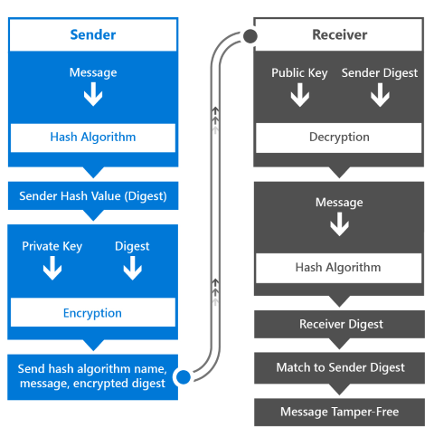

# <a name="intro-to-secure-windows-app-development"></a>Présentation du développement d’applications Windows sécurisées


Cet article d’introduction aide les architectes d’application et les développeurs de mieux comprennent les différentes fonctionnalités de plateforme Windows 10 qui accélèrent la création d’applications de plateforme universelle Windows (UWP) sécurisé. Il explique en détail comment utiliser les fonctionnalités de sécurité Windows disponibles à chacune des phases suivantes : authentification, données en transit et données au repos. Vous pourrez accéder à des informations plus détaillées sur les différents sujets en consultant les ressources supplémentaires mentionnées dans chaque chapitre.

## <a name="1-introduction"></a>1 Introduction


Le développement d’une application sécurisée peut relever du défi. Au rythme où évoluent les applications d’entreprise mobiles, sociales, cloud et complexes d’aujourd’hui, les clients exigent que les applications soient disponibles et mises à jour en un temps record. Ils utilisent également de nombreux types d’appareils, rendant ainsi le processus de création d’applications encore plus complexe. Si vous développez pour la plateforme Windows universelle (UWP) Windows 10, vos applications doivent pouvoir s’exécuter sur l’éventail traditionnel d’ordinateurs de bureau, ordinateurs portables, tablettes et appareils mobiles, ainsi que sur un nombre croissant de nouveaux appareils englobant l’Internet des objets, Xbox One, Microsoft Surface Hub et HoloLens. En tant que développeur, vous devez vous assurer que vos applications communiquent et stockent les données de manière sécurisée, sur l’ensemble des plateformes ou des appareils utilisés.

Voici quelques-uns des avantages que vous procurent les fonctionnalités de sécurité de Windows 10.

-   Vous bénéficiez d’une sécurité standardisée sur tous les appareils qui prennent en charge Windows 10, grâce à l’utilisation d’API cohérentes relatives aux composants et technologies de sécurité.
-   Vous écrivez, testez et gérez moins de code que si vous implémentiez du code personnalisé pour prendre en compte ces scénarios de sécurité.
-   Vos applications se révèlent plus stables et sécurisées, car vous utilisez le système d’exploitation pour contrôler la façon dont l’application accède à ses ressources, ainsi qu’aux ressources système locales ou distantes.

Au cours de l’authentification, l’identité d’un utilisateur demandant l’accès à un service spécifique est validée. Windows Hello est le composant de Windows 10 qui permet de créer un mécanisme d’authentification plus sécurisé dans les applications Windows. Ces composants vous permettent d’utiliser un code confidentiel (PIN) ou des caractéristiques biométriques comme les empreintes digitales, le visage ou l’iris de l’utilisateur pour implémenter une authentification multifacteur pour vos applications.

Les données en transit font référence à la connexion et aux messages transférés pendant cette dernière. La récupération de données à partir d’un serveur distant au moyen de services web en constituent un exemple. L’utilisation des protocoles SSL (Secure Sockets Layer) et S-HTTP (Secure Hypertext Transfer Protocol) garantit la sécurité de la connexion. La capacité à empêcher des tiers d’accéder à ces messages ou des applications non autorisées de communiquer avec les services web constitue un aspect primordial de la sécurisation des données en transit.

Enfin, les données au repos désignent les données qui résident en mémoire ou sur les médias de stockage. Windows 10 intègre un modèle d’application qui empêche les accès non autorisés aux données entre applications et fournit des API de chiffrement pour sécuriser davantage les données sur l’appareil. La fonctionnalité Stockage sécurisé des informations d’identification permet de stocker les informations d’identification de l’utilisateur sur l’appareil en toute sécurité, le système d’exploitation empêchant les autres applications d’y accéder.

## <a name="2-authentication-factors"></a>2 Facteurs d’authentification


Pour protéger les données, le système doit identifier la personne qui demande l’accès aux ressources de données et doit autoriser cet accès. Le processus d’identification d’un utilisateur est appelé authentification, et la détermination des privilèges d’accès vis-à-vis d’une ressource est désigné sous le terme d’autorisation. Ces deux opérations sont étroitement liées et peuvent se révéler impossibles à distinguer par l’utilisateur. Le degré de complexité de ces opérations dépend de nombreux facteurs et varie, par exemple, selon que les données résident sur un seul serveur ou sont réparties entre plusieurs systèmes. Le serveur fournissant les services d’authentification et d’autorisation est désigné sous le terme de fournisseur d’identité.

Pour s’authentifier auprès d’un service et/ou d’une application spécifiques, l’utilisateur a recours à des informations d’identification composées d’éléments qu’il connaît, dont il dispose et/ou qui le caractérisent. Chacun de ces éléments constitue un facteur d’authentification.

-   **Quelque chose que l’utilisateur connaît** prend généralement la forme d’un mot de passe, mais peut également correspondre à un PIN ou à une question secrète et à sa réponse.
-   **Quelque chose dont dispose l’utilisateur** constitue le plus souvent un appareil de mémoire matériel comme une clé USB contenant les données d’authentification propres à l’utilisateur.
-   **Quelque chose qui caractérise l’utilisateur** correspond fréquemment aux empreintes digitales de l’utilisateur, mais les caractéristiques vocales, faciales ou oculaires ou les modèles comportementaux de l’utilisateur sont de nouveaux facteurs dont l’emploi se généralise. Ces mesures stockées sous forme de données sont appelées biométrie.

Un mot de passe créé par l’utilisateur est un facteur d’authentification en soi, mais se révèle généralement insuffisant ; en effet, toute personne connaissant ce mot de passe peut emprunter l’identité de son propriétaire légitime. Une carte à puce peut offrir un niveau de sécurité supérieur, mais risque d’être volée, perdue ou rangée au mauvais endroit. Enfin, un système capable d’authentifier un utilisateur par ses empreintes digitales ou par une analyse oculaire peut garantir le niveau de sécurité le plus élevé et le plus commode, mais nécessite un matériel onéreux et spécialisé (tel qu’une caméra Intel RealSense pour la reconnaissance faciale) non accessible à tous.

La conception de la méthode d’authentification utilisée par un système constitue donc un aspect complexe et important de la sécurité des données. En règle générale, plus vous utilisez de facteurs d’authentification, plus le système est sécurisé. Toutefois, le processus d’authentification doit rester simple. Étant donné qu’un utilisateur se connecte généralement plusieurs fois par jour, il a besoin de pouvoir effectuer cette opération rapidement. Le type d’authentification que vous choisissez doit représenter un bon compromis entre la sécurité et la facilité d’utilisation ; l’authentification à un seul facteur se révèle la moins sécurisée mais la plus simple d’emploi, tandis que l’authentification multifacteur devient de plus en plus sûre mais aussi plus complexe à mesure que le nombre de facteurs utilisés augmente.

## <a name="21-single-factor-authentication"></a>2.1 Authentification à un seul facteur


Ce type d’authentification repose sur une seule information d’identification d’utilisateur. Il s’agit généralement d’un mot de passe, mais cette information peut également prendre la forme d’un code confidentiel.

Le processus d’authentification à un seul facteur est décrit ci-après.

-   L’utilisateur indique son nom d’utilisateur et son mot de passe au fournisseur d’identité. Le fournisseur d’identité est le processus serveur qui vérifie l’identité de l’utilisateur.
-   Le fournisseur d’identité vérifie si le nom d’utilisateur et le mot de passe sont identiques à ceux stockés dans le système. Dans la plupart des cas, le mot de passe est chiffré et offre ainsi une sécurité supplémentaire en empêchant les autres utilisateurs de le lire.
-   Le fournisseur d’identité renvoie un état d’authentification précisant si l’authentification a réussi.
-   En cas de succès, l’échange de données commence. En cas d’échec, l’utilisateur doit s’authentifier de nouveau.


Aujourd’hui, cette méthode d’authentification est la plus couramment utilisée pour l’ensemble des services. Toutefois, il s’agit également du type d’authentification le moins sécurisé lorsqu’il constitue l’unique moyen d’authentification. Les exigences de complexité des mots de passe, les « questions secrètes » et les changements de mots de passe réguliers peuvent renforcer la sécurisation de l’utilisation de ces informations d’identification, mais se révèlent plus contraignantes pour les utilisateurs et ne sont pas des moyens de dissuasion efficaces contre le piratage informatique.

L’inconvénient des mots de passe réside dans le fait qu’ils sont plus faciles à deviner que les systèmes d’authentification multifacteurs. Si une personne malveillante pirate une base de données de comptes d’utilisateurs et de mots de passe hachés d’une boutique en ligne, elle peut exploiter les mots de passe utilisés sur d’autres sites web. Les utilisateurs ont tendance à réutiliser systématiquement les comptes, car les mots de passe complexes sont difficiles à mémoriser. Enfin, la gestion des mots de passe par un service informatique entraîne également un surcroît de complexité lié à la nécessité d’offrir des mécanismes de réinitialisation, d’exiger de fréquentes mises à jour des mots de passe et de les stocker de manière sécurisée.

En dépit de ses inconvénients, l’authentification à un seul facteur dote l’utilisateur d’un contrôle total sur son information d’identification. En effet, l’utilisateur peut créer et modifier ces informations, et le processus d’authentification ne nécessite rien d’autre qu’un clavier. Cet aspect constitue la principale différence entre l’authentification à un seul facteur et l’authentification multifacteur.

## <a name="211-web-authentication-broker"></a>2.1.1 Service Broker d’authentification web


Comme indiqué précédemment, un des défis liés à l’authentification de mot de passe pour un service informatique est la surcharge de gestion de la base de noms d’utilisateur/mots de passe, les mécanismes de réinitialisation, etc. Une option plus en plus répandue consiste à s’appuient sur les fournisseurs d’identité tiers qui offre l’authentification via OAuth, une norme ouverte pour l’authentification.

Le protocole OAuth permet aux services informatiques de « sous-traiter » efficacement la complexité de la gestion d’une base de données de noms d’utilisateur et de mots de passe, de la fonctionnalité de réinitialisation des mots de passe, etc., à un fournisseur d’identité tiers comme Facebook, Twitter ou Microsoft.

Les utilisateurs disposent d’un contrôle total sur leur identité sur ces plateformes, mais une fois qu’ils ont été authentifiés, les applications peuvent demander un jeton au fournisseur d’identité avec le consentement de l’utilisateur, afin d’utiliser ce jeton pour autoriser les utilisateurs authentifiés.

Le service Broker d’authentification web de Windows 10 fournit un ensemble d’API et l’infrastructure qui permettent aux applications d’utiliser des protocoles d’authentification et d’autorisation tels qu’OAuth et OpenID. Les applications peuvent initier des opérations d’authentification par le biais de l’API [**WebAuthenticationBroker**](https://docs.microsoft.com/uwp/api/Windows.Security.Authentication.Web.WebAuthenticationBroker), ce qui génère le renvoi d’un élément [**WebAuthenticationResult**](https://docs.microsoft.com/uwp/api/Windows.Security.Authentication.Web.WebAuthenticationResult). La figure ci-après illustre une vue d’ensemble du flux de communications.


L’application joue le rôle d’intermédiaire en initiant l’authentification auprès du fournisseur d’identité par le biais d’un élément [**WebView**](https://docs.microsoft.com/uwp/api/Windows.UI.Xaml.Controls.WebView) dans l’application. Une fois que le fournisseur d’identité a authentifié l’utilisateur, il renvoie à l’application un jeton qui permettra de demander des informations sur l’utilisateur au fournisseur d’identité. Par mesure de sécurité, l’application doit être inscrite auprès du fournisseur d’identité avant de pouvoir faire office d’intermédiaire pour les processus d’authentification auprès du fournisseur d’identité. Cette procédure d’inscription diffère pour chaque fournisseur.

Voici le flux de travail général concernant l’appel de l’API [**WebAuthenticationBroker**](https://docs.microsoft.com/uwp/api/Windows.Security.Authentication.Web.WebAuthenticationBroker) pour communiquer avec le fournisseur.

-   Construction des chaînes de demande à envoyer au fournisseur d’identité. Le nombre de chaînes et les informations figurant dans chacune d’elles diffèrent selon chaque service web, mais comprennent généralement deux chaînes d’URI contenant chacune une URL : l’une à laquelle la demande d’authentification est envoyée, et l’autre vers laquelle l’utilisateur est redirigé une fois l’autorisation effectuée.
-   Appel de [**WebAuthenticationBroker.AuthenticateAsync**](https://docs.microsoft.com/uwp/api/windows.security.authentication.web.webauthenticationbroker.authenticateasync), transmission des chaînes de demande, puis attente de la réponse du fournisseur d’identité.
-   Appel de [**WebAuthenticationResult.ResponseStatus**](https://docs.microsoft.com/uwp/api/windows.security.authentication.web.webauthenticationresult.responsestatus) pour obtenir l’état lors de la réception de la réponse.
-   Si la communication aboutit, traitement de la chaîne de réponse renvoyée par le fournisseur d’identité. Si la communication échoue, traitement de l’erreur.

Si la communication aboutit, traitement de la chaîne de réponse renvoyée par le fournisseur d’identité. Si la communication échoue, traitement de l’erreur.

L’exemple de code C# de ce processus est fourni ci-après. Pour obtenir plus d’informations et découvrir une procédure pas à pas, voir [WebAuthenticationBroker](web-authentication-broker.md). Pour obtenir un exemple de code complet, consultez l’[exemple WebAuthenticationBroker sur GitHub](https://go.microsoft.com/fwlink/p/?LinkId=620622) (en anglais).

```cs
string startURL = "https://<providerendpoint>?client_id=<clientid>";
string endURL = "http://<AppEndPoint>";

var startURI = new System.Uri(startURL);
var endURI = new System.Uri(endURL);

try
{
    WebAuthenticationResult webAuthenticationResult = 
        await WebAuthenticationBroker.AuthenticateAsync( 
            WebAuthenticationOptions.None, startURI, endURI);

    switch (webAuthenticationResult.ResponseStatus)
    {
        case WebAuthenticationStatus.Success:
            // Successful authentication. 
            break;
        case WebAuthenticationStatus.ErrorHttp:
            // HTTP error. 
            break;
        default:
            // Other error.
        break;
    }
}
catch (Exception ex)
{
    // Authentication failed. Handle parameter, SSL/TLS, and
    // Network Unavailable errors here. 
}
```

## <a name="22-multi-factor-authentication"></a>2.2 Authentification multifacteur


Comme son nom l’indique, l’authentification multifacteur a recours à plusieurs facteurs d’authentification. Elle combine généralement un élément que vous connaissez, tel qu’un mot de passe, avec un élément dont vous disposez, par exemple un téléphone mobile ou une carte à puce. Ainsi, même si un attaquant découvre le mot de passe de l’utilisateur, le compte restera inaccessible sans le dispositif ou la carte. Inversement, un dispositif ou une carte dont l’intégrité a été compromise ne seront d’aucune utilité à l’attaquant sans le mot de passe. L’authentification multifacteur se révèle donc plus sécurisée, mais également plus complexe, que l’authentification à un seul facteur.

Les services qui utilisent l’authentification multifacteur permettent souvent à l’utilisateur de choisir la façon dont il souhaite recevoir la seconde information d’identification. Un exemple courant de ce type d’authentification est le processus qui consiste à envoyer un code de vérification par SMS sur le téléphone mobile de l’utilisateur.

-   L’utilisateur indique son nom d’utilisateur et son mot de passe au fournisseur d’identité.
-   Le fournisseur d’identité vérifie le nom d’utilisateur et le mot de passe comme dans le cadre du processus d’autorisation à un seul facteur, puis recherche le numéro de téléphone mobile de l’utilisateur stocké dans le système.
-   Le serveur envoie sur le téléphone mobile de l’utilisateur un message SMS contenant un code de vérification généré.
-   L’utilisateur fournit ce code de vérification au fournisseur d’identité par le biais d’un formulaire qui lui est présenté.
-   Le fournisseur d’identité renvoie un état d’authentification indiquant si l’authentification des deux informations d’identification a réussi.
-   En cas de succès, l’échange de données commence. Dans le cas contraire, l’utilisateur doit s’authentifier de nouveau.


Comme vous pouvez le voir, ce processus diffère également de l’authentification à un seul facteur par le fait que la seconde information d’identification est envoyée à l’utilisateur et non créée ou fournie par ce dernier. L’utilisateur ne dispose donc pas d’un contrôle total sur les informations d’identification requises. C’est également le cas lorsqu’une carte à puce est utilisée comme seconde information d’identification : l’organisation est responsable de sa création et de sa remise à l’utilisateur.

## <a name="221-azure-active-directory"></a>2.2.1 Azure Active Directory


Azure Active Directory (Azure AD) est un service de gestion des identités et des accès basé sur le cloud qui peut faire office de fournisseur d’identité dans les processus d’authentification à un seul facteur ou multifacteur. L’authentification Azure AD est utilisable avec ou sans code de vérification.

Bien qu’Azure AD puisse également implémenter l’authentification à un seul facteur, les entreprises exigent généralement le surcroît de sécurité offert par l’authentification multifacteur. Dans une configuration d’authentification multifacteur, un utilisateur qui s’authentifie avec un compte Azure AD peut demander qu’un code de vérification soit envoyé sous la forme d’un SMS soit sur son téléphone mobile, soit à l’application mobile Azure Authenticator.

En outre, Azure AD peut jouer le rôle de fournisseur OAuth, en offrant à l’utilisateur standard un mécanisme d’authentification et d’autorisation pour des applications exécutées sur différentes plateformes. Pour plus d’informations, voir [Azure Active Directory](https://azure.microsoft.com/services/active-directory/) et [Azure Multi-Factor Authentication](https://azure.microsoft.com/services/multi-factor-authentication/).

## <a name="24-windows-hello"></a>2.4 Windows Hello


Le système d’exploitation Windows 10 intègre un mécanisme d’authentification multifacteur d’une grande simplicité. Windows Hello est le nouveau système de connexion biométrique intégré à Windows 10. Étant donné qu’il est directement intégré au système d’exploitation, Windows Hello peut identifier le visage ou les empreintes digitales pour déverrouiller les appareils des utilisateurs. Le magasin d’informations d’identification sécurisées Windows protège les données biométriques sur l’appareil.

Avec Windows Hello, un appareil dispose d’une méthode fiable de reconnaissance de l’utilisateur, ce qui permet de traiter la première partie du chemin d’accès entre un utilisateur et un service ou un élément de données demandé. Une fois que l’appareil a reconnu l’utilisateur, il doit toujours authentifier ce dernier avant de déterminer s’il lui accorde l’accès à une ressource demandée. Windows Hello propose une authentification à 2 facteurs (2FA) forte, entièrement intégrée à Windows, qui remplace les mots de passe réutilisables par la combinaison d’un appareil spécifique et d’un mouvement biométrique ou d’un code confidentiel. Le code PIN est spécifié par l’utilisateur dans le cadre de son inscription au compte Microsoft.

Toutefois, Windows Hello n’est pas un simple substitut aux systèmes 2FA traditionnels. Sa conception est similaire aux cartes à puce : l’authentification est effectuée à l’aide de primitives cryptographiques plutôt que des comparaisons de chaînes, et le document de clé de l’utilisateur est protégé à l’intérieur d’un matériel inviolable. Microsoft Hello ne nécessite pas non plus les composants d’infrastructure supplémentaires requis par le déploiement de cartes à puce. Par exemple, vous n’avez pas besoin d’une infrastructure à clé publique (PKI) pour gérer les certificats, si vous n’en êtes pas encore équipé. Windows Hello offre les principaux avantages des cartes à puce (flexibilité de déploiement pour les cartes à puce virtuelles et sécurité fiable pour les cartes à puce physiques), sans aucun de leurs inconvénients.

Un appareil doit être inscrit auprès de Windows Hello pour que les utilisateurs puissent s’authentifier sur cet appareil. Windows Hello utilise un chiffrement asymétrique (clé publique/privée) dans le cadre duquel l’une des parties utilise une clé publique pour chiffrer des données que l’autre partie peut déchiffrer à l’aide d’une clé privée. Windows Hello crée un ensemble de paires de clés publique/privée et écrit les clés privées sur le processeur du module de plateforme sécurisée (TPM) de l’appareil. Une fois qu’un appareil est inscrit, les applications UWP peuvent appeler les API système pour récupérer la clé publique de l’utilisateur, qui peut être utilisée pour inscrire l’utilisateur sur le serveur.

Le flux de travail d’inscription d’une application peut ressembler à ce qui suit :


Les informations d’inscription que vous collectez peuvent inclure beaucoup plus informations d’identification que dans le cas de ce scénario simple. Par exemple, si votre application accède à un service sécurisé tel qu’un service bancaire, votre processus d’inscription doit demander une preuve d’identité et d’autres informations. Une fois toutes les conditions remplies, la clé publique de cet utilisateur est stockée dans le système principal et utilisée pour la validation lors de l’utilisation suivante du service par l’utilisateur.

Pour en savoir plus sur Windows Hello, voir le [guide Windows Hello](https://docs.microsoft.com/windows/keep-secure/microsoft-passport-guide) et le [guide du développeur de Windows Hello](microsoft-passport.md).

## <a name="3-data-in-flight-security-methods"></a>3 Méthodes de sécurité des données en transit


Ces méthodes de sécurité s’appliquent aux données en transit entre plusieurs appareils connectés à un réseau. Les données peuvent être transférées entre les systèmes de l’environnement haute sécurité d’un intranet d’entreprise privé ou entre un client et un service web dans l’environnement non sécurisé du web. Les applications Windows 10 prennent en charge des normes comme SSL par le biais de leurs API de réseau, et fonctionnent avec des technologies telles que le service Azure Gestion des API, qui permettent aux développeurs de garantir le niveau de sécurité approprié pour leurs applications.

## <a name="31-remote-system-authentication"></a>3.1 Authentification de système distant


Il existe deux scénarios types impliquant une communication avec un système informatique distant.

-   Un serveur local authentifie un utilisateur par le biais d’une connexion directe, par exemple, lorsque le serveur et le client appartiennent à un intranet d’entreprise.
-   La communication avec un service web s’effectue sur Internet.

Les exigences de sécurité en matière de communication avec un service web sont plus strictes que celles qui s’appliquent aux scénarios de connexion directe, car les données ne font plus seulement partie intégrante d’un réseau sécurisé, et le risque d’interception des données par des personnes malveillantes se révèle également plus élevé. Étant donné que divers types d’appareils accéderont au service, ce dernier sera probablement généré sous forme de service RESTful, plutôt qu’en tant que service WCF (Windows Communication Foundation) par exemple, ce qui signifie que l’authentification et l’autorisation auprès du service soulèveront également de nouvelles difficultés. Examinons deux exigences en matière de communication sécurisée avec un système distant.

La première exigence consiste à la confidentialité des messages : Les informations transmises entre le client et les services web (par exemple, l’identité de l’utilisateur et d’autres informations personnelles) ne doivent pas être lisibles par des tiers en cours de transit. Ce résultat s’obtient généralement par le chiffrement de la connexion par l’intermédiaire de laquelle les messages sont envoyés, ainsi que par le chiffrement du message proprement dit. Dans le chiffrement à clé privée/publique, la clé publique est accessible à tous et permet de chiffrer les messages à envoyer à un destinataire spécifique. La clé privée est uniquement détenue par le destinataire et sert à déchiffrer le message.

La deuxième exigence est l’intégrité des messages : Le client et le service web doivent être en mesure de vérifier que les messages reçus sont ceux destinés à être envoyés par l’autre partie, et que le message n’a pas été modifié en transit. Ce résultat est obtenu grâce à la signature des messages à l’aide de signatures numériques, ainsi que par le biais de l’authentification par certificat.

## <a name="32-ssl-connections"></a>3.2 Connexions SSL


Pour établir et garantir des connexions sécurisées avec les clients, les services web peuvent utiliser le protocole SSL (Secure Sockets Layer), qui est pris en charge par le protocole S-HTTP (Secure Hypertext Transfer Protocol). SSL assure la confidentialité et l’intégrité des messages en prenant en charge le chiffrement à clé publique, ainsi que des certificats de serveur. SSL a été remplacé par le protocole TLS (Transport Layer Security), mais ce dernier est encore souvent désigné sous le nom de SSL.

Lorsqu’un client demande l’accès à une ressource sur un serveur, SSL démarre un processus de négociation avec le serveur, appelé établissement d’une liaison SSL. Un niveau de chiffrement, un ensemble de clés de chiffrement publiques et privées et les informations d’identité figurant dans les certificats clients et de serveur sont acceptés comme base de l’ensemble des communications pour toute la durée de la connexion SSL. Le serveur peut également exiger que le client ait été authentifié à ce stade. Une fois la connexion établie, tous les messages sont chiffrés avec la clé publique négociée jusqu’à ce que la connexion se ferme.

## <a name="321-ssl-pinning"></a>3.2.1 Épinglage SSL


Alors que le protocole SSL peut assurer la confidentialité des messages à l’aide du chiffrement et des certificats, il ne vérifie pas que le serveur avec lequel le client communique est le serveur approprié. Le comportement du serveur peut être simulé par un tiers non autorisé, interceptant ainsi les données sensibles transmises par le client. Pour éviter ce problème, une technique appelée épinglage SSL permet de vérifier que le certificat sur le serveur est le certificat attendu et approuvé par le client.

Il existe différentes méthodes pour implémenter l’épinglage SSL dans les applications, chacune d’elles présentant des avantages et des inconvénients. L’approche la plus simple consiste à utiliser la déclaration de certificats dans le manifeste du package de l’application. Cette déclaration permet au package de l’application d’installer des certificats numériques et de spécifier une confiance exclusive vis-à-vis de ces derniers. En conséquence, les connexions SSL sont uniquement autorisées entre l’application et les serveurs qui détiennent les certificats correspondants dans leur chaîne de certificats. Ce mécanisme favorise également l’utilisation sécurisée de certificats auto-signés, car aucune dépendance tierce n’est requise sur les autorités de certification publique de confiance.


Afin d’offrir un contrôle accru sur la logique de validation, des API sont disponibles pour valider les certificats renvoyés par le serveur en réponse à une requête HTTPS. Notez que cette méthode nécessite l’envoi d’une requête et l’inspection de la réponse. Par conséquent, prenez soin d’ajouter cette tâche en tant qu’opération de validation avant de commencer à envoyer des informations sensibles dans une requête.

Le code C# ci-après illustre cette méthode d’épinglage SSL. La méthode **ValidateSSLRoot** utilise la classe [**HttpClient**](https://docs.microsoft.com/uwp/api/Windows.Web.Http.HttpClient) pour exécuter une requête HTTP. Une fois que le client a envoyé la réponse, il utilise la collection [**RequestMessage.TransportInformation.ServerIntermediateCertificates**](https://docs.microsoft.com/uwp/api/windows.web.http.httptransportinformation.serverintermediatecertificates) pour inspecter les certificats renvoyés par le serveur. Le client peut ensuite valider la totalité de la chaîne de certificats avec les empreintes numériques qu’il a incluses. Cette méthode n’exige pas que les empreintes numériques des certificats soient mises à jour dans l’application lorsque le certificat de serveur arrive à expiration et fait l’objet d’un renouvellement.

```cs
private async Task ValidateSSLRoot()
{
    // Send a get request to Bing
    var httpClient = new HttpClient();
    var bingUri = new Uri("https://www.bing.com");
    HttpResponseMessage response = 
        await httpClient.GetAsync(bingUri);

    // Get the list of certificates that were used to
    // validate the server's identity
    IReadOnlyList<Certificate> serverCertificates = response.RequestMessage.TransportInformation.ServerIntermediateCertificates;
  
    // Perform validation
    if (!ValidateCertificates(serverCertificates))
    {
        // Close connection as chain is not valid
        return;
    }
    // Validation passed, continue with connection to service
}

private bool ValidateCertificates(IReadOnlyList<Certificate> certs)
{
    // In this example, we iterate through the certificates
    // and check that the chain contains
    // one specific certificate we are expecting
    foreach (var cert in certs)
    {
        byte[] thumbprint = cert.GetHashValue();

        // Check if the thumbprint matches whatever you 
        // are expecting
        var expected = new byte[] { 212, 222, 32, 208, 94, 102, 
            252, 83, 254, 26, 80, 136, 44, 120, 219, 40, 82, 202, 
            228, 116 };

        // ThumbprintMatches does the byte[] comparison 
        if (ThumbprintMatches(thumbprint, expected))
        {
            return true;
        }
    }
    return false;
}
```

## <a name="33-publishing-and-securing-access-to-rest-apis"></a>3.3 Publication et sécurisation de l’accès aux API REST


Pour garantir un accès autorisé aux services web, ces derniers doivent nécessiter une authentification chaque fois qu’un appel d’API est effectué. L’aptitude à contrôler les performances et l’évolutivité sont également des éléments à prendre en compte lorsque les services web sont exposés sur le web. Le service Azure Gestion des API contribue à faciliter l’exposition d’API sur le web tout en fournissant des fonctionnalités à trois niveaux.

Les **éditeurs/administrateurs** de l’API peuvent configurer facilement cette dernière par le biais du portail de publication du service Azure Gestion des API. Il est ensuite possible de créer des ensembles d’API et de gérer l’accès à ces derniers pour déterminer les personnes autorisées à accéder aux différentes API.

Les **développeurs** souhaitant accéder à ces API peuvent soumettre des requêtes par l’intermédiaire du portail des développeurs, lequel peut soit leur offrir un accès immédiat, soit exiger l’approbation de l’éditeur/administrateur. Les développeurs peuvent également consulter la documentation sur les API et les exemples de code à partir du portail des développeurs afin d’adopter rapidement les API proposées par le service web.

Les **applications** créées par ces développeurs accèdent ensuite à l’API par le biais du proxy offert par le service Azure Gestion des API. Ce proxy fournit une couche d’obscurité masquant le point de terminaison réel de l’API sur le serveur de l’éditeur/administrateur, et peut également inclure une logique supplémentaire comme la traduction d’API pour garantir la cohérence continue de l’API exposée lorsqu’un appel vers une API est redirigé vers une autre API. Le proxy peut également utiliser le filtrage IP pour bloquer les appels d’API émanant d’un domaine IP spécifique ou d’un ensemble de domaines. Par ailleurs, le service Azure Gestion des API garantit la sécurisation de ses services web à l’aide d’un ensemble de clés publiques, appelées clés API, pour authentifier et autoriser chaque appel d’API. Lorsque l’autorisation échoue, l’accès à l’API et les fonctionnalités prises en charge par cette dernière sont bloqués.

En outre, le service Azure Gestion des API est en mesure de réduire le nombre d’appels d’API à un service (cette procédure étant désignée sous le terme de limitation de requêtes) pour optimiser les performances du service web. Pour plus d’informations, voir [Azure Gestion des API](https://azure.microsoft.com/services/api-management/) et la vidéo de [présentation d’Azure Gestion des API à AzureCon 2015](https://channel9.msdn.com/events/Microsoft-Azure/AzureCon-2015/ACON313) (en anglais).

## <a name="4-data-at-rest-security-methods"></a>4 Méthodes de sécurité des données au repos


Lorsque les données arrivent sur un appareil, nous les désignons sous le terme de « données au repos ». Ces données doivent être stockées sur l’appareil de manière sécurisée de façon à ne pas être accessibles par des utilisateurs ou applications non autorisés. Le modèle d’application inclus dans Windows 10 contribue à garantir le fait que les données stockées par une application quelconque sont uniquement accessibles à cette dernière, tout en fournissant des API permettant de partager les données lorsque cela se révèle nécessaire. Des API supplémentaires sont également disponibles pour assurer le chiffrement des données et le stockage sécurisé des informations d’identification.

## <a name="41-windows-app-model"></a>4.1 Modèle d’application Windows


Par le passé, Windows n’a jamais présenté de définition d’une application. Ce terme désignait le plus souvent un exécutable (.exe), et ceci n’englobait jamais l’installation, le stockage d’état, la durée d’exécution, le contrôle de version, l’intégration du système d’exploitation et la communication entre les applications. Le modèle de plateforme Windows universelle définit un modèle d’application qui couvre l’installation, l’environnement d’exécution, la gestion des ressources, les mises à jour, le modèle de données et la désinstallation.

Les applications de Windows 10 s’exécutent dans un conteneur, ce qui signifie qu’elles disposant de privilèges limités par défaut (privilèges supplémentaires peuvent être demandés et accordées par l’utilisateur). Par exemple, si une application souhaite accéder à des fichiers du système, il convient d’utiliser un sélecteur de fichiers à partir de l’espace de noms [**Windows.Storage.Pickers**](https://docs.microsoft.com/uwp/api/Windows.Storage.Pickers) pour permettre à l’utilisateur de sélectionner un fichier (aucun accès direct aux fichiers n’est autorisé). De même, si une application a besoin d’accéder aux données d’emplacement de l’utilisateur, il convient d’activer et de déclarer la fonctionnalité de localisation des appareils, en informant l’utilisateur lors du téléchargement que cette application demandera l’accès à l’emplacement de l’utilisateur. En outre, lorsque l’application doit accéder pour la première fois à l’emplacement de l’utilisateur, elle présente une invite de consentement supplémentaire à l’utilisateur pour demander l’autorisation d’accéder à ces données.

Notez que ce modèle d’application agit à la façon d’une « prison » pour les applications (empêchant ces dernières d’atteindre l’extérieur), mais non à la manière d’un « château » inaccessible depuis l’extérieur (les applications avec des privilèges administratifs peuvent bien entendu accéder à l’intérieur). La fonctionnalité Device Guard disponible dans Windows 10 contribue à restreindre davantage cet accès en permettant aux organisations/services informatiques de spécifier les applications (Win32) qui sont autorisées à s’exécuter.

Le modèle d’application gère également le cycle de vie des applications. Par exemple, il limite par défaut l’exécution en arrière-plan des applications ; dès qu’une application passe à l’arrière-plan, le processus est suspendu (après avoir accordé à l’application un court instant pour prendre en compte sa suspension dans le code), et sa mémoire est figée. Le système d’exploitation fournit des mécanismes permettant aux applications de demander l’exécution de tâches spécifiques en arrière-plan (exécution selon une planification, déclenchée par divers événements tels que la connectivité Internet/Bluetooth, les modifications des conditions d’alimentation, etc., ainsi que dans le cadre de scénarios spécifiques comme l’écoute de musique ou un suivi GPS).

Lorsque les ressources mémoire sur l’appareil deviennent insuffisantes, Windows libère de l’espace mémoire en arrêtant des applications. Ce modèle de cycle de vie force les applications à conserver les données chaque fois qu’elles sont suspendues, car aucun laps de temps supplémentaire n’est disponible entre la suspension et l’arrêt.

Pour plus d’informations, consultez [doivent impérativement universel : Comprendre le cycle de vie d’une Application Windows 10](https://visualstudiomagazine.com/articles/2015/09/01/its-universal.aspx).

## <a name="42-stored-credential-protection"></a>4.2 Protection des informations d’identification stockées


Les applications Windows qui accèdent aux services authentifiés offrent souvent aux utilisateurs la possibilité de stocker leurs informations d’identification sur leur appareil local. Cela simplifie la tâche des utilisateurs, car lorsque ces derniers fournissent leur nom d’utilisateur et leur mot de passe, l’application réutilise automatiquement ces informations à chacun de ses lancements ultérieurs. Cette fonctionnalité risquant de poser un problème de sécurité si un attaquant parvient à accéder à ces données stockées, Windows 10 permet aux applications Windows de stocker les informations d’identification des utilisateurs dans un stockage sécurisé des informations d’identification. L’application appelle l’API Stockage sécurisé des informations d’identification pour stocker et récupérer les informations d’identification dans cet espace sécurisé plutôt que de les conserver dans le conteneur de stockage de l’application. Le Stockage sécurisé des informations d’identification est géré par le système d’exploitation, mais son accès est limité à l’application qui stocke ces informations, offrant ainsi une solution gérée en toute sécurité pour le stockage des informations d’identification.

Lorsqu’un utilisateur fournit les informations d’identification à stocker, l’application obtient une référence au stockage sécurisé des informations d’identification à l’aide de l’objet [**PasswordVault**](https://docs.microsoft.com/uwp/api/Windows.Security.Credentials.PasswordVault) dans l’espace de noms [**Windows.Security.Credentials**](https://docs.microsoft.com/uwp/api/Windows.Security.Credentials). Elle crée ensuite un objet [**PasswordCredential**](https://docs.microsoft.com/uwp/api/Windows.Security.Credentials.PasswordCredential) contenant un identificateur pour l’application Windows, le nom d’utilisateur et le mot de passe. Cet objet est transmis à la méthode [**PasswordVault.Add**](https://docs.microsoft.com/uwp/api/windows.security.credentials.passwordvault.add) pour stocker les informations d’identification dans le stockage sécurisé. L’exemple de code C# ci-après illustre cette procédure.

```cs
var vault = new PasswordVault();
vault.Add(new PasswordCredential("My App", username, password));
```

Dans l’exemple de code C# suivant, l’application demande toutes les informations d’identification correspondant à l’application en appelant la méthode [**FindAllByResource**](https://docs.microsoft.com/uwp/api/windows.security.credentials.passwordvault.findallbyresource) de l’objet [**PasswordVault**](https://docs.microsoft.com/uwp/api/Windows.Security.Credentials.PasswordVault). Si plusieurs informations sont renvoyées, l’utilisateur est invité à entrer son nom d’utilisateur. Si les informations d’identification ne figurent pas dans le Stockage sécurisé, l’application demande à l’utilisateur de les lui fournir. L’utilisateur est alors connecté au serveur à l’aide de ces informations d’identification.

```cs
private string resourceName = "My App";
private string defaultUserName;

private void Login()
{
    PasswordCredential loginCredential = GetCredentialFromLocker();

    if (loginCredential != null)
    {
        // There is a credential stored in the locker.
        // Populate the Password property of the credential
        // for automatic login.
        loginCredential.RetrievePassword();
    }
    else
    {
        // There is no credential stored in the locker.
        // Display UI to get user credentials.
        loginCredential = GetLoginCredentialUI();
    }
    // Log the user in.
    ServerLogin(loginCredential.UserName, loginCredential.Password);
}

private PasswordCredential GetCredentialFromLocker()
{
    PasswordCredential credential = null;

    var vault = new PasswordVault();
    var credentialList = vault.FindAllByResource(resourceName);

    if (credentialList.Count == 1)
    {
        credential = credentialList[0];
    }
    else if (credentialList.Count > 0)
    {
        // When there are multiple usernames,
        // retrieve the default username. If one doesn't
        // exist, then display UI to have the user select
        // a default username.
        defaultUserName = GetDefaultUserNameUI();

        credential = vault.Retrieve(resourceName, defaultUserName);
    }
    return credential;
}
```

Pour plus d’informations, voir [Stockage sécurisé des informations d’identification](credential-locker.md).

## <a name="43-stored-data-protection"></a>4.3 Protection des données stockées


Le chiffrement des données stockées, communément désignées sous le terme de données au repos, permet d’éviter tout risque d’accès non autorisé à ces données. Les deux mécanismes courants de chiffrement des données consistent à utiliser des clés symétriques ou des clés asymétriques. Toutefois, le chiffrement des données ne permet pas de garantir que les données ne sont pas modifiées entre le moment de leur envoi et celui de leur stockage. En d’autres termes, l’intégrité des données ne peut pas être assurée. L’utilisation de codes d’authentification des messages, de codes de hachage et de signatures numériques sont des techniques courantes pour résoudre ce problème.

## <a name="431-data-encryption"></a>4.3.1 Chiffrement des données


Avec le chiffrement symétrique, l’expéditeur et le destinataire disposent de la même clé et l’utilisent aussi bien pour chiffrer les données que pour les déchiffrer. La difficulté liée à cette approche réside généralement dans le partage sécurisé de la clé pour que les deux parties la reconnaissent.

L’un des moyens de résoudre cette difficulté correspond au chiffrement asymétrique, impliquant l’utilisation d’une paire de clés publique/privée. La clé publique est partagée librement avec toute personne souhaitant chiffrer un message. La clé privée est systématiquement gardée secrète afin que vous seul puissiez l’utiliser pour déchiffrer les données. L’une des techniques courantes pour autoriser la découverte de la clé publique consiste à utiliser des certificats numériques, également désignés simplement sous le terme de certificats. Le certificat inclut des informations concernant la clé publique, ainsi que des informations sur l’utilisateur ou le serveur, telles que le nom, l’émetteur, l’adresse e-mail et le pays.

Les développeurs d’applications Windows peuvent implémenter le chiffrement symétrique et asymétrique dans leurs applications UWP à l’aide des classes [**SymmetricKeyAlgorithmProvider**](https://docs.microsoft.com/uwp/api/Windows.Security.Cryptography.Core.SymmetricKeyAlgorithmProvider) et [**AsymmetricKeyAlgorithmProvider**](https://docs.microsoft.com/uwp/api/Windows.Security.Cryptography.Core.AsymmetricKeyAlgorithmProvider). En outre, la classe [**CryptographicEngine**](https://docs.microsoft.com/uwp/api/Windows.Security.Cryptography.Core.CryptographicEngine) permet de chiffrer et déchiffrer des données, signer du contenu et vérifier les signatures numériques. Les applications peuvent également utiliser la classe [**DataProtectionProvider**](https://docs.microsoft.com/uwp/api/Windows.Security.Cryptography.DataProtection.DataProtectionProvider) de l’espace de noms [**Windows.Security.Cryptography.DataProtection**](https://docs.microsoft.com/uwp/api/Windows.Security.Cryptography.DataProtection) pour chiffrer et déchiffrer les données locales stockées.

## <a name="432-detecting-message-tampering-macs-hashes-and-signatures"></a>4.3.2 Détection des falsifications de message (codes MAC, codes de hachage et signatures)


Un code d’authentification de message (MAC) est un code (ou une balise) résultant de l’utilisation d’une clé symétrique (appelée clé secrète) ou d’un message comme entrée dans un algorithme de chiffrement MAC. La clé secrète et l’algorithme sont acceptés par l’expéditeur et le destinataire avant le transfert des messages.

Les codes MAC vérifient les messages en procédant comme suit.

-   L’expéditeur dérive la balise MAC en utilisant la clé secrète en tant qu’entrée pour l’algorithme MAC.
-   L’expéditeur envoie la balise MAC et le message au destinataire.
-   Le destinataire dérive la balise MAC en utilisant la clé secrète et le message en tant qu’entrées pour l’algorithme MAC.
-   Le destinataire compare sa balise MAC avec celle de l’expéditeur. Si les deux balises sont identiques, cela signifie que le message n’a pas été falsifié.


Les applications Windows peuvent implémenter la vérification des messages MAC en appelant la classe [**MacAlgorithmProvider**](https://docs.microsoft.com/uwp/api/Windows.Security.Cryptography.Core.MacAlgorithmProvider) pour générer la clé et la classe [**CryptographicEngine**](https://docs.microsoft.com/uwp/api/Windows.Security.Cryptography.Core.CryptographicEngine) pour exécuter l’algorithme de chiffrement MAC.

## <a name="433-using-hashes"></a>4.3.3 Utilisation de codes de hachage


Une fonction de hachage est un algorithme de chiffrement qui sélectionne un long bloc de données au hasard et renvoie une chaîne de bits de taille fixe, appelée valeur de hachage. Une famille complète de fonctions de hachage permet d’effectuer cette opération.

Il est possible d’utiliser une valeur de hachage à la place d’un code MAC dans le scénario de transfert de message décrit ci-dessus. L’expéditeur envoie une valeur de hachage et un message, puis le destinataire dérive sa propre valeur de hachage de celle de l’expéditeur et du message associé et compare les deux valeurs de hachage. Les applications qui s’exécutent sur Windows 10 peuvent appeler la classe [**HashAlgorithmProvider**](https://docs.microsoft.com/uwp/api/Windows.Security.Cryptography.Core.HashAlgorithmProvider) pour énumérer les algorithmes de hachage disponibles et exécuter l’un d’eux. La classe [**CryptographicHash**](https://docs.microsoft.com/uwp/api/Windows.Security.Cryptography.Core.CryptographicHash) représente la valeur de hachage. La méthode [**CryptographicHash.GetValueAndReset**](https://docs.microsoft.com/uwp/api/windows.security.cryptography.core.cryptographichash.getvalueandreset) peut être utilisée pour hacher différentes données de manière répétée sans avoir à recréer l’objet pour chaque utilisation. La méthode Append de la classe **CryptographicHash** ajoute de nouvelles données à une mémoire tampon pour qu’elles soient hachées. L’ensemble de ce processus est illustré dans l’exemple de code C# suivant.

```cs
public void SampleReusableHash()
{
    // Create a string that contains the name of the
    // hashing algorithm to use.
    string strAlgName = HashAlgorithmNames.Sha512;

    // Create a HashAlgorithmProvider object.
    HashAlgorithmProvider objAlgProv = HashAlgorithmProvider.OpenAlgorithm(strAlgName);

    // Create a CryptographicHash object. This object can be reused to continually
    // hash new messages.
    CryptographicHash objHash = objAlgProv.CreateHash();

    // Hash message 1.
    string strMsg1 = "This is message 1";
    IBuffer buffMsg1 = CryptographicBuffer.ConvertStringToBinary(strMsg1, BinaryStringEncoding.Utf16BE);
    objHash.Append(buffMsg1);
    IBuffer buffHash1 = objHash.GetValueAndReset();

    // Hash message 2.
    string strMsg2 = "This is message 2";
    IBuffer buffMsg2 = CryptographicBuffer.ConvertStringToBinary(strMsg2, BinaryStringEncoding.Utf16BE);
    objHash.Append(buffMsg2);
    IBuffer buffHash2 = objHash.GetValueAndReset();

    // Convert the hashes to string values (for display);
    string strHash1 = CryptographicBuffer.EncodeToBase64String(buffHash1);
    string strHash2 = CryptographicBuffer.EncodeToBase64String(buffHash2);
}
```

## <a name="434-digital-signatures"></a>4.3.4 Signatures numériques


La vérification de l’intégrité des données d’un message stocké signé numériquement est comparable à celle de l’authentification par code MAC. Le flux de travail de signature numérique est décrit ci-après.

-   L’expéditeur dérive une valeur de hachage (également appelée synthèse) en utilisant le message en tant qu’entrée d’un algorithme de hachage.
-   L’expéditeur chiffre la synthèse à l’aide de sa clé privée.
-   L’expéditeur envoie le message, la synthèse chiffrée et le nom de l’algorithme de hachage utilisé.
-   Le destinataire utilise la clé publique pour déchiffrer la synthèse chiffrée qu’il a reçue. Il utilise ensuite l’algorithme de hachage pour hacher le message afin de créer sa propre synthèse. Pour finir, le destinataire compare les deux synthèses (celle qu’il a reçue et déchiffrée, et celle qu’il a créée). Seule la correspondance de ces deux synthèses offre au destinataire l’assurance que le message a été envoyé par le possesseur de la clé privée, que ce dernier est donc bien celui qu’il prétend être, et que le message n’a pas été altéré lors du transit.



Grâce à la grande rapidité des algorithmes de hachage, les valeurs de hachage peuvent être dérivées en un temps record, même pour les messages volumineux. La valeur de hachage obtenue présente une longueur arbitraire et peut être plus courte que le message complet ; par conséquent, l’utilisation de clés publiques et privées pour chiffrer et déchiffrer uniquement la synthèse plutôt que la totalité du message constitue une optimisation.

Pour plus d’informations, voir les articles [Signatures numériques](https://docs.microsoft.com/windows/desktop/SecCrypto/digital-signatures), [Codes d’authentification des messages, hachages et signatures](macs-hashes-and-signatures.md) et [Chiffrement.](cryptography.md)

## <a name="5-summary"></a>5 Récapitulatif


La plateforme Windows universelle de Windows 10 offre de nombreuses techniques pour tirer parti des fonctionnalités du système d’exploitation afin de créer des applications plus sécurisées. Dans les différents scénarios d’authentification, tels que l’authentification à un seul facteur, multifacteur ou par le biais du service Broker avec un fournisseur d’identité OAuth, des API sont disponibles pour atténuer les difficultés les plus courantes en matière d’authentification. Windows Hello fournit un nouveau système d’identification biométrique qui reconnaît l’utilisateur et décourage activement les tentatives de contournement des identifications. Le service peut également fournir plusieurs couches de clés et de certificats qui ne peuvent en aucun cas être divulguées ou utilisées en dehors du module de plateforme sécurisée. Par ailleurs, une couche supplémentaire de sécurité est disponible par le biais de l’utilisation facultative de certificats et de clés d’identité d’attestation.

Pour sécuriser les données en transit, des API sont proposées pour communiquer avec les systèmes distants en toute sécurité sur SSL, tout en offrant la possibilité de valider l’authenticité du serveur avec l’épinglage SSL. Le service Azure Gestion des API facilite la publication d’API de manière sécurisée et contrôlée en offrant de puissantes options de configuration pour l’exposition d’API sur le web au moyen d’un proxy assurant une obfuscation supplémentaire du point de terminaison des API. L’accès à ces API est sécurisé par l’utilisation de clés API, et le nombre d’appels d’API peut être limité pour contrôler les performances.

Lorsque les données arrivent sur l’appareil, le modèle d’application Windows offre un surcroît de contrôle sur le mode d’installation, de mise à jour et d’accès aux données de l’application, tout en empêchant cette dernière d’accéder aux données d’autres applications de manière inappropriée. Enfin, le système d’exploitation gère un Stockage sécurisé des informations d’identification des utilisateurs, et les autres données peuvent être protégées sur les appareils à l’aide des API de chiffrement et de hachage offertes par la plateforme Windows universelle.

## <a name="6-resources"></a>6 Ressources


### <a name="61-how-to-articles"></a>6.1 Articles sur les procédures

-   [Authentification et identité des utilisateurs](authentication-and-user-identity.md)
-   [Windows Hello](microsoft-passport.md)
-   [Stockage sécurisé des informations d’identification](credential-locker.md)
-   [Service Broker d’authentification web](web-authentication-broker.md)
-   [Biométrie : empreintes digitales](fingerprint-biometrics.md)
-   [Cartes à puce](smart-cards.md)
-   [Certificats partagés](share-certificates.md)
-   [Chiffrement](cryptography.md)
-   [Certificats](certificates.md)
-   [Clés de chiffrement](cryptographic-keys.md)
-   [Protection des données](data-protection.md)
-   [Codes d’authentification des messages, codes de hachage et signatures](macs-hashes-and-signatures.md)
-   [Restrictions à l’exportation pour le chiffrement](export-restrictions-on-cryptography.md)
-   [Tâches courantes de chiffrement](common-cryptography-tasks.md)

### <a name="62-code-samples"></a>6.2 Exemples de code

-   [Stockage sécurisé des informations d’identification](https://github.com/Microsoft/Windows-universal-samples/tree/master/Samples/PasswordVault)
-   [Sélecteur d’informations d’identification](https://github.com/Microsoft/Windows-universal-samples/tree/master/Samples/CredentialPicker)
-   [Verrouillage de l’appareil avec une connexion Azure](https://github.com/Microsoft/Windows-universal-samples/tree/master/Samples/DeviceLockdownAzureLogin)
-   [Protection des données d’entreprise](https://github.com/Microsoft/Windows-universal-samples/tree/master/Samples/EnterpriseDataProtection)
-   [KeyCredentialManager](https://github.com/Microsoft/Windows-universal-samples/tree/master/Samples/KeyCredentialManager)
-   [Cartes à puce](https://github.com/Microsoft/Windows-universal-samples/tree/master/Samples/SmartCard)
-   [Gestion des comptes](https://github.com/Microsoft/Windows-universal-samples/tree/master/Samples/WebAccountManagement)
-   [WebAuthenticationBroker](https://github.com/Microsoft/Windows-universal-samples/tree/master/Samples/WebAuthenticationBroker)

### <a name="63-api-reference"></a>6.3 Informations de référence sur les API

-   [**Windows.Security.Authentication.OnlineId**](https://docs.microsoft.com/uwp/api/Windows.Security.Authentication.OnlineId)
-   [**Windows.Security.Authentication.Web**](https://docs.microsoft.com/uwp/api/Windows.Security.Authentication.Web)
-   [**Windows.Security.Authentication.Web.Core**](https://docs.microsoft.com/uwp/api/Windows.Security.Authentication.Web.Core)
-   [**Windows.Security.Authentication.Web.Provider**](https://docs.microsoft.com/uwp/api/Windows.Security.Authentication.Web.Provider)
-   [**Windows.Security.Credentials**](https://docs.microsoft.com/uwp/api/Windows.Security.Credentials)
-   [**Windows.Security.Credentials**](https://docs.microsoft.com/uwp/api/Windows.Security.Credentials)
-   [**Windows.Security.Credentials.UI**](https://docs.microsoft.com/uwp/api/Windows.Security.Credentials.UI)
-   [**Windows.Security.Cryptography**](https://docs.microsoft.com/uwp/api/Windows.Security.Cryptography)
-   [**Windows.Security.Cryptography.Certificates**](https://docs.microsoft.com/uwp/api/Windows.Security.Cryptography.Certificates)
-   [**Windows.Security.Cryptography.Core**](https://docs.microsoft.com/uwp/api/Windows.Security.Cryptography.Core)
-   [**Windows.Security.Cryptography.DataProtection**](https://docs.microsoft.com/uwp/api/Windows.Security.Cryptography.DataProtection)
-   [**Windows.Security.ExchangeActiveSyncProvisioning**](https://docs.microsoft.com/uwp/api/Windows.Security.ExchangeActiveSyncProvisioning)
-   [**Windows.Security.EnterpriseData**](https://docs.microsoft.com/uwp/api/Windows.Security.EnterpriseData)
