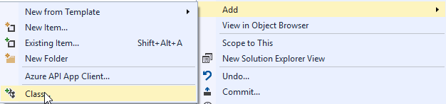

# <a name="create-a-windows-hello-login-service"></a>Créer un service de connexion WindowsHello

Voici la deuxième partie de la procédure complète sur l’utilisation de Windows Hello comme alternative aux systèmes d’authentification par nom d’utilisateur et mot de passe traditionnels dans des applications UWP Windows10. Cet article prend la suite de la première partie, [Application de connexion Windows Hello](microsoft-passport-login.md), et étend la fonctionnalité pour illustrer comment intégrer Windows Hello à votre application existante.

Pour créer ce projet, il vous faut connaître C# et XAML. Vous devrez également utiliser Visual Studio 2015 (Community Edition ou version ultérieure) sur un ordinateur Windows 10.

## <a name="exercise-1-server-side-logic"></a>Exercice 1: Logique côté serveur


Dans cet exercice, vous commencerez par créer une base de données et un serveur locaux fictifs à l’aide de l’application Windows Hello conçue précédemment. Ces travaux pratiques sont conçus pour apprendre comment Windows Hello peut être intégré à un système existant. L’utilisation d’une base de données et d’un serveur fictifs permet de réduire le nombre d’étapes de configuration inutiles. Dans vos propres applications, vous devez remplacer les objets fictifs avec des bases de données et des services réels.

-   Pour commencer, ouvrez la solution PassportLogin à partir du premier atelier de travaux pratiques Passport.
-   Commencez par implémenter la base de données et le serveur fictifs. Créez un dossier appelé AuthService. Dans l’Explorateur de solutions, cliquez avec le bouton droit sur la solution PassportLogin (Windows universelle) et sélectionnez Ajouter &gt; Nouveau dossier.
-   Créez des classes UserAccount et PassportDevices qui feront office de modèles pour les données à enregistrer dans la base de données fictive. UserAccount sera similaire au modèle utilisateur implémenté sur un serveur d’authentification traditionnel. Cliquez avec le bouton droit sur le dossier AuthService, puis ajoutez une nouvelle classe appelée UserAccount.cs.

    

    

-   Rendez la définition de classe publique, puis ajoutez les propriétés publiques suivantes. Vous aurez besoin des références suivantes.

    ```cs
    using System.ComponentModel.DataAnnotations;
     
    namespace PassportLogin.AuthService
    {
        public class UserAccount
        {
            [Key, Required]
            public Guid UserId { get; set; }
            [Required]
            public string Username { get; set; }
            public string Password { get; set; }
            // public List<PassportDevice> PassportDevices = new List<PassportDevice>();
        }
    }
    ```

    Vous avez peut-être remarqué la liste commentée de PassportDevices. Il s’agit d’une modification que vous devrez apporter à un modèle utilisateur existant dans votre implémentation actuelle. La liste PassportDevices contient un deviceID, la clé publique obtenue à partir de Windows Hello, ainsi qu’une [**KeyCredentialAttestationResult**](https://msdn.microsoft.com/library/windows/apps/dn973034). Pour ces travaux pratiques, vous devez implémenter keyAttestationResult, car cette variable est uniquement fournie par Windows Hello sur les appareils disposant d’une puce TPM (Trusted Platform Module). **KeyCredentialAttestationResult** est une combinaison de plusieurs propriétés et doit être fractionnée afin de les enregistrer et de les charger avec une base de données.

-   Créez dans le dossier AuthService une classe appelée PassportDevice.cs. Il s’agit du modèle destiné aux appareils Windows Hello décrit ci-dessus. Modifiez la définition de classe sur publique, puis ajoutez les propriétés suivantes.

    ```cs
    namespace PassportLogin.AuthService
    {
        public class PassportDevice
        {
            // These are the new variables that will need to be added to the existing UserAccount in the Database
            // The DeviceName is used to support multiple devices for the one user.
            // This way the correct public key is easier to find as a new public key is made for each device.
            // The KeyAttestationResult is only used if the User device has a TPM (Trusted Platform Module) chip, 
            // in most cases it will not. So will be left out for this hands on lab.
            public Guid DeviceId { get; set; }
            public byte[] PublicKey { get; set; }
            // public KeyCredentialAttestationResult KeyAttestationResult { get; set; }
        }
    }
    ```

-   Revenez dans UserAccount.cs, puis supprimez les marques de commentaire de la liste des appareils Windows Hello.

    ```cs
    using System.Collections.Generic;
     
    namespace PassportLogin.AuthService
    {
        public class UserAccount
        {
            [Key, Required]
            public Guid UserId { get; set; }
            [Required]
            public string Username { get; set; }
            public string Password { get; set; }
            public List<PassportDevice> PassportDevices = new List<PassportDevice>();
        }
    }
    ```

-   Une fois le modèle pour UserAccount et PassportDevice créé, vous devez créer une autre classe dans AuthService qui jouera le rôle de base de données fictive. Il s’agit d’une base de données fictive à partir de laquelle vous enregistrez et chargez une liste de comptes utilisateur localement. Dans le monde réel, il s’agit de votre implémentation de base de données. Créez dans AuthService une classe appelée MockStore.cs. Modifiez la définition de classe sur publique.
-   Dans la mesure où le Windows Store fictif enregistre et charge localement la liste des comptes utilisateur, vous pouvez implémenter la logique pour enregistrer et charger cette liste à l’aide de XmlSerializer. Vous devrez aussi mémoriser le nom de fichier et l’emplacement d’enregistrement. Dans MockStore.cs, implémentez les éléments suivants:

```cs
    using System.IO;
    using System.Linq;
    using System.Xml.Serialization;
    using Windows.Storage;

    namespace PassportLogin.AuthService
    {
        public class MockStore
        {
            private const string USER_ACCOUNT_LIST_FILE_NAME = "userAccountsList.txt";
            // This cannot be a const because the LocalFolder is accessed at runtime
            private string _userAccountListPath = Path.Combine(
                ApplicationData.Current.LocalFolder.Path, USER_ACCOUNT_LIST_FILE_NAME);
            private List<UserAccount> _mockDatabaseUserAccountsList;
     
    #region Save and Load Helpers
            /// <summary>
            /// Create and save a useraccount list file. (Replacing the old one)
            /// </summary>
            private async void SaveAccountListAsync()
            {
                string accountsXml = SerializeAccountListToXml();
     
                if (File.Exists(_userAccountListPath))
                {
                    StorageFile accountsFile = await StorageFile.GetFileFromPathAsync(_userAccountListPath);
                    await FileIO.WriteTextAsync(accountsFile, accountsXml);
                }
                else
                {
                    StorageFile accountsFile = await ApplicationData.Current.LocalFolder.CreateFileAsync(USER_ACCOUNT_LIST_FILE_NAME);
                    await FileIO.WriteTextAsync(accountsFile, accountsXml);
                }
            }
     
            /// <summary>
            /// Gets the useraccount list file and deserializes it from XML to a list of useraccount objects.
            /// </summary>
            /// <returns>List of useraccount objects</returns>
            private async void LoadAccountListAsync()
            {
                if (File.Exists(_userAccountListPath))
                {
                    StorageFile accountsFile = await StorageFile.GetFileFromPathAsync(_userAccountListPath);
     
                    string accountsXml = await FileIO.ReadTextAsync(accountsFile);
                    DeserializeXmlToAccountList(accountsXml);
                }
     
                // If the UserAccountList does not contain the sampleUser Initialize the sample users
                // This is only needed as it in a Hand on Lab to demonstrate a user migrating
                // In the real world user accounts would just be in a database
                if (!_mockDatabaseUserAccountsList.Any(f => f.Username.Equals("sampleUsername")))
                {
                    //If the list is empty InitializeSampleAccounts and return the list
                    //InitializeSampleUserAccounts();
                }
            }
     
            /// <summary>
            /// Uses the local list of accounts and returns an XML formatted string representing the list
            /// </summary>
            /// <returns>XML formatted list of accounts</returns>
            private string SerializeAccountListToXml()
            {
                XmlSerializer xmlizer = new XmlSerializer(typeof(List<UserAccount>));
                StringWriter writer = new StringWriter();
                xmlizer.Serialize(writer, _mockDatabaseUserAccountsList);
                return writer.ToString();
            }
     
            /// <summary>
            /// Takes an XML formatted string representing a list of accounts and returns a list object of accounts
            /// </summary>
            /// <param name="listAsXml">XML formatted list of accounts</param>
            /// <returns>List object of accounts</returns>
            private List<UserAccount> DeserializeXmlToAccountList(string listAsXml)
            {
                XmlSerializer xmlizer = new XmlSerializer(typeof(List<UserAccount>));
                TextReader textreader = new StreamReader(new MemoryStream(Encoding.UTF8.GetBytes(listAsXml)));
                return _mockDatabaseUserAccountsList = (xmlizer.Deserialize(textreader)) as List<UserAccount>;
            }
    #endregion
        }
    }
```

-   Dans la méthode Load, vous avez peut-être remarqué qu’une méthode InitializeSampleUserAccounts a été commentée. Vous devez créer cette méthode dans MockStore.cs. Cette méthode remplit la liste de comptes utilisateur afin qu’une connexion puisse s’effectuer. Dans le monde réel, la base de données utilisateur serait déjà remplie. Lors de cette étape, vous allez également créer un constructeur qui initialisera le chargement de la liste utilisateur et de l’appel.

    ```cs
    namespace PassportLogin.AuthService
    {
        public class MockStore
        {
            private const string USER_ACCOUNT_LIST_FILE_NAME = "userAccountsList.txt";
            // This cannot be a const because the LocalFolder is accessed at runtime
            private string _userAccountListPath = Path.Combine(
                ApplicationData.Current.LocalFolder.Path, USER_ACCOUNT_LIST_FILE_NAME);
            private List<UserAccount> _mockDatabaseUserAccountsList;
     
            public MockStore()
            {
                _mockDatabaseUserAccountsList = new List& lt; UserAccount & gt; ();
                LoadAccountListAsync();
            }

            private void InitializeSampleUserAccounts()
            {
                // Create a sample Traditional User Account that only has a Username and Password
                // This will be used initially to demonstrate how to migrate to use Windows Hello

                UserAccount sampleUserAccount = new UserAccount()
                {
                    UserId = Guid.NewGuid(),
                    Username = "sampleUsername",
                    Password = "samplePassword",
                };

                // Add the sampleUserAccount to the _mockDatabase
                _mockDatabaseUserAccountsList.Add(sampleUserAccount);
                SaveAccountListAsync();
            }
        }
    }
    ```

-   Maintenant que la méthode InitalizeSampleUserAccounts existe, supprimez les marques de commentaire de l’appel de méthode dans la méthode LoadAccountListAsync.

    ```cs
    private async void LoadAccountListAsync()
    {
        if (File.Exists(_userAccountListPath))
        {
            StorageFile accountsFile = await StorageFile.GetFileFromPathAsync(_userAccountListPath);

            string accountsXml = await FileIO.ReadTextAsync(accountsFile);
            DeserializeXmlToAccountList(accountsXml);
        }

        // If the UserAccountList does not contain the sampleUser Initialize the sample users
        // This is only needed as it in a Hand on Lab to demonstrate a user migrating
        // In the real world user accounts would just be in a database
        if (!_mockDatabaseUserAccountsList.Any(f = > f.Username.Equals("sampleUsername")))
                {
            //If the list is empty InitializeSampleAccounts and return the list
            InitializeSampleUserAccounts();
        }
    }
    ```

-   La liste de comptes utilisateur du Windows Store fictif peut désormais être enregistrée et chargée. D’autres parties de l’application auront besoin d’accéder à cette liste, il faudra donc des méthodes pour récupérer ces données. En dessous de la méthode InitializeSampleUserAccounts, ajoutez les méthodes Get suivantes. Elles vous permettront d’obtenir un identifiant utilisateur, un utilisateur unique, une liste d’utilisateurs pour un appareil Windows Hello spécifique, ainsi que la clé publique pour l’utilisateur sur un appareil spécifique.

    ```cs
    public Guid GetUserId(string username)
    {
        if (_mockDatabaseUserAccountsList.Any())
        {
            UserAccount account = _mockDatabaseUserAccountsList.FirstOrDefault(f => f.Username.Equals(username));
            if (account != null)
            {
                return account.UserId;
            }
        }
        return Guid.Empty;
    }

    public UserAccount GetUserAccount(Guid userId)
    {
        return _mockDatabaseUserAccountsList.FirstOrDefault(f => f.UserId.Equals(userId));
    }

    public List<UserAccount> GetUserAccountsForDevice(Guid deviceId)
    {
        List<UserAccount> usersForDevice = new List<UserAccount>();

        foreach (UserAccount account in _mockDatabaseUserAccountsList)
        {
            if (account.PassportDevices.Any(f => f.DeviceId.Equals(deviceId)))
            {
                usersForDevice.Add(account);
            }
        }

        return usersForDevice;
    }

    public byte[] GetPublicKey(Guid userId, Guid deviceId)
    {
        UserAccount account = _mockDatabaseUserAccountsList.FirstOrDefault(f => f.UserId.Equals(userId));
        if (account != null)
        {
            if (account.PassportDevices.Any())
            {
                return account.PassportDevices.FirstOrDefault(p => p.DeviceId.Equals(deviceId)).PublicKey;
            }
        }
        return null;
    }
    ```

-   Les méthodes suivantes à implémenter gèrent les opérations simples pour ajouter un compte, supprimer le compte et supprimer l’appareil. La suppression des appareils est nécessaire, car Windows Hello est propre à l’appareil. Pour chaque appareil auquel vous êtes connecté, une paire de clés publique et privée est créée par Windows Hello. C’est comme si vous aviez un mot de passe différent pour chaque appareil, à part que vous n’avez pas besoin de vous en souvenir puisque c’est le serveur qui s’en charge. Ajoutez les méthodes suivantes dans MockStore.cs.

    ```cs
    public UserAccount AddAccount(string username)
    {
        UserAccount newAccount = null;
        try
        {
            newAccount = new UserAccount()
            {
                UserId = Guid.NewGuid(),
                Username = username,
            };

            _mockDatabaseUserAccountsList.Add(newAccount);
            SaveAccountListAsync();
        }
        catch (Exception)
        {
            throw;
        }
        return newAccount;
    }

    public bool RemoveAccount(Guid userId)
    {
        UserAccount userAccount = GetUserAccount(userId);
        if (userAccount != null)
        {
            _mockDatabaseUserAccountsList.Remove(userAccount);
            SaveAccountListAsync();
            return true;
        }
        return false;
    }

    public bool RemoveDevice(Guid userId, Guid deviceId)
    {
        UserAccount userAccount = GetUserAccount(userId);
        PassportDevice deviceToRemove = null;
        if (userAccount != null)
        {
            foreach (PassportDevice device in userAccount.PassportDevices)
            {
                if (device.DeviceId.Equals(deviceId))
                {
                    deviceToRemove = device;
                    break;
                }
            }
        }

        if (deviceToRemove != null)
        {
            //Remove the PassportDevice
            userAccount.PassportDevices.Remove(deviceToRemove);
            SaveAccountListAsync();
        }

        return true;
    }
    ```

- Dans la classe MockStore, ajoutez une méthode qui ajoutera les informations Windows Hello relatives à un UserAccount existant. Cette méthode est appelée PassportUpdateDetails et prend des paramètres pour identifier l’utilisateur et les détails Windows Hello. KeyAttestationResult a été commentée lors de la création de PassportDevice (nécessaire également dans le monde réel).

    ```cs
    using Windows.Security.Credentials;

    public void PassportUpdateDetails(Guid userId, Guid deviceId, byte[] publicKey, 
        KeyCredentialAttestationResult keyAttestationResult)
    {
        UserAccount existingUserAccount = GetUserAccount(userId);
        if (existingUserAccount != null)
        {
            if (!existingUserAccount.PassportDevices.Any(f => f.DeviceId.Equals(deviceId)))
            {
                existingUserAccount.PassportDevices.Add(new PassportDevice()
                {
                    DeviceId = deviceId,
                    PublicKey = publicKey,
                    // KeyAttestationResult = keyAttestationResult
                });
            }
        }
        SaveAccountListAsync();
    }
    ```

- La classe MockStore est maintenant terminée et dans la mesure où elle représente la base de données, elle doit être considérée comme privée. Afin d’accéder au MockStore, une classe AuthService est nécessaire pour manipuler les données de base de données. Créez dans le dossier AuthService une classe appelée AuthService.cs. Modifiez la définition de classe sur publique et ajoutez un modèle d’instance de singleton pour vous assurer qu’une seule instance est créée.

    ```cs
    namespace PassportLogin.AuthService
    {
        public class AuthService
        {
            // Singleton instance of the AuthService
            // The AuthService is a mock of what a real world server and service implementation would be
            private static AuthService _instance;
            public static AuthService Instance
            {
                get
                {
                    if (null == _instance)
                    {
                        _instance = new AuthService();
                    }
                    return _instance;
                }
            }

            private AuthService()
            { }
        }
    }
    ```

-   La classe AuthService doit créer une instance de la classe MockStore et fournir un accès aux propriétés de l’objet MockStore.

    ```cs
    namespace PassportLogin.AuthService
    {
        public class AuthService
        {
            //Singleton instance of the AuthService
            //The AuthService is a mock of what a real world server and database implementation would be
            private static AuthService _instance;
            public static AuthService Instance
            {
                get
                {
                    if (null == _instance)
                    {
                        _instance = new AuthService();
                    }
                    return _instance;
                }
            }
     
            private MockStore _mockStore = new MockStore();
     
            public Guid GetUserId(string username)
            {
                return _mockStore.GetUserId(username);
            }
     
            public UserAccount GetUserAccount(Guid userId)
            {
                return _mockStore.GetUserAccount(userId);
            }
     
            public List<UserAccount> GetUserAccountsForDevice(Guid deviceId)
            {
                return _mockStore.GetUserAccountsForDevice(deviceId);
            }
        }
    }
    ```

-   Vous avez besoin des méthodes dans la classe AuthService pour accéder, ajouter, supprimer et mettre à jour les méthodes de détails Passport dans l’objet MockStore. À la fin du fichier de classe AuthService, ajoutez les méthodes suivantes:

    ```cs
    using Windows.Security.Credentials;

    public void Register(string username)
    {
        _mockStore.AddAccount(username);
    }

    public bool PassportRemoveUser(Guid userId)
    {
        return _mockStore.RemoveAccount(userId);
    }

    public bool PassportRemoveDevice(Guid userId, Guid deviceId)
    {
        return _mockStore.RemoveDevice(userId, deviceId);
    }

    public void PassportUpdateDetails(Guid userId, Guid deviceId, byte[] publicKey, 
        KeyCredentialAttestationResult keyAttestationResult)
    {
        _mockStore.PassportUpdateDetails(userId, deviceId, publicKey, keyAttestationResult);
    }
    ```

-   La classe AuthService doit fournir une méthode pour valider les informations d’identification. Cette méthode prend un nom d’utilisateur et un mot de passe, et vérifie que le compte existe et que le mot de passe est valide. Un système existant dispose d’une méthode équivalente pour vérifier que l’utilisateur est autorisé. Ajoutez les informations ValidateCredentials suivantes au fichier AuthService.cs.

    ```cs
    public bool ValidateCredentials(string username, string password)
    {
        if (!string.IsNullOrEmpty(username) && !string.IsNullOrEmpty(password))
        {
            // This would be used for existing accounts migrating to use Passport
            Guid userId = GetUserId(username);
            if (userId != Guid.Empty)
            {
                UserAccount account = GetUserAccount(userId);
                if (account != null)
                {
                    if (string.Equals(password, account.Password))
                    {
                        return true;
                    }
                }
            }
        }
        return false;
    }
    ```

-   La classe AuthService a besoin d’une méthode Request challenge qui renvoie un défi au client pour valider l’utilisateur qu’il prétend être. Une méthode est également nécessaire dans la classe AuthService pour recevoir le défi signé par le client. Dans le cadre de ces travaux pratiques, la méthode permettant de déterminer si le défi signé est terminé a été laissée incomplète. Toutes les implémentations de Windows Hello dans un système d’authentification existant seront légèrement différentes. La clé publique stockée sur le serveur doit correspondre au résultat renvoyé par le client au serveur. Ajoutez ces deux méthodes à AuthService.cs.

    ```cs
    using Windows.Security.Cryptography;
    using Windows.Storage.Streams;

    public IBuffer PassportRequestChallenge()
    {
        return CryptographicBuffer.ConvertStringToBinary("ServerChallenge", BinaryStringEncoding.Utf8);
    }

    public bool SendServerSignedChallenge(Guid userId, Guid deviceId, byte[] signedChallenge)
    {
        // Depending on your company polices and procedures this step will be different
        // It is at this point you will need to validate the signedChallenge that is sent back from the client.
        // Validation is used to ensure the correct user is trying to access this account. 
        // The validation process will use the signedChallenge and the stored PublicKey 
        // for the username and the specific device signin is called from.
        // Based on the validation result you will return a bool value to allow access to continue or to block the account.

        // For this sample validation will not happen as a best practice solution does not apply and will need to 
           // be configured for each company.
        // Simply just return true.

        // You could get the User's Public Key with something similar to the following:
        byte[] userPublicKey = _mockStore.GetPublicKey(userId, deviceId);
        return true;
    }
    ```

## <a name="exercise-2-client-side-logic"></a>Exercice2: Logique côté client

Dans cet exercice, vous allez modifier les vues et les classes d’assistance côté client pour utiliser la classe AuthService. Dans le monde réel, AuthService est le serveur d’authentification et vous devez utiliser l’API Web pour envoyer et recevoir des données à partir du serveur. Pour ces travaux pratiques et pour simplifier les choses, le client et le serveur sont locaux. L’objectif est d’apprendre à utiliser les API Windows Hello.

-   Dans MainPage.xaml.cs, vous pouvez supprimer l’appel de méthode AccountHelper.LoadAccountListAsync dans la méthode chargée, car la classe AuthService crée une instance du MockStore qui charge la liste des comptes. La méthode chargée doit maintenant se présenter comme suit. La définition de méthode asynchrone est supprimée, car aucun élément n’est en attente.

    ```cs
    private void MainPage_Loaded(object sender, RoutedEventArgs e)
    {
        Frame.Navigate(typeof(UserSelection));
    }
    ```

-   Mettez à jour l’interface de la page de connexion pour demander qu’un compte Passport soit entré. Ces travaux pratiques montrent comment un système existant peut être migré pour utiliser Windows Hello et comment les comptes existants disposeront d’un nom utilisateur et d’un mot de passe. Mettez également à jour l’explication en bas du code XAML afin d’ inclure le mot de passe par défaut. Mettre à jour le code XAML suivant dans Login.xaml

    ```xml
    <Grid Background="{ThemeResource ApplicationPageBackgroundThemeBrush}">
      <StackPanel Orientation="Vertical">
        <TextBlock Text="Login" FontSize="36" Margin="4" TextAlignment="Center"/>

        <TextBlock x:Name="ErrorMessage" Text="" FontSize="20" Margin="4" Foreground="Red" TextAlignment="Center"/>

        <TextBlock Text="Enter your credentials below" Margin="0,0,0,20"
                   TextWrapping="Wrap" Width="300"
                   TextAlignment="Center" VerticalAlignment="Center" FontSize="16"/>

        <StackPanel Orientation="Horizontal" HorizontalAlignment="Center">
          <!-- Username Input -->
          <TextBlock x:Name="UserNameTextBlock" Text="Username: "
                 FontSize="20" Margin="4" Width="100"/>
          <TextBox x:Name="UsernameTextBox" PlaceholderText="sampleUsername" Width="200" Margin="4"/>
        </StackPanel>

        <StackPanel Orientation="Horizontal" HorizontalAlignment="Center">
          <!-- Password Input -->
          <TextBlock x:Name="PasswordTextBlock" Text="Password: "
                 FontSize="20" Margin="4" Width="100"/>
          <PasswordBox x:Name="PasswordBox" PlaceholderText="samplePassword" Width="200" Margin="4"/>
        </StackPanel>

        <Button x:Name="PassportSignInButton" Content="Login" Background="DodgerBlue" Foreground="White"
            Click="PassportSignInButton_Click" Width="80" HorizontalAlignment="Center" Margin="0,20"/>

        <TextBlock Text="Don't have an account?"
                    TextAlignment="Center" VerticalAlignment="Center" FontSize="16"/>
        <TextBlock x:Name="RegisterButtonTextBlock" Text="Register now"
                   PointerPressed="RegisterButtonTextBlock_OnPointerPressed"
                   Foreground="DodgerBlue"
                   TextAlignment="Center" VerticalAlignment="Center" FontSize="16"/>

        <Border x:Name="PassportStatus" Background="#22B14C"
                   Margin="0,20" Height="100">
          <TextBlock x:Name="PassportStatusText" Text="Windows Hello is ready to use!"
                 Margin="4" TextAlignment="Center" VerticalAlignment="Center" FontSize="20"/>
        </Border>

        <TextBlock x:Name="LoginExplaination" FontSize="24" TextAlignment="Center" TextWrapping="Wrap" 
            Text="Please Note: To demonstrate a login, validation will only occur using the default username 
            'sampleUsername' and default password 'samplePassword'"/>

      </StackPanel>
    </Grid>
    ```

-   Dans le code-behind de classe de connexion, vous devez modifier en UserAccount la variable privée Account située en haut de la classe. Modifiez l’événement OnNavigateTo afin de convertir le type en UserAccount. Vous aurez besoin des références suivantes.

    ```cs
    using PassportLogin.AuthService;

    namespace PassportLogin.Views
    {
        public sealed partial class Login : Page
        {
            private UserAccount _account;
            private bool _isExistingAccount;

            public Login()
            {
                this.InitializeComponent();
            }

            protected override async void OnNavigatedTo(NavigationEventArgs e)
            {
                //Check Windows Hello is setup and available on this machine
                if (await MicrosoftPassportHelper.MicrosoftPassportAvailableCheckAsync())
                {
                    if (e.Parameter != null)
                    {
                        _isExistingAccount = true;
                        //Set the account to the existing account being passed in
                        _account = (UserAccount)e.Parameter;
                        UsernameTextBox.Text = _account.Username;
                        SignInPassport();
                    }
                }
            }
        }
    }
    ```

-   Puisque la page de connexion utilise un objet UserAccount au lieu de l’objet Compte précédent, MicrosoftPassportHelper.cs doit être mis à jour pour utiliser UserAccount en tant que paramètre pour certaines méthodes. Vous devez modifier les paramètres suivants pour les méthodes CreatePassportKeyAsync, RemovePassportAccountAsync et GetPassportAuthenticationMessageAsync. La classe UserAccount disposant d’un GUID, vous utiliserez un identifiant utilisateur dans plus d’endroits pour être plus spécifique.

    ```cs
    public static async Task<bool> CreatePassportKeyAsync(Guid userId, string username)
    {
        KeyCredentialRetrievalResult keyCreationResult = await KeyCredentialManager.RequestCreateAsync(username, KeyCredentialCreationOption.ReplaceExisting);
    }

    public static async void RemovePassportAccountAsync(UserAccount account)
    {

    }
    public static async Task<bool> GetPassportAuthenticationMessageAsync(UserAccount account)
    {
        KeyCredentialRetrievalResult openKeyResult = await KeyCredentialManager.OpenAsync(account.Username);
        //Calling OpenAsync will allow the user access to what is available in the app and will not require user credentials again.
        //If you wanted to force the user to sign in again you can use the following:
        //var consentResult = await Windows.Security.Credentials.UI.UserConsentVerifier.RequestVerificationAsync(account.Username);
        //This will ask for the either the password of the currently signed in Microsoft Account or the PIN used for Windows Hello.

        if (openKeyResult.Status == KeyCredentialStatus.Success)
        {
            //If OpenAsync has succeeded, the next thing to think about is whether the client application requires access to backend services.
            //If it does here you would Request a challenge from the Server. The client would sign this challenge and the server
            //would check the signed challenge. If it is correct it would allow the user access to the backend.
            //You would likely make a new method called RequestSignAsync to handle all this
            //e.g. RequestSignAsync(openKeyResult);
            //Refer to the second Windows Hello sample for information on how to do this.

            //For this sample there is not concept of a server implemented so just return true.
            return true;
        }
        else if (openKeyResult.Status == KeyCredentialStatus.NotFound)
        {
            //If the _account is not found at this stage. It could be one of two errors. 
            //1. Windows Hello has been disabled
            //2. Windows Hello has been disabled and re-enabled cause the Windows Hello Key to change.
            //Calling CreatePassportKey and passing through the account will attempt to replace the existing Windows Hello Key for that account.
            //If the error really is that Windows Hello is disabled then the CreatePassportKey method will output that error.
            if (await CreatePassportKeyAsync(account.UserId, account.Username))
            {
                //If the Passport Key was again successfully created, Windows Hello has just been reset.
                //Now that the Passport Key has been reset for the _account retry sign in.
                return await GetPassportAuthenticationMessageAsync(account);
            }
        }

        // Can't use Passport right now, try again later
        return false;
    }
    ```

-   La méthode SignInPassport du fichier Login.xaml.cs doit être mise à jour pour utiliser AuthService au lieu de AccountHelper. La validation des informations d’identification a lieu via AuthService. Dans le cadre de ces travaux pratiques, le seul compte configuré est sampleUsername. Ce compte est créé dans la méthode InitializeSampleUserAccounts dans MockStore.cs. Mettez à jour la méthode SignInPassport dans Login.xaml.cs afin de refléter l’extrait de code ci-dessous.

    ```cs
    private async void SignInPassportAsync()
    {
        if (_isExistingLocalAccount)
        {
            if (await MicrosoftPassportHelper.GetPassportAuthenticationMessageAsync(_account))
            {
                Frame.Navigate(typeof(Welcome), _account);
            }
        }
        else if (AuthService.AuthService.Instance.ValidateCredentials(UsernameTextBox.Text, PasswordBox.Password))
        {
            Guid userId = AuthService.AuthService.Instance.GetUserId(UsernameTextBox.Text);

            if (userId != Guid.Empty)
            {
                //Now that the account exists on server try and create the necessary passport details and add them to the account
                bool isSuccessful = await MicrosoftPassportHelper.CreatePassportKeyAsync(userId, UsernameTextBox.Text);
                if (isSuccessful)
                {
                    Debug.WriteLine("Successfully signed in with Windows Hello!");
                    //Navigate to the Welcome Screen. 
                    _account = AuthService.AuthService.Instance.GetUserAccount(userId);
                    Frame.Navigate(typeof(Welcome), _account);
                }
                else
                {
                    //The passport account creation failed.
                    //Remove the account from the server as passport details were not configured
                    AuthService.AuthService.Instance.PassportRemoveUser(userId);

                    ErrorMessage.Text = "Account Creation Failed";
                }
            }
        }
        else
        {
            ErrorMessage.Text = "Invalid Credentials";
        }
    }
    ```

-   Dans la mesure où Windows Hello crée une paire de clés publique et privée différente pour chaque compte sur chaque appareil, la page d’accueil doit afficher la liste des appareils inscrits pour le compte connecté et permettre à chacun d’entre eux d’être oubliés. Dans Welcome.xaml, ajoutez le code XAML suivant sous ForgetButton. Cette opération permet d’implémenter un bouton oublier l’appareil, une zone de texte d’erreur et une liste affichant tous les appareils.

    ```xml
    <Grid Background="{ThemeResource ApplicationPageBackgroundThemeBrush}">
      <StackPanel Orientation="Vertical">
        <TextBlock x:Name="Title" Text="Welcome" FontSize="40" TextAlignment="Center"/>
        <TextBlock x:Name="UserNameText" FontSize="28" TextAlignment="Center" Foreground="Black"/>

        <Button x:Name="BackToUserListButton" Content="Back to User List" Click="Button_Restart_Click"
               HorizontalAlignment="Center" Margin="0,20" Foreground="White" Background="DodgerBlue"/>

        <Button x:Name="ForgetButton" Content="Forget Me" Click="Button_Forget_User_Click"
               Foreground="White"
               Background="Gray"
               HorizontalAlignment="Center"/>

        <Button x:Name="ForgetDeviceButton" Content="Forget Device" Click="Button_Forget_Device_Click"
               Foreground="White"
               Background="Gray"
               Margin="0,40,0,20"
               HorizontalAlignment="Center"/>

        <TextBlock x:Name="ForgetDeviceErrorTextBlock" Text="Select a device first"
                  TextWrapping="Wrap" Width="300" Foreground="Red"
                  TextAlignment="Center" VerticalAlignment="Center" FontSize="16" Visibility="Collapsed"/>

        <ListView x:Name="UserListView" MaxHeight="500" MinWidth="350" Width="350" HorizontalAlignment="Center">
          <ListView.ItemTemplate>
            <DataTemplate>
              <Grid Background="Gray" Height="50" Width="350" HorizontalAlignment="Center" VerticalAlignment="Stretch" >
                <TextBlock Text="{Binding DeviceId}" HorizontalAlignment="Center" TextAlignment="Center" VerticalAlignment="Center"
                          Foreground="White"/>
              </Grid>
            </DataTemplate>
          </ListView.ItemTemplate>
        </ListView>
      </StackPanel>
    </Grid>
    ```

-   Dans le fichier Welcome.xaml.cs, vous devez modifier la variable privée Account située en haut de la classe en variable privée UserAccount. Ensuite, mettez à jour la méthode OnNavigatedTo pour utiliser AuthService et récupérez les informations du compte actuel. Lorsque vous disposez des informations de compte, vous pouvez définir l’élément itemsource de la liste afin d’afficher les appareils. Vous devez ajouter une référence à l’espace de noms AuthServices.

    ```cs
    using PassportLogin.AuthService;

    namespace PassportLogin.Views
    {
        public sealed partial class Welcome : Page
        {
            private UserAccount _activeAccount;

            public Welcome()
            {
                InitializeComponent();
            }

            protected override void OnNavigatedTo(NavigationEventArgs e)
            {
                _activeAccount = (UserAccount)e.Parameter;
                if (_activeAccount != null)
                {
                    UserAccount account = AuthService.AuthService.Instance.GetUserAccount(_activeAccount.UserId);
                    if (account != null)
                    {
                        UserListView.ItemsSource = account.PassportDevices;
                        UserNameText.Text = account.Username;
                    }
                }
            }
        }
    }
    ```

-   Puisque vous utiliserez AuthService lors de la suppression d’un compte, la référence à AccountHelper dans la méthode Button\_Forget\_User\_Click peut aussi être supprimée. La méthode doit maintenant se présenter comme suit.

    ```cs
    private void Button_Forget_User_Click(object sender, RoutedEventArgs e)
    {
        //Remove it from Windows Hello
        MicrosoftPassportHelper.RemovePassportAccountAsync(_activeAccount);

        Debug.WriteLine("User " + _activeAccount.Username + " deleted.");

        //Navigate back to UserSelection page.
        Frame.Navigate(typeof(UserSelection));
    }
    ```

-   La méthode MicrosoftPassportHelper n’utilise pas AuthService pour supprimer le compte. Vous devez effectuer un appel à AuthService et transmettre l’identifiant utilisateur.

    ```cs
    public static async void RemovePassportAccountAsync(UserAccount account)
    {
        //Open the account with Windows Hello
        KeyCredentialRetrievalResult keyOpenResult = await KeyCredentialManager.OpenAsync(account.Username);

        if (keyOpenResult.Status == KeyCredentialStatus.Success)
        {
            // In the real world you would send key information to server to unregister
            AuthService.AuthService.Instance.PassportRemoveUser(account.UserId);
        }

        //Then delete the account from the machines list of Passport Accounts
        await KeyCredentialManager.DeleteAsync(account.Username);
    }
    ```

-   Avant de terminer l’implémentation de la classe de page d’accueil, vous devez créer une méthode dans MicrosoftPassportHelper.cs qui autorise la suppression d’un appareil. Créez une méthode qui appellera PassportRemoveDevice dans AuthService.

    ```cs
    public static void RemovePassportDevice(UserAccount account, Guid deviceId)
    {
        AuthService.AuthService.Instance.PassportRemoveDevice(account.UserId, deviceId);
    }
    ```

-   Dans Welcome.xaml.cs, implémentez l’événement click Forget Device. Cette opération utilise l’appareil sélectionné dans la liste et la méthode passport helper pour appeler remove device.

    ```cs
    private void Button_Forget_Device_Click(object sender, RoutedEventArgs e)
    {
        PassportDevice selectedDevice = UserListView.SelectedItem as PassportDevice;
        if (selectedDevice != null)
        {
            //Remove it from Windows Hello
            MicrosoftPassportHelper.RemovePassportDevice(_activeAccount, selectedDevice.DeviceId);

            Debug.WriteLine("User " + _activeAccount.Username + " deleted.");

            if (!UserListView.Items.Any())
            {
                //Navigate back to UserSelection page.
                Frame.Navigate(typeof(UserSelection));
            }
        }
        else
        {
            ForgetDeviceErrorTextBlock.Visibility = Visibility.Visible;
        }
    }
    ```

-   La prochaine page mise à jour est UserSelection. La page UserSelection doit utiliser AuthService pour récupérer tous les comptes utilisateur de l’appareil actuellement sélectionné. Il n’existe actuellement aucun moyen pour obtenir un ID d’appareil à transmettre à AuthService afin qu’il renvoie des comptes utilisateur pour cet appareil. Dans le dossier Utilitaires, créez une classe appelée Helpers.cs. Modifiez la définition de classe sur publique statique, puis ajoutez la méthode suivante qui permettra de récupérer l’ID de l’appareil actuel.

    ```cs
    using Windows.Security.ExchangeActiveSyncProvisioning;

    namespace PassportLogin.Utils
    {
        public static class Helpers
        {
            public static Guid GetDeviceId()
            {
                //Get the Device ID to pass to the server
                EasClientDeviceInformation deviceInformation = new EasClientDeviceInformation();
                return deviceInformation.Id;
            }
        }
    }
    ```

-   Dans la classe de page UserSelection, seul le code-behind doit être modifié, pas l’interface utilisateur. Dans UserSelection.xaml.cs, mettez à jour la méthode chargée et la méthode de sélection utilisateur afin d’utiliser la classe UserAccount au lieu de la classe Account. Vous devez également obtenir tous les utilisateurs de cet appareil via AuthService.

    ```cs
    using System.Linq;
    using PassportLogin.AuthService;

    namespace PassportLogin.Views
    {
        public sealed partial class UserSelection : Page
        {
            public UserSelection()
            {
                InitializeComponent();
                Loaded += UserSelection_Loaded;
            }

            private void UserSelection_Loaded(object sender, RoutedEventArgs e)
            {
                List<UserAccount> accounts = AuthService.AuthService.Instance.GetUserAccountsForDevice(Helpers.GetDeviceId());

                if (accounts.Any())
                {
                    UserListView.ItemsSource = accounts;
                    UserListView.SelectionChanged += UserSelectionChanged;
                }
                else
                {
                    //If there are no accounts navigate to the LoginPage
                    Frame.Navigate(typeof(Login));
                }
            }

            /// <summary>
            /// Function called when an account is selected in the list of accounts
            /// Navigates to the Login page and passes the chosen account
            /// </summary>
            private void UserSelectionChanged(object sender, RoutedEventArgs e)
            {
                if (((ListView)sender).SelectedValue != null)
                {
                    UserAccount account = (UserAccount)((ListView)sender).SelectedValue;
                    if (account != null)
                    {
                        Debug.WriteLine("Account " + account.Username + " selected!");
                    }
                    Frame.Navigate(typeof(Login), account);
                }
            }
        }
    }
    ```

-   La page PassportRegister doit mettre à jour le code-behind, l’interface utilisateur n’a besoin quant à elle d’aucune modification. Dans PassportRegister.xaml.cs, supprimez la variable privée Account située en haut de la classe, car elle n’est plus nécessaire. Mettez à jour l’événement click RegisterButton afin d’utiliser AuthService. Cette méthode crée un UserAccount, puis essaye de mettre à jour les détails de son compte Passport. Si le compte Passport ne parvient pas à créer une clé Passport, le compte est supprimé suite à l’échec du processus d’inscription.

    ```cs
    private async void RegisterButton_Click_Async(object sender, RoutedEventArgs e)
    {
        ErrorMessage.Text = "";

        //Validate entered credentials are acceptable
        if (!string.IsNullOrEmpty(UsernameTextBox.Text))
        {
            //Register an Account on the AuthService so that we can get back a userId
            AuthService.AuthService.Instance.Register(UsernameTextBox.Text);
            Guid userId = AuthService.AuthService.Instance.GetUserId(UsernameTextBox.Text);

            if (userId != Guid.Empty)
            {
                //Now that the account exists on server try and create the necessary passport details and add them to the account
                bool isSuccessful = await MicrosoftPassportHelper.CreatePassportKeyAsync(userId, UsernameTextBox.Text);
                if (isSuccessful)
                {
                    //Navigate to the Welcome Screen. 
                    Frame.Navigate(typeof(Welcome), AuthService.AuthService.Instance.GetUserAccount(userId));
                }
                else
                {
                    //The passport account creation failed.
                    //Remove the account from the server as passport details were not configured
                    AuthService.AuthService.Instance.PassportRemoveUser(userId);

                    ErrorMessage.Text = "Account Creation Failed";
                }
            }
        }
        else
        {
            ErrorMessage.Text = "Please enter a username";
        }
    }
    ```

-   Créez et exécutez l’application (F5). Connectez-vous au compte utilisateur servant d’exemple avec les informations d’identification sampleUsername et samplePassword. Sur l’écran d’accueil, vous avez peut-être remarqué que le bouton Forget devices s’affiche, mais qu’il n’y a aucun appareil. Lorsque vous créez ou migrez un utilisateur pour travailler avec Windows Hello, les informations de Passport ne sont pas transmises à AuthService.

    

    

-   Pour transmettre les informations de Passport à AuthService, MicrosoftPassportHelper.cs doit être mise à jour. Dans la méthode CreatePassportKeyAsync, au lieu de renvoyer uniquement la valeur True en cas de réussite, vous devez appeler une nouvelle méthode qui essaie d’obtenir KeyAttestation. Bien que ces travaux pratiques n’enregistrent pas ces informations dans AuthService, vous allez découvrir comment obtenir ces informations côté client. Mettez à jour la méthode CreatePassportKeyAsync.

    ```cs
    public static async Task<bool> CreatePassportKeyAsync(Guid userId, string username)
    {
        KeyCredentialRetrievalResult keyCreationResult = await KeyCredentialManager.RequestCreateAsync(username, KeyCredentialCreationOption.ReplaceExisting);

        switch (keyCreationResult.Status)
        {
            case KeyCredentialStatus.Success:
                Debug.WriteLine("Successfully made key");
                await GetKeyAttestationAsync(userId, keyCreationResult);
                return true;
            case KeyCredentialStatus.UserCanceled:
                Debug.WriteLine("User cancelled sign-in process.");
                break;
            case KeyCredentialStatus.NotFound:
                // User needs to setup Windows Hello
                Debug.WriteLine("Windows Hello is not setup!\nPlease go to Windows Settings and set up a PIN to use it.");
                break;
            default:
                break;
        }

        return false;
    }
    ```

-   Créez cette méthode GetKeyAttestationAsync dans MicrosoftPassportHelper.cs. Cette méthode vous montrera comment vous procurer les informations nécessaires fournies par Windows Hello pour chaque compte sur un appareil spécifique.

    ```cs
    using Windows.Storage.Streams;

    private static async Task GetKeyAttestationAsync(Guid userId, KeyCredentialRetrievalResult keyCreationResult)
    {
        KeyCredential userKey = keyCreationResult.Credential;
        IBuffer publicKey = userKey.RetrievePublicKey();
        KeyCredentialAttestationResult keyAttestationResult = await userKey.GetAttestationAsync();
        IBuffer keyAttestation = null;
        IBuffer certificateChain = null;
        bool keyAttestationIncluded = false;
        bool keyAttestationCanBeRetrievedLater = false;
        KeyCredentialAttestationStatus keyAttestationRetryType = 0;

        if (keyAttestationResult.Status == KeyCredentialAttestationStatus.Success)
        {
            keyAttestationIncluded = true;
            keyAttestation = keyAttestationResult.AttestationBuffer;
            certificateChain = keyAttestationResult.CertificateChainBuffer;
            Debug.WriteLine("Successfully made key and attestation");
        }
        else if (keyAttestationResult.Status == KeyCredentialAttestationStatus.TemporaryFailure)
        {
            keyAttestationRetryType = KeyCredentialAttestationStatus.TemporaryFailure;
            keyAttestationCanBeRetrievedLater = true;
            Debug.WriteLine("Successfully made key but not attestation");
        }
        else if (keyAttestationResult.Status == KeyCredentialAttestationStatus.NotSupported)
        {
            keyAttestationRetryType = KeyCredentialAttestationStatus.NotSupported;
            keyAttestationCanBeRetrievedLater = false;
            Debug.WriteLine("Key created, but key attestation not supported");
        }

        Guid deviceId = Helpers.GetDeviceId();
        //Update the Pasport details with the information we have just gotten above.
        //UpdatePassportDetails(userId, deviceId, publicKey.ToArray(), keyAttestationResult);
    }
    ```

-   Dans la méthode GetKeyAttestationAsync que vous venez d’ajouter, vous avez peut-être remarqué que la dernière ligne a été commentée. Cette dernière ligne sera une nouvelle méthode que vous créerez et qui enverra toutes les informations Windows Hello à AuthService. Dans le monde réel, vous devez envoyer ces informations à un serveur réel avec une API Web.

    ```cs
    using System.Runtime.InteropServices.WindowsRuntime;

    public static bool UpdatePassportDetails(Guid userId, Guid deviceId, byte[] publicKey, KeyCredentialAttestationResult keyAttestationResult)
    {
        //In the real world you would use an API to add Passport signing info to server for the signed in _account.
        //For this tutorial we do not implement a WebAPI for our server and simply mock the server locally 
        //The CreatePassportKey method handles adding the Windows Hello account locally to the device using the KeyCredential Manager

        //Using the userId the existing account should be found and updated.
        AuthService.AuthService.Instance.PassportUpdateDetails(userId, deviceId, publicKey, keyAttestationResult);
        return true;
    }
    ```

-   Supprimez les marques de commentaire de la dernière ligne de la méthode GetKeyAttestationAsync afin d’envoyer les informations Windows Hello à AuthService.
-   Générez et exécutez l’application, puis connectez-vous avec les informations d’identification par défaut comme précédemment. Sur l’écran d’accueil, vous voyez maintenant que l’ID d’appareil est affiché. Si vous êtes connecté sur un autre appareil, celui-ci s’affiche également ici (si vous disposez d’un service d’autorisation hébergé dans le cloud). Pour ces travaux pratiques, l’ID d’appareil réel est affiché. Dans une implémentation réelle, il vous faudrait afficher un nom convivial compréhensible pour l’utilisateur, qui lui permette d’identifier chaque appareil.

    

-   21. Pour terminer cet exercice pratique, vous avez besoin d’une demande et d’un défi pour l’utilisateur lorsqu’il fait son choix dans la page de sélection d’utilisateur et qu’il se reconnecte. AuthService contient les deux méthodes que vous avez créées pour demander un défi, et l’une d’elle utilise un défi signé. Dans MicrosoftPassportHelper.cs, créez une méthode appelée RequestSignAsync pour demander un défi à AuthService, connectez localement ce défi à l’aide d’une API Passport et envoyez le défi signé à AuthService. Dans ces travaux pratiques, AuthService recevra le défi signé et renverra la valeur True. Dans une implémentation réelle, vous devrez implémenter un mécanisme de vérification pour déterminer si le défi a été signé par l’utilisateur approprié sur l’appareil approprié. Ajouter la méthode ci-dessous à MicrosoftPassportHelper.cs

    ```cs
    private static async Task<bool> RequestSignAsync(Guid userId, KeyCredentialRetrievalResult openKeyResult)
    {
        // Calling userKey.RequestSignAsync() prompts the uses to enter the PIN or use Biometrics (Windows Hello).
        // The app would use the private key from the user account to sign the sign-in request (challenge)
        // The client would then send it back to the server and await the servers response.
        IBuffer challengeMessage = AuthService.AuthService.Instance.PassportRequestChallenge();
        KeyCredential userKey = openKeyResult.Credential;
        KeyCredentialOperationResult signResult = await userKey.RequestSignAsync(challengeMessage);

        if (signResult.Status == KeyCredentialStatus.Success)
        {
            // If the challenge from the server is signed successfully
            // send the signed challenge back to the server and await the servers response
            return AuthService.AuthService.Instance.SendServerSignedChallenge(
                userId, Helpers.GetDeviceId(), signResult.Result.ToArray());
        }
        else if (signResult.Status == KeyCredentialStatus.UserCanceled)
        {
            // User cancelled the Windows Hello PIN entry.
        }
        else if (signResult.Status == KeyCredentialStatus.NotFound)
        {
            // Must recreate Windows Hello key
        }
        else if (signResult.Status == KeyCredentialStatus.SecurityDeviceLocked)
        {
            // Can't use Windows Hello right now, remember that hardware failed and suggest restart
        }
        else if (signResult.Status == KeyCredentialStatus.UnknownError)
        {
            // Can't use Windows Hello right now, try again later
        }

        return false;
    }
    ```

-   22. Dans la classe MicrosoftPassportHelper, appelez la méthode RequestSignAsync à partir de la méthode GetPassportAuthenticationMessageAsync.

    ```cs
    public static async Task<bool> GetPassportAuthenticationMessageAsync(UserAccount account)
    {
        KeyCredentialRetrievalResult openKeyResult = await KeyCredentialManager.OpenAsync(account.Username);
        // Calling OpenAsync will allow the user access to what is available in the app and will not require user credentials again.
        // If you wanted to force the user to sign in again you can use the following:
        // var consentResult = await Windows.Security.Credentials.UI.UserConsentVerifier.RequestVerificationAsync(account.Username);
        // This will ask for the either the password of the currently signed in Microsoft Account or the PIN used for Windows Hello.

        if (openKeyResult.Status == KeyCredentialStatus.Success)
        {
            //If OpenAsync has succeeded, the next thing to think about is whether the client application requires access to backend services.
            //If it does here you would Request a challenge from the Server. The client would sign this challenge and the server
            //would check the signed challenge. If it is correct it would allow the user access to the backend.
            //You would likely make a new method called RequestSignAsync to handle all this
            //e.g. RequestSignAsync(openKeyResult);
            //Refer to the second Windows Hello sample for information on how to do this.

            return await RequestSignAsync(account.UserId, openKeyResult);
        }
        else if (openKeyResult.Status == KeyCredentialStatus.NotFound)
        {
            //If the _account is not found at this stage. It could be one of two errors. 
            //1. Windows Hello has been disabled
            //2. Windows Hello has been disabled and re-enabled cause the Windows Hello Key to change.
            //Calling CreatePassportKey and passing through the account will attempt to replace the existing Windows Hello Key for that account.
            //If the error really is that Windows Hello is disabled then the CreatePassportKey method will output that error.
            if (await CreatePassportKeyAsync(account.UserId, account.Username))
            {
                //If the Passport Key was again successfully created, Windows Hello has just been reset.
                //Now that the Passport Key has been reset for the _account retry sign in.
                return await GetPassportAuthenticationMessageAsync(account);
            }
        }

        // Can't use Windows Hello right now, try again later
        return false;
    }
    ```

-   Tout au long de cet exercice, vous avez mis à jour l’application côté client pour utiliser AuthService. En procédant ainsi, vous avez pu éliminer la nécessité pour les classes Account et AccountHelper. Supprimez la classe Account, le dossier Modèles et la classe AccountHelper dans le dossier Utilitaires. Vous devez supprimer toute référence à l’espace de noms Modèles tout au long de l’application pour que la solution soit générée correctement.
-   Générez et exécutez l’application, et profitez de Windows Hello avec la base de données et le service fictifs.

Dans ces travaux pratiques, vous avez appris à utiliser les API Windows Hello afin de remplacer les mots de passe pour l’authentification à partir d’un ordinateur Windows10. Si vous tenez compte de l’énergie dépensée pour l’entretien des mots de passe et la prise en charge des mots de passe perdus sur les systèmes existants, vous comprendrez tout de suite l’utilité du nouveau système d’authentification Windows Hello.

Nous avons laissé en guise d’exercice les détails sur la manière d’implémenter l’authentification côté service et côté serveur. La majorité d’entre vous dispose de systèmes existants qui devront être migrés pour pouvoir utiliser Windows Hello et les détails de chaque système diffèrent.

## <a name="related-topics"></a>Rubriques connexes

* [WindowsHello](microsoft-passport.md)
* [Application de connexion WindowsHello](microsoft-passport-login.md)