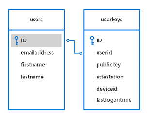

# <a name="windows-hello"></a>Windows Hello


Cet article décrit la nouvelle technologie Windows Hello intégrée au système d’exploitation Windows10 et explique comment les développeurs peuvent implémenter cette technologie pour protéger leurs applications UWP et services principaux. Il présente des fonctionnalités spécifiques de ces technologies qui contribuent à atténuer les menaces découlant de l’utilisation des informations d’identification classiques et fournit des recommandations sur la conception et le déploiement de ces technologies dans le cadre de votre lancement de Windows 10.

Notez que cet article est axé sur le développement d’applications. Pour plus d’informations sur l’architecture et l’implémentation de Windows Hello, voir le [Guide de WindowsHello sur TechNet](https://technet.microsoft.com/library/mt589441.aspx).

Pour obtenir un exemple du code complet, voir l’[exemple de code WindowsHello sur GitHub](http://go.microsoft.com/fwlink/?LinkID=717812).

Pour une procédure pas à pas sur la création d’une application UWP à l’aide de WindowsHello et le service d’authentification de stockage, voir les articles [Créer une application de connexion Microsoft Passport](microsoft-passport-login.md) et [Créer un service de connexion Microsoft Passport](microsoft-passport-login-auth-service.md).

## <a name="1-introduction"></a>1 Introduction


La sécurité des informations repose notamment sur le principe fondamental qu’un système peut identifier les personnes qui l’utilisent. L’identification d’un utilisateur permet au système de décider si l’utilisateur s’est correctement identifié (processus appelé authentification), puis de déterminer ce que cet utilisateur correctement authentifié peut faire (autorisation). La grande majorité des systèmes informatiques déployés dans le monde entier dépendent des informations d’identification de l’utilisateur pour prendre des décisions d’authentification et d’autorisation, ce qui signifie que la sécurité de ces systèmes dépend de mots de passe réutilisables créés par l’utilisateur. La maxime fréquemment citée selon laquelle l’authentification peut impliquer des « éléments que vous connaissez, dont vous disposez ou qui vous caractérisent » met habilement en évidence le problème suivant : un mot de passe réutilisable est un facteur d’authentification en lui-même, de sorte que quiconque connaît ce mot de passe peut emprunter l’identité de l’utilisateur qui le détient.

## <a name="11-problems-with-traditional-credentials"></a>1.1 Problèmes liés aux informations d’identification traditionnelles


Jamais depuis le milieu des années 1960, lorsque Fernando Corbató et son équipe du Massachusetts Institute of Technology ont été à l’origine de l’introduction du mot de passe, les utilisateurs et les administrateurs n’avaient eu à gérer l’utilisation de mots de passe pour l’authentification et l’autorisation de l’utilisateur. Au fil du temps, les techniques en matière de stockage et d’utilisation de mots de passe ont quelque peu évolué (par exemple, avec le salt et le hachage sécurisé du mot de passe), mais nous sommes toujours confrontés à deux problèmes. Les mots de passe sont faciles à cloner et à dérober. En outre, des erreurs d’implémentation peuvent compromettre leur intégrité, et les utilisateurs sont confrontés à un dilemme important entre commodité et sécurité.

## <a name="111-credential-theft"></a>1.1.1 Vol d’informations d’identification


Le principal risque lié aux mots de passe est simple : un attaquant peut les voler facilement. Chaque endroit où un mot de passe est entré, traité ou stocké est vulnérable. Par exemple, un attaquant peut voler un ensemble de mots de passe ou de codes de hachage sur un serveur d’authentification en espionnant le trafic réseau vers un serveur d’applications, en implantant un logiciel malveillant dans une application ou sur un appareil, en consignant les frappes de l’utilisateur sur un appareil, ou en observant les caractères tapés par un utilisateur, et il ne s’agit là que des méthodes d’attaque les plus courantes.

Un autre risque associé aux mots de passe correspond à la relecture des informations d’identification, au cours de laquelle un attaquant recueille une information d’identification valide en espionnant un réseau non sécurisé, puis la relit pour usurper l’identité d’un utilisateur légitime. La plupart des protocoles d’authentification (notamment Kerberos et OAuth) offrent une protection contre les attaques par relecture en incluant un horodatage dans le processus d’échange des informations d’identification. Or, cette méthode ne protège que le jeton généré par le système d’authentification, et non le mot de passe que l’utilisateur fournit pour obtenir le ticket.

## <a name="112-credential-reuse"></a>1.1.2 Réutilisation d’informations d’identification


L’approche courante qui consiste à utiliser une adresse e-mail comme nom d’utilisateur accentue le problème. Un attaquant qui récupère une paire nom d’utilisateur/mot de passe sur un système compromis peut ensuite l’essayer sur d’autres systèmes. Cette méthode permet souvent aux attaquants de se servir d’un système compromis comme d’un tremplin vers d’autres systèmes. L’utilisation d’une adresse e-mail comme nom d’utilisateur entraîne des problèmes supplémentaires, que nous aborderons plus loin dans ce guide.

## <a name="12-solving-credential-problems"></a>1.2 Résolution des problèmes liés aux informations d’identification


La résolution des problèmes posés par les mots de passe est délicate. Le renforcement des stratégies de mot de passe ne suffit pas : en effet, les utilisateurs peuvent recycler, partager ou noter les mots de passe. Bien que la sensibilisation des utilisateurs dans ce domaine soit essentielle pour la sécurité de l’authentification, elle ne suffit pas non plus à résoudre le problème.

Windows Hello remplace les mots de passe par la méthode d’authentification à 2 facteurs (2FA) forte en vérifiant les informations d’identification existantes et en créant une information d’identification propre à l’appareil protégée par un mouvement de l’utilisateur basé sur la biométrie de l’utilisateur ou sur la saisie du code confidentiel de ce dernier. 


## <a name="2-what-is-windows-hello"></a>2 Qu’est-ce que Windows Hello ?


Windows Hello est le nom que Microsoft a donné au nouveau système de connexion biométrique inclus dans Windows 10. Étant donné qu’il est directement intégré au système d’exploitation, Windows Hello peut identifier le visage ou les empreintes digitales pour déverrouiller les appareils des utilisateurs. L’authentification se produit lorsque l’utilisateur fournit son identificateur biométrique unique pour accéder aux informations d’identification spécifiques à l’appareil. Une personne malveillante qui vole l’appareil ne peut donc s’y connecter que si elle dispose du code PIN. Le magasin d’informations d’identification sécurisées Windows protège les données biométriques sur l’appareil. En utilisant Windows Hello pour déverrouiller un appareil, l’utilisateur autorisé accède à l’ensemble de son utilisation Windows, applications, données, sites Web et services.

L’authentificateur Windows Hello est appelé un Hello. Un Hello est propre à la combinaison d’un appareil et d’un utilisateur spécifiques. Il n’est pas transmis entre plusieurs appareils, il n’est pas partagé avec un serveur ou une application appelante et ne peut pas être extrait facilement d’un appareil. Si plusieurs utilisateurs partagent un appareil, chaque utilisateur doit configurer son propre compte. Chaque compte dispose d’un Hello unique pour cet appareil. Imaginez un Hello comme un jeton que vous pouvez utiliser pour déverrouiller (ou libérer) une information d’identification stockée. Le Hello proprement dit ne vous authentifie pas auprès d’une application ou d’un service, mais libère les informations d’identification qui le peuvent. En d’autres termes, un Hello est une méthode d’authentification par second facteur, et non par informations d’identification de l’utilisateur.

## <a name="21-windows-hello-authentication"></a>2.1 Authentification Windows Hello


Avec Windows Hello, un appareil dispose d’une méthode fiable de reconnaissance de l’utilisateur, ce qui permet de traiter la première partie du chemin d’accès entre un utilisateur et un service ou un élément de données demandé. Une fois que l’appareil a reconnu l’utilisateur, il doit toujours authentifier ce dernier avant de déterminer s’il lui accorde l’accès à une ressource demandée. Windows Hello propose une authentification 2FA forte, entièrement intégrée à Windows, qui remplace les mots de passe réutilisables par la combinaison d’un appareil spécifique et d’un mouvement biométrique ou d’un code PIN.

Toutefois, Windows Hello n’est pas un simple substitut aux systèmes 2FA traditionnels. Sa conception est semblable à celle des cartes à puce : l’authentification est effectuée à l’aide de primitives de chiffrement plutôt que par comparaison de chaînes, et le matériel de clé de l’utilisateur est protégé au sein d’un matériel inviolable. Windows Hello ne nécessite pas non plus les composants d’infrastructure supplémentaire requis pour le déploiement de cartes à puce. Par exemple, vous n’avez pas besoin d’une infrastructure à clé publique (PKI) pour gérer les certificats, si vous n’en êtes pas encore équipé. Windows Hello offre les principaux avantages des cartes à puce (flexibilité de déploiement pour les cartes à puce virtuelles et sécurité fiable pour les cartes à puce physiques), sans aucun de leurs inconvénients.

## <a name="22-how-windows-hello-works"></a>2.2 Fonctionnement de Windows Hello


Lorsque l’utilisateur installe Windows Hello sur sa machine, cette application génère une nouvelle paire de clés publique/privée sur l’appareil. Le [module de plateforme sécurisée](https://technet.microsoft.com/itpro/windows/keep-secure/trusted-platform-module-overview) (TPM) génère et protège cette clé privée. Si l’appareil n’a pas de puce TPM, la clé privée est chiffrée et protégée par voie logicielle. En outre, les appareils avec TPM génèrent un bloc de données permettant d’attester qu’une clé est liée au TPM. Vous pouvez utiliser ces informations d’attestation dans votre solution pour décider par exemple si l’utilisateur peut recevoir un autre niveau d’autorisation.

Pour activer Windows Hello sur un appareil, l’utilisateur doit disposer d’un compte Azure Active Directory ou d’un compte Microsoft connecté dans les paramètres Windows.

## <a name="221-how-keys-are-protected"></a>2.2.1 Protection des clés


Chaque fois qu’un document de clé est généré, il doit être protégé contre les attaques. La meilleure façon de procéder consiste à utiliser un matériel dédié. Depuis longtemps, les modules de sécurité matériels (HSM) sont utilisés pour générer, stocker et traiter les clés des applications de sécurité critiques. Les cartes à puce constituent un type spécial de HSM, comme les appareils compatibles avec la norme TPM de Trusted Computing Group. Dans la mesure du possible, la mise en œuvre de Windows Hello tire profit du module de plateforme sécurisée (TPM) matériel intégré pour générer, stocker et traiter les clés. Toutefois, WindowsHello et WindowsHello pour le travail ne nécessitent aucun module de plateforme sécurisée intégré.

Dans la mesure du possible, Microsoft vous recommande d’utiliser un TPM matériel. Le TPM offre une protection contre diverses attaques connues et potentielles, notamment les attaques par force brute du code confidentiel. Le TPM offre également une couche de protection supplémentaire après le verrouillage du compte. Une fois que le TPM a verrouillé le matériel de clé, l’utilisateur doit réinitialiser le code confidentiel. La réinitialisation du code PIN signifie que toutes les clés et tous les certificats chiffrés avec l’ancien matériel de clé seront supprimés.

## <a name="222-authentication"></a>2.2.2 Authentification


Lorsqu’un utilisateur souhaite accéder à un matériel de clé protégé, le processus d’authentification commence quand l’utilisateur entre un code confidentiel ou un mouvement biométrique pour déverrouiller l’appareil, ce processus étant parfois appelé «libération de la clé».

Une application ne peut jamais utiliser les clés d’une autre application, tout comme une personne ne peut jamais utiliser les clés d’un autre utilisateur. Ces clés sont utilisées pour signer les demandes d’accès à des ressources spécifiées envoyées au fournisseur d’identité ou IdP. Les applications peuvent utiliser des API spécifiques pour demander des opérations qui nécessitent un matériel de clé pour certaines actions. L’accès par le biais de ces API implique une validation explicite à l’aide d’un mouvement de l’utilisateur. Le matériel de clé n’est pas exposé à l’application à l’origine de la demande. L’application demande plutôt des actions spécifiques, comme la signature d’un élément de données, et la couche Windows Hello gère la tâche réelle et renvoie les résultats.

## <a name="23-getting-ready-to-implement-windows-hello"></a>2.3 Préparation à l’implémentation de WindowsHello


Maintenant que vous connaissez le fonctionnement de base de Windows Hello, nous allons vous expliquer comment l’implémenter dans vos propres applications.

Nous pouvons implémenter différents scénarios à l’aide de Windows Hello, par exemple une simple connexion à votre application sur un appareil. Un autre scénario courant est l’authentification auprès d’un service. Au lieu d’utiliser un nom et un mot de passe de connexion, vous utiliserez Windows Hello. Dans les chapitres suivants, nous présenterons l’implémentation de deux scénarios, en indiquant comment effectuer une authentification auprès de vos services à l’aide de Windows Hello et comment convertir un système nom d’utilisateur/mot de passe existant en un système Windows Hello.

Enfin, n’oubliez pas que les API Windows Hello nécessitent l’utilisation du Kit de développement logiciel (SDK) Windows 10 correspondant au système d’exploitation sur lequel l’application sera utilisée. En d’autres termes, vous devez utiliser le SDK Windows 10.0.10240 pour les applications déployées sur Windows 10, et le SDK 10.0.10586 pour les applications déployées sur Windows 10, version 1511.

## <a name="3-implementing-windows-hello"></a>3 Implémentation de Windows Hello


Dans ce chapitre, nous commencerons par un scénario dans lequel n’existe aucun système d’authentification, et nous expliquerons comment implémenter Windows Hello.

Le chapitre suivant vous indiquera comment effectuer une migration à partir d’un système nom d’utilisateur/mot de passe existant. Toutefois, même si cet aspect vous intéresse davantage, vous pourrez avoir besoin de parcourir le présent chapitre pour acquérir une connaissance de base du processus et du code requis.

## <a name="31-enrolling-new-users"></a>3.1 Inscription de nouveaux utilisateurs


Nous allons commencer par un tout nouveau service qui utilisera Windows Hello et par un nouvel utilisateur hypothétique prêt à s’inscrire sur un nouvel appareil.

La première étape consiste à vérifier que l’utilisateur est en mesure d’utiliser Windows Hello. L’application vérifie les paramètres de l’utilisateur et les fonctionnalités de l’appareil pour s’assurer qu’elle peut créer des clés d’identificateur d’utilisateur. Si l’application détermine que l’utilisateur n’a pas encore activé Windows Hello, elle invite ce dernier à effectuer cette installation avant d’utiliser l’application.

Pour activer Windows Hello, l’utilisateur doit simplement configurer un code PIN dans les paramètres Windows, à moins qu’il n’ait déjà procédé à cette opération pendant la phase OOBE (Out-Of-Box Experience).

Les lignes de code ci-après indiquent un moyen simple de vérifier si l’utilisateur est prêt pour Windows Hello.

```cs
var keyCredentialAvailable = await KeyCredentialManager.IsSupportedAsync();
if (!keyCredentialAvailable)
{
   // User didn't set up PIN yet
   return;
}
```

L’étape suivante consiste à inviter l’utilisateur à fournir les informations qui lui permettront de s’inscrire auprès de votre service. Vous pouvez par exemple lui demander d’indiquer son prénom, son nom de famille, son adresse e-mail et un nom d’utilisateur unique. Si vous le souhaitez, vous pouvez choisir d’utiliser l’adresse e-mail comme identificateur unique.

Dans ce scénario, nous utilisons l’adresse e-mail en tant qu’identificateur unique de l’utilisateur. Une fois que l’utilisateur s’est inscrit, vous pouvez envisager d’envoyer un e-mail de validation pour vérifier la validité de cette adresse. Cette approche vous offre un mécanisme pour réinitialiser le compte si nécessaire.

Si l’utilisateur a configuré son code confidentiel, l’application crée l’élément [**KeyCredential**](https://msdn.microsoft.com/library/windows/apps/dn973029) de l’utilisateur. L’application obtient également les informations d’attestation de clé facultatives afin d’avoir la preuve par chiffrement que la clé est générée sur le TPM. La clé publique générée, et éventuellement l’attestation, sont envoyées au serveur principal pour inscrire l’appareil utilisé. Chaque paire de clés générée sur chaque appareil est unique.

Le code permettant de créer l’élément [**KeyCredential**](https://msdn.microsoft.com/library/windows/apps/dn973029) se présente comme suit :

```cs
var keyCreationResult = await KeyCredentialManager
    .RequestCreateAsync(AccountId, KeyCredentialCreationOption.ReplaceExisting);
```

La méthode [**RequestCreateAsync**](https://msdn.microsoft.com/library/windows/apps/dn973048) est la partie qui crée la clé publique et privée. Si l’appareil intègre la puce TPM appropriée, les API demandent à celle-ci de créer la clé publique et privée et de stocker le résultat. S’il n’y a pas de puce TPM, le système d’exploitation crée la paire de clés dans le code. L’application ne peut en aucun cas accéder directement aux clés privées. Une partie de la création des paires de clés produit également les informations d’attestation correspondantes. (Pour plus d’informations sur l’attestation, voir la section suivante.)

Une fois la paire de clés et les informations d’attestation créées sur l’appareil, la clé publique, les informations d’attestation facultatives et l’identificateur unique (tel que l’adresse e-mail) doivent être envoyés au service d’inscription principal et stockés dans le système principal.

Pour permettre à l’utilisateur d’accéder à l’application sur plusieurs appareils, le service principal doit pouvoir stocker plusieurs clés pour le même utilisateur. Étant donné que chaque clé est unique pour chaque appareil, toutes ces clés vont être stockées en étant connectées au même utilisateur. Un identificateur d’appareil est utilisé pour optimiser le composant serveur lors de l’authentification des utilisateurs. Nous aborderons ce sujet plus en détail dans le chapitre suivant.

Voici un exemple de schéma de base de données permettant de stocker ces informations sur le système principal:



La logique d’inscription peut ressembler à ceci:


Les informations d’inscription que vous collectez peuvent bien entendu inclure beaucoup d’autres informations d’identification, en plus de celles que nous mentionnons dans ce scénario simple. Par exemple, si votre application accède à un service sécurisé tel qu’un service bancaire, votre processus d’inscription doit demander une preuve d’identité et d’autres informations. Une fois toutes les conditions remplies, la clé publique de cet utilisateur est stockée dans le système principal et est utilisée pour la validation lors de l’utilisation suivante du service par l’utilisateur.

```cs
using System;
using System.Runtime;
using System.Threading.Tasks;
using Windows.Storage.Streams;
using Windows.Security.Credentials;

static async void RegisterUser(string AccountId)
{
    var keyCredentialAvailable = await KeyCredentialManager.IsSupportedAsync();
    if (!keyCredentialAvailable)
    {
        // The user didn't set up a PIN yet
        return;
    }

    var keyCreationResult = await KeyCredentialManager.RequestCreateAsync(AccountId, KeyCredentialCreationOption.ReplaceExisting);
    if (keyCreationResult.Status == KeyCredentialStatus.Success)
    {
        var userKey = keyCreationResult.Credential;
        var publicKey = userKey.RetrievePublicKey();
        var keyAttestationResult = await userKey.GetAttestationAsync();
        IBuffer keyAttestation = null;
        IBuffer certificateChain = null;
        bool keyAttestationIncluded = false;
        bool keyAttestationCanBeRetrievedLater = false;

        keyAttestationResult = await userKey.GetAttestationAsync();
        KeyCredentialAttestationStatus keyAttestationRetryType = 0;

        if (keyAttestationResult.Status == KeyCredentialAttestationStatus.Success)
        {
            keyAttestationIncluded = true;
            keyAttestation = keyAttestationResult.AttestationBuffer;
            certificateChain = keyAttestationResult.CertificateChainBuffer;
        }
        else if (keyAttestationResult.Status == KeyCredentialAttestationStatus.TemporaryFailure)
        {
            keyAttestationRetryType = KeyCredentialAttestationStatus.TemporaryFailure;
            keyAttestationCanBeRetrievedLater = true;
        }
        else if (keyAttestationResult.Status == KeyCredentialAttestationStatus.NotSupported)
        {
            keyAttestationRetryType = KeyCredentialAttestationStatus.NotSupported;
            keyAttestationCanBeRetrievedLater = true;
        }
    }
    else if (keyCreationResult.Status == KeyCredentialStatus.UserCanceled ||
        keyCreationResult.Status == KeyCredentialStatus.UserPrefersPassword)
    {
        // Show error message to the user to get confirmation that user
        // does not want to enroll.
    }
}
```

## <a name="311-attestation"></a>3.1.1 Attestation


Lors de la création de la paire de clés, il existe également une option permettant de demander les informations d’attestation, qui sont générées par le processeur du TPM. Ces informations facultatives peuvent être envoyées au serveur dans le cadre du processus d’inscription. Une attestation de clé de TPM est un protocole qui prouve par le biais du chiffrement qu’une clé est liée au TPM. Vous pouvez utiliser ce type d’attestation pour vérifier si une certaine opération de chiffrement s’est produite dans le TPM d’un ordinateur donné.

Lorsque le serveur reçoit la clé RSA générée, la déclaration d’attestation et le certificat de clé d’attestation d’identité (AIK), il vérifie que les conditions ci-après sont remplies :

-   La signature du certificat AIK est valide.
-   Le certificat AIK forme une chaîne jusqu’à une racine de confiance.
-   Le certificat AIK et sa chaîne sont activés pour EKU OID «2.23.133.8.3» (son nom développé est «certificat de clé d’attestation d’identité»).
-   Le certificat AIK a une limite de validité.
-   Tous les certificats d’autorité de certification de la chaîne ont une limite de validité et ne sont pas révoqués.
-   La déclaration d’attestation présente un format correct.
-   La signature de l’objet blob [**KeyAttestation**](https://msdn.microsoft.com/library/windows/apps/dn298288) utilise une clé publique AIK.
-   La clé publique incluse dans l’objet blob [**KeyAttestation**](https://msdn.microsoft.com/library/windows/apps/dn298288) correspond à la clé publique RSA envoyée en même temps que la déclaration d’attestation par le client.

En fonction de ces conditions, votre application peut affecter à l’utilisateur un autre niveau d’autorisation. Par exemple, si l’une de ces vérifications échoue, l’application peut ne pas inscrire l’utilisateur ou limiter les opérations que ce dernier pourra effectuer.

## <a name="32-logging-on-with-windows-hello"></a>3.2 Connexion avec Windows Hello


Une fois que l’utilisateur est inscrit dans votre système, il peut utiliser l’application. Selon le scénario, vous pouvez demander aux utilisateurs de s’authentifier avant de commencer à utiliser l’application ou simplement leur demander de s’authentifier une fois qu’ils ont commencé à utiliser vos services principaux.

## <a name="33-force-the-user-to-sign-in-again"></a>3.3 Obliger l’utilisateur à se reconnecter


Dans certains scénarios, vous voudrez peut-être que l’utilisateur prouve qu’il est bien la personne actuellement connectée avant d’accéder à l’application ou avant d’exécuter une action spécifique au sein de votre application. Par exemple, avant qu’une application bancaire envoie une commande de transfert d’argent au serveur, vous voudrez vous assurer que l’utilisateur connecté est bien l’utilisateur légitime, et non une personne ayant trouvé un appareil connecté et tentant d’effectuer une transaction sur ce dernier. Vous pouvez obliger l’utilisateur à se reconnecter dans votre application à l’aide de la classe [**UserConsentVerifier**](https://msdn.microsoft.com/library/windows/apps/dn279134). La ligne de code ci-après forcera l’utilisateur à entrer ses informations d’identification.

La ligne de code ci-après forcera l’utilisateur à entrer ses informations d’identification.

```cs
UserConsentVerificationResult consentResult = await UserConsentVerifier.RequestVerificationAsync("userMessage");
if (consentResult.Equals(UserConsentVerificationResult.Verified))
{
   // continue
}
```

Bien entendu, vous pouvez également utiliser le mécanisme de réponse à la demande du serveur, qui demande à l’utilisateur d’entrer son code confidentiel ou ses informations d’identification biométriques. Cela dépend du scénario que vous avez besoin d’implémenter en tant que développeur. Ce mécanisme est décrit à la section suivante.

## <a name="34-authentication-at-the-backend"></a>3.4 Authentification sur le système principal


Quand l’application tente d’accéder à un service principal protégé, le service envoie une demande à l’application. L’application utilise la clé privée de l’utilisateur pour signer la demande et la renvoie au serveur. Dans la mesure où le serveur a stocké la clé publique de l’utilisateur, il utilise des API de chiffrement standard pour s’assurer que le message a bien été signé avec la clé privée correcte. Sur le client, la signature est effectuée par les API Windows Hello. Le développeur n’a jamais accès à la clé privée de l’utilisateur.

En plus de vérifier les clés, le service peut également vérifier l’attestation de clé et déterminer si des limitations sont invoquées concernant le stockage des clés sur l’appareil. Par exemple, le fait que l’appareil utilise le TPM pour protéger les clés constitue une approche bien plus sécurisée que le stockage des clés sans le TPM. La logique du système principal peut décider, par exemple, que l’utilisateur est uniquement autorisé à virer une certaine somme d’argent lorsqu’aucun TPM n’est utilisé, afin de réduire les risques.

Une attestation est uniquement disponible pour les appareils dotés d’un processeur de TPM version 2.0 ou ultérieure. Vous devez donc tenir compte du fait que ces informations risquent de ne pas être disponibles sur certains appareils.

Le flux de travail du client pourra ressembler à ceci:


Lorsque l’application appelle le service sur le système principal, le serveur envoie une demande. La demande est signée à l’aide du code suivant :

```cs
var openKeyResult = await KeyCredentialManager.OpenAsync(AccountId);

if (openKeyResult.Status == KeyCredentialStatus.Success)
{
    var userKey = openKeyResult.Credential;
    var publicKey = userKey.RetrievePublicKey();
    var signResult = await userKey.RequestSignAsync(message);
    
    if (signResult.Status == KeyCredentialStatus.Success)
    {
        return signResult.Result;
    }
    else if (signResult.Status == KeyCredentialStatus.UserPrefersPassword)
    {
        
    }
}
```

La première ligne, [**KeyCredentialManager.OpenAsync**](https://msdn.microsoft.com/library/windows/apps/dn973046), demande au système d’exploitation d’ouvrir le handle de clé. Si cette opération aboutit, vous pouvez signer le message de demande avec la méthode [**KeyCredential.RequestSignAsync**](https://msdn.microsoft.com/library/windows/apps/dn973058), qui amène le système d’exploitation à demander aux utilisateurs leur code confidentiel ou leur identification biométrique par le biais de Windows Hello. Le développeur n’aura jamais accès à la clé privée de l’utilisateur. Les API assurent la sécurisation de l’ensemble.

Les API demandent au système d’exploitation de signer la demande avec la clé privée. Le système demande ensuite à l’utilisateur son code confidentiel ou une identification biométrique configurée. Si les informations entrées sont correctes, le système peut demander au processeur du TPM d’exécuter les fonctions de chiffrement et de signer la demande (ou d’utiliser la solution logicielle de secours, si aucun TPM n’est disponible). Le client doit renvoyer la demande signée au serveur.

Le diagramme de séquence ci-après illustre un flux de demande-réponse:


Ensuite, le serveur doit valider la signature. Lorsque vous demandez la clé publique et que vous l’envoyez au serveur à des fins de future validation, elle figure dans un objet blob publicKeyInfo codé ASN.1. Si vous observez l’[exemple de code Windows Hello sur GitHub](http://go.microsoft.com/fwlink/?LinkID=717812), vous verrez que des classes d’assistance incluent les fonctions Crypt32 pour traduire l’objet blob codé ASN.1 en objet blob CNG, qui est plus couramment utilisé. L’objet blob contient l’algorithme de clé publique (RSA) et la clé publique RSA.

Une fois que vous disposez de l’objet blob CNG, vous devez valider la demande signée par rapport à la clé publique de l’utilisateur. Étant donné que tout le monde utilise son propre système ou sa propre technologie principale, il n’existe pas de méthode générique pour implémenter cette logique. Nous utilisons SHA256 comme algorithme de hachage et Pkcs1 pour SignaturePadding. Vous devez donc vous assurer que vous les utilisez lorsque vous validez la réponse signée à partir du client. Consultez l’exemple pour connaître le fonctionnement de ce mécanisme sur votre serveur dans .NET 4.6 mais, en général, cela ressemble à ce qui suit :

```cs
using (RSACng pubKey = new RSACng(publicKey))
{
   retval = pubKey.VerifyData(originalChallenge, responseSignature,  HashAlgorithmName.SHA256, RSASignaturePadding.Pkcs1); 
}
```

Nous lisons la clé publique stockée, qui est une clé RSA. Nous vérifions le message de demande signé avec la clé publique, et si celui-ci est validé, nous autorisons l’utilisateur. Si l’utilisateur est authentifié, l’application peut appeler les services principaux de la manière habituelle.

Le code complet peut ressembler à ce qui suit :

```cs
using System;
using System.Runtime;
using System.Threading.Tasks;
using Windows.Storage.Streams;
using Windows.Security.Cryptography;
using Windows.Security.Cryptography.Core;
using Windows.Security.Credentials;

static async Task<IBuffer> GetAuthenticationMessageAsync(IBuffer message, String AccountId)
{
    var openKeyResult = await KeyCredentialManager.OpenAsync(AccountId);

    if (openKeyResult.Status == KeyCredentialStatus.Success)
    {
        var userKey = openKeyResult.Credential;
        var publicKey = userKey.RetrievePublicKey();
        var signResult = await userKey.RequestSignAsync(message);
        if (signResult.Status == KeyCredentialStatus.Success)
        {
            return signResult.Result;
        }
        else if (signResult.Status == KeyCredentialStatus.UserCanceled)
        {
            // Launch app-specific flow to handle the scenario 
            return null;
        }
    }
    else if (openKeyResult.Status == KeyCredentialStatus.NotFound)
    {
        // PIN reset has occurred somewhere else and key is lost.
        // Repeat key registration
        return null;
    }
    else
    {
        // Show custom UI because unknown error has happened.
        return null;
    }
}
```

L’implémentation du mécanisme de demande-réponse correct n’est pas couverte dans ce document, mais elle doit être prise en compte pour créer un mécanisme sécurisé évitant notamment les attaques par relecture ou les attaques de l’intercepteur (« man in the middle »).

## <a name="35-enrolling-another-device"></a>3.5 Inscription d’un autre appareil


De nos jours, les utilisateurs possèdent couramment plusieurs appareils équipés des mêmes applications. Comment fonctionne l’utilisation de Windows Hello avec différents appareils?

Chaque appareil qui utilise Windows Hello crée un ensemble unique de clés publiques et privées. Cela signifie que si vous voulez qu’un utilisateur puisse utiliser plusieurs appareils, votre système principal doit être en mesure de stocker plusieurs clés publiques de cet utilisateur. Pour découvrir un exemple de la structure de table, reportez-vous au schéma de base de données de la section 2.1.

L’inscription d’un autre appareil est presque identique à l’inscription d’un utilisateur pour la première fois. Vous devez seulement vous assurer que l’utilisateur qui inscrit ce nouvel appareil est réellement la personne qu’il prétend être. Vous pouvez effectuer cette opération avec n’importe quel mécanisme d’authentification à 2 facteurs actuellement utilisé. Il existe plusieurs façons de procéder de manière sécurisée. Tout dépend de votre scénario.

Par exemple, si vous utilisez toujours le nom d’utilisateur et le mot de passe de connexion, vous pouvez vous en servir pour authentifier l’utilisateur et lui demander d’utiliser l’une de ses méthodes de vérification (SMS ou e-mail par exemple). Si vous ne disposez pas d’un nom d’utilisateur et d’un mot de passe de connexion, vous pouvez également utiliser l’un des appareils déjà inscrits et envoyer une notification à l’application sur cet appareil (l’application d’authentification MSA, par exemple). En résumé, vous devez utiliser un mécanisme 2FA courant pour inscrire des appareils supplémentaires pour l’utilisateur.

Le code permettant d’inscrire le nouvel appareil est exactement le même que celui utilisé pour la toute première inscription de l’utilisateur (à partir de l’application).

```cs
var keyCreationResult = await KeyCredentialManager.RequestCreateAsync(
    AccountId, KeyCredentialCreationOption.ReplaceExisting);
```

Pour permettre à l’utilisateur de reconnaître facilement les appareils inscrits, vous pouvez choisir d’envoyer le nom de l’appareil ou un autre identificateur dans le cadre de l’inscription. Cela est également utile, par exemple, si vous voulez implémenter un service sur votre système principal permettant aux utilisateurs d’annuler l’inscription d’un appareil en cas de perte de ce dernier.

## <a name="36-using-multiple-accounts-in-your-app"></a>3.6 Utilisation de plusieurs comptes dans votre application


Outre la prise en charge de plusieurs appareils pour un même compte, il est également courant de prendre en charge plusieurs comptes dans une seule application. Par exemple, vous vous connectez peut-être à plusieurs comptes Twitter à partir de votre application. Avec Windows Hello, vous pouvez créer plusieurs paires de clés et prendre en charge plusieurs comptes au sein de votre application.

L’un des moyens d’effectuer cette opération consiste à conserver le nom d’utilisateur ou l’identificateur unique décrits au chapitre précédent dans un stockage séparé. Ainsi, chaque fois que vous créez un compte, vous stockez l’ID de compte dans un stockage distinct.

Dans l’interface utilisateur de l’application, vous permettez à l’utilisateur de choisir l’un des comptes précédemment créés ou de s’inscrire avec un nouveau compte. Le flux de la création d’un compte est le même que celui décrit précédemment. Pour permettre à l’utilisateur de choisir un compte, il convient de lui présenter à l’écran la liste des comptes stockés. Une fois que l’utilisateur a choisi un compte, utilisez l’ID du compte pour connecter l’utilisateur à votre application :

```cs
var openKeyResult = await KeyCredentialManager.OpenAsync(AccountId);
```

Le reste du flux est le même que celui décrit précédemment. En clair, tous ces comptes sont protégés par le même code confidentiel ou par le même mouvement biométrique, car dans ce scénario, ils sont utilisés sur un appareil avec le même compte Windows.

## <a name="4-migrating-an-existing-system-to-windows-hello"></a>4 Migration d’un système existant vers WindowsHello


Dans cette courte section, nous considérons l’exemple d’une application de plateforme Windows universelle existante et d’un système principal utilisant une base de données qui stocke le nom d’utilisateur et le mot de passe haché. Ces applications collectent les informations d’identification de l’utilisateur lorsque l’application démarre, et les utilisent lorsque le système principal renvoie la demande d’authentification.

Ici, nous allons vous présenter les éléments à changer ou à remplacer pour que Windows Hello fonctionne.

Nous avons déjà décrit la plupart des techniques dans les chapitres précédents. L’ajout de Windows Hello à votre système existant implique l’ajout de quelques flux différents dans la partie inscription et authentification de votre code.

L’une des approches consiste à laisser l’utilisateur décider du moment où il souhaite effectuer la mise à niveau. Une fois que l’utilisateur s’est connecté à l’application et que vous avez déterminé que l’application et le système d’exploitation sont en mesure de prendre en charge Windows Hello, vous pouvez demander à l’utilisateur s’il souhaite mettre à niveau ses informations d’identification pour utiliser ce système moderne et plus sécurisé. Vous pouvez utiliser le code ci-après pour vérifier si l’utilisateur est en mesure d’utiliser Windows Hello.

```cs
var keyCredentialAvailable = await KeyCredentialManager.IsSupportedAsync();
```

L’interface utilisateur peut ressembler à ce qui suit:


Si l’utilisateur choisit de commencer à utiliser Windows Hello, vous créez l’élément [**KeyCredential**](https://msdn.microsoft.com/library/windows/apps/dn973029) décrit précédemment. Le serveur d’inscription principal ajoute la clé publique et la déclaration d’attestation facultative à la base de données. Dans la mesure où l’utilisateur est déjà authentifié avec le nom d’utilisateur et le mot de passe, le serveur peut lier les nouvelles informations d’identification aux informations actuelles de l’utilisateur dans la base de données. Le modèle de base de données peut être identique à l’exemple décrit précédemment.

Si l’application est parvenue à créer l’élément [**KeyCredential**](https://msdn.microsoft.com/library/windows/apps/dn973029) des utilisateurs, elle stocke l’identificateur d’utilisateur dans un stockage séparé pour que l’utilisateur puisse choisir ce compte dans la liste une fois l’application redémarrée. À partir de ce stade, le flux suit exactement les exemples décrits aux chapitres précédents.

La dernière étape de migration vers un scénario de mise en œuvre complète de Windows Hello consiste à désactiver l’option du nom et du mot de passe de connexion dans l’application et à supprimer les mots de passe hachés stockés dans la base de données.

## <a name="5-summary"></a>5 Récapitulatif


Windows 10 introduit un niveau supérieur de sécurité qui est également facile à mettre en pratique. Windows Hello fournit un nouveau système d’identification biométrique qui reconnaît l’utilisateur et décourage activement les tentatives de contournement des identifications. Le service peut alors fournir plusieurs couches de clés et de certificats qui ne peuvent en aucun cas être divulguées ou utilisées en dehors du module de plateforme sécurisée. En outre, une couche supplémentaire de sécurité est disponible par le biais de l’utilisation facultative de certificats et de clés d’identité d’attestation.

En tant que développeur, vous pouvez utiliser ces conseils en matière de conception et de déploiement de ces technologies pour ajouter facilement une authentification sécurisée à vos déploiements Windows 10 afin de protéger les applications et les services principaux. Le code requis est minime et facile à comprendre. Windows 10 se charge d’effectuer les tâches les plus lourdes.

Les options d’implémentation flexibles permettent à Windows Hello de remplacer ou d’utiliser parallèlement votre système d’authentification existant. L’expérience de déploiement est simple et économique. Aucune infrastructure supplémentaire n’est nécessaire pour déployer la sécurité de Windows 10. Grâce à l’intégration de Microsoft Hello au système d’exploitation, Windows 10 offre la solution la plus sécurisée aux problèmes d’authentification rencontrés par le développeur d’aujourd’hui.

Mission accomplie ! Vous venez de contribuer à rendre Internet plus sûr !

## <a name="6-resources"></a>6 Ressources


### <a name="61-articles-and-sample-code"></a>6.1 Articles et exemple de code

-   [Présentation de Windows Hello](http://windows.microsoft.com/windows-10/getstarted-what-is-hello)
-   [Détails d’implémentation de Windows Hello](https://msdn.microsoft.com/library/mt589441)
-   [Exemple de code WindowsHello sur GitHub](http://go.microsoft.com/fwlink/?LinkID=717812)

### <a name="62-terminology"></a>6.2 Terminologie

|                     |                                                                                                                                                                                                                                                                                                                                                                                                                                                                                                                               |
|---------------------|-------------------------------------------------------------------------------------------------------------------------------------------------------------------------------------------------------------------------------------------------------------------------------------------------------------------------------------------------------------------------------------------------------------------------------------------------------------------------------------------------------------------------------|
| AIK                 | Une clé d’identité d’attestation sert à fournir une preuve par chiffrement (attestation de clé TPM) en signant les propriétés de la clé non migrable et en fournissant les propriétés et la signature à la partie de confiance pour la vérification. La signature qui en résulte est appelée « déclaration d’attestation ». Dans la mesure où la signature est créée à l’aide de la clé privée AIK (qui n’est utilisable que dans le TPM qui l’a créée), la partie de confiance peut être certaine que la clé attestée ne peut vraiment pas faire l’objet d’une migration ni être utilisée en dehors de ce TPM. |
| Certificat AIK     | Un certificat AIK permet d’attester de la présence d’un AIK au sein d’un module de plateforme sécurisée (TPM). Il permet également d’attester que les autres clés certifiées par la clé d’identité d’attestation provenaient de ce TPM spécifique.                                                                                                                                                                                                                                                                                                                                              |
| IdP                 | Un IDP est un fournisseur d’identité. Il peut par exemple s’agir de l’IdP généré par Microsoft pour les comptes Microsoft. Chaque fois qu’une application doit s’authentifier auprès d’un compte Microsoft (MSA), elle peut appeler l’IdP MSA.                                                                                                                                                                                                                                                                                                                                        |
| PKI                 | L’infrastructure à clé publique est couramment utilisée pour pointer vers un environnement hébergé par une organisation proprement dite et responsable de la création de clés, de la révocation de clés, etc.                                                                                                                                                                                                                                                                                                                                                           |
| Module de plateforme sécurisée                 | Le module de plateforme sécurisée peut être utilisé pour créer des paires de clés de chiffrement publiques/privées de façon à ce que la clé privée ne puisse jamais être révélée ni utilisée en dehors du TPM (autrement dit, la clé ne peut pas faire l’objet d’une migration).                                                                                                                                                                                                                                                                                                               |
| Attestation de clé TPM | Protocole qui prouve par le biais du chiffrement qu’une clé est liée au TPM. Vous pouvez utiliser ce type d’attestation pour vérifier si une certaine opération de chiffrement s’est produite dans le TPM d’un ordinateur donné.                                                                                                                                                                                                                                                                                                                       |

 

## <a name="related-topics"></a>Rubriques connexes

* [Application de connexion WindowsHello](microsoft-passport-login.md)
* [Service de connexion WindowsHello](microsoft-passport-login-auth-service.md)