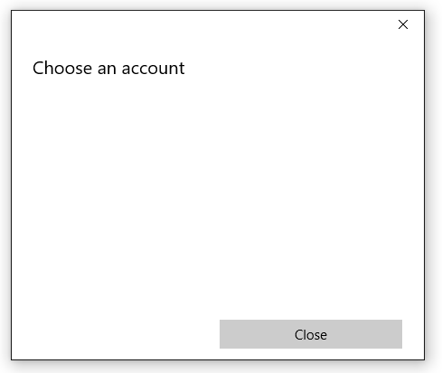
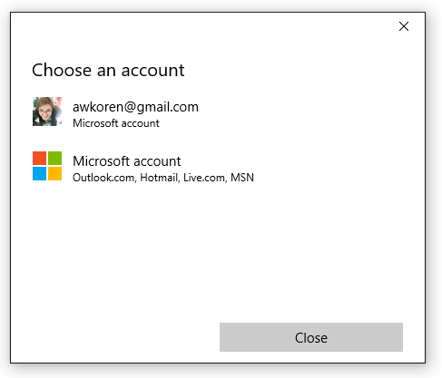

# <a name="connect-to-identity-providers-with-web-account-manager"></a>Connexion à un fournisseur d’identité avec Gestionnaire de compte web

Cet article explique comment afficher la classe AccountsSettingsPane et connecter votre application de plateforme Windows universelle (UWP) à des fournisseurs d’identité externes, tels que Microsoft ou Facebook, à l’aide des nouvelles API du Gestionnaire de comptes web de Windows 10. Vous découvrirez comment demander l’autorisation d’un utilisateur pour utiliser son compte Microsoft, obtenir un jeton d’accès et l’utiliser pour effectuer des opérations de base (par exemple, obtenir des données de profil ou télécharger des fichiers dans OneDrive). Pour obtenir l’autorisation et l’accès utilisateur, les étapes sont similaires quel que soit le fournisseur d’identité, à condition qu’il prenne en charge le Gestionnaire de compte web.

> Remarque : pour obtenir un exemple du code complet, voir l’[exemple WebAccountManagement sur GitHub](http://go.microsoft.com/fwlink/p/?LinkId=620621).

## <a name="get-set-up"></a>Préparation

Pour commencer, créez une nouvelle application vierge dans Visual Studio. 

Ensuite, pour mettre en place la connexion à des fournisseurs d’identité, vous devez associer votre application au Windows Store. Pour ce faire, cliquez avec le bouton droit de la souris sur votre projet, choisissez **Store** > **Associer l’application au Windows Store**, puis suivez les instructions de l’assistant. 

Enfin, créez une interface utilisateur très simple constituée d’un bouton XAML et de deux zones de texte.

```XML
<StackPanel HorizontalAlignment="Center" VerticalAlignment="Center">
    <Button x:Name="LoginButton" Content="Log in" Click="LoginButton_Click" />
    <TextBlock x:Name="UserIdTextBlock"/>
    <TextBlock x:Name="UserNameTextBlock"/>
</StackPanel>
```

Reliez un gestionnaire d’événements à votre bouton dans le code-behind :

```C#
private void LoginButton_Click(object sender, RoutedEventArgs e)
{   
}
```

Pour finir, ajoutez les espaces de noms suivants afin de ne pas avoir à vous soucier ultérieurement des problèmes de référence : 

```C#
using System;
using Windows.Security.Authentication.Web.Core;
using Windows.System;
using Windows.UI.ApplicationSettings;
using Windows.UI.Xaml;
using Windows.UI.Xaml.Controls;
using Windows.Data.Json;
using Windows.UI.Xaml.Navigation;
using Windows.Web.Http;
```

## <a name="show-the-accountsettingspane"></a>Afficher le AccountSettingsPane

Le système fournit une interface utilisateur intégrée permettant de gérer les fournisseurs d’identité et les comptes web, appelée AccountSettingsPane. Vous pouvez l’afficher comme suit :

```C#
private void LoginButton_Click(object sender, RoutedEventArgs e)
{
    AccountsSettingsPane.Show(); 
}
```

Si vous exécutez votre application et cliquez sur le bouton « Se connecter », elle affiche une fenêtre vide. 



Le volet est vide, car le système propose uniquement un interpréteur de commandes de l’interface utilisateur. Il revient au développeur de programmer le remplissage du volet avec les fournisseurs d’identité. 

## <a name="register-for-accountcommandsrequested"></a>S’inscrire à AccountCommandsRequested

Pour ajouter des commandes au volet, il faut tout d’abord s’inscrire au gestionnaire d’événements AccountCommandsRequested. Cela indique au système d’exécuter notre logique de build lorsque l’utilisateur demande à afficher le volet (par exemple, en cliquant sur notre bouton XAML). 

Dans votre code-behind, remplacez les événements OnNavigatedTo et OnNavigatedFrom et ajoutez-y le code suivant : 

```C#
protected override void OnNavigatedTo(NavigationEventArgs e)
{
    AccountsSettingsPane.GetForCurrentView().AccountCommandsRequested += BuildPaneAsync; 
}
```

```C#
protected override void OnNavigatedFrom(NavigationEventArgs e)
{
    AccountsSettingsPane.GetForCurrentView().AccountCommandsRequested -= BuildPaneAsync; 
}
```

Les utilisateurs n’interagissent pas très souvent avec les comptes, ce qui signifie qu’en procédant ainsi pour l’inscription et la désinscription de votre gestionnaire d’événements, vous évitez les fuites de mémoire. De cette façon, votre volet personnalisé est uniquement en mémoire lorsqu’il y a de grandes chances qu’un utilisateur le demande (parce qu’il est sur une page « Paramètres » ou « Connexion », par exemple). 

## <a name="build-the-account-settings-pane"></a>Conception du volet Paramètres du compte

La méthode BuildPaneAsync est appelée chaque fois que le volet AccountSettingsPane s’affiche. C’est ici que nous allons enregistrer le code nécessaire à la personnalisation des commandes affichées dans le volet. 

Commencez par obtenir un report. Cela indique au système qu’il doit retarder l’affichage du volet AccountsSettingsPane jusqu'à ce que sa conception soit terminée.

```C#
private async void BuildPaneAsync(AccountsSettingsPane s,
    AccountsSettingsPaneCommandsRequestedEventArgs e)
{
    var deferral = e.GetDeferral();
        
    deferral.Complete(); 
}
```

Ensuite, obtenez un fournisseur à l’aide de la méthode WebAuthenticationCoreManager.FindAccountProviderAsync. L’URL du fournisseur varie en fonction du fournisseur et figure dans la documentation correspondante. Pour Microsoft Accounts et Azure Active Directory, il s’agit de « https://login.microsoft.com ». 

```C#
private async void BuildPaneAsync(AccountsSettingsPane s,
    AccountsSettingsPaneCommandsRequestedEventArgs e)
{
    var deferral = e.GetDeferral();
        
    var msaProvider = await WebAuthenticationCoreManager.FindAccountProviderAsync(
        "https://login.microsoft.com", "consumers"); 
        
    deferral.Complete(); 
}
```

Notez que nous passons également la chaîne « consumers » au paramètre facultatif *authority*. En effet, Microsoft fournit deux types d’authentification : les comptes Microsoft (MSA) pour les « consommateurs » et Azure Active Directory (AAD) pour les « entreprises ». Le paramètre « consumers » indique que nous voulons l’option MSA. Si vous développez une application d’entreprise, utilisez la chaîne « organizations » à la place.

Enfin, ajoutez le fournisseur à la classe AccountsSettingsPane en créant une nouvelle commande WebAccountProviderCommand comme suit : 

```C#
private async void BuildPaneAsync(AccountsSettingsPane s,
    AccountsSettingsPaneCommandsRequestedEventArgs e)
{
    var deferral = e.GetDeferral();

    var msaProvider = await WebAuthenticationCoreManager.FindAccountProviderAsync(
        "https://login.microsoft.com", "consumers");

    var command = new WebAccountProviderCommand(msaProvider, GetMsaTokenAsync);  

    e.WebAccountProviderCommands.Add(command);

    deferral.Complete(); 
}
```

Notez que la méthode GetMsaToken que nous avons passé à notre nouvelle commande WebAccountProviderCommand n’existe pas encore (nous allons la créer à l’étape suivante). Par conséquent, n’hésitez pas à l’ajouter en tant que méthode vide pour le moment.

Exécutez le code ci-dessus pour que votre volet ressemble à ceci : 



### <a name="request-a-token"></a>Demander un jeton

Une fois que l’option Compte Microsoft s’affiche dans le volet AccountsSettingsPane, nous devons gérer ce qui se produit lorsque l’utilisateur la sélectionne. Nous avons enregistré notre méthode GetMsaToken afin qu’elle se déclenche quand l’utilisateur choisit d’ouvrir une session avec son compte Microsoft. C’est donc ainsi que nous allons obtenir le jeton. 

Pour obtenir un jeton, utilisez la méthode RequestTokenAsync comme suit : 

```C#
private async void GetMsaTokenAsync(WebAccountProviderCommand command)
{
    WebTokenRequest request = new WebTokenRequest(command.WebAccountProvider, "wl.basic");
    WebTokenRequestResult = await WebAuthenticationCoreManager.RequestTokenAsync(request);
}
```

Dans cet exemple, nous passons la chaîne « wl.basic » au paramètre d’étendue. L’étendue représente le type d’informations concernant un utilisateur spécifique que vous demandez au service fournisseur. Certaines étendues donnent uniquement accès aux informations de base sur un utilisateur, comme son nom ou son adresse e-mail. D’autres peuvent donner accès à des informations sensibles, telles que des les photos ou la boîte de réception de l’utilisateur. En règle générale, votre application doit utiliser l’étendue la moins permissive, à moins que notre application nécessite explicitement une autorisation supplémentaire : par exemple, ne demandez pas l’accès aux informations sensibles si votre application n’en a pas absolument besoin. 

Les fournisseurs de services proposeront une documentation dans laquelle les étendues devront être spécifiées pour obtenir des jetons à utiliser avec leurs services. 

* Pour les étendues Office 365 et Outlook.com, consultez [Authentification des API Office 365 et Outlook.com à l’aide du point de terminaison d’authentification v2.0](https://msdn.microsoft.com/office/office365/howto/authenticate-Office-365-APIs-using-v2). 
* Pour OneDrive, consultez [Authentification et connexion OneDrive](https://dev.onedrive.com/auth/msa_oauth.htm#authentication-scopes). 

Si vous développez une application d’entreprise, vous souhaiterez probablement vous connecter à une instance Azure Active Directory (AAD) et utiliser l’API Microsoft Graph plutôt que les services MSA classiques. Dans ce cas, utilisez le code suivant : 

```C#
private async void GetAadTokenAsync(WebAccountProviderCommand command)
{
    string clientId = "your_guid_here"; // Obtain your clientId from the Azure Portal
    WebTokenRequest request = new WebTokenRequest(provider, "User.Read", clientId);
    request.Properties.Add("resource", "https://graph.microsoft.com");
    WebTokenRequestResult = await WebAuthenticationCoreManager.RequestTokenAsync(request);
}
```

Le reste de cet article décrit la suite du scénario MSA, mais le code pour AAD est très similaire. Pour plus d’informations sur AAD/Microsoft Graph, notamment un exemple complet sur GitHub, voir la [documentation Microsoft Graph](https://graph.microsoft.io/docs/platform/get-started).

## <a name="use-the-token"></a>Utiliser le jeton

La méthode RequestTokenAsync renvoie un objet WebTokenRequestResult, qui contient les résultats de votre demande. Si votre demande a abouti, elle contiendra un jeton.  

```C#
private async void GetMsaTokenAsync(WebAccountProviderCommand command)
{
    WebTokenRequest request = new WebTokenRequest(command.WebAccountProvider, "wl.basic");
    WebTokenRequestResult result = await WebAuthenticationCoreManager.RequestTokenAsync(request);
    
    if (result.ResponseStatus == WebTokenRequestStatus.Success)
    {
        string token = result.ResponseData[0].Token; 
    }
}
```

> Remarque : si une erreur est générée lors de la demande d’un jeton, vérifiez que vous avez bien associé votre application à Windows Store, comme décrit à l’étape 1. Votre application ne pourra pas obtenir de jeton si vous avez ignoré cette étape. 

Une fois le jeton en votre possession, vous pouvez l’utiliser pour appeler les API de votre fournisseur. Dans le code ci-dessous, nous allons appeler les API Microsoft Live pour obtenir des informations de base relatives à l’utilisateur et les afficher dans notre interface utilisateur. 

```C#
private async void GetMsaTokenAsync(WebAccountProviderCommand command)
{
    WebTokenRequest request = new WebTokenRequest(command.WebAccountProvider, "wl.basic");
    WebTokenRequestResult result = await WebAuthenticationCoreManager.RequestTokenAsync(request);
    
    if (result.ResponseStatus == WebTokenRequestStatus.Success)
    {
        string token = result.ResponseData[0].Token; 
        
        var restApi = new Uri(@"https://apis.live.net/v5.0/me?access_token=" + token);

        using (var client = new HttpClient())
        {
            var infoResult = await client.GetAsync(restApi);
            string content = await infoResult.Content.ReadAsStringAsync();

            var jsonObject = JsonObject.Parse(content);
            string id = jsonObject["id"].GetString();
            string name = jsonObject["name"].GetString();

            UserIdTextBlock.Text = "Id: " + id; 
            UserNameTextBlock.Text = "Name: " + name;
        }
    }
}
```

La méthode utilisée pour appeler les différentes API REST varie d’un fournisseur à l’autre ; voir la documentation sur les API du fournisseur pour plus d’informations sur l’utilisation de votre jeton. 

## <a name="save-account-state"></a>Enregistrer l’état du compte

Les jetons sont utiles pour obtenir immédiatement des informations relatives à un utilisateur, mais leur durée de validité est généralement très variable : les jetons MSA, par exemple, ne sont valides que pendant quelques heures. Heureusement, vous n’avez pas besoin d’afficher de nouveau le volet AccountsSettingsPane chaque fois qu’un jeton arrive à expiration. Lorsqu’un utilisateur a autorisé une fois votre application, vous pouvez stocker les informations de compte de l’utilisateur pour une utilisation future. 

Pour ce faire, utilisez la classe WebAccount. Une classe WebAccount est renvoyée avec la demande de jeton :

```C#
private async void GetMsaTokenAsync(WebAccountProviderCommand command)
{
    WebTokenRequest request = new WebTokenRequest(command.WebAccountProvider, "wl.basic");
    WebTokenRequestResult result = await WebAuthenticationCoreManager.RequestTokenAsync(request);
    
    if (result.ResponseStatus == WebTokenRequestStatus.Success)
    {
        WebAccount account = result.ResponseData[0].WebAccount; 
    }
}
```

Une fois que vous disposez d’une classe WebAccount, vous pouvez la stocker facilement. Dans l’exemple suivant, nous utilisons LocalSettings : 

```C#
private async void StoreWebAccount(WebAccount account)
{
    ApplicationData.Current.LocalSettings.Values["CurrentUserProviderId"] = account.WebAccountProvider.Id;
    ApplicationData.Current.LocalSettings.Values["CurrentUserId"] = account.Id; 
}
```

Vous pouvez tenter d’obtenir un jeton silencieusement (en arrière-plan) au prochain démarrage de l’application par l’utilisateur en procédant comme suit : 

```C#
private async Task<string> GetTokenSilentlyAsync()
{
    string providerId = ApplicationData.Current.LocalSettings.Values["CurrentUserProviderId"]?.ToString();
    string accountId = ApplicationData.Current.LocalSettings.Values["CurrentUserId"]?.ToString();

    if (null == providerId || null == accountId)
    {
        return null; 
    }

    WebAccountProvider provider = await WebAuthenticationCoreManager.FindAccountProviderAsync(providerId);
    WebAccount account = await WebAuthenticationCoreManager.FindAccountAsync(provider, accountId);

    WebTokenRequest request = new WebTokenRequest(provider, "wl.basic");

    WebTokenRequestResult result = await WebAuthenticationCoreManager.GetTokenSilentlyAsync(request, account);
    if (result.ResponseStatus == WebTokenRequestStatus.UserInteractionRequired)
    {
        // Unable to get a token silently - you'll need to show the UI
        return null; 
    }
    else if (result.ResponseStatus == WebTokenRequestStatus.Success)
    {
        // Success
        return result.ResponseData[0].Token;
    }
    else
    {
        // Other error 
        return null; 
    }
}
```

Dans la mesure où il est très simple d’obtenir un jeton silencieusement, nous vous recommandons d’utiliser ce processus pour actualiser votre jeton entre les sessions, plutôt que de mettre en cache un jeton existant (étant donné que ce jeton peut expirer à tout moment).

Notez que l’exemple ci-dessus couvre uniquement les cas d’échec et de réussite de base. Votre application doit également prendre en compte des scénarios plus inhabituels, comme un utilisateur qui révoque l’autorisation de votre application ou qui supprimer son compte de Windows, par exemple, et les gérer de manière fluide.  

## <a name="log-out-an-account"></a>Se déconnecter d’un compte 

Si vous conservez une classe WebAccount, vous voudrez peut-être fournir une fonctionnalité de déconnexion à vos utilisateurs afin qu’ils puissent jongler entre plusieurs comptes ou simplement dissocier leur compte de votre application. Pour ce faire, commencez par supprimer les comptes enregistrés et les informations sur le fournisseur. Appelez ensuite WebAccount.SignOutAsync() pour vider le cache et invalider des jetons existants dont votre application dispose. 

```C#
private async Task SignOutAccountAsync(WebAccount account)
{
    ApplicationData.Current.LocalSettings.Values.Remove("CurrentUserProviderId");
    ApplicationData.Current.LocalSettings.Values.Remove("CurrentUserId"); 
    account.SignOutAsync(); 
}
```

## <a name="add-providers-that-dont-support-webaccountmanager"></a>Ajouter des fournisseurs qui ne prennent pas en charge WebAccountManager

Si vous souhaitez intégrer l’authentification à votre application à partir d’un service qui ne prend pas en charge WebAccountManager (Google+ ou Twitter, par exemple), vous pouvez ajouter manuellement ce fournisseur à la classe AccountsSettingsPane. Pour ce faire, créez un nouvel objet WebAccountProvider avec vos propres nom et icône .png, puis ajoutez-le à WebAccountProviderCommands. Voici le code stub : 

 ```C#
private async void BuildPaneAsync(AccountsSettingsPane s, AccountsSettingsPaneCommandsRequestedEventArgs e)
{
    // other code here 

    var twitterProvider = new WebAccountProvider("twitter", "Twitter", new Uri(@"ms-appx:///Assets/twitter-auth-icon.png")); 
    var twitterCmd = new WebAccountProviderCommand(twitterProvider, GetTwitterTokenAsync);
    e.WebAccountProviderCommands.Add(twitterCmd);   
    
    // other code here
}

private async void GetTwitterTokenAsync(WebAccountProviderCommand command)
{
    // Manually handle Twitter login here
}

```

Notez que cette action ajoute uniquement une icône au volet AccountsSettingsPane et exécute la méthode que vous indiquez en cas de clic sur l’icône (GetTwitterTokenAsync, dans le cas présent). Vous devez fournir le code qui gère l’authentification réelle. Pour plus d’informations, voir (Service Broker d’authentification Web)[web-authentication-broker], qui fournit des méthodes d’assistance pour l’authentification à l’aide des services REST. 

## <a name="add-a-custom-header"></a>Ajouter un en-tête personnalisé

Vous pouvez personnaliser le volet Paramètres du compte à l’aide de la propriété HeaderText, comme ceci : 

```C#
private async void BuildPaneAsync(AccountsSettingsPane s, AccountsSettingsPaneCommandsRequestedEventArgs e)
{
    // other code here 
    
    args.HeaderText = "MyAwesomeApp works best if you're signed in.";   
    
    // other code here
}
```


Ne développez pas trop le texte de l’en-tête ; il doit rester bref et concis. Si votre processus de connexion est compliqué et que vous avez besoin d’afficher plus d’informations, renvoyez l’utilisateur à une page distincte à l’aide d’un lien personnalisé. 

## <a name="add-custom-links"></a>Ajouter des liens personnalisés

Vous pouvez ajouter des commandes personnalisées à la classe AccountsSettingsPane. Elles apparaissent sous forme de liens sous vos WebAccountProviders pris en charge. Les commandes personnalisées sont parfaites pour les tâches simples sur les comptes d’utilisateurs, telles que l’affichage d’une politique de confidentialité ou l’ouverture d’une page de support pour les utilisateurs rencontrant des difficultés. 

Voici un exemple : 

```C#
private async void BuildPaneAsync(AccountsSettingsPane s, AccountsSettingsPaneCommandsRequestedEventArgs e)
{
    // other code here 
    
    var settingsCmd = new SettingsCommand(
        "settings_privacy", 
        "Privacy policy", 
        async (x) => await Launcher.LaunchUriAsync(new Uri(@"https://privacy.microsoft.com/en-US/"))); 

    e.Commands.Add(settingsCmd); 
    
    // other code here
}
```


En théorie, vous pouvez utiliser les commandes de paramètres pour tout. Toutefois, nous vous recommandons d’en limiter l’utilisation aux scénarios intuitifs liés aux comptes, tels que ceux décrits ci-dessus. 

## <a name="see-also"></a>Voir également

[Espace de noms Windows.Security.Authentication.Web.Core](https://msdn.microsoft.com/library/windows/apps/windows.security.authentication.web.core.aspx)

[Espace de noms Windows.Security.Credentials](https://msdn.microsoft.com/library/windows/apps/windows.security.credentials.aspx)

[AccountsSettingsPane](https://msdn.microsoft.com/library/windows/apps/windows.ui.applicationsettings.accountssettingspane)

[Service Broker d’authentification web](web-authentication-broker.md)

[Exemple de WebAccountManagement](http://go.microsoft.com/fwlink/p/?LinkId=620621)


<!--HONumber=Dec16_HO5-->


