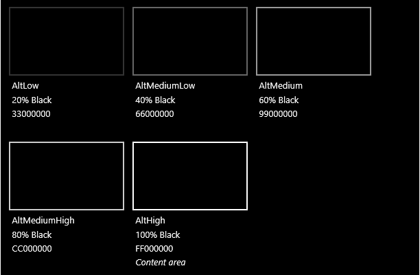
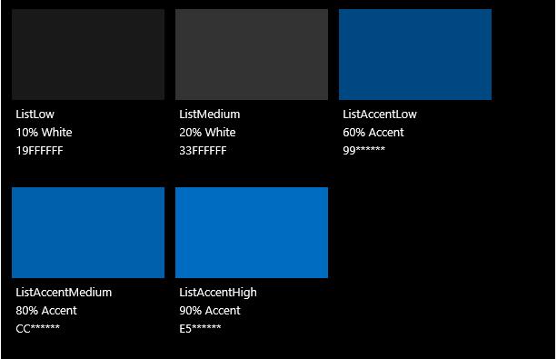

# Color

Color provides intuitive way of finding through an app's various levels of information and serves as a crucial tool for reinforcing the interaction model.

In Windows, color is also personal. Users can choose a color and a light or dark theme to be reflected throughout their experience.

## Accent color

The user can pick a single color called the accent from *Settings > Personalization > Colors*. They have their choice from a curated set of 48 color swatches, except on Xbox which has a palette of 21 TV-safe colors.

<!-- Alternate version for the dev center. Need to add hex values. -->
 Default accent colors

 Xbox accent colors


When users choose an accent color, it appears as part of their system theme. The areas affected are Start, Taskbar, window chrome, selected interaction states and hyperlinks within [common controls](https://dev.windows.com/design/controls-patterns). Each app can further incorporate the accent color through their typography, backgrounds, and interactions—or override it to preserve their specific branding.

## Color palette building blocks

Once an accent color is selected, light and dark shades of the accent color are created based on HSB values of color luminosity. Apps can use shade variations to create visual hierarchy and to provide an indication of interaction.

By default, hyperlinks will use the user's accent color. If the page background is a similar color, you can choose to assign a lighter (or darker) shade of accent to the hyperlinks for better contrast.

 The various light/dark shades of the default accent color.

 An example of how color logic gets applied to a design spec.

**Note**&nbsp;&nbsp;In XAML, the primary accent color is exposed as a [theme resource](https://msdn.microsoft.com/library/windows/apps/Mt187274.aspx) named `SystemAccentColor`. The shades are available as `SystemAccentColorLight3`, `SystemAccentColorLight2`, `SystemAccentColorLight1`, `SystemAccentColorDark1`, `SystemAccentColorDark2`, and `SystemAccentColorDark3`. Also available programmatically via [UISettings.GetColorValue](https://msdn.microsoft.com/library/windows/apps/windows.ui.viewmanagement.uisettings.getcolorvalue.aspx) and the [UIColorType](https://msdn.microsoft.com/library/windows/apps/windows.ui.viewmanagement.uicolortype.aspx) enum.

## Color theming

The user may also choose between a light or dark theme for the system. Some apps choose to change their theme based on the user’s preference, while others opt out.

Apps using light theme are for scenarios involving productivity apps. Examples would be the suite of apps available with Microsoft Office. Light theme affords the ease of reading long lengths of text in conjunction with prolonged periods of time-at-task.

Dark theme allows more visible contrast of content for apps that are media centric or scenarios where users are presented with an abundance of videos or imagery. In these scenarios, reading is not necessarily the primary task, though a movie watching experience might be, and shown under low-light ambient conditions.

If your app doesn’t quite fit either of these descriptions, consider following the system theme to let the user decide what's right for them.

To make designing for themes easier, Windows provides an additional color palette that automatically adapts to the theme.

<!-- OP version -->
### Light theme
#### Base

#### Alt

#### List

#### Chrome

### Dark theme
#### Base

#### Alt

#### List

#### Chrome


## Changing the theme

You can change themes easily by changing the **RequestedTheme** property in your App.xaml:

```XAML
<Application
    x:Class="App9.App"
    xmlns="http://schemas.microsoft.com/winfx/2006/xaml/presentation"
    xmlns:x="http://schemas.microsoft.com/winfx/2006/xaml"
    xmlns:local="using:App9"
    RequestedTheme="Dark">

</Application>
```

Removing the **RequestedTheme** means that your application will honor the user’s app mode settings, and they will be able to choose to view your app in either the dark or light theme. 

Make sure that you take the theme into consideration when creating your app, as the theme has a big impact on the look of your app.

## Accessibility

Our palette is optimized for screen usage. We recommend maintaining a contrast ratio for text of 4.5:1 against the background for optimal readability. There are many free tools available to test whether or not your colors pass, like [Contrast Ratio](http://leaverou.github.io/contrast-ratio/).

## Related articles

* [XAML Styles](https://msdn.microsoft.com/windows/uwp/controls-and-patterns/xaml-theme-resources)
* [XAML Theme Resources](https://msdn.microsoft.com/windows/uwp/controls-and-patterns/xaml-theme-resources)


<!--HONumber=Aug16_HO3-->


