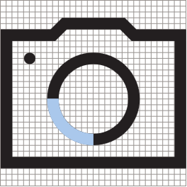
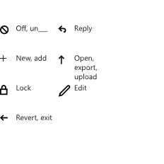

# Icônes pour les applications UWP

Des icônes efficaces s’harmonisent avec la typographie et avec le reste du langage de conception. Elles ne mélangent pas les métaphores et communiquent uniquement les informations nécessaires, le plus rapidement et simplement possible. 

## Gammes de tailles de mise à l’échelle linéaire 

<table>
    <tr> 
        <td>16 px x 16 px</td>
        <td>24 px x 24 px</td>
        <td>32 px x 32 px</td>
        <td>48 px x 48 px</td>
    </tr>
    <tr> 
        <td></td>
        <td></td>
        <td></td>
        <td></td>
    </tr>
</table>

## Formes courantes

Les icônes doivent généralement optimiser l’espace dont elles disposent et n’inclure qu’un remplissage minime. Ces formes fournissent des points de départ pour le dimensionnement des formes de base. 

Utilisez la forme qui correspond à l’orientation de l’icône et créez votre composition autour de ces paramètres de base. Les icônes ne doivent pas nécessairement remplir la forme ou tenir entièrement à l’intérieur de cette dernière, et peuvent être ajustées selon les besoins pour garantir un équilibre optimal. 

<table>
    <tr>
        <td>Cercle<td>
        <td>Carré</td>
        <td>Triangle</td>
    </tr>
    <tr>
        <td><td>
        <td></td>
        <td></td>
    </tr>
        <tr>
        <td>Rectangle horizontal<td>
        <td colspan="2">Rectangle vertical</td>        
        </tr>
    <tr>
        <td><td>
        <td colspan="2"></td>
         
    </tr>

</table>

## Angles

Outre l’utilisation d’une grille et d’une épaisseur de trait identiques, les icônes sont construites avec des éléments communs. 

L’utilisation de ces seuls angles lors de la création de formes garantit la cohérence et le rendu adéquat de l’ensemble de nos icônes. 

Vous pouvez combiner, joindre, faire pivoter et refléter ces lignes lorsque vous créez des icônes. 

<table>
    <tr>
        <td>**1:1** 45°</td>
        <td>**1:2** 26,57° (vertical) 63,43° (horizontal)</td>
        <td>**1:3** 18,43° (vertical) 71,57° (horizontal)</td>
        <td>**1:4** 14,04° (vertical) 75,96° (horizontal)</td>
    </tr>
    <tr>
        
        <td></td>
        <td></td>
        <td></td>
        <td></td>
    </tr>  
</table>

En voici quelques exemples :

<table>
    <tr>
        <td></td>
        <td></td>
        <td></td>
        <td></td>
    </tr>
</table>

## Courbes

Les traits courbes sont créés à partir de sections d’un cercle complet et ne doivent pas être inclinés, sauf s’ils ont besoin d’être alignés sur la grille de pixels. 

<table>
    <tr>
        <td>1/4 de cercle</td>
        <td>1/8 de cercle</td>
    </tr>
    <tr>
        <td></td>
        <td></td>
    </tr>
    <tr>
        <td></td>
        <td></td>
    </tr>    
</table>

## Construction géométrique

Nous vous recommandons de n’utiliser que des formes géométriques pures lorsque vous construisez des icônes.

## Formes remplies 

Les icônes peuvent contenir des formes remplies si nécessaire, mais elles ne doivent pas dépasser 4 px pour une grille de 32 px × 32px. La taille des cercles remplis ne doit pas être supérieure à 6 px x 6 px. 

## Badges

Un « badge » est un terme générique désignant un élément ajouté à une icône non destiné à être intégré à l’élément d’icône de base. Ces éléments véhiculent généralement d’autres informations concernant l’icône, comme un état ou une action. Les autres termes couramment employés pour désigner ce type d’élément sont : superposition, annotation ou modificateur. 

Les badges d’état utilisent un objet coloré rempli surmontant l’icône, tandis que les badges d’action sont intégrés à l’icône avec le même style monochrome et la même épaisseur de trait.

<table>
<tr>
    <td>Badges d’état courants</td>
    <td>Badges d’action courants</td>
</tr>
<tr>
    <td></td>
    <td></td>
</tr>
</table>

### Couleur de badge 

L’utilisation d’une couleur de badge ne doit être utilisée que pour communiquer l’état d’une icône. Les couleurs utilisées dans le badge d’état transmettent des messages émotionnels spécifiques à l’utilisateur. 

<table>
<tr><td>Vert : #128B44</td><td>Bleu : #2C71B9</td><td>Jaune : #FDC214</td></tr>
<tr><td>Positif : effectué, terminé </td><td>Neutre : aide, notification </td><td>Mise en garde : alerte, avertissement </td></tr>
<tr><td></td><td></td>
<td></td></tr>
</table>

### Position de badge

Par défaut, un badge d’état ou d’action est positionné dans le coin inférieur droit. N’utilisez d’autres positions que si la conception n’autorise pas ce positionnement par défaut. 

### Dimensionnement de badge

Les badges doivent présenter une taille de 10 à 18 px sur une grille de 32 px × 32 px. 

## Articles connexes

* [Recommandations en matière de ressources de vignette et d’icône](../controls-and-patterns/tiles-and-notifications-app-assets.md)

<!--HONumber=May16_HO2-->

