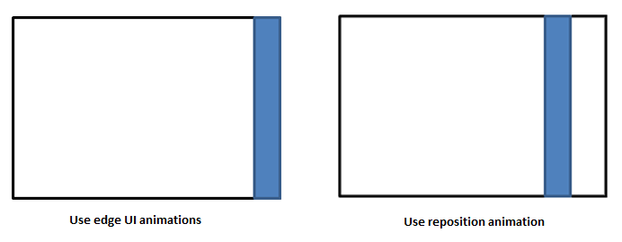

# Animations latérales de l’interface utilisateur

Les animations latérales affichent ou masquent l’interface utilisateur qui part du bord de l’écran. L’utilisateur ou l’application peut initier les actions d’affichage ou de masquage. L’interface utilisateur peut se superposer à l’application ou intégrer sa surface principale. Si l’élément d’interface utilisateur fait partie de la surface principale, un redimensionnement du reste de l’application peut être nécessaire pour l’accueillir.

**API importantes**

-   [**Classe EdgeUIThemeTransition**](https://msdn.microsoft.com/library/windows/apps/hh702324)

## Pratiques conseillées et déconseillées

-   Utilisez les animations latérales de l’interface utilisateur pour afficher ou masquer une barre de messages ou une barre d’erreur qui n’occupe pas beaucoup d’espace à l’écran.
-   Faites appel aux animations de volets pour afficher un élément d’interface utilisateur qui glisse et occupe un espace suffisant sur l’écran, comme c’est le cas pour le volet de tâches ou un clavier personnalisé.
-   Faites apparaître l’élément d’interface en le faisant glisser à partir du bord auquel il doit venir s’attacher.
-   Faites-le disparaître en le faisant glisser vers le bord dont il provient.
-   Si le contenu de l’application doit être redimensionné à la suite du glissement de l’élément d’interface utilisateur, utilisez des animations en fondu pour le redimensionnement.
    -   Si l’élément d’interface utilisateur apparaît, utilisez l’animation en fondu après l’animation latérale de l’interface utilisateur ou des volets.
    -   Si l’élément d’interface utilisateur disparaît, utilisez l’animation en fondu en même temps que l’animation latérale de l’interface utilisateur ou des volets.
-   Ne mettez pas en application ces animations pour les notifications. Les notifications ne doivent pas être hébergées au sein d’une interface utilisateur latérale.
-   N’appliquez pas les animations latérales de l’interface utilisateur ou des volets à un conteneur ou contrôle d’interface utilisateur qui ne se trouve pas au bord de l’écran. Ces animations  ne servent que pour l’affichage, le redimensionnement et la fermeture d’éléments d’interface utilisateur aux bords de l’écran. Pour déplacer d’autres types d’interface utilisateur, utilisez les animations de repositionnement.

    

## Articles connexes

**Pour les développeurs (XAML)**
* [Vue d’ensemble des animations](https://msdn.microsoft.com/library/windows/apps/mt187350)
* [Animation latérale de l’interface utilisateur](https://msdn.microsoft.com/library/windows/apps/xaml/jj649428)
* [Démarrage rapide: animation de votre interface utilisateur avec des animations de la bibliothèque](https://msdn.microsoft.com/library/windows/apps/xaml/hh452703)
* [**Classe EdgeUIThemeTransition**](https://msdn.microsoft.com/library/windows/apps/hh702324)
* [**Classe PaneThemeTransition**](https://msdn.microsoft.com/library/windows/apps/hh969160)
* [Animation de fondus](https://msdn.microsoft.com/library/windows/apps/xaml/jj649429)
* [Animation de repositionnements](https://msdn.microsoft.com/library/windows/apps/xaml/jj649434)

 

 

<!--HONumber=Jun16_HO4-->

