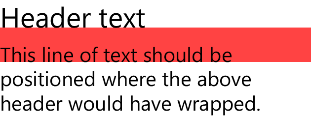
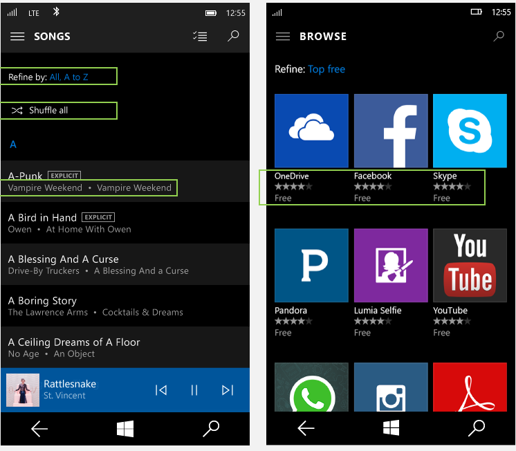

# <a name="typography"></a>Typographie

<link rel="stylesheet" href="https://az835927.vo.msecnd.net/sites/uwp/Resources/css/custom.css"> 

En tant que représentation visuelle du langage, la typographie doit avant tout apporter de la clarté. Son style doit toujours être aligné sur cet objectif. Mais la typographie joue également un rôle important en tant que composant de la disposition, grâce à son puissant effet sur la densité et la complexité de la conception, ainsi que sur l’expérience de l’utilisateur concernant cette conception.

## <a name="typeface"></a>Police

Nous avons choisi d’utiliser la police Segoe UI dans toutes les conceptions numériques Microsoft. La police Segoe UI offre un large éventail de caractères et est conçue pour conserver une lisibilité optimale, quelles que soient les tailles et les densités en pixels. Cette police se caractérise par une esthétique nette, légère et aérée en parfaite harmonie avec le contenu du système.


## <a name="weights"></a>Épaisseur

Notre approche de la typographie est axée sur la simplicité et sur l’efficacité. Nous choisissons d’utiliser une seule police, un minimum d’épaisseurs et de tailles, ainsi qu’une hiérarchie claire. Le positionnement et l’alignement respectent le style par défaut de la langue concernée. En anglais, les caractères se déroulent de gauche à droite et de haut en bas. Les relations entre le texte et les images sont claires et simples.


## <a name="line-spacing"></a>Interligne


L’interligne doit être calculé comme étant égal à 125% de la taille de police, arrondi au plus proche multiple de quatre si nécessaire. Par exemple, pour une police Segoe UI 15px, l’interligne sera de 125% de 15px, autrement dit 18,75px. Nous vous recommandons d’arrondir cette valeur et donc de définir la hauteur de ligne sur 20px pour rester sur la grille de 4px. Cette technique garantit une bonne expérience de lecture et un espace adéquat pour les signes diacritiques. Pour découvrir des exemples spécifiques, voir la section «Gamme de caractères» ci-dessous.

Lorsque vous empilez une grande taille de caractère sur une taille de caractère plus petite, la distance entre la dernière ligne de base de la taille de caractère la plus grande et la première ligne de base de la taille de caractère la plus petite doit être égale à la hauteur de ligne de la taille de caractère la plus grande.



En XAML, cette opération est effectuée par l’empilement de deux éléments [TextBlock](https://msdn.microsoft.com/en-us/library/windows/apps/windows.ui.xaml.controls.textblock.aspx) et par la définition de la marge appropriée.

```xaml
<StackPanel Width="200">
    <!-- Setting a bottom margin of 3px on the header
         puts the baseline of the body text exactly 24px
         below the baseline of the header. 24px is the
         recommended line height for a 20px font size,
         which is what’s set in SubtitleTextBlockStyle.
         The bottom margin will be different for
         different font size pairings. -->
    <TextBlock
        Style="{StaticResource SubtitleTextBlockStyle}"
        Margin="0,0,0,3"
        Text="Header text" />
    <TextBlock
        Style="{StaticResource BodyTextBlockStyle}"
        TextWrapping="Wrap"
        Text="This line of text should be positioned where the above header would have wrapped." />
</StackPanel>
```


<div class="side-by-side">
<div class="side-by-side-content">
  <div class="side-by-side-content-left">
<h2>Crénage et interlettrage</h2>

Segoe est une police proche de l’écriture humaine, dotée d’une apparence douce et conviviale et de formes ouvertes organiques reposant sur du texte manuscrit. Pour optimiser la lisibilité de cette police et pour en conserver l’intégrité humaniste, il convient d’attribuer des valeurs spécifiques à ses paramètres de crénage et d’interlettrage.

Le crénage doit être défini sur «metrics», et l’interlettrage doit présenter la valeur «0».
  </div>
  <div class="side-by-side-content-right">
<h2>Espacement entre les mots et entre les lettres</h2>

Comme pour le crénage et l’interlettrage, les paramètres d’espacement entre les mots et entre les lettres utilisent des valeurs spécifiques pour optimiser la lisibilité et l’intégrité humaniste de la police.

L’espacement entre les mots est toujours de 100% par défaut, et l’espacement entre les lettres doit être défini sur «0».
  </div>
</div>
</div>
<div class="side-by-side">
<div class="side-by-side-content">
  <div class="side-by-side-content-left">
  
  </div>
  <div class="side-by-side-content-right">
 
  </div>
</div>
</div>


>[!NOTE]
>Dans un contrôle de texteXAML, utilisez [Typography.Kerning](https://msdn.microsoft.com/library/windows/apps/windows.ui.xaml.documents.typography.kerning.aspx) et [FontStretch](https://docs.microsoft.com/uwp/api/Windows.UI.Xaml.Controls.Control#Windows_UI_Xaml_Controls_Control_FontStretch) pour contrôler le crénage et l’interlettrage, respectivement. Par défaut, Typography.Kerning est défini sur «true», tandis que FontStretch est défini sur «Normal»; il s’agit des valeurs recommandées.

<div class="side-by-side">
<div class="side-by-side-content">
  <div class="side-by-side-content-left">
<h2>Alignement</h2>

En règle générale, nous recommandons que les éléments visuels et les colonnes de caractères soient alignés à gauche. Dans la plupart des cas, cette approche d’alignement à gauche et de non-alignement à droite garantit un ancrage cohérent du contenu et une disposition uniforme. 
  </div>
  <div class="side-by-side-content-right">
<h2>Fins de ligne</h2>

Lorsque la typographie n’est pas positionnée comme étant alignée à gauche et non alignée à droite, essayez de garantir des fins de ligne égales et d’éviter la coupure de mots.
  </div>
</div>
</div>

<div class="side-by-side">
<div class="side-by-side-content">
  <div class="side-by-side-content-left">
  
  </div>
  <div class="side-by-side-content-right">
 
  </div>
</div>
</div>


## <a name="paragraphs"></a>Paragraphes

Pour que les bords de colonne soient alignés, les paragraphes doivent être signalés par un saut de ligne sans retrait.


## <a name="character-count"></a>Nombre de caractères

Si une ligne est trop courte, l’œil devra effectuer de trop fréquents déplacements vers la gauche et la droite, ce qui viendra casser le rythme du lecteur. Dans la mesure du possible, il convient de créer des lignes de 50 à 60caractères afin de faciliter la lecture.

La police Segoe UI offre un large éventail de caractères et est conçue pour conserver une lisibilité optimale dans les tailles de caractères petites et grandes et dans les densités en pixels faibles et élevées. L’utilisation du nombre optimal de lettres dans une ligne de colonne de texte garantit une bonne lisibilité dans une application.

Les lignes trop longues fatiguent l’œil et risquent de désorienter l’utilisateur. Les lignes trop courtes imposent de trop fréquents déplacements à l’œil du lecteur et peuvent provoquer une fatigue oculaire.


## <a name="hanging-text-alignment"></a>Alignement du texte en suspension

L’alignement horizontal d’icônes avec du texte peut être géré de différentes façons selon la taille des icônes et la quantité de texte. Lorsque le texte, composé d’une ou de plusieurs lignes, tient dans la hauteur de l’icône, le texte doit être centré verticalement.

Lorsque la hauteur du texte dépasse celle de l’icône, la première ligne de texte doit être alignée verticalement, et le texte supplémentaire doit se dérouler naturellement sous cette ligne. Si vous utilisez des caractères en majuscules et des jambages supérieurs et inférieurs, prenez soin d’observer les mêmes consignes d’alignement.


>[!NOTE]
>La propriété [TextBlock.TextLineBounds](https://msdn.microsoft.com/en-us/library/windows/apps/windows.ui.xaml.controls.textblock.textlinebounds.aspx) du codeXAML fournit l’accès aux mesures de police de base et de hauteur de majuscule. Elle peut être utilisée pour les types de textes centrés verticalement ou alignés vers le haut.

## <a name="clipping-and-ellipses"></a>Détourage et ellipses

Choisissez le détourage par défaut: supposez que le texte fera l’objet d’un retour automatique à la ligne, sauf en cas d’indication contraire. Si vous utilisez du texte sans retour automatique à la ligne, nous vous recommandons de recourir au détourage plutôt qu’à des ellipses. Le détourage peut survenir au niveau du bord du conteneur, du bord de l’appareil, du bord d’une barre de défilement, etc.

Exceptions: pour les conteneurs qui sont pas clairement définis (par exemple, sans couleur d’arrière-plan distinctive), il est possible de définir que le texte sans retour automatique à la ligne doit utiliser l’ellipse («…»).


## <a name="type-ramp"></a>Gamme de caractères
La gamme de types établit une relation fondamentale entre les titres et le corps du texte et garantit une hiérarchie claire et compréhensible entre les différents niveaux. Cette hiérarchie crée une structure qui permet aux utilisateurs de parcourir aisément une communication écrite.

<div class="uwpd-image-with-caption">
    
    <div>Toutes les tailles sont mesurées en pixels effectifs. Pour plus d’informations, voir [Présentation de la conception des applications UWP](../layout/design-and-ui-intro.md).</div>
</div>

>[!NOTE]
>La plupart des niveaux de la gamme sont disponibles sous forme de [ressources statiques](https://msdn.microsoft.com/en-us/library/windows/apps/Mt187274.aspx#the_xaml_type_ramp) XAML qui suivent la convention d’affectation de noms `*TextBlockStyle` (par exemple, `HeaderTextBlockStyle`).


<!--
<div class="microsoft-internal-note">
SubtitleAlt, BaseAlt, and CaptionAlt are not currently included. You can create the styles in your own app following the code snippets in the above link. Also note that XAML does not currently match the line height exactly.
</div>
-->


## <a name="primary-and-secondary-text"></a>Texte principal et secondaire

Si vous souhaitez créer une hiérarchie supplémentaire par rapport à celle de la gamme, définissez un texte secondaire avec une opacité de 60%. Dans la [palette de thèmes de couleur](color.md#color-theming), vous utiliseriez le thème BaseMedium. Le texte principal doit toujours présenter une opacité de 100%, correspondant au thème BaseHigh.

<!-- Need new images

Recommended use of SubtitleAlt. Also note the primary and secondary text usage in list items.


Recommended use of CaptionAlt.
-->

## <a name="all-caps-titles"></a>Titres tout en majuscules

Certains titres de page doivent apparaître TOUT EN MAJUSCULES pour ajouter encore une autre dimension hiérarchique. Ces titres doivent utiliser BaseAlt avec un espacement des caractères de 75millièmes d’em. Ce traitement peut également être utilisé pour faciliter la navigation dans l’application.

Toutefois, dans certaines langues, les noms propres changent de signification lorsqu’ils sont écrits en majuscules ; par conséquent, les titres de page reposant sur des noms ou des entrées utilisateur ne doivent *pas* être convertis intégralement en majuscules.


<!-- Need new images

Green shows where all caps should be used. Red shows where it should not.
-->

## <a name="dos-and-donts"></a>À faire et à ne pas faire
* Utilisez Body pour la plus grande partie du texte.
* Utilisez Base pour les titres lorsque l’espace est restreint.
* Incorporez SubtitleAlt pour créer un contraste et une hiérarchie en mettant en évidence le contenu de premier niveau.
* N’utilisez pas Caption pour les chaînes longues ou pour une action principale.
* N’utilisez pas Header ou Subheader si le texte doit faire l’objet d’un retour automatique à la ligne.
* Ne combinez pas Subtitle et SubtitleAlt sur une même page.


## <a name="related-articles"></a>Articles associés

* [Contrôles de texte](../controls-and-patterns/text-controls.md)
* [Polices](fonts.md)
* [Icônes Segoe MDL2](segoe-ui-symbol-font.md)
