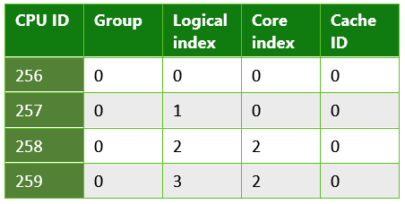

# <a name="cpusets-for-game-development"></a>API CPUSets pour le développement de jeux

## <a name="introduction"></a>Introduction

La plateformeWindows universelle (UWP) est au cœur d’une large gamme d’appareils électroniques grand public. De ce fait, elle nécessite une API à usage général qui permet de répondre aux besoins de tous les types d’applications, des jeux aux applications incorporées, en passant par les logiciels d’entreprise exécutés sur des serveurs. En tirant parti des informations pertinentes fournies par l’API, vous pouvez garantir que votre jeu s’exécute de manière optimale sur n’importe quel composant matériel.

## <a name="cpusets-api"></a>APICPUSets

L’API CPUSets vous permet de contrôler les jeux de processeurs disponibles pour la planification de threads. Deux fonctions sont disponibles pour déterminer à quel emplacement les threads sont planifiés:
- **SetProcessDefaultCpuSets**: cette fonction peut être utilisée pour spécifier sur quels jeux de processeurs les nouveaux threads peuvent être exécutés, s’ils ne sont pas affectés à des jeux de processeurs spécifiques.
- **SetThreadSelectedCpuSets**: cette fonction vous permet de limiter le nombre de jeux de processeurs sur lequel un thread spécifique peut s’exécuter.

Si la fonction **SetProcessDefaultCpuSets** n’est pas utilisée, les nouveaux threads peuvent être planifiés sur n’importe quel jeu de processeurs disponible pour votre processus. Cette section décrit les concepts de base de l’APICPUSets.

### <a name="getsystemcpusetinformation"></a>GetSystemCpuSetInformation

La première API utilisée pour recueillir des informations est la fonction **GetSystemCpuSetInformation**. Cette fonction fournit des informations dans un tableau d’objets **SYSTEM_CPU_SET_INFORMATION**, proposés par code de titre. La mémoire de la destination doit être allouée par le code du jeu; sa taille est déterminée par la fonction **GetSystemCpuSetInformation** elle-même. Cela nécessite deux appels à la fonction **GetSystemCpuSetInformation**, comme illustré dans l’exemple suivant.

```
unsigned long size;
HANDLE curProc = GetCurrentProcess();
GetSystemCpuSetInformation(nullptr, 0, &size, curProc, 0);

std::unique_ptr<uint8_t[]> buffer(new uint8_t[size]);

PSYSTEM_CPU_SET_INFORMATION cpuSets = reinterpret_cast<PSYSTEM_CPU_SET_INFORMATION>(buffer.get());
  
GetSystemCpuSetInformation(cpuSets, size, &size, curProc, 0);
```

Chaque instance **SYSTEM_CPU_SET_INFORMATION** renvoyée contient des informations sur une unité de traitement unique, également appelée «jeu de processeurs». Cela ne signifie pas forcément qu’elle représente un seul composant matériel physique. Sur les UC qui exploitent l’hyperthreading, plusieurs cœurs logiques s’exécutent sur un seul cœur de traitement physique. La planification de plusieurs threads sur différents cœurs logiques résidant sur le même cœur physique permet une optimisation des ressources au niveau du matériel qui, dans le cas contraire, nécessiterait des tâches supplémentaires au niveau du noyau. Deux threads planifiés sur des cœurs logiques distincts situés sur le même cœur physique doivent se partager le temps processeur, mais s’exécutent plus efficacement que s’ils étaient planifiés pour fonctionner sur le même cœur logique.

### <a name="systemcpusetinformation"></a>SYSTEM_CPU_SET_INFORMATION

Les informations contenues dans chaque instance de cette structure de données renvoyée par la fonction **GetSystemCpuSetInformation** contiennentt des informations sur une unité de traitement unique sur laquelle l’exécution de threads peut être planifiée. Étant donné la portée possible des appareils cibles, une grande partie des informations de la structure de données **SYSTEM_CPU_SET_INFORMATION** peut ne pas être applicable pour le développement de jeux. Le tableau1 fournit une explication sur les membres de données qui sont utiles pour le développement de jeux.

 **Tableau1. Membres de données utiles pour le développement de jeux.**

| Nom du membre  | Type de données | Description |
| ------------- | ------------- | ------------- |
| Type  | CPU_SET_INFORMATION_TYPE  | Type des informations dans la structure. Si la valeur de ce paramètre n’est pas **CpuSetInformation**, il doit être ignoré.  |
| ID  | unsigned long  | ID du jeu de processeurs spécifié. Il s’agit de l’ID qui doit être utilisé avec les fonctions du jeu de processeurs, comme **SetThreadSelectedCpuSets**.  |
| Group  | unsigned short  | Spécifie le groupe de processeurs du jeu de processeurs. Les groupes de processeurs permettent à un PC de disposer de plus de 64cœurs logiques et rendent possible l’échange à chaud des UC alors que le système est en cours d’exécution. Il est rare de rencontrer un PC qui n’est pas un serveur disposant de plusieurs groupes. Sauf si vous écrivez des applications destinées à s’exécuter sur des serveurs de grandes tailles ou batteries de serveurs, il est préférable d’utiliser des jeux de processeurs dans un groupe unique, car la plupart des PC grand public ne possèdent qu’un seul groupe de processeurs. Toutes les autres valeurs de cette structure portent sur le groupe.  |
| LogicalProcessorIndex  | unsigned char  | Index relatif au groupe du jeu de processeurs.  |
| CoreIndex  | unsigned char  | Index relatif au groupe du cœur de processeur physique dans lequel se trouve le jeu de processeurs.  |
| LastLevelCacheIndex  | unsigned char  | Index relatif au groupe du dernier cache associé à ce jeu de processeurs. Il s’agit du cache le plus lent, sauf si le système utilise des nœudsNUMA; en général, c’est le cacheL2 ou L3.  |

<br />

Les autres membres de données fournissent des informations qui ont peu de chances de décrire les UC des PC (ou d’autres appareils) grand public et, de ce fait, d’être utiles. Les informations fournies par les données renvoyées peuvent alors être utilisées pour organiser les threads de différentes manières. La rubrique [Remarques relatives au développement de jeux](#considerations-for-game-development) de ce livre blanc présente différentes manières de tirer parti de ces données pour optimiser l’allocation de threads.

Voici quelques exemples du type d’informations collectées à partir des applicationsUWP qui s’exécutent sur différentes sortes de composants matériels.

**Tableau2. Informations renvoyées à partir d’une applicationUWP s’exécutant sur un appareilMicrosoftLumia950. Voici un exemple de système doté de plusieurs caches de dernier niveau. L’appareil Lumia950 propose un processus Qualcomm Snapdragon 808 contenant une UC ARMCortexA57 double cœur et une UC ARMCortexA53 à quatre cœurs.**

  

**Tableau3. Informations renvoyées à partir d’une applicationUWP s’exécutant sur un PC classique. Voici un exemple de système qui utilise l’hyperthreading; chaque cœur physique est doté de deux cœurs logiques sur lesquels les threads peuvent être planifiés. Dans ce cas, le système contient une UC IntelXeonCPUE5-2620.**

  

**Tableau4. Informations renvoyées à partir d’une applicationUWP s’exécutant sur un appareilMicrosoft Surface Pro4 à quatre cœurs. Ce système dispose d’une UC IntelCorei5-6300.**

  

### <a name="setthreadselectedcpusets"></a>SetThreadSelectedCpuSets

Les informations sur les jeux de processeurs sont désormais disponibles. Vous pouvez donc les utiliser pour organiser les threads. Le handle d’un thread créé avec l’élément **CreateThread** est passé à cette fonction avec un tableau des ID des jeux de processeurs sur lesquels le thread peut être planifié. Le code suivant illustre un exemple de syntaxe.

```
HANDLE audioHandle = CreateThread(nullptr, 0, AudioThread, nullptr, 0, nullptr);
unsigned long cores [] = { cpuSets[0].CpuSet.Id, cpuSets[1].CpuSet.Id };
SetThreadSelectedCpuSets(audioHandle, cores, 2);
```
Dans cet exemple, un thread est créé d’après une fonction déclarée en tant qu’élément **AudioThread**. La planification de ce thread est ensuite autorisée sur l’un des deux jeux de processeurs. La propriété du thread du jeu de processeurs n’est pas exclusive. Les threads créés sans être verrouillés sur un jeu de processeurs spécifique peuvent monopoliser le temps de l’élément **AudioThread**. De même, d’autres threads créés peuvent ultérieurement être verrouillés sur l’un ou l’autre des jeux de processeurs.

### <a name="setprocessdefaultcpusets"></a>SetProcessDefaultCpuSets

L’inverse de l’élément **SetThreadSelectedCpuSets** est **SetProcessDefaultCpuSets**. Lorsque des threads sont créés, ils n’ont pas besoin d’être verrouillés dans certains jeux de processeurs. Si vous ne souhaitez pas que ces threads s’exécutent sur des jeux de processeurs spécifiques (ceux qu’utilise votre thread de restitution ou thread audio, par exemple), vous pouvez utiliser cette fonction pour spécifier sur quels cœurs la planification est autorisée.

## <a name="considerations-for-game-development"></a>Remarques relatives au développement de jeux

Comme nous l’avons vu, l’API CPUSets fournit un grand nombre d’informations et offre une certaine flexibilité en matière de planification des threads. Pour savoir comment utiliser ces données dans le cadre de scénarios classiques, il est préférable de choisir une approche descendante plutôt qu’ascendante.

### <a name="working-with-time-critical-threads-and-hyperthreading"></a>Utilisation de l’hyperthreading et de threads soumis à des contraintes de temps

Cette méthode est efficace si votre jeu possède quelques threads qui doivent être exécutés en temps réel, ainsi que d’autres threads de travail qui nécessitent relativement peu de tempsUC. Certaines tâches, comme la lecture de morceaux de musique en arrière-plan, doivent s’exécuter sans interruption pour assurer une expérience de jeu optimale. Il suffit qu’un thread audio soit privé d’une seule image pour que le jeu rencontre parfois des problèmes d’affichage ou techniques. Il est donc impératif que ce thread reçoive la quantité requise de tempsCPU pour chaque image.

L’utilisation de l’élément **SetThreadSelectedCpuSets** avec l’élément **SetProcessDefaultCpuSets** permet d’assurer l’exécution des threads volumineux, sans qu’ils soient interrompus par d’autres threads de travail. L’élément **SetThreadSelectedCpuSets** peut être utilisé pour affecter vos threads volumineux à des jeux de processeurs spécifiques. L’élément **SetProcessDefaultCpuSets** peut ensuite être utilisé pour vous assurer que tous les threads créés et non assignés sont placés sur d’autres jeux de processeurs. Lorsque les UC utilisent l’hyperthreading, il est également important de tenir compte du nombre de cœurs logiques présents sur le même cœur physique. Les threads de travail ne doivent pas être autorisés à s’exécuter sur des cœurs logiques qui partagent le même cœur physique, comme un thread à exécuter avec une réactivité en temps réel. Le code suivant indique comment déterminer si un PC utilise l’hyperthreading.

```
unsigned long retsize = 0;
(void)GetSystemCpuSetInformation( nullptr, 0, &retsize,
    GetCurrentProcess(), 0);
 
std::unique_ptr<uint8_t[]> data( new uint8_t[retsize] );
if ( !GetSystemCpuSetInformation(
    reinterpret_cast<PSYSTEM_CPU_SET_INFORMATION>( data.get() ),
    retsize, &retsize, GetCurrentProcess(), 0) )
{
    // Error!
}
 
std::set<DWORD> cores;
std::vector<DWORD> processors;
uint8_t const * ptr = data.get();
for( DWORD size = 0; size < retsize; ) {
    auto info = reinterpret_cast<const SYSTEM_CPU_SET_INFORMATION*>( ptr );
    if ( info->Type == CpuSetInformation ) {
         processors.push_back( info->CpuSet.Id );
         cores.insert( info->CpuSet.CoreIndex );
    }
    ptr += info->Size;
    size += info->Size;
}
 
bool hyperthreaded = processors.size() != cores.size();
```

Si le système s’appuie sur l’hyperthreading, il est important que l’ensemble des jeux de processeurs par défaut n’inclue pas de cœurs logiques sur le même cœur physique comme tous les threads en temps réel. Si le système n’utilise pas l’hyperthreading, vous devez simplement vous assurer que les jeux de processeurs par défaut n’incluent pas le même cœur que le jeu de processeurs exécutant votre thread audio.

Vous trouverez un exemple d’organisation des threads en fonction des cœurs physiques dans l’exemple de jeux de processeurs disponible au sein du référentiel GitHub lié à la rubrique [Ressources supplémentaires](#additional-resources).

### <a name="reducing-the-cost-of-cache-coherence-with-last-level-cache"></a>Réduction des coûts liés à la gestion de la cohérence du cache avec le cache de dernier niveau

Le principe de la cohérence du cache indique que la mémoire en cache est identique sur les différentes ressources matérielles agissant sur les mêmes données. Si les threads sont planifiés sur des cœurs différents, mais fonctionnent sur les mêmes données, ils s’exécutent peut-être sur des copies distinctes de ces données, situées dans des caches différents. Pour obtenir des résultats corrects, ces caches doivent rester cohérents les uns avec les autres. La gestion de la cohérence entre plusieurs caches est relativement coûteuse, mais elle est nécessaire pour tous les systèmes multicœur qui doivent s’exécuter. Par ailleurs, elle ne dépend pas du tout du code client; le système sous-jacent s’efforce de garder les caches à jour de manière indépendante, en accédant à des ressources mémoire partagées entre les cœurs.

Si votre jeu possède plusieurs threads qui partagent une très grande quantité de données, vous pouvez réduire le coût de gestion de la cohérence du cache en vous assurant que leur exécution est planifiée sur des jeux de processeurs partageant un cache de dernier niveau. Le cache de dernier niveau est le cache le plus lent proposé à un cœur sur des systèmes qui n’utilisent aucun nœud NUMA. Il est très rare qu’un PC de jeu utilise des nœuds NUMA. Si les cœurs ne partagent aucun cache de dernier niveau, la gestion de la cohérence nécessite l’accès à des ressources mémoire de niveau supérieur et, partant, nettement plus lentes. Le fait de verrouiller deux threads sur des jeux de processeurs distincts partageant un même cache et un cœur physique peut offrir des performances supérieures à la planification de ces threads sur des cœurs physiques distincts, s’ils ne nécessitent pas plus de 50% du temps disponible pour une image quelconque. 

Cet exemple de code indique comment déterminer si des threads qui communiquent fréquemment entre eux peuvent partager un cache de dernier niveau.

```
unsigned long retsize = 0;
(void)GetSystemCpuSetInformation(nullptr, 0, &retsize,
    GetCurrentProcess(), 0);
 
std::unique_ptr<uint8_t[]> data(new uint8_t[retsize]);
if (!GetSystemCpuSetInformation(
    reinterpret_cast<PSYSTEM_CPU_SET_INFORMATION>(data.get()),
    retsize, &retsize, GetCurrentProcess(), 0))
{
    // Error!
}
 
unsigned long count = retsize / sizeof(SYSTEM_CPU_SET_INFORMATION);
bool sharedcache = false;
 
std::map<unsigned char, std::vector<SYSTEM_CPU_SET_INFORMATION>> cachemap;
for (size_t i = 0; i < count; ++i)
{
    auto cpuset = reinterpret_cast<PSYSTEM_CPU_SET_INFORMATION>(data.get())[i];
    if (cpuset.Type == CPU_SET_INFORMATION_TYPE::CpuSetInformation)
    {
        if (cachemap.find(cpuset.CpuSet.LastLevelCacheIndex) == cachemap.end())
        {
            std::pair<unsigned char, std::vector<SYSTEM_CPU_SET_INFORMATION>> newvalue;
            newvalue.first = cpuset.CpuSet.LastLevelCacheIndex;
            newvalue.second.push_back(cpuset);
            cachemap.insert(newvalue);
        }
        else
        {
            sharedcache = true;
            cachemap[cpuset.CpuSet.LastLevelCacheIndex].push_back(cpuset);
        }
    }
}
```

La disposition du cache illustrée dans la Figure1 est un exemple du type de disposition qu’un système peut afficher. Cette figure représente les caches détectés dans un appareilMicrosoftLumia950. Les communications entre les threads qui se produisent entre les UC256 et 260 peuvent entraîner un temps système considérable, car elles nécessitent une cohérence entre les différents cachesL2.

**Figure1. Architecture de cache identifiée sur un appareil MicrosoftLumia950.**


## <a name="summary"></a>Résumé

L’APICPUSets disponible pour le développementUWP fournit une quantité considérable d’informations, ainsi qu’un contrôle étroit sur les options de multithreading. Par rapport aux précédentes API multithread pour le développement Windows, la complexité ajoutée peut nécessiter certaines améliorations, mais la flexibilité améliorée de cette API offre de meilleures performances sur différents PC grand public et autres cibles matérielles.

## <a name="additional-resources"></a>Ressources supplémentaires
- [Jeux de processeurs (MSDN)](https://msdn.microsoft.com/library/windows/desktop/mt186420(v=vs.85).aspx)
- [Exemple de jeux de processeurs fournis par ATG](https://github.com/Microsoft/Xbox-ATG-Samples/tree/master/Samples/System/CPUSets)
- [UWP sur XboxOne](index.md)

