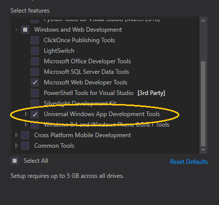

# Configurer votre plateforme UWP sur l’environnement de développement Xbox

La plateforme Windows universelle (UWP) sur l’environnement de développement Xbox se compose d’un ordinateur dédié au développement connecté à une console Xbox One via un réseau local.
Le PC de développement nécessite Visual Studio 2015 Update 3, Visual Studio 2017 ou Visual Studio 2019.
Le PC de développement requiert également Windows 10, la SDK Windows 10 build 14393 ou version ultérieure et une plage de prendre en charge des outils.

Cet article couvre les étapes relatives à la configuration et au test de votre environnement de développement.

## Installation de Visual Studio

1. Installer Visual Studio 2015 Update 3, Visual Studio 2017 ou Visual Studio 2019. Pour en savoir plus et pour l’installation, voir [Téléchargements et outils pour Windows 10](https://dev.windows.com/downloads). Nous vous recommandons d’utiliser la dernière version de Visual Studio afin que vous pouvez recevoir les dernières mises à jour pour les développeurs et de sécurité.

2. Si vous installez Visual Studio 2017 ou Visual Studio 2019, assurez-vous que vous choisissez la **développement de plateforme Windows universelle** charge de travail. Si vous êtes un développeur en C++, assurez-vous de sélectionner également la case **outils de plateforme Windows universelle C++** dans le volet de droite **Résumé**, sous **Développement de plateforme Windows universelle**. Elle ne fait pas partie de l'installation par défaut.

    

    Si vous installez Visual Studio 2015 Update 3, assurez-vous que la case **Outils de développement d’applications Windows universelles** soit cochée.

    

## Installation du Kit de développement logiciel (SDK) Windows 10

Installez la dernière version du Kit SDK Windows 10. Ce kit est fourni avec votre installation de Visual Studio. Mais si vous souhaitez le télécharger séparément, consultez [Kit SDK Windows 10](https://developer.microsoft.com/windows/downloads/windows-10-sdk).

## Activation du mode développeur

Avant de pouvoir développer les applications à partir de votre PC de développement, vous devez activer le mode Développeur. Dans les **Paramètres**, naviguez vers **Mise à jour et sécurité** / **Pour les développeurs**, et sous **Utiliser les fonctionnalités de développeur**, sélectionnez **Mode Développeur**.

## Configuration de votre Xbox One

Avant de pouvoir déployer une application sur votre Xbox One, un utilisateur doit être connecté à la console. Vous pouvez utiliser votre compte Xbox Live existant ou créer un compte pour votre console en mode développeur. 

## Créer votre première application

1. Assurez-vous que l’ordinateur de développement se trouve sur le même réseau local que la console Xbox One cible. En règle générale, cela signifie qu’ils doivent utiliser le même routeur et être sur le même sous-réseau. Une connexion réseau câblée est recommandée.

2. Assurez-vous que votre console Xbox One se trouve en Mode développeur.  Pour plus d’informations, consultez [Activation du mode Développeur Xbox One](devkit-activation.md).

3. Déterminez le langage de programmation que vous voulez utiliser pour votre application UWP.

4. Sur votre PC de développement, dans Visual Studio, sélectionnez **Nouveau / projet**.

5. Dans la fenêtre **Nouveau projet**, sélectionnez **Application Windows universelle / vide (Windows universelle)** .

### Démarrage d’un projet c#

  

1. Dans la boîte de dialogue **Nouveau projet Windows universel**, sélectionnez la build 14393 ou ultérieure dans la liste déroulante **Version minimum**. Dans la liste déroulante **Version cible**, sélectionnez le dernier kit SDK. Si la boîte de dialogue **Mode développeur** s’affiche, cliquez sur **OK**. Une nouvelle application vide est créée.

2. Configurez votre environnement de développement pour le débogage à distance :

    a. Cliquez avec le bouton droit sur le projet dans **Explorateur de solutions**, puis sélectionnez **Propriétés**.

    b. Dans l’onglet **Déboguer**, redéfinissez **Plateforme** sur **x64**. (La plateforme x86 n’est plus prise en charge sur Xbox.)

    c. Sous **Options de démarrage**, définissez **Périphérique cible** sur **Ordinateur distant**.

    d. Dans **Ordinateur distant**, entrez l’adresse IP du système ou le nom d’hôte de la console Xbox One. Pour plus d’informations sur l’obtention de l’adresse IP ou du nom d’hôte, consultez [Présentation des outils Xbox One](introduction-to-xbox-tools.md).

    e. Dans la liste déroulante **Mode d’authentification**, sélectionnez **Universel (protocole non chiffré)** .

    

### Démarrage d’un projet C++

  

1. Dans la boîte de dialogue **Nouveau projet Windows universel**, sélectionnez la build 14393 ou ultérieure dans la liste déroulante **Version minimum**. Dans la liste déroulante **Version cible**, sélectionnez le dernier kit SDK. Si la boîte de dialogue **Mode développeur** s’affiche, cliquez sur **OK**. Une nouvelle application vide est créée.

2. Configurez votre environnement de développement pour le débogage à distance :

   a. Cliquez avec le bouton droit sur le projet dans **Explorateur de solutions**, puis sélectionnez **Propriétés**.

   b. Sur l’onglet **Débogage** et définissez **Débogueur à lancer** sur **Ordinateur distant**.

   c. Dans **Nom de l’ordinateur**, entrez l’adresse IP du système ou le nom d’hôte de la console Xbox One. Pour plus d’informations sur l’obtention de l’adresse IP ou du nom d’hôte, consultez [Présentation des outils Xbox One](introduction-to-xbox-tools.md).

   d. Dans la liste déroulante **Type d’authentification**, sélectionnez **Universel (protocole non chiffré)** .

   e. Dans le menu déroulant **Plateforme**, sélectionnez **x64**.

    

### Jumeler le code confidentiel de votre appareil avec Visual Studio

1. Enregistrez vos paramètres et assurez-vous que votre console Xbox One est en Mode développeur.

2. Une fois votre projet ouvert dans Visual Studio, appuyez sur la touche F5.

3. S’il s’agit de votre premier déploiement, vous obtiendrez une boîte de dialogue issue de Visual Studio vous demandant d’épingler par paire votre appareil.

    a. Pour obtenir un code confidentiel, ouvrez **Dev Home** à partir de l’écran d’accueil sur votre console Xbox One.

    b. Dans l'onglet **Accueil**, sous **Actions rapides**, sélectionnez **Afficher le code confidentiel Visual Studio**.
  
    

    c. Entrez votre code confidentiel dans la boîte de dialogue **Jumeler avec Visual Studio**. Le code confidentiel suivant est juste un exemple. Le vôtre sera différent.

    

    d. Des erreurs de déploiement, le cas échéant, s’afficheront dans la fenêtre **Sortie**.

Félicitations, vous avez correctement créé et déployé votre première application UWP sur Xbox !

## Voir aussi
- [Activation du mode développeur Xbox One](devkit-activation.md)  
- [Téléchargements et outils pour Windows 10](https://developer.microsoft.com/windows/downloads)  
- [Programme Windows Insider](https://go.microsoft.com/fwlink/?LinkId=780552)  
- [Introduction aux outils de Xbox One](introduction-to-xbox-tools.md) 
- [UWP sur Xbox One](index.md)