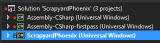

# Unity: Gestion de version de votre projet UWP

Vous n’avez pas encore créé votre jeu Unity pour Xbox à l’aide de la plateforme Windows universelle (UWP)?  Commencez par lire [Intégration de jeux Unity dans UWP sur Xbox](development-lanes-unity.md).

Plusieurs raisons peuvent motiver votre volonté d’ajouter des parties de votre répertoire UWP généré à la gestion de version, notamment l’ajout de dépendances (par exemple, le Kit SDK XboxLive).  Nous allons utiliser ce scénario comme exemple dans le cadre de ce didacticiel, et nous espérons qu’il vous sera utile pour répondre aux besoins spécifiques de votre projet.

***Exclusion de responsabilité: nous allons utiliser Git comme solution de gestion de version.  Si votre cas de figure est différent, les concepts doivent tout de même s’appliquer.***

Pour vous rafraîchir la mémoire, voici comment se présente actuellement le répertoire de notre jeu, ***ScrapyardPhoenix***:

Et voici à quoi ressemble notre répertoire UWP:

Dans ce répertoire, un seul dossier nous intéresse: le dossier ***ScrapyardPhoenix*** (insérez le nom de votre jeu ici).  Tous les autres éléments peuvent être ignorés dans notre gestion de version.

***Vous ne savez pas ce qu’est un fichier .gitignore?  Voir [gitignore](https://git-scm.com/docs/gitignore).***

    ##################################################################
    # The original .gitignore file can be found at
    # https://github.com/github/gitignore/blob/master/Unity.gitignore
    ##################################################################

    # standard ignores for a Unity Project
    ...

    # ignore the whole UWP directory
    /UWP/**

    # except we want to keep... (this line will be modified and removed further down)
    !/UWP/ScrapyardPhoenix/

Nous allons sélectionner quelques fichiers et dossiers différents dans le dossier **UWP/ScrapyardPhoenix** à ajouter à notre gestion de version.  Tout d’abord, examinons la chose dans son intégralité et en détail:

  

## Dossiers  

`Assets` | ***Inclure*** | Contient des images de Microsoft Store  
`Data`   | ***Ignorer*** | Où Unity compile votre projet (scènes, nuanceurs, Scripts, préfabriqués, etc.).  
`Dependencies` | ***Inclure*** | Ce dossier est j’ai créé pour conserver toutes les dépendances UWP (par exemple, XboxLiveSDK.dll)  
`Properties` | ***Inclure*** | Contient des paramètres plus avancés qui peuvent être modifiées par le développeur  
`Unprocessed` | ***Ignorer*** | Contient Unity `.dll` et `.pdb` fichiers  

## Fichiers  

`App.cs` | ***Inclure*** | Point d’entrée de votre application UWP. Cela peut être modifié et étendu avec d’autres fichiers sources  
`Package.appxmanifest` | ***Inclure*** | Fichier source du manifeste du package d’application pour votre AppX  
`project.json` | ***Inclure*** | Décrit les packages NuGet votre `*.csproj` dépend  
`ScrapyardPhoenix.csproj` | ***Inclure*** | Décrit la cible de votre build UWP; Si vous ajoutez des dépendances supplémentaires à votre UWP projet, ce `*.csproj` fichier contiendra ces informations  
`ScrapyardPhoenix.csproj.user` | ***Ignorer*** | Ce fichier contient des informations d’utilisateur local

## Fichier .gitignore obtenu

    ##################################################################
    # The original .gitignore file can be found at
    # https://github.com/github/gitignore/blob/master/Unity.gitignore
    ##################################################################

    # standard ignores for a Unity Project
    ...

    # ignore the whole UWP directory
    /UWP/**

    # except we want to keep...
    !/UWP/ScrapyardPhoenix/Assets/*
    !/UWP/ScrapyardPhoenix/Dependencies/*
    !/UWP/ScrapyardPhoenix/Properties/*
    !/UWP/ScrapyardPhoenix/App.cs
    !/UWP/ScrapyardPhoenix/Package.appxmanifest
    !/UWP/ScrapyardPhoenix/project.json
    !/UWP/ScrapyardPhoenix/ScrapyardPhoenix.csproj

Et voilà, maintenant vos coéquipiers seront synchronisés avec le projet UWP que vous avez généré. Maintenant, n’hésitez pas à ajouter des ressources, sources et dépendances supplémentaires à votre projet UWP.

Quelques exemples supplémentaires de gestion de version du dossier UWP sont disponibles [ici](https://bitbucket.org/Unity-Technologies/windowsstoreappssamples/overview).

## Ajout de dépendances à votre application UWP

Ajoutez des dépendances à des DLL et des WINMD en les plaçant dans votre dossier **Unity Assets** sous un dossier **Plugins**, puis sélectionnez-les et définissez correctement les paramètres de leur plateforme cible dans l’inspecteur.

***ScrapyardPhoenix (Windows universel)*** est le projet auquel vous ajoutez une référence, par exemple, le Kit SDK XboxLive.

## Voir également
- [Intégration de jeux existants dansXbox](development-lanes-landing.md)
- [UWP sur XboxOne](index.md)
