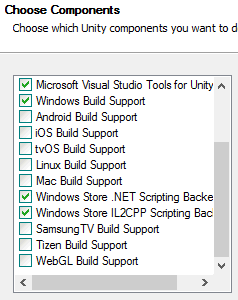
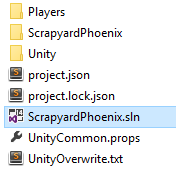

# Intégration de jeux Unity dans UWP sur Xbox

Dans ce didacticiel détaillé, nous supposons que vous disposez déjà d’un jeu dans Unity, prêt à être créé et déployé.

Voir aussi une [version vidéo de ce didacticiel](https://www.youtube.com/watch?v=f0Ptvw7k-CE).

Vous cherchez à créer une version de votre projet UWP Unity? Voir [Unity: Gestion de version de votre projet UWP](development-lanes-unity-versioning.md).

## Étape0: s’assurer que Unity est correctement installé

Les composants suivants doivent être sélectionnés lors de l’installation d’Unity:

## Étape1: générer la solution UWP

Dans votre projet de jeu Unity, ouvrez la fenêtre **Paramètres de génération**, qui se trouve dans **Fichier -&gt; Paramètres de build**, puis accédez au menu Options du Microsoft Store.

Assurez-vous que le paramètre **SDK** est défini sur **Universel10**. Cliquez ensuite sur le bouton **Générer** pour ouvrir une fenêtre Explorateur de fichiers qui vous demande un dossier de destination. Créez un dossier nommé **UWP** dans le répertoire **Assets** de votre projet et choisissez-le comme dossier de destination de la build.

Unity a ainsi créé une solution VisualStudio que nous utiliserons pour déployer votre jeu UWP.

## Étape2: déployer votre jeu

Ouvrez la solution qui vient d’être créée dans le dossier **UWP**, puis modifiez la plateforme cible en **x64**.

À présent que vous disposez d’une solution VisualStudioUWP pour votre jeu, [suivez ces étapes](getting-started.md) pour déployer correctement votre jeu vers votre XboxOne achetée au détail!

## Étape 3: modifier et régénérer

Si des modifications sont apportées à des éléments ne figurant pas dans le script, pour que ces modifications s’affichent dans la buildUWP de votre jeu, le projet doit être régénéré à partir de l’éditeur (comme décrit à l’__Étape1__).

## Gestion de version de votre projetUWP

Il existe quelques situations courantes où l’ajout de parties de ce répertoire UWP nouvellement créé à la gestion de version devient nécessaire. Par exemple, si vous ajoutez une nouvelle dépendance au projet UWP (par exemple, le Kit SDK Xbox Live).  Cet exemple est étudié en détail dans [Unity: Gestion de version de votre projet UWP](development-lanes-unity-versioning.md).

## Voir également
- [Intégration de jeux existants dansXbox](development-lanes-landing.md)
- [UWP sur XboxOne](index.md)
